# 报告前端组件

<cite>
**本文档引用的文件**
- [package.json](file://fund-web/package.json)
- [App.tsx](file://fund-web/src/App.tsx)
- [main.tsx](file://fund-web/src/main.tsx)
- [README.md](file://fund-web/README.md)
- [PRD.md](file://PRD.md)
- [AppLayout.tsx](file://fund-web/src/components/AppLayout.tsx)
- [SearchBar.tsx](file://fund-web/src/components/SearchBar.tsx)
- [MarketOverviewCard.tsx](file://fund-web/src/components/MarketOverviewCard.tsx)
- [RiskWarningCard.tsx](file://fund-web/src/components/RiskWarningCard.tsx)
- [RebalanceTimingCard.tsx](file://fund-web/src/components/RebalanceTimingCard.tsx)
- [Dashboard/index.tsx](file://fund-web/src/pages/Dashboard/index.tsx)
- [FundDetail.tsx](file://fund-web/src/pages/Fund/FundDetail.tsx)
- [Portfolio/index.tsx](file://fund-web/src/pages/Portfolio/index.tsx)
- [Analysis/index.tsx](file://fund-web/src/pages/Analysis/index.tsx)
- [DiagnosisTab.tsx](file://fund-web/src/pages/Fund/DiagnosisTab.tsx)
- [useFundData.ts](file://fund-web/src/hooks/useFundData.ts)
- [format.ts](file://fund-web/src/utils/format.ts)
- [client.ts](file://fund-web/src/api/client.ts)
- [fund.ts](file://fund-web/src/api/fund.ts)
- [dashboard.ts](file://fund-web/src/api/dashboard.ts)
- [searchStore.ts](file://fund-web/src/store/searchStore.ts)
</cite>

## 更新摘要
**变更内容**
- 系统名称从"AI前端组件"重命名为"报告前端组件"
- 新增MarketOverviewCard、RiskWarningCard、RebalanceTimingCard三个可视化组件
- Dashboard页面重构为报告驱动的可视化布局
- 移除AI分析相关的前端组件
- 更新API接口定义以支持新的报告功能

## 目录
1. [简介](#简介)
2. [项目结构](#项目结构)
3. [核心组件](#核心组件)
4. [架构总览](#架构总览)
5. [详细组件分析](#详细组件分析)
6. [依赖关系分析](#依赖关系分析)
7. [性能考虑](#性能考虑)
8. [故障排除指南](#故障排除指南)
9. [结论](#结论)

## 简介
本项目是一个基于 React + TypeScript 的前端应用，采用 Vite 构建，服务于「基金管家」产品。其核心目标是为用户提供一站式基金数据聚合与管理体验，涵盖首页仪表盘、基金查询与详情、持仓管理、收益分析、自选基金以及工具箱等功能模块。应用通过 Ant Design 提供企业级 UI 组件，结合 ECharts 进行金融数据可视化，并使用 React Query 进行数据缓存与状态管理，Zustand 管理轻量级前端状态。

**更新** 系统现已重命名为"报告前端组件"，专注于提供专业的基金分析报告和可视化展示。

## 项目结构
前端项目位于 fund-web 目录，采用按功能域划分的组织方式：
- src/api：封装与后端交互的 API 客户端与接口类型
- src/components：可复用的 UI 组件（布局、搜索、价格变化指示等）
- src/pages：页面级组件（Dashboard、Fund、Portfolio 等）
- src/hooks：基于 React Query 的数据钩子
- src/utils：格式化工具与主题配置
- src/store：基于 Zustand 的轻量状态管理
- src/main.tsx 与 src/App.tsx：应用入口与路由配置
- package.json：依赖与脚本配置

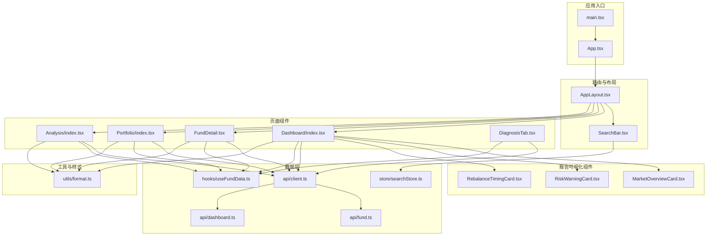

**图表来源**
- [main.tsx:1-29](file://fund-web/src/main.tsx#L1-L29)
- [App.tsx:1-67](file://fund-web/src/App.tsx#L1-L67)
- [AppLayout.tsx:1-129](file://fund-web/src/components/AppLayout.tsx#L1-L129)
- [MarketOverviewCard.tsx:1-238](file://fund-web/src/components/MarketOverviewCard.tsx#L1-L238)
- [RiskWarningCard.tsx:1-229](file://fund-web/src/components/RiskWarningCard.tsx#L1-L229)
- [RebalanceTimingCard.tsx:1-231](file://fund-web/src/components/RebalanceTimingCard.tsx#L1-L231)
- [Dashboard/index.tsx:1-230](file://fund-web/src/pages/Dashboard/index.tsx#L1-L230)
- [FundDetail.tsx:1-393](file://fund-web/src/pages/Fund/FundDetail.tsx#L1-L393)
- [Portfolio/index.tsx:1-273](file://fund-web/src/pages/Portfolio/index.tsx#L1-L273)
- [Analysis/index.tsx:1-320](file://fund-web/src/pages/Analysis/index.tsx#L1-L320)
- [DiagnosisTab.tsx:1-306](file://fund-web/src/pages/Fund/DiagnosisTab.tsx#L1-L306)
- [client.ts:1-72](file://fund-web/src/api/client.ts#L1-L72)
- [fund.ts:1-133](file://fund-web/src/api/fund.ts#L1-L133)
- [dashboard.ts:1-224](file://fund-web/src/api/dashboard.ts#L1-L224)
- [useFundData.ts:1-131](file://fund-web/src/hooks/useFundData.ts#L1-L131)
- [searchStore.ts:1-15](file://fund-web/src/store/searchStore.ts#L1-L15)
- [format.ts:1-61](file://fund-web/src/utils/format.ts#L1-L61)

**章节来源**
- [package.json:1-40](file://fund-web/package.json#L1-L40)
- [README.md:1-74](file://fund-web/README.md#L1-L74)

## 核心组件
- 应用入口与主题配置：在 main.tsx 中创建 QueryClient 并注入主题；App.tsx 配置路由与全局主题。
- 布局与导航：AppLayout 提供头部搜索栏与侧边菜单，统一承载各页面。
- 报告可视化组件：MarketOverviewCard 提供市场概览，RiskWarningCard 展示风险预警，RebalanceTimingCard 给出调仓时机建议。
- 页面组件：Dashboard 负责首页资产概览与收益趋势；FundDetail 展示基金详情与估值分析；Portfolio 管理持仓与交易记录；Analysis 提供收益分析；DiagnosisTab 展示基金诊断报告。
- 数据层：client.ts 封装 axios，统一拦截请求/响应与错误处理；fund.ts 和 dashboard.ts 定义接口类型；useFundData.ts 提供 React Query 钩子。
- 工具函数：format.ts 提供金额、百分比、净值与颜色映射等格式化逻辑。
- 状态管理：searchStore.ts 使用 Zustand 管理搜索关键词与结果。

**章节来源**
- [main.tsx:1-29](file://fund-web/src/main.tsx#L1-L29)
- [App.tsx:1-67](file://fund-web/src/App.tsx#L1-L67)
- [AppLayout.tsx:1-129](file://fund-web/src/components/AppLayout.tsx#L1-L129)
- [MarketOverviewCard.tsx:1-238](file://fund-web/src/components/MarketOverviewCard.tsx#L1-L238)
- [RiskWarningCard.tsx:1-229](file://fund-web/src/components/RiskWarningCard.tsx#L1-L229)
- [RebalanceTimingCard.tsx:1-231](file://fund-web/src/components/RebalanceTimingCard.tsx#L1-L231)
- [Dashboard/index.tsx:1-230](file://fund-web/src/pages/Dashboard/index.tsx#L1-L230)
- [FundDetail.tsx:1-393](file://fund-web/src/pages/Fund/FundDetail.tsx#L1-L393)
- [Portfolio/index.tsx:1-273](file://fund-web/src/pages/Portfolio/index.tsx#L1-L273)
- [Analysis/index.tsx:1-320](file://fund-web/src/pages/Analysis/index.tsx#L1-L320)
- [DiagnosisTab.tsx:1-306](file://fund-web/src/pages/Fund/DiagnosisTab.tsx#L1-L306)
- [client.ts:1-72](file://fund-web/src/api/client.ts#L1-L72)
- [fund.ts:1-133](file://fund-web/src/api/fund.ts#L1-L133)
- [dashboard.ts:1-224](file://fund-web/src/api/dashboard.ts#L1-L224)
- [useFundData.ts:1-131](file://fund-web/src/hooks/useFundData.ts#L1-L131)
- [format.ts:1-61](file://fund-web/src/utils/format.ts#L1-L61)
- [searchStore.ts:1-15](file://fund-web/src/store/searchStore.ts#L1-L15)

## 架构总览
应用采用「页面组件 + 报告可视化组件 + 数据钩子 + API 客户端」四层架构：
- 页面组件负责业务展示与交互；
- 报告可视化组件提供专业的数据分析和建议；
- 数据钩子通过 React Query 管理缓存、刷新与失效；
- API 客户端封装 axios，统一处理请求参数、响应校验与错误提示。

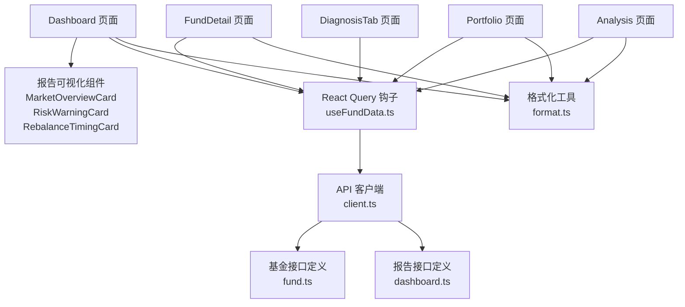

**图表来源**
- [Dashboard/index.tsx:1-230](file://fund-web/src/pages/Dashboard/index.tsx#L1-L230)
- [MarketOverviewCard.tsx:1-238](file://fund-web/src/components/MarketOverviewCard.tsx#L1-L238)
- [RiskWarningCard.tsx:1-229](file://fund-web/src/components/RiskWarningCard.tsx#L1-L229)
- [RebalanceTimingCard.tsx:1-231](file://fund-web/src/components/RebalanceTimingCard.tsx#L1-L231)
- [FundDetail.tsx:1-393](file://fund-web/src/pages/Fund/FundDetail.tsx#L1-L393)
- [Portfolio/index.tsx:1-273](file://fund-web/src/pages/Portfolio/index.tsx#L1-L273)
- [Analysis/index.tsx:1-320](file://fund-web/src/pages/Analysis/index.tsx#L1-L320)
- [DiagnosisTab.tsx:1-306](file://fund-web/src/pages/Fund/DiagnosisTab.tsx#L1-L306)
- [useFundData.ts:1-131](file://fund-web/src/hooks/useFundData.ts#L1-L131)
- [client.ts:1-72](file://fund-web/src/api/client.ts#L1-L72)
- [fund.ts:1-133](file://fund-web/src/api/fund.ts#L1-L133)
- [dashboard.ts:1-224](file://fund-web/src/api/dashboard.ts#L1-L224)
- [format.ts:1-61](file://fund-web/src/utils/format.ts#L1-L61)

## 详细组件分析

### 应用入口与主题配置
- main.tsx 创建 QueryClient 并设置默认选项（staleTime、retry、refetchOnWindowFocus），随后渲染 App。
- App.tsx 配置 ConfigProvider 主题与语言包，BrowserRouter 管理路由，AppLayout 作为根布局包裹各页面。

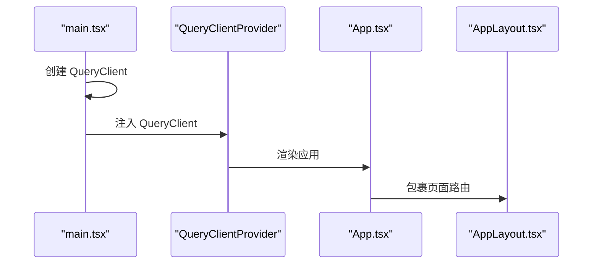

**图表来源**
- [main.tsx:1-29](file://fund-web/src/main.tsx#L1-L29)
- [App.tsx:1-67](file://fund-web/src/App.tsx#L1-L67)

**章节来源**
- [main.tsx:1-29](file://fund-web/src/main.tsx#L1-L29)
- [App.tsx:1-67](file://fund-web/src/App.tsx#L1-L67)

### 布局与导航组件
- AppLayout 提供头部品牌区与搜索栏，左侧菜单与路由路径对应，支持根据当前路径高亮选中项。
- SearchBar 在输入时进行防抖搜索，支持键盘回车跳转搜索结果页。

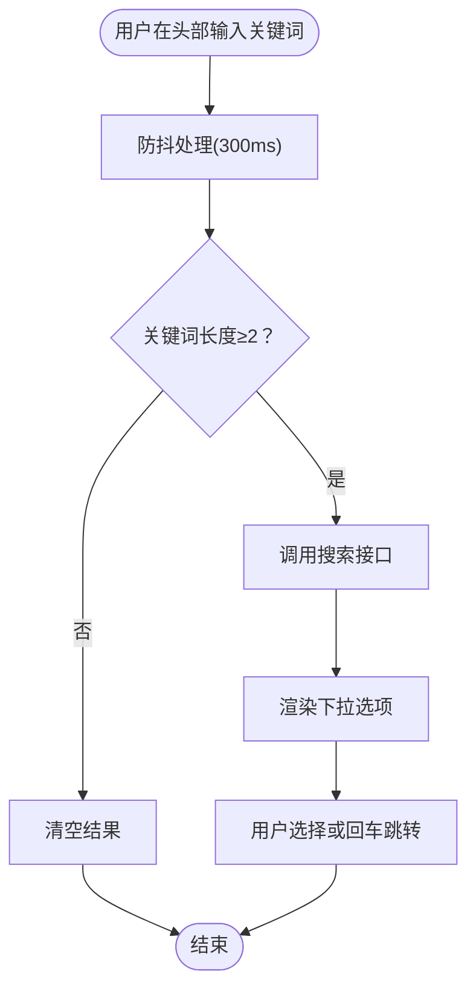

**图表来源**
- [AppLayout.tsx:1-129](file://fund-web/src/components/AppLayout.tsx#L1-L129)
- [SearchBar.tsx:1-98](file://fund-web/src/components/SearchBar.tsx#L1-L98)

**章节来源**
- [AppLayout.tsx:1-129](file://fund-web/src/components/AppLayout.tsx#L1-L129)
- [SearchBar.tsx:1-98](file://fund-web/src/components/SearchBar.tsx#L1-L98)

### 报告可视化组件

#### 市场概览卡片（MarketOverviewCard）
- 展示大盘指数、领涨/领跌板块和持仓影响分析。
- 支持市场情绪（积极/谨慎/中性）的可视化展示。
- 提供实时更新的时间戳和简洁的布局设计。

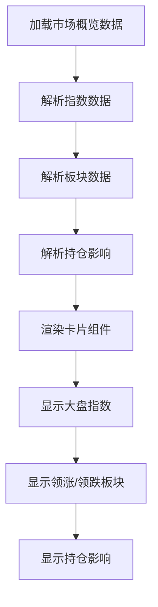

**图表来源**
- [MarketOverviewCard.tsx:19-31](file://fund-web/src/components/MarketOverviewCard.tsx#L19-L31)
- [MarketOverviewCard.tsx:85-87](file://fund-web/src/components/MarketOverviewCard.tsx#L85-L87)

**章节来源**
- [MarketOverviewCard.tsx:1-238](file://fund-web/src/components/MarketOverviewCard.tsx#L1-L238)

#### 风险预警卡片（RiskWarningCard）
- 提供整体风险等级评估和健康指标分析。
- 展示具体的风险项目和优化建议。
- 支持不同风险级别的可视化标识。

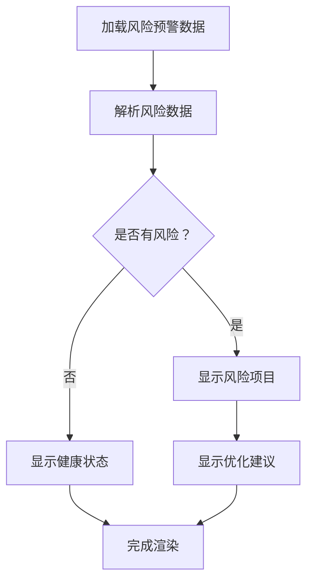

**图表来源**
- [RiskWarningCard.tsx:12-24](file://fund-web/src/components/RiskWarningCard.tsx#L12-L24)
- [RiskWarningCard.tsx:76-77](file://fund-web/src/components/RiskWarningCard.tsx#L76-L77)

**章节来源**
- [RiskWarningCard.tsx:1-229](file://fund-web/src/components/RiskWarningCard.tsx#L1-L229)

#### 调仓时机卡片（RebalanceTimingCard）
- 提供调仓提醒和持仓建议。
- 展示市场情绪和风险提醒。
- 支持优先级标记和调整方向标识。

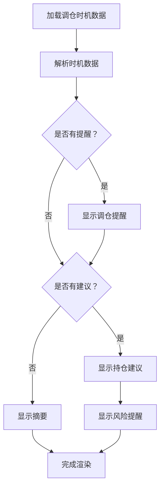

**图表来源**
- [RebalanceTimingCard.tsx:22-34](file://fund-web/src/components/RebalanceTimingCard.tsx#L22-L34)
- [RebalanceTimingCard.tsx:93-95](file://fund-web/src/components/RebalanceTimingCard.tsx#L93-L95)

**章节来源**
- [RebalanceTimingCard.tsx:1-231](file://fund-web/src/components/RebalanceTimingCard.tsx#L1-L231)

### 首页仪表盘（Dashboard）
- 并行加载资产概览与收益趋势，减少首屏等待时间。
- **更新** 使用报告可视化组件替代原有的AI智能分析区域。
- 支持金额隐藏与收益趋势天数切换，集成 ECharts 展示柱状图。
- 通过 useFundData 的 useDashboardData 与 useProfitTrend 管理数据刷新与缓存。

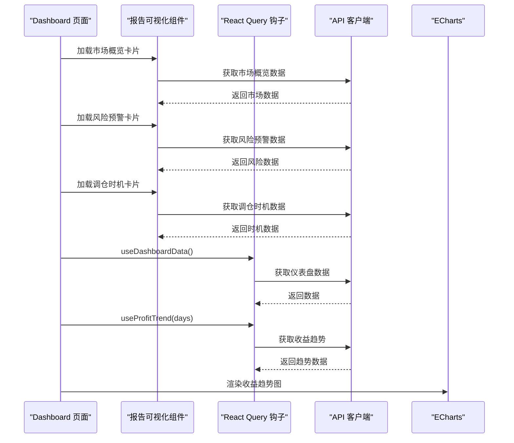

**图表来源**
- [Dashboard/index.tsx:126-137](file://fund-web/src/pages/Dashboard/index.tsx#L126-L137)
- [Dashboard/index.tsx:24-53](file://fund-web/src/pages/Dashboard/index.tsx#L24-L53)
- [useFundData.ts:1-131](file://fund-web/src/hooks/useFundData.ts#L1-L131)
- [client.ts:1-72](file://fund-web/src/api/client.ts#L1-L72)

**章节来源**
- [Dashboard/index.tsx:1-230](file://fund-web/src/pages/Dashboard/index.tsx#L1-L230)
- [useFundData.ts:1-131](file://fund-web/src/hooks/useFundData.ts#L1-L131)

### 基金详情页（FundDetail）
- 展示净值走势、历史业绩、十大重仓股、行业分布、基金经理与费率等信息。
- 支持估值数据源切换与手动刷新，集成 ECharts 展示净值曲线与行业饼图。
- 通过 useFundData 的 useFundDetail 管理详情数据缓存与刷新。

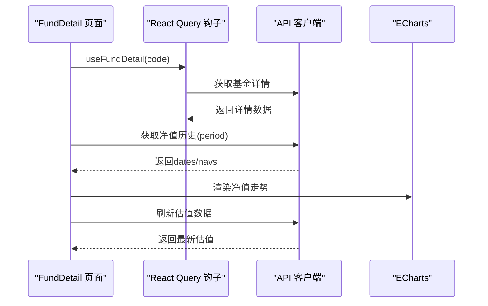

**图表来源**
- [FundDetail.tsx:1-393](file://fund-web/src/pages/Fund/FundDetail.tsx#L1-L393)
- [useFundData.ts:1-131](file://fund-web/src/hooks/useFundData.ts#L1-L131)
- [client.ts:1-72](file://fund-web/src/api/client.ts#L1-L72)

**章节来源**
- [FundDetail.tsx:1-393](file://fund-web/src/pages/Fund/FundDetail.tsx#L1-L393)
- [useFundData.ts:1-131](file://fund-web/src/hooks/useFundData.ts#L1-L131)

### 持仓管理页（Portfolio）
- 展示总市值、总收益与收益率，支持按账户筛选与行业分布饼图。
- 提供添加交易记录弹窗，支持买入/卖出/分红类型与日期选择。
- 通过 useFundData 的 usePositions 与账户 API 管理持仓与账户数据。

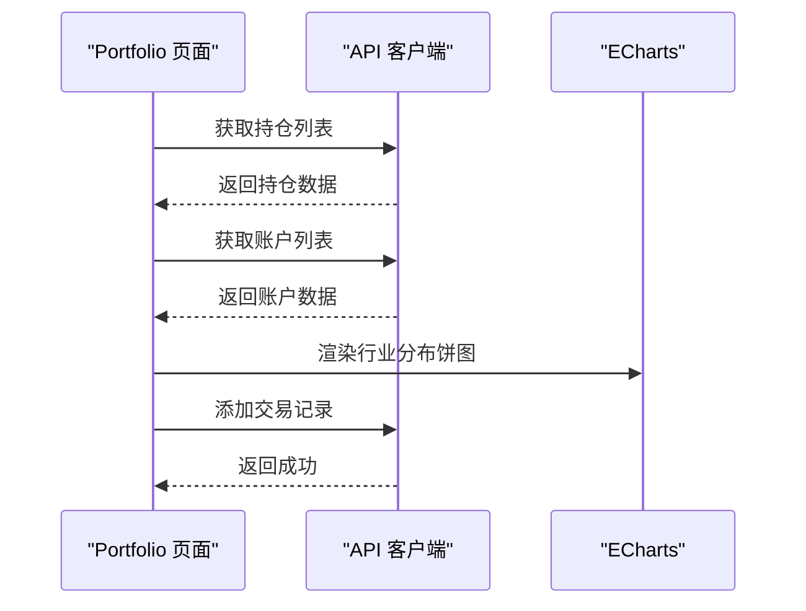

**图表来源**
- [Portfolio/index.tsx:1-273](file://fund-web/src/pages/Portfolio/index.tsx#L1-L273)
- [client.ts:1-72](file://fund-web/src/api/client.ts#L1-L72)

**章节来源**
- [Portfolio/index.tsx:1-273](file://fund-web/src/pages/Portfolio/index.tsx#L1-L273)

### 收益分析页（Analysis）
- 提供多维度的投资收益分析，包括收益曲线、每日收益和回撤分析。
- 支持时间段切换（30/60/90天）和统计指标展示。
- 集成 ECharts 进行专业的金融数据可视化。

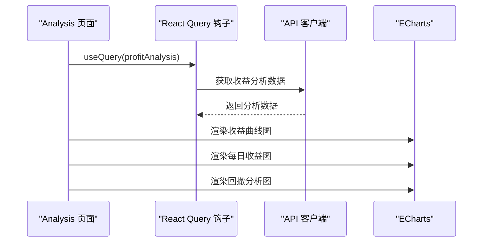

**图表来源**
- [Analysis/index.tsx:13-17](file://fund-web/src/pages/Analysis/index.tsx#L13-L17)
- [Analysis/index.tsx:28-162](file://fund-web/src/pages/Analysis/index.tsx#L28-L162)

**章节来源**
- [Analysis/index.tsx:1-320](file://fund-web/src/pages/Analysis/index.tsx#L1-L320)

### 基金诊断页（DiagnosisTab）
- **更新** 展示专业的基金诊断报告，包含综合评分、多维度评分和详细分析。
- 提供估值分析、业绩分析、风险分析和持仓建议。
- 支持风险提示和适合/不适合人群的展示。

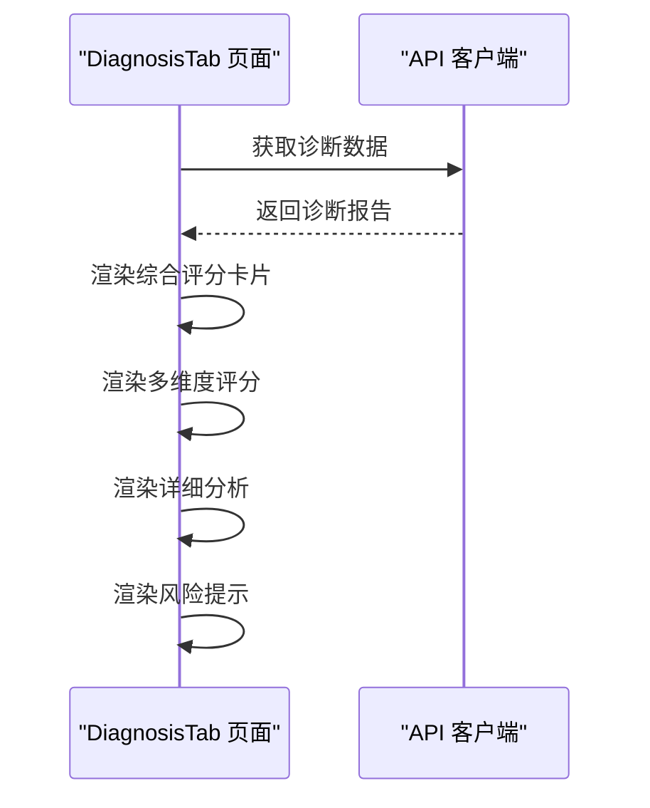

**图表来源**
- [DiagnosisTab.tsx:18-31](file://fund-web/src/pages/Fund/DiagnosisTab.tsx#L18-L31)
- [DiagnosisTab.tsx:94-302](file://fund-web/src/pages/Fund/DiagnosisTab.tsx#L94-L302)

**章节来源**
- [DiagnosisTab.tsx:1-306](file://fund-web/src/pages/Fund/DiagnosisTab.tsx#L1-L306)

### 数据层与状态管理
- API 客户端：统一设置 baseURL、超时时间，拦截请求/响应并记录日志，校验返回 code，错误时统一提示。
- 接口定义：fund.ts 定义搜索、详情、净值历史、估值源与诊断报告等接口类型；dashboard.ts 定义市场概览、风险预警、调仓时机等报告接口类型。
- React Query 钩子：集中管理查询键、缓存时间、刷新间隔与失效策略。
- 轻量状态：searchStore.ts 管理搜索关键词与结果，便于跨组件共享。

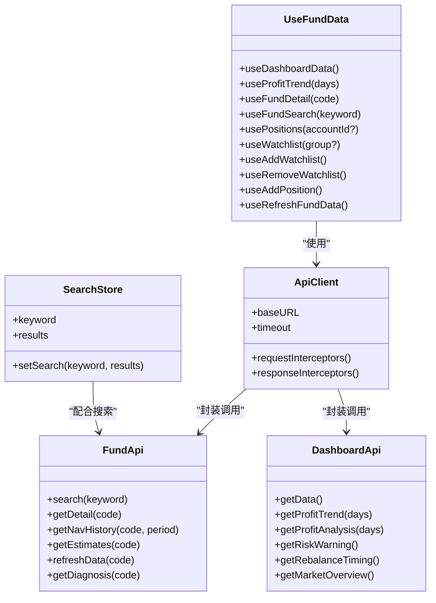

**图表来源**
- [client.ts:1-72](file://fund-web/src/api/client.ts#L1-L72)
- [fund.ts:113-132](file://fund-web/src/api/fund.ts#L113-L132)
- [dashboard.ts:202-223](file://fund-web/src/api/dashboard.ts#L202-L223)
- [useFundData.ts:1-131](file://fund-web/src/hooks/useFundData.ts#L1-L131)
- [searchStore.ts:1-15](file://fund-web/src/store/searchStore.ts#L1-L15)

**章节来源**
- [client.ts:1-72](file://fund-web/src/api/client.ts#L1-L72)
- [fund.ts:1-133](file://fund-web/src/api/fund.ts#L1-L133)
- [dashboard.ts:1-224](file://fund-web/src/api/dashboard.ts#L1-L224)
- [useFundData.ts:1-131](file://fund-web/src/hooks/useFundData.ts#L1-L131)
- [searchStore.ts:1-15](file://fund-web/src/store/searchStore.ts#L1-L15)

## 依赖关系分析
- 依赖管理：package.json 中包含 React、Ant Design、ECharts、React Router、React Query、Zustand、Axios 等核心依赖。
- 开发工具：Vite、ESLint、TypeScript 插件等。
- 产品需求：PRD.md 定义了功能架构、页面清单、配色方案与交互规范，指导前端实现。

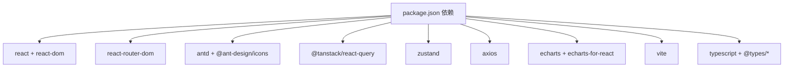

**图表来源**
- [package.json:1-40](file://fund-web/package.json#L1-L40)

**章节来源**
- [package.json:1-40](file://fund-web/package.json#L1-L40)
- [README.md:1-74](file://fund-web/README.md#L1-L74)
- [PRD.md:1-488](file://PRD.md#L1-L488)

## 性能考虑
- 数据缓存与刷新：QueryClient 默认 staleTime 与 refetchInterval 设置，减少重复请求；React Query 钩子针对不同页面设置合理的缓存时间与刷新策略。
- 防抖搜索：SearchBar 对输入进行防抖处理，降低频繁请求压力。
- 图表渲染：ECharts 仅在数据就绪时渲染，避免空数据导致的无效绘制。
- 骨架屏：页面在加载时使用骨架屏组件，提升感知性能。
- **更新** 报告可视化组件采用懒加载和条件渲染，仅在数据可用时显示。
- 资源优化：Vite 构建优化与按需加载策略，结合 Ant Design 的主题定制减少冗余样式。

## 故障排除指南
- 请求拦截器错误：检查请求拦截器中的日志记录与错误分支，确保 baseURL 与超时配置正确。
- 响应拦截器错误：当返回 code 非 200 或网络异常时，统一通过 message 提示错误信息；检查后端接口返回结构与状态码。
- 查询失效：使用 React Query 的 invalidateQueries 触发相关查询刷新，确保数据一致性。
- 搜索无结果：确认关键词长度阈值与防抖时间设置，检查接口返回的数据结构。
- **更新** 报告组件加载失败：检查对应的 dashboard API 接口是否正常，确认数据格式符合预期。

**章节来源**
- [client.ts:1-72](file://fund-web/src/api/client.ts#L1-L72)
- [useFundData.ts:1-131](file://fund-web/src/hooks/useFundData.ts#L1-L131)

## 结论
本前端组件以清晰的分层架构与完善的工具链支撑「基金管家」的核心功能，通过 React Query 实现高效的数据缓存与刷新，借助 Ant Design 与 ECharts 提供一致的用户体验与专业的金融可视化能力。**更新** 新增的报告可视化组件为用户提供了专业的市场概览、风险预警和调仓建议，使前端在性能、可维护性与用户体验方面均具备良好基础，适合进一步扩展分析能力与工具箱功能。