# AI命令行接口

<cite>
**本文档引用的文件**
- [FundCliApplication.java](file://src/main/java/com/qoder/fund/cli/FundCliApplication.java)
- [CliTableFormatter.java](file://src/main/java/com/qoder/fund/cli/util/CliTableFormatter.java)
- [FundCommand.java](file://src/main/java/com/qoder/fund/cli/FundCommand.java)
- [PositionCommand.java](file://src/main/java/com/qoder/fund/cli/PositionCommand.java)
- [WatchlistCommand.java](file://src/main/java/com/qoder/fund/cli/WatchlistCommand.java)
- [DashboardCommand.java](file://src/main/java/com/qoder/fund/cli/DashboardCommand.java)
- [AccountCommand.java](file://src/main/java/com/qoder/fund/cli/AccountCommand.java)
- [SyncCommand.java](file://src/main/java/com/qoder/fund/cli/SyncCommand.java)
- [ReportCommand.java](file://src/main/java/com/qoder/fund/cli/ReportCommand.java)
- [application-cli.yml](file://src/main/resources/application-cli.yml)
- [pom.xml](file://pom.xml)
- [README.md](file://README.md)
- [CliPositionIndicatorDTO.java](file://src/main/java/com/qoder/fund/dto/CliPositionIndicatorDTO.java)
- [MarketOverviewDTO.java](file://src/main/java/com/qoder/fund/dto/MarketOverviewDTO.java)
- [FundDiagnosisDTO.java](file://src/main/java/com/qoder/fund/dto/FundDiagnosisDTO.java)
- [PositionRiskWarningDTO.java](file://src/main/java/com/qoder/fund/dto/PositionRiskWarningDTO.java)
- [MarketOverviewService.java](file://src/main/java/com/qoder/fund/service/MarketOverviewService.java)
- [FundDiagnosisService.java](file://src/main/java/com/qoder/fund/service/FundDiagnosisService.java)
- [PositionRiskWarningService.java](file://src/main/java/com/qoder/fund/service/PositionRiskWarningService.java)
- [Fund.java](file://src/main/java/com/qoder/fund/entity/Fund.java)
- [Position.java](file://src/main/java/com/qoder/fund/entity/Position.java)
- [Account.java](file://src/main/java/com/qoder/fund/entity/Account.java)
- [Watchlist.java](file://src/main/java/com/qoder/fund/entity/Watchlist.java)
- [AGENTS.md](file://AGENTS.md)
</cite>

## 更新摘要
**变更内容**
- 将原有的AiCommand类重命名为ReportCommand类，移除了AI焦点的命名约定
- ReportCommand提供纯客观数据输出的CLI接口，专为外部Agent设计
- 移除了所有主观建议和AI分析功能，仅输出事实性指标
- 新增了四个子命令：market、diagnose、risk、positions
- 系统从AI命令行接口演进为报告命令行接口，专门服务于外部Agent的数据需求
- **新增** 市场概览输出功能，支持大盘指数和板块涨跌分析
- **新增** 风险报告的高级分析功能，提供组合级风险评估
- **新增** 更多维度的投资组合分析指标，包括重仓股表现和预估可靠性

## 目录
1. [简介](#简介)
2. [项目结构](#项目结构)
3. [核心组件](#核心组件)
4. [架构概览](#架构概览)
5. [详细组件分析](#详细组件分析)
6. [依赖关系分析](#依赖关系分析)
7. [性能考虑](#性能考虑)
8. [故障排除指南](#故障排除指南)
9. [结论](#结论)

## 简介

报告命令行接口是一个基于Spring Boot和Picocli构建的现代化CLI工具，专为基金管理和数据分析而设计。该项目提供了完整的命令行解决方案，支持基金查询、持仓管理、自选基金跟踪、资产概览、数据同步和面向外部Agent的数据分析报告。

**更新** 系统现已从AI焦点转向纯客观数据输出，ReportCommand类替代了原有的AiCommand类，专门设计为外部Agent提供纯数据接口，不包含任何主观建议。

该系统的核心特点包括：
- **多模式支持**：同时支持Web模式和CLI模式运行
- **数据聚合**：整合多个数据源提供全面的基金信息
- **智能分析**：提供专业的收益分析和风险评估
- **Agent友好**：专门设计的JSON输出格式供AI代理使用
- **定时任务**：内置数据同步和估值预测功能
- **纯客观数据**：ReportCommand仅输出事实性指标，不包含主观建议
- **增强的报告功能**：新增市场概览、风险分析和投资组合指标输出

## 项目结构

项目采用标准的Maven多模块结构，主要分为后端核心和前端Web应用两大部分：

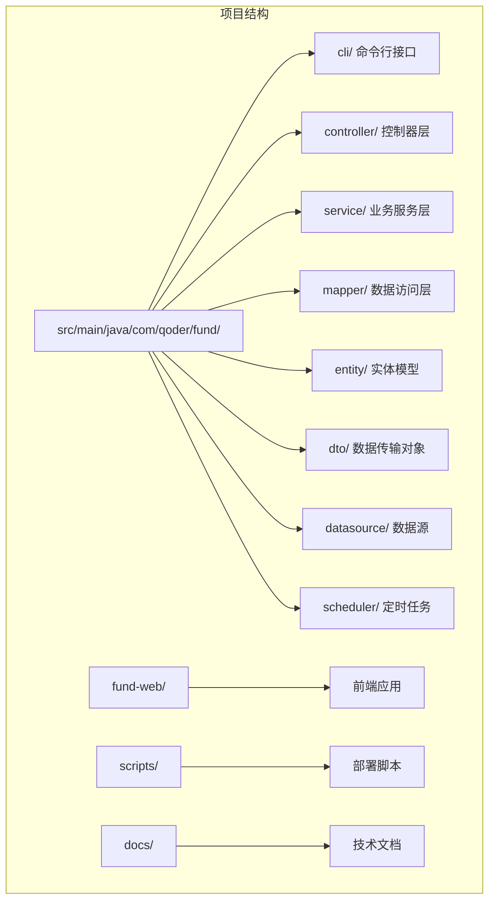
```mermaid
graph TB
subgraph "项目结构"
A[src/main/java/com/qoder/fund/] --> B[cli/ 命令行接口]
A --> C[controller/ 控制器层]
A --> D[service/ 业务服务层]
A --> E[mapper/ 数据访问层]
A --> F[entity/ 实体模型]
A --> G[dto/ 数据传输对象]
A --> H[datasource/ 数据源]
A --> I[scheduler/ 定时任务]
J[fund-web/] --> K[前端应用]
L[scripts/] --> M[部署脚本]
N[docs/] --> O[技术文档]
end
```

**图表来源**
- [FundCliApplication.java:1-225](file://src/main/java/com/qoder/fund/cli/FundCliApplication.java#L1-L225)
- [pom.xml:19-179](file://pom.xml#L19-L179)

**章节来源**
- [FundCliApplication.java:1-225](file://src/main/java/com/qoder/fund/cli/FundCliApplication.java#L1-L225)
- [pom.xml:1-179](file://pom.xml#L1-L179)

## 核心组件

### CLI应用程序入口

FundCliApplication是整个CLI系统的入口点，负责初始化Spring Boot应用并配置Picocli命令行框架。

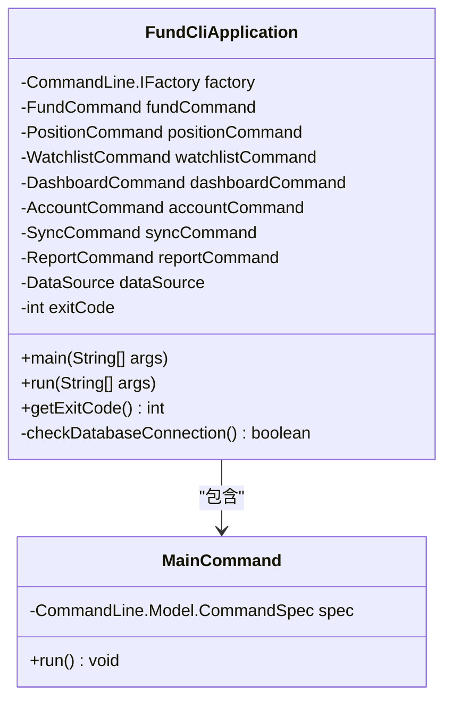
```mermaid
classDiagram
class FundCliApplication {
-CommandLine.IFactory factory
-FundCommand fundCommand
-PositionCommand positionCommand
-WatchlistCommand watchlistCommand
-DashboardCommand dashboardCommand
-AccountCommand accountCommand
-SyncCommand syncCommand
-ReportCommand reportCommand
-DataSource dataSource
-int exitCode
+main(String[] args)
+run(String[] args)
+getExitCode() int
-checkDatabaseConnection() boolean
}
class MainCommand {
-CommandLine.Model.CommandSpec spec
+run() void
}
FundCliApplication --> MainCommand : "包含"
```

**图表来源**
- [FundCliApplication.java:26-225](file://src/main/java/com/qoder/fund/cli/FundCliApplication.java#L26-L225)

### 命令行格式化器

CliTableFormatter提供统一的输出格式化功能，支持彩色输出、JSON格式和表格显示。

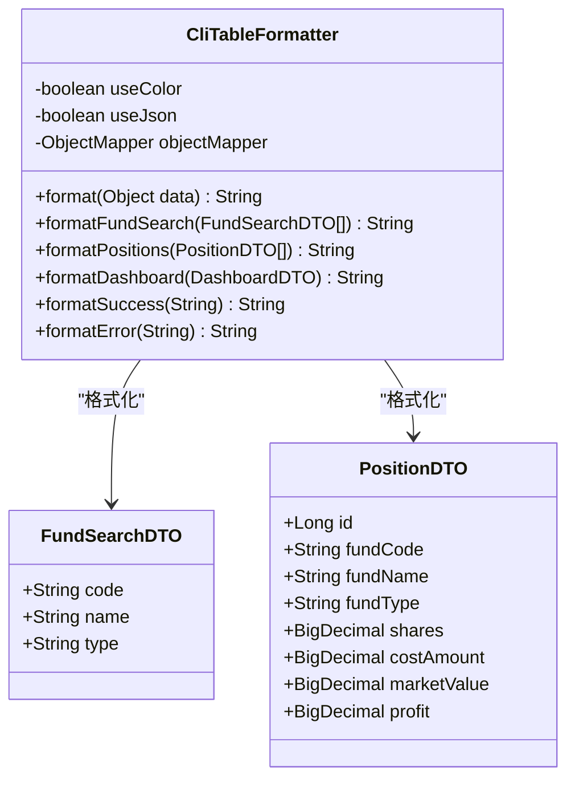
```mermaid
classDiagram
class CliTableFormatter {
-boolean useColor
-boolean useJson
-ObjectMapper objectMapper
+format(Object data) String
+formatFundSearch(FundSearchDTO[]) String
+formatPositions(PositionDTO[]) String
+formatDashboard(DashboardDTO) String
+formatSuccess(String) String
+formatError(String) String
}
class FundSearchDTO {
+String code
+String name
+String type
}
class PositionDTO {
+Long id
+String fundCode
+String fundName
+String fundType
+BigDecimal shares
+BigDecimal costAmount
+BigDecimal marketValue
+BigDecimal profit
}
CliTableFormatter --> FundSearchDTO : "格式化"
CliTableFormatter --> PositionDTO : "格式化"
```

**图表来源**
- [CliTableFormatter.java:18-491](file://src/main/java/com/qoder/fund/cli/util/CliTableFormatter.java#L18-L491)

**章节来源**
- [FundCliApplication.java:26-225](file://src/main/java/com/qoder/fund/cli/FundCliApplication.java#L26-L225)
- [CliTableFormatter.java:18-491](file://src/main/java/com/qoder/fund/cli/util/CliTableFormatter.java#L18-L491)

## 架构概览

系统采用分层架构设计，遵循Clean Architecture原则：

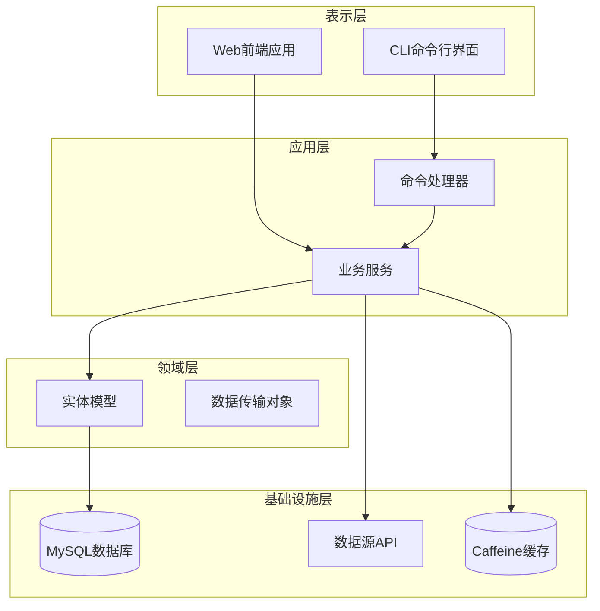
```mermaid
graph TB
subgraph "表示层"
CLI[CLI命令行界面]
WEB[Web前端应用]
end
subgraph "应用层"
CMD[命令处理器]
SVC[业务服务]
end
subgraph "领域层"
ENT[实体模型]
DTO[数据传输对象]
end
subgraph "基础设施层"
DB[(MySQL数据库)]
DS[数据源API]
CACHE[(Caffeine缓存)]
end
CLI --> CMD
WEB --> SVC
CMD --> SVC
SVC --> ENT
ENT --> DB
SVC --> DS
SVC --> CACHE
```

**图表来源**
- [FundCliApplication.java:23-86](file://src/main/java/com/qoder/fund/cli/FundCliApplication.java#L23-L86)
- [application-cli.yml:4-13](file://src/main/resources/application-cli.yml#L4-L13)

### 数据流架构

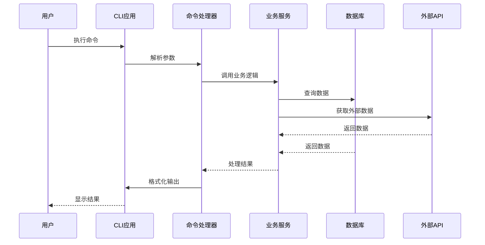
```mermaid
sequenceDiagram
participant User as 用户
participant CLI as CLI应用
participant Command as 命令处理器
participant Service as 业务服务
participant DB as 数据库
participant API as 外部API
User->>CLI : 执行命令
CLI->>Command : 解析参数
Command->>Service : 调用业务逻辑
Service->>DB : 查询数据
Service->>API : 获取外部数据
API-->>Service : 返回数据
DB-->>Service : 返回数据
Service-->>Command : 处理结果
Command->>CLI : 格式化输出
CLI-->>User : 显示结果
```

**图表来源**
- [FundCommand.java:31-250](file://src/main/java/com/qoder/fund/cli/FundCommand.java#L31-L250)
- [PositionCommand.java:36-319](file://src/main/java/com/qoder/fund/cli/PositionCommand.java#L36-L319)

## 详细组件分析

### 基金管理命令

FundCommand提供完整的基金查询和管理功能，支持多种操作模式：

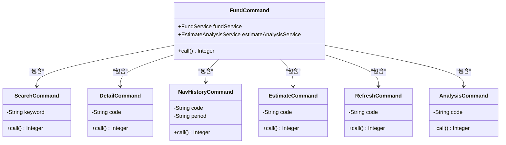
```mermaid
classDiagram
class FundCommand {
+FundService fundService
+EstimateAnalysisService estimateAnalysisService
+call() Integer
}
class SearchCommand {
-String keyword
+call() Integer
}
class DetailCommand {
-String code
+call() Integer
}
class NavHistoryCommand {
-String code
-String period
+call() Integer
}
class EstimateCommand {
-String code
+call() Integer
}
class RefreshCommand {
-String code
+call() Integer
}
class AnalysisCommand {
-String code
+call() Integer
}
FundCommand --> SearchCommand : "包含"
FundCommand --> DetailCommand : "包含"
FundCommand --> NavHistoryCommand : "包含"
FundCommand --> EstimateCommand : "包含"
FundCommand --> RefreshCommand : "包含"
FundCommand --> AnalysisCommand : "包含"
```

**图表来源**
- [FundCommand.java:31-250](file://src/main/java/com/qoder/fund/cli/FundCommand.java#L31-L250)

#### 基金搜索流程

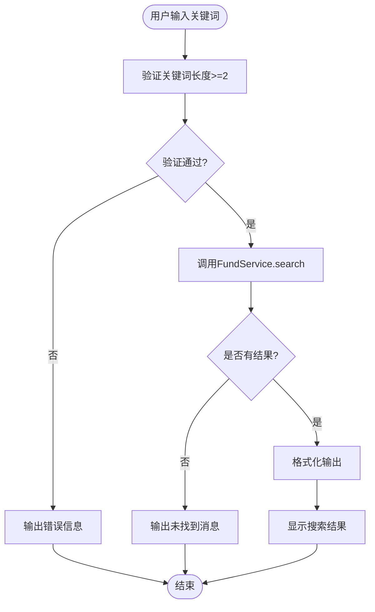
```mermaid
flowchart TD
Start([用户输入关键词]) --> Validate[验证关键词长度>=2]
Validate --> Valid{验证通过?}
Valid --> |否| Error[输出错误信息]
Valid --> |是| Search[调用FundService.search]
Search --> Result{是否有结果?}
Result --> |否| NoResult[输出未找到消息]
Result --> |是| Format[格式化输出]
Format --> Success[显示搜索结果]
Error --> End([结束])
NoResult --> End
Success --> End
```

**图表来源**
- [FundCommand.java:74-87](file://src/main/java/com/qoder/fund/cli/FundCommand.java#L74-L87)

**章节来源**
- [FundCommand.java:31-250](file://src/main/java/com/qoder/fund/cli/FundCommand.java#L31-L250)

### 持仓管理命令

PositionCommand提供全面的持仓管理功能，支持添加、删除、买卖和交易记录查看：

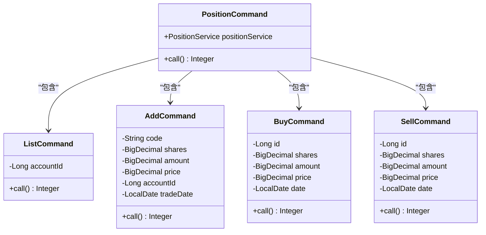
```mermaid
classDiagram
class PositionCommand {
+PositionService positionService
+call() Integer
}
class ListCommand {
-Long accountId
+call() Integer
}
class AddCommand {
-String code
-BigDecimal shares
-BigDecimal amount
-BigDecimal price
-Long accountId
-LocalDate tradeDate
+call() Integer
}
class BuyCommand {
-Long id
-BigDecimal shares
-BigDecimal amount
-BigDecimal price
-LocalDate date
+call() Integer
}
class SellCommand {
-Long id
-BigDecimal shares
-BigDecimal amount
-BigDecimal price
-LocalDate date
+call() Integer
}
PositionCommand --> ListCommand : "包含"
PositionCommand --> AddCommand : "包含"
PositionCommand --> BuyCommand : "包含"
PositionCommand --> SellCommand : "包含"
```

**图表来源**
- [PositionCommand.java:36-319](file://src/main/java/com/qoder/fund/cli/PositionCommand.java#L36-L319)

#### 交易执行流程

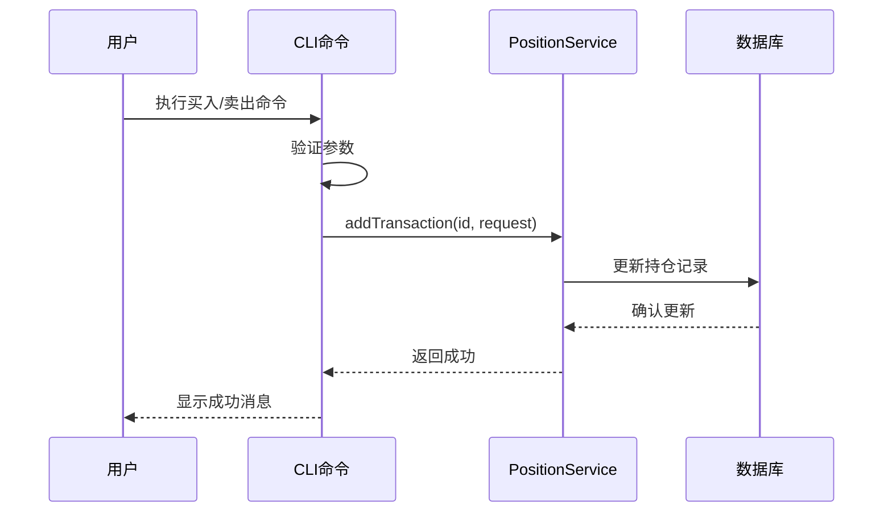
```mermaid
sequenceDiagram
participant User as 用户
participant CLI as CLI命令
participant Service as PositionService
participant DB as 数据库
User->>CLI : 执行买入/卖出命令
CLI->>CLI : 验证参数
CLI->>Service : addTransaction(id, request)
Service->>DB : 更新持仓记录
DB-->>Service : 确认更新
Service-->>CLI : 返回成功
CLI-->>User : 显示成功消息
```

**图表来源**
- [PositionCommand.java:248-266](file://src/main/java/com/qoder/fund/cli/PositionCommand.java#L248-L266)

**章节来源**
- [PositionCommand.java:36-319](file://src/main/java/com/qoder/fund/cli/PositionCommand.java#L36-L319)

### 仪表盘命令

DashboardCommand提供资产概览和收益趋势分析功能，支持多种输出格式：

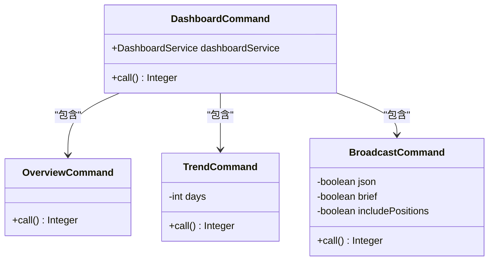
```mermaid
classDiagram
class DashboardCommand {
+DashboardService dashboardService
+call() Integer
}
class OverviewCommand {
+call() Integer
}
class TrendCommand {
-int days
+call() Integer
}
class BroadcastCommand {
-boolean json
-boolean brief
-boolean includePositions
+call() Integer
}
DashboardCommand --> OverviewCommand : "包含"
DashboardCommand --> TrendCommand : "包含"
DashboardCommand --> BroadcastCommand : "包含"
```

**图表来源**
- [DashboardCommand.java:35-319](file://src/main/java/com/qoder/fund/cli/DashboardCommand.java#L35-L319)

#### 收益播报功能

BroadcastCommand专门设计用于定时任务和语音播报，提供多种输出格式：

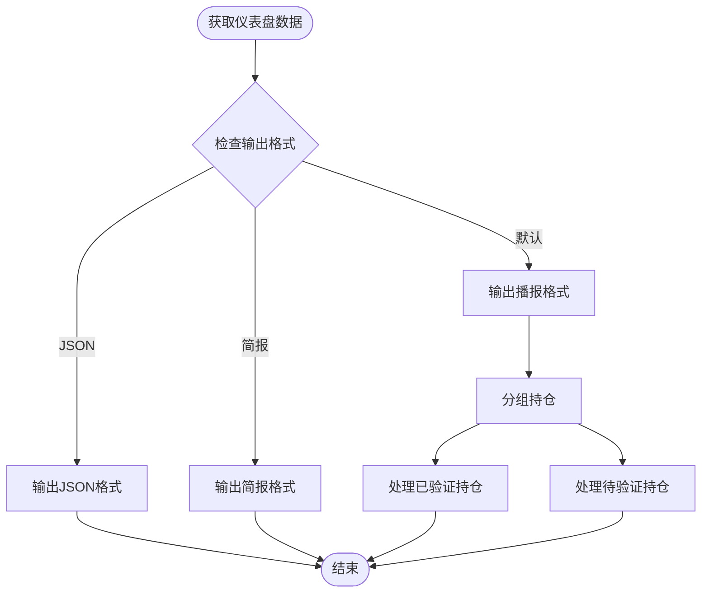
```mermaid
flowchart TD
Start([获取仪表盘数据]) --> CheckFormat{检查输出格式}
CheckFormat --> |JSON| JsonFormat[输出JSON格式]
CheckFormat --> |简报| BriefFormat[输出简报格式]
CheckFormat --> |默认| BroadcastFormat[输出播报格式]
JsonFormat --> End([结束])
BriefFormat --> End
BroadcastFormat --> GroupPositions[分组持仓]
GroupPositions --> Verified[处理已验证持仓]
GroupPositions --> Pending[处理待验证持仓]
Verified --> End
Pending --> End
```

**图表来源**
- [DashboardCommand.java:136-240](file://src/main/java/com/qoder/fund/cli/DashboardCommand.java#L136-L240)

**章节来源**
- [DashboardCommand.java:35-319](file://src/main/java/com/qoder/fund/cli/DashboardCommand.java#L35-L319)

### 数据分析报告

**更新** ReportCommand专门为外部Agent提供纯客观数据，不包含任何主观建议：

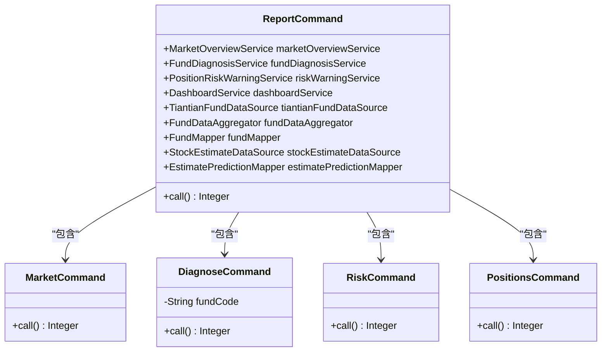
```mermaid
classDiagram
class ReportCommand {
+MarketOverviewService marketOverviewService
+FundDiagnosisService fundDiagnosisService
+PositionRiskWarningService riskWarningService
+DashboardService dashboardService
+TiantianFundDataSource tiantianFundDataSource
+FundDataAggregator fundDataAggregator
+FundMapper fundMapper
+StockEstimateDataSource stockEstimateDataSource
+EstimatePredictionMapper estimatePredictionMapper
+call() Integer
}
class MarketCommand {
+call() Integer
}
class DiagnoseCommand {
-String fundCode
+call() Integer
}
class RiskCommand {
+call() Integer
}
class PositionsCommand {
+call() Integer
}
ReportCommand --> MarketCommand : "包含"
ReportCommand --> DiagnoseCommand : "包含"
ReportCommand --> RiskCommand : "包含"
ReportCommand --> PositionsCommand : "包含"
```

**图表来源**
- [ReportCommand.java:52-716](file://src/main/java/com/qoder/fund/cli/ReportCommand.java#L52-L716)

#### 市场概览输出功能

**新增** MarketCommand提供增强的市场概览输出，支持大盘指数和板块涨跌分析：

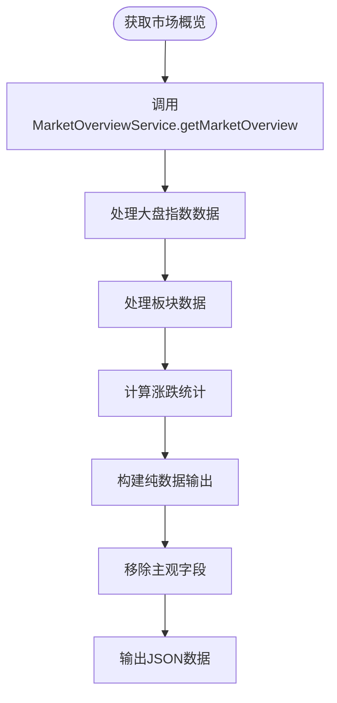
```mermaid
flowchart TD
Start([获取市场概览]) --> GetOverview[调用MarketOverviewService.getMarketOverview]
GetOverview --> ProcessIndices[处理大盘指数数据]
ProcessIndices --> ProcessSectors[处理板块数据]
ProcessSectors --> CalculateSummary[计算涨跌统计]
CalculateSummary --> BuildOutput[构建纯数据输出]
BuildOutput --> RemoveSubjective[移除主观字段]
RemoveSubjective --> Output[输出JSON数据]
```

**图表来源**
- [ReportCommand.java:96-233](file://src/main/java/com/qoder/fund/cli/ReportCommand.java#L96-L233)

#### 风险报告的高级分析功能

**新增** RiskCommand提供组合级风险评估，包含健康指标和风险检测：

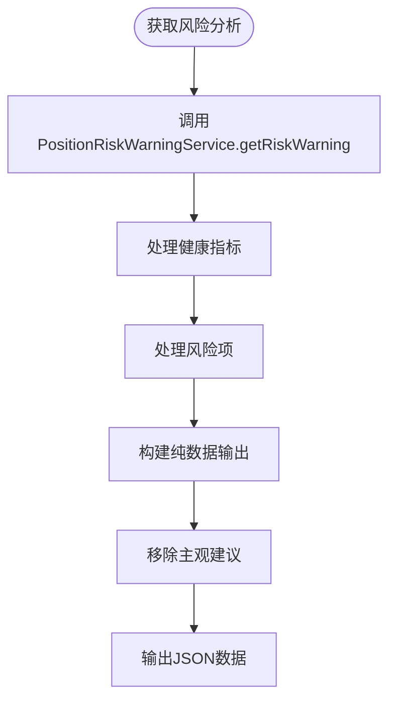
```mermaid
flowchart TD
Start([获取风险分析]) --> GetWarning[调用PositionRiskWarningService.getRiskWarning]
GetWarning --> ProcessMetrics[处理健康指标]
ProcessMetrics --> ProcessRisks[处理风险项]
ProcessRisks --> BuildOutput[构建纯数据输出]
BuildOutput --> RemoveSubjective[移除主观建议]
RemoveSubjective --> Output[输出JSON数据]
```

**图表来源**
- [ReportCommand.java:337-408](file://src/main/java/com/qoder/fund/cli/ReportCommand.java#L337-L408)

#### 更多维度的投资组合分析指标

**新增** PositionsCommand提供详细的持仓客观指标数据：

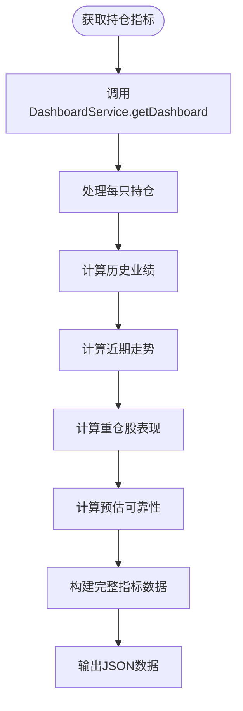
```mermaid
flowchart TD
Start([获取持仓指标]) --> GetDashboard[调用DashboardService.getDashboard]
GetDashboard --> ProcessPositions[处理每只持仓]
ProcessPositions --> CalcPerformance[计算历史业绩]
CalcPerformance --> CalcTrend[计算近期走势]
CalcTrend --> CalcHoldings[计算重仓股表现]
CalcHoldings --> CalcReliability[计算预估可靠性]
CalcReliability --> BuildOutput[构建完整指标数据]
BuildOutput --> Output[输出JSON数据]
```

**图表来源**
- [ReportCommand.java:421-700](file://src/main/java/com/qoder/fund/cli/ReportCommand.java#L421-L700)

**章节来源**
- [ReportCommand.java:52-716](file://src/main/java/com/qoder/fund/cli/ReportCommand.java#L52-L716)

### 数据同步命令

SyncCommand提供手动触发数据同步的功能，替代Web模式下的定时任务：

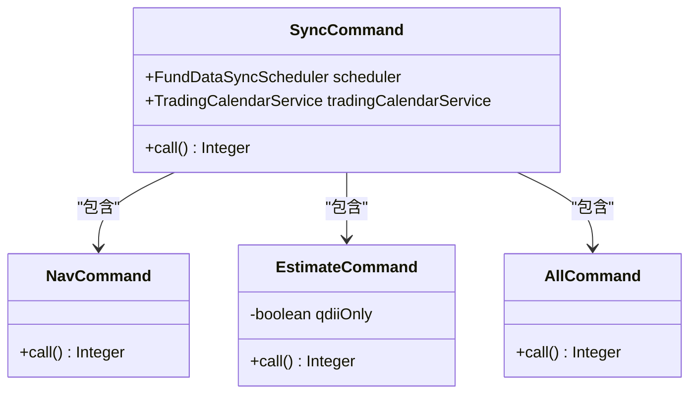
```mermaid
classDiagram
class SyncCommand {
+FundDataSyncScheduler scheduler
+TradingCalendarService tradingCalendarService
+call() Integer
}
class NavCommand {
+call() Integer
}
class EstimateCommand {
-boolean qdiiOnly
+call() Integer
}
class AllCommand {
+call() Integer
}
SyncCommand --> NavCommand : "包含"
SyncCommand --> EstimateCommand : "包含"
SyncCommand --> AllCommand : "包含"
```

**图表来源**
- [SyncCommand.java:36-259](file://src/main/java/com/qoder/fund/cli/SyncCommand.java#L36-L259)

**章节来源**
- [SyncCommand.java:36-259](file://src/main/java/com/qoder/fund/cli/SyncCommand.java#L36-L259)

## 依赖关系分析

系统采用模块化设计，各组件之间保持松耦合：

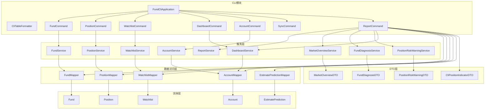
```mermaid
graph TB
subgraph "CLI模块"
A[FundCliApplication]
B[CliTableFormatter]
C[FundCommand]
D[PositionCommand]
E[WatchlistCommand]
F[DashboardCommand]
G[AccountCommand]
H[SyncCommand]
I[ReportCommand]
end
subgraph "服务层"
J[FundService]
K[PositionService]
L[WatchlistService]
M[DashboardService]
N[AccountService]
O[ReportService]
P[MarketOverviewService]
Q[FundDiagnosisService]
R[PositionRiskWarningService]
end
subgraph "数据访问层"
S[FundMapper]
T[PositionMapper]
U[WatchlistMapper]
V[AccountMapper]
W[EstimatePredictionMapper]
end
subgraph "实体层"
X[Fund]
Y[Position]
Z[Watchlist]
AA[Account]
BB[EstimatePrediction]
end
subgraph "DTO层"
CC[MarketOverviewDTO]
DD[FundDiagnosisDTO]
EE[PositionRiskWarningDTO]
FF[CliPositionIndicatorDTO]
end
A --> C
A --> D
A --> E
A --> F
A --> G
A --> H
A --> I
C --> J
D --> K
E --> L
F --> M
G --> N
I --> O
I --> P
I --> Q
I --> R
I --> M
I --> S
I --> T
I --> U
I --> V
I --> W
J --> S
K --> T
L --> U
M --> V
N --> V
P --> CC
Q --> DD
R --> EE
I --> FF
S --> X
T --> Y
U --> Z
V --> AA
W --> BB
```

**图表来源**
- [FundCliApplication.java:28-59](file://src/main/java/com/qoder/fund/cli/FundCliApplication.java#L28-L59)
- [pom.xml:20-116](file://pom.xml#L20-L116)

### 数据模型关系

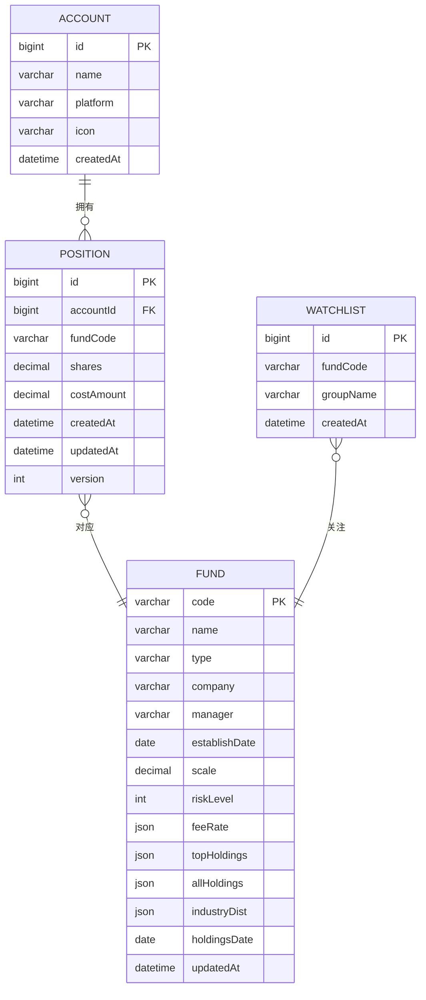
```mermaid
erDiagram
ACCOUNT {
bigint id PK
varchar name
varchar platform
varchar icon
datetime createdAt
}
POSITION {
bigint id PK
bigint accountId FK
varchar fundCode
decimal shares
decimal costAmount
datetime createdAt
datetime updatedAt
int version
}
WATCHLIST {
bigint id PK
varchar fundCode
varchar groupName
datetime createdAt
}
FUND {
varchar code PK
varchar name
varchar type
varchar company
varchar manager
date establishDate
decimal scale
int riskLevel
json feeRate
json topHoldings
json allHoldings
json industryDist
date holdingsDate
datetime updatedAt
}
ACCOUNT ||--o{ POSITION : "拥有"
POSITION }o--|| FUND : "对应"
WATCHLIST }o--|| FUND : "关注"
```

**图表来源**
- [Account.java:12-22](file://src/main/java/com/qoder/fund/entity/Account.java#L12-L22)
- [Position.java:13-29](file://src/main/java/com/qoder/fund/entity/Position.java#L13-L29)
- [Watchlist.java:11-21](file://src/main/java/com/qoder/fund/entity/Watchlist.java#L11-L21)
- [Fund.java:16-47](file://src/main/java/com/qoder/fund/entity/Fund.java#L16-L47)

**章节来源**
- [pom.xml:20-116](file://pom.xml#L20-L116)
- [Account.java:12-22](file://src/main/java/com/qoder/fund/entity/Account.java#L12-L22)
- [Position.java:13-29](file://src/main/java/com/qoder/fund/entity/Position.java#L13-L29)
- [Watchlist.java:11-21](file://src/main/java/com/qoder/fund/entity/Watchlist.java#L11-L21)
- [Fund.java:16-47](file://src/main/java/com/qoder/fund/entity/Fund.java#L16-L47)

## 性能考虑

### 缓存策略

CLI模式下禁用缓存以避免进程间共享问题：

```yaml
spring:
  cache:
    type: none
```

### 数据格式化优化

CliTableFormatter使用StringBuilder进行字符串拼接，减少内存分配：

- 使用StringBuilder.append()替代字符串连接
- 预分配合适的容量
- 缓存ObjectMapper实例

### 异步处理

系统支持异步数据获取，特别是对外部API的调用：

- 使用OkHttp进行HTTP请求
- 支持超时控制和重试机制
- 并行处理多个数据源

## 故障排除指南

### 数据库连接问题

当CLI应用启动时会自动检查数据库连接：

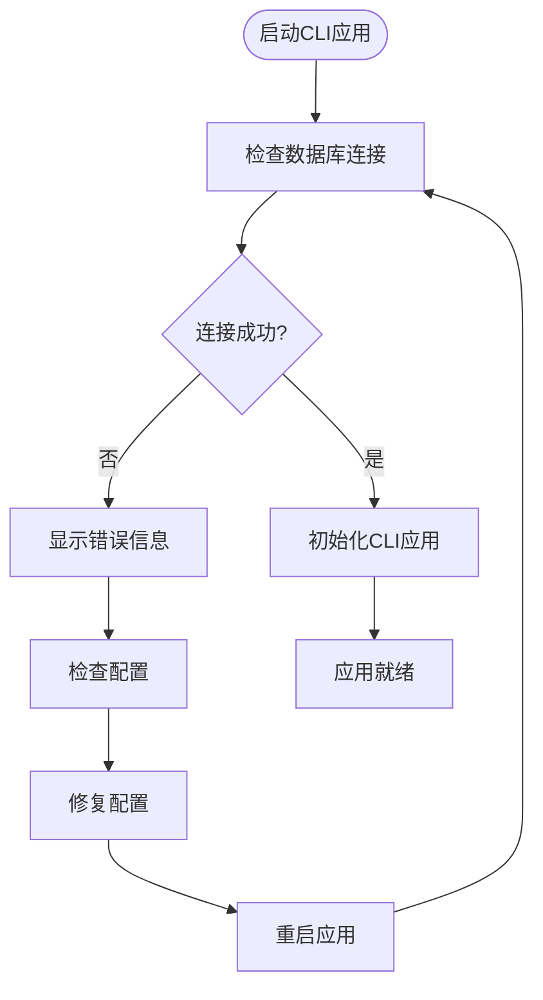
```mermaid
flowchart TD
Start([启动CLI应用]) --> CheckDB[检查数据库连接]
CheckDB --> Connected{连接成功?}
Connected --> |是| InitCLI[初始化CLI应用]
Connected --> |否| ShowError[显示错误信息]
ShowError --> CheckConfig[检查配置]
CheckConfig --> FixConfig[修复配置]
FixConfig --> Restart[重启应用]
InitCLI --> Ready[应用就绪]
Restart --> CheckDB
```

**图表来源**
- [FundCliApplication.java:89-134](file://src/main/java/com/qoder/fund/cli/FundCliApplication.java#L89-L134)

### 常见问题解决

1. **数据库连接失败**
   - 检查MySQL服务状态
   - 验证数据库凭据
   - 确认数据库存在

2. **命令执行失败**
   - 检查参数格式
   - 验证权限设置
   - 查看日志输出

3. **数据同步异常**
   - 检查网络连接
   - 验证外部API可用性
   - 确认交易日设置

4. **ReportCommand执行失败**
   - 检查相关服务是否正常工作
   - 验证数据源连接
   - 确认JSON序列化配置

**章节来源**
- [FundCliApplication.java:89-134](file://src/main/java/com/qoder/fund/cli/FundCliApplication.java#L89-L134)

## 结论

报告命令行接口是一个功能完整、架构清晰的现代化CLI工具。它成功地将复杂的基金管理和数据分析功能封装为易用的命令行接口，同时保持了高度的可扩展性和维护性。

**更新** 系统现已演进为纯客观数据输出平台，ReportCommand类替代了原有的AI焦点功能，专门服务于外部Agent的数据需求。这种转变体现了从"智能分析"到"数据供给"的架构升级，为AI代理提供了更加可靠和可预测的数据接口。

### 主要优势

1. **模块化设计**：清晰的分层架构便于维护和扩展
2. **多格式输出**：支持彩色、JSON等多种输出格式
3. **Agent友好**：专门设计的数据报告接口，提供纯客观数据
4. **定时任务支持**：内置数据同步和估值预测功能
5. **错误处理**：完善的异常处理和用户反馈机制
6. **纯客观数据**：ReportCommand仅输出事实性指标，不包含主观建议
7. **增强的报告功能**：新增市场概览、风险分析和投资组合指标输出
8. **多维度分析**：提供更全面的投资组合分析指标

### 技术特色

- 基于Spring Boot和Picocli的现代化CLI框架
- 多数据源聚合和智能估值算法
- 完整的持仓管理和风险分析功能
- 面向外部Agent的标准化数据接口
- **新增** 纯客观数据输出设计，符合AI代理最佳实践
- **新增** 市场概览输出功能，支持大盘指数和板块分析
- **新增** 高级风险报告功能，提供组合级风险评估
- **新增** 丰富的投资组合分析指标，包括重仓股表现和预估可靠性

该系统为个人投资者和AI代理提供了强大的工具支持，既适合日常使用，也适合集成到更大的自动化系统中。ReportCommand的引入标志着系统从"AI助手"向"数据平台"的重要转型，为未来的AI协作奠定了坚实基础。