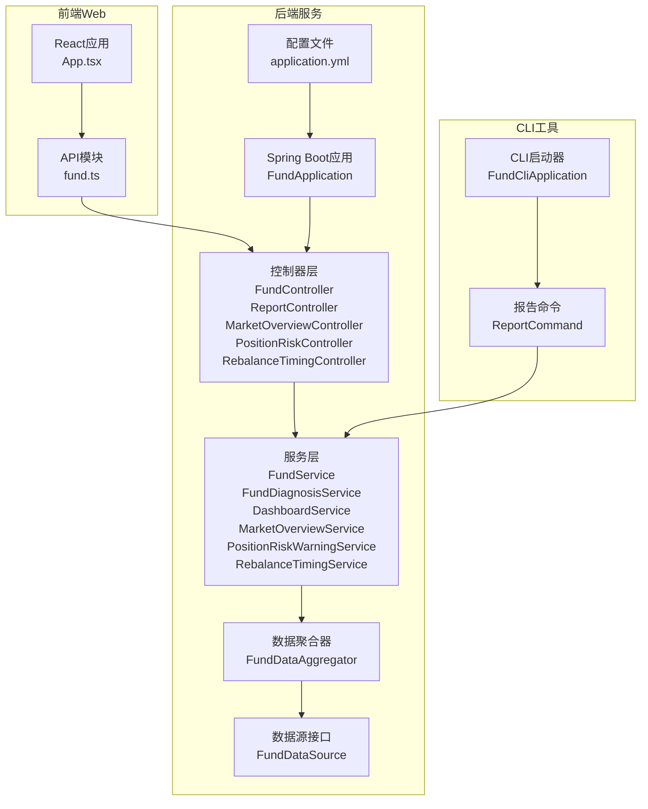
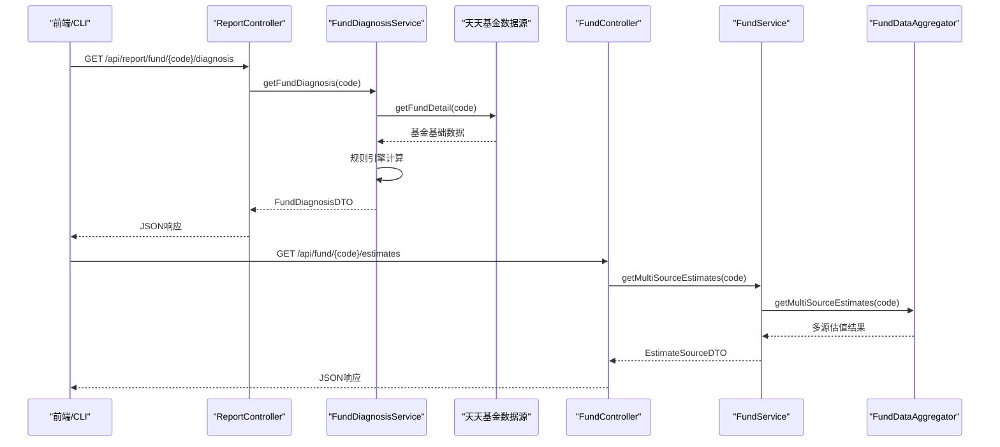
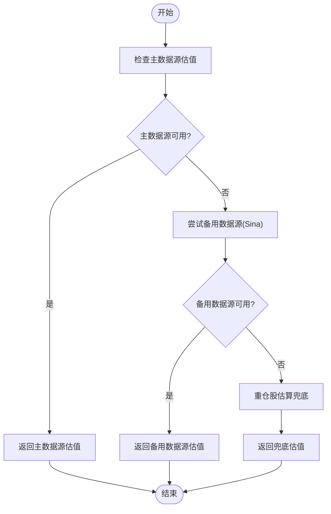
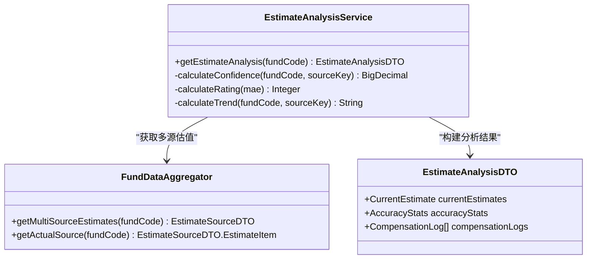
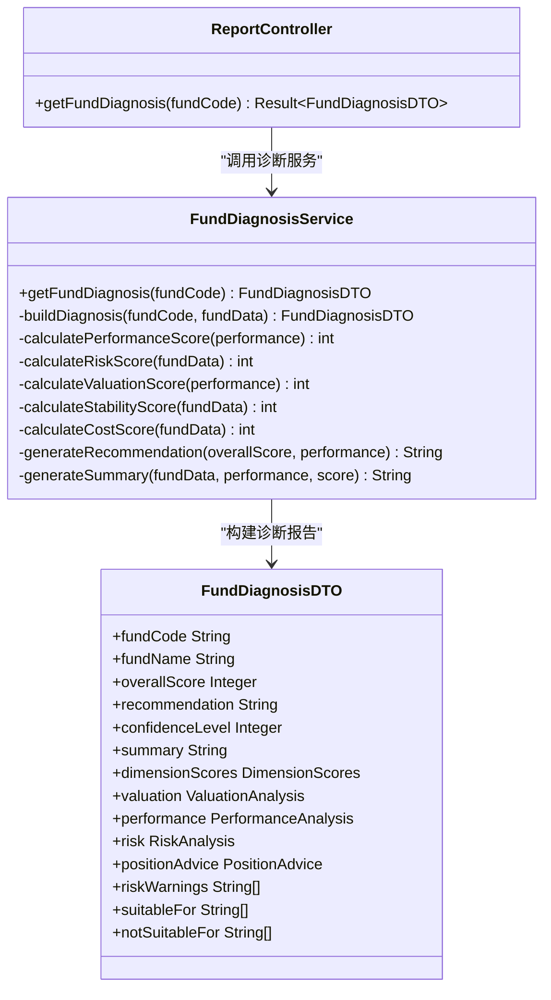
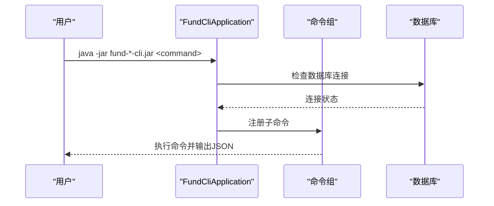
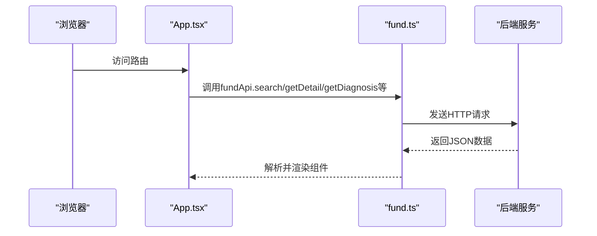
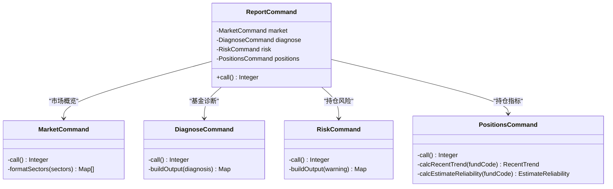
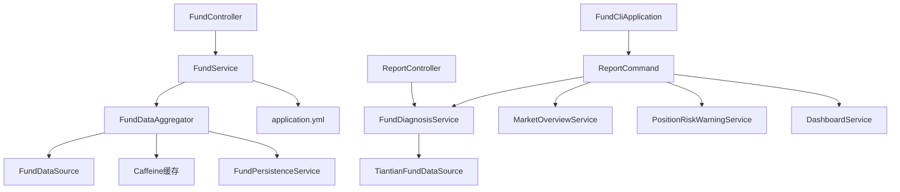

# 报告控制器

<cite>
**本文档引用的文件**
- [README.md](file://README.md)
- [PRD.md](file://PRD.md)
- [AGENTS.md](file://AGENTS.md)
- [FundApplication.java](file://src/main/java/com/qoder/fund/FundApplication.java)
- [FundController.java](file://src/main/java/com/qoder/fund/controller/FundController.java)
- [FundService.java](file://src/main/java/com/qoder/fund/service/FundService.java)
- [FundDataAggregator.java](file://src/main/java/com/qoder/fund/datasource/FundDataAggregator.java)
- [FundDataSource.java](file://src/main/java/com/qoder/fund/datasource/FundDataSource.java)
- [EstimateAnalysisService.java](file://src/main/java/com/qoder/fund/service/EstimateAnalysisService.java)
- [FundCliApplication.java](file://src/main/java/com/qoder/fund/cli/FundCliApplication.java)
- [Fund.java](file://src/main/java/com/qoder/fund/entity/Fund.java)
- [FundDetailDTO.java](file://src/main/java/com/qoder/fund/dto/FundDetailDTO.java)
- [ReportController.java](file://src/main/java/com/qoder/fund/controller/ReportController.java)
- [FundDiagnosisService.java](file://src/main/java/com/qoder/fund/service/FundDiagnosisService.java)
- [FundDiagnosisDTO.java](file://src/main/java/com/qoder/fund/dto/FundDiagnosisDTO.java)
- [MarketOverviewController.java](file://src/main/java/com/qoder/fund/controller/MarketOverviewController.java)
- [PositionRiskController.java](file://src/main/java/com/qoder/fund/controller/PositionRiskController.java)
- [RebalanceTimingController.java](file://src/main/java/com/qoder/fund/controller/RebalanceTimingController.java)
- [ReportCommand.java](file://src/main/java/com/qoder/fund/cli/ReportCommand.java)
- [application.yml](file://src/main/resources/application.yml)
- [App.tsx](file://fund-web/src/App.tsx)
- [fund.ts](file://fund-web/src/api/fund.ts)
- [FundDetail.tsx](file://fund-web/src/pages/Fund/FundDetail.tsx)
- [DiagnosisTab.tsx](file://fund-web/src/pages/Fund/DiagnosisTab.tsx)
- [EstimateAnalysisTab.tsx](file://fund-web/src/pages/Fund/EstimateAnalysisTab.tsx)
</cite>

## 更新摘要
**所做更改**
- 系统从AI控制器重命名为报告控制器，包括ReportController、MarketOverviewController、PositionRiskController、RebalanceTimingController等
- 新增专门的报告控制器，提供纯客观数据的API接口
- 新增FundDiagnosisService和FundDiagnosisDTO，实现基金诊断报告生成功能
- 更新前端API模块，添加基金诊断报告接口支持
- 移除AiAnalysisController，将AI分析功能整合到新的报告控制器中
- CLI工具中新增ReportCommand，提供面向外部Agent的数据分析报告接口

## 目录
1. [简介](#简介)
2. [项目结构](#项目结构)
3. [核心组件](#核心组件)
4. [架构概览](#架构概览)
5. [详细组件分析](#详细组件分析)
6. [依赖关系分析](#依赖关系分析)
7. [性能考量](#性能考量)
8. [故障排查指南](#故障排查指南)
9. [结论](#结论)
10. [附录](#附录)

## 简介
报告控制器是「基金管家」项目中的核心报告服务系统，定位为「一站式基金数据报告服务工具」。该系统通过多数据源聚合、智能估值权重计算、准确度分析与补偿机制，为用户提供客观、实时、可解释的基金数据与分析报告，支持Web界面与CLI双模式运行，面向外部Agent提供标准化数据接口。

**更新** 系统已从AI控制器重命名为报告控制器，包括ReportController、MarketOverviewController、PositionRiskController、RebalanceTimingController等多个专业报告控制器，反映了从AI分析到报告服务的架构转型。

## 项目结构
项目采用前后端分离架构，后端基于Spring Boot，前端基于React + TypeScript，CLI基于Picocli。核心模块包括：
- 控制器层：RESTful API接口，负责接收请求并返回标准DTO
- 服务层：业务逻辑封装，协调数据聚合与分析
- 数据源层：多数据源抽象与实现，支持主备降级与兜底估值
- 实体与DTO：数据模型与传输对象，确保API一致性
- 前端Web：路由、页面组件、API调用与状态管理
- CLI工具：命令行模式，支持定时任务与数据分析报告

**图表来源**
- [App.tsx:45-64](file://fund-web/src/App.tsx#L45-L64)
- [FundController.java:24-78](file://src/main/java/com/qoder/fund/controller/FundController.java#L24-L78)
- [ReportController.java:10-39](file://src/main/java/com/qoder/fund/controller/ReportController.java#L10-L39)
- [FundService.java:20-74](file://src/main/java/com/qoder/fund/service/FundService.java#L20-L74)
- [FundDiagnosisService.java:17-70](file://src/main/java/com/qoder/fund/service/FundDiagnosisService.java#L17-L70)
- [FundDataAggregator.java:40-55](file://src/main/java/com/qoder/fund/datasource/FundDataAggregator.java#L40-L55)
- [FundDataSource.java:9-43](file://src/main/java/com/qoder/fund/datasource/FundDataSource.java#L9-L43)
- [application.yml:1-68](file://src/main/resources/application.yml#L1-L68)
- [FundCliApplication.java:23-86](file://src/main/java/com/qoder/fund/cli/FundCliApplication.java#L23-L86)
- [ReportCommand.java:33-83](file://src/main/java/com/qoder/fund/cli/ReportCommand.java#L33-L83)

**章节来源**
- [README.md: 192-223:192-223](file://README.md#L192-L223)
- [AGENTS.md: 15-25:15-25](file://AGENTS.md#L15-L25)

## 核心组件
- FundController：提供基金搜索、详情、净值历史、实时估值、刷新与估值分析等REST接口，统一返回Result包装结果
- ReportController：新增的报告控制器，提供纯客观数据的API接口，包括基金诊断报告、市场概览、风险预警等
- FundService：封装业务逻辑，调用FundDataAggregator进行数据聚合与处理
- FundDiagnosisService：新增的基金诊断服务，基于规则引擎生成专业的基金诊断报告
- FundDataAggregator：多数据源聚合器，实现主数据源失败时的降级与兜底，支持缓存与智能权重计算
- EstimateAnalysisService：数据源准确度分析服务，提供可信度评估、历史准确度统计与补偿记录
- FundDataSource：数据源接口抽象，定义搜索、详情、净值历史、实时估值等能力
- FundCliApplication：CLI启动器，支持Web与CLI双模式，提供命令行数据分析报告
- ReportCommand：新增的CLI报告命令，面向外部Agent提供客观数据供给
- 前端API模块：定义TypeScript接口与HTTP客户端，封装后端API调用，新增基金诊断报告接口

**更新** 系统已重命名为报告控制器，新增了专门的ReportController和ReportCommand，提供专业的基金诊断报告功能，包括多维度评分、投资建议、风险分析等客观数据。

**章节来源**
- [FundController.java: 24-78:24-78](file://src/main/java/com/qoder/fund/controller/FundController.java#L24-L78)
- [ReportController.java: 10-39:10-39](file://src/main/java/com/qoder/fund/controller/ReportController.java#L10-L39)
- [FundService.java: 20-74:20-74](file://src/main/java/com/qoder/fund/service/FundService.java#L20-L74)
- [FundDiagnosisService.java: 17-70:17-70](file://src/main/java/com/qoder/fund/service/FundDiagnosisService.java#L17-L70)
- [FundDataAggregator.java: 40-55:40-55](file://src/main/java/com/qoder/fund/datasource/FundDataAggregator.java#L40-L55)
- [EstimateAnalysisService.java: 32-65:32-65](file://src/main/java/com/qoder/fund/service/EstimateAnalysisService.java#L32-L65)
- [FundDataSource.java: 9-43:9-43](file://src/main/java/com/qoder/fund/datasource/FundDataSource.java#L9-L43)
- [FundCliApplication.java: 23-86:23-86](file://src/main/java/com/qoder/fund/cli/FundCliApplication.java#L23-L86)
- [ReportCommand.java: 33-83:33-83](file://src/main/java/com/qoder/fund/cli/ReportCommand.java#L33-L83)
- [fund.ts:113-132](file://fund-web/src/api/fund.ts#L113-L132)

## 架构概览
报告控制器遵循分层架构与数据聚合策略：
- 分层边界：Controller → Service → Mapper，禁止跨层调用
- 数据聚合：主数据源（天天基金）→ 备用数据源（新浪财经）→ 兜底估值（重仓股估算）
- 智能权重：基于基金类型、历史准确度（MAE）与重仓股覆盖率动态调整权重
- 缓存策略：多级缓存（Caffeine）提升响应性能
- CLI模式：独立启动，禁用缓存，专注数据分析报告输出
- 专业报告：新增的报告控制器提供纯客观数据的专业分析接口

**图表来源**
- [ReportController.java: 27-38:27-38](file://src/main/java/com/qoder/fund/controller/ReportController.java#L27-L38)
- [FundDiagnosisService.java: 45-70:45-70](file://src/main/java/com/qoder/fund/service/FundDiagnosisService.java#L45-L70)
- [FundController.java: 56-59:56-59](file://src/main/java/com/qoder/fund/controller/FundController.java#L56-L59)
- [FundService.java: 67-69:67-69](file://src/main/java/com/qoder/fund/service/FundService.java#L67-L69)
- [FundDataAggregator.java: 114-146:114-146](file://src/main/java/com/qoder/fund/datasource/FundDataAggregator.java#L114-L146)

**章节来源**
- [AGENTS.md: 67-71:67-71](file://AGENTS.md#L67-L71)
- [application.yml: 29-36:29-36](file://src/main/resources/application.yml#L29-L36)

## 详细组件分析

### 组件A：数据聚合与估值权重（FundDataAggregator）
- 多数据源策略：主数据源（天天基金）→ 备用数据源（新浪财经）→ 兜底估值（重仓股估算）
- 智能权重计算：基于基金类型（股票/债券/货币/QDII/ETF）与历史准确度（MAE）动态调整权重；冷启动期使用保守权重
- 缓存与降级：支持缓存失效与多级降级，确保高可用性
- 实时净值同步：批量预同步今日净值，避免API限流影响

**图表来源**
- [FundDataAggregator.java: 114-146:114-146](file://src/main/java/com/qoder/fund/datasource/FundDataAggregator.java#L114-L146)

**章节来源**
- [FundDataAggregator.java: 40-55:40-55](file://src/main/java/com/qoder/fund/datasource/FundDataAggregator.java#L40-L55)
- [FundDataAggregator.java: 568-704:568-704](file://src/main/java/com/qoder/fund/datasource/FundDataAggregator.java#L568-L704)

### 组件B：估值准确度分析（EstimateAnalysisService）
- 实时估值数据：整合多数据源估值、实际净值与智能综合预估
- 准确度统计：基于30天历史MAE计算可信度、命中率与星级评级
- 趋势分析：比较最近7天与7-14天MAE，判断数据源表现趋势
- 补偿记录：展示预测与实际净值对比，支持待验证预测记录

**图表来源**
- [EstimateAnalysisService.java: 32-65:32-65](file://src/main/java/com/qoder/fund/service/EstimateAnalysisService.java#L32-L65)
- [FundDataAggregator.java: 237-341:237-341](file://src/main/java/com/qoder/fund/datasource/FundDataAggregator.java#L237-L341)

**章节来源**
- [EstimateAnalysisService.java: 149-235:149-235](file://src/main/java/com/qoder/fund/service/EstimateAnalysisService.java#L149-L235)
- [EstimateAnalysisService.java: 237-351:237-351](file://src/main/java/com/qoder/fund/service/EstimateAnalysisService.java#L237-L351)

### 组件C：专业报告控制器（ReportController）
- 专用报告接口：提供纯客观数据的API接口，包括基金诊断报告、市场概览、风险预警等
- 基金诊断报告：基于规则引擎生成专业的基金诊断报告，包含多维度评分和投资建议
- 统一响应格式：使用Result包装所有响应，确保接口一致性
- 日志记录：详细的日志记录便于问题排查和审计

**图表来源**
- [ReportController.java: 10-39:10-39](file://src/main/java/com/qoder/fund/controller/ReportController.java#L10-L39)
- [FundDiagnosisService.java: 17-70:17-70](file://src/main/java/com/qoder/fund/service/FundDiagnosisService.java#L17-L70)
- [FundDiagnosisDTO.java: 8-130:8-130](file://src/main/java/com/qoder/fund/dto/FundDiagnosisDTO.java#L8-L130)

**章节来源**
- [ReportController.java: 10-39:10-39](file://src/main/java/com/qoder/fund/controller/ReportController.java#L10-L39)
- [FundDiagnosisService.java: 17-70:17-70](file://src/main/java/com/qoder/fund/service/FundDiagnosisService.java#L17-L70)
- [FundDiagnosisDTO.java: 8-130:8-130](file://src/main/java/com/qoder/fund/dto/FundDiagnosisDTO.java#L8-L130)

### 组件D：CLI命令行工具（FundCliApplication）
- 双模式启动：Web模式与CLI模式，CLI模式禁用缓存
- 命令架构：支持fund、position、watchlist、dashboard、account、sync、report七大命令组
- 数据分析报告：面向外部Agent输出JSON格式客观指标，不含主观建议
- 数据库连接检查：启动时验证数据库连通性

**图表来源**
- [FundCliApplication.java: 61-86:61-86](file://src/main/java/com/qoder/fund/cli/FundCliApplication.java#L61-L86)
- [FundCliApplication.java: 101-117:101-117](file://src/main/java/com/qoder/fund/cli/FundCliApplication.java#L101-L117)

**章节来源**
- [FundCliApplication.java: 139-223:139-223](file://src/main/java/com/qoder/fund/cli/FundCliApplication.java#L139-L223)

### 组件E：前端Web集成（App.tsx 与 fund.ts）
- 路由与主题：Ant Design主题配置，路由映射至Dashboard、FundDetail、Portfolio等页面
- API封装：定义TypeScript接口与HTTP客户端，封装搜索、详情、净值历史、实时估值、刷新与诊断接口
- 数据展示：通过API调用后端服务，渲染基金数据与分析结果

**图表来源**
- [App.tsx:45-64](file://fund-web/src/App.tsx#L45-L64)
- [fund.ts:113-132](file://fund-web/src/api/fund.ts#L113-L132)

**章节来源**
- [App.tsx: 45-64:45-64](file://fund-web/src/App.tsx#L45-L64)
- [fund.ts: 113-132:113-132](file://fund-web/src/api/fund.ts#L113-L132)

### 组件F：报告命令行接口（ReportCommand）
- 专业报告CLI：面向外部Agent提供客观数据供给，仅输出事实性指标，不输出主观建议
- 子命令支持：支持market、diagnose、risk、positions四个子命令
- JSON输出：所有子命令默认输出JSON格式，方便外部Agent解析
- 数据剥离：自动剥离主观建议字段，仅保留客观数据

**图表来源**
- [ReportCommand.java: 33-83:33-83](file://src/main/java/com/qoder/fund/cli/ReportCommand.java#L33-L83)
- [ReportCommand.java: 89-228:89-228](file://src/main/java/com/qoder/fund/cli/ReportCommand.java#L89-L228)
- [ReportCommand.java: 241-319:241-319](file://src/main/java/com/qoder/fund/cli/ReportCommand.java#L241-L319)
- [ReportCommand.java: 332-393:332-393](file://src/main/java/com/qoder/fund/cli/ReportCommand.java#L332-L393)
- [ReportCommand.java: 409-685:409-685](file://src/main/java/com/qoder/fund/cli/ReportCommand.java#L409-L685)

**章节来源**
- [ReportCommand.java: 33-83:33-83](file://src/main/java/com/qoder/fund/cli/ReportCommand.java#L33-L83)
- [ReportCommand.java: 89-228:89-228](file://src/main/java/com/qoder/fund/cli/ReportCommand.java#L89-L228)
- [ReportCommand.java: 241-319:241-319](file://src/main/java/com/qoder/fund/cli/ReportCommand.java#L241-L319)
- [ReportCommand.java: 332-393:332-393](file://src/main/java/com/qoder/fund/cli/ReportCommand.java#L332-L393)
- [ReportCommand.java: 409-685:409-685](file://src/main/java/com/qoder/fund/cli/ReportCommand.java#L409-L685)

## 依赖关系分析
- 组件耦合：控制器依赖服务，服务依赖数据聚合器，聚合器依赖数据源接口与缓存管理
- 外部依赖：MySQL数据库、Caffeine缓存、OkHttp HTTP客户端、Picocli CLI框架
- 配置依赖：application.yml定义数据源、缓存、MyBatis-Plus与Actuator配置

**图表来源**
- [FundController.java:24-78](file://src/main/java/com/qoder/fund/controller/FundController.java#L24-L78)
- [ReportController.java:10-39](file://src/main/java/com/qoder/fund/controller/ReportController.java#L10-L39)
- [FundService.java:20-74](file://src/main/java/com/qoder/fund/service/FundService.java#L20-L74)
- [FundDiagnosisService.java:17-70](file://src/main/java/com/qoder/fund/service/FundDiagnosisService.java#L17-L70)
- [FundDataAggregator.java:40-55](file://src/main/java/com/qoder/fund/datasource/FundDataAggregator.java#L40-L55)
- [application.yml:1-68](file://src/main/resources/application.yml#L1-L68)
- [FundCliApplication.java:23-86](file://src/main/java/com/qoder/fund/cli/FundCliApplication.java#L23-L86)
- [ReportCommand.java:14-18](file://src/main/java/com/qoder/fund/cli/ReportCommand.java#L14-L18)

**章节来源**
- [application.yml: 7-22:7-22](file://src/main/resources/application.yml#L7-L22)
- [application.yml: 38-49:38-49](file://src/main/resources/application.yml#L38-L49)

## 性能考量
- 缓存策略：Caffeine本地缓存，提升搜索、详情、净值历史与估值接口的响应速度
- 数据聚合：多数据源降级与兜底减少失败率，智能权重降低误差
- 批量同步：批量预同步今日净值，避免API限流影响
- 前端优化：TypeScript类型检查与Ant Design组件提升渲染效率
- 专业报告缓存：基金诊断报告使用缓存机制，提升响应速度

**更新** 新增了专业报告的缓存机制，基金诊断报告结果缓存1小时，提升接口响应性能。

## 故障排查指南
- 数据库连接问题：检查DB_USERNAME与DB_PASSWORD环境变量，确认MySQL服务运行
- 缓存失效：通过evictCache方法清理特定缓存键，触发重新加载
- 数据源异常：查看日志中数据源获取失败信息，确认网络与第三方API可用性
- CLI启动失败：确保CLI模式下数据库连通性，检查命令参数与JSON输出选项
- 诊断报告失败：检查天天基金数据源可用性，确认基金代码正确性

**更新** 新增了诊断报告相关的故障排查指导。

**章节来源**
- [FundCliApplication.java: 127-134:127-134](file://src/main/java/com/qoder/fund/cli/FundCliApplication.java#L127-L134)
- [FundDataAggregator.java: 343-352:343-352](file://src/main/java/com/qoder/fund/datasource/FundDataAggregator.java#L343-L352)

## 结论
报告控制器通过多数据源聚合、智能权重计算与准确度分析，实现了高可用、可解释的基金数据服务。其CLI模式为外部Agent提供了标准化的客观数据接口，Web模式则为终端用户提供了直观的数据展示与分析能力。新增的专业报告控制器进一步增强了系统的分析能力，提供专业的基金诊断报告、市场概览、风险预警等功能，满足不同用户群体的需求。整体架构清晰、扩展性强，适合进一步引入更多数据源与分析维度。

**更新** 系统已重命名为报告控制器，显著提升了系统的专业分析能力，为用户提供更加全面和深入的基金分析服务。

## 附录
- 快速开始：后端使用Spring Boot，前端使用React + TypeScript，CLI基于Picocli
- 开发规范：分层边界、依赖方向、DTO规范与异常处理统一约束
- API文档：详见SPEC.md，涵盖主要接口与参数说明
- 专业报告：新增的报告控制器提供纯客观数据的专业分析接口

**更新** 新增了报告控制器相关的开发规范和API文档说明。

**章节来源**
- [README.md: 96-188:96-188](file://README.md#L96-L188)
- [AGENTS.md: 60-77:60-77](file://AGENTS.md#L60-L77)