# 通用数据传输对象

<cite>
**本文档引用的文件**
- [FundDetailDTO.java](file://src/main/java/com/qoder/fund/dto/FundDetailDTO.java)
- [DashboardDTO.java](file://src/main/java/com/qoder/fund/dto/DashboardDTO.java)
- [EstimateAnalysisDTO.java](file://src/main/java/com/qoder/fund/dto/EstimateAnalysisDTO.java)
- [PositionDTO.java](file://src/main/java/com/qoder/fund/dto/PositionDTO.java)
- [WatchlistDTO.java](file://src/main/java/com/qoder/fund/dto/WatchlistDTO.java)
- [FundSearchDTO.java](file://src/main/java/com/qoder/fund/dto/FundSearchDTO.java)
- [MarketOverviewDTO.java](file://src/main/java/com/qoder/fund/dto/MarketOverviewDTO.java)
- [ProfitAnalysisDTO.java](file://src/main/java/com/qoder/fund/dto/ProfitAnalysisDTO.java)
- [RebalanceTimingDTO.java](file://src/main/java/com/qoder/fund/dto/RebalanceTimingDTO.java)
- [RefreshResultDTO.java](file://src/main/java/com/qoder/fund/dto/RefreshResultDTO.java)
- [AddPositionRequest.java](file://src/main/java/com/qoder/fund/dto/request/AddPositionRequest.java)
- [CliPositionIndicatorDTO.java](file://src/main/java/com/qoder/fund/dto/CliPositionIndicatorDTO.java)
- [EstimateSourceDTO.java](file://src/main/java/com/qoder/fund/dto/EstimateSourceDTO.java)
- [ProfitTrendDTO.java](file://src/main/java/com/qoder/fund/dto/ProfitTrendDTO.java)
- [PositionRiskWarningDTO.java](file://src/main/java/com/qoder/fund/dto/PositionRiskWarningDTO.java)
- [FundDiagnosisDTO.java](file://src/main/java/com/qoder/fund/dto/FundDiagnosisDTO.java)
</cite>

## 更新摘要
**变更内容**
- 系统从AI数据传输对象重命名为通用数据传输对象
- 新增FundDiagnosisDTO、MarketOverviewDTO、PositionRiskWarningDTO、RebalanceTimingDTO等报告相关DTO
- 移除了AI分析相关的DTO，保留通用数据传输对象
- 更新了架构概览以反映新的报告驱动设计

## 目录
1. [简介](#简介)
2. [项目结构](#项目结构)
3. [核心组件](#核心组件)
4. [架构概览](#架构概览)
5. [详细组件分析](#详细组件分析)
6. [依赖关系分析](#依赖关系分析)
7. [性能考虑](#性能考虑)
8. [故障排除指南](#故障排除指南)
9. [结论](#结论)

## 简介

本项目是一个基于Java的企业级投资助手系统，专注于提供全面的基金投资决策支持。该系统通过收集、分析和整合多维度的金融数据，为用户提供深入的投资洞察、风险评估和智能建议。

本项目的重点在于通用数据传输对象（DTO）的设计和实现，这些DTO作为系统各层之间的数据载体，确保了数据在不同模块间的高效传递和一致性。系统现已从专门的AI数据传输对象演进为通用数据传输对象，支持更广泛的投资分析场景。

## 项目结构

项目采用标准的Maven多模块结构，主要包含以下核心目录：

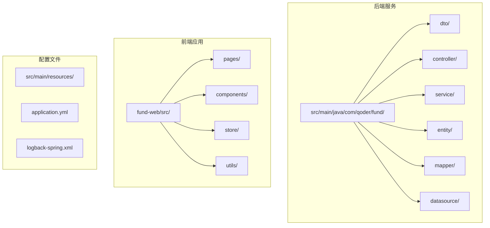

**图表来源**
- [FundApplication.java](file://src/main/java/com/qoder/fund/FundApplication.java)
- [pom.xml](file://pom.xml)

**章节来源**
- [pom.xml](file://pom.xml)
- [README.md](file://README.md)

## 核心组件

本系统的核心是精心设计的通用数据传输对象（DTO），它们构成了整个系统的数据交换基础。每个DTO都经过深思熟虑的设计，以满足特定的业务需求和使用场景。

### 主要DTO分类

系统中的DTO可以分为以下几个主要类别：

1. **基础信息DTO**：包含基金的基本信息和属性
2. **分析结果DTO**：提供深度分析和洞察的数据结构
3. **报告DTO**：专门用于生成各类投资报告
4. **请求参数DTO**：用于API接口的输入参数验证
5. **指标计算DTO**：专门用于存储计算结果和中间状态

### 设计原则

所有DTO都遵循以下设计原则：
- 使用Lombok注解简化代码
- 采用JSON序列化友好的字段命名
- 包含适当的类型定义和约束
- 支持嵌套对象结构以表达复杂关系
- 强类型安全和数据完整性保证

**章节来源**
- [FundDetailDTO.java:1-45](file://src/main/java/com/qoder/fund/dto/FundDetailDTO.java#L1-L45)
- [DashboardDTO.java:1-25](file://src/main/java/com/qoder/fund/dto/DashboardDTO.java#L1-L25)

## 架构概览

系统采用分层架构设计，DTO位于数据访问层和业务逻辑层之间，作为数据传输的桥梁。架构现已演进为报告驱动的设计模式。

```mermaid
graph TB
subgraph "表示层"
A[前端Web应用]
B[CLI界面]
end
subgraph "控制层"
C[Controller层]
D[API网关]
end
subgraph "业务层"
E[Service层]
F[业务逻辑]
end
subgraph "数据层"
G[DTO层]
H[Entity层]
I[Mapper层]
end
subgraph "数据源"
J[第三方API]
K[数据库]
L[文件存储]
end
subgraph "报告生成"
M[FundDiagnosisDTO]
N[MarketOverviewDTO]
O[PositionRiskWarningDTO]
P[RebalanceTimingDTO]
end
A --> C
B --> C
C --> E
E --> F
F --> G
G --> H
H --> I
I --> K
J --> G
L --> G
M --> G
N --> G
O --> G
P --> G
```

**图表来源**
- [DashboardController.java](file://src/main/java/com/qoder/fund/controller/DashboardController.java)
- [FundService.java](file://src/main/java/com/qoder/fund/service/FundService.java)

## 详细组件分析

### 基础信息DTO

#### FundDetailDTO - 基金详情DTO

FundDetailDTO是系统中最复杂的DTO之一，包含了基金的完整信息和性能数据。

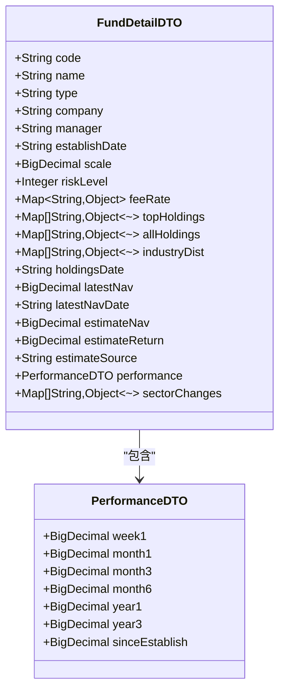

**图表来源**
- [FundDetailDTO.java:11-44](file://src/main/java/com/qoder/fund/dto/FundDetailDTO.java#L11-L44)

**章节来源**
- [FundDetailDTO.java:1-45](file://src/main/java/com/qoder/fund/dto/FundDetailDTO.java#L1-L45)

#### DashboardDTO - 仪表板DTO

DashboardDTO提供了用户投资组合的整体概览信息。

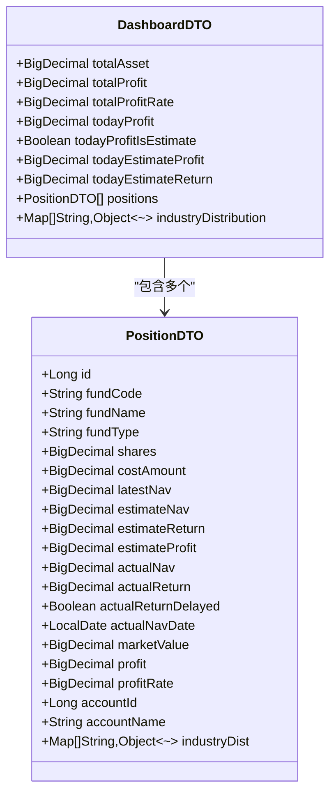

**图表来源**
- [DashboardDTO.java:10-24](file://src/main/java/com/qoder/fund/dto/DashboardDTO.java#L10-L24)
- [PositionDTO.java:11-36](file://src/main/java/com/qoder/fund/dto/PositionDTO.java#L11-L36)

**章节来源**
- [DashboardDTO.java:1-25](file://src/main/java/com/qoder/fund/dto/DashboardDTO.java#L1-L25)

### 分析结果DTO

#### EstimateAnalysisDTO - 实时估值分析DTO

EstimateAnalysisDTO专门用于存储和展示实时估值分析结果。

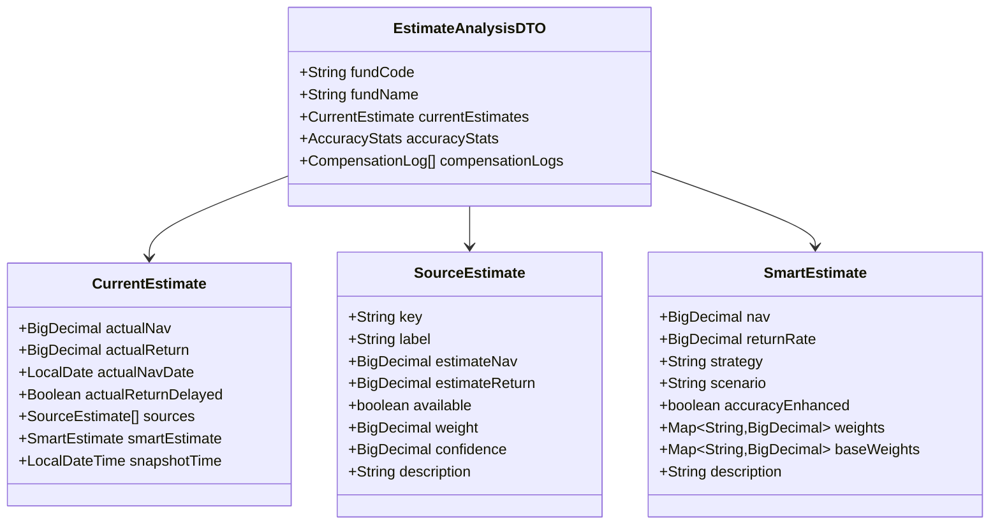

**图表来源**
- [EstimateAnalysisDTO.java:15-90](file://src/main/java/com/qoder/fund/dto/EstimateAnalysisDTO.java#L15-L90)

**章节来源**
- [EstimateAnalysisDTO.java:1-156](file://src/main/java/com/qoder/fund/dto/EstimateAnalysisDTO.java#L1-L156)

#### MarketOverviewDTO - 市场概览DTO

MarketOverviewDTO提供了市场的整体情况和趋势分析。

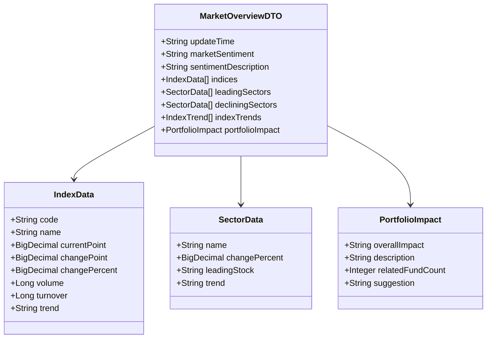

**图表来源**
- [MarketOverviewDTO.java:13-218](file://src/main/java/com/qoder/fund/dto/MarketOverviewDTO.java#L13-L218)

**章节来源**
- [MarketOverviewDTO.java:1-220](file://src/main/java/com/qoder/fund/dto/MarketOverviewDTO.java#L1-L220)

### 报告DTO

#### FundDiagnosisDTO - 基金诊断报告DTO

FundDiagnosisDTO专门用于生成基金诊断报告，提供全面的投资建议和风险评估。

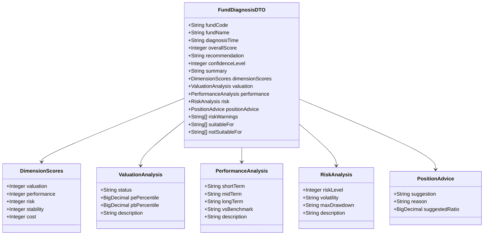

**图表来源**
- [FundDiagnosisDTO.java:89-128](file://src/main/java/com/qoder/fund/dto/FundDiagnosisDTO.java#L89-L128)

**章节来源**
- [FundDiagnosisDTO.java:1-130](file://src/main/java/com/qoder/fund/dto/FundDiagnosisDTO.java#L1-L130)

#### PositionRiskWarningDTO - 持仓风险预警DTO

PositionRiskWarningDTO提供了详细的持仓风险预警和健康指标分析。

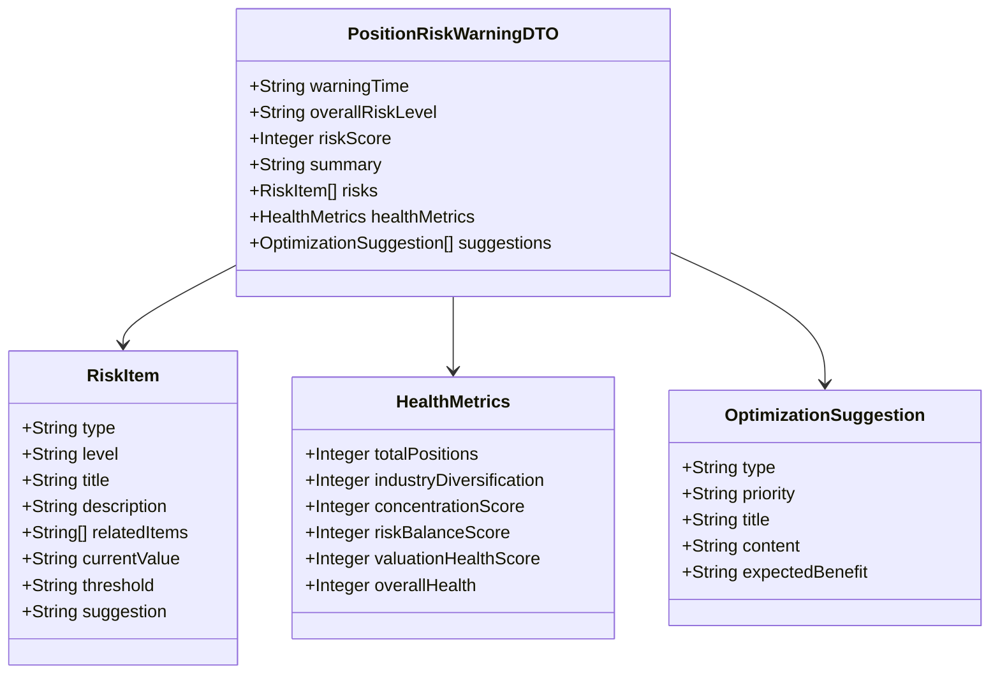

**图表来源**
- [PositionRiskWarningDTO.java:51-159](file://src/main/java/com/qoder/fund/dto/PositionRiskWarningDTO.java#L51-L159)

**章节来源**
- [PositionRiskWarningDTO.java:1-161](file://src/main/java/com/qoder/fund/dto/PositionRiskWarningDTO.java#L1-L161)

#### RebalanceTimingDTO - 调仓时机提醒DTO

RebalanceTimingDTO专门用于提供调仓时机建议和市场机会识别。

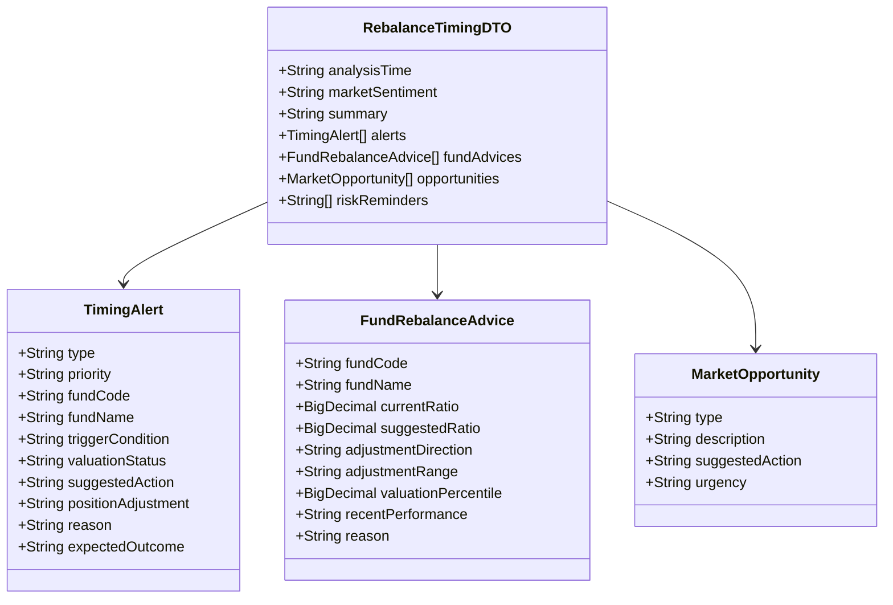

**图表来源**
- [RebalanceTimingDTO.java:52-180](file://src/main/java/com/qoder/fund/dto/RebalanceTimingDTO.java#L52-L180)

**章节来源**
- [RebalanceTimingDTO.java:1-182](file://src/main/java/com/qoder/fund/dto/RebalanceTimingDTO.java#L1-L182)

### 请求参数DTO

#### AddPositionRequest - 添加持仓请求DTO

AddPositionRequest用于验证和传输添加新持仓的请求数据。

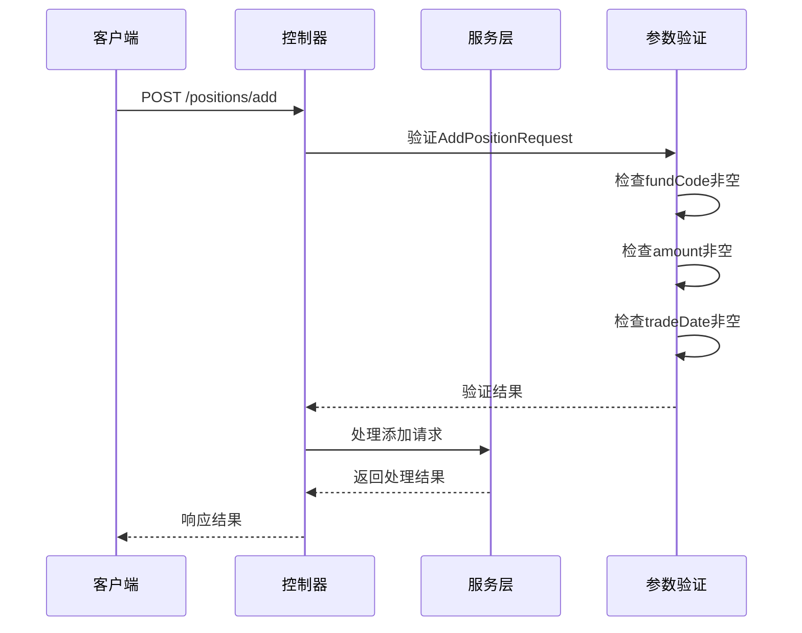

**图表来源**
- [AddPositionRequest.java:11-27](file://src/main/java/com/qoder/fund/dto/request/AddPositionRequest.java#L11-L27)

**章节来源**
- [AddPositionRequest.java:1-28](file://src/main/java/com/qoder/fund/dto/request/AddPositionRequest.java#L1-L28)

### 指标计算DTO

#### CliPositionIndicatorDTO - CLI持仓指标DTO

CliPositionIndicatorDTO专门为CLI界面提供客观的持仓指标数据。

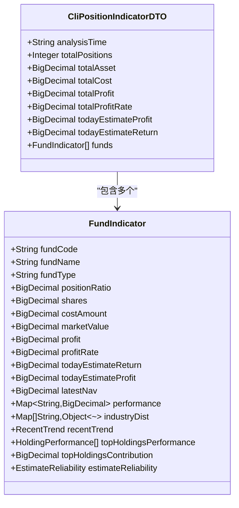

**图表来源**
- [CliPositionIndicatorDTO.java:15-157](file://src/main/java/com/qoder/fund/dto/CliPositionIndicatorDTO.java#L15-L157)

**章节来源**
- [CliPositionIndicatorDTO.java:1-204](file://src/main/java/com/qoder/fund/dto/CliPositionIndicatorDTO.java#L1-L204)

### 辅助DTO

#### 其他重要DTO

系统还包含其他重要的辅助DTO：

**WatchlistDTO** - 自选股列表DTO
- 存储用户关注的基金信息
- 包含实时估值和智能预估数据
- 支持延迟数据处理

**ProfitAnalysisDTO** - 收益分析DTO  
- 提供收益曲线和回撤分析
- 包含多种统计指标
- 支持时间序列数据分析

**章节来源**
- [WatchlistDTO.java:1-39](file://src/main/java/com/qoder/fund/dto/WatchlistDTO.java#L1-L39)
- [ProfitAnalysisDTO.java:1-69](file://src/main/java/com/qoder/fund/dto/ProfitAnalysisDTO.java#L1-L69)

## 依赖关系分析

系统中的DTO之间存在复杂的依赖关系，形成了一个完整的数据传输网络。

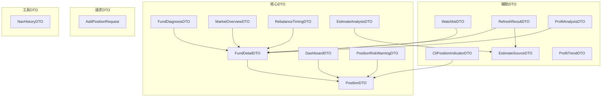

**图表来源**
- [RefreshResultDTO.java:6-9](file://src/main/java/com/qoder/fund/dto/RefreshResultDTO.java#L6-L9)

### 依赖特点

1. **层次化依赖**：核心DTO依赖于基础DTO，报告DTO依赖于核心DTO
2. **双向关联**：某些DTO之间存在相互引用关系
3. **可选依赖**：部分字段使用可选类型，提高灵活性
4. **嵌套结构**：支持深层嵌套的对象结构
5. **报告驱动**：新增的报告DTO形成了独立的报告生成链路

**章节来源**
- [RefreshResultDTO.java:1-10](file://src/main/java/com/qoder/fund/dto/RefreshResultDTO.java#L1-L10)

## 性能考虑

### 数据传输优化

1. **字段选择性**：使用`@JsonIgnore`注解避免不必要的字段传输
2. **类型优化**：使用`BigDecimal`确保金融数据精度
3. **集合优化**：合理使用泛型集合减少类型转换开销
4. **嵌套深度**：控制对象嵌套层级避免过深的数据结构
5. **报告优化**：报告DTO采用分层结构，支持按需加载

### 内存管理

1. **对象复用**：在可能的情况下复用DTO实例
2. **延迟加载**：对于大数据集采用延迟加载策略
3. **流式处理**：支持大数据量的流式处理能力
4. **内存池化**：报告生成过程中的临时对象管理

### 序列化性能

1. **JSON优化**：使用高效的JSON序列化库
2. **字段过滤**：根据需要动态过滤字段
3. **缓存策略**：对频繁访问的数据实施缓存机制
4. **压缩传输**：报告数据支持压缩传输以减少带宽占用

## 故障排除指南

### 常见问题诊断

1. **序列化错误**
   - 检查字段类型兼容性
   - 验证JSON注解配置
   - 确认日期格式正确性

2. **数据完整性问题**
   - 验证必填字段的完整性
   - 检查枚举值的有效性
   - 确认数值范围的合理性

3. **性能问题**
   - 监控DTO大小和复杂度
   - 分析序列化/反序列化耗时
   - 优化嵌套结构深度
   - 检查报告生成的内存使用

4. **报告生成问题**
   - 验证报告DTO的依赖关系
   - 检查报告数据的时效性
   - 确认报告生成的业务逻辑

### 调试技巧

1. **日志记录**：在关键节点添加详细的日志信息
2. **单元测试**：为每个DTO编写完整的单元测试
3. **边界测试**：测试极端值和边界条件
4. **集成测试**：验证DTO在整个系统中的表现
5. **报告测试**：专门针对报告DTO进行集成测试

**章节来源**
- [GlobalExceptionHandler.java](file://src/main/java/com/qoder/fund/common/GlobalExceptionHandler.java)

## 结论

本项目的通用数据传输对象设计体现了现代企业级应用的最佳实践。通过精心设计的DTO层次结构，系统实现了：

1. **清晰的数据模型**：每个DTO都有明确的职责和用途
2. **强类型安全**：编译时检查确保数据类型正确性
3. **灵活的扩展性**：支持未来功能的平滑扩展
4. **高效的性能**：优化的数据结构和序列化策略
5. **良好的可维护性**：清晰的代码结构和文档
6. **报告驱动**：新增的报告DTO支持全面的投资分析和决策支持

这些DTO不仅满足了当前的业务需求，也为未来的功能扩展奠定了坚实的基础。通过合理的架构设计和严格的代码规范，系统能够稳定地支持复杂的投资分析和报告生成功能，为企业级用户提供全面的投资决策支持。