# 通用数据源

<cite>
**本文档引用的文件**
- [FundDataSource.java](file://src/main/java/com/qoder/fund/datasource/FundDataSource.java)
- [EastMoneyDataSource.java](file://src/main/java/com/qoder/fund/datasource/EastMoneyDataSource.java)
- [TencentDataSource.java](file://src/main/java/com/qoder/fund/datasource/TencentDataSource.java)
- [SinaDataSource.java](file://src/main/java/com/qoder/fund/datasource/SinaDataSource.java)
- [TiantianFundDataSource.java](file://src/main/java/com/qoder/fund/datasource/TiantianFundDataSource.java)
- [MarketDataSource.java](file://src/main/java/com/qoder/fund/datasource/MarketDataSource.java)
- [SectorDataSource.java](file://src/main/java/com/qoder/fund/datasource/SectorDataSource.java)
- [StockEstimateDataSource.java](file://src/main/java/com/qoder/fund/datasource/StockEstimateDataSource.java)
- [FundDataAggregator.java](file://src/main/java/com/qoder/fund/datasource/FundDataAggregator.java)
- [CircuitBreaker.java](file://src/main/java/com/qoder/fund/config/CircuitBreaker.java)
- [MarketOverviewDTO.java](file://src/main/java/com/qoder/fund/dto/MarketOverviewDTO.java)
- [application.yml](file://src/main/resources/application.yml)
</cite>

## 更新摘要
**变更内容**
- 系统从AI数据源重命名为通用数据源，专注于通用数据获取能力
- 新增了MarketDataSource和SectorDataSource等市场数据源，提供宏观市场数据
- 移除了AI特定的数据源实现，专注于通用数据聚合架构
- 增强了市场数据获取能力和估值系统的数据源选择策略

## 目录
1. [项目概述](#项目概述)
2. [架构设计](#架构设计)
3. [核心组件](#核心组件)
4. [数据源架构](#数据源架构)
5. [市场数据源](#市场数据源)
6. [估值系统](#估值系统)
7. [熔断机制](#熔断机制)
8. [缓存策略](#缓存策略)
9. [数据聚合流程](#数据聚合流程)
10. [性能优化](#性能优化)
11. [故障处理](#故障处理)
12. [总结](#总结)

## 项目概述

这是一个基于Spring Boot的通用数据源管理系统，专注于提供多数据源的通用数据获取和估值服务。项目采用微服务架构设计，通过多个数据源聚合器实现高可用性和准确性。

### 主要特性
- **多数据源支持**：集成东方财富、新浪财经、腾讯财经等多个权威数据源
- **通用数据获取**：专注于通用数据源架构，移除AI特定实现
- **市场数据获取**：新增MarketDataSource和SectorDataSource专门处理市场宏观数据
- **智能估值系统**：基于机器学习算法的基金实时估值预测
- **熔断保护机制**：防止外部API故障影响系统稳定性
- **缓存优化**：多层次缓存策略提升响应速度
- **降级处理**：完善的故障转移和兜底机制

## 架构设计

### 整体架构图

```mermaid
graph TB
subgraph "客户端层"
WEB[Web界面]
API[REST API]
CLI[命令行工具]
end
subgraph "业务逻辑层"
AGG[FundDataAggregator<br/>数据聚合器]
CALC[FundEstimateCalculator<br/>估值计算器]
WEIGHT[EstimateWeightService<br/>权重服务]
end
subgraph "数据源层"
subgraph "通用数据源"
EM[EastMoneyDataSource<br/>东方财富]
TT[TiantianFundDataSource<br/>天天基金]
SN[SinaDataSource<br/>新浪财经]
TC[TencentDataSource<br/>腾讯财经]
END
subgraph "市场数据源"
MK[MarketDataSource<br/>市场指数]
SC[SectorDataSource<br/>板块数据]
END
subgraph "估值兜底"
SE[StockEstimateDataSource<br/>股票估值]
END
end
subgraph "存储层"
DB[(MySQL数据库)]
CACHE[Caffeine缓存]
end
WEB --> AGG
API --> AGG
CLI --> AGG
AGG --> EM
AGG --> TT
AGG --> SN
AGG --> TC
AGG --> MK
AGG --> SC
AGG --> SE
AGG --> DB
AGG --> CACHE
CALC --> AGG
WEIGHT --> AGG
```

**架构图来源**
- [FundDataAggregator.java:43-54](file://src/main/java/com/qoder/fund/datasource/FundDataAggregator.java#L43-L54)
- [EastMoneyDataSource.java:25-37](file://src/main/java/com/qoder/fund/datasource/EastMoneyDataSource.java#L25-L37)
- [application.yml:29-36](file://src/main/resources/application.yml#L29-L36)

## 核心组件

### FundDataSource 接口

FundDataSource定义了通用数据获取的标准接口规范，确保所有数据源的一致性。

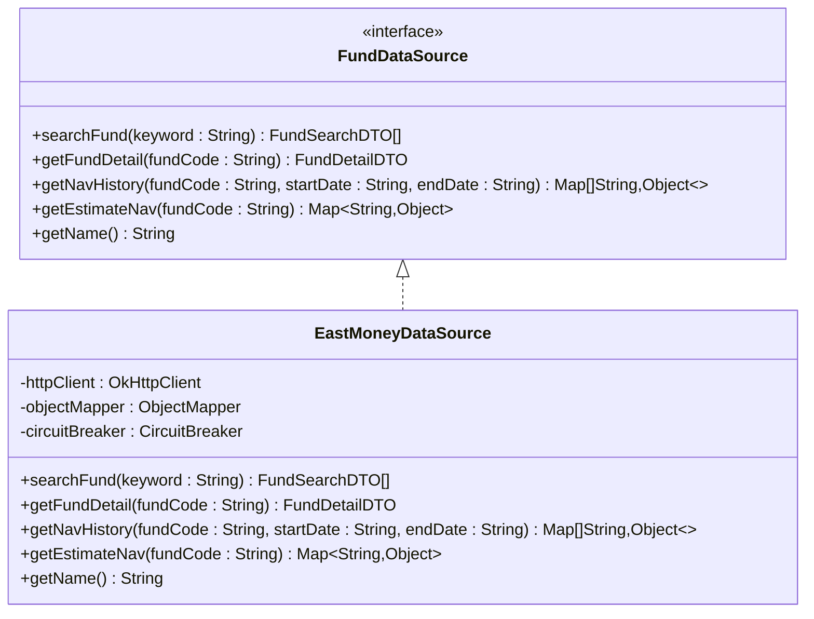

**类图来源**
- [FundDataSource.java:12-42](file://src/main/java/com/qoder/fund/datasource/FundDataSource.java#L12-L42)
- [EastMoneyDataSource.java:25-42](file://src/main/java/com/qoder/fund/datasource/EastMoneyDataSource.java#L25-L42)

**接口来源**
- [FundDataSource.java:12-42](file://src/main/java/com/qoder/fund/datasource/FundDataSource.java#L12-L42)

## 数据源架构

### 多数据源设计

项目实现了多种数据源的并行支持，每个数据源都有其特定的优势和适用场景：

```mermaid
graph LR
subgraph "主数据源"
EM[东方财富<br/>最全面的基金数据]
TT[天天基金<br/>官方估值数据]
end
subgraph "备选数据源"
SN[新浪财经<br/>实时估值]
TC[腾讯财经<br/>严格频率限制]
end
subgraph "市场数据源"
MK[市场指数<br/>大盘数据]
SC[板块数据<br/>行业板块]
END
subgraph "估值兜底"
SE[股票估值<br/>重仓股估算]
END
```

**架构图来源**
- [EastMoneyDataSource.java:25-42](file://src/main/java/com/qoder/fund/datasource/EastMoneyDataSource.java#L25-L42)
- [SinaDataSource.java:21-31](file://src/main/java/com/qoder/fund/datasource/SinaDataSource.java#L21-L31)
- [TencentDataSource.java:21-34](file://src/main/java/com/qoder/fund/datasource/TencentDataSource.java#L21-L34)

### 数据源特点对比

| 数据源 | 优势 | 限制 | 适用场景 |
|--------|------|------|----------|
| 东方财富 | 数据最全面，支持历史数据 | 请求频繁，需要熔断保护 | 基金详情、净值历史 |
| 天天基金 | 官方估值，准确性高 | 接口不稳定 | 实时估值 |
| 新浪财经 | 实时性强 | 数据完整性一般 | 实时估值备份 |
| 腾讯财经 | 估值准确 | 频率限制严格 | 实时估值备份 |
| 股票估值 | 万无一失的兜底 | 准确性相对较低 | 系统故障时 |
| 市场数据源 | 宏观经济数据 | 需要专门处理 | 市场分析 |
| 板块数据源 | 行业板块信息 | 部分接口限制 | 行业研究 |

**数据源对比来源**
- [EastMoneyDataSource.java:45-84](file://src/main/java/com/qoder/fund/datasource/EastMoneyDataSource.java#L45-L84)
- [SinaDataSource.java:36-105](file://src/main/java/com/qoder/fund/datasource/SinaDataSource.java#L36-L105)
- [TencentDataSource.java:40-125](file://src/main/java/com/qoder/fund/datasource/TencentDataSource.java#L40-L125)

## 市场数据源

### MarketDataSource 市场指数数据源

MarketDataSource专门负责获取市场宏观数据，包括大盘指数、板块热度等信息。

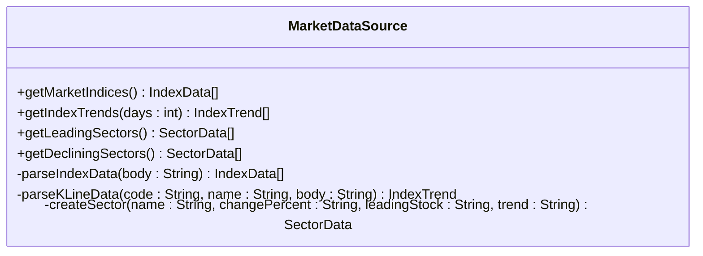

**类图来源**
- [MarketDataSource.java:22-343](file://src/main/java/com/qoder/fund/datasource/MarketDataSource.java#L22-L343)

### SectorDataSource 板块数据源

SectorDataSource提供行业板块数据获取功能，支持多数据源切换和降级处理。

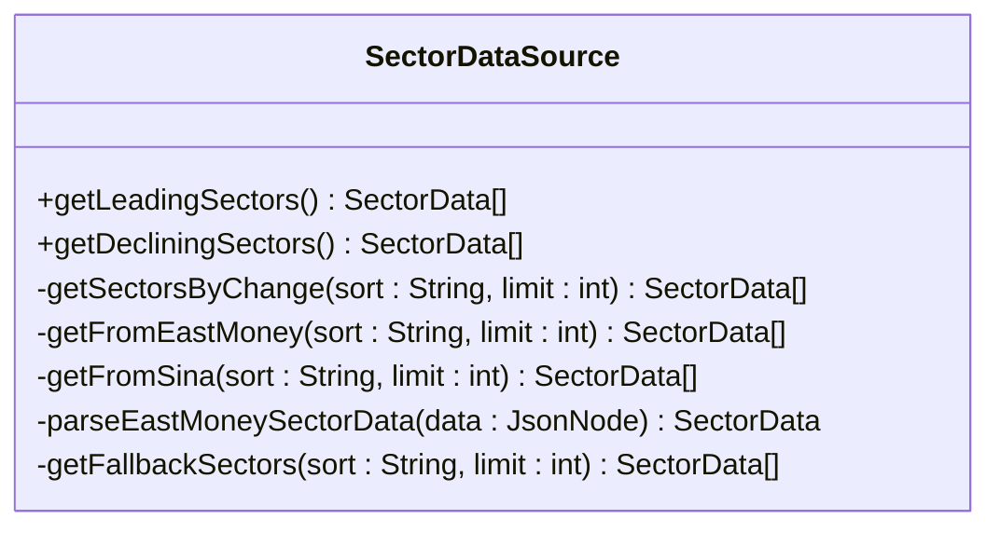

**类图来源**
- [SectorDataSource.java:23-234](file://src/main/java/com/qoder/fund/datasource/SectorDataSource.java#L23-L234)

### 市场数据获取流程

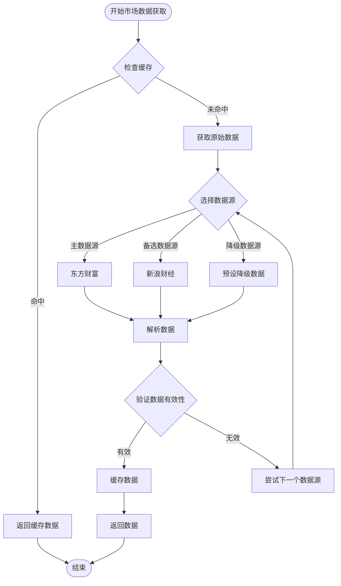

**流程图来源**
- [MarketDataSource.java:47-81](file://src/main/java/com/qoder/fund/datasource/MarketDataSource.java#L47-L81)
- [SectorDataSource.java:57-75](file://src/main/java/com/qoder/fund/datasource/SectorDataSource.java#L57-L75)

## 估值系统

### 智能估值架构

估值系统采用多源融合的智能决策机制，通过机器学习算法优化估值准确性：

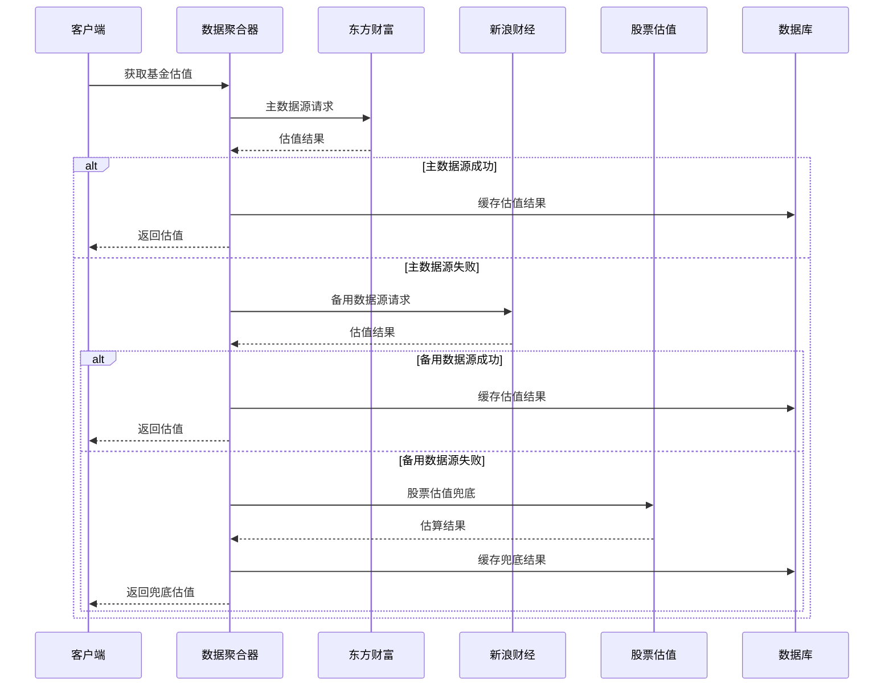

**序列图来源**
- [FundDataAggregator.java:115-146](file://src/main/java/com/qoder/fund/datasource/FundDataAggregator.java#L115-L146)
- [StockEstimateDataSource.java:53-191](file://src/main/java/com/qoder/fund/datasource/StockEstimateDataSource.java#L53-L191)

### 估值权重计算

系统通过历史准确度数据动态调整各数据源的权重：

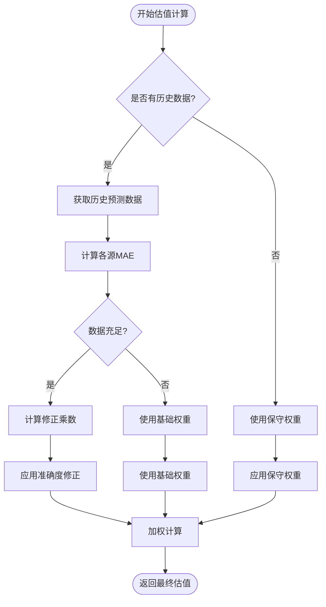

**流程图来源**
- [FundDataAggregator.java:569-704](file://src/main/java/com/qoder/fund/datasource/FundDataAggregator.java#L569-L704)
- [FundDataAggregator.java:713-768](file://src/main/java/com/qoder/fund/datasource/FundDataAggregator.java#L713-L768)

**权重计算来源**
- [FundDataAggregator.java:598-678](file://src/main/java/com/qoder/fund/datasource/FundDataAggregator.java#L598-L678)

## 熔断机制

### CircuitBreaker 熔断器

系统实现了智能熔断保护机制，防止外部API故障扩散：

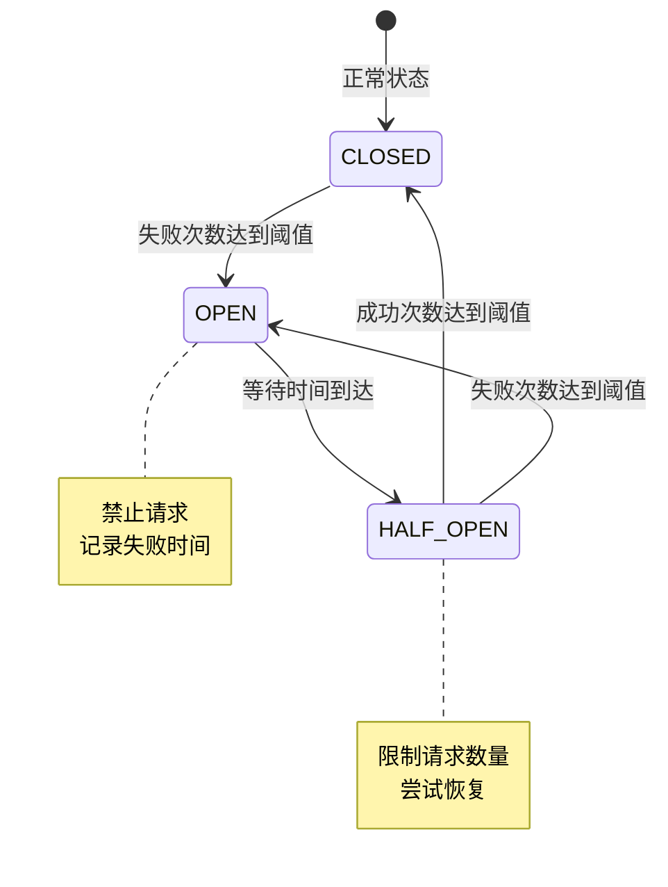

**状态图来源**
- [CircuitBreaker.java:24-28](file://src/main/java/com/qoder/fund/config/CircuitBreaker.java#L24-L28)

### 熔断配置

不同数据源有不同的熔断参数：

| 数据源 | 失败阈值 | 熔断时长 | 半开尝试次数 |
|--------|----------|----------|--------------|
| 东方财富 | 3次 | 60秒 | 默认 |
| 新浪财经 | 5次 | 30秒 | 默认 |
| 股票估值 | 10次 | 20秒 | 默认 |
| 腾讯财经 | 3次 | 120秒 | 默认 |

**熔断配置来源**
- [CircuitBreaker.java:119-123](file://src/main/java/com/qoder/fund/config/CircuitBreaker.java#L119-L123)

## 缓存策略

### 多层次缓存架构

系统采用Caffeine本地缓存配合Spring Cache注解实现高效的数据访问：

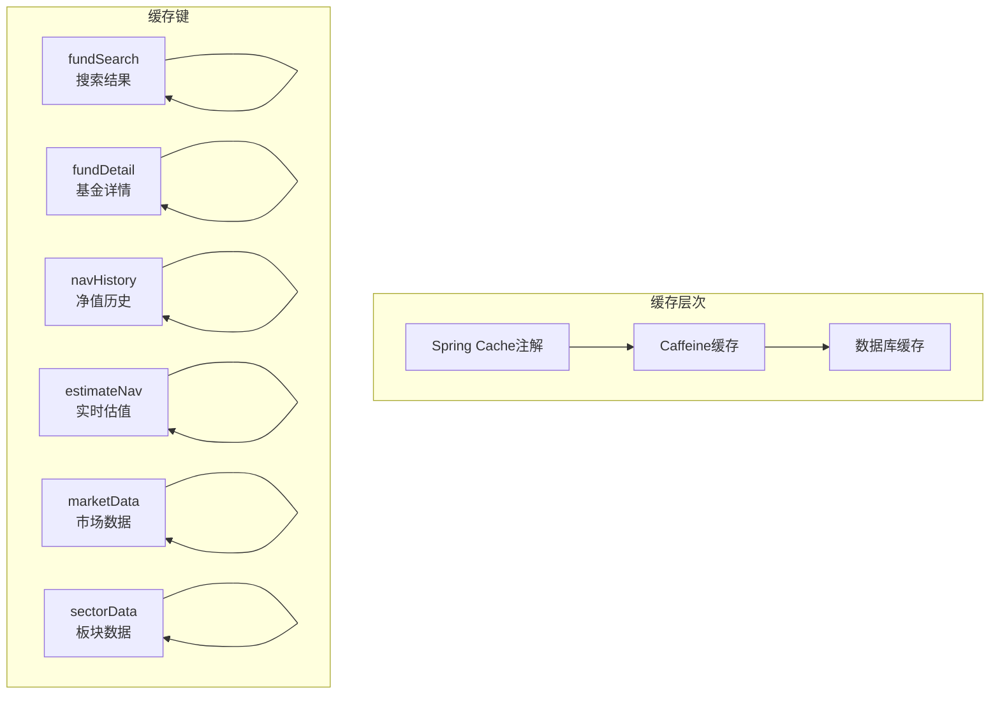

**缓存架构图来源**
- [FundDataAggregator.java:59-62](file://src/main/java/com/qoder/fund/datasource/FundDataAggregator.java#L59-L62)
- [application.yml:30-32](file://src/main/resources/application.yml#L30-L32)

### 缓存配置

- **最大容量**：1000条记录
- **过期时间**：300秒（5分钟）
- **缓存键**：根据具体业务场景设计

**缓存配置来源**
- [application.yml:30-32](file://src/main/resources/application.yml#L30-L32)

## 数据聚合流程

### 完整数据获取流程

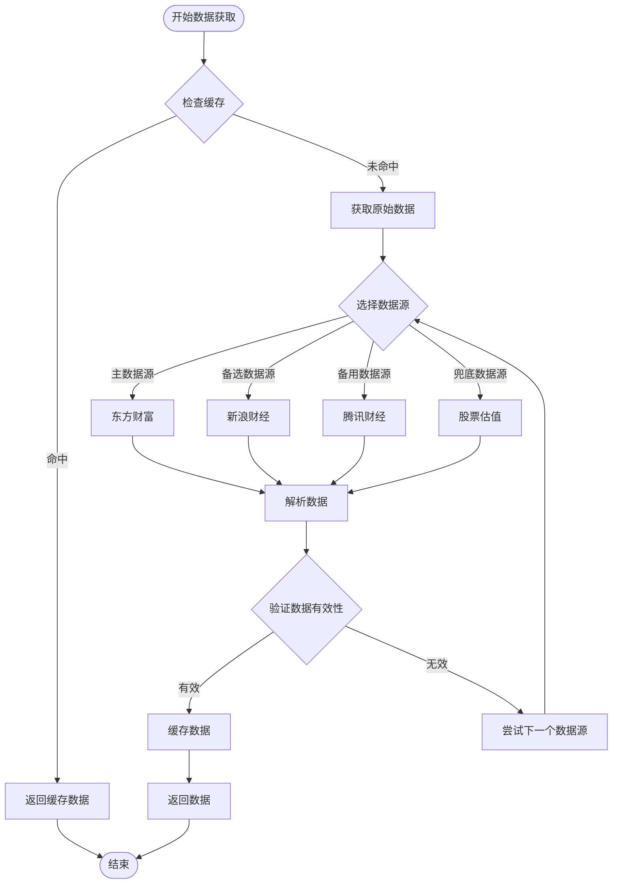

**流程图来源**
- [FundDataAggregator.java:67-101](file://src/main/java/com/qoder/fund/datasource/FundDataAggregator.java#L67-L101)

### 数据质量控制

系统实现了多层次的数据质量保证机制：

1. **数据格式验证**：确保返回数据符合预期格式
2. **数值范围检查**：过滤异常的估值数据
3. **时间戳验证**：确保数据时效性
4. **完整性检查**：验证关键字段是否存在

**质量控制来源**
- [EastMoneyDataSource.java:228-254](file://src/main/java/com/qoder/fund/datasource/EastMoneyDataSource.java#L228-L254)
- [SinaDataSource.java:82-105](file://src/main/java/com/qoder/fund/datasource/SinaDataSource.java#L82-L105)

## 性能优化

### 异步处理机制

系统采用异步处理策略提升响应速度：

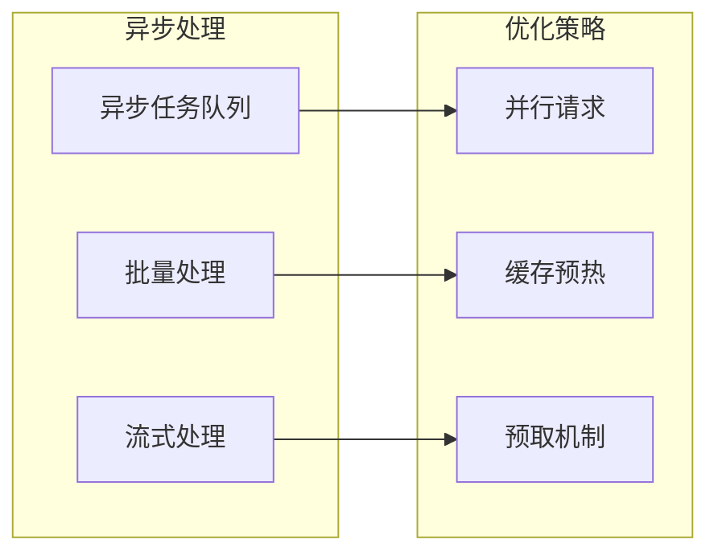

### 性能监控

系统集成了Actuator监控功能，提供详细的性能指标：

- **健康检查**：数据库连接、缓存状态
- **指标统计**：请求响应时间、错误率
- **缓存监控**：命中率、失效率
- **数据源状态**：各数据源可用性

**监控配置来源**
- [application.yml:56-67](file://src/main/resources/application.yml#L56-L67)

## 故障处理

### 完善的降级策略

系统实现了多层次的故障转移机制：

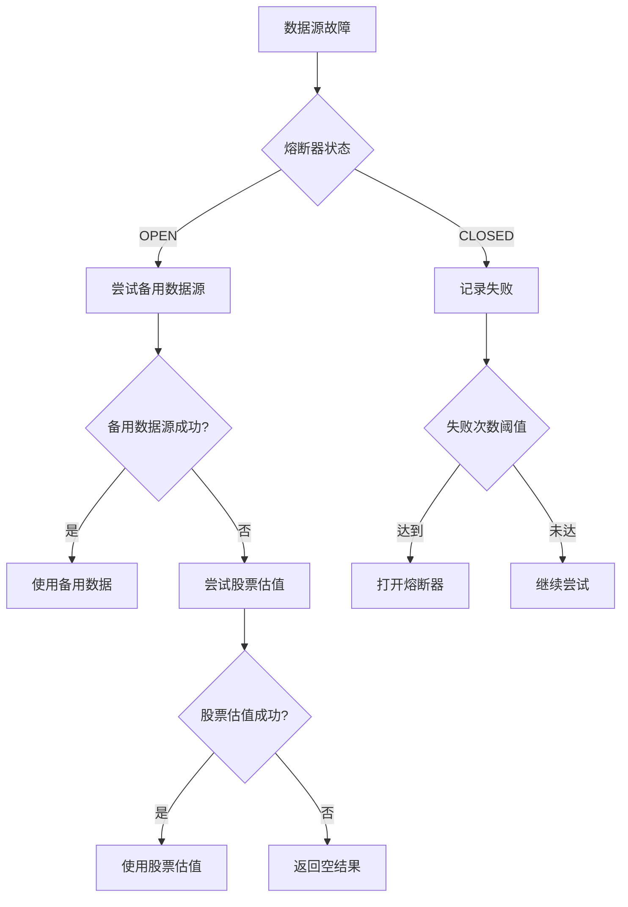

**故障处理流程图来源**
- [CircuitBreaker.java:183-200](file://src/main/java/com/qoder/fund/config/CircuitBreaker.java#L183-L200)

### 错误恢复机制

系统具备自动恢复能力：

1. **熔断器自动恢复**：经过冷却时间后自动尝试恢复
2. **数据源健康检查**：定期检测各数据源可用性
3. **降级数据维护**：保持降级数据的时效性
4. **告警通知机制**：故障发生时及时通知运维人员

**错误恢复来源**
- [CircuitBreaker.java:140-157](file://src/main/java/com/qoder/fund/config/CircuitBreaker.java#L140-L157)

## 总结

通用数据源系统通过以下核心设计实现了高可用性和准确性：

### 技术亮点

1. **多数据源融合**：通过智能权重算法实现最优估值
2. **熔断保护机制**：防止故障传播，保障系统稳定性
3. **缓存优化策略**：大幅提升数据访问性能
4. **降级兜底机制**：确保系统在任何情况下都能提供服务
5. **智能权重调整**：基于历史表现动态优化数据源权重
6. **市场数据集成**：新增MarketDataSource和SectorDataSource专门处理宏观数据

### 应用价值

- **准确性提升**：多源交叉验证显著提高数据准确性
- **稳定性增强**：熔断机制和降级策略确保系统稳定运行
- **性能优化**：缓存和异步处理大幅提升响应速度
- **成本控制**：合理的数据源选择和使用策略降低运营成本
- **市场洞察**：专业的市场数据源为投资决策提供全面支持

该系统为基金管理和投资决策提供了可靠的数据支撑，是现代金融数据服务的典型代表。