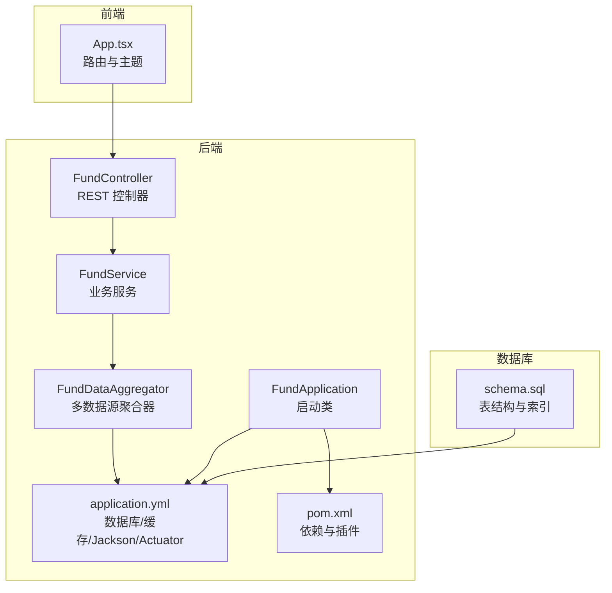
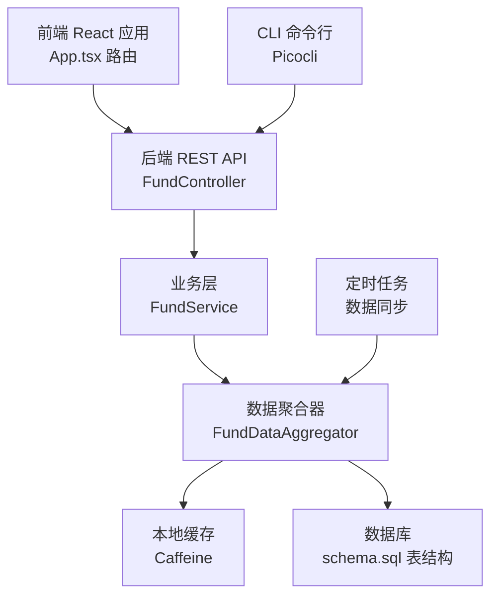
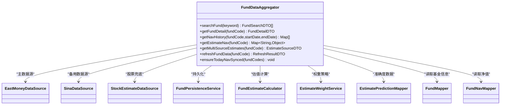
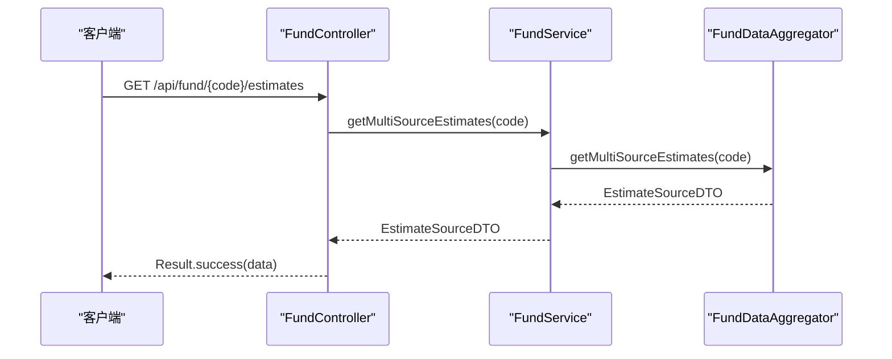
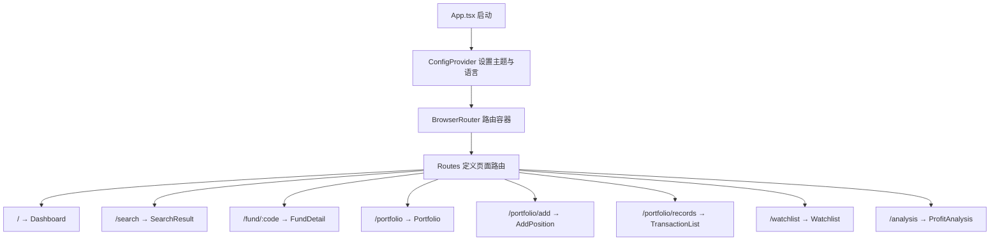
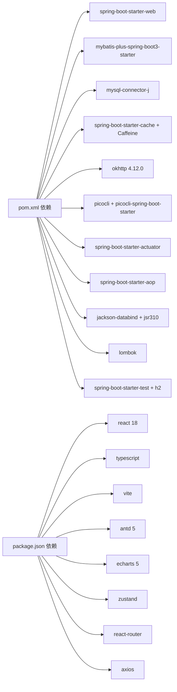

# Agents Maintenance

<cite>
**本文引用的文件**
- [AGENTS.md](file://AGENTS.md)
- [PRD.md](file://PRD.md)
- [PROGRESS.md](file://PROGRESS.md)
- [SPEC.md](file://SPEC.md)
- [README.md](file://README.md)
- [FundApplication.java](file://src/main/java/com/qoder/fund/FundApplication.java)
- [pom.xml](file://pom.xml)
- [application.yml](file://src/main/resources/application.yml)
- [schema.sql](file://src/main/resources/db/schema.sql)
- [FundDataAggregator.java](file://src/main/java/com/qoder/fund/datasource/FundDataAggregator.java)
- [FundService.java](file://src/main/java/com/qoder/fund/service/FundService.java)
- [FundController.java](file://src/main/java/com/qoder/fund/controller/FundController.java)
- [App.tsx](file://fund-web/src/App.tsx)
</cite>

## 目录
1. [简介](#简介)
2. [项目结构](#项目结构)
3. [核心组件](#核心组件)
4. [架构总览](#架构总览)
5. [详细组件分析](#详细组件分析)
6. [依赖分析](#依赖分析)
7. [性能考虑](#性能考虑)
8. [故障排查指南](#故障排查指南)
9. [结论](#结论)
10. [附录](#附录)

## 简介
本文件面向 AI Agent，系统化梳理“Agents Maintenance”相关的项目维护工作，涵盖项目概述、开发规范、协作流程、技术架构、核心组件职责、数据流与处理逻辑、依赖关系、性能与故障排查建议，以及维护检查清单。目标是帮助 Agent 在不直接阅读源码的情况下，也能高效地理解与维护该基金数据聚合管理系统的后端与前端。

## 项目结构
项目采用前后端分离架构，后端基于 Spring Boot，前端基于 React + TypeScript，支持 Web 与 CLI 双模式运行。核心模块包括：
- 后端：控制器层、服务层、数据访问层、实体与 DTO、配置与定时任务、CLI 命令行工具
- 前端：路由、页面组件、API 请求层、状态管理、工具函数与样式主题
- 数据库：MySQL，包含基金、净值、账户、持仓、交易、自选、估值预测等表
- 配置：Maven 依赖与打包、Spring Boot 配置、Actuator 健康检查、缓存与 Jackson 序列化



**图表来源**
- [FundApplication.java:1-16](file://src/main/java/com/qoder/fund/FundApplication.java#L1-L16)
- [application.yml:1-68](file://src/main/resources/application.yml#L1-L68)
- [pom.xml:1-174](file://pom.xml#L1-L174)
- [FundDataAggregator.java:1-712](file://src/main/java/com/qoder/fund/datasource/FundDataAggregator.java#L1-L712)
- [FundService.java:1-75](file://src/main/java/com/qoder/fund/service/FundService.java#L1-L75)
- [FundController.java:1-79](file://src/main/java/com/qoder/fund/controller/FundController.java#L1-L79)
- [App.tsx:1-67](file://fund-web/src/App.tsx#L1-L67)
- [schema.sql:1-96](file://src/main/resources/db/schema.sql#L1-L96)

**章节来源**
- [README.md:180-211](file://README.md#L180-L211)
- [SPEC.md:56-113](file://SPEC.md#L56-L113)

## 核心组件
- 启动与配置
  - 后端启动类负责扫描 Mapper 与启动 Spring Boot 应用
  - Maven 配置包含 Web、MyBatis-Plus、MySQL、OkHttp、Lombok、Picocli、Actuator、Checkstyle 等依赖
  - Spring Boot 配置定义数据库连接、缓存、Jackson 序列化、MyBatis-Plus 全局配置、Actuator 暴露端点
- 数据聚合与服务
  - FundDataAggregator 实现多数据源聚合、缓存、兜底估值、智能权重与准确度修正
  - FundService 提供搜索、详情、净值历史、多源估值、刷新等业务方法
  - FundController 提供 REST 接口，统一返回 Result 包装
- 前端路由与主题
  - App.tsx 定义路由与 Ant Design 主题配置，承载所有页面

**章节来源**
- [FundApplication.java:1-16](file://src/main/java/com/qoder/fund/FundApplication.java#L1-L16)
- [pom.xml:20-116](file://pom.xml#L20-L116)
- [application.yml:4-68](file://src/main/resources/application.yml#L4-L68)
- [FundDataAggregator.java:36-101](file://src/main/java/com/qoder/fund/datasource/FundDataAggregator.java#L36-L101)
- [FundService.java:20-75](file://src/main/java/com/qoder/fund/service/FundService.java#L20-L75)
- [FundController.java:24-79](file://src/main/java/com/qoder/fund/controller/FundController.java#L24-L79)
- [App.tsx:45-67](file://fund-web/src/App.tsx#L45-L67)

## 架构总览
系统采用分层架构：前端通过 REST API 与后端交互，后端按 Controller → Service → Mapper 分层，数据访问通过 MyBatis-Plus，缓存使用 Caffeine，定时任务负责数据同步，CLI 模式支持命令行工具。



**图表来源**
- [SPEC.md:27-52](file://SPEC.md#L27-L52)
- [FundController.java:24-79](file://src/main/java/com/qoder/fund/controller/FundController.java#L24-L79)
- [FundService.java:20-75](file://src/main/java/com/qoder/fund/service/FundService.java#L20-L75)
- [FundDataAggregator.java:36-101](file://src/main/java/com/qoder/fund/datasource/FundDataAggregator.java#L36-L101)
- [schema.sql:1-96](file://src/main/resources/db/schema.sql#L1-L96)
- [application.yml:29-36](file://src/main/resources/application.yml#L29-L36)
- [pom.xml:41-49](file://pom.xml#L41-L49)

## 详细组件分析

### 组件 A：多数据源聚合器（FundDataAggregator）
职责与特性：
- 搜索与详情缓存：对搜索与详情使用缓存，避免重复请求外部数据源
- 多源估值：优先主数据源（天天基金），失败时降级到备用源（新浪财经），最终使用股票重仓股加权兜底
- 智能权重与准确度修正：基于历史预测准确度（MAE）动态调整权重，冷启动期使用保守权重
- 实际净值检测：检测当日是否已发布实际净值，延迟发布（如 QDII）时回退到最近交易日
- 批量预同步：定时预同步当日净值，避免后续查询失败
- 刷新机制：支持按基金代码手动刷新详情与估值缓存



**图表来源**
- [FundDataAggregator.java:36-101](file://src/main/java/com/qoder/fund/datasource/FundDataAggregator.java#L36-L101)
- [FundDataAggregator.java:115-146](file://src/main/java/com/qoder/fund/datasource/FundDataAggregator.java#L115-L146)
- [FundDataAggregator.java:237-341](file://src/main/java/com/qoder/fund/datasource/FundDataAggregator.java#L237-L341)
- [FundDataAggregator.java:528-620](file://src/main/java/com/qoder/fund/datasource/FundDataAggregator.java#L528-L620)

**章节来源**
- [FundDataAggregator.java:36-101](file://src/main/java/com/qoder/fund/datasource/FundDataAggregator.java#L36-L101)
- [FundDataAggregator.java:115-146](file://src/main/java/com/qoder/fund/datasource/FundDataAggregator.java#L115-L146)
- [FundDataAggregator.java:237-341](file://src/main/java/com/qoder/fund/datasource/FundDataAggregator.java#L237-L341)
- [FundDataAggregator.java:528-620](file://src/main/java/com/qoder/fund/datasource/FundDataAggregator.java#L528-L620)

### 组件 B：服务层（FundService）
职责与特性：
- 搜索：关键词长度≥2时才发起搜索
- 详情：委托聚合器获取详情
- 净值历史：根据周期计算起止日期，调用聚合器获取原始数据并转换为 DTO
- 多源估值：返回各数据源估值与智能综合预估
- 刷新：清理缓存并重新获取详情与估值



**图表来源**
- [FundController.java:56-59](file://src/main/java/com/qoder/fund/controller/FundController.java#L56-L59)
- [FundService.java:67-69](file://src/main/java/com/qoder/fund/service/FundService.java#L67-L69)
- [FundDataAggregator.java:237-341](file://src/main/java/com/qoder/fund/datasource/FundDataAggregator.java#L237-L341)

**章节来源**
- [FundService.java:26-74](file://src/main/java/com/qoder/fund/service/FundService.java#L26-L74)
- [FundController.java:32-77](file://src/main/java/com/qoder/fund/controller/FundController.java#L32-L77)

### 组件 C：控制器层（FundController）
职责与特性：
- 提供搜索、详情、净值历史、多源估值、刷新、估计分析等接口
- 统一返回 Result 包装，便于前端处理
- 对不存在的基金返回 404 错误

```mermaid
flowchart TD
Start(["请求进入 FundController"]) --> CheckPath["解析路径参数 code"]
CheckPath --> Action{"请求方法与路径"}
Action --> |GET /search| DoSearch["调用 FundService.search(keyword)"]
Action --> |GET /{code}| DoDetail["调用 FundService.getDetail(code)"]
Action --> |GET /{code}/nav-history| DoNav["调用 FundService.getNavHistory(code, period)"]
Action --> |GET /{code}/estimates| DoEst["调用 FundService.getMultiSourceEstimates(code)"]
Action --> |POST /{code}/refresh| DoRefresh["调用 FundService.refreshFundData(code)"]
DoSearch --> Wrap["Result.success(...)"]
DoDetail --> DetailCheck{"detail 是否为空"}
DetailCheck --> |是| Return404["Result.error(404)"]
DetailCheck --> |否| Wrap
DoNav --> Wrap
DoEst --> Wrap
DoRefresh --> Wrap
Wrap --> End(["返回响应"])
Return404 --> End
```

**图表来源**
- [FundController.java:32-77](file://src/main/java/com/qoder/fund/controller/FundController.java#L32-L77)
- [FundService.java:26-74](file://src/main/java/com/qoder/fund/service/FundService.java#L26-L74)

**章节来源**
- [FundController.java:24-79](file://src/main/java/com/qoder/fund/controller/FundController.java#L24-L79)

### 组件 D：前端路由与主题（App.tsx）
职责与特性：
- 定义站点路由，包含 Dashboard、搜索、基金详情、持仓、自选、分析等页面
- 配置 Ant Design 主题与中文本地化



**图表来源**
- [App.tsx:45-67](file://fund-web/src/App.tsx#L45-L67)

**章节来源**
- [App.tsx:45-67](file://fund-web/src/App.tsx#L45-L67)

## 依赖分析
- 后端依赖
  - Web 与缓存：spring-boot-starter-web、spring-boot-starter-cache、Caffeine
  - 数据库：MyBatis-Plus、MySQL Connector、HikariCP
  - HTTP 客户端：OkHttp
  - CLI：Picocli + picocli-spring-boot-starter
  - 监控：Actuator
  - 校验与日志：validation、AOP、Logback
- 前端依赖
  - React 18、Ant Design 5、ECharts、Zustand、React Router、Axios



**图表来源**
- [pom.xml:20-116](file://pom.xml#L20-L116)
- [README.md:76-87](file://README.md#L76-L87)

**章节来源**
- [pom.xml:20-116](file://pom.xml#L20-L116)
- [README.md:76-87](file://README.md#L76-L87)

## 性能考虑
- 缓存策略
  - 使用 Caffeine 本地缓存，缓存键按资源粒度划分，避免缓存穿透与雪崩
  - 对搜索、详情、净值历史、估值分别设置缓存，结合定时任务与手动刷新
- 数据源降级与兜底
  - 多数据源轮询与兜底策略减少单点故障影响
  - 智能权重与准确度修正提升估值可信度
- 定时任务与批量处理
  - 批量预同步当日净值，避免高频请求触发限流
- 前端性能
  - ECharts 图表按需渲染，路由懒加载，主题与组件样式统一

[本节为通用性能建议，不直接分析具体文件]

## 故障排查指南
- 后端常见问题
  - 数据源不可用：检查多数据源降级逻辑与兜底估值是否生效
  - 缓存异常：清理指定缓存键后重试，确认缓存配置与键生成规则
  - 定时任务失败：查看 Actuator 指标与日志，确认任务调度与数据库连接
  - CLI 命令异常：确认打包模式与主类配置，检查命令参数与返回值
- 前端常见问题
  - 路由不生效：检查 App.tsx 路由配置与页面组件导出
  - 图表渲染异常：确认数据格式与 ECharts 配置，检查网络请求与接口返回
- 数据库问题
  - 连接池异常：检查 HikariCP 参数与数据库状态
  - 表结构不一致：核对 schema.sql 与实际表结构，必要时执行迁移

**章节来源**
- [application.yml:12-22](file://src/main/resources/application.yml#L12-L22)
- [application.yml:56-68](file://src/main/resources/application.yml#L56-L68)
- [FundDataAggregator.java:343-352](file://src/main/java/com/qoder/fund/datasource/FundDataAggregator.java#L343-L352)
- [App.tsx:45-67](file://fund-web/src/App.tsx#L45-L67)
- [schema.sql:1-96](file://src/main/resources/db/schema.sql#L1-L96)

## 结论
本项目通过明确的分层架构、多数据源聚合与智能权重策略、完善的缓存与定时任务机制，实现了稳定高效的基金数据聚合与展示能力。Agent 在维护过程中应重点关注数据源可用性、缓存一致性、定时任务稳定性与 CLI 命令的健壮性，确保系统在复杂外部环境下仍能提供高质量的数据服务。

## 附录
- 维护检查清单（AI 完成任务后执行）
  - 是否新增了模块/功能？→ 更新 AGENTS.md
  - 是否完成了重要功能？→ 更新 PROGRESS.md
  - 是否做了技术选型/架构决策？→ 创建 ADR
  - 是否需要调整代码规范？→ 建议更新 checkstyle/ESLint
- 任务与协作流程
  - 阅读任务清单与技术规范，确认需求范围
  - 遵循“小步快跑”，频繁提交并通过测试
  - 完成验证后更新任务清单与文档

**章节来源**
- [AGENTS.md:127-132](file://AGENTS.md#L127-L132)
- [PROGRESS.md:95-128](file://PROGRESS.md#L95-L128)