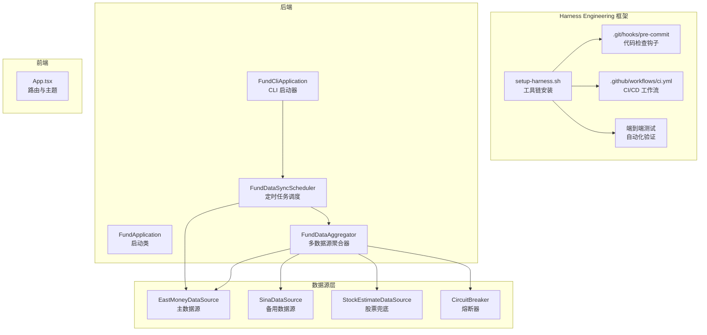
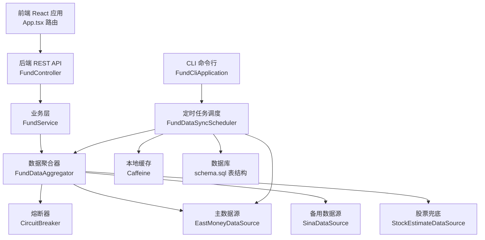
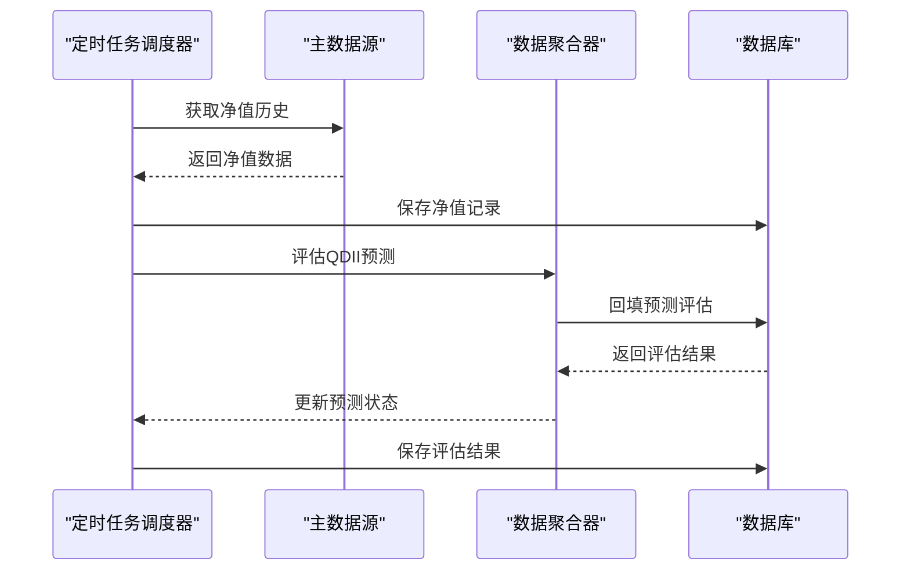
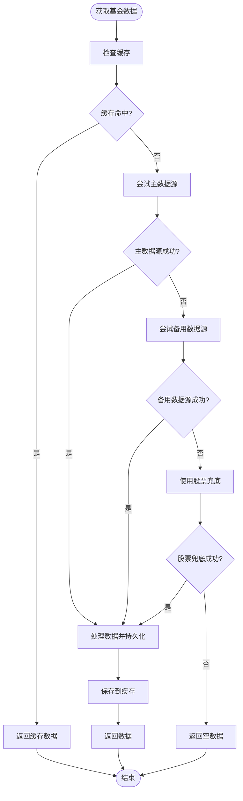
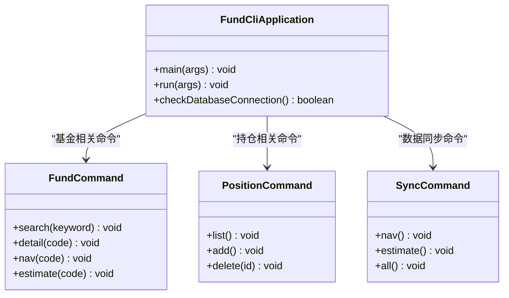
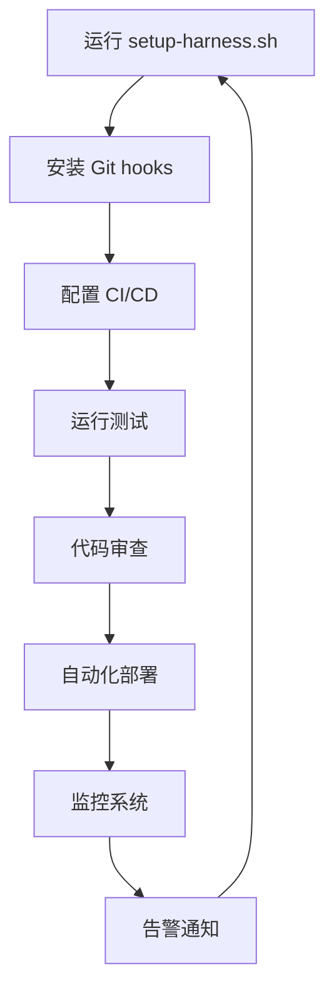
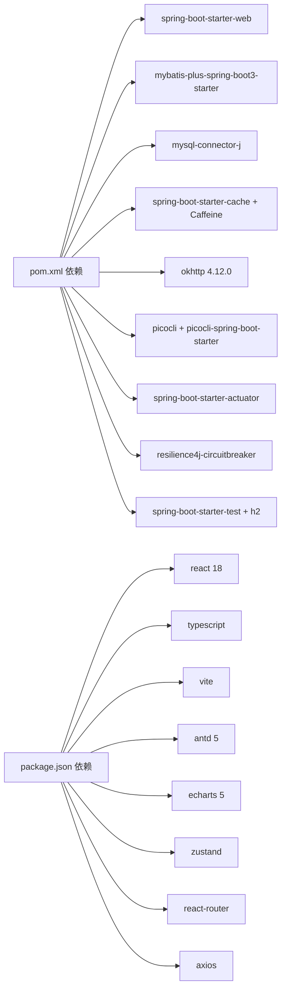

# AI Agent 维护

<cite>
**本文引用的文件**
- [AGENTS.md](file://AGENTS.md)
- [PRD.md](file://PRD.md)
- [PROGRESS.md](file://PROGRESS.md)
- [SPEC.md](file://SPEC.md)
- [README.md](file://README.md)
- [FundApplication.java](file://src/main/java/com/qoder/fund/FundApplication.java)
- [FundDataSyncScheduler.java](file://src/main/java/com/qoder/fund/scheduler/FundDataSyncScheduler.java)
- [FundCliApplication.java](file://src/main/java/com/qoder/fund/cli/FundCliApplication.java)
- [FundDataAggregator.java](file://src/main/java/com/qoder/fund/datasource/FundDataAggregator.java)
- [EastMoneyDataSource.java](file://src/main/java/com/qoder/fund/datasource/EastMoneyDataSource.java)
- [setup-harness.sh](file://scripts/setup-harness.sh)
- [install-cron.sh](file://scripts/install-cron.sh)
- [adr-001-tech-stack.md](file://docs/architecture/adr-001-tech-stack.md)
</cite>

## 更新摘要
**所做更改**
- 新增 Harness Engineering 方法论在项目中的应用说明
- 更新 AI Agent 在自动化部署和 cron 作业管理中的新作用
- 增强定时任务调度和数据同步机制的文档说明
- 完善 CLI 工具在 AI Agent 协作流程中的角色定位
- 新增数据源熔断器和降级策略的技术细节

## 目录
1. [简介](#简介)
2. [Harness Engineering 方法论](#harness-engineering-方法论)
3. [项目结构](#项目结构)
4. [核心组件](#核心组件)
5. [架构总览](#架构总览)
6. [详细组件分析](#详细组件分析)
7. [AI Agent 协作流程](#ai-agent-协作流程)
8. [自动化部署与 Cron 作业管理](#自动化部署与-cron-作业管理)
9. [依赖分析](#依赖分析)
10. [性能考虑](#性能考虑)
11. [故障排查指南](#故障排查指南)
12. [结论](#结论)
13. [附录](#附录)

## 简介
本文档面向 AI Agent，系统化梳理"Agents Maintenance"相关的项目维护工作，重点体现 Harness Engineering 方法论在项目中的应用。文档涵盖项目概述、开发规范、协作流程、技术架构、核心组件职责、数据流与处理逻辑、依赖关系、性能与故障排查建议，以及维护检查清单。目标是帮助 Agent 在不直接阅读源码的情况下，也能高效地理解与维护该基金数据聚合管理系统的后端与前端。

## Harness Engineering 方法论
Harness Engineering 是本项目采用的系统化工程方法论，旨在通过标准化的工具链、自动化流程和质量保证机制，提升 AI Agent 的开发效率和代码质量。

### 核心原则
- **标准化工具链**：统一的 Git hooks、CI/CD、代码检查工具
- **自动化流程**：从代码提交到部署的全流程自动化
- **质量保证**：通过熔断器、降级策略、缓存机制确保系统稳定性
- **可观测性**：完整的日志系统、监控指标和错误追踪

### 关键组件
- **预提交钩子**：自动执行代码检查和格式化
- **CI/CD 工作流**：GitHub Actions 自动化测试和部署
- **熔断器模式**：外部数据源故障时的降级策略
- **缓存策略**：多层级缓存机制确保系统响应性能

**章节来源**
- [setup-harness.sh:1-87](file://scripts/setup-harness.sh#L1-L87)
- [AGENTS.md:112-132](file://AGENTS.md#L112-L132)

## 项目结构
项目采用前后端分离架构，后端基于 Spring Boot，前端基于 React + TypeScript，支持 Web 与 CLI 双模式运行。核心模块包括：
- 后端：控制器层、服务层、数据访问层、实体与 DTO、配置与定时任务、CLI 命令行工具
- 前端：路由、页面组件、API 请求层、状态管理、工具函数与样式主题
- 数据库：MySQL，包含基金、净值、账户、持仓、交易、自选、估值预测等表
- 配置：Maven 依赖与打包、Spring Boot 配置、Actuator 健康检查、缓存与 Jackson 序列化

**图表来源**
- [setup-harness.sh:1-87](file://scripts/setup-harness.sh#L1-L87)
- [FundDataSyncScheduler.java:1-725](file://src/main/java/com/qoder/fund/scheduler/FundDataSyncScheduler.java#L1-L725)
- [FundCliApplication.java:1-215](file://src/main/java/com/qoder/fund/cli/FundCliApplication.java#L1-L215)
- [FundDataAggregator.java:1-200](file://src/main/java/com/qoder/fund/datasource/FundDataAggregator.java#L1-L200)

**章节来源**
- [README.md:180-211](file://README.md#L180-L211)
- [SPEC.md:56-113](file://SPEC.md#L56-L113)

## 核心组件
- **Harness Engineering 工具链**
  - setup-harness.sh 自动安装 Git hooks、Maven wrapper 和依赖
  - 预提交钩子自动执行代码检查和格式化
  - CI/CD 工作流自动化测试和部署
- **定时任务调度系统**
  - FundDataSyncScheduler 负责净值同步、估值快照、预测评估
  - 支持 A股和QDII基金差异化处理
  - 多批次评估确保预测准确性
- **多数据源聚合器**
  - 主数据源：天天基金/东方财富
  - 备用数据源：新浪财经
  - 兜底策略：股票重仓股加权估算
  - 熔断器模式：外部数据源故障时的降级策略
- **CLI 命令行工具**
  - 支持基金查询、持仓管理、数据同步等命令
  - 专为 AI Agent 定时任务设计的简洁模式
  - JSON 格式输出便于自动化集成

**章节来源**
- [setup-harness.sh:1-87](file://scripts/setup-harness.sh#L1-L87)
- [FundDataSyncScheduler.java:1-725](file://src/main/java/com/qoder/fund/scheduler/FundDataSyncScheduler.java#L1-L725)
- [FundDataAggregator.java:1-200](file://src/main/java/com/qoder/fund/datasource/FundDataAggregator.java#L1-L200)
- [FundCliApplication.java:1-215](file://src/main/java/com/qoder/fund/cli/FundCliApplication.java#L1-L215)

## 架构总览
系统采用分层架构：前端通过 REST API 与后端交互，后端按 Controller → Service → Mapper 分层，数据访问通过 MyBatis-Plus，缓存使用 Caffeine，定时任务负责数据同步，CLI 模式支持命令行工具。Harness Engineering 方法论贯穿整个架构，提供标准化的工具链和质量保证机制。

**图表来源**
- [SPEC.md:27-52](file://SPEC.md#L27-L52)
- [FundDataAggregator.java:36-101](file://src/main/java/com/qoder/fund/datasource/FundDataAggregator.java#L36-L101)
- [FundDataSyncScheduler.java:1-725](file://src/main/java/com/qoder/fund/scheduler/FundDataSyncScheduler.java#L1-L725)
- [FundCliApplication.java:1-215](file://src/main/java/com/qoder/fund/cli/FundCliApplication.java#L1-L215)

## 详细组件分析

### 组件 A：定时任务调度系统（FundDataSyncScheduler）
职责与特性：
- **启动数据补偿**：应用启动时自动补偿缺失的净值数据、回填预测评估、刷新重仓股数据
- **净值同步**：每日 19:30 同步交易日净值，21:30 补充同步未发布的净值
- **估值快照**：A股基金每日 14:50 快照，QDII基金每日 23:00 快照
- **预测评估**：分三批评估预测准确度（20:00、21:00、22:00）
- **重仓股同步**：每周一 20:00 同步用户关注基金的重仓股数据
- **QDII 特殊处理**：针对 T+1 净值延迟发布的特殊评估流程

**图表来源**
- [FundDataSyncScheduler.java:224-247](file://src/main/java/com/qoder/fund/scheduler/FundDataSyncScheduler.java#L224-L247)
- [FundDataSyncScheduler.java:398-403](file://src/main/java/com/qoder/fund/scheduler/FundDataSyncScheduler.java#L398-L403)

**章节来源**
- [FundDataSyncScheduler.java:56-75](file://src/main/java/com/qoder/fund/scheduler/FundDataSyncScheduler.java#L56-L75)
- [FundDataSyncScheduler.java:224-247](file://src/main/java/com/qoder/fund/scheduler/FundDataSyncScheduler.java#L224-L247)
- [FundDataSyncScheduler.java:474-535](file://src/main/java/com/qoder/fund/scheduler/FundDataSyncScheduler.java#L474-L535)

### 组件 B：多数据源聚合器（FundDataAggregator）
职责与特性：
- **搜索与详情缓存**：对搜索与详情使用缓存，避免重复请求外部数据源
- **多源估值**：优先主数据源（天天基金），失败时降级到备用源（新浪财经），最终使用股票重仓股加权兜底
- **智能权重与准确度修正**：基于历史预测准确度（MAE）动态调整权重，冷启动期使用保守权重
- **熔断器模式**：外部数据源故障时自动降级，确保系统稳定性
- **实时估值检测**：检测当日是否已发布实际净值，延迟发布（如 QDII）时回退到最近交易日

**图表来源**
- [FundDataAggregator.java:115-146](file://src/main/java/com/qoder/fund/datasource/FundDataAggregator.java#L115-L146)
- [EastMoneyDataSource.java:46-84](file://src/main/java/com/qoder/fund/datasource/EastMoneyDataSource.java#L46-L84)

**章节来源**
- [FundDataAggregator.java:36-101](file://src/main/java/com/qoder/fund/datasource/FundDataAggregator.java#L36-L101)
- [FundDataAggregator.java:115-146](file://src/main/java/com/qoder/fund/datasource/FundDataAggregator.java#L115-L146)
- [EastMoneyDataSource.java:25-37](file://src/main/java/com/qoder/fund/datasource/EastMoneyDataSource.java#L25-L37)

### 组件 C：CLI 命令行工具（FundCliApplication）
职责与特性：
- **双模式启动**：支持 Web 模式和 CLI 模式切换
- **命令分类**：fund、position、watchlist、dashboard、account、sync 命令
- **AI Agent 友好**：支持简洁模式（--brief）和 JSON 输出（--json）
- **定时任务集成**：专为外部 Agent 定时任务设计的 dashboard broadcast 命令
- **数据库连接检查**：启动时自动检查数据库连接状态

**图表来源**
- [FundCliApplication.java:58-83](file://src/main/java/com/qoder/fund/cli/FundCliApplication.java#L58-L83)
- [FundCliApplication.java:135-213](file://src/main/java/com/qoder/fund/cli/FundCliApplication.java#L135-L213)

**章节来源**
- [FundCliApplication.java:1-215](file://src/main/java/com/qoder/fund/cli/FundCliApplication.java#L1-L215)

## AI Agent 协作流程
AI Agent 在本项目中的协作流程体现了 Harness Engineering 方法论的核心思想：

### 1. 环境初始化
- 运行 `./scripts/setup-harness.sh` 安装完整的工具链
- 自动配置 Git hooks、Maven wrapper 和依赖
- 验证 Checkstyle、AGENTS.md、CI 配置

### 2. 任务执行
- 遵循"小步快跑"原则，频繁提交并通过预提交钩子检查
- 使用 CLI 工具进行数据同步和验证
- 通过 dashboard broadcast 命令获取简洁的资产概览

### 3. 自动化集成
- 支持 JSON 格式输出，便于外部系统集成
- 提供 --brief 模式，适合定时任务和监控系统
- 通过 GitHub Actions 实现自动化测试和部署

**章节来源**
- [setup-harness.sh:1-87](file://scripts/setup-harness.sh#L1-L87)
- [AGENTS.md:52-68](file://AGENTS.md#L52-L68)

## 自动化部署与 Cron 作业管理
AI Agent 在自动化部署和 Cron 作业管理中发挥着重要作用：

### Cron 作业策略
- **净值同步**：交易日 19:30 和 21:30 两次同步，确保数据完整性
- **估值快照**：A股 14:50，QDII 23:00，确保估值准确性
- **预测评估**：分三批在 20:00、21:00、22:00 执行，提高评估精度
- **重仓股同步**：每周一 20:00 执行，保持持仓数据新鲜度

### AI Agent 的新作用
- **定时任务协调**：通过 CLI 工具的 dashboard broadcast 命令提供简洁的资产概览
- **数据质量监控**：自动检查数据源可用性和预测准确度
- **异常处理**：熔断器模式确保外部数据源故障时的系统稳定性
- **部署自动化**：通过 GitHub Actions 实现端到端的自动化部署流程

### 部署脚本
- **install-cron.sh**：安装和配置系统级 Cron 作业
- **setup-harness.sh**：完整的开发环境初始化脚本
- **CI/CD 工作流**：自动化测试、构建和部署流程

**章节来源**
- [FundDataSyncScheduler.java:224-247](file://src/main/java/com/qoder/fund/scheduler/FundDataSyncScheduler.java#L224-L247)
- [FundDataSyncScheduler.java:474-535](file://src/main/java/com/qoder/fund/scheduler/FundDataSyncScheduler.java#L474-L535)
- [install-cron.sh](file://scripts/install-cron.sh)

## 依赖分析
- **后端依赖**
  - Web 与缓存：spring-boot-starter-web、spring-boot-starter-cache、Caffeine
  - 数据库：MyBatis-Plus、MySQL Connector、HikariCP
  - HTTP 客户端：OkHttp
  - CLI：Picocli + picocli-spring-boot-starter
  - 监控：Actuator
  - 熔断器：Resilience4j（通过 CircuitBreaker 实现）
- **前端依赖**
  - React 18、Ant Design 5、ECharts、Zustand、React Router、Axios
- **Harness Engineering 依赖**
  - Git hooks、Maven wrapper、Checkstyle、ESLint
  - GitHub Actions、Docker（可选）

**图表来源**
- [pom.xml:20-116](file://pom.xml#L20-L116)
- [EastMoneyDataSource.java:5-37](file://src/main/java/com/qoder/fund/datasource/EastMoneyDataSource.java#L5-L37)

**章节来源**
- [pom.xml:20-116](file://pom.xml#L20-L116)
- [README.md:76-87](file://README.md#L76-L87)

## 性能考虑
- **缓存策略**
  - 使用 Caffeine 本地缓存，缓存键按资源粒度划分，避免缓存穿透与雪崩
  - 对搜索、详情、净值历史、估值分别设置缓存，结合定时任务与手动刷新
- **熔断器模式**
  - 外部数据源故障时自动降级，确保系统稳定性
  - 通过 CircuitBreaker 实现智能熔断和恢复
- **定时任务优化**
  - 分批次执行确保系统负载均衡
  - QDII 和 A股基金差异化处理，提高数据准确性
- **前端性能**
  - ECharts 图表按需渲染，路由懒加载，主题与组件样式统一

## 故障排查指南
- **Harness Engineering 相关**
  - 工具链安装失败：检查 setup-harness.sh 权限和依赖
  - Git hooks 未执行：确认 .git/hooks/pre-commit 权限
  - CI/CD 失败：检查 .github/workflows/ci.yml 配置
- **定时任务相关**
  - 任务未执行：检查 Cron 表达式和系统时间
  - 数据同步失败：查看日志中的熔断器状态
  - 预测评估异常：确认净值数据是否已发布
- **CLI 工具相关**
  - 数据库连接失败：检查环境变量和连接配置
  - 命令执行异常：使用 --debug 模式获取详细日志
  - JSON 输出问题：确认 --json 参数使用正确

**章节来源**
- [setup-harness.sh:16-30](file://scripts/setup-harness.sh#L16-L30)
- [FundDataSyncScheduler.java:56-75](file://src/main/java/com/qoder/fund/scheduler/FundDataSyncScheduler.java#L56-L75)
- [FundCliApplication.java:123-130](file://src/main/java/com/qoder/fund/cli/FundCliApplication.java#L123-L130)

## 结论
本项目通过 Harness Engineering 方法论的应用，实现了标准化的工具链、自动化的流程和完善的质量保证机制。AI Agent 在维护过程中应重点关注：
- Harness Engineering 工具链的正确配置和使用
- 定时任务调度系统的稳定性和数据准确性
- 多数据源聚合器的熔断器模式和降级策略
- CLI 工具在自动化部署和监控中的新作用
- Cron 作业管理的最佳实践和故障排查方法

这些改进确保了系统在复杂外部环境下仍能提供高质量的数据服务，同时为 AI Agent 的自动化协作提供了坚实的基础。

## 附录
- **Harness Engineering 维护检查清单**
  - 是否正确安装和配置了工具链？→ 运行 setup-harness.sh
  - Git hooks 是否正常工作？→ 执行预提交测试
  - CI/CD 工作流是否通过？→ 检查 GitHub Actions 状态
  - 定时任务是否按时执行？→ 验证 Cron 作业日志
  - CLI 工具是否可用？→ 测试 dashboard broadcast 命令
- **AI Agent 协作最佳实践**
  - 使用 JSON 输出格式便于自动化集成
  - 通过 --brief 模式获取简洁的资产概览
  - 定期检查熔断器状态和数据源可用性
  - 利用定时任务进行数据质量监控

**章节来源**
- [AGENTS.md:127-132](file://AGENTS.md#L127-L132)
- [PROGRESS.md:95-128](file://PROGRESS.md#L95-L128)
- [adr-001-tech-stack.md:1-53](file://docs/architecture/adr-001-tech-stack.md#L1-L53)