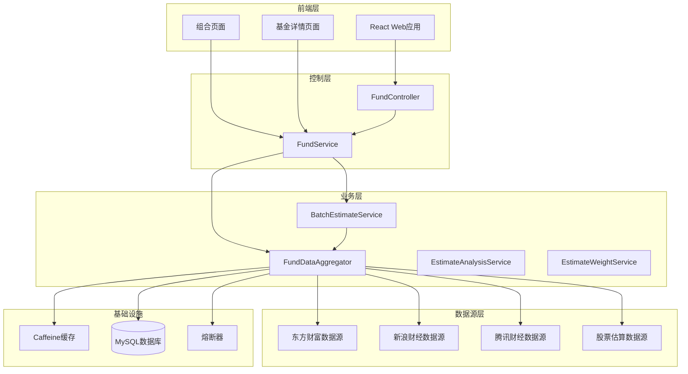
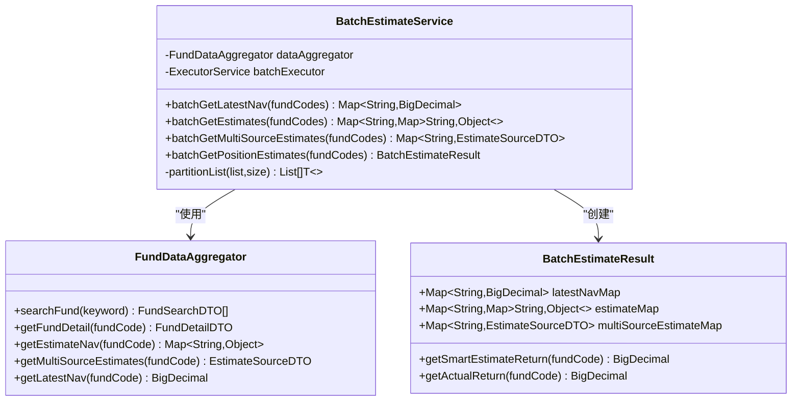
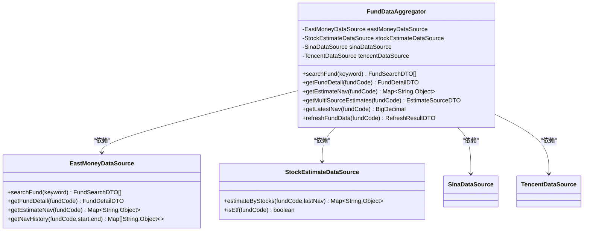
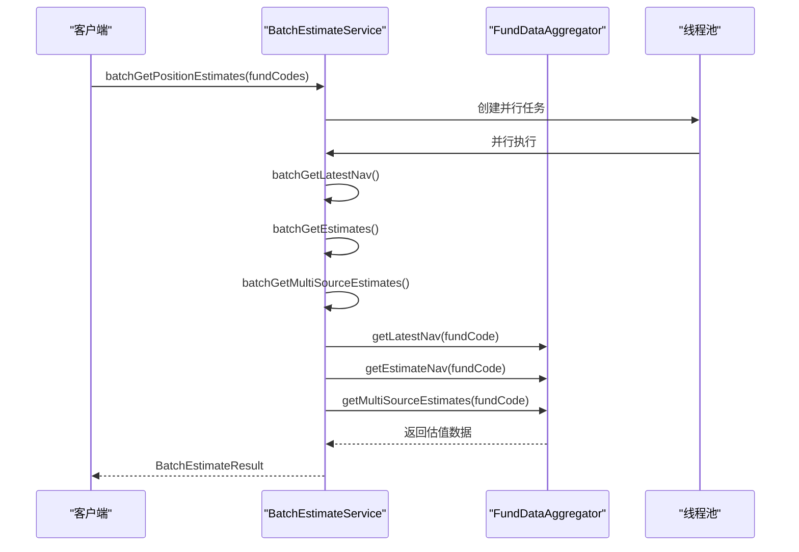
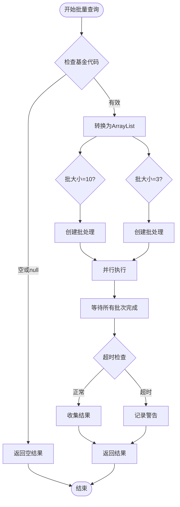
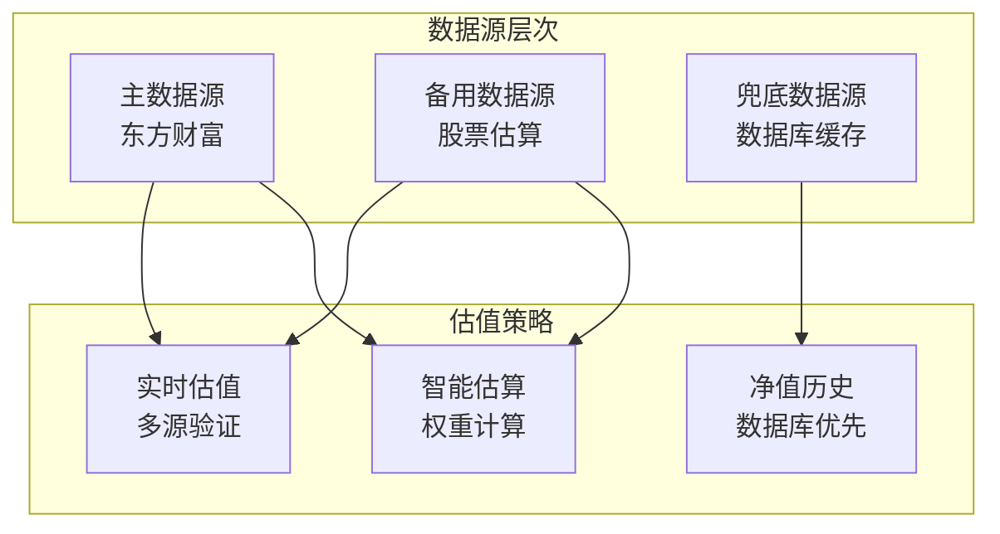
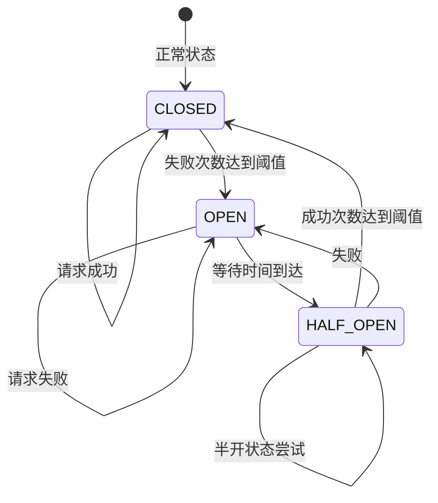
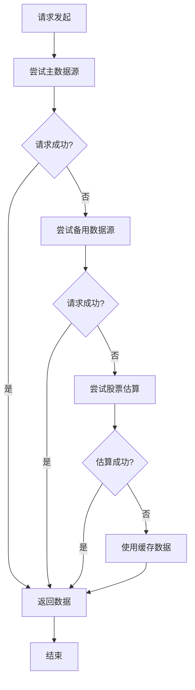
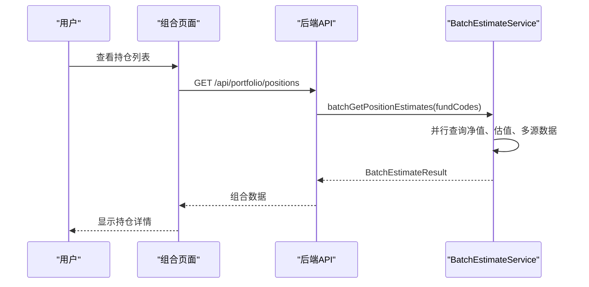

# 批量估值服务

<cite>
**本文档引用的文件**
- [BatchEstimateService.java](file://src/main/java/com/qoder/fund/service/BatchEstimateService.java)
- [FundDataAggregator.java](file://src/main/java/com/qoder/fund/datasource/FundDataAggregator.java)
- [FundController.java](file://src/main/java/com/qoder/fund/controller/FundController.java)
- [EstimateAnalysisService.java](file://src/main/java/com/qoder/fund/service/EstimateAnalysisService.java)
- [EstimateWeightService.java](file://src/main/java/com/qoder/fund/service/EstimateWeightService.java)
- [EastMoneyDataSource.java](file://src/main/java/com/qoder/fund/datasource/EastMoneyDataSource.java)
- [SinaDataSource.java](file://src/main/java/com/qoder/fund/datasource/SinaDataSource.java)
- [TencentDataSource.java](file://src/main/java/com/qoder/fund/datasource/TencentDataSource.java)
- [StockEstimateDataSource.java](file://src/main/java/com/qoder/fund/datasource/StockEstimateDataSource.java)
- [FundService.java](file://src/main/java/com/qoder/fund/service/FundService.java)
- [EstimateSourceDTO.java](file://src/main/java/com/qoder/fund/dto/EstimateSourceDTO.java)
- [application.yml](file://src/main/resources/application.yml)
- [CircuitBreaker.java](file://src/main/java/com/qoder/fund/config/CircuitBreaker.java)
- [FundDataSource.java](file://src/main/java/com/qoder/fund/datasource/FundDataSource.java)
- [FundDetail.tsx](file://fund-web/src/pages/Fund/FundDetail.tsx)
- [index.tsx](file://fund-web/src/pages/Portfolio/index.tsx)
- [pom.xml](file://pom.xml)
</cite>

## 目录
1. [项目概述](#项目概述)
2. [系统架构](#系统架构)
3. [核心组件](#核心组件)
4. [批量估值服务详解](#批量估值服务详解)
5. [数据源架构](#数据源架构)
6. [性能优化策略](#性能优化策略)
7. [错误处理机制](#错误处理机制)
8. [前端集成](#前端集成)
9. [部署配置](#部署配置)
10. [总结](#总结)

## 项目概述

批量估值服务是基金管理系统中的核心功能模块，专门用于高效处理多只基金的实时估值查询需求。该服务通过并行处理、智能缓存和多数据源聚合等技术手段，为用户提供快速、准确的基金估值信息。

### 主要特性

- **高性能批量处理**：支持同时查询多只基金的净值和估值信息
- **智能缓存机制**：利用Caffeine缓存提升数据访问速度
- **多数据源聚合**：整合多个权威数据源确保数据准确性
- **熔断保护机制**：防止外部API故障影响系统稳定性
- **灵活的权重计算**：基于历史表现动态调整数据源权重

## 系统架构



**图表来源**
- [FundController.java:24-79](file://src/main/java/com/qoder/fund/controller/FundController.java#L24-L79)
- [FundService.java:20-75](file://src/main/java/com/qoder/fund/service/FundService.java#L20-L75)
- [BatchEstimateService.java:20-267](file://src/main/java/com/qoder/fund/service/BatchEstimateService.java#L20-L267)

## 核心组件

### 批量估值服务

BatchEstimateService是整个系统的核心组件，负责协调各个数据源并提供统一的批量查询接口。



**图表来源**
- [BatchEstimateService.java:20-267](file://src/main/java/com/qoder/fund/service/BatchEstimateService.java#L20-L267)
- [FundDataAggregator.java:40-723](file://src/main/java/com/qoder/fund/datasource/FundDataAggregator.java#L40-L723)
- [EstimateSourceDTO.java:10-37](file://src/main/java/com/qoder/fund/dto/EstimateSourceDTO.java#L10-L37)

### 数据源聚合器

FundDataAggregator作为数据源管理层，负责协调多个外部数据源并提供统一的数据访问接口。



**图表来源**
- [FundDataAggregator.java:40-723](file://src/main/java/com/qoder/fund/datasource/FundDataAggregator.java#L40-L723)
- [EastMoneyDataSource.java:25-800](file://src/main/java/com/qoder/fund/datasource/EastMoneyDataSource.java#L25-L800)
- [StockEstimateDataSource.java:28-398](file://src/main/java/com/qoder/fund/datasource/StockEstimateDataSource.java#L28-L398)

**章节来源**
- [BatchEstimateService.java:20-267](file://src/main/java/com/qoder/fund/service/BatchEstimateService.java#L20-L267)
- [FundDataAggregator.java:40-723](file://src/main/java/com/qoder/fund/datasource/FundDataAggregator.java#L40-L723)

## 批量估值服务详解

### 批量查询流程



**图表来源**
- [BatchEstimateService.java:182-215](file://src/main/java/com/qoder/fund/service/BatchEstimateService.java#L182-L215)

### 线程池配置

系统采用固定大小的线程池来处理批量请求：

- **线程数量**：CPU核心数 × 2
- **线程命名**：batch-estimate-{序号}
- **任务类型**：
  - 基金净值查询：批大小10
  - 实时估值查询：批大小3（避免限流）
  - 多源估值查询：批大小3（避免限流）

### 分区策略

为了优化性能和避免API限流，系统实现了智能分区：



**图表来源**
- [BatchEstimateService.java:44-78](file://src/main/java/com/qoder/fund/service/BatchEstimateService.java#L44-L78)
- [BatchEstimateService.java:86-126](file://src/main/java/com/qoder/fund/service/BatchEstimateService.java#L86-L126)

**章节来源**
- [BatchEstimateService.java:24-267](file://src/main/java/com/qoder/fund/service/BatchEstimateService.java#L24-L267)

## 数据源架构

### 多数据源策略

系统实现了多层次的数据源架构，确保数据的准确性和可靠性：



**图表来源**
- [FundDataAggregator.java:114-135](file://src/main/java/com/qoder/fund/datasource/FundDataAggregator.java#L114-L135)
- [FundDataAggregator.java:137-185](file://src/main/java/com/qoder/fund/datasource/FundDataAggregator.java#L137-L185)

### 数据源权重计算

EstimateWeightService负责根据基金类型和历史表现动态调整各数据源的权重：

| 基金类型 | 数据源权重 |
|---------|-----------|
| ETF实时 | 东财: 15%, 新浪: 8%, 腾讯: 7%, 股票: 70% |
| 固收类 | 东财: 45%, 新浪: 25%, 腾讯: 25%, 股票: 5% |
| QDII | 东财: 40%, 新浪: 25%, 腾讯: 25%, 股票: 10% |
| 权益高覆盖 | 东财: 30%, 新浪: 18%, 腾讯: 17%, 股票: 35% |
| 权益中覆盖 | 东财: 38%, 新浪: 24%, 腾讯: 23%, 股票: 15% |
| 权益低覆盖 | 东财: 43%, 新浪: 26%, 腾讯: 26%, 股票: 5% |

**章节来源**
- [EstimateWeightService.java:25-128](file://src/main/java/com/qoder/fund/service/EstimateWeightService.java#L25-L128)
- [FundDataAggregator.java:537-631](file://src/main/java/com/qoder/fund/datasource/FundDataAggregator.java#L537-L631)

## 性能优化策略

### 缓存策略

系统采用了多层次的缓存机制：

```mermaid
graph LR
subgraph "缓存层次"
CLIENT[客户端缓存<br/>浏览器]
API[API缓存<br/>@Cacheable]
DB[(数据库缓存)]
end
subgraph "缓存键"
KEY1[fundSearch<br/>关键字]
KEY2[fundDetail<br/>基金代码]
KEY3[navHistory<br/>代码_起始_结束]
KEY4[estimateNav<br/>基金代码]
end
CLIENT --> API
API --> DB
KEY1 --> API
KEY2 --> API
KEY3 --> API
KEY4 --> API
```

**图表来源**
- [FundDataAggregator.java:60-63](file://src/main/java/com/qoder/fund/datasource/FundDataAggregator.java#L60-L63)
- [FundDataAggregator.java:107-110](file://src/main/java/com/qoder/fund/datasource/FundDataAggregator.java#L107-L110)
- [FundDataAggregator.java:115-135](file://src/main/java/com/qoder/fund/datasource/FundDataAggregator.java#L115-L135)

### 熔断保护机制

CircuitBreaker提供了智能的熔断保护：



**图表来源**
- [CircuitBreaker.java:24-28](file://src/main/java/com/qoder/fund/config/CircuitBreaker.java#L24-L28)
- [CircuitBreaker.java:129-159](file://src/main/java/com/qoder/fund/config/CircuitBreaker.java#L129-L159)

**章节来源**
- [application.yml:29-36](file://src/main/resources/application.yml#L29-L36)
- [CircuitBreaker.java:119-223](file://src/main/java/com/qoder/fund/config/CircuitBreaker.java#L119-L223)

## 错误处理机制

### 异常处理策略

系统实现了完善的错误处理机制：

1. **数据源降级**：主数据源失败时自动切换到备用数据源
2. **缓存回退**：数据库查询失败时使用缓存数据
3. **超时控制**：设置合理的超时时间避免长时间阻塞
4. **熔断保护**：外部API故障时自动熔断保护系统

### 错误恢复流程



**图表来源**
- [FundDataAggregator.java:114-135](file://src/main/java/com/qoder/fund/datasource/FundDataAggregator.java#L114-L135)
- [FundDataAggregator.java:137-185](file://src/main/java/com/qoder/fund/datasource/FundDataAggregator.java#L137-L185)

**章节来源**
- [BatchEstimateService.java:57-65](file://src/main/java/com/qoder/fund/service/BatchEstimateService.java#L57-L65)
- [FundDataAggregator.java:352-361](file://src/main/java/com/qoder/fund/datasource/FundDataAggregator.java#L352-L361)

## 前端集成

### 组合页面集成

批量估值服务在组合页面中发挥重要作用：



**图表来源**
- [index.tsx:165-218](file://fund-web/src/pages/Portfolio/index.tsx#L165-L218)
- [FundDetail.tsx:16-71](file://fund-web/src/pages/Fund/FundDetail.tsx#L16-L71)

### 基金详情页面

用户可以在基金详情页面查看详细的估值分析：

- **实时估值**：显示各数据源的实时估值
- **智能综合**：基于权重计算的综合估值
- **准确度分析**：显示各数据源的历史准确度
- **数据源切换**：支持手动切换不同的数据源

**章节来源**
- [FundDetail.tsx:22-94](file://fund-web/src/pages/Fund/FundDetail.tsx#L22-L94)
- [index.tsx:158-237](file://fund-web/src/pages/Portfolio/index.tsx#L158-L237)

## 部署配置

### 数据库配置

系统使用MySQL作为主要数据存储：

```yaml
spring:
  datasource:
    url: jdbc:mysql://localhost:3306/fund_manager?useUnicode=true&characterEncoding=UTF-8&serverTimezone=Asia/Shanghai&allowPublicKeyRetrieval=true&useSSL=false
    username: ${DB_USERNAME:root}
    password: ${DB_PASSWORD:}
    driver-class-name: com.mysql.cj.jdbc.Driver
    hikari:
      pool-name: FundHikariPool
      minimum-idle: 5
      maximum-pool-size: 20
      connection-timeout: 30000
      idle-timeout: 600000
      max-lifetime: 1800000
      leak-detection-threshold: 60000
      connection-test-query: SELECT 1
      validation-timeout: 5000
```

### 缓存配置

```yaml
spring:
  cache:
    type: caffeine
    caffeine:
      spec: maximumSize=1000,expireAfterWrite=300s
```

**章节来源**
- [application.yml:7-22](file://src/main/resources/application.yml#L7-L22)
- [application.yml:29-36](file://src/main/resources/application.yml#L29-L36)

## 总结

批量估值服务通过以下关键技术实现了高性能的多基金估值查询：

### 核心优势

1. **并行处理**：利用线程池和异步编程实现真正的并行处理
2. **智能缓存**：多层次缓存策略显著提升响应速度
3. **数据源聚合**：多数据源验证确保数据准确性
4. **熔断保护**：防止外部故障影响系统稳定性
5. **权重计算**：基于历史表现动态调整数据源权重

### 技术特点

- **可扩展性**：支持任意数量的基金批量查询
- **可靠性**：多重降级机制确保服务稳定性
- **准确性**：智能权重计算提升估值精度
- **可观测性**：完整的日志和监控支持

### 应用场景

- **组合管理**：实时显示持仓组合的估值情况
- **投资决策**：为投资决策提供及时准确的数据支持
- **风险监控**：监控投资组合的风险暴露情况
- **业绩分析**：分析投资组合的历史表现

该系统为基金管理系统提供了强大的数据支撑，能够满足各种复杂的估值查询需求。