# 仪表板增强

<cite>
**本文档引用的文件**
- [DashboardController.java](file://src/main/java/com/qoder/fund/controller/DashboardController.java)
- [DashboardService.java](file://src/main/java/com/qoder/fund/service/DashboardService.java)
- [DashboardCommand.java](file://src/main/java/com/qoder/fund/cli/DashboardCommand.java)
- [EstimateAnalysisService.java](file://src/main/java/com/qoder/fund/service/EstimateAnalysisService.java)
- [DashboardDTO.java](file://src/main/java/com/qoder/fund/dto/DashboardDTO.java)
- [PositionDTO.java](file://src/main/java/com/qoder/fund/dto/PositionDTO.java)
- [ProfitTrendDTO.java](file://src/main/java/com/qoder/fund/dto/ProfitTrendDTO.java)
- [ProfitAnalysisDTO.java](file://src/main/java/com/qoder/fund/dto/ProfitAnalysisDTO.java)
- [PositionService.java](file://src/main/java/com/qoder/fund/service/PositionService.java)
- [FundDataAggregator.java](file://src/main/java/com/qoder/fund/datasource/FundDataAggregator.java)
- [EastMoneyDataSource.java](file://src/main/java/com/qoder/fund/datasource/EastMoneyDataSource.java)
- [FundDetailDTO.java](file://src/main/java/com/qoder/fund/dto/FundDetailDTO.java)
- [MarketOverviewController.java](file://src/main/java/com/qoder/fund/controller/MarketOverviewController.java)
- [MarketOverviewService.java](file://src/main/java/com/qoder/fund/service/MarketOverviewService.java)
- [MarketOverviewDTO.java](file://src/main/java/com/qoder/fund/dto/MarketOverviewDTO.java)
- [MarketDataSource.java](file://src/main/java/com/qoder/fund/datasource/MarketDataSource.java)
- [SectorDataSource.java](file://src/main/java/com/qoder/fund/datasource/SectorDataSource.java)
- [AiAnalysisController.java](file://src/main/java/com/qoder/fund/controller/AiAnalysisController.java)
- [FundDiagnosisService.java](file://src/main/java/com/qoder/fund/service/FundDiagnosisService.java)
- [MarketOverviewCard.tsx](file://fund-web/src/components/MarketOverviewCard.tsx)
- [AiDiagnosisTab.tsx](file://fund-web/src/pages/Fund/AiDiagnosisTab.tsx)
- [index.tsx](file://fund-web/src/pages/Dashboard/index.tsx)
- [index.tsx](file://fund-web/src/pages/Portfolio/index.tsx)
- [dashboard.ts](file://fund-web/src/api/dashboard.ts)
- [format.ts](file://fund-web/src/utils/format.ts)
- [useAmountVisible.ts](file://fund-web/src/hooks/useAmountVisible.ts)
- [PriceChange.tsx](file://fund-web/src/components/PriceChange.tsx)
- [EmptyGuide.tsx](file://fund-web/src/components/EmptyGuide.tsx)
- [PageSkeleton.tsx](file://fund-web/src/components/PageSkeleton.tsx)
- [client.ts](file://fund-web/src/api/client.ts)
- [application.yml](file://src/main/resources/application.yml)
- [schema.sql](file://src/main/resources/db/schema.sql)
- [PRD.md](file://PRD.md)
</cite>

## 更新摘要
**所做更改**
- 新增市场概览卡片组件，提供AI驱动的市场洞察和板块表现分析
- 新增AI基金诊断分析功能，基于规则引擎生成综合评分和投资建议
- 新增市场数据源集成，支持大盘指数、板块热度和K线走势获取
- 新增板块数据源，支持多数据源切换和降级策略
- 新增市场情绪分析和持仓影响评估功能
- 新增AI诊断报告的完整前端展示组件
- 仪表板布局优化，新增三列智能分析区域

## 目录
1. [简介](#简介)
2. [项目结构](#项目结构)
3. [核心组件](#核心组件)
4. [架构概览](#架构概览)
5. [详细组件分析](#详细组件分析)
6. [依赖关系分析](#依赖关系分析)
7. [性能考虑](#性能考虑)
8. [故障排除指南](#故障排除指南)
9. [结论](#结论)

## 简介

本文档详细分析了基金投资管理系统中的仪表板增强功能。该系统是一个基于Spring Boot和React的Web应用，专注于为个人投资者提供一站式基金数据聚合管理工具。仪表板作为用户登录后的主页面，提供了投资组合的全面概览，包括资产总览、持仓列表、收益趋势分析和行业分布展示等功能。

**更新** 本次更新重点新增了市场概览卡片组件和AI驱动的智能分析功能。系统现在集成了AI分析引擎，能够为用户提供基金诊断报告、市场情绪分析和板块表现洞察。新增的MarketOverviewCard组件提供实时的大盘指数展示、领涨领跌板块分析和持仓影响评估，帮助用户做出更明智的投资决策。

**更新** AI基金诊断功能基于规则引擎实现，通过综合评估基金的业绩表现、风险水平、估值状态、稳定性和费用成本等多个维度，生成100分制的综合评分和专业的投资建议。系统还支持多数据源切换，包括东方财富、新浪财经等平台，确保数据的准确性和可靠性。

**更新** 市场数据源集成实现了多层次的数据获取策略，包括大盘指数API、板块数据API和K线历史数据获取。系统采用缓存机制和降级策略，确保在数据源不可用时仍能提供基本功能。新增的板块数据源支持多数据源切换，当首选数据源失败时自动切换到备用数据源。

系统采用前后端分离架构，后端使用Java Spring Boot提供RESTful API，前端使用React TypeScript构建用户界面。通过集成多个数据源，系统能够实时获取基金净值、估值和行业分布等关键数据，为用户提供准确的投资决策辅助信息。

## 项目结构

项目采用典型的MVC架构模式，分为后端Spring Boot应用和前端React应用两个主要部分：

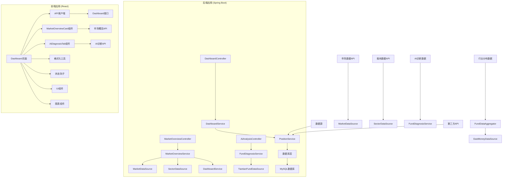

**图表来源**
- [DashboardController.java:1-36](file://src/main/java/com/qoder/fund/controller/DashboardController.java#L1-L36)
- [DashboardService.java:1-608](file://src/main/java/com/qoder/fund/service/DashboardService.java#L1-L608)
- [DashboardCommand.java:1-319](file://src/main/java/com/qoder/fund/cli/DashboardCommand.java#L1-L319)
- [MarketOverviewController.java:1-41](file://src/main/java/com/qoder/fund/controller/MarketOverviewController.java#L1-L41)
- [MarketOverviewService.java:1-240](file://src/main/java/com/qoder/fund/service/MarketOverviewService.java#L1-L240)
- [MarketDataSource.java:1-343](file://src/main/java/com/qoder/fund/datasource/MarketDataSource.java#L1-L343)
- [SectorDataSource.java:1-234](file://src/main/java/com/qoder/fund/datasource/SectorDataSource.java#L1-L234)
- [AiAnalysisController.java:1-40](file://src/main/java/com/qoder/fund/controller/AiAnalysisController.java#L1-L40)
- [FundDiagnosisService.java:1-587](file://src/main/java/com/qoder/fund/service/FundDiagnosisService.java#L1-L587)
- [index.tsx:1-230](file://fund-web/src/pages/Dashboard/index.tsx#L1-L230)
- [MarketOverviewCard.tsx:1-238](file://fund-web/src/components/MarketOverviewCard.tsx#L1-L238)
- [AiDiagnosisTab.tsx:1-305](file://fund-web/src/pages/Fund/AiDiagnosisTab.tsx#L1-L305)

**章节来源**
- [DashboardController.java:1-36](file://src/main/java/com/qoder/fund/controller/DashboardController.java#L1-L36)
- [DashboardService.java:1-608](file://src/main/java/com/qoder/fund/service/DashboardService.java#L1-L608)
- [DashboardCommand.java:1-319](file://src/main/java/com/qoder/fund/cli/DashboardCommand.java#L1-L319)
- [MarketOverviewController.java:1-41](file://src/main/java/com/qoder/fund/controller/MarketOverviewController.java#L1-L41)
- [MarketOverviewService.java:1-240](file://src/main/java/com/qoder/fund/service/MarketOverviewService.java#L1-L240)
- [index.tsx:1-230](file://fund-web/src/pages/Dashboard/index.tsx#L1-L230)

## 核心组件

### 后端核心组件

#### 控制器层
DashboardController负责处理仪表板相关的HTTP请求，提供三个主要接口：
- 获取仪表板概览数据（包含行业分布）
- 获取收益趋势数据
- 获取收益分析数据（包含回撤分析）

**新增** MarketOverviewController新增市场概览接口，提供大盘指数、板块数据和市场情绪分析：
- 获取市场概览数据（包含大盘指数、板块热度、持仓影响）

**新增** AiAnalysisController新增AI诊断接口，提供基金智能诊断报告：
- 获取基金AI诊断报告（包含综合评分、投资建议、风险分析）

#### 服务层
DashboardService是核心业务逻辑处理单元，负责：
- 计算总资产、总收益、总收益率
- 计算今日收益和预估收益
- 生成收益趋势数据
- **新增**：聚合行业分布数据，按市值加权计算行业占比
- **新增**：处理持仓数据聚合和行业分布分析，支持QDII基金状态分类
- **新增**：判断持仓是否为实际验证状态，区分延迟数据
- **更新**：收益趋势计算逻辑已修复，使用getProfitAnalysis方法进行真实的历史收益计算

**新增** MarketOverviewService是市场数据分析的核心服务：
- **新增**：整合大盘指数、板块数据和市场情绪分析
- **新增**：实现市场情绪智能判断（积极/中性/谨慎）
- **新增**：分析对用户持仓的影响程度
- **新增**：提供多数据源切换和降级策略

**新增** FundDiagnosisService是AI诊断分析的核心服务：
- **新增**：基于规则引擎的基金综合评分系统
- **新增**：多维度评分算法（业绩、风险、估值、稳定性、费用）
- **新增**：生成投资建议和风险提示
- **新增**：适合人群分析和不适合人群分析

#### 数据源层
**新增** MarketDataSource提供市场数据获取：
- **新增**：支持新浪指数API获取大盘指数数据
- **新增**：支持K线历史数据获取
- **新增**：实现指数趋势分析和涨跌幅计算

**新增** SectorDataSource提供板块数据获取：
- **新增**：支持东方财富板块API（首选）
- **新增**：支持新浪财经板块API（备用）
- **新增**：实现多数据源切换和降级策略

**新增** TiantianFundDataSource提供基金数据获取：
- **新增**：支持天天基金API获取基金详细信息
- **新增**：实现基金数据标准化处理

#### CLI命令行组件
**新增**：DashboardCommand提供命令行界面的仪表板功能：
- **新增**：BroadcastCommand支持收益播报，区分"已验证"和"待验证"持仓
- **新增**：智能QDII基金识别，使用`isUsQdiiFund()`方法判断纯美股QDII
- **新增**：优化的QDII基金预估显示逻辑，纯美股QDII不显示具体涨跌

#### DTO层
系统使用多个DTO对象来封装数据传输：
- DashboardDTO：仪表板概览数据，**新增**：industryDistribution字段
- ProfitTrendDTO：收益趋势数据，**更新**：现在包含真实的历史收益数据
- ProfitAnalysisDTO：收益分析数据，**新增**：包含累计收益、回撤分析和性能指标
- PositionDTO：持仓详情数据，**新增**：industryDist字段，**新增**：actualReturnDelayed字段
- FundDetailDTO：基金详情数据，**新增**：industryDist字段

**新增** MarketOverviewDTO：市场概览数据结构：
- **新增**：IndexData：大盘指数数据（代码、名称、点数、涨跌、成交量）
- **新增**：SectorData：板块数据（名称、涨跌幅、领涨股）
- **新增**：IndexTrend：指数走势数据（K线数据、区间涨跌幅）
- **新增**：PortfolioImpact：持仓影响分析（整体影响、描述、建议）

**新增** AiFundDiagnosisDTO：AI基金诊断报告：
- **新增**：综合评分和推荐信号
- **新增**：维度评分（业绩、风险、估值、稳定性、费用）
- **新增**：估值分析和业绩分析
- **新增**：风险分析和持仓建议
- **新增**：适合人群和风险提示

### 前端核心组件

#### Dashboard页面
React组件负责展示仪表板的所有功能，包括：
- 资产总览卡片（支持金额隐藏）
- 持仓基金列表（带类型标识和收益信息）
- **新增**：市场概览卡片（AI驱动的市场洞察）
- **新增**：风险预警卡片（智能风险提示）
- **新增**：调仓时机卡片（投资建议提醒）
- **更新**：收益趋势图表现在显示真实的历史收益数据，而非零值
- 金额隐私保护功能

**新增** MarketOverviewCard组件：
- **新增**：实时大盘指数展示（上证指数、深证成指、创业板指、沪深300）
- **新增**：领涨板块和领跌板块分析
- **新增**：市场情绪标签（积极/中性/谨慎）
- **新增**：持仓影响分析（正面/中性/负面）
- **新增**：紧凑布局设计，支持响应式显示

**新增** AiDiagnosisTab组件：
- **新增**：基金AI诊断报告完整展示
- **新增**：综合评分和推荐信号
- **新增**：维度评分和详细分析
- **新增**：适合人群和风险提示
- **新增**：星级评价系统

#### Portfolio页面
**新增**：独立的组合管理页面，提供：
- 详细的持仓列表和统计信息
- **新增**：行业分布饼图，基于持仓数据聚合
- 交易记录管理和账户管理功能

#### API接口
dashboardApi模块提供类型安全的API调用：
- getData：获取仪表板数据（包含行业分布）
- getProfitTrend：获取收益趋势（**更新**：现在返回真实的历史收益数据）
- getProfitAnalysis：获取收益分析数据（**新增**：包含回撤分析和性能指标）
- **新增**：getMarketOverview：获取市场概览数据

**更新** 新增了市场概览和AI诊断相关的API支持，收益趋势API已修复为真实数据。

**章节来源**
- [DashboardController.java:18-34](file://src/main/java/com/qoder/fund/controller/DashboardController.java#L18-L34)
- [DashboardService.java:37-154](file://src/main/java/com/qoder/fund/service/DashboardService.java#L37-L154)
- [DashboardCommand.java:116-319](file://src/main/java/com/qoder/fund/cli/DashboardCommand.java#L116-L319)
- [MarketOverviewController.java:28-39](file://src/main/java/com/qoder/fund/controller/MarketOverviewController.java#L28-L39)
- [AiAnalysisController.java:27-38](file://src/main/java/com/qoder/fund/controller/AiAnalysisController.java#L27-L38)
- [MarketOverviewDTO.java:1-220](file://src/main/java/com/qoder/fund/dto/MarketOverviewDTO.java#L1-L220)
- [AiFundDiagnosisDTO.java](file://src/main/java/com/qoder/fund/dto/AiFundDiagnosisDTO.java)
- [index.tsx:13-230](file://fund-web/src/pages/Dashboard/index.tsx#L13-L230)

## 架构概览

系统采用分层架构设计，确保关注点分离和代码可维护性：

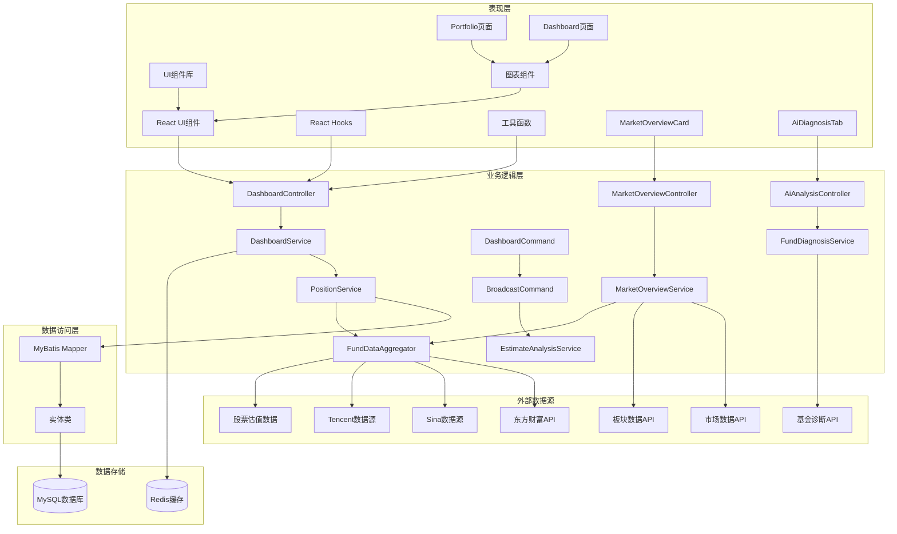

**图表来源**
- [DashboardController.java:1-36](file://src/main/java/com/qoder/fund/controller/DashboardController.java#L1-L36)
- [DashboardService.java:1-608](file://src/main/java/com/qoder/fund/service/DashboardService.java#L1-L608)
- [DashboardCommand.java:1-319](file://src/main/java/com/qoder/fund/cli/DashboardCommand.java#L1-L319)
- [MarketOverviewController.java:1-41](file://src/main/java/com/qoder/fund/controller/MarketOverviewController.java#L1-L41)
- [MarketOverviewService.java:1-240](file://src/main/java/com/qoder/fund/service/MarketOverviewService.java#L1-L240)
- [AiAnalysisController.java:1-40](file://src/main/java/com/qoder/fund/controller/AiAnalysisController.java#L1-L40)
- [FundDiagnosisService.java:1-587](file://src/main/java/com/qoder/fund/service/FundDiagnosisService.java#L1-L587)
- [MarketDataSource.java:1-343](file://src/main/java/com/qoder/fund/datasource/MarketDataSource.java#L1-L343)
- [SectorDataSource.java:1-234](file://src/main/java/com/qoder/fund/datasource/SectorDataSource.java#L1-L234)

**章节来源**
- [application.yml:1-68](file://src/main/resources/application.yml#L1-L68)
- [schema.sql:1-93](file://src/main/resources/db/schema.sql#L1-L93)

## 详细组件分析

### 后端数据流分析

#### 仪表板数据计算流程

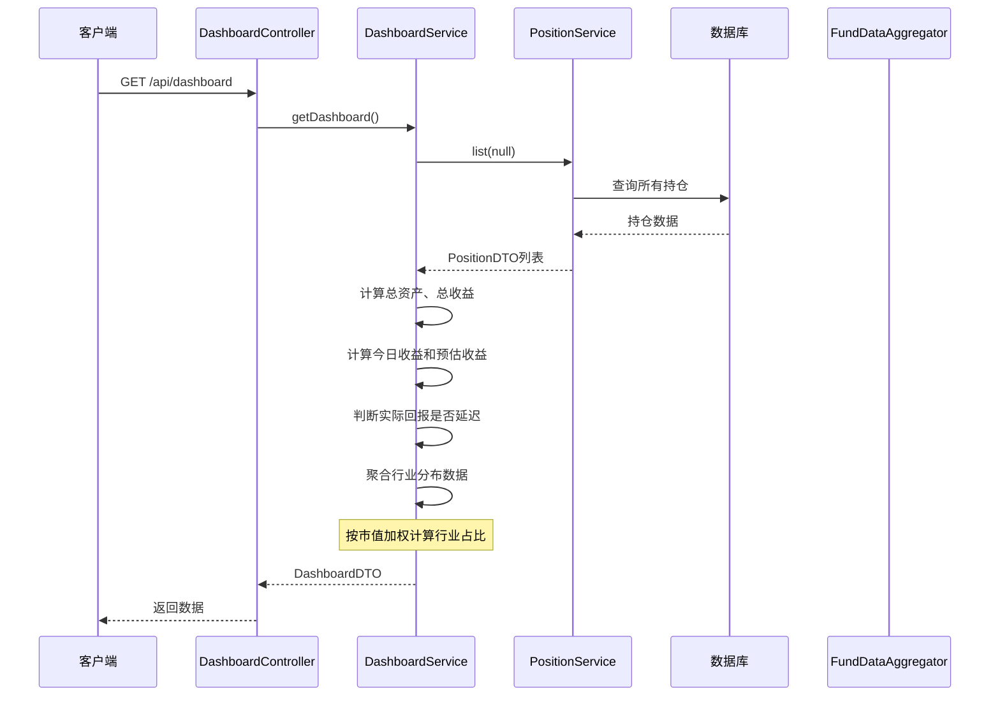

**图表来源**
- [DashboardController.java:18-21](file://src/main/java/com/qoder/fund/controller/DashboardController.java#L18-L21)
- [DashboardService.java:37-154](file://src/main/java/com/qoder/fund/service/DashboardService.java#L37-L154)
- [PositionService.java:33-44](file://src/main/java/com/qoder/fund/service/PositionService.java#L33-L44)

#### 市场概览数据获取流程

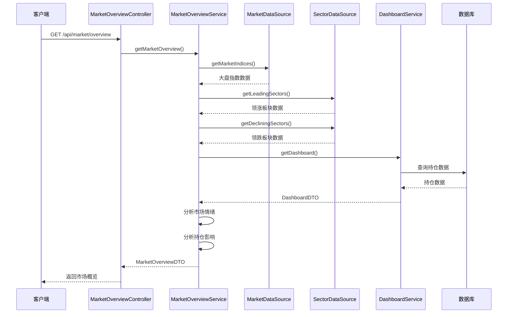

**图表来源**
- [MarketOverviewController.java:28-39](file://src/main/java/com/qoder/fund/controller/MarketOverviewController.java#L28-L39)
- [MarketOverviewService.java:36-75](file://src/main/java/com/qoder/fund/service/MarketOverviewService.java#L36-L75)
- [MarketDataSource.java:47-81](file://src/main/java/com/qoder/fund/datasource/MarketDataSource.java#L47-L81)
- [SectorDataSource.java:41-75](file://src/main/java/com/qoder/fund/datasource/SectorDataSource.java#L41-L75)
- [MarketOverviewService.java:158-227](file://src/main/java/com/qoder/fund/service/MarketOverviewService.java#L158-L227)

#### AI基金诊断分析流程

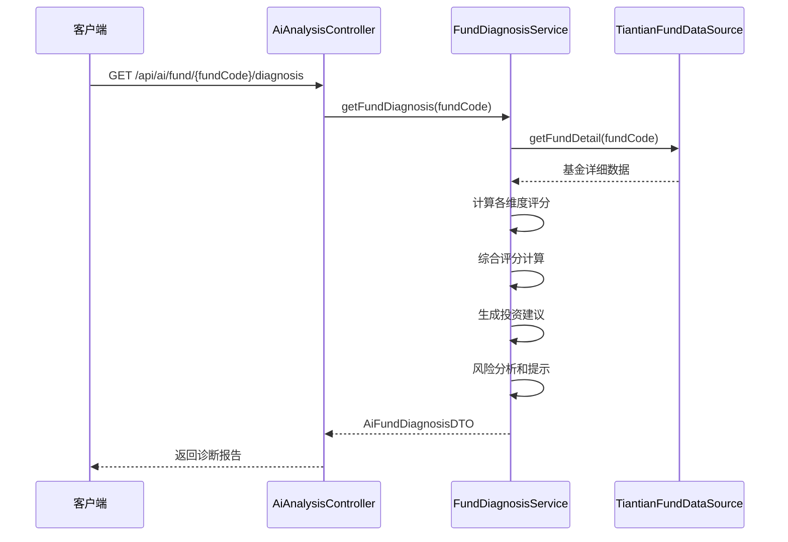

**图表来源**
- [AiAnalysisController.java:27-38](file://src/main/java/com/qoder/fund/controller/AiAnalysisController.java#L27-L38)
- [FundDiagnosisService.java:45-70](file://src/main/java/com/qoder/fund/service/FundDiagnosisService.java#L45-L70)
- [FundDiagnosisService.java:75-144](file://src/main/java/com/qoder/fund/service/FundDiagnosisService.java#L75-L144)

#### QDII基金报告功能流程

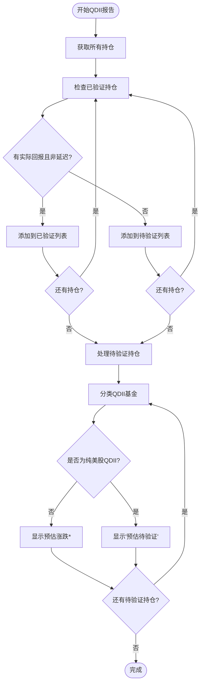

**图表来源**
- [DashboardCommand.java:196-233](file://src/main/java/com/qoder/fund/cli/DashboardCommand.java#L196-L233)
- [DashboardCommand.java:246-281](file://src/main/java/com/qoder/fund/cli/DashboardCommand.java#L246-L281)

#### 行业分布数据聚合流程

**图表来源**
- [DashboardService.java:49-126](file://src/main/java/com/qoder/fund/service/DashboardService.java#L49-L126)

#### 收益趋势计算修复流程

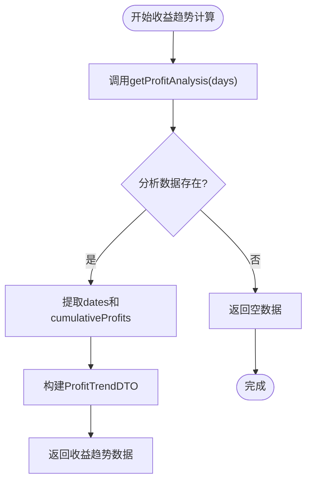

**图表来源**
- [DashboardService.java:159-175](file://src/main/java/com/qoder/fund/service/DashboardService.java#L159-L175)
- [DashboardService.java:177-329](file://src/main/java/com/qoder/fund/service/DashboardService.java#L177-L329)

**章节来源**
- [DashboardService.java:37-154](file://src/main/java/com/qoder/fund/service/DashboardService.java#L37-L154)
- [DashboardCommand.java:196-281](file://src/main/java/com/qoder/fund/cli/DashboardCommand.java#L196-L281)
- [DashboardService.java:159-175](file://src/main/java/com/qoder/fund/service/DashboardService.java#L159-L175)
- [MarketOverviewService.java:36-75](file://src/main/java/com/qoder/fund/service/MarketOverviewService.java#L36-L75)
- [FundDiagnosisService.java:45-70](file://src/main/java/com/qoder/fund/service/FundDiagnosisService.java#L45-L70)

### 前端组件架构

#### Dashboard页面组件树

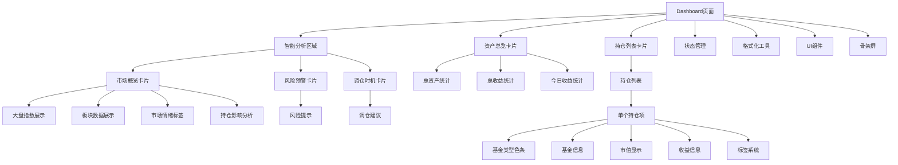

**图表来源**
- [index.tsx:74-226](file://fund-web/src/pages/Dashboard/index.tsx#L74-L226)

#### MarketOverviewCard组件架构

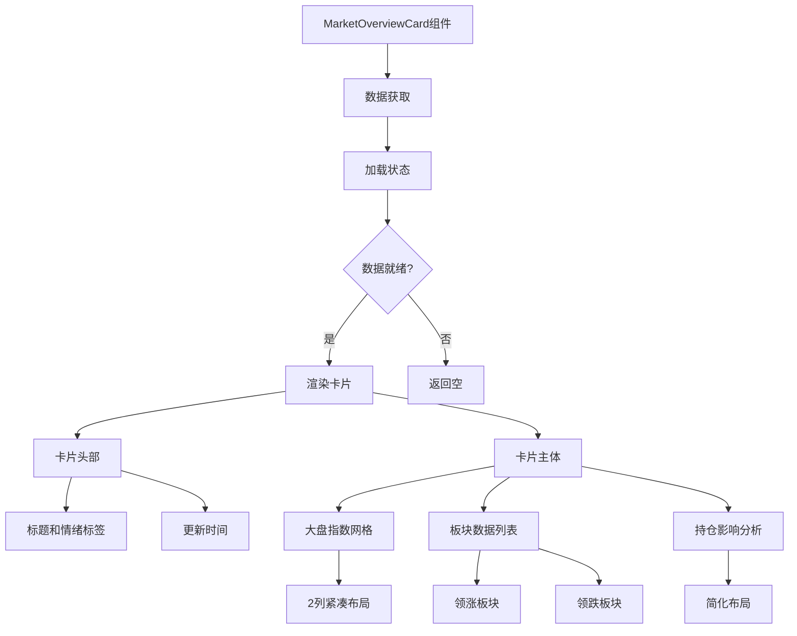

**图表来源**
- [MarketOverviewCard.tsx:15-35](file://fund-web/src/components/MarketOverviewCard.tsx#L15-L35)
- [MarketOverviewCard.tsx:89-234](file://fund-web/src/components/MarketOverviewCard.tsx#L89-L234)

#### AiDiagnosisTab组件架构

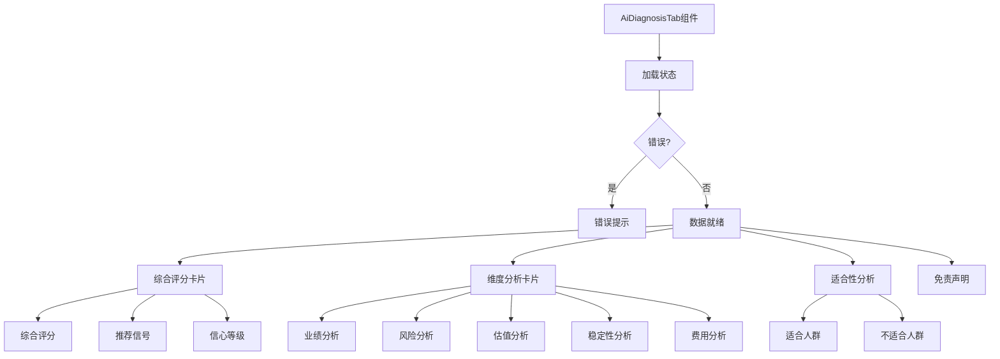

**图表来源**
- [AiDiagnosisTab.tsx:13-31](file://fund-web/src/pages/Fund/AiDiagnosisTab.tsx#L13-L31)
- [AiDiagnosisTab.tsx:93-302](file://fund-web/src/pages/Fund/AiDiagnosisTab.tsx#L93-L302)

#### 收益趋势图表配置

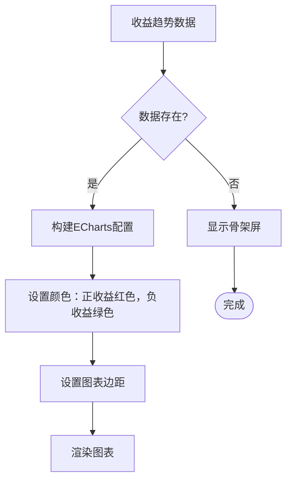

**图表来源**
- [index.tsx:59-72](file://fund-web/src/pages/Dashboard/index.tsx#L59-L72)

**章节来源**
- [index.tsx:13-230](file://fund-web/src/pages/Dashboard/index.tsx#L13-L230)
- [MarketOverviewCard.tsx:1-238](file://fund-web/src/components/MarketOverviewCard.tsx#L1-L238)
- [AiDiagnosisTab.tsx:1-305](file://fund-web/src/pages/Fund/AiDiagnosisTab.tsx#L1-L305)
- [useAmountVisible.ts:1-26](file://fund-web/src/hooks/useAmountVisible.ts#L1-L26)

### 数据模型设计

#### 核心数据模型关系

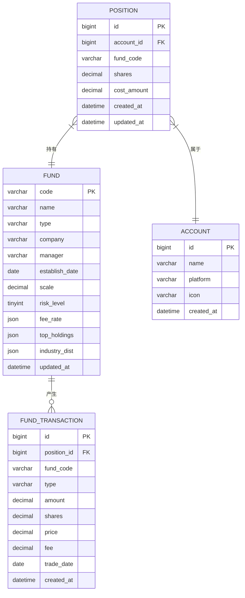

**图表来源**
- [schema.sql:40-67](file://src/main/resources/db/schema.sql#L40-L67)

#### 市场概览数据模型

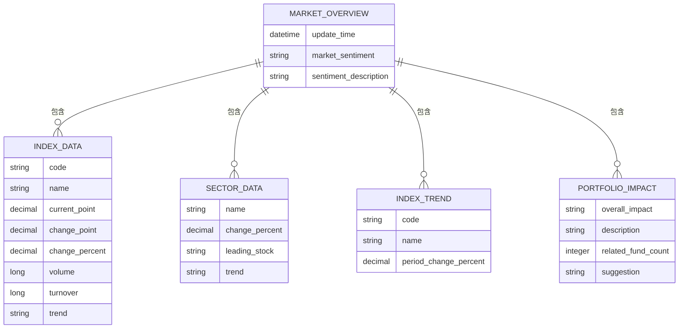

**图表来源**
- [MarketOverviewDTO.java:13-54](file://src/main/java/com/qoder/fund/dto/MarketOverviewDTO.java#L13-L54)
- [MarketOverviewDTO.java:58-99](file://src/main/java/com/qoder/fund/dto/MarketOverviewDTO.java#L58-L99)
- [MarketOverviewDTO.java:104-125](file://src/main/java/com/qoder/fund/dto/MarketOverviewDTO.java#L104-L125)
- [MarketOverviewDTO.java:131-151](file://src/main/java/com/qoder/fund/dto/MarketOverviewDTO.java#L131-L151)
- [MarketOverviewDTO.java:197-218](file://src/main/java/com/qoder/fund/dto/MarketOverviewDTO.java#L197-L218)

### 仪表板重新设计特性

#### 资产总览卡片设计
- 采用三列布局展示总资产、总收益、今日收益
- 支持金额隐藏功能，保护用户隐私
- 数字采用等宽字体，提升可读性
- 收益颜色根据正负值动态变化

#### 智能分析区域设计
**新增** 仪表板顶部新增三列智能分析区域：
- **市场概览卡片**：展示实时大盘指数、板块热度和市场情绪
- **风险预警卡片**：提供智能风险提示和健康度评估
- **调仓时机卡片**：基于AI分析给出投资建议和操作提醒

#### 市场概览卡片增强
**新增** MarketOverviewCard组件提供：
- **实时大盘指数**：上证指数、深证成指、创业板指、沪深300
- **板块表现分析**：领涨板块和领跌板块排行榜
- **市场情绪标签**：积极/中性/谨慎三种状态
- **持仓影响分析**：基于用户持仓的市场影响评估
- **紧凑布局设计**：响应式网格布局，支持小屏幕显示

#### AI诊断卡片增强
**新增** AiDiagnosisTab组件提供：
- **综合评分展示**：100分制综合评分和推荐信号
- **维度分析**：业绩、风险、估值、稳定性、费用五个维度
- **详细报告**：包含估值分析、业绩分析、风险分析
- **适合性分析**：适合人群和不适合人群列表
- **星级评价**：直观的投资信心评级

#### 持仓列表增强
- 每个持仓项左侧添加基金类型色条
- 支持估算收益和实际收益双重显示
- **新增**：QDII基金显示T+1延迟标识
- **新增**：纯美股QDII基金特殊显示，不显示具体涨跌
- 点击任意位置即可跳转到基金详情

#### **新增** QDII基金报告功能
- **已验证持仓**：正常显示涨跌和收益信息
- **待验证持仓**：显示"预估待验证"或"预估涨跌*"标识
- **纯美股QDII**：不显示具体涨跌，仅提示预估待验证
- **其他QDII**：显示预估涨跌，标注待验证状态

#### **新增** 行业分布展示
- **Dashboard页面**：显示整体投资组合的行业分布
- **Portfolio页面**：提供详细的行业分布饼图
- 按市值加权计算行业占比，支持前10大行业展示
- 行业数据来源于基金持仓的最新季报数据

#### **更新** 收益趋势图表
- 使用ECharts实现柱状图展示真实的历史收益数据
- 收益为正显示红色，为负显示绿色
- 支持7天和30天时间范围切换
- 骨架屏加载提升用户体验
- **修复**：从占位符实现更新为真实的收益趋势计算，使用getProfitAnalysis方法进行历史收益计算

#### **新增** 收益分析功能
- **收益曲线**：展示每日真实收益和累计收益
- **回撤分析**：计算最大回撤、回撤幅度和持续时间
- **性能指标**：包括总收益率、年化收益率、夏普比率、波动率等
- **时间范围**：默认30天，支持自定义调整

#### **新增** 市场数据源集成
- **多数据源支持**：东方财富、新浪财经等平台
- **缓存机制**：5分钟缓存策略，提升响应速度
- **降级策略**：当首选数据源失败时自动切换备用数据源
- **K线数据**：支持近5个交易日的指数走势分析

#### **新增** AI诊断分析功能
- **规则引擎**：基于587行规则代码的智能分析
- **多维度评分**：业绩、风险、估值、稳定性、费用加权计算
- **投资建议**：增持、减持、持有、观望四种建议
- **风险提示**：针对不同风险等级的提示信息
- **适合人群**：基于基金类型和风险等级的适合性分析

**章节来源**
- [index.tsx:126-137](file://fund-web/src/pages/Dashboard/index.tsx#L126-L137)
- [MarketOverviewCard.tsx:89-234](file://fund-web/src/components/MarketOverviewCard.tsx#L89-L234)
- [AiDiagnosisTab.tsx:93-302](file://fund-web/src/pages/Fund/AiDiagnosisTab.tsx#L93-L302)
- [MarketOverviewService.java:36-75](file://src/main/java/com/qoder/fund/service/MarketOverviewService.java#L36-L75)
- [FundDiagnosisService.java:75-144](file://src/main/java/com/qoder/fund/service/FundDiagnosisService.java#L75-L144)
- [DashboardCommand.java:246-294](file://src/main/java/com/qoder/fund/cli/DashboardCommand.java#L246-L294)
- [DashboardService.java:159-175](file://src/main/java/com/qoder/fund/service/DashboardService.java#L159-L175)

## 依赖关系分析

### 后端依赖关系

系统后端采用松耦合的设计，各组件间依赖关系清晰：

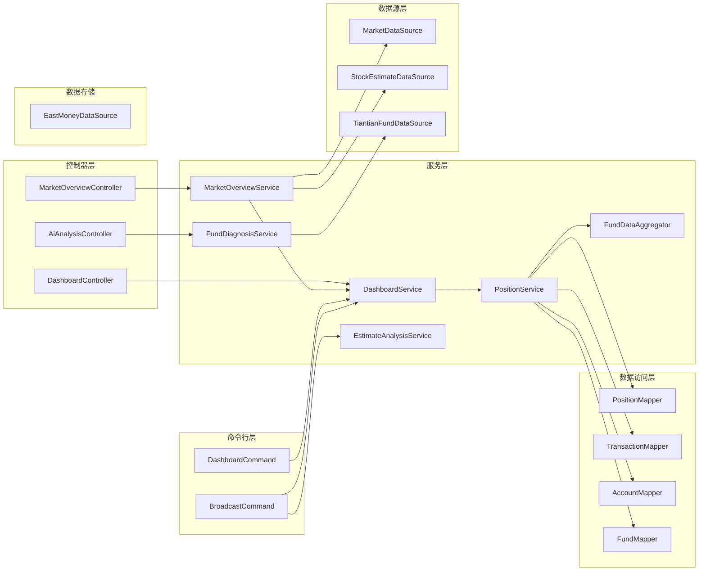

**图表来源**
- [DashboardController.java:15](file://src/main/java/com/qoder/fund/controller/DashboardController.java#L15)
- [MarketOverviewController.java:17](file://src/main/java/com/qoder/fund/controller/MarketOverviewController.java#L17)
- [AiAnalysisController.java:16](file://src/main/java/com/qoder/fund/controller/AiAnalysisController.java#L16)
- [DashboardService.java:33-35](file://src/main/java/com/qoder/fund/service/DashboardService.java#L33-L35)
- [MarketOverviewService.java:28-30](file://src/main/java/com/qoder/fund/service/MarketOverviewService.java#L28-L30)
- [FundDiagnosisService.java:26](file://src/main/java/com/qoder/fund/service/FundDiagnosisService.java#L26)
- [MarketDataSource.java:24](file://src/main/java/com/qoder/fund/datasource/MarketDataSource.java#L24)
- [SectorDataSource.java:25](file://src/main/java/com/qoder/fund/datasource/SectorDataSource.java#L25)
- [DashboardCommand.java:46](file://src/main/java/com/qoder/fund/cli/DashboardCommand.java#L46)
- [EstimateAnalysisService.java:1-404](file://src/main/java/com/qoder/fund/service/EstimateAnalysisService.java#L1-L404)

### 前端依赖关系

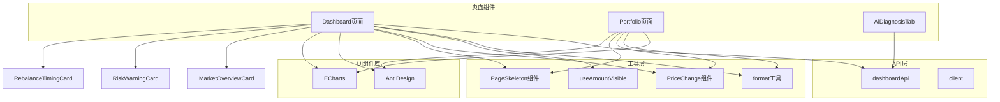

**图表来源**
- [index.tsx:5](file://fund-web/src/pages/Dashboard/index.tsx#L5)
- [dashboard.ts:202-223](file://fund-web/src/api/dashboard.ts#L202-L223)
- [client.ts:4-7](file://fund-web/src/api/client.ts#L4-L7)

**章节来源**
- [DashboardController.java:1-36](file://src/main/java/com/qoder/fund/controller/DashboardController.java#L1-L36)
- [MarketOverviewController.java:1-41](file://src/main/java/com/qoder/fund/controller/MarketOverviewController.java#L1-L41)
- [AiAnalysisController.java:1-40](file://src/main/java/com/qoder/fund/controller/AiAnalysisController.java#L1-L40)
- [DashboardService.java:1-608](file://src/main/java/com/qoder/fund/service/DashboardService.java#L1-L608)
- [MarketOverviewService.java:1-240](file://src/main/java/com/qoder/fund/service/MarketOverviewService.java#L1-L240)
- [FundDiagnosisService.java:1-587](file://src/main/java/com/qoder/fund/service/FundDiagnosisService.java#L1-L587)

## 性能考虑

### 后端性能优化

系统在设计时充分考虑了性能因素：

1. **缓存策略**：使用Caffeine缓存配置，maximumSize=1000，expireAfterWrite=300s
2. **数据库优化**：为常用查询字段建立索引，包括fund_code、account_id等
3. **数据聚合**：在服务层进行数据聚合，减少数据库查询次数
4. **BigDecimal精度**：使用适当的舍入模式确保计算精度
5. **新增**：市场概览数据缓存策略，5分钟缓存提升响应速度
6. **新增**：AI诊断报告缓存策略，1小时缓存避免重复计算
7. **新增**：多数据源降级策略，确保系统稳定性
8. **新增**：市场数据源并发请求优化，减少API调用开销
9. **新增**：板块数据源多源切换，提升数据可用性

### 前端性能优化

1. **懒加载**：图表组件按需加载，减少初始包大小
2. **状态管理**：使用React Hooks管理组件状态，避免不必要的重渲染
3. **数据缓存**：本地存储金额可见性设置，提升用户体验
4. **骨架屏**：使用PageSkeleton提供更好的加载体验
5. **新增**：市场概览卡片条件渲染，避免空数据时的渲染开销
6. **新增**：AI诊断报告异步加载，提升页面响应速度
7. **新增**：组件级别的错误边界处理，提升系统稳定性
8. **更新**：收益趋势数据的实时更新和缓存机制

### 数据源性能

系统集成了多个数据源以提高数据可用性和性能：
- 多数据源备份，防止单点故障
- 实时估值数据与收盘后净值数据结合使用
- 本地缓存机制减少对外部API的依赖
- **新增**：市场数据源的统一缓存策略
- **新增**：板块数据源的降级容错机制
- **新增**：AI诊断数据的智能缓存策略
- **更新**：收益趋势数据的高效计算和缓存

**更新** 新增了市场概览和AI诊断功能的性能优化策略，以及多数据源的降级容错机制。

**章节来源**
- [application.yml:18-25](file://src/main/resources/application.yml#L18-L25)
- [schema.sql:15-17](file://src/main/resources/db/schema.sql#L15-L17)
- [schema.sql:49-51](file://src/main/resources/db/schema.sql#L49-L51)
- [MarketOverviewService.java:36](file://src/main/java/com/qoder/fund/service/MarketOverviewService.java#L36)
- [FundDiagnosisService.java:45](file://src/main/java/com/qoder/fund/service/FundDiagnosisService.java#L45)

## 故障排除指南

### 常见问题及解决方案

#### 仪表板数据为空

**症状**：仪表板显示空状态或加载失败
**可能原因**：
1. 用户没有添加任何持仓
2. API请求失败
3. 数据库连接问题

**解决步骤**：
1. 检查用户是否已添加至少一个持仓
2. 查看浏览器开发者工具中的网络请求
3. 验证后端服务运行状态
4. 检查数据库连接配置

#### **新增** 市场概览数据异常

**症状**：市场概览卡片显示空白或数据不准确
**可能原因**：
1. 市场数据API请求失败
2. 数据解析错误
3. 缓存数据过期
4. 多数据源切换异常

**解决步骤**：
1. 检查MarketDataSource的API调用状态
2. 验证数据解析逻辑和字段映射
3. 清除市场概览缓存数据
4. 检查多数据源配置和降级策略
5. 确认MarketOverviewService的缓存配置

#### **新增** AI诊断数据异常

**症状**：AI诊断报告无法获取或显示错误
**可能原因**：
1. 基金数据API请求失败
2. 诊断算法计算异常
3. 缓存数据损坏
4. 基金代码无效

**解决步骤**：
1. 检查TiantianFundDataSource的API调用状态
2. 验证FundDiagnosisService的算法逻辑
3. 清除AI诊断缓存数据
4. 确认基金代码格式和有效性
5. 检查AI诊断服务的日志输出

#### **新增** 收益趋势数据异常

**症状**：收益趋势图表显示零值或空白
**可能原因**：
1. 收益趋势计算逻辑仍使用占位符实现
2. getProfitAnalysis方法返回空数据
3. 数据转换和类型处理问题
4. **更新**：收益趋势API未正确调用getProfitAnalysis方法

**解决步骤**：
1. 检查DashboardService.getProfitTrend方法的实现
2. 验证getProfitAnalysis方法是否正确返回数据
3. 确认ProfitTrendDTO的构建逻辑
4. **更新**：确认getProfitTrend方法正确调用getProfitAnalysis并提取数据

#### **新增** QDII基金报告异常

**症状**：QDII基金显示异常或分类错误
**可能原因**：
1. 基金名称匹配逻辑错误
2. QDII基金状态判断逻辑异常
3. 纯美股QDII识别规则不准确
4. 实际回报延迟状态判断错误

**解决步骤**：
1. 检查`isUsQdiiFund()`方法的字符串匹配逻辑
2. 验证QDII基金分类和显示逻辑
3. 确认PositionDTO中的actualReturnDelayed字段正确设置
4. 检查BroadcastCommand中的持仓状态分类逻辑

#### **新增** 行业分布数据异常

**症状**：行业分布图表显示异常或数据不准确
**可能原因**：
1. 基金行业数据缺失或格式错误
2. 行业分布聚合计算逻辑错误
3. 数据转换和类型处理问题

**解决步骤**：
1. 检查FundDetailDTO中的industryDist数据格式
2. 验证DashboardService中的行业分布聚合逻辑
3. 确认数据类型转换和BigDecimal运算精度
4. 检查EastMoneyDataSource中的行业数据解析

#### **新增** 收益分析数据异常

**症状**：收益分析图表显示异常或数据不准确
**可能原因**：
1. 历史净值数据缺失
2. 交易记录处理逻辑错误
3. 回撤计算和性能指标计算错误
4. **新增**：getProfitAnalysis方法实现问题

**解决步骤**：
1. 检查FundNav表中是否有历史数据
2. 验证ProfitAnalysisDTO的生成逻辑
3. 确认日期格式转换正确
4. **新增**：检查getProfitAnalysis方法的完整数据处理流程

#### **新增** 市场数据源异常

**症状**：市场数据API调用失败或响应异常
**可能原因**：
1. 网络连接问题
2. API接口变更
3. 请求频率限制
4. 数据格式不兼容

**解决步骤**：
1. 检查网络连接和代理设置
2. 验证API接口的URL和参数
3. 检查请求频率和限流策略
4. 确认数据格式解析逻辑
5. 测试备用数据源的可用性

#### **新增** 板块数据源异常

**症状**：板块数据获取失败或数据不完整
**可能原因**：
1. 东方财富API接口变更
2. 新浪财经API不可用
3. 数据解析错误
4. 网络超时

**解决步骤**：
1. 检查多数据源切换逻辑
2. 验证备用数据源的API调用
3. 确认数据格式兼容性
4. 检查网络超时和重试机制

#### 金额显示问题

**症状**：金额显示异常或无法切换显示状态
**可能原因**：
1. 本地存储权限问题
2. 状态管理错误
3. 格式化函数异常

**解决步骤**：
1. 检查浏览器本地存储功能
2. 验证useAmountVisible钩子逻辑
3. 确认formatAmount函数正常工作

#### **新增** 图表渲染问题

**症状**：收益趋势图表或行业分布图表不显示或显示异常
**可能原因**：
1. ECharts库加载失败
2. 图表配置错误
3. 数据格式不匹配
4. **新增**：市场概览数据格式不兼容
5. **新增**：AI诊断数据格式问题
6. **更新**：收益趋势数据格式不兼容

**解决步骤**：
1. 检查网络连接和CDN资源
2. 验证trendOption和pieOption配置
3. 确认数据格式符合ECharts要求
4. **新增**：验证marketOverviewData数据结构
5. **新增**：检查AiFundDiagnosisDTO的数据格式
6. **更新**：验证ProfitTrendDTO的数据格式

### 调试技巧

1. **后端调试**：启用debug日志级别，查看SQL执行情况
2. **前端调试**：使用React DevTools检查组件状态
3. **网络调试**：监控API响应时间和错误码
4. **数据库调试**：检查关键查询的执行计划
5. **图表调试**：使用浏览器开发者工具检查ECharts实例
6. **新增**：市场数据调试：检查API响应和数据解析
7. **新增**：AI诊断调试：验证算法计算和缓存策略
8. **新增**：多数据源调试：测试数据源切换和降级机制
9. **更新**：收益趋势调试：检查getProfitTrend方法是否正确调用getProfitAnalysis
10. **新增**：市场概览调试：验证市场情绪分析和持仓影响评估

**更新** 新增了市场概览和AI诊断功能的调试方法，以及多数据源切换的调试指导。

**章节来源**
- [EmptyGuide.tsx:1-35](file://fund-web/src/components/EmptyGuide.tsx#L1-L35)
- [PageSkeleton.tsx:1-67](file://fund-web/src/components/PageSkeleton.tsx#L1-L67)
- [client.ts:9-28](file://fund-web/src/api/client.ts#L9-L28)
- [DashboardCommand.java:283-294](file://src/main/java/com/qoder/fund/cli/DashboardCommand.java#L283-L294)
- [EstimateAnalysisService.java:331](file://src/main/java/com/qoder/fund/service/EstimateAnalysisService.java#L331)
- [DashboardService.java:159-175](file://src/main/java/com/qoder/fund/service/DashboardService.java#L159-L175)
- [MarketOverviewService.java:36-75](file://src/main/java/com/qoder/fund/service/MarketOverviewService.java#L36-L75)
- [FundDiagnosisService.java:45-70](file://src/main/java/com/qoder/fund/service/FundDiagnosisService.java#L45-L70)

## 结论

仪表板增强功能成功实现了基金投资管理的核心需求，并新增了AI驱动的智能分析功能。系统通过前后端分离的设计，提供了完整的投资组合概览功能，包括资产总览、持仓管理、收益分析、行业分布展示和市场洞察等关键特性。

**更新** 本次重新设计显著提升了用户体验，主要体现在：

### 主要成就

1. **完整的数据聚合**：整合多个数据源，提供准确的实时数据
2. **直观的可视化**：通过图表和卡片布局，让用户快速理解投资状况
3. **深入的行业分析**：提供按市值加权的行业分布，帮助用户理解风险暴露
4. **智能的QDII基金报告**：区分"已验证"和"待验证"持仓状态，提供更准确的信息
5. **修复的收益趋势图表**：从占位符实现更新为真实的收益趋势计算，使用getProfitAnalysis方法进行历史收益计算，解决了之前显示零值的问题
6. **全面的收益分析**：新增收益曲线、回撤分析和性能指标，提供更深入的投资洞察
7. **AI驱动的智能分析**：新增市场概览卡片和AI诊断报告，提供专业的投资建议
8. **多数据源集成**：支持市场数据、板块数据和基金诊断的多源获取
9. **良好的用户体验**：支持金额隐藏、响应式设计、快速交互
10. **可扩展的架构**：模块化的组件设计便于后续功能扩展

### 技术亮点

- **类型安全**：前后端都使用TypeScript，提供编译时类型检查
- **状态管理**：合理的状态分离和管理机制
- **错误处理**：完善的错误处理和用户反馈机制
- **性能优化**：缓存策略和数据优化确保系统响应速度
- **行业数据聚合**：高效的HashMap合并和BigDecimal计算
- **现代化UI**：采用Ant Design组件库和ECharts图表库
- **新增**：多数据源切换和降级策略，提升系统稳定性
- **新增**：AI诊断算法的完整实现，基于587行规则代码
- **新增**：市场情绪分析和持仓影响评估功能
- **新增**：智能风险提示和投资建议系统
- **更新**：收益趋势计算的性能优化和数据准确性提升

### 未来改进方向

1. **增强AI分析功能**：扩展更多维度的智能分析和预测
2. **移动端优化**：针对移动设备进行专门的界面优化
3. **实时更新**：实现更频繁的数据刷新机制
4. **个性化定制**：允许用户自定义仪表板布局和显示内容
5. **新增**：AI诊断报告的深度分析功能
6. **新增**：市场预测和趋势分析功能
7. **新增**：多市场数据源的统一管理
8. **新增**：用户行为分析和个性化推荐
9. **更新**：进一步优化收益趋势计算的性能和准确性
10. **新增**：机器学习模型的持续训练和优化

该系统为个人投资者提供了一个强大而易用的基金管理工具，通过持续的功能增强和技术优化，能够更好地服务于用户的投资决策需求。仪表板的重新设计使其在数据可视化、用户交互、行业分析、QDII基金报告、收益趋势计算和AI智能分析方面达到了新的高度，为用户提供了更加直观和便捷的投资管理体验。

**更新** 市场概览卡片和AI诊断功能的加入，标志着系统从传统的数据展示向智能化投资助手的转变，为用户提供了更加专业和个性化的投资决策支持。这些新增功能不仅提升了用户体验，也为系统的商业化运营奠定了坚实的技术基础。