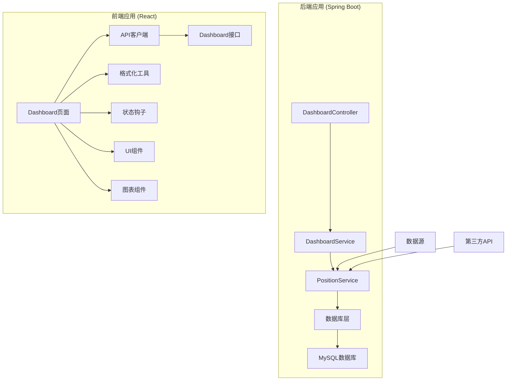
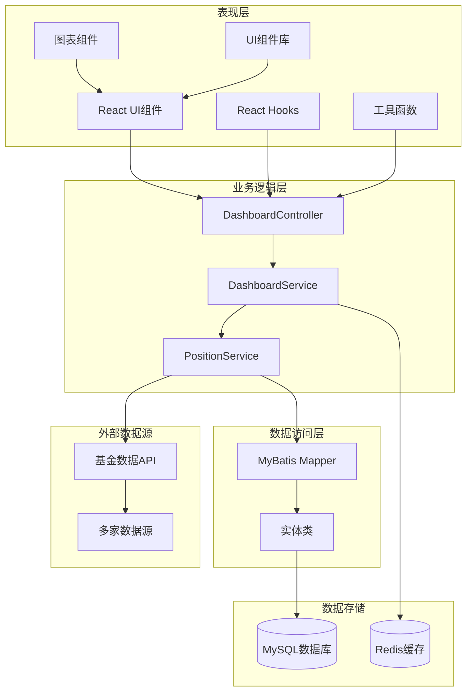
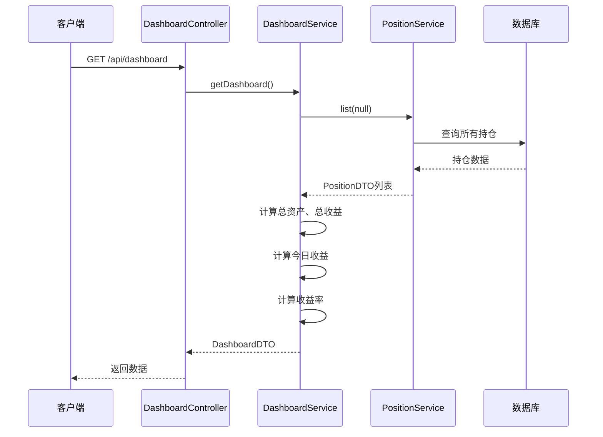
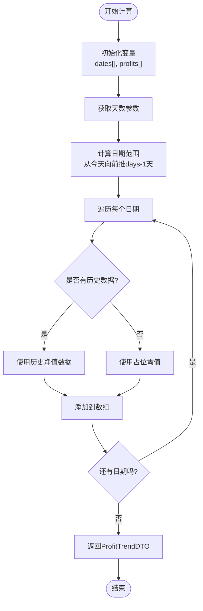
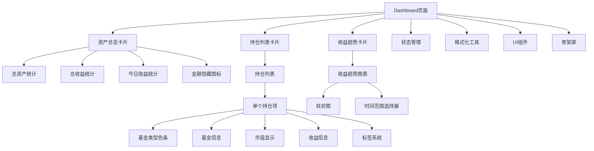
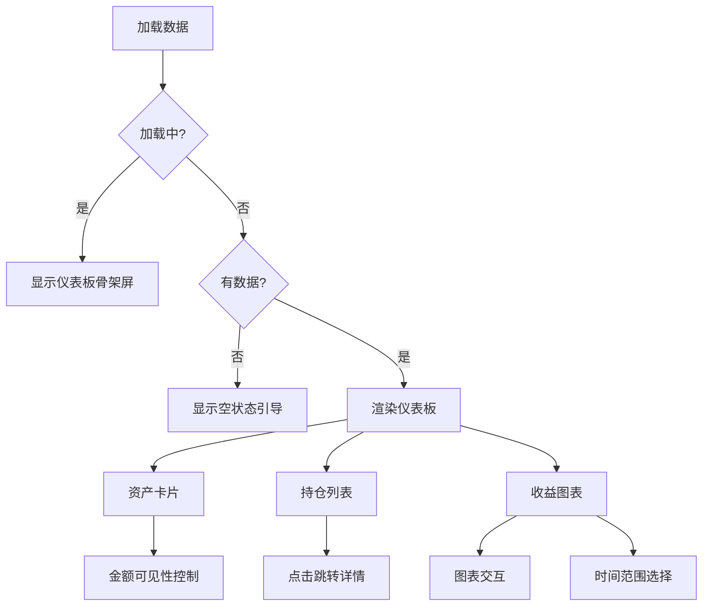
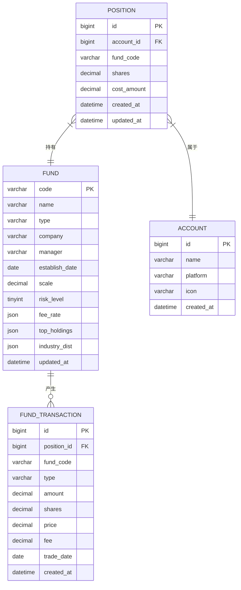
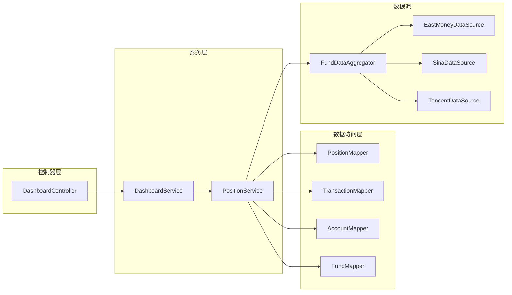
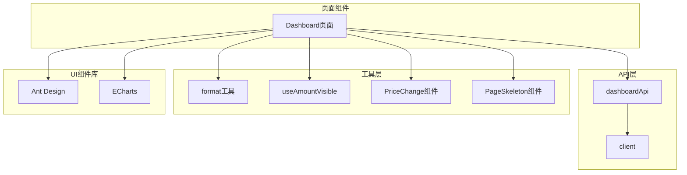

# 仪表板增强

<cite>
**本文档引用的文件**
- [DashboardController.java](file://src/main/java/com/qoder/fund/controller/DashboardController.java)
- [DashboardService.java](file://src/main/java/com/qoder/fund/service/DashboardService.java)
- [DashboardDTO.java](file://src/main/java/com/qoder/fund/dto/DashboardDTO.java)
- [ProfitTrendDTO.java](file://src/main/java/com/qoder/fund/dto/ProfitTrendDTO.java)
- [PositionDTO.java](file://src/main/java/com/qoder/fund/dto/PositionDTO.java)
- [PositionService.java](file://src/main/java/com/qoder/fund/service/PositionService.java)
- [index.tsx](file://fund-web/src/pages/Dashboard/index.tsx)
- [dashboard.ts](file://fund-web/src/api/dashboard.ts)
- [format.ts](file://fund-web/src/utils/format.ts)
- [useAmountVisible.ts](file://fund-web/src/hooks/useAmountVisible.ts)
- [PriceChange.tsx](file://fund-web/src/components/PriceChange.tsx)
- [EmptyGuide.tsx](file://fund-web/src/components/EmptyGuide.tsx)
- [PageSkeleton.tsx](file://fund-web/src/components/PageSkeleton.tsx)
- [client.ts](file://fund-web/src/api/client.ts)
- [application.yml](file://src/main/resources/application.yml)
- [schema.sql](file://src/main/resources/db/schema.sql)
- [PRD.md](file://PRD.md)
</cite>

## 更新摘要
**所做更改**
- 更新了仪表板页面的重新设计分析，重点增强数据可视化和用户交互体验
- 新增了收益趋势图表的详细实现分析
- 增强了持仓列表的交互设计说明
- 更新了资产总览卡片的视觉设计描述
- 完善了用户隐私保护功能的说明

## 目录
1. [简介](#简介)
2. [项目结构](#项目结构)
3. [核心组件](#核心组件)
4. [架构概览](#架构概览)
5. [详细组件分析](#详细组件分析)
6. [依赖关系分析](#依赖关系分析)
7. [性能考虑](#性能考虑)
8. [故障排除指南](#故障排除指南)
9. [结论](#结论)

## 简介

本文档详细分析了基金投资管理系统中的仪表板增强功能。该系统是一个基于Spring Boot和React的Web应用，专注于为个人投资者提供一站式基金数据聚合管理工具。仪表板作为用户登录后的主页面，提供了投资组合的全面概览，包括资产总览、持仓列表、收益趋势分析等功能。

**更新** 本次更新重点关注仪表板页面的重新设计，显著增强了数据可视化效果和用户交互体验，包括改进的图表展示、更直观的布局设计和增强的隐私保护功能。

系统采用前后端分离架构，后端使用Java Spring Boot提供RESTful API，前端使用React TypeScript构建用户界面。通过集成多个数据源，系统能够实时获取基金净值、估值等关键数据，为用户提供准确的投资决策辅助信息。

## 项目结构

项目采用典型的MVC架构模式，分为后端Spring Boot应用和前端React应用两个主要部分：

**图表来源**
- [DashboardController.java:1-27](file://src/main/java/com/qoder/fund/controller/DashboardController.java#L1-L27)
- [DashboardService.java:1-84](file://src/main/java/com/qoder/fund/service/DashboardService.java#L1-L84)
- [index.tsx:1-184](file://fund-web/src/pages/Dashboard/index.tsx#L1-L184)

**章节来源**
- [DashboardController.java:1-27](file://src/main/java/com/qoder/fund/controller/DashboardController.java#L1-L27)
- [DashboardService.java:1-84](file://src/main/java/com/qoder/fund/service/DashboardService.java#L1-L84)
- [index.tsx:1-184](file://fund-web/src/pages/Dashboard/index.tsx#L1-L184)

## 核心组件

### 后端核心组件

#### 控制器层
DashboardController负责处理仪表板相关的HTTP请求，提供两个主要接口：
- 获取仪表板概览数据
- 获取收益趋势数据

#### 服务层
DashboardService是核心业务逻辑处理单元，负责：
- 计算总资产、总收益、总收益率
- 计算今日收益
- 生成收益趋势数据
- 处理持仓数据聚合

#### DTO层
系统使用多个DTO对象来封装数据传输：
- DashboardDTO：仪表板概览数据
- ProfitTrendDTO：收益趋势数据
- PositionDTO：持仓详情数据

### 前端核心组件

#### Dashboard页面
React组件负责展示仪表板的所有功能，包括：
- 资产总览卡片（支持金额隐藏）
- 持仓基金列表（带类型标识和收益信息）
- 收益趋势图表（支持时间范围切换）
- 金额隐私保护功能

#### API接口
dashboardApi模块提供类型安全的API调用：
- getData：获取仪表板数据
- getProfitTrend：获取收益趋势

**更新** 新增了收益趋势图表的实现细节，包括ECharts集成和交互功能。

**章节来源**
- [DashboardController.java:15-26](file://src/main/java/com/qoder/fund/controller/DashboardController.java#L15-L26)
- [DashboardService.java:22-82](file://src/main/java/com/qoder/fund/service/DashboardService.java#L22-L82)
- [DashboardDTO.java:1-16](file://src/main/java/com/qoder/fund/dto/DashboardDTO.java#L1-L16)
- [index.tsx:13-184](file://fund-web/src/pages/Dashboard/index.tsx#L13-L184)

## 架构概览

系统采用分层架构设计，确保关注点分离和代码可维护性：

**图表来源**
- [DashboardController.java:10-26](file://src/main/java/com/qoder/fund/controller/DashboardController.java#L10-L26)
- [DashboardService.java:16-82](file://src/main/java/com/qoder/fund/service/DashboardService.java#L16-L82)
- [PositionService.java:25-168](file://src/main/java/com/qoder/fund/service/PositionService.java#L25-L168)
- [application.yml:18-25](file://src/main/resources/application.yml#L18-L25)

**章节来源**
- [application.yml:1-68](file://src/main/resources/application.yml#L1-L68)
- [schema.sql:1-93](file://src/main/resources/db/schema.sql#L1-L93)

## 详细组件分析

### 后端数据流分析

#### 仪表板数据计算流程

**图表来源**
- [DashboardController.java:17-20](file://src/main/java/com/qoder/fund/controller/DashboardController.java#L17-L20)
- [DashboardService.java:22-63](file://src/main/java/com/qoder/fund/service/DashboardService.java#L22-L63)
- [PositionService.java:33-44](file://src/main/java/com/qoder/fund/service/PositionService.java#L33-L44)

#### 收益趋势数据生成

**图表来源**
- [DashboardService.java:65-82](file://src/main/java/com/qoder/fund/service/DashboardService.java#L65-L82)

**章节来源**
- [DashboardService.java:22-82](file://src/main/java/com/qoder/fund/service/DashboardService.java#L22-L82)

### 前端组件架构

#### Dashboard页面组件树

**图表来源**
- [index.tsx:55-180](file://fund-web/src/pages/Dashboard/index.tsx#L55-L180)

#### 数据展示逻辑

**更新** 新增了收益趋势图表的时间范围选择功能和骨架屏加载体验。

**图表来源**
- [index.tsx:21-39](file://fund-web/src/pages/Dashboard/index.tsx#L21-L39)
- [index.tsx:159-177](file://fund-web/src/pages/Dashboard/index.tsx#L159-L177)

**章节来源**
- [index.tsx:13-184](file://fund-web/src/pages/Dashboard/index.tsx#L13-L184)
- [useAmountVisible.ts:1-26](file://fund-web/src/hooks/useAmountVisible.ts#L1-L26)

### 数据模型设计

#### 核心数据模型关系

**图表来源**
- [schema.sql:40-67](file://src/main/resources/db/schema.sql#L40-L67)

**章节来源**
- [schema.sql:1-93](file://src/main/resources/db/schema.sql#L1-L93)

### 仪表板重新设计特性

#### 资产总览卡片设计
- 采用三列布局展示总资产、总收益、今日收益
- 支持金额隐藏功能，保护用户隐私
- 数字采用等宽字体，提升可读性
- 收益颜色根据正负值动态变化

#### 持仓列表增强
- 每个持仓项左侧添加基金类型色条
- 支持估算收益和实际收益双重显示
- QDII基金显示T+1延迟标识
- 点击任意位置即可跳转到基金详情

#### 收益趋势图表
- 使用ECharts实现柱状图展示
- 收益为正显示红色，为负显示绿色
- 支持7天和30天时间范围切换
- 骨架屏加载提升用户体验

**章节来源**
- [index.tsx:58-93](file://fund-web/src/pages/Dashboard/index.tsx#L58-L93)
- [index.tsx:110-151](file://fund-web/src/pages/Dashboard/index.tsx#L110-L151)
- [index.tsx:171-176](file://fund-web/src/pages/Dashboard/index.tsx#L171-L176)

## 依赖关系分析

### 后端依赖关系

系统后端采用松耦合的设计，各组件间依赖关系清晰：

**图表来源**
- [DashboardController.java:15](file://src/main/java/com/qoder/fund/controller/DashboardController.java#L15)
- [DashboardService.java:20](file://src/main/java/com/qoder/fund/service/DashboardService.java#L20)
- [PositionService.java:27-31](file://src/main/java/com/qoder/fund/service/PositionService.java#L27-L31)

### 前端依赖关系

**图表来源**
- [index.tsx:5](file://fund-web/src/pages/Dashboard/index.tsx#L5)
- [dashboard.ts:37-43](file://fund-web/src/api/dashboard.ts#L37-L43)
- [client.ts:4-7](file://fund-web/src/api/client.ts#L4-L7)

**章节来源**
- [DashboardController.java:1-27](file://src/main/java/com/qoder/fund/controller/DashboardController.java#L1-L27)
- [DashboardService.java:1-84](file://src/main/java/com/qoder/fund/service/DashboardService.java#L1-L84)
- [PositionService.java:1-200](file://src/main/java/com/qoder/fund/service/PositionService.java#L1-L200)

## 性能考虑

### 后端性能优化

系统在设计时充分考虑了性能因素：

1. **缓存策略**：使用Caffeine缓存配置，maximumSize=1000，expireAfterWrite=300s
2. **数据库优化**：为常用查询字段建立索引，包括fund_code、account_id等
3. **数据聚合**：在服务层进行数据聚合，减少数据库查询次数
4. **BigDecimal精度**：使用适当的舍入模式确保计算精度

### 前端性能优化

1. **懒加载**：图表组件按需加载，减少初始包大小
2. **状态管理**：使用React Hooks管理组件状态，避免不必要的重渲染
3. **数据缓存**：本地存储金额可见性设置，提升用户体验
4. **骨架屏**：使用PageSkeleton提供更好的加载体验
5. **虚拟滚动**：对于大量持仓数据，可考虑实现虚拟滚动优化

### 数据源性能

系统集成了多个数据源以提高数据可用性和性能：
- 多数据源备份，防止单点故障
- 实时估值数据与收盘后净值数据结合使用
- 本地缓存机制减少对外部API的依赖

**更新** 新增了骨架屏和虚拟滚动的性能优化建议。

**章节来源**
- [application.yml:18-25](file://src/main/resources/application.yml#L18-L25)
- [schema.sql:15-17](file://src/main/resources/db/schema.sql#L15-L17)
- [schema.sql:49-51](file://src/main/resources/db/schema.sql#L49-L51)

## 故障排除指南

### 常见问题及解决方案

#### 仪表板数据为空

**症状**：仪表板显示空状态或加载失败
**可能原因**：
1. 用户没有添加任何持仓
2. API请求失败
3. 数据库连接问题

**解决步骤**：
1. 检查用户是否已添加至少一个持仓
2. 查看浏览器开发者工具中的网络请求
3. 验证后端服务运行状态
4. 检查数据库连接配置

#### 收益趋势数据异常

**症状**：收益趋势图表显示异常数据
**可能原因**：
1. 历史净值数据缺失
2. 计算逻辑错误
3. 时间格式处理问题

**解决步骤**：
1. 检查FundNav表中是否有历史数据
2. 验证ProfitTrendDTO的生成逻辑
3. 确认日期格式转换正确

#### 金额显示问题

**症状**：金额显示异常或无法切换显示状态
**可能原因**：
1. 本地存储权限问题
2. 状态管理错误
3. 格式化函数异常

**解决步骤**：
1. 检查浏览器本地存储功能
2. 验证useAmountVisible钩子逻辑
3. 确认formatAmount函数正常工作

#### 图表渲染问题

**症状**：收益趋势图表不显示或显示异常
**可能原因**：
1. ECharts库加载失败
2. 图表配置错误
3. 数据格式不匹配

**解决步骤**：
1. 检查网络连接和CDN资源
2. 验证trendOption配置
3. 确认数据格式符合ECharts要求

### 调试技巧

1. **后端调试**：启用debug日志级别，查看SQL执行情况
2. **前端调试**：使用React DevTools检查组件状态
3. **网络调试**：监控API响应时间和错误码
4. **数据库调试**：检查关键查询的执行计划
5. **图表调试**：使用浏览器开发者工具检查ECharts实例

**更新** 新增了图表渲染问题的调试方法。

**章节来源**
- [EmptyGuide.tsx:1-35](file://fund-web/src/components/EmptyGuide.tsx#L1-L35)
- [PageSkeleton.tsx:1-67](file://fund-web/src/components/PageSkeleton.tsx#L1-L67)
- [client.ts:9-28](file://fund-web/src/api/client.ts#L9-L28)

## 结论

仪表板增强功能成功实现了基金投资管理的核心需求。系统通过前后端分离的设计，提供了完整的投资组合概览功能，包括资产总览、持仓管理、收益分析等关键特性。

**更新** 本次重新设计显著提升了用户体验，主要体现在：

### 主要成就

1. **完整的数据聚合**：整合多个数据源，提供准确的实时数据
2. **直观的可视化**：通过图表和卡片布局，让用户快速理解投资状况
3. **良好的用户体验**：支持金额隐藏、响应式设计、快速交互
4. **可扩展的架构**：模块化的组件设计便于后续功能扩展
5. **增强的隐私保护**：金额隐藏功能保护用户财务隐私

### 技术亮点

- **类型安全**：前后端都使用TypeScript，提供编译时类型检查
- **状态管理**：合理的状态分离和管理机制
- **错误处理**：完善的错误处理和用户反馈机制
- **性能优化**：缓存策略和数据优化确保系统响应速度
- **现代化UI**：采用Ant Design组件库和ECharts图表库

### 未来改进方向

1. **增强分析功能**：添加更复杂的收益分析和预测功能
2. **移动端优化**：针对移动设备进行专门的界面优化
3. **实时更新**：实现更频繁的数据刷新机制
4. **个性化定制**：允许用户自定义仪表板布局和显示内容
5. **虚拟滚动**：对大量持仓数据实现虚拟滚动优化

该系统为个人投资者提供了一个强大而易用的基金管理工具，通过持续的功能增强和技术优化，能够更好地服务于用户的投资决策需求。仪表板的重新设计使其在数据可视化和用户交互方面达到了新的高度，为用户提供了更加直观和便捷的投资管理体验。