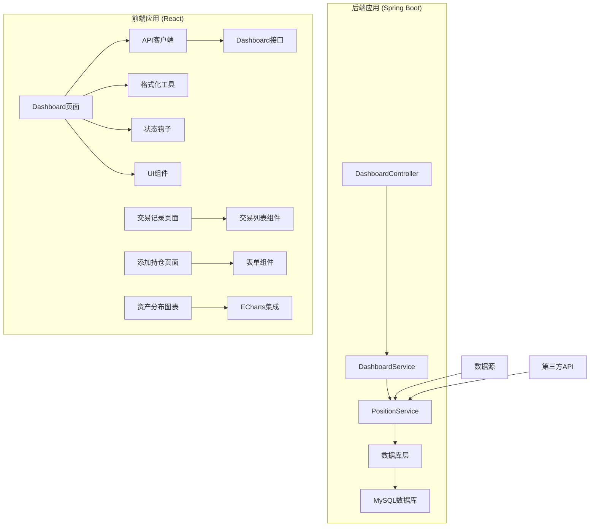
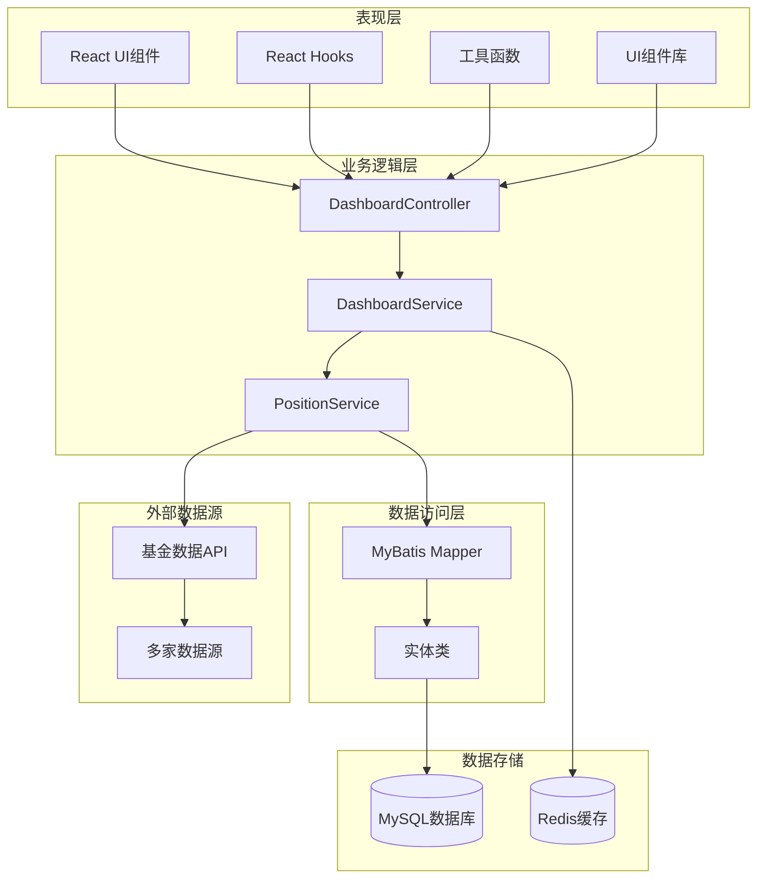
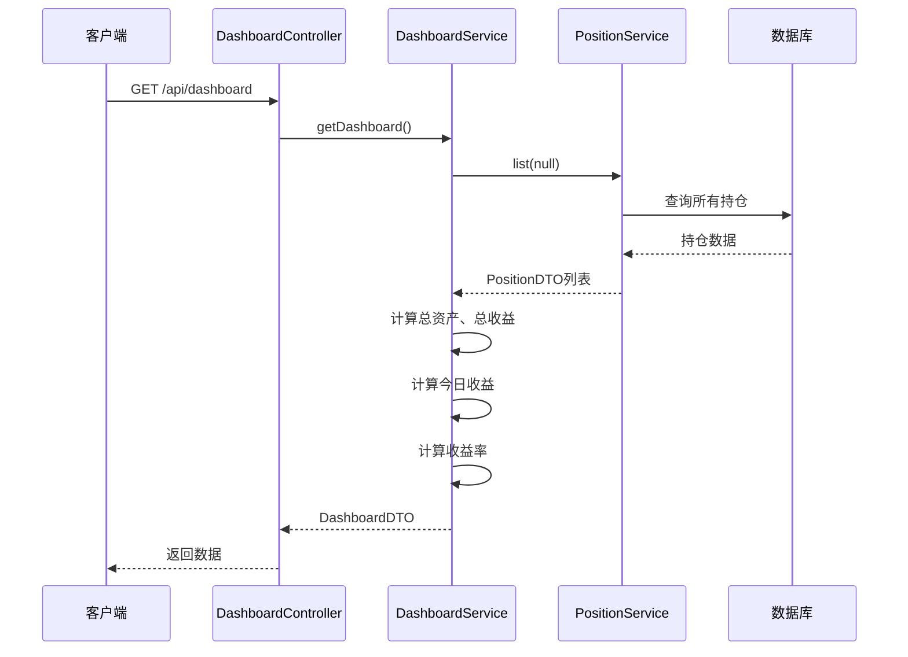
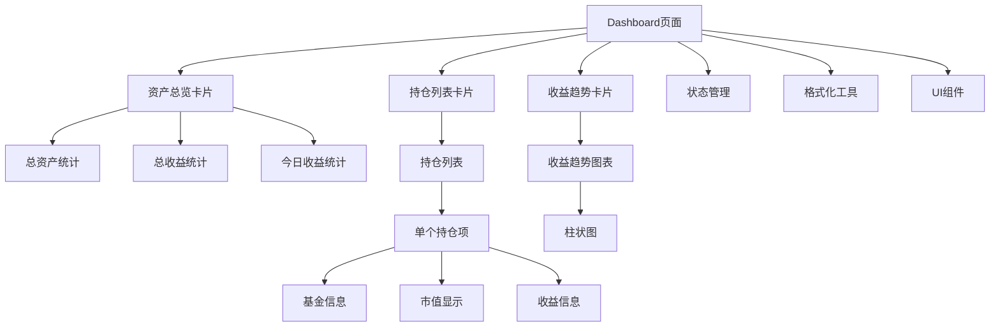
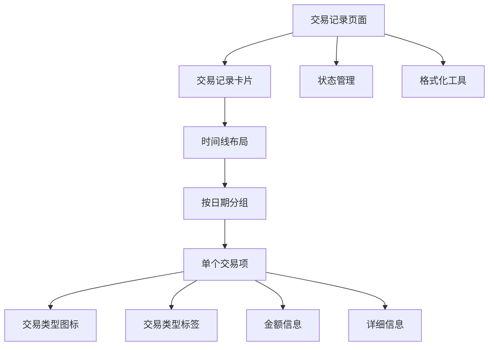
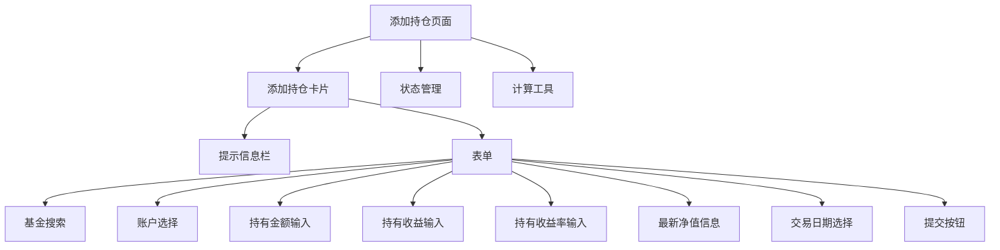
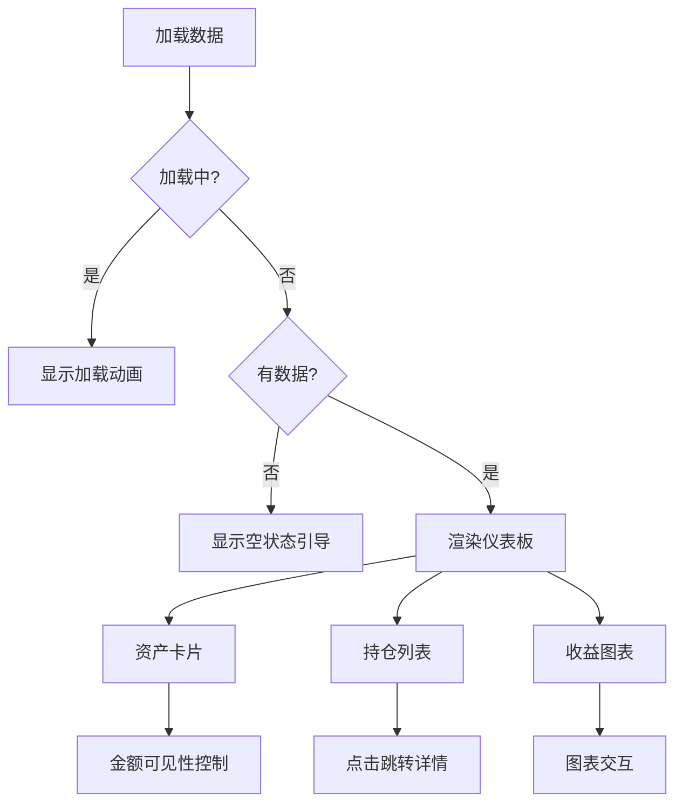
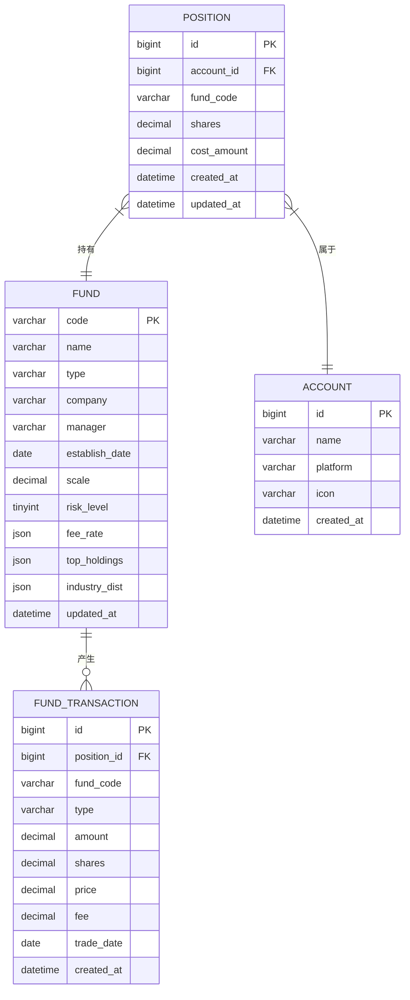
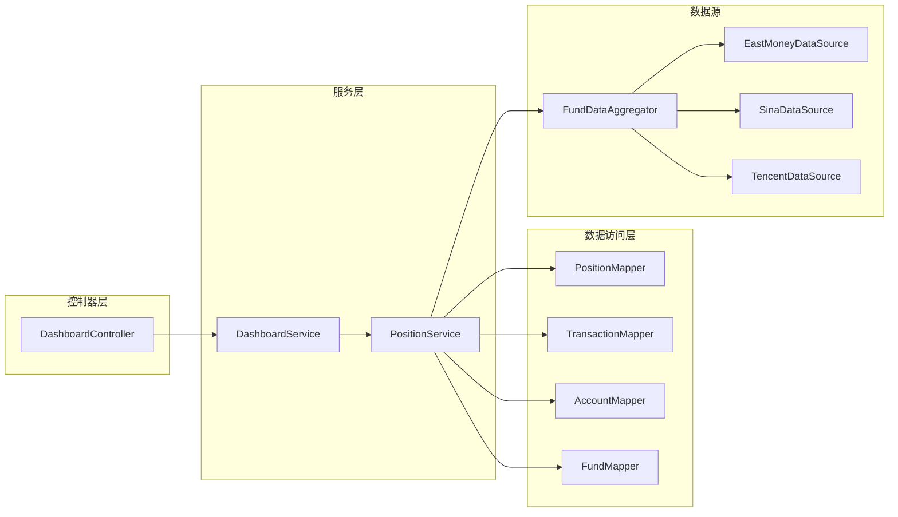
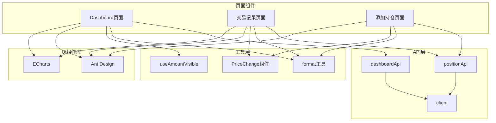

# 仪表板增强

<cite>
**本文档引用的文件**
- [DashboardController.java](file://src/main/java/com/qoder/fund/controller/DashboardController.java)
- [DashboardService.java](file://src/main/java/com/qoder/fund/service/DashboardService.java)
- [DashboardDTO.java](file://src/main/java/com/qoder/fund/dto/DashboardDTO.java)
- [ProfitTrendDTO.java](file://src/main/java/com/qoder/fund/dto/ProfitTrendDTO.java)
- [PositionDTO.java](file://src/main/java/com/qoder/fund/dto/PositionDTO.java)
- [PositionService.java](file://src/main/java/com/qoder/fund/service/PositionService.java)
- [index.tsx](file://fund-web/src/pages/Dashboard/index.tsx)
- [dashboard.ts](file://fund-web/src/api/dashboard.ts)
- [format.ts](file://fund-web/src/utils/format.ts)
- [useAmountVisible.ts](file://fund-web/src/hooks/useAmountVisible.ts)
- [PriceChange.tsx](file://fund-web/src/components/PriceChange.tsx)
- [EmptyGuide.tsx](file://fund-web/src/components/EmptyGuide.tsx)
- [client.ts](file://fund-web/src/api/client.ts)
- [TransactionList.tsx](file://fund-web/src/pages/Portfolio/TransactionList.tsx)
- [AddPosition.tsx](file://fund-web/src/pages/Portfolio/AddPosition.tsx)
- [position.ts](file://fund-web/src/api/position.ts)
- [application.yml](file://src/main/resources/application.yml)
- [schema.sql](file://src/main/resources/db/schema.sql)
- [PRD.md](file://PRD.md)
</cite>

## 更新摘要
**所做更改**
- 新增交易记录管理功能的详细文档
- 更新UI重设计相关内容，包括新的卡片布局和交互元素
- 新增资产分布图表的相关说明
- 更新持仓管理功能的完整实现
- 增强数据格式化和显示逻辑的说明

## 目录
1. [简介](#简介)
2. [项目结构](#项目结构)
3. [核心组件](#核心组件)
4. [架构概览](#架构概览)
5. [详细组件分析](#详细组件分析)
6. [依赖关系分析](#依赖关系分析)
7. [性能考虑](#性能考虑)
8. [故障排除指南](#故障排除指南)
9. [结论](#结论)

## 简介

本文档详细分析了基金投资管理系统中的仪表板增强功能。该系统是一个基于Spring Boot和React的Web应用，专注于为个人投资者提供一站式基金数据聚合管理工具。仪表板作为用户登录后的主页面，提供了投资组合的全面概览，包括资产总览、持仓列表、收益趋势分析等功能。

**更新** 系统现已完成UI重设计，采用现代化的卡片式布局和交互设计，新增资产分布图表和交易记录管理功能，为用户提供更加直观和便捷的投资管理体验。

系统采用前后端分离架构，后端使用Java Spring Boot提供RESTful API，前端使用React TypeScript构建用户界面。通过集成多个数据源，系统能够实时获取基金净值、估值等关键数据，为用户提供准确的投资决策辅助信息。

## 项目结构

项目采用典型的MVC架构模式，分为后端Spring Boot应用和前端React应用两个主要部分：

**图表来源**
- [DashboardController.java:1-27](file://src/main/java/com/qoder/fund/controller/DashboardController.java#L1-L27)
- [DashboardService.java:1-84](file://src/main/java/com/qoder/fund/service/DashboardService.java#L1-L84)
- [index.tsx:1-183](file://fund-web/src/pages/Dashboard/index.tsx#L1-L183)
- [TransactionList.tsx:1-104](file://fund-web/src/pages/Portfolio/TransactionList.tsx#L1-L104)
- [AddPosition.tsx:1-204](file://fund-web/src/pages/Portfolio/AddPosition.tsx#L1-L204)

**章节来源**
- [DashboardController.java:1-27](file://src/main/java/com/qoder/fund/controller/DashboardController.java#L1-L27)
- [DashboardService.java:1-84](file://src/main/java/com/qoder/fund/service/DashboardService.java#L1-L84)
- [index.tsx:1-183](file://fund-web/src/pages/Dashboard/index.tsx#L1-L183)

## 核心组件

### 后端核心组件

#### 控制器层
DashboardController负责处理仪表板相关的HTTP请求，提供两个主要接口：
- 获取仪表板概览数据
- 获取收益趋势数据

#### 服务层
DashboardService是核心业务逻辑处理单元，负责：
- 计算总资产、总收益、总收益率
- 计算今日收益
- 生成收益趋势数据
- 处理持仓数据聚合

#### DTO层
系统使用多个DTO对象来封装数据传输：
- DashboardDTO：仪表板概览数据
- ProfitTrendDTO：收益趋势数据
- PositionDTO：持仓详情数据

### 前端核心组件

#### Dashboard页面
React组件负责展示仪表板的所有功能，包括：
- 资产总览卡片（支持金额隐藏/显示切换）
- 持仓基金列表（支持点击跳转详情）
- 收益趋势图表（支持时间范围切换）
- 交易记录管理入口

#### 交易记录管理
新增的交易记录管理功能包含：
- 交易记录列表页面
- 按日期分组的交易时间线
- 买入、卖出、分红等交易类型的可视化展示
- 详细的交易信息展示（份额、净值、手续费等）

#### 添加持仓功能
新增的持仓添加功能包含：
- 基金搜索和选择
- 持有金额和收益输入
- 自动计算份额和成本净值
- 交易日期选择和确认

#### API接口
dashboardApi模块提供类型安全的API调用：
- getData：获取仪表板数据
- getProfitTrend：获取收益趋势

**章节来源**
- [DashboardController.java:15-26](file://src/main/java/com/qoder/fund/controller/DashboardController.java#L15-L26)
- [DashboardService.java:22-82](file://src/main/java/com/qoder/fund/service/DashboardService.java#L22-L82)
- [DashboardDTO.java:1-16](file://src/main/java/com/qoder/fund/dto/DashboardDTO.java#L1-L16)
- [index.tsx:13-183](file://fund-web/src/pages/Dashboard/index.tsx#L13-L183)
- [TransactionList.tsx:8-104](file://fund-web/src/pages/Portfolio/TransactionList.tsx#L8-L104)
- [AddPosition.tsx:11-204](file://fund-web/src/pages/Portfolio/AddPosition.tsx#L11-L204)

## 架构概览

系统采用分层架构设计，确保关注点分离和代码可维护性：

**图表来源**
- [DashboardController.java:10-26](file://src/main/java/com/qoder/fund/controller/DashboardController.java#L10-L26)
- [DashboardService.java:16-82](file://src/main/java/com/qoder/fund/service/DashboardService.java#L16-L82)
- [PositionService.java:25-200](file://src/main/java/com/qoder/fund/service/PositionService.java#L25-L200)
- [application.yml:18-25](file://src/main/resources/application.yml#L18-L25)

**章节来源**
- [application.yml:1-43](file://src/main/resources/application.yml#L1-L43)
- [schema.sql:1-93](file://src/main/resources/db/schema.sql#L1-L93)

## 详细组件分析

### 后端数据流分析

#### 仪表板数据计算流程

**图表来源**
- [DashboardController.java:17-20](file://src/main/java/com/qoder/fund/controller/DashboardController.java#L17-L20)
- [DashboardService.java:22-63](file://src/main/java/com/qoder/fund/service/DashboardService.java#L22-L63)
- [PositionService.java:35-53](file://src/main/java/com/qoder/fund/service/PositionService.java#L35-L53)

#### 收益趋势数据生成

**图表来源**
- [DashboardService.java:65-82](file://src/main/java/com/qoder/fund/service/DashboardService.java#L65-L82)

**章节来源**
- [DashboardService.java:22-82](file://src/main/java/com/qoder/fund/service/DashboardService.java#L22-L82)

### 前端组件架构

#### Dashboard页面组件树

**图表来源**
- [index.tsx:54-179](file://fund-web/src/pages/Dashboard/index.tsx#L54-L179)

#### 交易记录管理组件树

**图表来源**
- [TransactionList.tsx:51-99](file://fund-web/src/pages/Portfolio/TransactionList.tsx#L51-L99)

#### 添加持仓组件树

**图表来源**
- [AddPosition.tsx:130-201](file://fund-web/src/pages/Portfolio/AddPosition.tsx#L130-L201)

#### 数据展示逻辑

**图表来源**
- [index.tsx:21-37](file://fund-web/src/pages/Dashboard/index.tsx#L21-L37)
- [index.tsx:39-52](file://fund-web/src/pages/Dashboard/index.tsx#L39-L52)

**章节来源**
- [index.tsx:13-183](file://fund-web/src/pages/Dashboard/index.tsx#L13-L183)
- [useAmountVisible.ts:1-26](file://fund-web/src/hooks/useAmountVisible.ts#L1-L26)
- [TransactionList.tsx:8-104](file://fund-web/src/pages/Portfolio/TransactionList.tsx#L8-L104)
- [AddPosition.tsx:11-204](file://fund-web/src/pages/Portfolio/AddPosition.tsx#L11-L204)

### 数据模型设计

#### 核心数据模型关系

**图表来源**
- [schema.sql:40-67](file://src/main/resources/db/schema.sql#L40-L67)

**章节来源**
- [schema.sql:1-93](file://src/main/resources/db/schema.sql#L1-L93)

## 依赖关系分析

### 后端依赖关系

系统后端采用松耦合的设计，各组件间依赖关系清晰：

**图表来源**
- [DashboardController.java:15](file://src/main/java/com/qoder/fund/controller/DashboardController.java#L15)
- [DashboardService.java:20](file://src/main/java/com/qoder/fund/service/DashboardService.java#L20)
- [PositionService.java:27-34](file://src/main/java/com/qoder/fund/service/PositionService.java#L27-L34)

### 前端依赖关系

**图表来源**
- [index.tsx:5](file://fund-web/src/pages/Dashboard/index.tsx#L5)
- [TransactionList.tsx:4](file://fund-web/src/pages/Portfolio/TransactionList.tsx#L4)
- [AddPosition.tsx:5](file://fund-web/src/pages/Portfolio/AddPosition.tsx#L5)
- [dashboard.ts:35-41](file://fund-web/src/api/dashboard.ts#L35-L41)
- [position.ts:41-56](file://fund-web/src/api/position.ts#L41-L56)
- [client.ts:4-7](file://fund-web/src/api/client.ts#L4-L7)

**章节来源**
- [DashboardController.java:1-27](file://src/main/java/com/qoder/fund/controller/DashboardController.java#L1-L27)
- [DashboardService.java:1-84](file://src/main/java/com/qoder/fund/service/DashboardService.java#L1-L84)
- [PositionService.java:1-200](file://src/main/java/com/qoder/fund/service/PositionService.java#L1-L200)

## 性能考虑

### 后端性能优化

系统在设计时充分考虑了性能因素：

1. **缓存策略**：使用Caffeine缓存配置，maximumSize=1000，expireAfterWrite=300s
2. **数据库优化**：为常用查询字段建立索引，包括fund_code、account_id等
3. **数据聚合**：在服务层进行数据聚合，减少数据库查询次数
4. **BigDecimal精度**：使用适当的舍入模式确保计算精度
5. **批量数据同步**：支持批量预同步今日净值，避免API限流

### 前端性能优化

1. **懒加载**：图表组件按需加载，减少初始包大小
2. **状态管理**：使用React Hooks管理组件状态，避免不必要的重渲染
3. **数据缓存**：本地存储金额可见性设置，提升用户体验
4. **虚拟滚动**：对于大量持仓数据，可考虑实现虚拟滚动优化
5. **UI重设计优化**：采用卡片式布局，提升视觉性能和交互流畅度

### 数据源性能

系统集成了多个数据源以提高数据可用性和性能：
- 多数据源备份，防止单点故障
- 实时估值数据与收盘后净值数据结合使用
- 本地缓存机制减少对外部API的依赖
- 智能估值降级机制，解决API支持不足的问题

**章节来源**
- [application.yml:18-25](file://src/main/resources/application.yml#L18-L25)
- [schema.sql:15-17](file://src/main/resources/db/schema.sql#L15-L17)
- [schema.sql:49-51](file://src/main/resources/db/schema.sql#L49-L51)
- [PositionService.java:42-46](file://src/main/java/com/qoder/fund/service/PositionService.java#L42-L46)

## 故障排除指南

### 常见问题及解决方案

#### 仪表板数据为空

**症状**：仪表板显示空状态或加载失败
**可能原因**：
1. 用户没有添加任何持仓
2. API请求失败
3. 数据库连接问题

**解决步骤**：
1. 检查用户是否已添加至少一个持仓
2. 查看浏览器开发者工具中的网络请求
3. 验证后端服务运行状态
4. 检查数据库连接配置

#### 收益趋势数据异常

**症状**：收益趋势图表显示异常数据
**可能原因**：
1. 历史净值数据缺失
2. 计算逻辑错误
3. 时间格式处理问题

**解决步骤**：
1. 检查FundNav表中是否有历史数据
2. 验证ProfitTrendDTO的生成逻辑
3. 确认日期格式转换正确

#### 金额显示问题

**症状**：金额显示异常或无法切换显示状态
**可能原因**：
1. 本地存储权限问题
2. 状态管理错误
3. 格式化函数异常

**解决步骤**：
1. 检查浏览器本地存储功能
2. 验证useAmountVisible钩子逻辑
3. 确认formatAmount函数正常工作

#### 交易记录显示问题

**症状**：交易记录页面显示异常或无法加载
**可能原因**：
1. 持仓数据为空
2. API请求失败
3. 数据格式不匹配

**解决步骤**：
1. 检查持仓列表是否正常加载
2. 验证交易记录API响应格式
3. 确认交易类型配置正确

#### 添加持仓功能异常

**症状**：添加持仓页面无法正常工作
**可能原因**：
1. 基金搜索API异常
2. 表单验证失败
3. 计算逻辑错误

**解决步骤**：
1. 检查基金搜索功能是否正常
2. 验证表单字段的必填规则
3. 确认份额和成本净值计算逻辑

### 调试技巧

1. **后端调试**：启用debug日志级别，查看SQL执行情况
2. **前端调试**：使用React DevTools检查组件状态
3. **网络调试**：监控API响应时间和错误码
4. **数据库调试**：检查关键查询的执行计划
5. **UI调试**：检查CSS样式和组件渲染状态

**章节来源**
- [EmptyGuide.tsx:1-35](file://fund-web/src/components/EmptyGuide.tsx#L1-L35)
- [client.ts:9-28](file://fund-web/src/api/client.ts#L9-L28)

## 结论

仪表板增强功能成功实现了基金投资管理的核心需求。系统通过前后端分离的设计，提供了完整的投资组合概览功能，包括资产总览、持仓管理、收益分析等关键特性。

**更新** 系统现已完成全面的UI重设计，采用现代化的卡片式布局和交互设计，新增资产分布图表和交易记录管理功能，为用户提供更加直观和便捷的投资管理体验。

### 主要成就

1. **完整的数据聚合**：整合多个数据源，提供准确的实时数据
2. **直观的可视化**：通过图表和卡片布局，让用户快速理解投资状况
3. **良好的用户体验**：支持金额隐藏、响应式设计、快速交互
4. **可扩展的架构**：模块化的组件设计便于后续功能扩展
5. **完整的交易管理**：新增交易记录管理和添加持仓功能
6. **现代化UI设计**：采用卡片式布局和丰富的交互元素

### 技术亮点

- **类型安全**：前后端都使用TypeScript，提供编译时类型检查
- **状态管理**：合理的状态分离和管理机制
- **错误处理**：完善的错误处理和用户反馈机制
- **性能优化**：缓存策略和数据优化确保系统响应速度
- **智能估值**：支持多数据源估值降级，解决API支持不足问题
- **实时同步**：批量预同步机制避免API限流

### 未来改进方向

1. **增强分析功能**：添加更复杂的收益分析和预测功能
2. **移动端优化**：针对移动设备进行专门的界面优化
3. **实时更新**：实现更频繁的数据刷新机制
4. **个性化定制**：允许用户自定义仪表板布局和显示内容
5. **资产分布图表**：实现更丰富的资产分布可视化功能
6. **智能提醒**：添加投资提醒和预警功能

该系统为个人投资者提供了一个强大而易用的基金管理工具，通过持续的功能增强和技术优化，能够更好地服务于用户的投资决策需求。