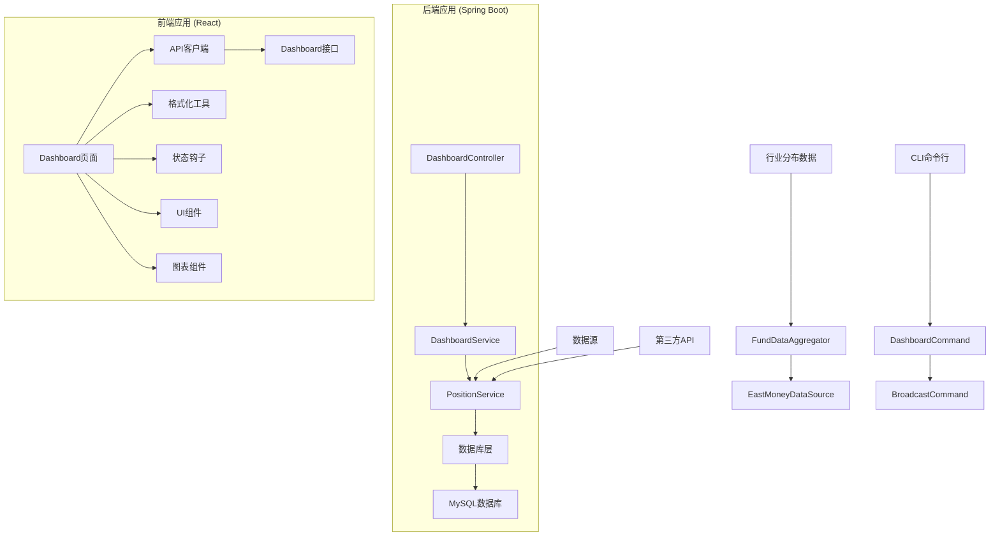
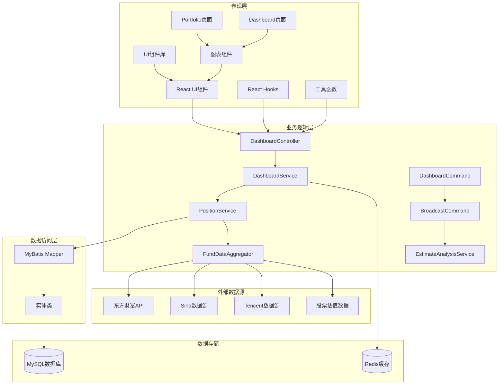
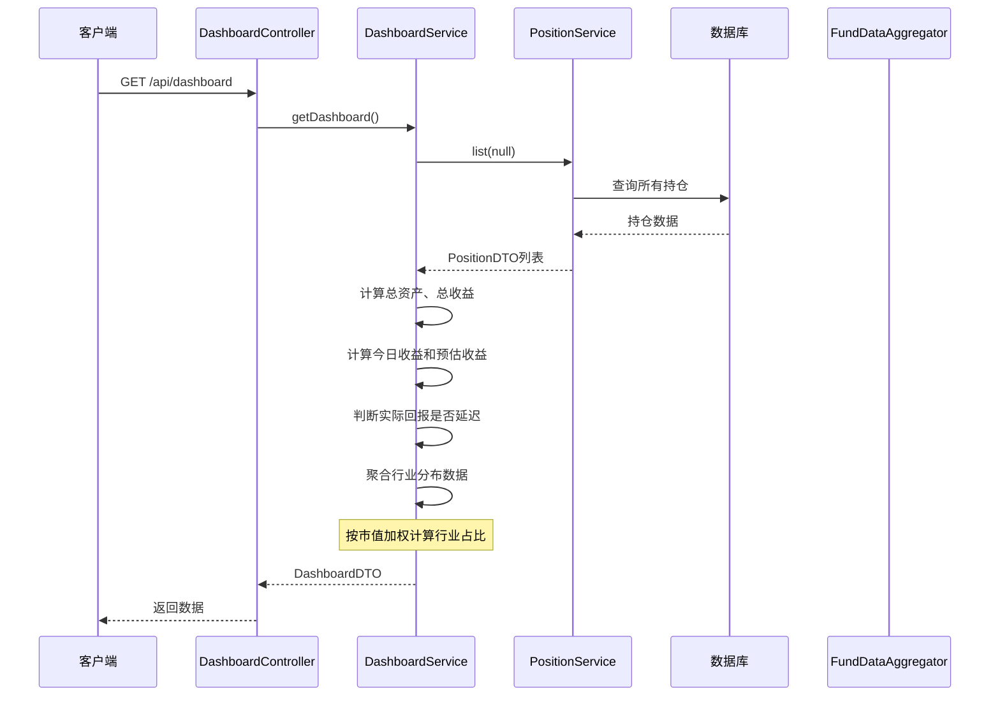
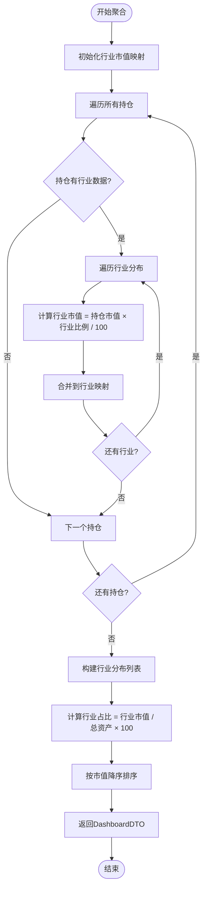
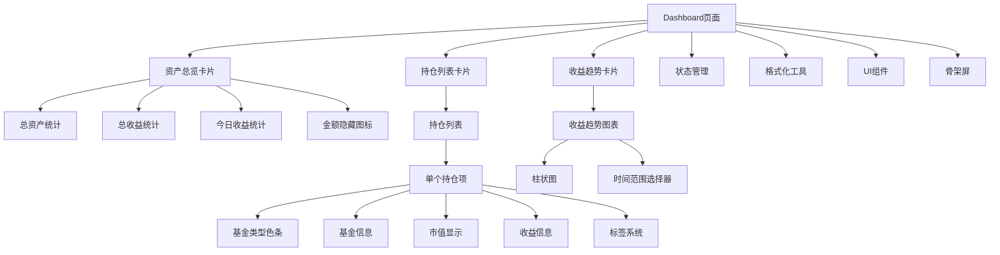
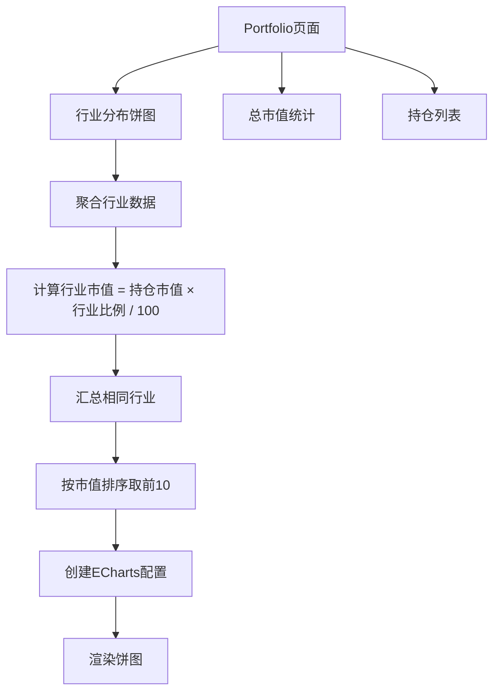
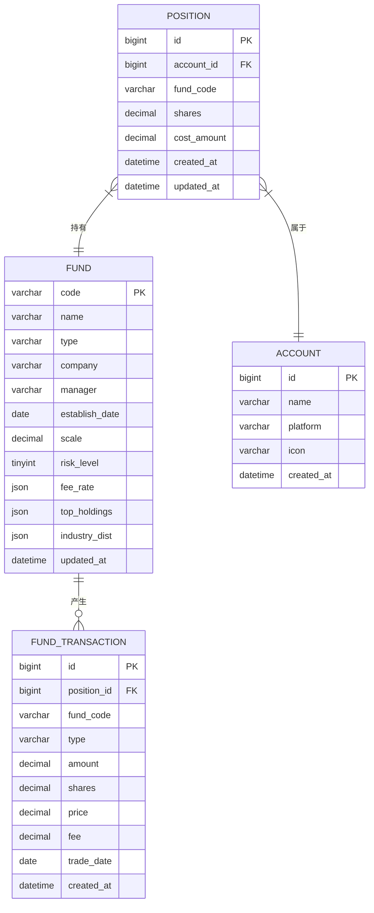
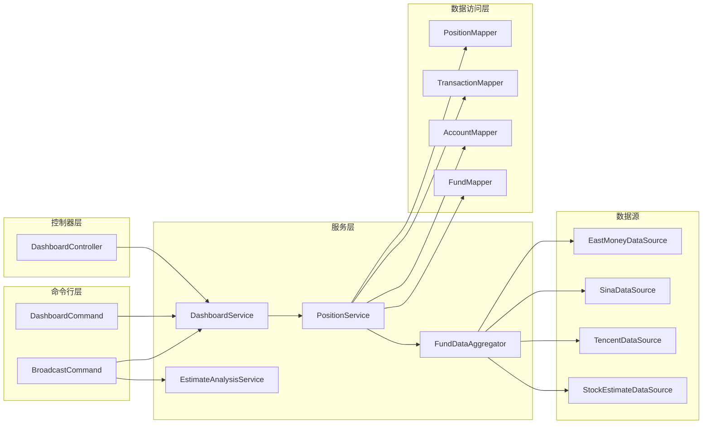
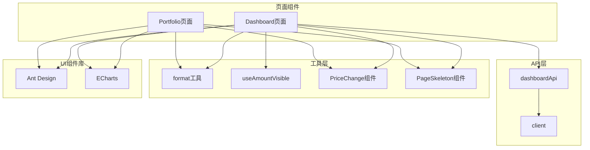

# 仪表板增强

<cite>
**本文档引用的文件**
- [DashboardController.java](file://src/main/java/com/qoder/fund/controller/DashboardController.java)
- [DashboardService.java](file://src/main/java/com/qoder/fund/service/DashboardService.java)
- [DashboardCommand.java](file://src/main/java/com/qoder/fund/cli/DashboardCommand.java)
- [EstimateAnalysisService.java](file://src/main/java/com/qoder/fund/service/EstimateAnalysisService.java)
- [DashboardDTO.java](file://src/main/java/com/qoder/fund/dto/DashboardDTO.java)
- [PositionDTO.java](file://src/main/java/com/qoder/fund/dto/PositionDTO.java)
- [ProfitTrendDTO.java](file://src/main/java/com/qoder/fund/dto/ProfitTrendDTO.java)
- [PositionService.java](file://src/main/java/com/qoder/fund/service/PositionService.java)
- [FundDataAggregator.java](file://src/main/java/com/qoder/fund/datasource/FundDataAggregator.java)
- [EastMoneyDataSource.java](file://src/main/java/com/qoder/fund/datasource/EastMoneyDataSource.java)
- [FundDetailDTO.java](file://src/main/java/com/qoder/fund/dto/FundDetailDTO.java)
- [index.tsx](file://fund-web/src/pages/Dashboard/index.tsx)
- [index.tsx](file://fund-web/src/pages/Portfolio/index.tsx)
- [dashboard.ts](file://fund-web/src/api/dashboard.ts)
- [format.ts](file://fund-web/src/utils/format.ts)
- [useAmountVisible.ts](file://fund-web/src/hooks/useAmountVisible.ts)
- [PriceChange.tsx](file://fund-web/src/components/PriceChange.tsx)
- [EmptyGuide.tsx](file://fund-web/src/components/EmptyGuide.tsx)
- [PageSkeleton.tsx](file://fund-web/src/components/PageSkeleton.tsx)
- [client.ts](file://fund-web/src/api/client.ts)
- [application.yml](file://src/main/resources/application.yml)
- [schema.sql](file://src/main/resources/db/schema.sql)
- [PRD.md](file://PRD.md)
</cite>

## 更新摘要
**所做更改**
- 新增QDII基金报告功能，区分"已验证"和"待验证"位置分类显示
- 新增`isUsQdiiFund()`方法用于识别纯美股QDII基金
- 改进仪表板显示逻辑，优化QDII基金的预估待验证显示
- EstimateAnalysisService中新增"预估（待验证）"标记逻辑
- 增强CLI命令行仪表板功能，提供更精确的持仓状态分类

## 目录
1. [简介](#简介)
2. [项目结构](#项目结构)
3. [核心组件](#核心组件)
4. [架构概览](#架构概览)
5. [详细组件分析](#详细组件分析)
6. [依赖关系分析](#依赖关系分析)
7. [性能考虑](#性能考虑)
8. [故障排除指南](#故障排除指南)
9. [结论](#结论)

## 简介

本文档详细分析了基金投资管理系统中的仪表板增强功能。该系统是一个基于Spring Boot和React的Web应用，专注于为个人投资者提供一站式基金数据聚合管理工具。仪表板作为用户登录后的主页面，提供了投资组合的全面概览，包括资产总览、持仓列表、收益趋势分析和行业分布展示等功能。

**更新** 本次更新重点关注仪表板功能的全面增强，特别是QDII基金的报告功能优化。系统现在能够智能区分"已验证"和"待验证"的持仓状态，为用户提供更准确的投资组合状态信息。新增的纯美股QDII识别功能使得系统能够对不同类型的QDII基金采用不同的显示策略，提高了信息的准确性和实用性。

系统采用前后端分离架构，后端使用Java Spring Boot提供RESTful API，前端使用React TypeScript构建用户界面。通过集成多个数据源，系统能够实时获取基金净值、估值和行业分布等关键数据，为用户提供准确的投资决策辅助信息。

## 项目结构

项目采用典型的MVC架构模式，分为后端Spring Boot应用和前端React应用两个主要部分：

**图表来源**
- [DashboardController.java:1-36](file://src/main/java/com/qoder/fund/controller/DashboardController.java#L1-L36)
- [DashboardService.java:1-472](file://src/main/java/com/qoder/fund/service/DashboardService.java#L1-L472)
- [DashboardCommand.java:1-319](file://src/main/java/com/qoder/fund/cli/DashboardCommand.java#L1-L319)
- [index.tsx:1-198](file://fund-web/src/pages/Dashboard/index.tsx#L1-L198)
- [FundDataAggregator.java:1-200](file://src/main/java/com/qoder/fund/datasource/FundDataAggregator.java#L1-L200)
- [EastMoneyDataSource.java:660-700](file://src/main/java/com/qoder/fund/datasource/EastMoneyDataSource.java#L660-L700)

**章节来源**
- [DashboardController.java:1-36](file://src/main/java/com/qoder/fund/controller/DashboardController.java#L1-L36)
- [DashboardService.java:1-472](file://src/main/java/com/qoder/fund/service/DashboardService.java#L1-L472)
- [DashboardCommand.java:1-319](file://src/main/java/com/qoder/fund/cli/DashboardCommand.java#L1-L319)
- [index.tsx:1-198](file://fund-web/src/pages/Dashboard/index.tsx#L1-L198)

## 核心组件

### 后端核心组件

#### 控制器层
DashboardController负责处理仪表板相关的HTTP请求，提供三个主要接口：
- 获取仪表板概览数据（包含行业分布）
- 获取收益趋势数据
- 获取收益分析数据（包含回撤分析）

#### 服务层
DashboardService是核心业务逻辑处理单元，负责：
- 计算总资产、总收益、总收益率
- 计算今日收益和预估收益
- 生成收益趋势数据
- **新增**：聚合行业分布数据，按市值加权计算行业占比
- **新增**：处理持仓数据聚合和行业分布分析，支持QDII基金状态分类
- **新增**：判断持仓是否为实际验证状态，区分延迟数据

#### CLI命令行组件
**新增**：DashboardCommand提供命令行界面的仪表板功能：
- **新增**：BroadcastCommand支持收益播报，区分"已验证"和"待验证"持仓
- **新增**：智能QDII基金识别，使用`isUsQdiiFund()`方法判断纯美股QDII
- **新增**：优化的QDII基金预估显示逻辑，纯美股QDII不显示具体涨跌

#### DTO层
系统使用多个DTO对象来封装数据传输：
- DashboardDTO：仪表板概览数据，**新增**：industryDistribution字段
- ProfitTrendDTO：收益趋势数据
- PositionDTO：持仓详情数据，**新增**：industryDist字段，**新增**：actualReturnDelayed字段
- FundDetailDTO：基金详情数据，**新增**：industryDist字段

### 前端核心组件

#### Dashboard页面
React组件负责展示仪表板的所有功能，包括：
- 资产总览卡片（支持金额隐藏）
- 持仓基金列表（带类型标识和收益信息）
- **新增**：行业分布饼图展示
- 收益趋势图表（支持时间范围切换）
- 金额隐私保护功能

#### Portfolio页面
**新增**：独立的组合管理页面，提供：
- 详细的持仓列表和统计信息
- **新增**：行业分布饼图，基于持仓数据聚合
- 交易记录管理和账户管理功能

#### API接口
dashboardApi模块提供类型安全的API调用：
- getData：获取仪表板数据（包含行业分布）
- getProfitTrend：获取收益趋势
- getProfitAnalysis：获取收益分析数据

**更新** 新增了行业分布数据的API支持和前端展示功能。

**章节来源**
- [DashboardController.java:18-34](file://src/main/java/com/qoder/fund/controller/DashboardController.java#L18-L34)
- [DashboardService.java:37-154](file://src/main/java/com/qoder/fund/service/DashboardService.java#L37-L154)
- [DashboardCommand.java:116-319](file://src/main/java/com/qoder/fund/cli/DashboardCommand.java#L116-L319)
- [DashboardDTO.java:22-23](file://src/main/java/com/qoder/fund/dto/DashboardDTO.java#L22-L23)
- [index.tsx:13-198](file://fund-web/src/pages/Dashboard/index.tsx#L13-L198)

## 架构概览

系统采用分层架构设计，确保关注点分离和代码可维护性：

**图表来源**
- [DashboardController.java:1-36](file://src/main/java/com/qoder/fund/controller/DashboardController.java#L1-L36)
- [DashboardService.java:1-472](file://src/main/java/com/qoder/fund/service/DashboardService.java#L1-L472)
- [DashboardCommand.java:1-319](file://src/main/java/com/qoder/fund/cli/DashboardCommand.java#L1-L319)
- [EstimateAnalysisService.java:1-404](file://src/main/java/com/qoder/fund/service/EstimateAnalysisService.java#L1-L404)
- [FundDataAggregator.java:1-200](file://src/main/java/com/qoder/fund/datasource/FundDataAggregator.java#L1-L200)
- [EastMoneyDataSource.java:660-700](file://src/main/java/com/qoder/fund/datasource/EastMoneyDataSource.java#L660-L700)

**章节来源**
- [application.yml:1-68](file://src/main/resources/application.yml#L1-L68)
- [schema.sql:1-93](file://src/main/resources/db/schema.sql#L1-L93)

## 详细组件分析

### 后端数据流分析

#### 仪表板数据计算流程

**图表来源**
- [DashboardController.java:18-21](file://src/main/java/com/qoder/fund/controller/DashboardController.java#L18-L21)
- [DashboardService.java:37-154](file://src/main/java/com/qoder/fund/service/DashboardService.java#L37-L154)
- [PositionService.java:33-44](file://src/main/java/com/qoder/fund/service/PositionService.java#L33-L44)

#### QDII基金报告功能流程

**图表来源**
- [DashboardCommand.java:196-233](file://src/main/java/com/qoder/fund/cli/DashboardCommand.java#L196-L233)
- [DashboardCommand.java:246-281](file://src/main/java/com/qoder/fund/cli/DashboardCommand.java#L246-L281)

#### 行业分布数据聚合流程

**图表来源**
- [DashboardService.java:49-126](file://src/main/java/com/qoder/fund/service/DashboardService.java#L49-L126)

**章节来源**
- [DashboardService.java:37-154](file://src/main/java/com/qoder/fund/service/DashboardService.java#L37-L154)
- [DashboardCommand.java:196-281](file://src/main/java/com/qoder/fund/cli/DashboardCommand.java#L196-L281)

### 前端组件架构

#### Dashboard页面组件树

**图表来源**
- [index.tsx:55-194](file://fund-web/src/pages/Dashboard/index.tsx#L55-L194)

#### Portfolio页面行业分布图表

**更新** 新增了Portfolio页面的行业分布图表实现。

**图表来源**
- [index.tsx:88-117](file://fund-web/src/pages/Portfolio/index.tsx#L88-L117)

**章节来源**
- [index.tsx:13-198](file://fund-web/src/pages/Dashboard/index.tsx#L13-L198)
- [index.tsx:88-117](file://fund-web/src/pages/Portfolio/index.tsx#L88-L117)
- [useAmountVisible.ts:1-26](file://fund-web/src/hooks/useAmountVisible.ts#L1-L26)

### 数据模型设计

#### 核心数据模型关系

**图表来源**
- [schema.sql:40-67](file://src/main/resources/db/schema.sql#L40-L67)

**章节来源**
- [schema.sql:1-93](file://src/main/resources/db/schema.sql#L1-L93)

### 仪表板重新设计特性

#### 资产总览卡片设计
- 采用三列布局展示总资产、总收益、今日收益
- 支持金额隐藏功能，保护用户隐私
- 数字采用等宽字体，提升可读性
- 收益颜色根据正负值动态变化

#### 持仓列表增强
- 每个持仓项左侧添加基金类型色条
- 支持估算收益和实际收益双重显示
- **新增**：QDII基金显示T+1延迟标识
- **新增**：纯美股QDII基金特殊显示，不显示具体涨跌
- 点击任意位置即可跳转到基金详情

#### **新增** QDII基金报告功能
- **已验证持仓**：正常显示涨跌和收益信息
- **待验证持仓**：显示"预估待验证"或"预估涨跌*"标识
- **纯美股QDII**：不显示具体涨跌，仅提示预估待验证
- **其他QDII**：显示预估涨跌，标注待验证状态

#### **新增** 行业分布展示
- **Dashboard页面**：显示整体投资组合的行业分布
- **Portfolio页面**：提供详细的行业分布饼图
- 按市值加权计算行业占比，支持前10大行业展示
- 行业数据来源于基金持仓的最新季报数据

#### 收益趋势图表
- 使用ECharts实现柱状图展示
- 收益为正显示红色，为负显示绿色
- 支持7天和30天时间范围切换
- 骨架屏加载提升用户体验

**章节来源**
- [index.tsx:58-103](file://fund-web/src/pages/Dashboard/index.tsx#L58-L103)
- [index.tsx:110-151](file://fund-web/src/pages/Dashboard/index.tsx#L110-L151)
- [index.tsx:171-176](file://fund-web/src/pages/Dashboard/index.tsx#L171-L176)
- [index.tsx:88-117](file://fund-web/src/pages/Portfolio/index.tsx#L88-L117)
- [DashboardCommand.java:246-294](file://src/main/java/com/qoder/fund/cli/DashboardCommand.java#L246-L294)

## 依赖关系分析

### 后端依赖关系

系统后端采用松耦合的设计，各组件间依赖关系清晰：

**图表来源**
- [DashboardController.java:15](file://src/main/java/com/qoder/fund/controller/DashboardController.java#L15)
- [DashboardService.java:33-35](file://src/main/java/com/qoder/fund/service/DashboardService.java#L33-L35)
- [DashboardCommand.java:46](file://src/main/java/com/qoder/fund/cli/DashboardCommand.java#L46)
- [EstimateAnalysisService.java:1-404](file://src/main/java/com/qoder/fund/service/EstimateAnalysisService.java#L1-L404)
- [FundDataAggregator.java:45-55](file://src/main/java/com/qoder/fund/datasource/FundDataAggregator.java#L45-L55)

### 前端依赖关系

**图表来源**
- [index.tsx:5](file://fund-web/src/pages/Dashboard/index.tsx#L5)
- [dashboard.ts:84-93](file://fund-web/src/api/dashboard.ts#L84-L93)
- [client.ts:4-7](file://fund-web/src/api/client.ts#L4-L7)

**章节来源**
- [DashboardController.java:1-36](file://src/main/java/com/qoder/fund/controller/DashboardController.java#L1-L36)
- [DashboardService.java:1-472](file://src/main/java/com/qoder/fund/service/DashboardService.java#L1-L472)
- [DashboardCommand.java:1-319](file://src/main/java/com/qoder/fund/cli/DashboardCommand.java#L1-L319)
- [FundDataAggregator.java:1-200](file://src/main/java/com/qoder/fund/datasource/FundDataAggregator.java#L1-L200)

## 性能考虑

### 后端性能优化

系统在设计时充分考虑了性能因素：

1. **缓存策略**：使用Caffeine缓存配置，maximumSize=1000，expireAfterWrite=300s
2. **数据库优化**：为常用查询字段建立索引，包括fund_code、account_id等
3. **数据聚合**：在服务层进行数据聚合，减少数据库查询次数
4. **BigDecimal精度**：使用适当的舍入模式确保计算精度
5. **新增**：行业分布数据聚合优化，使用HashMap进行高效合并操作
6. **新增**：QDII基金状态分类优化，避免重复的字符串匹配操作
7. **新增**：纯美股QDII识别使用预编译的字符串匹配，提高性能

### 前端性能优化

1. **懒加载**：图表组件按需加载，减少初始包大小
2. **状态管理**：使用React Hooks管理组件状态，避免不必要的重渲染
3. **数据缓存**：本地存储金额可见性设置，提升用户体验
4. **骨架屏**：使用PageSkeleton提供更好的加载体验
5. **新增**：图表数据预处理，避免重复计算和渲染

### 数据源性能

系统集成了多个数据源以提高数据可用性和性能：
- 多数据源备份，防止单点故障
- 实时估值数据与收盘后净值数据结合使用
- 本地缓存机制减少对外部API的依赖
- **新增**：行业分布数据的批量处理和缓存策略
- **新增**：QDII基金状态的快速判断机制

**更新** 新增了QDII基金报告功能和行业分布数据的性能优化建议。

**章节来源**
- [application.yml:18-25](file://src/main/resources/application.yml#L18-L25)
- [schema.sql:15-17](file://src/main/resources/db/schema.sql#L15-L17)
- [schema.sql:49-51](file://src/main/resources/db/schema.sql#L49-L51)

## 故障排除指南

### 常见问题及解决方案

#### 仪表板数据为空

**症状**：仪表板显示空状态或加载失败
**可能原因**：
1. 用户没有添加任何持仓
2. API请求失败
3. 数据库连接问题

**解决步骤**：
1. 检查用户是否已添加至少一个持仓
2. 查看浏览器开发者工具中的网络请求
3. 验证后端服务运行状态
4. 检查数据库连接配置

#### **新增** QDII基金报告异常

**症状**：QDII基金显示异常或分类错误
**可能原因**：
1. 基金名称匹配逻辑错误
2. QDII基金状态判断逻辑异常
3. 纯美股QDII识别规则不准确
4. 实际回报延迟状态判断错误

**解决步骤**：
1. 检查`isUsQdiiFund()`方法的字符串匹配逻辑
2. 验证QDII基金分类和显示逻辑
3. 确认PositionDTO中的actualReturnDelayed字段正确设置
4. 检查BroadcastCommand中的持仓状态分类逻辑

#### **新增** 行业分布数据异常

**症状**：行业分布图表显示异常或数据不准确
**可能原因**：
1. 基金行业数据缺失或格式错误
2. 行业分布聚合计算逻辑错误
3. 数据转换和类型处理问题

**解决步骤**：
1. 检查FundDetailDTO中的industryDist数据格式
2. 验证DashboardService中的行业分布聚合逻辑
3. 确认数据类型转换和BigDecimal运算精度
4. 检查EastMoneyDataSource中的行业数据解析

#### 收益趋势数据异常

**症状**：收益趋势图表显示异常数据
**可能原因**：
1. 历史净值数据缺失
2. 计算逻辑错误
3. 时间格式处理问题

**解决步骤**：
1. 检查FundNav表中是否有历史数据
2. 验证ProfitTrendDTO的生成逻辑
3. 确认日期格式转换正确

#### 金额显示问题

**症状**：金额显示异常或无法切换显示状态
**可能原因**：
1. 本地存储权限问题
2. 状态管理错误
3. 格式化函数异常

**解决步骤**：
1. 检查浏览器本地存储功能
2. 验证useAmountVisible钩子逻辑
3. 确认formatAmount函数正常工作

#### **新增** 图表渲染问题

**症状**：收益趋势图表或行业分布图表不显示或显示异常
**可能原因**：
1. ECharts库加载失败
2. 图表配置错误
3. 数据格式不匹配
4. **新增**：行业分布数据格式不兼容
5. **新增**：QDII基金状态数据格式问题

**解决步骤**：
1. 检查网络连接和CDN资源
2. 验证trendOption和pieOption配置
3. 确认数据格式符合ECharts要求
4. **新增**：验证industryDistribution数据结构
5. **新增**：检查QDII基金状态数据的序列化

### 调试技巧

1. **后端调试**：启用debug日志级别，查看SQL执行情况
2. **前端调试**：使用React DevTools检查组件状态
3. **网络调试**：监控API响应时间和错误码
4. **数据库调试**：检查关键查询的执行计划
5. **图表调试**：使用浏览器开发者工具检查ECharts实例
6. **新增**：QDII基金调试**：检查纯美股QDII识别逻辑和状态分类
7. **新增**：行业数据调试**：检查API返回的行业分布数据格式和完整性
8. **新增**：预估验证调试**：检查EstimateAnalysisService中的"预估（待验证）"标记逻辑

**更新** 新增了QDII基金报告功能和预估验证相关的调试方法。

**章节来源**
- [EmptyGuide.tsx:1-35](file://fund-web/src/components/EmptyGuide.tsx#L1-L35)
- [PageSkeleton.tsx:1-67](file://fund-web/src/components/PageSkeleton.tsx#L1-L67)
- [client.ts:9-28](file://fund-web/src/api/client.ts#L9-L28)
- [DashboardCommand.java:283-294](file://src/main/java/com/qoder/fund/cli/DashboardCommand.java#L283-L294)
- [EstimateAnalysisService.java:331](file://src/main/java/com/qoder/fund/service/EstimateAnalysisService.java#L331)

## 结论

仪表板增强功能成功实现了基金投资管理的核心需求。系统通过前后端分离的设计，提供了完整的投资组合概览功能，包括资产总览、持仓管理、收益分析和行业分布展示等关键特性。

**更新** 本次重新设计显著提升了用户体验，主要体现在：

### 主要成就

1. **完整的数据聚合**：整合多个数据源，提供准确的实时数据
2. **直观的可视化**：通过图表和卡片布局，让用户快速理解投资状况
3. **深入的行业分析**：提供按市值加权的行业分布，帮助用户理解风险暴露
4. **智能的QDII基金报告**：区分"已验证"和"待验证"持仓状态，提供更准确的信息
5. **良好的用户体验**：支持金额隐藏、响应式设计、快速交互
6. **可扩展的架构**：模块化的组件设计便于后续功能扩展
7. **增强的隐私保护**：金额隐藏功能保护用户财务隐私
8. **精确的状态分类**：纯美股QDII的特殊处理提高了信息的准确性

### 技术亮点

- **类型安全**：前后端都使用TypeScript，提供编译时类型检查
- **状态管理**：合理的状态分离和管理机制
- **错误处理**：完善的错误处理和用户反馈机制
- **性能优化**：缓存策略和数据优化确保系统响应速度
- **行业数据聚合**：高效的HashMap合并和BigDecimal计算
- **现代化UI**：采用Ant Design组件库和ECharts图表库
- **新增**：QDII基金智能识别和状态分类
- **新增**：纯美股QDII的特殊显示逻辑
- **新增**：预估验证状态的完整处理机制

### 未来改进方向

1. **增强分析功能**：添加更复杂的收益分析和预测功能
2. **移动端优化**：针对移动设备进行专门的界面优化
3. **实时更新**：实现更频繁的数据刷新机制
4. **个性化定制**：允许用户自定义仪表板布局和显示内容
5. **新增**：行业深度分析：提供行业间的相关性分析和风险评估
6. **新增**：数据导出功能：支持行业分布和收益分析数据的导出
7. **新增**：QDII基金预警功能：对即将发布净值的QDII基金进行提醒
8. **新增**：多语言支持：支持中英文等多语言界面

该系统为个人投资者提供了一个强大而易用的基金管理工具，通过持续的功能增强和技术优化，能够更好地服务于用户的投资决策需求。仪表板的重新设计使其在数据可视化、用户交互、行业分析和QDII基金报告方面达到了新的高度，为用户提供了更加直观和便捷的投资管理体验。