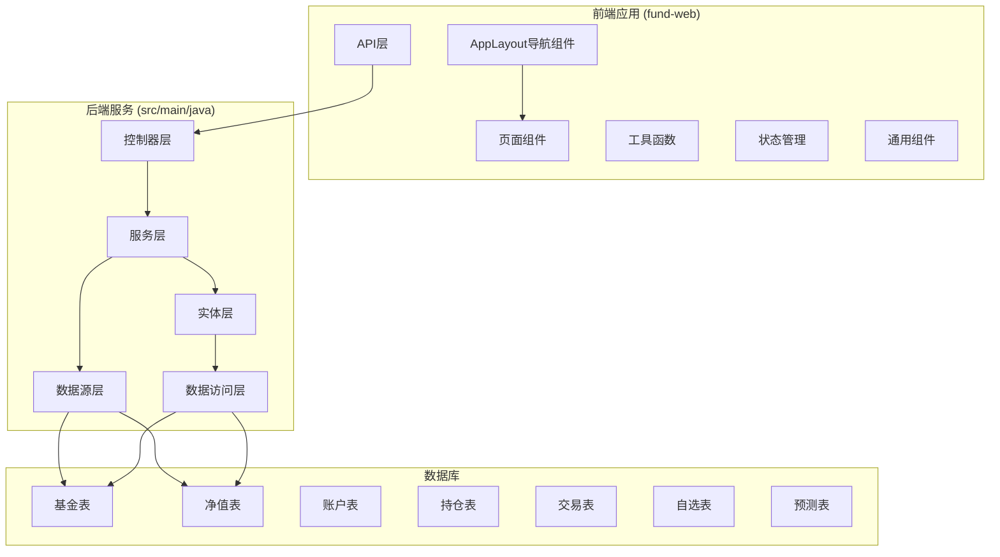
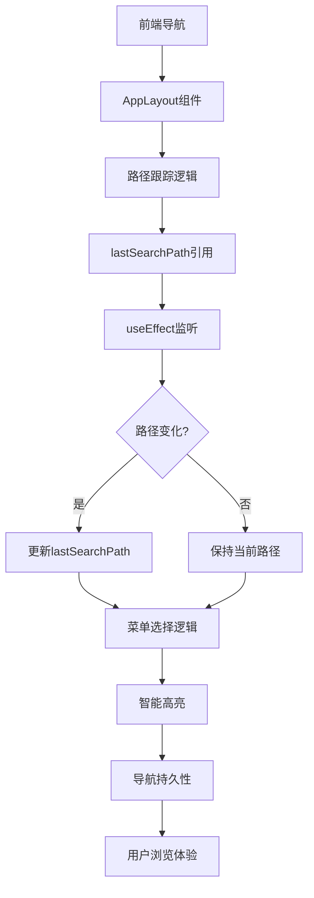
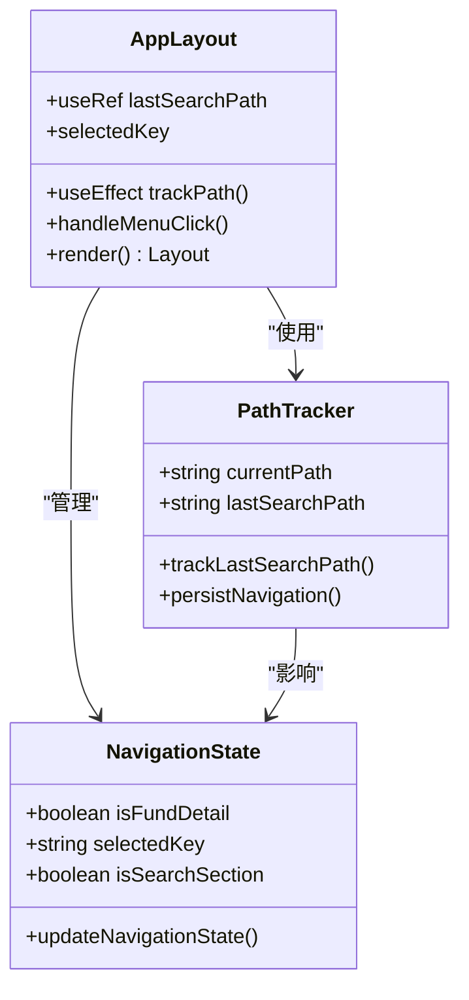
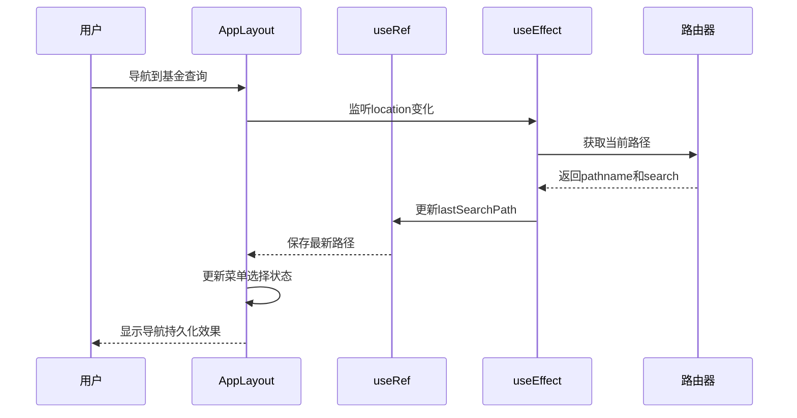
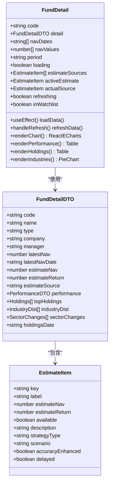
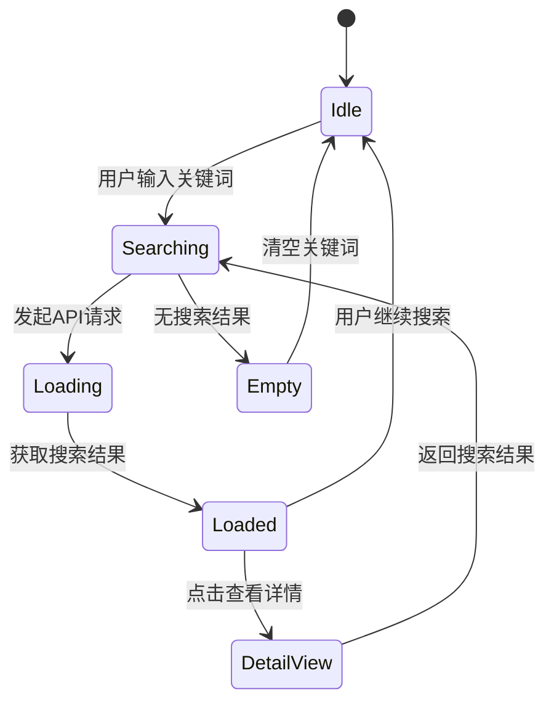
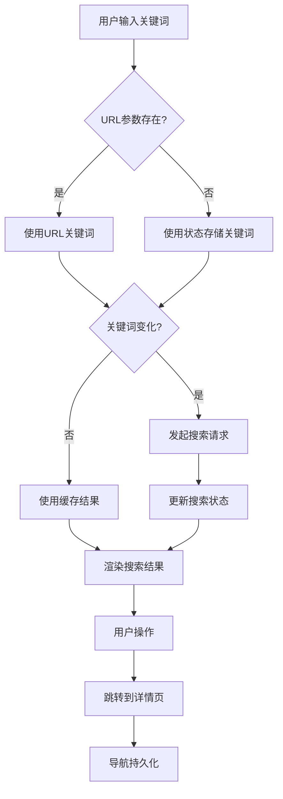
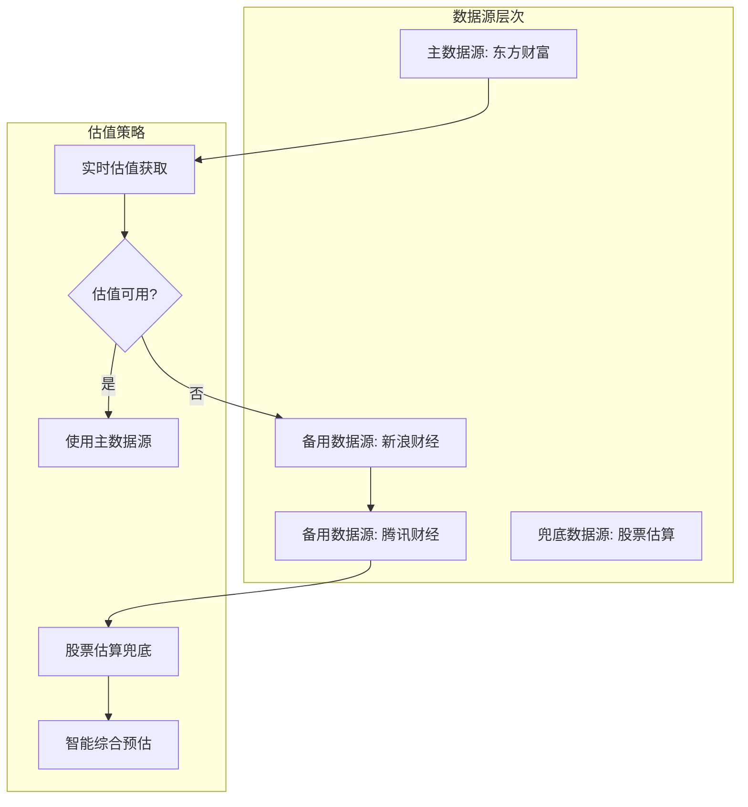
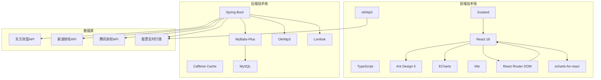
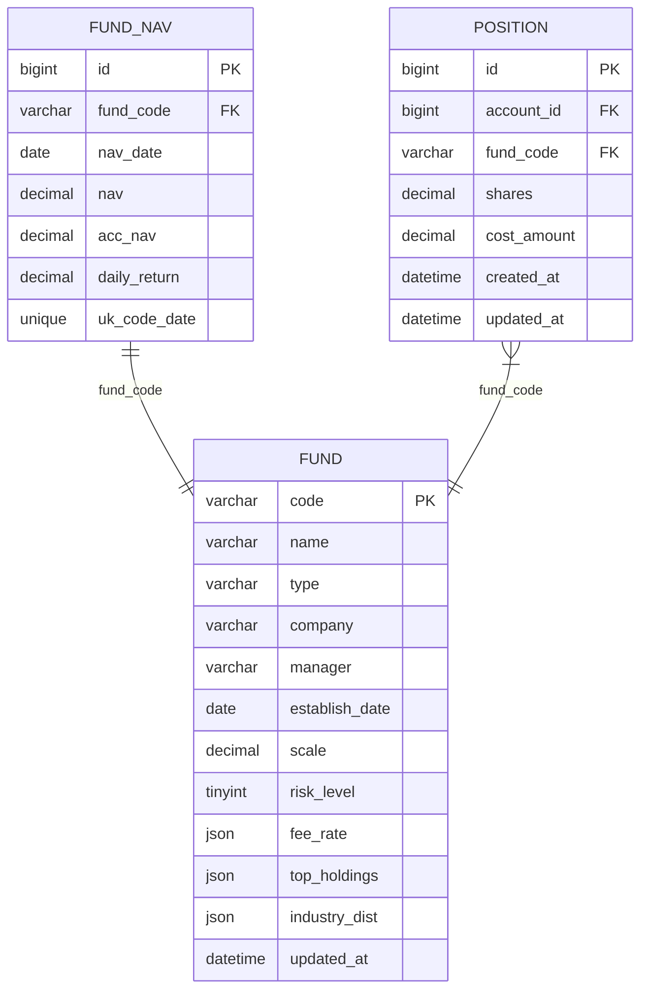

# 基金详情增强

<cite>
**本文档引用的文件**
- [PRD.md](file://PRD.md)
- [application.yml](file://src/main/resources/application.yml)
- [FundDetail.tsx](file://fund-web/src/pages/Fund/FundDetail.tsx)
- [AppLayout.tsx](file://fund-web/src/components/AppLayout.tsx)
- [SearchResult.tsx](file://fund-web/src/pages/Fund/SearchResult.tsx)
- [App.tsx](file://fund-web/src/App.tsx)
- [FundController.java](file://src/main/java/com/qoder/fund/controller/FundController.java)
- [FundService.java](file://src/main/java/com/qoder/fund/service/FundService.java)
- [FundDataAggregator.java](file://src/main/java/com/qoder/fund/datasource/FundDataAggregator.java)
- [EastMoneyDataSource.java](file://src/main/java/com/qoder/fund/datasource/EastMoneyDataSource.java)
- [SinaDataSource.java](file://src/main/java/com/qoder/fund/datasource/SinaDataSource.java)
- [TencentDataSource.java](file://src/main/java/com/qoder/fund/datasource/TencentDataSource.java)
- [StockEstimateDataSource.java](file://src/main/java/com/qoder/fund/datasource/StockEstimateDataSource.java)
- [FundDataSource.java](file://src/main/java/com/qoder/fund/datasource/FundDataSource.java)
- [fund.ts](file://fund-web/src/api/fund.ts)
- [format.ts](file://fund-web/src/utils/format.ts)
- [schema.sql](file://src/main/resources/db/schema.sql)
- [Fund.java](file://src/main/java/com/qoder/fund/entity/Fund.java)
- [FundMapper.java](file://src/main/java/com/qoder/fund/mapper/FundMapper.java)
- [searchStore.ts](file://fund-web/src/store/searchStore.ts)
- [PriceChange.tsx](file://fund-web/src/components/PriceChange.tsx)
- [App.css](file://fund-web/src/App.css)
</cite>

## 更新摘要
**变更内容**
- 基金详情页面进行了重大UI和功能改进，增强了数据展示和用户交互体验
- 新增了智能估值切换功能，支持多数据源估值对比
- 改进了净值走势图表的交互性和可视化效果
- 增强了十大重仓股和行业分布的数据展示
- 优化了导航持久性功能，改善用户浏览体验
- 新增了板块涨跌幅显示功能

## 目录
1. [项目概述](#项目概述)
2. [项目结构](#项目结构)
3. [核心组件](#核心组件)
4. [架构概览](#架构概览)
5. [详细组件分析](#详细组件分析)
6. [依赖分析](#依赖分析)
7. [性能考虑](#性能考虑)
8. [故障排除指南](#故障排除指南)
9. [结论](#结论)

## 项目概述

"基金管家"是一个面向个人投资者的基金管理与查询Web应用，定位为"一站式基金数据聚合管理工具"。该项目专注于基金数据展示、持仓管理、收益分析和投资决策辅助，帮助用户高效管理分散在多个平台的基金投资。

### 产品特性

- **纯工具属性**：不做交易，不接触用户资金，零风险使用
- **Web优先**：无需下载App，浏览器直接使用，跨设备同步
- **数据聚合**：汇总多平台持仓，一屏掌握投资全貌
- **智能分析**：提供专业级收益归因、风险分析和资产配置建议
- **导航持久性**：增强的路径跟踪机制，改善用户浏览体验
- **智能估值**：多数据源估值切换，支持智能综合预估

### 技术架构

系统采用前后端分离架构，后端基于Spring Boot，前端基于React 18 + TypeScript，使用Ant Design 5作为UI组件库，ECharts进行数据可视化。

## 项目结构

**图表来源**
- [AppLayout.tsx:1-127](file://fund-web/src/components/AppLayout.tsx#L1-L127)
- [FundDetail.tsx:1-342](file://fund-web/src/pages/Fund/FundDetail.tsx#L1-L342)
- [FundController.java:1-67](file://src/main/java/com/qoder/fund/controller/FundController.java#L1-L67)
- [FundDataAggregator.java:1-693](file://src/main/java/com/qoder/fund/datasource/FundDataAggregator.java#L1-L693)

**章节来源**
- [PRD.md:1-488](file://PRD.md#L1-L488)
- [application.yml:1-43](file://src/main/resources/application.yml#L1-L43)

## 核心组件

### 前端核心组件

#### 应用布局组件 (AppLayout)
应用布局组件是系统的核心导航组件，现已增强导航持久性功能：

- **路径跟踪机制**：使用useRef和useEffect跟踪最后访问的"基金查询"区域路径
- **智能菜单选择**：根据当前路径智能选择菜单高亮状态
- **导航持久性**：确保用户在基金查询区域内的浏览路径得到保持
- **响应式导航**：支持移动端和桌面端的导航体验

#### 基金详情页面 (FundDetail)
基金详情页面是系统的核心组件，经过重大改进，提供完整的基金信息展示和交互功能：

- **净值走势图表**：使用ECharts展示基金净值历史数据，支持时间段切换
- **智能估值展示**：支持多数据源估值切换，包括实际净值、智能综合预估等
- **历史业绩对比**：展示近1周到成立以来的业绩表现，支持多种时间维度
- **持仓分析**：十大重仓股和行业分布可视化，支持权重条形图展示
- **板块涨跌幅**：显示关联板块今日涨幅，帮助用户了解市场环境
- **快速操作**：添加自选、加持仓、刷新数据等功能，支持实时数据更新
- **数据标签**：显示数据截止日期和延迟提示，确保用户了解数据时效性

#### 基金搜索结果页面 (SearchResult)
基金搜索结果页面提供基金搜索和结果展示功能：

- **实时搜索**：支持按基金名称、代码的实时搜索
- **搜索状态管理**：使用Zustand状态管理搜索关键词和结果
- **结果列表展示**：以列表形式展示搜索结果，支持点击查看详情
- **快速操作**：支持添加自选、添加持仓等快捷操作

#### 通用组件
- **价格变化组件**：统一的价格涨跌显示组件，支持不同尺寸和背景样式
- **骨架屏组件**：优化的加载体验，提升用户感知性能
- **搜索栏组件**：集成的全局搜索功能

#### API接口层
前端通过统一的API接口与后端通信，包括：
- 基金搜索接口
- 基金详情获取接口
- 净值历史查询接口
- 实时估值获取接口
- 数据刷新接口

### 后端核心组件

#### 控制器层
RESTful API控制器提供标准的HTTP接口：
- `GET /api/fund/search` - 基金搜索
- `GET /api/fund/{code}` - 基金详情
- `GET /api/fund/{code}/nav-history` - 净值历史
- `GET /api/fund/{code}/estimates` - 实时估值
- `POST /api/fund/{code}/refresh` - 数据刷新

#### 服务层
FundService作为业务逻辑核心，协调各个数据源：
- 基金搜索处理
- 详情数据聚合
- 净值历史计算
- 多源估值整合
- 数据刷新机制

#### 数据源聚合器
FundDataAggregator实现多数据源聚合和降级策略：
- 主数据源：天天基金API
- 备用数据源：新浪财经、腾讯财经
- 兜底机制：基于重仓股的智能估算
- 缓存策略：多级缓存优化性能

**章节来源**
- [AppLayout.tsx:1-127](file://fund-web/src/components/AppLayout.tsx#L1-L127)
- [FundDetail.tsx:1-342](file://fund-web/src/pages/Fund/FundDetail.tsx#L1-L342)
- [SearchResult.tsx:1-96](file://fund-web/src/pages/Fund/SearchResult.tsx#L1-L96)
- [FundController.java:1-67](file://src/main/java/com/qoder/fund/controller/FundController.java#L1-L67)
- [FundService.java:1-75](file://src/main/java/com/qoder/fund/service/FundService.java#L1-L75)
- [FundDataAggregator.java:1-693](file://src/main/java/com/qoder/fund/datasource/FundDataAggregator.java#L1-L693)

## 架构概览

**图表来源**
- [AppLayout.tsx:26-32](file://fund-web/src/components/AppLayout.tsx#L26-L32)
- [FundController.java:38-44](file://src/main/java/com/qoder/fund/controller/FundController.java#L38-L44)
- [FundService.java:33-35](file://src/main/java/com/qoder/fund/service/FundService.java#L33-L35)
- [FundDataAggregator.java:68-95](file://src/main/java/com/qoder/fund/datasource/FundDataAggregator.java#L68-L95)

### 数据流架构

**图表来源**
- [AppLayout.tsx:24-32](file://fund-web/src/components/AppLayout.tsx#L24-L32)
- [AppLayout.tsx:41-48](file://fund-web/src/components/AppLayout.tsx#L41-L48)

## 详细组件分析

### 应用布局组件分析

#### 导航持久性功能增强

**图表来源**
- [AppLayout.tsx:21-48](file://fund-web/src/components/AppLayout.tsx#L21-L48)
- [AppLayout.tsx:24-32](file://fund-web/src/components/AppLayout.tsx#L24-L32)

#### 路径跟踪机制实现

**图表来源**
- [AppLayout.tsx:26-32](file://fund-web/src/components/AppLayout.tsx#L26-L32)
- [AppLayout.tsx:33-40](file://fund-web/src/components/AppLayout.tsx#L33-L40)

**更新** 增强了AppLayout组件的导航持久性功能，通过useRef和useEffect实现路径跟踪机制，确保用户在"基金查询"区域内的浏览路径得到保持和恢复。

**章节来源**
- [AppLayout.tsx:1-127](file://fund-web/src/components/AppLayout.tsx#L1-L127)

### 基金详情页面组件分析

#### 组件结构重大改进

**图表来源**
- [FundDetail.tsx:21-342](file://fund-web/src/pages/Fund/FundDetail.tsx#L21-L342)
- [fund.ts:9-65](file://fund-web/src/api/fund.ts#L9-L65)

#### 数据获取流程优化

**图表来源**
- [FundDetail.tsx:35-70](file://fund-web/src/pages/Fund/FundDetail.tsx#L35-L70)
- [FundService.java:33-73](file://src/main/java/com/qoder/fund/service/FundService.java#L33-L73)
- [FundDataAggregator.java:68-191](file://src/main/java/com/qoder/fund/datasource/FundDataAggregator.java#L68-L191)

#### UI组件重大改进
基金详情页面经过重大UI改进，主要体现在：

1. **智能估值切换系统**：
   - 支持多数据源估值对比（实际净值、智能综合预估、各数据源估值）
   - 下拉菜单提供数据源切换，支持可用性状态显示
   - 智能预估权重动态调整，基于历史准确度数据优化

2. **净值走势图表增强**：
   - 时间段切换控件（近1月到全部）
   - 平滑曲线和渐变填充效果
   - 响应式设计，适配不同屏幕尺寸

3. **十大重仓股展示优化**：
   - 权重条形图可视化，直观显示持仓比例
   - 股票涨跌情况实时显示
   - 数据截止日期提示，确保数据时效性

4. **行业分布可视化**：
   - 饼图展示行业分布
   - 自适应半径，支持不同数据量
   - 标签格式化，显示百分比

5. **板块涨跌幅功能**：
   - 关联板块今日涨幅显示
   - 动态颜色标识涨跌状态
   - 悬停缩放效果，提升交互体验

**章节来源**
- [FundDetail.tsx:1-342](file://fund-web/src/pages/Fund/FundDetail.tsx#L1-L342)
- [fund.ts:67-83](file://fund-web/src/api/fund.ts#L67-L83)

### 基金搜索结果组件分析

#### 搜索状态管理

**图表来源**
- [SearchResult.tsx:20-32](file://fund-web/src/pages/Fund/SearchResult.tsx#L20-L32)
- [searchStore.ts:10-14](file://fund-web/src/store/searchStore.ts#L10-L14)

#### 搜索流程优化

**图表来源**
- [SearchResult.tsx:11-32](file://fund-web/src/pages/Fund/SearchResult.tsx#L11-L32)
- [AppLayout.tsx:33-40](file://fund-web/src/components/AppLayout.tsx#L33-L40)

**章节来源**
- [SearchResult.tsx:1-96](file://fund-web/src/pages/Fund/SearchResult.tsx#L1-L96)
- [searchStore.ts:1-15](file://fund-web/src/store/searchStore.ts#L1-L15)

### 数据聚合器组件分析

#### 多数据源策略

**图表来源**
- [FundDataAggregator.java:108-128](file://src/main/java/com/qoder/fund/datasource/FundDataAggregator.java#L108-L128)
- [FundDataAggregator.java:196-599](file://src/main/java/com/qoder/fund/datasource/FundDataAggregator.java#L196-L599)

#### 智能估值算法
智能估值通过历史准确度数据选择最佳数据源：

1. **准确度选源**：基于最近3个交易日的预测误差(MAE)选择最佳源
2. **回退机制**：当历史数据不足时使用固定权重加权平均
3. **权重分配**：默认权重为天天基金35%、新浪财经25%、腾讯财经20%、股票估算20%
4. **动态调整**：根据基金类型和重仓股覆盖度调整权重

**章节来源**
- [FundDataAggregator.java:507-599](file://src/main/java/com/qoder/fund/datasource/FundDataAggregator.java#L507-L599)

### 数据源组件分析

#### 东方财富数据源
作为主数据源，提供最全面的基金数据：
- 基金搜索和详情获取
- 净值历史查询
- 实时估值获取
- 基金持仓和行业分析

#### 股票估算数据源
基于重仓股实时行情的智能估算：
- 仅支持A股重仓股
- 通过加权平均计算估算涨幅
- 提供覆盖度比率评估估算质量
- ETF基金支持二级市场实时价格估算

**章节来源**
- [EastMoneyDataSource.java:1-696](file://src/main/java/com/qoder/fund/datasource/EastMoneyDataSource.java#L1-L696)
- [StockEstimateDataSource.java:1-398](file://src/main/java/com/qoder/fund/datasource/StockEstimateDataSource.java#L1-L398)

## 依赖分析

### 技术栈依赖关系

**图表来源**
- [PRD.md:403-425](file://PRD.md#L403-L425)
- [application.yml:1-43](file://src/main/resources/application.yml#L1-L43)

### 数据模型依赖

**图表来源**
- [schema.sql:1-93](file://src/main/resources/db/schema.sql#L1-L93)
- [Fund.java:1-42](file://src/main/java/com/qoder/fund/entity/Fund.java#L1-L42)

**章节来源**
- [PRD.md:347-400](file://PRD.md#L347-L400)
- [schema.sql:1-93](file://src/main/resources/db/schema.sql#L1-L93)

## 性能考虑

### 缓存策略
系统采用多级缓存优化性能：

1. **应用级缓存**：Caffeine缓存，配置最大1000条，过期时间300秒
2. **数据源缓存**：针对搜索、详情、净值历史、实时估值分别缓存
3. **数据库缓存**：热点数据缓存，减少数据库访问压力

### 异步处理
- 基金搜索支持异步响应
- 净值历史查询支持时间段过滤
- 实时估值采用多源并发获取

### 前端优化
- 图表渲染优化，使用ECharts高性能渲染
- 组件懒加载，提升首屏加载速度
- 数据格式化函数优化，减少重复计算
- **导航持久性优化**：通过useRef避免不必要的重渲染
- **智能估值缓存**：多源估值结果缓存，减少重复计算

### 导航持久性性能优化
- 使用useRef存储lastSearchPath，避免状态更新触发重渲染
- useEffect仅在location变化时执行路径跟踪逻辑
- 智能菜单选择逻辑，减少DOM操作次数

### UI组件性能优化
- **虚拟滚动**：大数据表格使用虚拟滚动提升性能
- **懒加载**：图片和复杂图表按需加载
- **防抖处理**：搜索和输入操作使用防抖优化
- **CSS动画**：使用硬件加速的CSS动画替代JavaScript动画

**章节来源**
- [AppLayout.tsx:24-32](file://fund-web/src/components/AppLayout.tsx#L24-L32)
- [FundDetail.tsx:35-70](file://fund-web/src/pages/Fund/FundDetail.tsx#L35-L70)

## 故障排除指南

### 常见问题诊断

#### 数据源连接失败
1. **检查网络连接**：确认能够访问各数据源API
2. **验证API密钥**：部分数据源可能需要认证
3. **查看日志输出**：Spring Boot日志中包含详细的错误信息

#### 缓存问题
1. **清除缓存**：调用刷新接口清除特定缓存
2. **检查缓存配置**：验证Caffeine缓存配置是否正确
3. **监控缓存命中率**：通过日志监控缓存使用情况

#### 数据不一致
1. **强制刷新**：使用刷新接口重新获取数据
2. **检查数据源状态**：确认各数据源API正常运行
3. **验证数据格式**：确保数据转换过程正确

#### 导航持久性问题
1. **检查路径跟踪逻辑**：确认useEffect正确监听location变化
2. **验证lastSearchPath引用**：确保路径正确存储和更新
3. **测试菜单选择逻辑**：确认selectedKey正确计算

#### 智能估值异常
1. **检查数据源可用性**：确认各估值数据源正常工作
2. **验证权重计算**：检查权重调整逻辑
3. **查看历史准确度数据**：确认MAE计算正确

**章节来源**
- [FundDataAggregator.java:158-169](file://src/main/java/com/qoder/fund/datasource/FundDataAggregator.java#L158-L169)
- [application.yml:18-21](file://src/main/resources/application.yml#L18-L21)
- [AppLayout.tsx:26-32](file://fund-web/src/components/AppLayout.tsx#L26-L32)

## 结论

"基金管家"项目通过合理的架构设计和技术选型，实现了功能完整、性能优良的基金数据管理应用。系统经过重大改进，主要优势包括：

1. **多数据源聚合**：通过主备数据源和智能估算机制，确保数据的准确性和可用性
2. **用户体验优化**：丰富的可视化图表和直观的操作界面，经过重大UI改进
3. **性能保障**：多级缓存和异步处理机制，保证系统的响应速度
4. **可扩展性**：模块化的架构设计，便于后续功能扩展
5. **导航持久性增强**：新增的路径跟踪机制显著改善了用户在"基金查询"区域内的浏览体验
6. **智能估值系统**：多数据源估值切换和智能综合预估，提供更准确的投资参考

**更新亮点**：
- **基金详情页面重大改进**：新增智能估值切换功能，支持多数据源对比
- **净值走势图表优化**：增强的时间段切换和可视化效果
- **十大重仓股展示**：权重条形图和涨跌状态显示
- **行业分布可视化**：饼图展示和标签格式化
- **板块涨跌幅功能**：关联板块实时涨跌显示
- **导航持久性增强**：通过lastSearchPath引用和useEffect路径跟踪，实现了智能的导航状态保持

项目的实施为个人投资者提供了专业的基金数据管理和分析工具，有助于提高投资决策的质量和效率。通过持续的功能迭代和性能优化，系统将更好地服务于目标用户群体。