# 基金详情增强

<cite>
**本文档引用的文件**
- [PRD.md](file://PRD.md)
- [application.yml](file://src/main/resources/application.yml)
- [FundDetail.tsx](file://fund-web/src/pages/Fund/FundDetail.tsx)
- [AppLayout.tsx](file://fund-web/src/components/AppLayout.tsx)
- [SearchResult.tsx](file://fund-web/src/pages/Fund/SearchResult.tsx)
- [App.tsx](file://fund-web/src/App.tsx)
- [FundController.java](file://src/main/java/com/qoder/fund/controller/FundController.java)
- [FundService.java](file://src/main/java/com/qoder/fund/service/FundService.java)
- [FundDataAggregator.java](file://src/main/java/com/qoder/fund/datasource/FundDataAggregator.java)
- [EastMoneyDataSource.java](file://src/main/java/com/qoder/fund/datasource/EastMoneyDataSource.java)
- [SinaDataSource.java](file://src/main/java/com/qoder/fund/datasource/SinaDataSource.java)
- [TencentDataSource.java](file://src/main/java/com/qoder/fund/datasource/TencentDataSource.java)
- [StockEstimateDataSource.java](file://src/main/java/com/qoder/fund/datasource/StockEstimateDataSource.java)
- [FundDataSource.java](file://src/main/java/com/qoder/fund/datasource/FundDataSource.java)
- [fund.ts](file://fund-web/src/api/fund.ts)
- [format.ts](file://fund-web/src/utils/format.ts)
- [schema.sql](file://src/main/resources/db/schema.sql)
- [Fund.java](file://src/main/java/com/qoder/fund/entity/Fund.java)
- [FundMapper.java](file://src/main/java/com/qoder/fund/mapper/FundMapper.java)
- [searchStore.ts](file://fund-web/src/store/searchStore.ts)
</cite>

## 更新摘要
**变更内容**
- 新增投资组合披露日期提取和显示功能，支持年度报告和季度报告日期解析
- 在FundDetail组件中添加橙色标签显示季度报告披露日期
- 提供关于报告滞后风险的工具提示说明
- 增强了数据源解析能力，支持多种格式的披露日期识别

## 目录
1. [项目概述](#项目概述)
2. [项目结构](#项目结构)
3. [核心组件](#核心组件)
4. [架构概览](#架构概览)
5. [详细组件分析](#详细组件分析)
6. [依赖分析](#依赖分析)
7. [性能考虑](#性能考虑)
8. [故障排除指南](#故障排除指南)
9. [结论](#结论)

## 项目概述

"基金管家"是一个面向个人投资者的基金管理与查询Web应用，定位为"一站式基金数据聚合管理工具"。该项目专注于基金数据展示、持仓管理、收益分析和投资决策辅助，帮助用户高效管理分散在多个平台的基金投资。

### 产品特性

- **纯工具属性**：不做交易，不接触用户资金，零风险使用
- **Web优先**：无需下载App，浏览器直接使用，跨设备同步
- **数据聚合**：汇总多平台持仓，一屏掌握投资全貌
- **智能分析**：提供专业级收益归因、风险分析和资产配置建议
- **导航持久性**：增强的路径跟踪机制，改善用户浏览体验
- **披露日期追踪**：自动提取并显示基金投资组合披露日期，提供数据时效性提醒

### 技术架构

系统采用前后端分离架构，后端基于Spring Boot，前端基于React 18 + TypeScript，使用Ant Design 5作为UI组件库，ECharts进行数据可视化。

## 项目结构

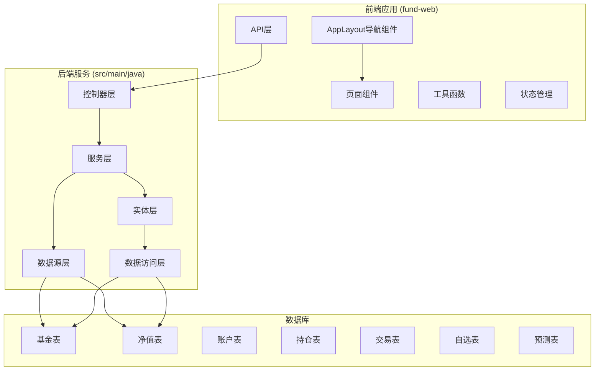

**图表来源**
- [AppLayout.tsx:1-114](file://fund-web/src/components/AppLayout.tsx#L1-L114)
- [FundDetail.tsx:1-342](file://fund-web/src/pages/Fund/FundDetail.tsx#L1-L342)
- [FundController.java:1-62](file://src/main/java/com/qoder/fund/controller/FundController.java#L1-L62)
- [FundDataAggregator.java:1-686](file://src/main/java/com/qoder/fund/datasource/FundDataAggregator.java#L1-L686)

**章节来源**
- [PRD.md:1-488](file://PRD.md#L1-L488)
- [application.yml:1-43](file://src/main/resources/application.yml#L1-L43)

## 核心组件

### 前端核心组件

#### 应用布局组件 (AppLayout)
应用布局组件是系统的核心导航组件，现已增强导航持久性功能：

- **路径跟踪机制**：使用useRef和useEffect跟踪最后访问的"基金查询"区域路径
- **智能菜单选择**：根据当前路径智能选择菜单高亮状态
- **导航持久性**：确保用户在基金查询区域内的浏览路径得到保持
- **响应式导航**：支持移动端和桌面端的导航体验

#### 基金详情页面 (FundDetail)
基金详情页面是系统的核心组件，提供完整的基金信息展示和交互功能：

- **净值走势图表**：使用ECharts展示基金净值历史数据
- **实时估值展示**：支持多数据源估值切换
- **历史业绩对比**：展示近1周到成立以来的业绩表现
- **持仓分析**：十大重仓股和行业分布可视化
- **披露日期追踪**：自动提取并显示季度/年度报告披露日期，提供橙色标签和工具提示说明
- **快速操作**：添加自选、加持仓、刷新数据等功能

#### 基金搜索结果页面 (SearchResult)
基金搜索结果页面提供基金搜索和结果展示功能：

- **实时搜索**：支持按基金名称、代码的实时搜索
- **搜索状态管理**：使用Zustand状态管理搜索关键词和结果
- **结果列表展示**：以列表形式展示搜索结果，支持点击查看详情
- **快速操作**：支持添加自选、添加持仓等快捷操作

#### API接口层
前端通过统一的API接口与后端通信，包括：
- 基金搜索接口
- 基金详情获取接口
- 净值历史查询接口
- 实时估值获取接口
- 数据刷新接口

### 后端核心组件

#### 控制器层
RESTful API控制器提供标准的HTTP接口：
- `GET /api/fund/search` - 基金搜索
- `GET /api/fund/{code}` - 基金详情
- `GET /api/fund/{code}/nav-history` - 净值历史
- `GET /api/fund/{code}/estimates` - 实时估值
- `POST /api/fund/{code}/refresh` - 数据刷新

#### 服务层
FundService作为业务逻辑核心，协调各个数据源：
- 基金搜索处理
- 详情数据聚合
- 净值历史计算
- 多源估值整合
- 数据刷新机制

#### 数据源聚合器
FundDataAggregator实现多数据源聚合和降级策略：
- 主数据源：天天基金API
- 备用数据源：新浪财经、腾讯财经
- 兜底机制：基于重仓股的智能估算
- 缓存策略：多级缓存优化性能
- **披露日期解析**：支持年度报告和季度报告日期提取

**章节来源**
- [AppLayout.tsx:1-114](file://fund-web/src/components/AppLayout.tsx#L1-L114)
- [FundDetail.tsx:1-342](file://fund-web/src/pages/Fund/FundDetail.tsx#L1-L342)
- [SearchResult.tsx:1-96](file://fund-web/src/pages/Fund/SearchResult.tsx#L1-L96)
- [FundController.java:1-62](file://src/main/java/com/qoder/fund/controller/FundController.java#L1-L62)
- [FundService.java:1-75](file://src/main/java/com/qoder/fund/service/FundService.java#L1-L75)
- [FundDataAggregator.java:1-686](file://src/main/java/com/qoder/fund/datasource/FundDataAggregator.java#L1-L686)

## 架构概览

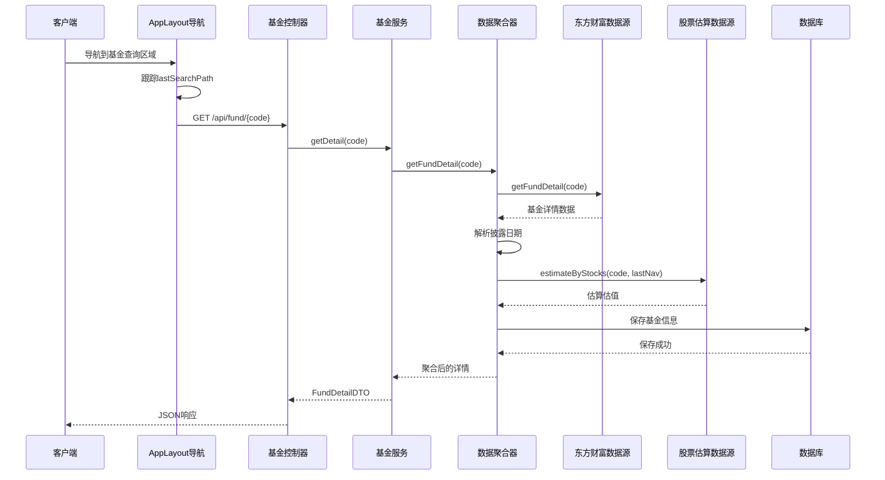

**图表来源**
- [AppLayout.tsx:26-32](file://fund-web/src/components/AppLayout.tsx#L26-L32)
- [FundController.java:32-40](file://src/main/java/com/qoder/fund/controller/FundController.java#L32-L40)
- [FundService.java:33-35](file://src/main/java/com/qoder/fund/service/FundService.java#L33-L35)
- [FundDataAggregator.java:57-73](file://src/main/java/com/qoder/fund/datasource/FundDataAggregator.java#L57-L73)

### 数据流架构

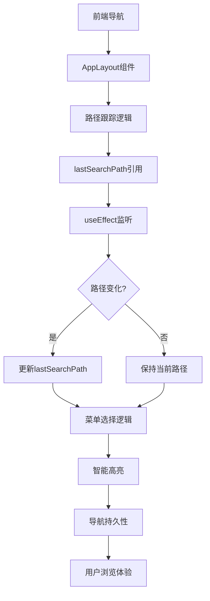

**图表来源**
- [AppLayout.tsx:24-32](file://fund-web/src/components/AppLayout.tsx#L24-L32)
- [AppLayout.tsx:42-48](file://fund-web/src/components/AppLayout.tsx#L42-L48)

## 详细组件分析

### 应用布局组件分析

#### 导航持久性功能增强
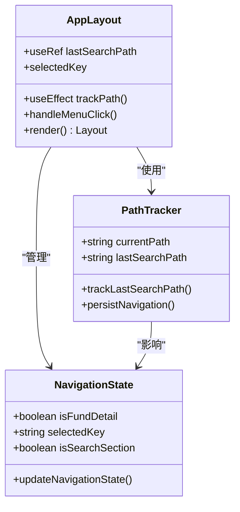

**图表来源**
- [AppLayout.tsx:21-48](file://fund-web/src/components/AppLayout.tsx#L21-L48)
- [AppLayout.tsx:24-32](file://fund-web/src/components/AppLayout.tsx#L24-L32)

#### 路径跟踪机制实现
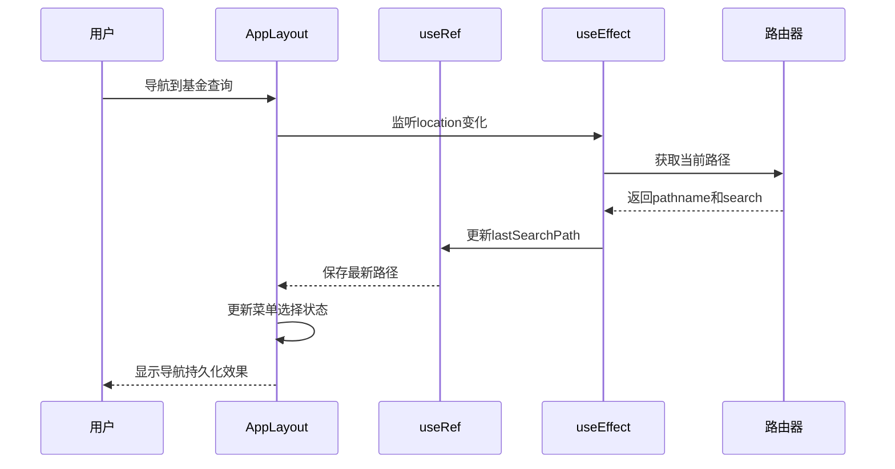

**图表来源**
- [AppLayout.tsx:26-32](file://fund-web/src/components/AppLayout.tsx#L26-L32)
- [AppLayout.tsx:34-40](file://fund-web/src/components/AppLayout.tsx#L34-L40)

**更新** 增强了AppLayout组件的导航持久性功能，通过useRef和useEffect实现路径跟踪机制，确保用户在"基金查询"区域内的浏览路径得到保持和恢复。

**章节来源**
- [AppLayout.tsx:1-114](file://fund-web/src/components/AppLayout.tsx#L1-L114)

### 基金详情页面组件分析

#### 组件结构
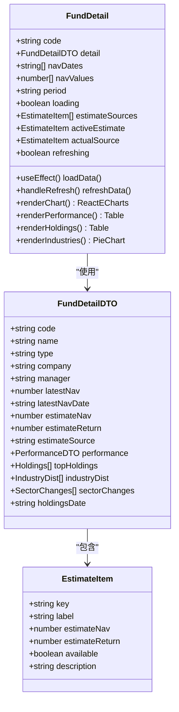

**图表来源**
- [FundDetail.tsx:20-31](file://fund-web/src/pages/Fund/FundDetail.tsx#L20-L31)
- [fund.ts:9-36](file://fund-web/src/api/fund.ts#L9-L36)

#### 数据获取流程
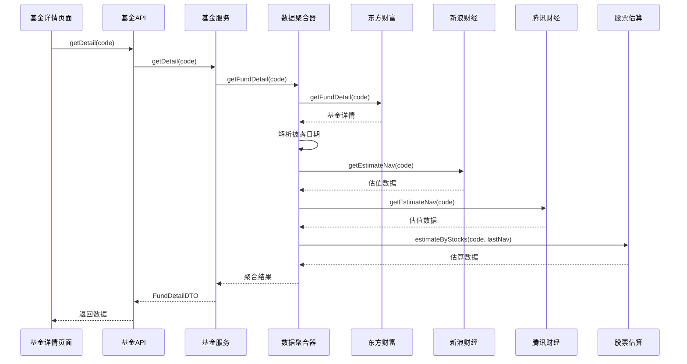

**图表来源**
- [FundDetail.tsx:33-66](file://fund-web/src/pages/Fund/FundDetail.tsx#L33-L66)
- [FundService.java:33-35](file://src/main/java/com/qoder/fund/service/FundService.java#L33-L35)
- [FundDataAggregator.java:174-281](file://src/main/java/com/qoder/fund/datasource/FundDataAggregator.java#L174-L281)

#### 披露日期追踪功能
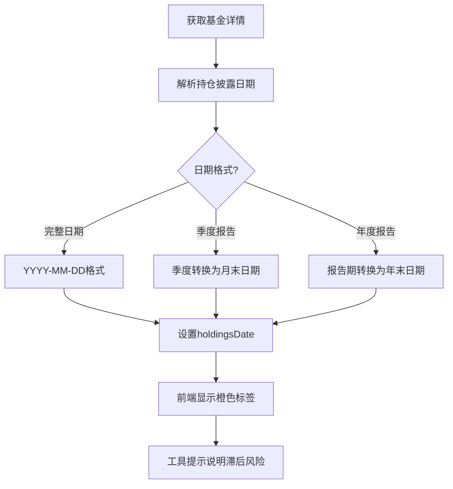

**图表来源**
- [EastMoneyDataSource.java:511-538](file://src/main/java/com/qoder/fund/datasource/EastMoneyDataSource.java#L511-L538)
- [FundDetail.tsx:280-286](file://fund-web/src/pages/Fund/FundDetail.tsx#L280-L286)

**更新** 新增了投资组合披露日期提取和显示功能，支持年度报告和季度报告日期解析，并在前端添加了橙色标签和工具提示说明。

**章节来源**
- [FundDetail.tsx:1-342](file://fund-web/src/pages/Fund/FundDetail.tsx#L1-L342)
- [fund.ts:61-76](file://fund-web/src/api/fund.ts#L61-L76)

### 基金搜索结果组件分析

#### 搜索状态管理
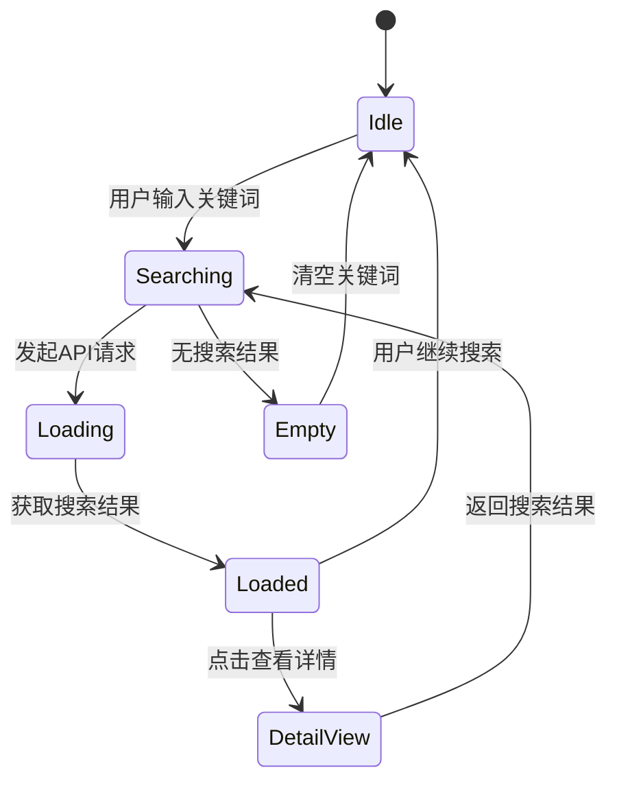

**图表来源**
- [SearchResult.tsx:20-32](file://fund-web/src/pages/Fund/SearchResult.tsx#L20-L32)
- [searchStore.ts:10-14](file://fund-web/src/store/searchStore.ts#L10-L14)

#### 搜索流程优化
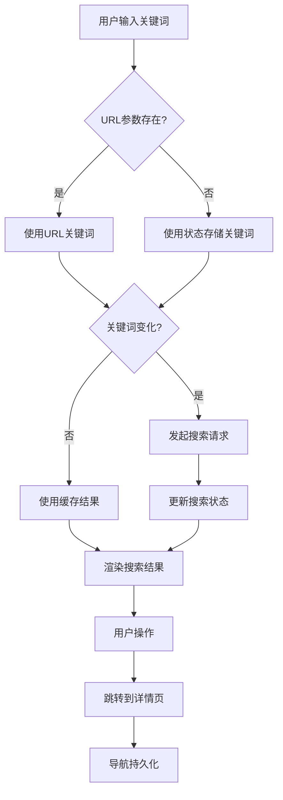

**图表来源**
- [SearchResult.tsx:11-32](file://fund-web/src/pages/Fund/SearchResult.tsx#L11-L32)
- [AppLayout.tsx:34-40](file://fund-web/src/components/AppLayout.tsx#L34-L40)

**章节来源**
- [SearchResult.tsx:1-96](file://fund-web/src/pages/Fund/SearchResult.tsx#L1-L96)
- [searchStore.ts:1-15](file://fund-web/src/store/searchStore.ts#L1-L15)

### 数据聚合器组件分析

#### 多数据源策略
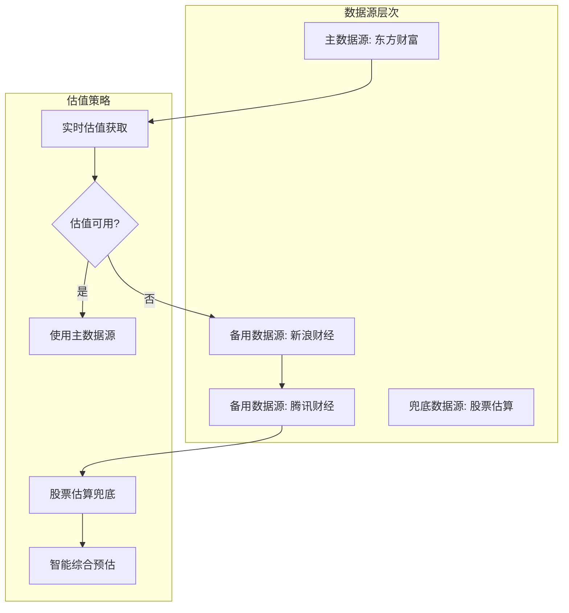

**图表来源**
- [FundDataAggregator.java:86-106](file://src/main/java/com/qoder/fund/datasource/FundDataAggregator.java#L86-L106)
- [FundDataAggregator.java:174-281](file://src/main/java/com/qoder/fund/datasource/FundDataAggregator.java#L174-L281)

#### 智能估值算法
智能估值通过历史准确度数据选择最佳数据源：

1. **准确度选源**：基于最近3个交易日的预测误差(MAE)选择最佳源
2. **回退机制**：当历史数据不足时使用固定权重加权平均
3. **权重分配**：默认权重为天天基金35%、新浪财经25%、腾讯财经20%、股票估算20%

#### 披露日期解析增强
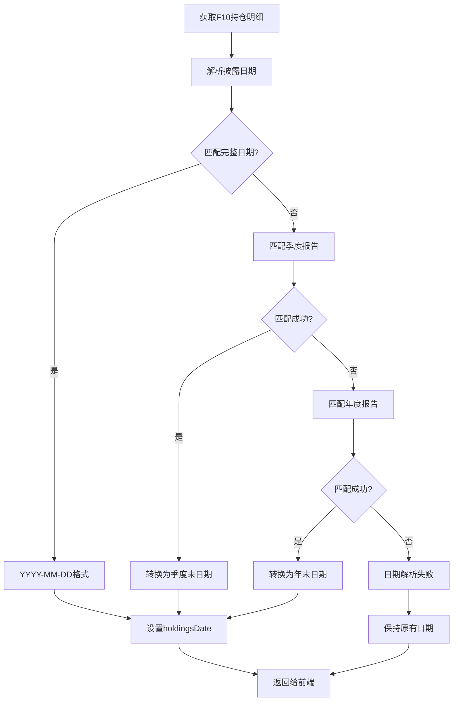

**图表来源**
- [EastMoneyDataSource.java:511-538](file://src/main/java/com/qoder/fund/datasource/EastMoneyDataSource.java#L511-L538)

**更新** 增强了数据源解析能力，支持多种格式的披露日期识别，包括年度报告和季度报告格式。

**章节来源**
- [FundDataAggregator.java:427-486](file://src/main/java/com/qoder/fund/datasource/FundDataAggregator.java#L427-L486)

### 数据源组件分析

#### 东方财富数据源
作为主数据源，提供最全面的基金数据：
- 基金搜索和详情获取
- 净值历史查询
- 实时估值获取
- 基金持仓和行业分析
- **披露日期解析**：支持年度报告和季度报告日期提取

#### 股票估算数据源
基于重仓股实时行情的智能估算：
- 仅支持A股重仓股
- 通过加权平均计算估算涨幅
- 提供覆盖度比率评估估算质量

**章节来源**
- [EastMoneyDataSource.java:1-923](file://src/main/java/com/qoder/fund/datasource/EastMoneyDataSource.java#L1-L923)
- [StockEstimateDataSource.java:1-210](file://src/main/java/com/qoder/fund/datasource/StockEstimateDataSource.java#L1-L210)

## 依赖分析

### 技术栈依赖关系

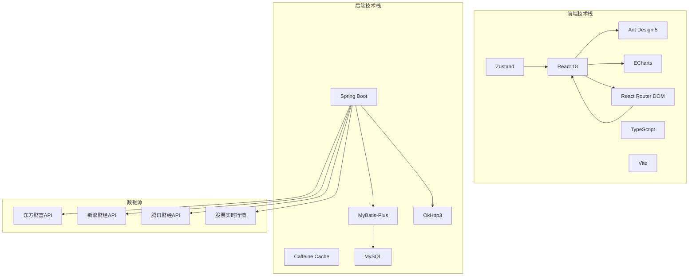

**图表来源**
- [PRD.md:403-425](file://PRD.md#L403-L425)
- [application.yml:1-43](file://src/main/resources/application.yml#L1-L43)

### 数据模型依赖

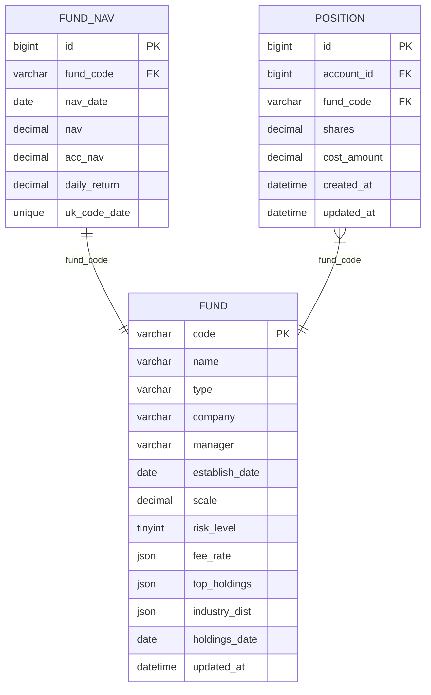

**图表来源**
- [schema.sql:1-93](file://src/main/resources/db/schema.sql#L1-L93)
- [Fund.java:1-42](file://src/main/java/com/qoder/fund/entity/Fund.java#L1-L42)

**更新** 新增了holdings_date字段，用于存储基金投资组合披露日期。

**章节来源**
- [PRD.md:347-400](file://PRD.md#L347-L400)
- [schema.sql:1-93](file://src/main/resources/db/schema.sql#L1-L93)

## 性能考虑

### 缓存策略
系统采用多级缓存优化性能：

1. **应用级缓存**：Caffeine缓存，配置最大1000条，过期时间300秒
2. **数据源缓存**：针对搜索、详情、净值历史、实时估值分别缓存
3. **数据库缓存**：热点数据缓存，减少数据库访问压力

### 异步处理
- 基金搜索支持异步响应
- 净值历史查询支持时间段过滤
- 实时估值采用多源并发获取

### 前端优化
- 图表渲染优化，使用ECharts高性能渲染
- 组件懒加载，提升首屏加载速度
- 数据格式化函数优化，减少重复计算
- **导航持久性优化**：通过useRef避免不必要的重渲染
- **披露日期显示优化**：条件渲染避免不必要的DOM更新

### 导航持久性性能优化
- 使用useRef存储lastSearchPath，避免状态更新触发重渲染
- useEffect仅在location变化时执行路径跟踪逻辑
- 智能菜单选择逻辑，减少DOM操作次数

**更新** 新增了披露日期追踪功能的性能优化，包括条件渲染和工具提示的延迟加载。

**章节来源**
- [AppLayout.tsx:24-32](file://fund-web/src/components/AppLayout.tsx#L24-L32)

## 故障排除指南

### 常见问题诊断

#### 数据源连接失败
1. **检查网络连接**：确认能够访问各数据源API
2. **验证API密钥**：部分数据源可能需要认证
3. **查看日志输出**：Spring Boot日志中包含详细的错误信息

#### 缓存问题
1. **清除缓存**：调用刷新接口清除特定缓存
2. **检查缓存配置**：验证Caffeine缓存配置是否正确
3. **监控缓存命中率**：通过日志监控缓存使用情况

#### 数据不一致
1. **强制刷新**：使用刷新接口重新获取数据
2. **检查数据源状态**：确认各数据源API正常运行
3. **验证数据格式**：确保数据转换过程正确

#### 导航持久性问题
1. **检查路径跟踪逻辑**：确认useEffect正确监听location变化
2. **验证lastSearchPath引用**：确保路径正确存储和更新
3. **测试菜单选择逻辑**：确认selectedKey正确计算

#### 披露日期解析问题
1. **检查HTML解析**：确认F10页面格式是否发生变化
2. **验证正则表达式**：确保日期格式匹配规则正确
3. **测试季度转换逻辑**：确认季度到月末日期的转换准确
4. **检查数据库回退**：确认holdingsDate字段的数据库存储

**更新** 新增了披露日期解析问题的故障排除指南。

**章节来源**
- [FundDataAggregator.java:158-169](file://src/main/java/com/qoder/fund/datasource/FundDataAggregator.java#L158-L169)
- [application.yml:18-21](file://src/main/resources/application.yml#L18-L21)
- [AppLayout.tsx:26-32](file://fund-web/src/components/AppLayout.tsx#L26-L32)

## 结论

"基金管家"项目通过合理的架构设计和技术选型，实现了功能完整、性能优良的基金数据管理应用。系统的主要优势包括：

1. **多数据源聚合**：通过主备数据源和智能估算机制，确保数据的准确性和可用性
2. **用户体验优化**：丰富的可视化图表和直观的操作界面
3. **性能保障**：多级缓存和异步处理机制，保证系统的响应速度
4. **可扩展性**：模块化的架构设计，便于后续功能扩展
5. **导航持久性增强**：新增的路径跟踪机制显著改善了用户在"基金查询"区域内的浏览体验
6. **披露日期追踪**：自动提取并显示基金投资组合披露日期，提供数据时效性提醒

**更新亮点**：
- **披露日期追踪功能**：新增投资组合披露日期提取和显示功能，支持年度报告和季度报告格式
- **前端展示增强**：在FundDetail组件中添加橙色标签显示季度报告披露日期，并提供关于报告滞后风险的工具提示说明
- **数据源解析优化**：增强了数据源解析能力，支持多种格式的披露日期识别
- **用户风险提示**：通过工具提示向用户提供报告滞后风险的明确说明

项目的实施为个人投资者提供了专业的基金数据管理和分析工具，有助于提高投资决策的质量和效率。通过持续的功能迭代和性能优化，系统将更好地服务于目标用户群体。