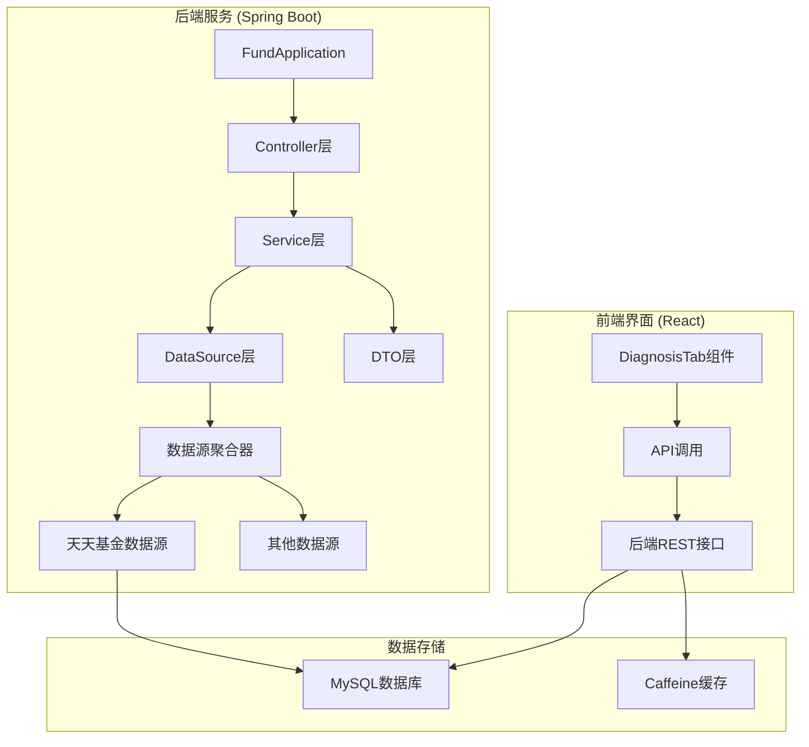
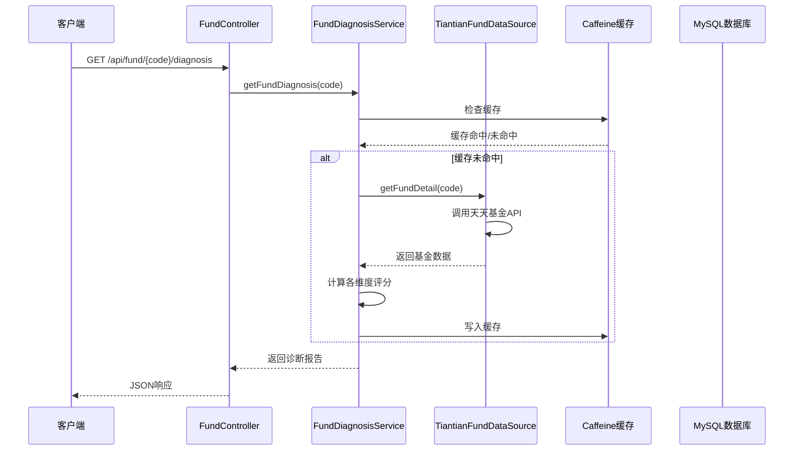
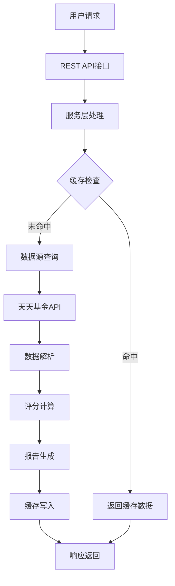
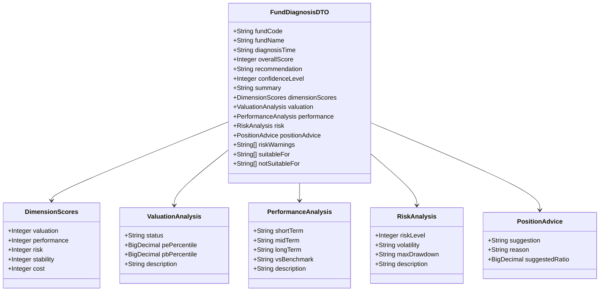
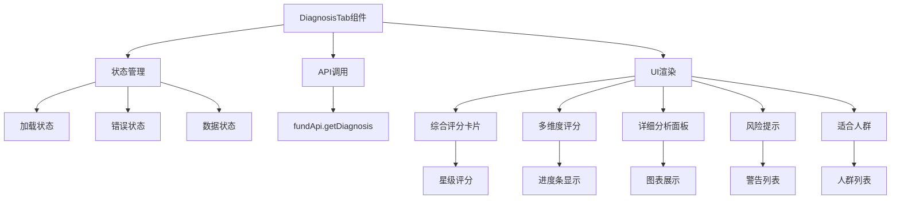
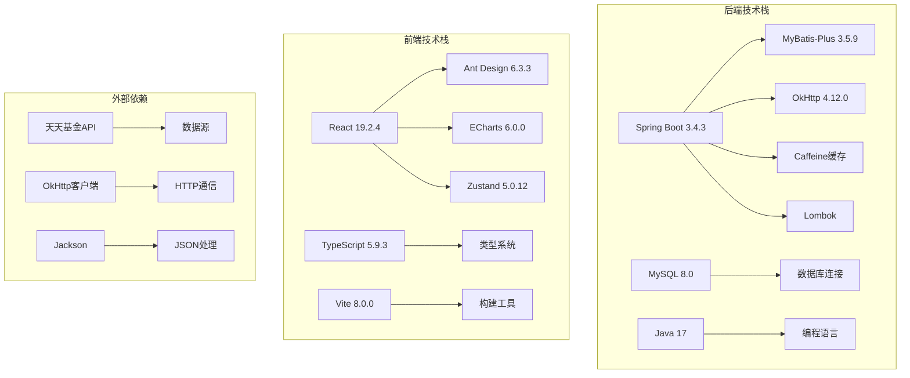
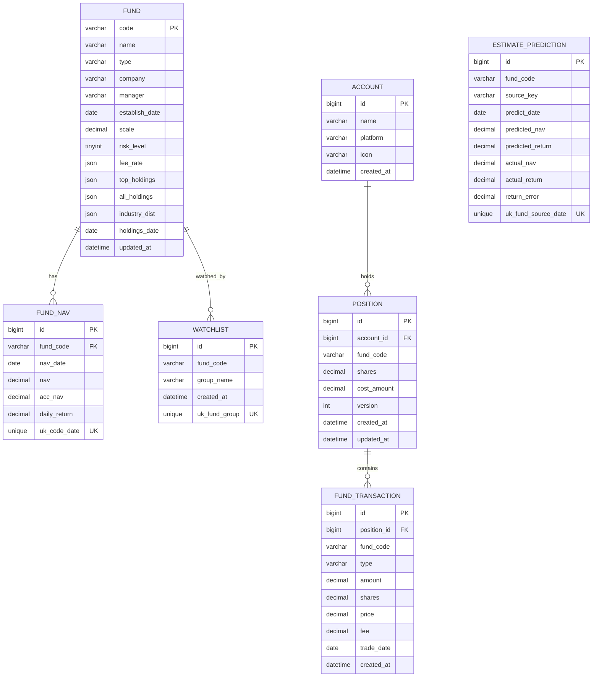

# 基金诊断服务

<cite>
**本文档引用的文件**
- [FundApplication.java](file://src/main/java/com/qoder/fund/FundApplication.java)
- [FundDiagnosisService.java](file://src/main/java/com/qoder/fund/service/FundDiagnosisService.java)
- [FundDiagnosisDTO.java](file://src/main/java/com/qoder/fund/dto/FundDiagnosisDTO.java)
- [FundController.java](file://src/main/java/com/qoder/fund/controller/FundController.java)
- [TiantianFundDataSource.java](file://src/main/java/com/qoder/fund/datasource/TiantianFundDataSource.java)
- [FundDataAggregator.java](file://src/main/java/com/qoder/fund/datasource/FundDataAggregator.java)
- [application.yml](file://src/main/resources/application.yml)
- [schema.sql](file://src/main/resources/db/schema.sql)
- [README.md](file://README.md)
- [PRD.md](file://PRD.md)
- [DiagnosisTab.tsx](file://fund-web/src/pages/Fund/DiagnosisTab.tsx)
</cite>

## 目录
1. [简介](#简介)
2. [项目结构](#项目结构)
3. [核心组件](#核心组件)
4. [架构概览](#架构概览)
5. [详细组件分析](#详细组件分析)
6. [依赖关系分析](#依赖关系分析)
7. [性能考量](#性能考量)
8. [故障排查指南](#故障排查指南)
9. [结论](#结论)

## 简介

基金诊断服务是「基金管家」系统中的核心分析模块，基于规则引擎为用户提供专业的基金投资决策辅助。该服务通过整合多数据源的基金数据，运用科学的评分体系和风险评估模型，为每只基金生成全面的诊断报告。

### 核心功能特性
- **多维度评分体系**：涵盖业绩表现、风险控制、估值合理性、稳定性、费率成本五个维度
- **智能诊断报告**：提供综合评分、投资建议、风险提示、适合人群等全方位分析
- **实时数据聚合**：支持多数据源实时估值，确保诊断结果的时效性
- **缓存优化**：采用多级缓存策略，提升系统性能和用户体验

## 项目结构



**图表来源**
- [FundApplication.java:1-16](file://src/main/java/com/qoder/fund/FundApplication.java#L1-L16)
- [FundDiagnosisService.java:1-587](file://src/main/java/com/qoder/fund/service/FundDiagnosisService.java#L1-L587)
- [DiagnosisTab.tsx:1-306](file://fund-web/src/pages/Fund/DiagnosisTab.tsx#L1-L306)

**章节来源**
- [README.md:192-223](file://README.md#L192-L223)
- [PRD.md:57-111](file://PRD.md#L57-L111)

## 核心组件

### 服务层组件

#### FundDiagnosisService
基金诊断服务的核心实现，负责：
- **数据获取**：从天天基金数据源获取基金详细信息
- **评分计算**：基于权重规则计算各维度评分
- **报告生成**：构建完整的诊断报告DTO
- **缓存管理**：提供1小时缓存支持

#### FundDataAggregator
数据聚合器负责：
- **多源数据获取**：整合多个数据源的基金信息
- **降级策略**：当主数据源不可用时自动切换备用源
- **缓存管理**：统一管理各类数据的缓存策略
- **估值计算**：提供智能综合估值计算

#### TiantianFundDataSource
天天基金数据源实现：
- **API调用**：封装天天基金官方API接口
- **数据解析**：解析JSON响应并转换为内部数据结构
- **错误处理**：完善的异常处理和降级机制

**章节来源**
- [FundDiagnosisService.java:24-70](file://src/main/java/com/qoder/fund/service/FundDiagnosisService.java#L24-L70)
- [FundDataAggregator.java:40-101](file://src/main/java/com/qoder/fund/datasource/FundDataAggregator.java#L40-L101)
- [TiantianFundDataSource.java:20-71](file://src/main/java/com/qoder/fund/datasource/TiantianFundDataSource.java#L20-L71)

## 架构概览



**图表来源**
- [FundController.java:24-79](file://src/main/java/com/qoder/fund/controller/FundController.java#L24-L79)
- [FundDiagnosisService.java:45-70](file://src/main/java/com/qoder/fund/service/FundDiagnosisService.java#L45-L70)
- [TiantianFundDataSource.java:41-71](file://src/main/java/com/qoder/fund/datasource/TiantianFundDataSource.java#L41-L71)

### 数据流架构



**图表来源**
- [FundDiagnosisService.java:75-144](file://src/main/java/com/qoder/fund/service/FundDiagnosisService.java#L75-L144)
- [application.yml:29-36](file://src/main/resources/application.yml#L29-L36)

## 详细组件分析

### 评分体系设计

#### 权重分配策略
系统采用科学的权重分配方案：

| 维度 | 权重 | 计算方法 | 评分范围 |
|------|------|----------|----------|
| 业绩表现 | 40% | 1年(50%) + 3年(30%) + 6月(20%) | 0-100分 |
| 风险控制 | 25% | 风险等级 + 最大回撤 + 夏普比率 | 20-95分 |
| 估值合理性 | 20% | 近期表现反映估值状态 | 65-90分 |
| 稳定性 | 10% | 基金规模 + 成立年限 | 50-95分 |
| 费率成本 | 5% | 管理费率越低越好 | 55-95分 |

#### 综合评分计算流程

```mermaid
flowchart TD
A[获取各维度数据] --> B[计算单项评分]
B --> C[加权求和]
C --> D[综合评分 = Σ(单项评分 × 权重)]
D --> E[生成投资建议]
E --> F[计算信心等级]
F --> G[生成诊断摘要]
```

**图表来源**
- [FundDiagnosisService.java:95-106](file://src/main/java/com/qoder/fund/service/FundDiagnosisService.java#L95-L106)

**章节来源**
- [FundDiagnosisService.java:28-100](file://src/main/java/com/qoder/fund/service/FundDiagnosisService.java#L28-L100)

### 数据模型设计

#### FundDiagnosisDTO 数据结构



**图表来源**
- [FundDiagnosisDTO.java:11-129](file://src/main/java/com/qoder/fund/dto/FundDiagnosisDTO.java#L11-L129)

**章节来源**
- [FundDiagnosisDTO.java:12-87](file://src/main/java/com/qoder/fund/dto/FundDiagnosisDTO.java#L12-L87)

### 前端集成实现

#### DiagnosisTab 组件架构



**图表来源**
- [DiagnosisTab.tsx:13-306](file://fund-web/src/pages/Fund/DiagnosisTab.tsx#L13-L306)

**章节来源**
- [DiagnosisTab.tsx:18-31](file://fund-web/src/pages/Fund/DiagnosisTab.tsx#L18-L31)
- [DiagnosisTab.tsx:93-302](file://fund-web/src/pages/Fund/DiagnosisTab.tsx#L93-L302)

## 依赖关系分析

### 技术栈依赖



**图表来源**
- [README.md:67-94](file://README.md#L67-L94)
- [application.yml:1-68](file://src/main/resources/application.yml#L1-L68)

### 数据库设计



**图表来源**
- [schema.sql:1-96](file://src/main/resources/db/schema.sql#L1-L96)

**章节来源**
- [schema.sql:1-96](file://src/main/resources/db/schema.sql#L1-L96)

## 性能考量

### 缓存策略

系统采用多级缓存架构：

1. **本地缓存 (Caffeine)**：配置300秒过期时间，最大1000条记录
2. **服务层缓存**：基金诊断报告缓存1小时
3. **数据库缓存**：常用查询结果缓存

### 性能优化措施

- **异步数据获取**：减少API调用阻塞
- **批量数据处理**：提高数据聚合效率
- **智能降级**：多数据源备份机制
- **连接池管理**：优化数据库连接使用

## 故障排查指南

### 常见问题诊断

#### 数据获取失败
**症状**：诊断报告返回降级数据
**排查步骤**：
1. 检查天天基金API连通性
2. 验证基金代码有效性
3. 查看网络代理配置
4. 检查API限流状态

#### 评分异常
**症状**：评分与预期不符
**排查步骤**：
1. 验证输入数据完整性
2. 检查权重配置
3. 确认数据源准确性
4. 对比历史数据趋势

#### 前端显示问题
**症状**：诊断界面加载失败或显示异常
**排查步骤**：
1. 检查API响应格式
2. 验证前端组件状态管理
3. 查看浏览器控制台错误
4. 确认网络请求超时设置

**章节来源**
- [FundDiagnosisService.java:556-585](file://src/main/java/com/qoder/fund/service/FundDiagnosisService.java#L556-L585)
- [TiantianFundDataSource.java:66-71](file://src/main/java/com/qoder/fund/datasource/TiantianFundDataSource.java#L66-L71)

## 结论

基金诊断服务通过以下核心优势为用户提供高质量的投资决策支持：

### 技术优势
- **多数据源聚合**：确保数据来源的多样性和可靠性
- **智能评分体系**：科学的权重分配和计算方法
- **缓存优化**：高效的缓存策略提升系统性能
- **前后端分离**：现代化的技术架构便于维护和扩展

### 业务价值
- **专业级分析**：提供接近专业分析师的深度分析
- **个性化建议**：基于用户风险偏好提供定制化建议
- **实时性保障**：多数据源实时估值确保信息时效性
- **风险控制**：全面的风险提示和预警机制

### 发展前景
随着用户基数的增长和数据积累，系统可以通过机器学习算法进一步优化评分准确性，为用户提供更加精准的投资决策辅助。