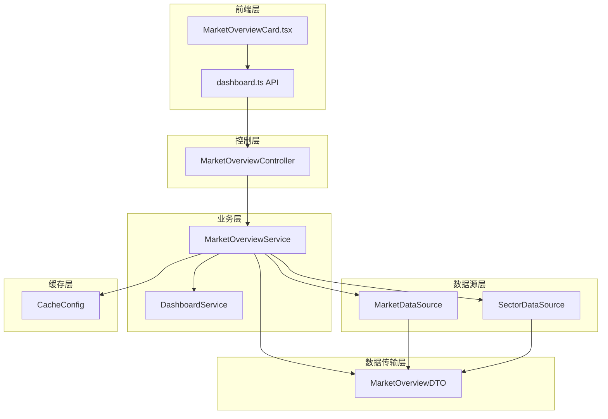
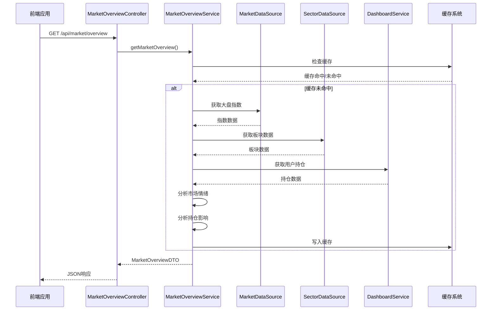
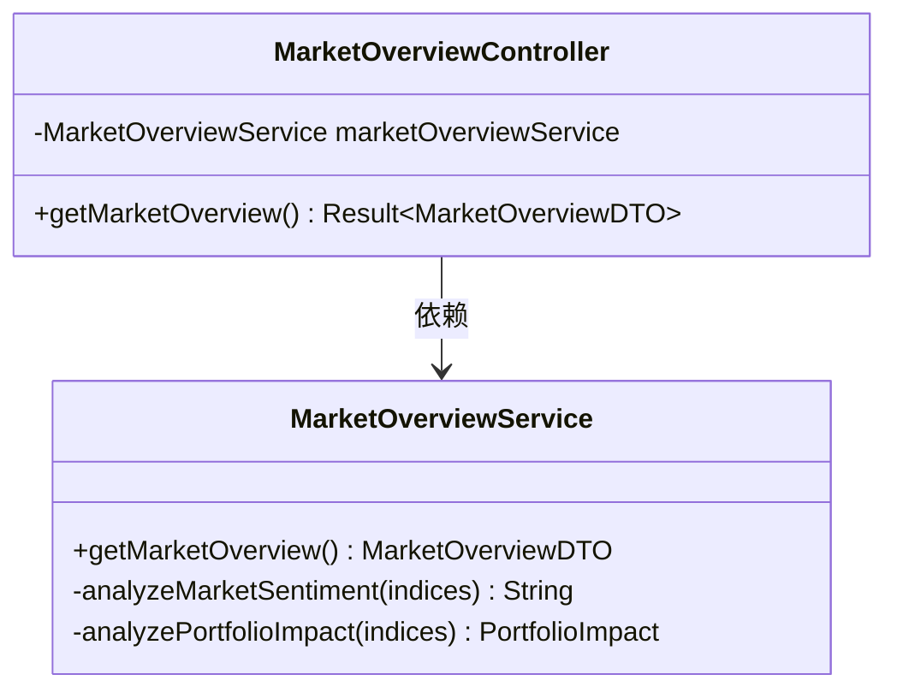
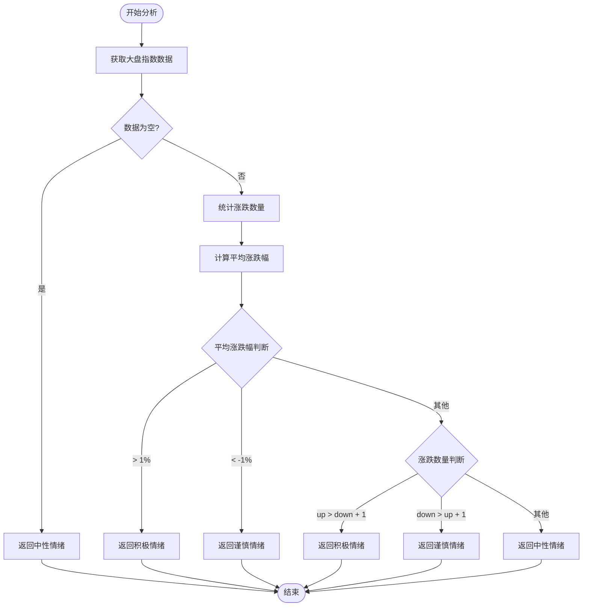
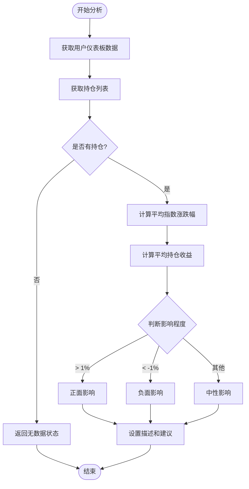
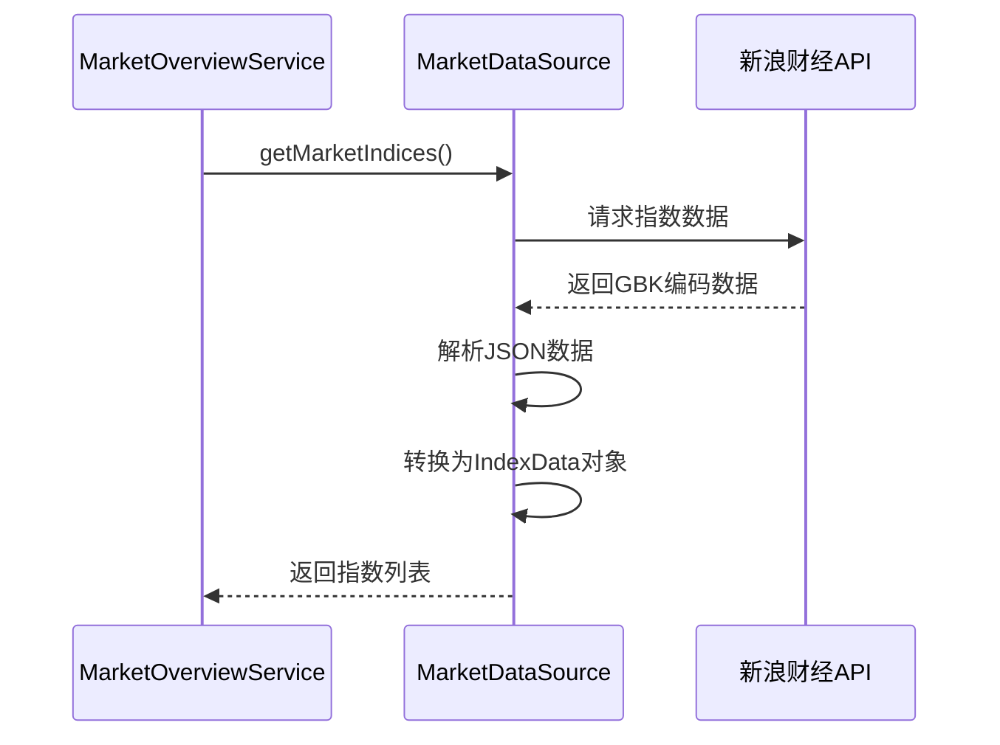
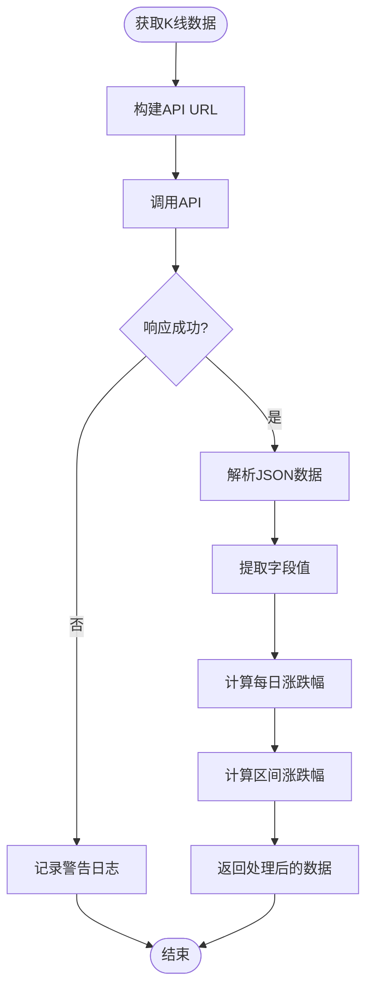
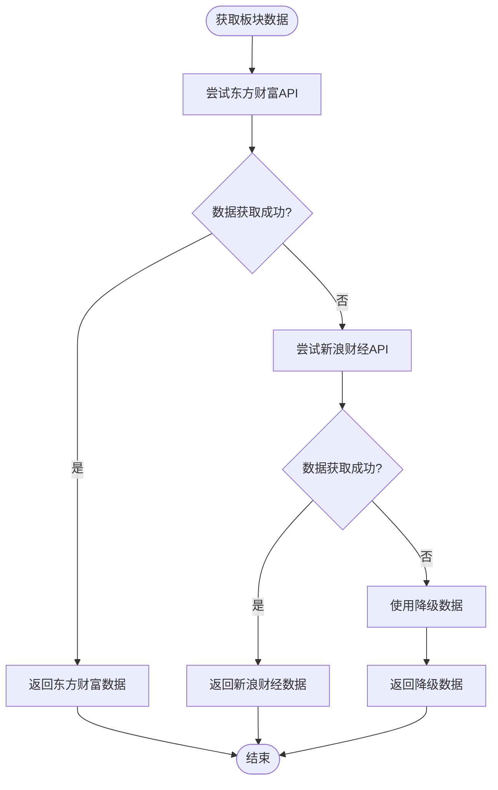
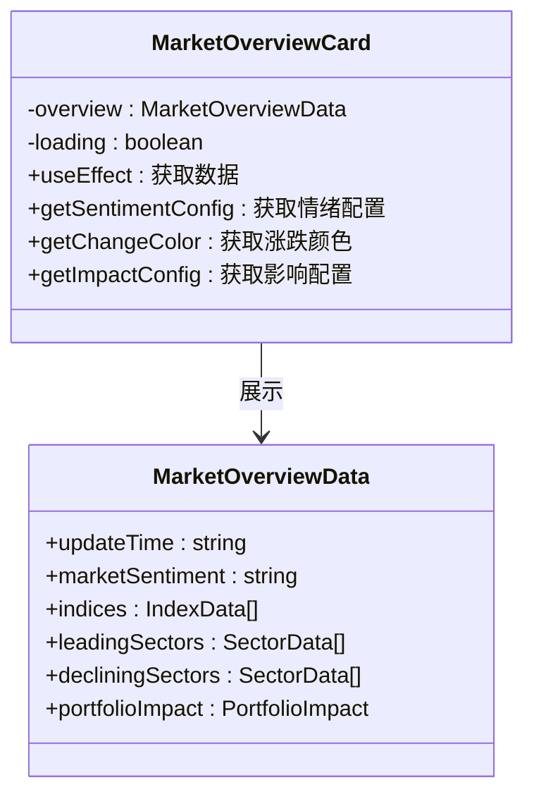
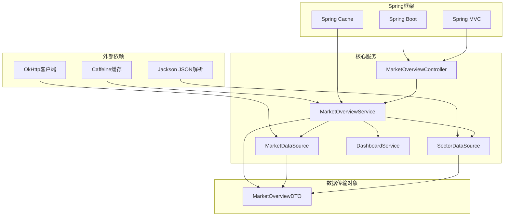

# 市场概览服务

<cite>
**本文档引用的文件**
- [MarketOverviewController.java](file://src/main/java/com/qoder/fund/controller/MarketOverviewController.java)
- [MarketOverviewService.java](file://src/main/java/com/qoder/fund/service/MarketOverviewService.java)
- [MarketDataSource.java](file://src/main/java/com/qoder/fund/datasource/MarketDataSource.java)
- [SectorDataSource.java](file://src/main/java/com/qoder/fund/datasource/SectorDataSource.java)
- [MarketOverviewDTO.java](file://src/main/java/com/qoder/fund/dto/MarketOverviewDTO.java)
- [DashboardService.java](file://src/main/java/com/qoder/fund/service/DashboardService.java)
- [CacheConfig.java](file://src/main/java/com/qoder/fund/config/CacheConfig.java)
- [MarketOverviewCard.tsx](file://fund-web/src/components/MarketOverviewCard.tsx)
- [dashboard.ts](file://fund-web/src/api/dashboard.ts)
- [application.yml](file://src/main/resources/application.yml)
- [SPEC.md](file://SPEC.md)
- [README.md](file://README.md)
</cite>

## 目录
1. [简介](#简介)
2. [项目结构](#项目结构)
3. [核心组件](#核心组件)
4. [架构概览](#架构概览)
5. [详细组件分析](#详细组件分析)
6. [依赖关系分析](#依赖关系分析)
7. [性能考量](#性能考量)
8. [故障排查指南](#故障排查指南)
9. [结论](#结论)

## 简介

市场概览服务是基金管家系统中的核心功能模块，负责整合和展示市场宏观数据，包括大盘指数、板块热度、市场情绪分析以及对用户持仓的影响评估。该服务采用多数据源架构，确保数据的准确性和可靠性，同时通过智能缓存机制提升系统性能。

## 项目结构

市场概览服务在项目中采用清晰的分层架构：

**图表来源**
- [MarketOverviewController.java:15-41](file://src/main/java/com/qoder/fund/controller/MarketOverviewController.java#L15-L41)
- [MarketOverviewService.java:23-75](file://src/main/java/com/qoder/fund/service/MarketOverviewService.java#L23-L75)
- [CacheConfig.java:20-76](file://src/main/java/com/qoder/fund/config/CacheConfig.java#L20-L76)

**章节来源**
- [SPEC.md:27-52](file://SPEC.md#L27-L52)
- [README.md:192-223](file://README.md#L192-L223)

## 核心组件

市场概览服务由以下核心组件构成：

### 数据传输对象 (DTO)
- **MarketOverviewDTO**: 定义完整的市场概览数据结构，包括指数数据、板块数据、趋势数据和持仓影响分析
- **IndexData**: 大盘指数基础数据（代码、名称、点位、涨跌幅度等）
- **SectorData**: 板块数据（名称、涨跌幅、领涨股等）
- **IndexTrend**: 指数近期走势数据
- **PortfolioImpact**: 持仓影响分析结果

### 数据源组件
- **MarketDataSource**: 负责获取大盘指数实时数据和K线走势
- **SectorDataSource**: 负责获取板块涨跌排行数据，支持多数据源切换

### 业务服务组件
- **MarketOverviewService**: 核心业务逻辑，整合各类数据并进行分析
- **DashboardService**: 提供用户持仓数据，用于分析对持仓的影响

**章节来源**
- [MarketOverviewDTO.java:12-220](file://src/main/java/com/qoder/fund/dto/MarketOverviewDTO.java#L12-L220)
- [MarketDataSource.java:20-343](file://src/main/java/com/qoder/fund/datasource/MarketDataSource.java#L20-L343)
- [SectorDataSource.java:21-234](file://src/main/java/com/qoder/fund/datasource/SectorDataSource.java#L21-L234)

## 架构概览

市场概览服务采用分层架构设计，确保职责分离和代码可维护性：

**图表来源**
- [MarketOverviewController.java:28-39](file://src/main/java/com/qoder/fund/controller/MarketOverviewController.java#L28-L39)
- [MarketOverviewService.java:36-75](file://src/main/java/com/qoder/fund/service/MarketOverviewService.java#L36-L75)

## 详细组件分析

### MarketOverviewController 控制器

控制器层负责HTTP请求处理和响应封装：

**图表来源**
- [MarketOverviewController.java:15-41](file://src/main/java/com/qoder/fund/controller/MarketOverviewController.java#L15-L41)
- [MarketOverviewService.java:23-75](file://src/main/java/com/qoder/fund/service/MarketOverviewService.java#L23-L75)

**章节来源**
- [MarketOverviewController.java:15-41](file://src/main/java/com/qoder/fund/controller/MarketOverviewController.java#L15-L41)

### MarketOverviewService 业务逻辑

业务服务层是核心，负责数据整合和智能分析：

#### 市场情绪分析算法

**图表来源**
- [MarketOverviewService.java:77-115](file://src/main/java/com/qoder/fund/service/MarketOverviewService.java#L77-L115)

#### 持仓影响分析流程

**图表来源**
- [MarketOverviewService.java:155-227](file://src/main/java/com/qoder/fund/service/MarketOverviewService.java#L155-L227)

**章节来源**
- [MarketOverviewService.java:23-240](file://src/main/java/com/qoder/fund/service/MarketOverviewService.java#L23-L240)

### MarketDataSource 数据获取

数据源层负责从外部API获取实时市场数据：

#### 大盘指数数据获取

**图表来源**
- [MarketDataSource.java:47-81](file://src/main/java/com/qoder/fund/datasource/MarketDataSource.java#L47-L81)

#### K线数据获取和处理

**图表来源**
- [MarketDataSource.java:152-262](file://src/main/java/com/qoder/fund/datasource/MarketDataSource.java#L152-L262)

**章节来源**
- [MarketDataSource.java:20-343](file://src/main/java/com/qoder/fund/datasource/MarketDataSource.java#L20-L343)

### SectorDataSource 板块数据源

板块数据源支持多数据源切换，确保数据可靠性：

#### 多数据源切换策略

**图表来源**
- [SectorDataSource.java:57-75](file://src/main/java/com/qoder/fund/datasource/SectorDataSource.java#L57-L75)

**章节来源**
- [SectorDataSource.java:21-234](file://src/main/java/com/qoder/fund/datasource/SectorDataSource.java#L21-L234)

### 前端集成组件

前端通过React组件展示市场概览数据：

#### MarketOverviewCard 组件

**图表来源**
- [MarketOverviewCard.tsx:15-238](file://fund-web/src/components/MarketOverviewCard.tsx#L15-L238)

**章节来源**
- [MarketOverviewCard.tsx:15-238](file://fund-web/src/components/MarketOverviewCard.tsx#L15-L238)

## 依赖关系分析

市场概览服务的依赖关系呈现清晰的层次化结构：

**图表来源**
- [CacheConfig.java:20-112](file://src/main/java/com/qoder/fund/config/CacheConfig.java#L20-L112)
- [MarketOverviewService.java:23-31](file://src/main/java/com/qoder/fund/service/MarketOverviewService.java#L23-L31)

**章节来源**
- [CacheConfig.java:20-112](file://src/main/java/com/qoder/fund/config/CacheConfig.java#L20-L112)
- [application.yml:30-36](file://src/main/resources/application.yml#L30-L36)

## 性能考量

市场概览服务在性能方面采用了多项优化策略：

### 缓存策略

系统采用分层缓存架构，针对不同数据类型的访问频率设置不同的缓存策略：

| 缓存类型 | 过期时间 | 最大容量 | 适用场景 |
|---------|---------|---------|---------|
| 热数据缓存 | 1分钟 | 500 | 用户持仓、自选基金实时估值 |
| 温数据缓存 | 5分钟 | 2000 | 基金搜索、详情、净值历史 |
| 冷数据缓存 | 1小时 | 1000 | 搜索历史、不常用基金 |
| 持久数据缓存 | 24小时 | 500 | 基金基本信息 |

### 数据获取优化

- **批量API调用**: 大盘指数数据通过单一API批量获取，减少网络请求次数
- **智能降级**: 当外部数据源不可用时，自动切换到降级数据源
- **数据解析优化**: 采用流式解析方式，避免内存溢出

### 前端性能优化

- **懒加载**: 市场概览组件按需加载
- **虚拟滚动**: 大量数据时使用虚拟滚动技术
- **防抖处理**: 避免频繁的数据刷新请求

**章节来源**
- [CacheConfig.java:22-94](file://src/main/java/com/qoder/fund/config/CacheConfig.java#L22-L94)
- [MarketDataSource.java:47-81](file://src/main/java/com/qoder/fund/datasource/MarketDataSource.java#L47-L81)

## 故障排查指南

### 常见问题及解决方案

#### 数据获取失败

**问题症状**: 市场概览数据为空或显示错误

**排查步骤**:
1. 检查外部API连接状态
2. 验证网络代理配置
3. 查看缓存状态
4. 检查数据库连接

**解决方案**:
- 配置备用数据源
- 实施重试机制
- 使用降级数据

#### 缓存问题

**问题症状**: 数据更新不及时

**排查步骤**:
1. 检查缓存配置
2. 验证缓存键生成
3. 查看缓存统计信息

**解决方案**:
- 调整缓存过期时间
- 实施缓存失效策略
- 监控缓存命中率

#### 性能问题

**问题症状**: 接口响应缓慢

**排查步骤**:
1. 分析数据库查询
2. 检查网络请求
3. 监控系统资源

**解决方案**:
- 优化SQL查询
- 实施分页查询
- 增加索引

**章节来源**
- [MarketOverviewService.java:71-75](file://src/main/java/com/qoder/fund/service/MarketOverviewService.java#L71-L75)
- [CacheConfig.java:96-110](file://src/main/java/com/qoder/fund/config/CacheConfig.java#L96-L110)

## 结论

市场概览服务通过精心设计的架构和优化策略，为用户提供全面、准确、实时的市场数据展示。系统采用多数据源架构确保数据可靠性，智能缓存机制提升性能，清晰的分层设计便于维护和扩展。

该服务不仅满足了当前的功能需求，还为未来的功能扩展奠定了坚实的基础。通过持续的监控和优化，市场概览服务将继续为用户提供优质的市场数据服务体验。