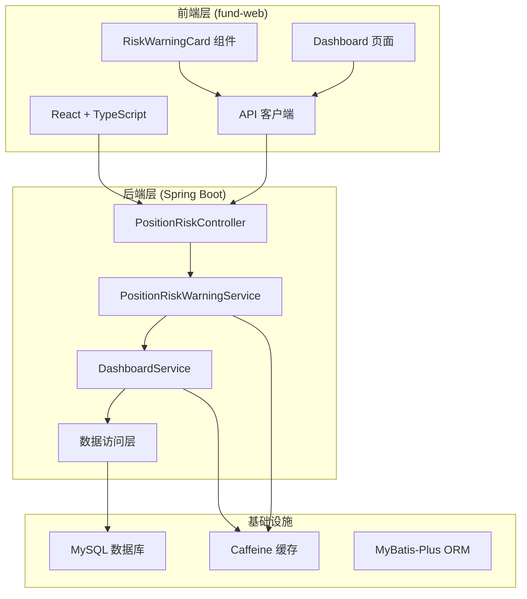
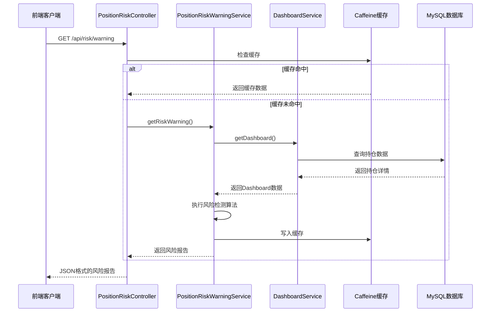
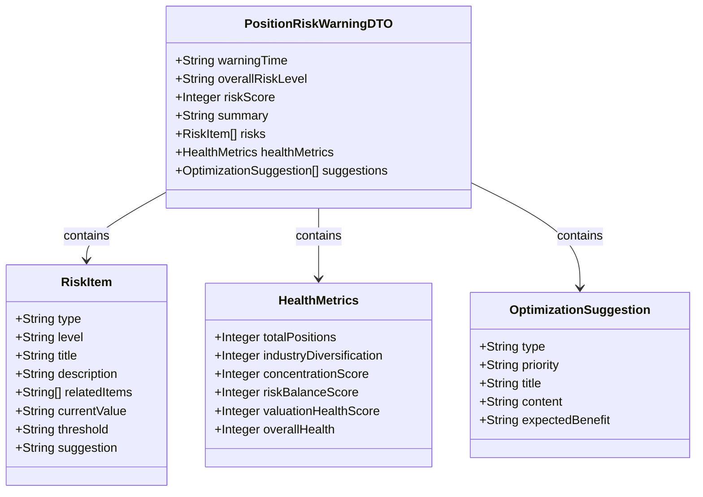
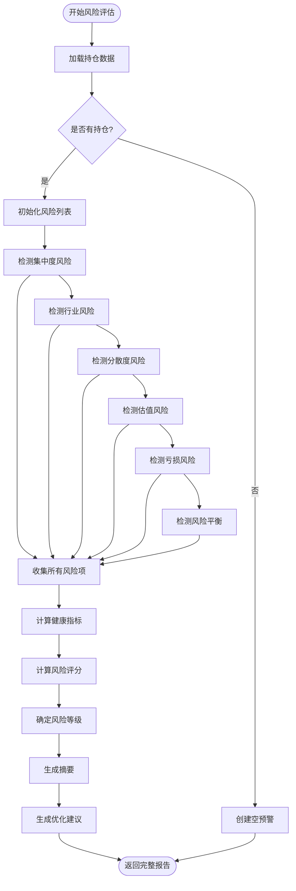
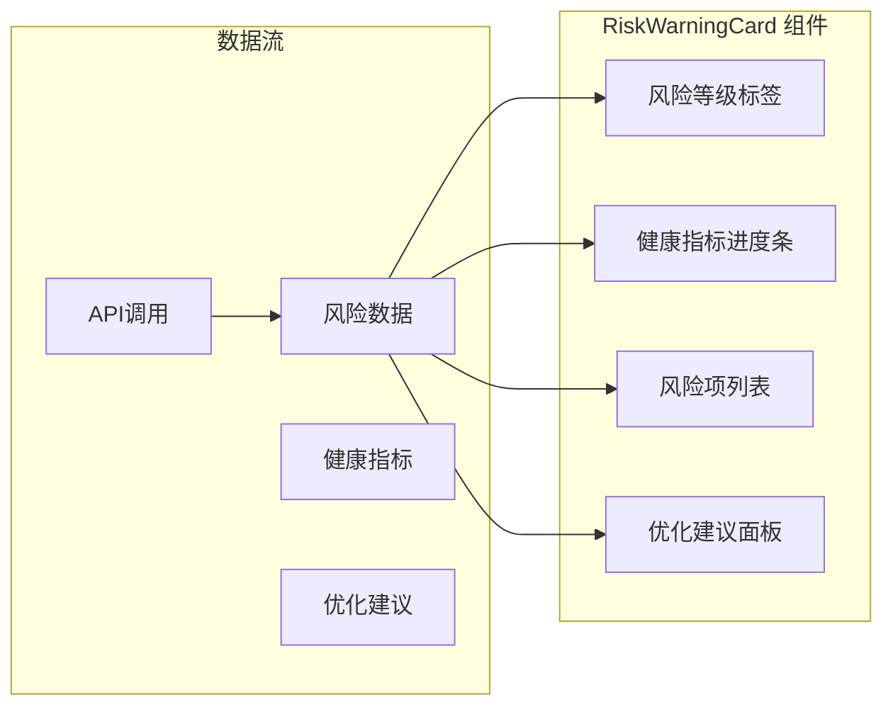
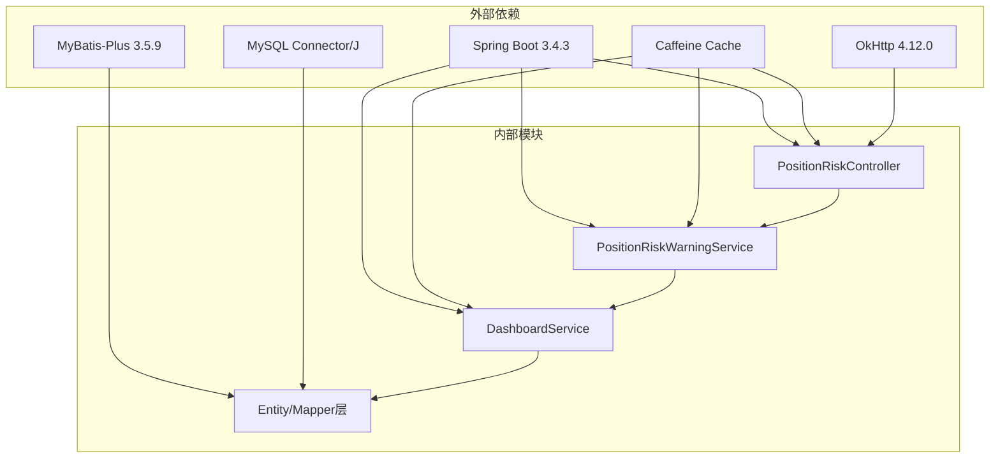
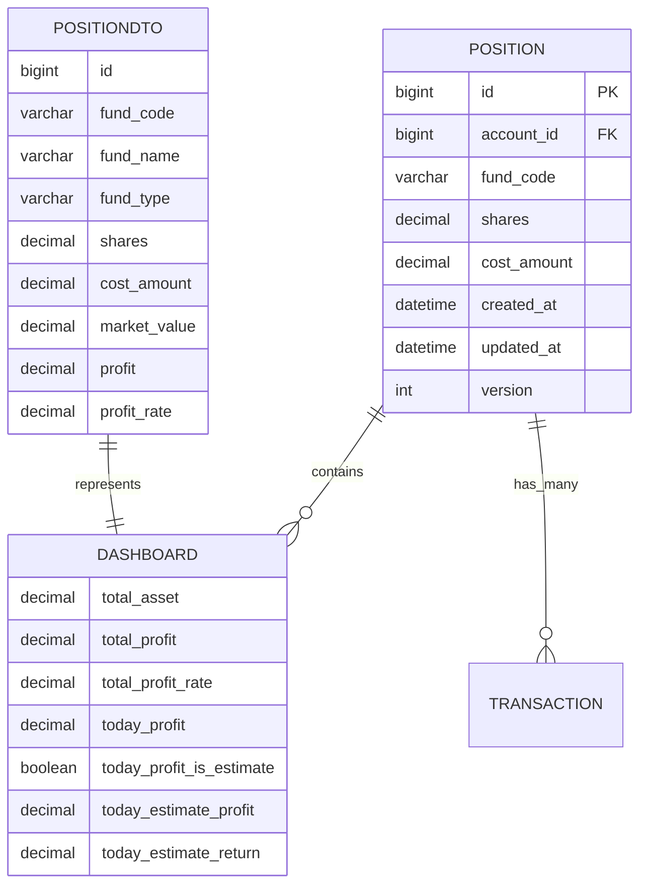

# Position Risk Warning Service

<cite>
**本文档引用的文件**
- [PositionRiskController.java](file://src/main/java/com/qoder/fund/controller/PositionRiskController.java)
- [PositionRiskWarningService.java](file://src/main/java/com/qoder/fund/service/PositionRiskWarningService.java)
- [PositionRiskWarningDTO.java](file://src/main/java/com/qoder/fund/dto/PositionRiskWarningDTO.java)
- [DashboardService.java](file://src/main/java/com/qoder/fund/service/DashboardService.java)
- [DashboardDTO.java](file://src/main/java/com/qoder/fund/dto/DashboardDTO.java)
- [PositionDTO.java](file://src/main/java/com/qoder/fund/dto/PositionDTO.java)
- [Position.java](file://src/main/java/com/qoder/fund/entity/Position.java)
- [application.yml](file://src/main/resources/application.yml)
- [RiskWarningCard.tsx](file://fund-web/src/components/RiskWarningCard.tsx)
- [index.tsx](file://fund-web/src/pages/Dashboard/index.tsx)
- [pom.xml](file://pom.xml)
- [PRD.md](file://PRD.md)
</cite>

## 目录
1. [简介](#简介)
2. [项目结构](#项目结构)
3. [核心组件](#核心组件)
4. [架构概览](#架构概览)
5. [详细组件分析](#详细组件分析)
6. [依赖关系分析](#依赖关系分析)
7. [性能考量](#性能考量)
8. [故障排除指南](#故障排除指南)
9. [结论](#结论)

## 简介

Position Risk Warning Service 是一个基于Spring Boot构建的专业级基金投资风险预警系统。该服务通过规则引擎对用户的基金持仓进行全面的风险评估，提供多维度的风险检测、健康指标分析和优化建议。

该系统的核心目标是帮助个人投资者识别和管理投资组合中的各种风险，包括但不限于单一持仓集中度风险、行业分散度风险、亏损风险、估值风险等。通过实时的风险评估和可视化展示，为用户提供科学的投资决策辅助。

## 项目结构

该项目采用典型的三层架构设计，分为后端服务层和前端展示层：

**图表来源**
- [PositionRiskController.java:1-41](file://src/main/java/com/qoder/fund/controller/PositionRiskController.java#L1-L41)
- [PositionRiskWarningService.java:1-696](file://src/main/java/com/qoder/fund/service/PositionRiskWarningService.java#L1-L696)
- [DashboardService.java:1-624](file://src/main/java/com/qoder/fund/service/DashboardService.java#L1-L624)

**章节来源**
- [pom.xml:1-179](file://pom.xml#L1-L179)
- [application.yml:1-68](file://src/main/resources/application.yml#L1-L68)

## 核心组件

### 风险预警控制器 (PositionRiskController)

作为REST API的入口点，提供统一的风险预警查询接口：

- **端点**: `/api/risk/warning`
- **方法**: GET
- **功能**: 返回完整的风险预警报告
- **缓存**: 使用Spring Cache注解实现5分钟缓存

### 风险预警服务 (PositionRiskWarningService)

这是系统的核心业务逻辑组件，负责执行全面的风险评估：

#### 主要功能模块

1. **集中度风险检测** - 检测单一持仓和整体投资组合的集中度风险
2. **行业风险检测** - 分析投资组合在不同行业的分布情况
3. **分散度风险检测** - 评估持仓数量的合理性
4. **估值风险检测** - 基于短期涨幅判断潜在的高估风险
5. **亏损风险检测** - 监控整体和单项持仓的亏损状况
6. **风险平衡检测** - 评估不同风险等级基金的配置比例

#### 风险阈值配置

系统内置了严格的风控阈值：
- 单一持仓警告: 30%，危险: 50%
- 单一行业警告: 40%，危险: 60%
- 最低分散持仓: 3只
- 高估值阈值: 80%分位
- 亏损提示: -3%，警告: -10%，危险: -20%
- 单基金亏损阈值: -15%

**章节来源**
- [PositionRiskController.java:1-41](file://src/main/java/com/qoder/fund/controller/PositionRiskController.java#L1-L41)
- [PositionRiskWarningService.java:1-696](file://src/main/java/com/qoder/fund/service/PositionRiskWarningService.java#L1-L696)

## 架构概览

系统采用微服务架构，前后端分离的设计模式：

**图表来源**
- [PositionRiskController.java:28-39](file://src/main/java/com/qoder/fund/controller/PositionRiskController.java#L28-L39)
- [PositionRiskWarningService.java:47-99](file://src/main/java/com/qoder/fund/service/PositionRiskWarningService.java#L47-L99)
- [DashboardService.java:44-165](file://src/main/java/com/qoder/fund/service/DashboardService.java#L44-L165)

## 详细组件分析

### 风险预警数据模型

系统使用强类型的数据传输对象来确保数据的一致性和完整性：

**图表来源**
- [PositionRiskWarningDTO.java:10-161](file://src/main/java/com/qoder/fund/dto/PositionRiskWarningDTO.java#L10-L161)

### 风险检测算法流程

系统实现了多维度的风险检测算法：

**图表来源**
- [PositionRiskWarningService.java:47-99](file://src/main/java/com/qoder/fund/service/PositionRiskWarningService.java#L47-L99)
- [PositionRiskWarningService.java:104-147](file://src/main/java/com/qoder/fund/service/PositionRiskWarningService.java#L104-L147)
- [PositionRiskWarningService.java:152-200](file://src/main/java/com/qoder/fund/service/PositionRiskWarningService.java#L152-L200)

### 前端集成组件

前端使用React组件展示风险预警结果：

**图表来源**
- [RiskWarningCard.tsx:8-229](file://fund-web/src/components/RiskWarningCard.tsx#L8-L229)

**章节来源**
- [PositionRiskWarningDTO.java:1-161](file://src/main/java/com/qoder/fund/dto/PositionRiskWarningDTO.java#L1-L161)
- [RiskWarningCard.tsx:1-229](file://fund-web/src/components/RiskWarningCard.tsx#L1-L229)

## 依赖关系分析

系统的关键依赖关系如下：

**图表来源**
- [pom.xml:20-116](file://pom.xml#L20-L116)

### 数据模型关系

**图表来源**
- [Position.java:14-28](file://src/main/java/com/qoder/fund/entity/Position.java#L14-L28)
- [DashboardDTO.java:10-24](file://src/main/java/com/qoder/fund/dto/DashboardDTO.java#L10-L24)
- [PositionDTO.java:11-36](file://src/main/java/com/qoder/fund/dto/PositionDTO.java#L11-L36)

**章节来源**
- [pom.xml:1-179](file://pom.xml#L1-L179)
- [application.yml:1-68](file://src/main/resources/application.yml#L1-L68)

## 性能考量

### 缓存策略

系统采用了多层次的缓存策略来提升性能：

1. **Dashboard缓存**: 5分钟有效期，包含总资产、总收益等基础数据
2. **风险预警缓存**: 5分钟有效期，包含完整的风险评估结果
3. **收益趋势缓存**: 可配置的有效期，支持不同时间范围的数据

### 性能优化措施

- **并行数据加载**: 前端使用Promise.all并行加载多个API请求
- **数据懒加载**: 风险预警组件在需要时才发起请求
- **条件渲染**: 基于风险等级动态渲染不同的UI元素
- **虚拟滚动**: 大数据集时使用虚拟滚动提升渲染性能

### 数据库优化

- **索引优化**: 在常用查询字段上建立适当的索引
- **连接池配置**: HikariCP连接池配置优化数据库连接性能
- **查询优化**: 使用MyBatis-Plus的条件构造器优化SQL查询

## 故障排除指南

### 常见问题及解决方案

#### 风险预警数据为空

**症状**: API返回空的风险数据，前端显示"暂无持仓数据"

**原因分析**:
1. 用户未添加任何持仓
2. 数据库连接异常
3. 缓存配置错误

**解决步骤**:
1. 检查用户是否已添加持仓
2. 验证数据库连接配置
3. 清除缓存后重试

#### 风险等级显示异常

**症状**: 风险等级与预期不符

**排查步骤**:
1. 检查风险阈值配置是否正确
2. 验证持仓数据的完整性
3. 确认风险检测算法的执行路径

#### 性能问题

**症状**: API响应时间过长

**优化建议**:
1. 检查缓存配置和有效性
2. 优化数据库查询性能
3. 调整并发连接数
4. 实施分页查询

**章节来源**
- [PositionRiskController.java:34-38](file://src/main/java/com/qoder/fund/controller/PositionRiskController.java#L34-L38)
- [application.yml:29-36](file://src/main/resources/application.yml#L29-L36)

## 结论

Position Risk Warning Service 是一个功能完备、架构清晰的基金投资风险预警系统。该系统通过以下特点实现了专业的风险管理功能：

### 核心优势

1. **全面的风险检测**: 覆盖集中度、行业、分散度、估值、亏损、风险平衡等多个维度
2. **实时数据处理**: 基于最新的持仓数据和市场行情进行风险评估
3. **智能缓存机制**: 通过多级缓存确保系统的高性能响应
4. **可视化展示**: 提供直观的风险等级和健康指标展示
5. **可扩展架构**: 模块化的组件设计便于功能扩展和维护

### 技术亮点

- **规则引擎**: 内置的风控阈值和检测逻辑
- **健康指标**: 四维度的健康评分系统
- **优化建议**: 基于风险评估结果的个性化建议
- **前后端分离**: 现代化的技术栈和开发模式

### 发展建议

1. **AI集成**: 可考虑集成机器学习算法进行更精准的风险预测
2. **实时监控**: 增加实时风险监控和预警通知功能
3. **多维度分析**: 扩展更多的风险分析维度和指标
4. **用户体验**: 进一步优化前端交互和视觉设计

该系统为个人投资者提供了专业级的投资风险管理工具，有助于提高投资决策的质量和安全性。