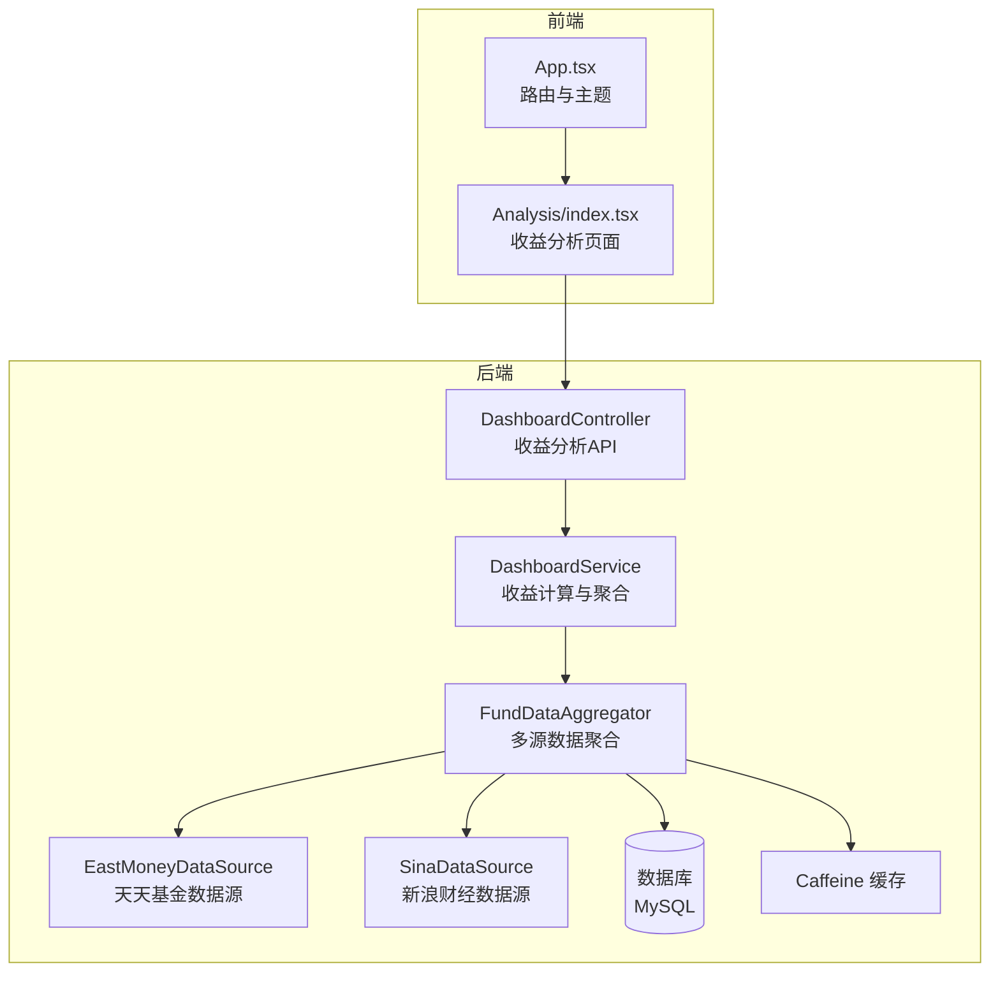
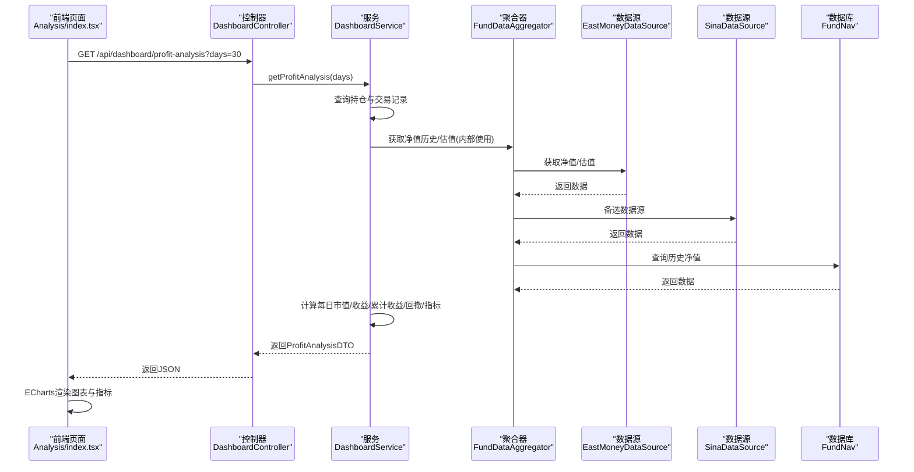
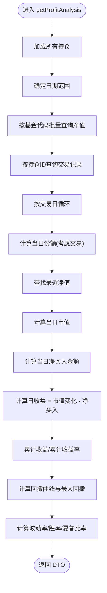
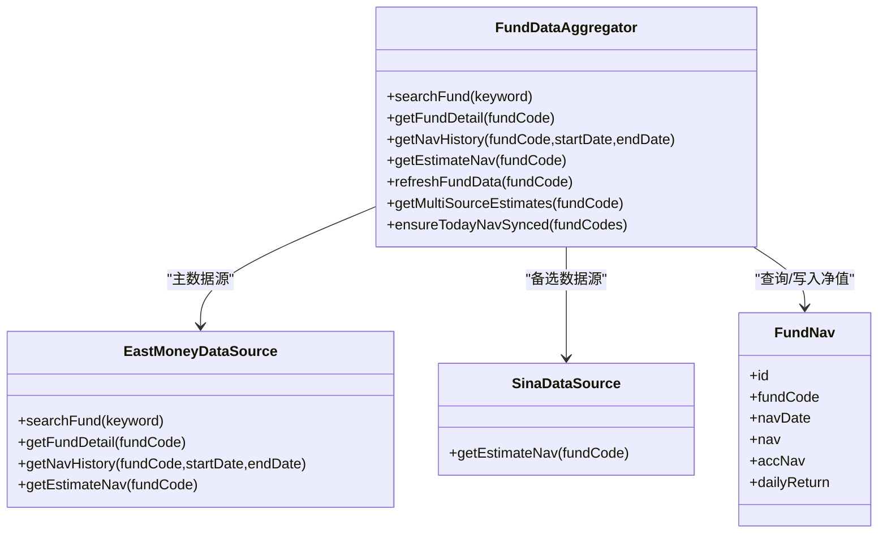
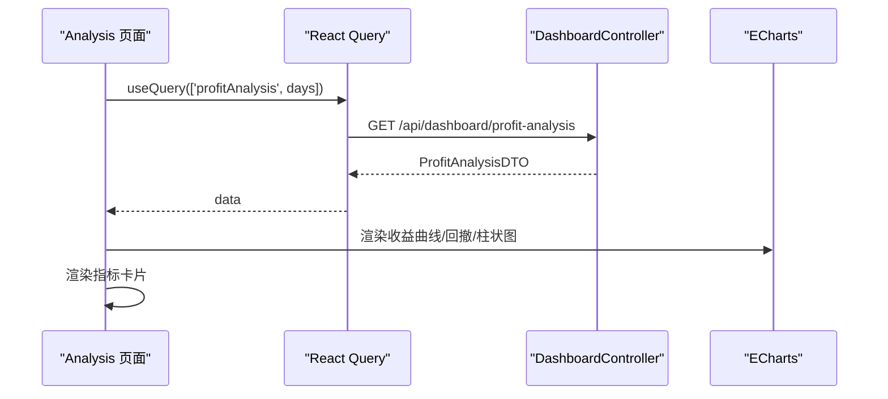
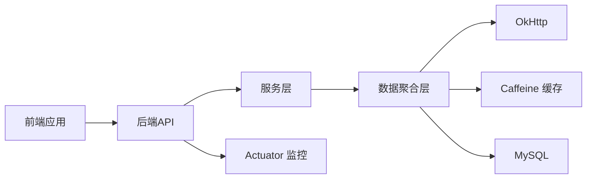

# 进度跟踪

<cite>
**本文引用的文件**
- [PROGRESS.md](file://PROGRESS.md)
- [PRD.md](file://PRD.md)
- [FundApplication.java](file://src/main/java/com/qoder/fund/FundApplication.java)
- [application.yml](file://src/main/resources/application.yml)
- [DashboardController.java](file://src/main/java/com/qoder/fund/controller/DashboardController.java)
- [DashboardService.java](file://src/main/java/com/qoder/fund/service/DashboardService.java)
- [FundDataAggregator.java](file://src/main/java/com/qoder/fund/datasource/FundDataAggregator.java)
- [EstimateAnalysisService.java](file://src/main/java/com/qoder/fund/service/EstimateAnalysisService.java)
- [EastMoneyDataSource.java](file://src/main/java/com/qoder/fund/datasource/EastMoneyDataSource.java)
- [SinaDataSource.java](file://src/main/java/com/qoder/fund/datasource/SinaDataSource.java)
- [FundNav.java](file://src/main/java/com/qoder/fund/entity/FundNav.java)
- [FundNavMapper.java](file://src/main/java/com/qoder/fund/mapper/FundNavMapper.java)
- [ProfitAnalysisDTO.java](file://src/main/java/com/qoder/fund/dto/ProfitAnalysisDTO.java)
- [App.tsx](file://fund-web/src/App.tsx)
- [Analysis/index.tsx](file://fund-web/src/pages/Analysis/index.tsx)
</cite>

## 目录
1. [简介](#简介)
2. [项目结构](#项目结构)
3. [核心组件](#核心组件)
4. [架构总览](#架构总览)
5. [详细组件分析](#详细组件分析)
6. [依赖关系分析](#依赖关系分析)
7. [性能考量](#性能考量)
8. [故障排查指南](#故障排查指南)
9. [结论](#结论)
10. [附录](#附录)

## 简介
本文件基于仓库中的进度跟踪文档与系统实现，对“基金管家”项目的开发进度、架构设计与核心功能进行系统化梳理。重点围绕收益分析与数据聚合两大模块，结合后端服务、前端页面与数据模型，形成可读性强、便于协作的进度跟踪文档。

## 项目结构
项目采用前后端分离架构：
- 后端：Spring Boot + MyBatis-Plus，提供REST API与数据聚合服务
- 前端：React + TypeScript + ECharts，提供收益分析与可视化页面
- 数据层：MySQL + Caffeine 缓存，支撑净值与估值数据的持久化与缓存

**图表来源**
- [App.tsx:45-67](file://fund-web/src/App.tsx#L45-L67)
- [Analysis/index.tsx:10-320](file://fund-web/src/pages/Analysis/index.tsx#L10-L320)
- [DashboardController.java:11-36](file://src/main/java/com/qoder/fund/controller/DashboardController.java#L11-L36)
- [DashboardService.java:30-609](file://src/main/java/com/qoder/fund/service/DashboardService.java#L30-L609)
- [FundDataAggregator.java:40-712](file://src/main/java/com/qoder/fund/datasource/FundDataAggregator.java#L40-L712)
- [EastMoneyDataSource.java:23-800](file://src/main/java/com/qoder/fund/datasource/EastMoneyDataSource.java#L23-L800)
- [SinaDataSource.java:19-119](file://src/main/java/com/qoder/fund/datasource/SinaDataSource.java#L19-L119)
- [application.yml:29-36](file://src/main/resources/application.yml#L29-L36)

**章节来源**
- [FundApplication.java:7-15](file://src/main/java/com/qoder/fund/FundApplication.java#L7-L15)
- [application.yml:1-68](file://src/main/resources/application.yml#L1-L68)
- [App.tsx:45-67](file://fund-web/src/App.tsx#L45-L67)
- [Analysis/index.tsx:10-320](file://fund-web/src/pages/Analysis/index.tsx#L10-L320)

## 核心组件
- 收益分析API与服务
  - 控制器：提供收益分析相关接口，包括收益曲线、回撤分析与指标计算
  - 服务：基于持仓与净值历史，计算每日市值、日收益、累计收益、回撤与绩效指标
- 多数据源聚合
  - 聚合器：统一管理主数据源（天天基金）、备选数据源（新浪财经）、股票兜底估值，并提供缓存与权重修正
  - 数据源适配器：封装HTTP请求、解析响应、熔断与限流
- 前端收益分析页面
  - 使用React Query拉取收益分析数据，ECharts渲染收益曲线、回撤与每日收益柱状图
  - 展示总收益、年化收益、最大回撤、夏普比率、胜率、波动率等指标卡片

**章节来源**
- [DashboardController.java:11-36](file://src/main/java/com/qoder/fund/controller/DashboardController.java#L11-L36)
- [DashboardService.java:178-330](file://src/main/java/com/qoder/fund/service/DashboardService.java#L178-L330)
- [FundDataAggregator.java:36-146](file://src/main/java/com/qoder/fund/datasource/FundDataAggregator.java#L36-L146)
- [EastMoneyDataSource.java:23-800](file://src/main/java/com/qoder/fund/datasource/EastMoneyDataSource.java#L23-L800)
- [SinaDataSource.java:19-119](file://src/main/java/com/qoder/fund/datasource/SinaDataSource.java#L19-L119)
- [Analysis/index.tsx:10-320](file://fund-web/src/pages/Analysis/index.tsx#L10-L320)

## 架构总览
收益分析模块的关键流程如下：
- 前端发起收益分析请求
- 后端控制器接收参数并调用服务层
- 服务层查询持仓与交易记录，按日期循环计算每日市值与收益
- 服务层计算累计收益、回撤曲线与绩效指标
- 服务层返回DTO给前端，前端渲染图表与指标卡片

**图表来源**
- [Analysis/index.tsx:13-17](file://fund-web/src/pages/Analysis/index.tsx#L13-L17)
- [DashboardController.java:31-34](file://src/main/java/com/qoder/fund/controller/DashboardController.java#L31-L34)
- [DashboardService.java:182-330](file://src/main/java/com/qoder/fund/service/DashboardService.java#L182-L330)
- [FundDataAggregator.java:105-146](file://src/main/java/com/qoder/fund/datasource/FundDataAggregator.java#L105-L146)
- [EastMoneyDataSource.java:112-140](file://src/main/java/com/qoder/fund/datasource/EastMoneyDataSource.java#L112-L140)
- [SinaDataSource.java:36-106](file://src/main/java/com/qoder/fund/datasource/SinaDataSource.java#L36-L106)
- [FundNav.java:11-24](file://src/main/java/com/qoder/fund/entity/FundNav.java#L11-L24)

## 详细组件分析

### 收益分析服务（DashboardService）
- 功能职责
  - 计算每日市值：基于持仓份额与对应日期的净值（向前取最近净值）
  - 计算每日收益：市值变化 - 当日净买入金额
  - 计算累计收益与累计收益率
  - 计算回撤曲线与最大回撤区间
  - 计算总收益率、年化收益率、波动率、胜率、夏普比率
- 关键算法
  - 日期遍历：跳过周末，按交易日计算
  - 净值查找：按基金代码分组，向前取最近净值
  - 收益计算：基于日收益序列计算波动率与夏普比率
- 异常与边界
  - 无交易记录时使用持仓成本金额
  - QDII等延迟净值场景，提供最近交易日实际净值兜底

**图表来源**
- [DashboardService.java:182-330](file://src/main/java/com/qoder/fund/service/DashboardService.java#L182-L330)
- [FundNav.java:11-24](file://src/main/java/com/qoder/fund/entity/FundNav.java#L11-L24)
- [FundNavMapper.java:7-10](file://src/main/java/com/qoder/fund/mapper/FundNavMapper.java#L7-L10)

**章节来源**
- [DashboardService.java:178-609](file://src/main/java/com/qoder/fund/service/DashboardService.java#L178-L609)
- [ProfitAnalysisDTO.java:11-69](file://src/main/java/com/qoder/fund/dto/ProfitAnalysisDTO.java#L11-L69)

### 多数据源聚合（FundDataAggregator）
- 功能职责
  - 搜索与详情缓存：减少重复请求
  - 实时估值多源融合：主源（天天基金）→备选（新浪财经）→兜底（股票估算）
  - 智能权重：基于基金类型与历史准确度动态调整权重
  - 预同步净值：批量预写入今日净值，提升“实际净值”可用性
- 关键特性
  - 缓存：Caffeine + Spring Cache注解
  - 熔断：CircuitBreaker保障接口稳定性
  - 准确度修正：基于estimate_prediction表的历史MAE计算权重修正乘数

**图表来源**
- [FundDataAggregator.java:40-712](file://src/main/java/com/qoder/fund/datasource/FundDataAggregator.java#L40-L712)
- [EastMoneyDataSource.java:23-800](file://src/main/java/com/qoder/fund/datasource/EastMoneyDataSource.java#L23-L800)
- [SinaDataSource.java:19-119](file://src/main/java/com/qoder/fund/datasource/SinaDataSource.java#L19-L119)
- [FundNav.java:11-24](file://src/main/java/com/qoder/fund/entity/FundNav.java#L11-L24)

**章节来源**
- [FundDataAggregator.java:36-712](file://src/main/java/com/qoder/fund/datasource/FundDataAggregator.java#L36-L712)
- [application.yml:29-36](file://src/main/resources/application.yml#L29-L36)

### 前端收益分析页面（Analysis/index.tsx）
- 功能职责
  - 通过React Query拉取收益分析数据，设置缓存与过期策略
  - 使用ECharts渲染收益曲线、回撤曲线与每日收益柱状图
  - 展示关键指标卡片：总收益率、年化收益、最大回撤、夏普比率、胜率、波动率
- 交互与体验
  - 支持切换近30/60/90天窗口
  - 加载态骨架屏，空数据友好提示

**图表来源**
- [Analysis/index.tsx:13-17](file://fund-web/src/pages/Analysis/index.tsx#L13-L17)
- [DashboardController.java:31-34](file://src/main/java/com/qoder/fund/controller/DashboardController.java#L31-L34)

**章节来源**
- [Analysis/index.tsx:10-320](file://fund-web/src/pages/Analysis/index.tsx#L10-L320)

## 依赖关系分析
- 后端依赖
  - Spring Boot + MyBatis-Plus：ORM与配置
  - OkHttp：HTTP客户端，封装数据源请求
  - Caffeine：本地缓存，提升查询性能
  - Actuator：健康检查与监控
- 前端依赖
  - React Query：数据获取与缓存
  - ECharts：收益曲线与回撤可视化
  - Ant Design：UI组件与主题

**图表来源**
- [application.yml:29-68](file://src/main/resources/application.yml#L29-L68)
- [EastMoneyDataSource.java:29-37](file://src/main/java/com/qoder/fund/datasource/EastMoneyDataSource.java#L29-L37)
- [Analysis/index.tsx:5-7](file://fund-web/src/pages/Analysis/index.tsx#L5-L7)

**章节来源**
- [application.yml:1-68](file://src/main/resources/application.yml#L1-L68)

## 性能考量
- 缓存策略
  - 多级缓存：Caffeine本地缓存 + HTTP响应缓存，减少重复请求
  - 缓存键设计：按资源维度（搜索、详情、净值历史、估值）隔离，避免污染
- 数据聚合
  - 批量查询：按基金代码批量获取净值，减少网络往返
  - 预同步：批量预写入今日净值，提升“实际净值”可用性
- 前端性能
  - React Query缓存与过期策略，避免频繁请求
  - ECharts按需渲染，减少DOM压力

[本节为通用指导，无需特定文件引用]

## 故障排查指南
- 数据源不可用
  - 现象：估值为空或返回空集
  - 排查：检查熔断器状态、网络连通性、数据源接口返回结构
  - 参考：数据源适配器的熔断记录与日志
- 净值缺失
  - 现象：收益曲线无数据或回撤异常
  - 排查：确认FundNav表是否存在对应日期净值；检查预同步逻辑
  - 参考：聚合器的净值查询与预同步方法
- 前端图表空白
  - 现象：收益分析页面空白或加载态
  - 排查：确认API返回数据结构一致；检查React Query缓存键与过期时间
  - 参考：前端页面的数据获取与空状态处理

**章节来源**
- [EastMoneyDataSource.java:46-84](file://src/main/java/com/qoder/fund/datasource/EastMoneyDataSource.java#L46-L84)
- [SinaDataSource.java:36-106](file://src/main/java/com/qoder/fund/datasource/SinaDataSource.java#L36-L106)
- [FundDataAggregator.java:151-222](file://src/main/java/com/qoder/fund/datasource/FundDataAggregator.java#L151-L222)
- [FundNav.java:11-24](file://src/main/java/com/qoder/fund/entity/FundNav.java#L11-L24)
- [Analysis/index.tsx:13-26](file://fund-web/src/pages/Analysis/index.tsx#L13-L26)

## 结论
- 项目已完成收益分析核心功能：收益曲线、回撤分析、指标计算与可视化展示
- 后端通过多数据源聚合与缓存策略，提升了数据可用性与稳定性
- 前端通过图表与指标卡片，提供了直观的投资收益洞察
- 后续可进一步完善单元测试、数据可视化优化与功能增强（如排行榜、筛选器）

[本节为总结性内容，无需特定文件引用]

## 附录

### 进度与里程碑
- 进度概览：MVP阶段80%，后端85%，前端80%，CLI 90%
- 已完成：收益分析API、收益分析页面、日志系统、CLI命令行工具、多数据源适配
- 进行中：定时数据同步优化、单元测试覆盖
- 待开始：基金筛选器、排行榜、收益归因分析、周报/月报、批量导入

**章节来源**
- [PROGRESS.md:8-128](file://PROGRESS.md#L8-L128)

### 产品需求与功能映射
- 收益分析页面对应PRD中的“收益分析”模块，涵盖收益曲线、回撤分析、指标卡片与报告导出能力
- 与PRD的功能优先级（P0/P1）保持一致，确保MVP快速交付

**章节来源**
- [PRD.md:190-245](file://PRD.md#L190-L245)
- [PRD.md:441-460](file://PRD.md#L441-L460)