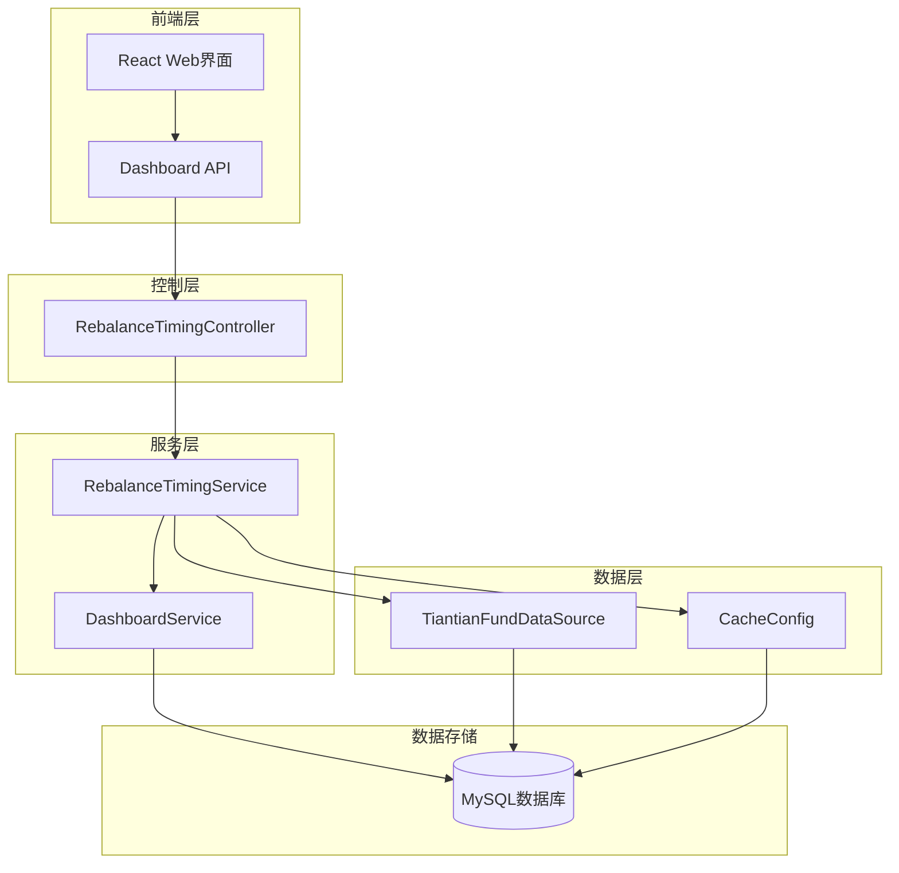
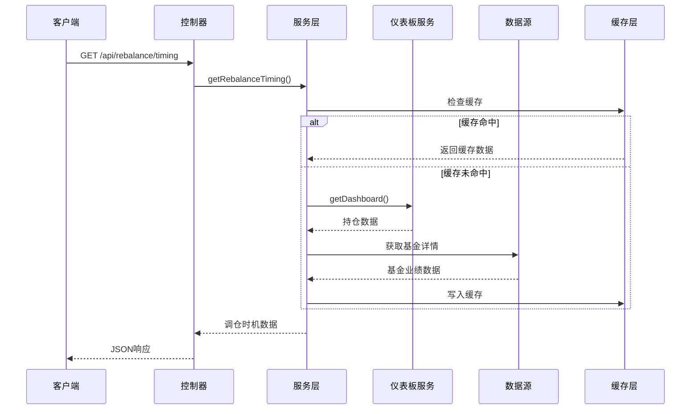
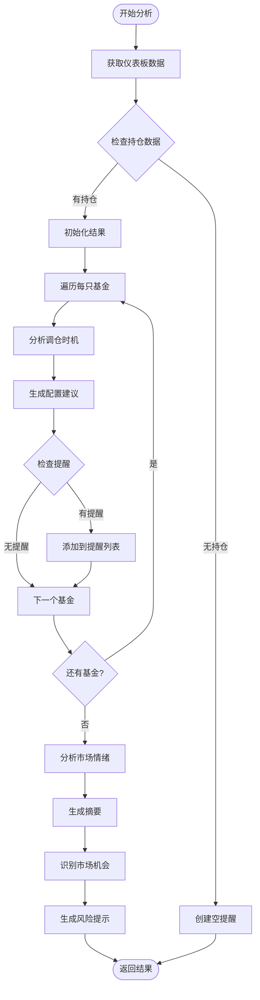
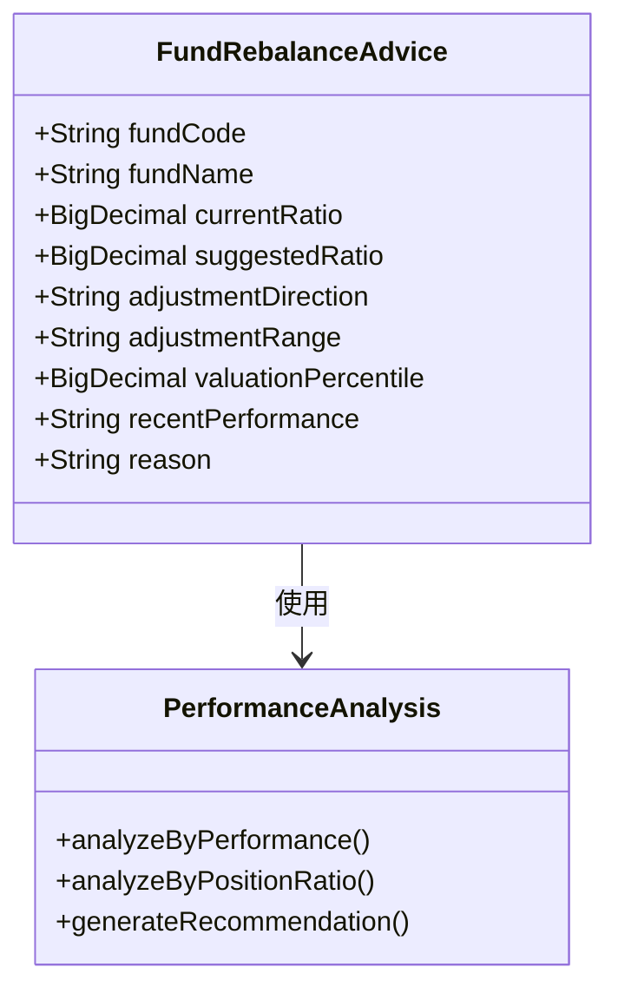
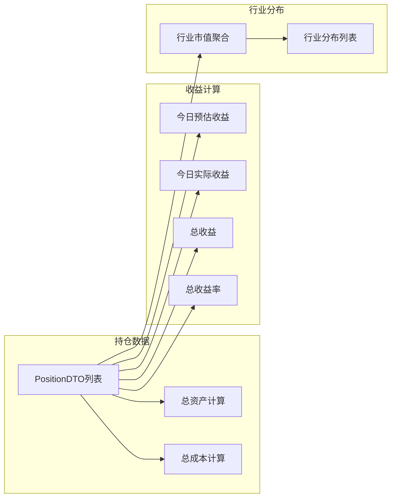
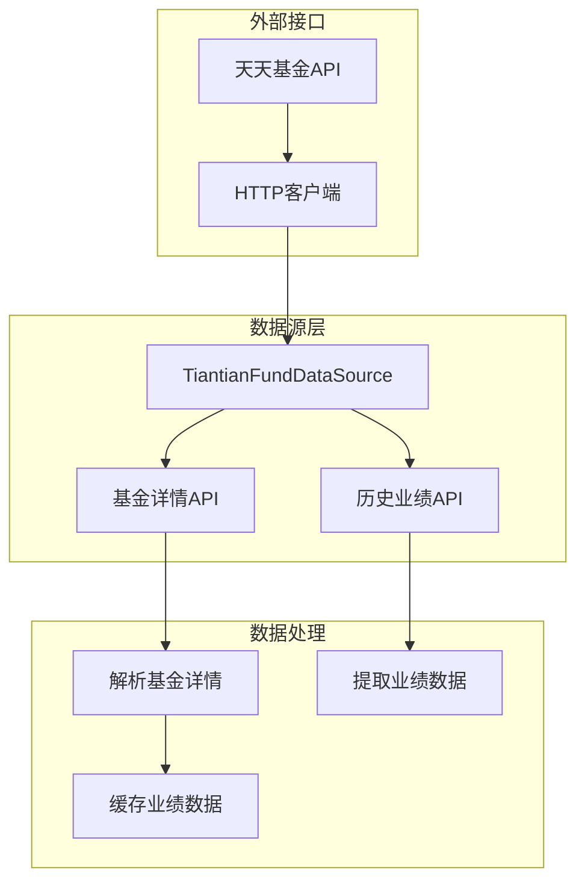
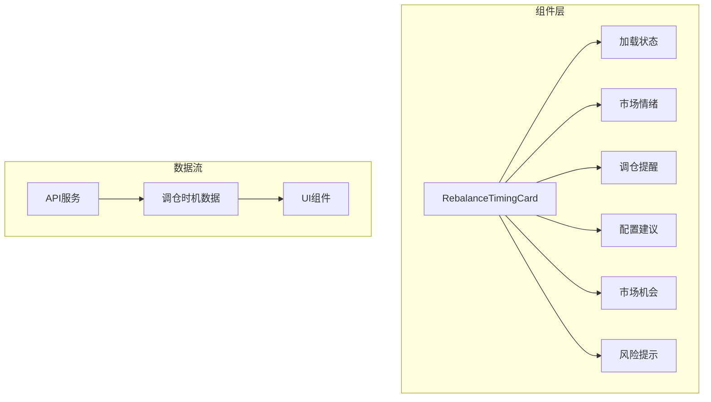
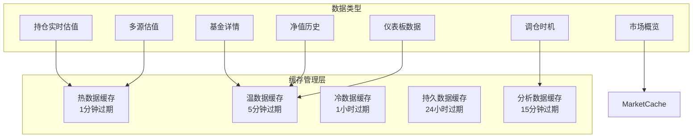
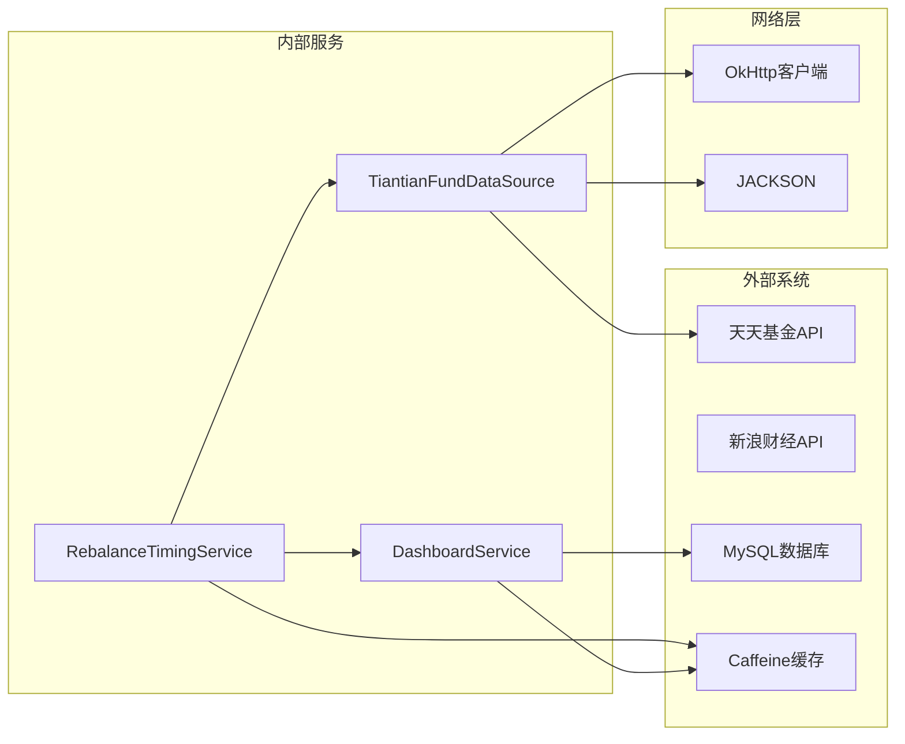
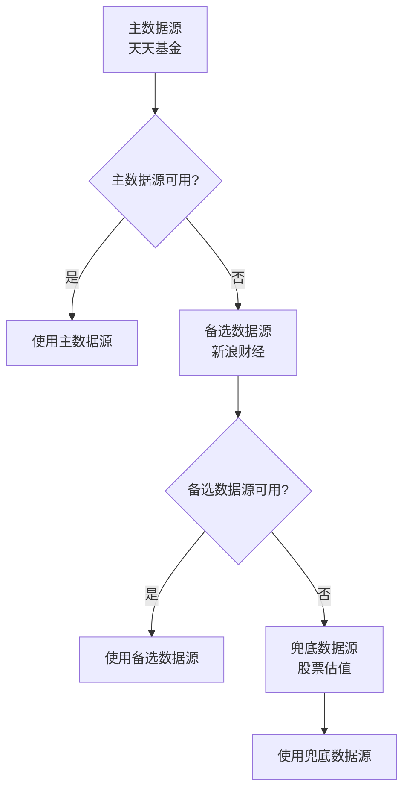

# 调仓时机服务

<cite>
**本文档引用的文件**
- [RebalanceTimingService.java](file://src/main/java/com/qoder/fund/service/RebalanceTimingService.java)
- [RebalanceTimingController.java](file://src/main/java/com/qoder/fund/controller/RebalanceTimingController.java)
- [RebalanceTimingDTO.java](file://src/main/java/com/qoder/fund/dto/RebalanceTimingDTO.java)
- [DashboardService.java](file://src/main/java/com/qoder/fund/service/DashboardService.java)
- [TiantianFundDataSource.java](file://src/main/java/com/qoder/fund/datasource/TiantianFundDataSource.java)
- [CacheConfig.java](file://src/main/java/com/qoder/fund/config/CacheConfig.java)
- [application.yml](file://src/main/resources/application.yml)
- [RebalanceTimingCard.tsx](file://fund-web/src/components/RebalanceTimingCard.tsx)
- [dashboard.ts](file://fund-web/src/api/dashboard.ts)
- [PRD.md](file://PRD.md)
</cite>

## 目录
1. [简介](#简介)
2. [项目结构](#项目结构)
3. [核心组件](#核心组件)
4. [架构概览](#架构概览)
5. [详细组件分析](#详细组件分析)
6. [依赖关系分析](#依赖关系分析)
7. [性能考量](#性能考量)
8. [故障排除指南](#故障排除指南)
9. [结论](#结论)

## 简介

调仓时机服务是基金管理系统中的核心分析组件，旨在为用户提供智能化的基金调仓建议和市场时机提醒。该服务通过综合分析用户持仓数据、基金历史业绩、实时估值信息以及市场情绪，为投资者提供科学的投资决策辅助。

该服务采用多数据源融合策略，结合历史业绩分析和实时市场数据，为用户提供个性化的调仓时机建议，包括短期交易机会识别、中长期配置优化建议和风险提示。

## 项目结构

调仓时机服务位于基金管理系统的核心模块中，采用分层架构设计：



**图表来源**
- [RebalanceTimingController.java:15-41](file://src/main/java/com/qoder/fund/controller/RebalanceTimingController.java#L15-L41)
- [RebalanceTimingService.java:24-585](file://src/main/java/com/qoder/fund/service/RebalanceTimingService.java#L24-L585)
- [CacheConfig.java:18-112](file://src/main/java/com/qoder/fund/config/CacheConfig.java#L18-L112)

**章节来源**
- [RebalanceTimingService.java:1-585](file://src/main/java/com/qoder/fund/service/RebalanceTimingService.java#L1-L585)
- [RebalanceTimingController.java:1-41](file://src/main/java/com/qoder/fund/controller/RebalanceTimingController.java#L1-L41)
- [CacheConfig.java:1-112](file://src/main/java/com/qoder/fund/config/CacheConfig.java#L1-L112)

## 核心组件

调仓时机服务由多个核心组件协同工作，每个组件都有明确的职责分工：

### 1. 服务层组件

**RebalanceTimingService** - 主要业务逻辑处理
- 负责综合分析用户持仓数据和市场信息
- 生成调仓时机提醒和配置建议
- 实现多层级的决策算法

**DashboardService** - 数据聚合服务
- 聚合用户持仓信息和市场数据
- 计算总资产、总收益等关键指标
- 提供统一的数据访问接口

### 2. 控制层组件

**RebalanceTimingController** - API入口
- 提供RESTful API接口
- 处理HTTP请求和响应
- 实现简单的错误处理

### 3. 数据传输对象

**RebalanceTimingDTO** - 数据传输对象
- 定义调仓时机服务的输出格式
- 包含提醒、建议、机会识别等数据结构

**章节来源**
- [RebalanceTimingService.java:24-585](file://src/main/java/com/qoder/fund/service/RebalanceTimingService.java#L24-L585)
- [DashboardService.java:31-624](file://src/main/java/com/qoder/fund/service/DashboardService.java#L31-L624)
- [RebalanceTimingController.java:15-41](file://src/main/java/com/qoder/fund/controller/RebalanceTimingController.java#L15-L41)
- [RebalanceTimingDTO.java:1-182](file://src/main/java/com/qoder/fund/dto/RebalanceTimingDTO.java#L1-L182)

## 架构概览

调仓时机服务采用分层架构，实现了清晰的关注点分离：



**图表来源**
- [RebalanceTimingController.java:23-40](file://src/main/java/com/qoder/fund/controller/RebalanceTimingController.java#L23-L40)
- [RebalanceTimingService.java:55-115](file://src/main/java/com/qoder/fund/service/RebalanceTimingService.java#L55-L115)
- [DashboardService.java:44-165](file://src/main/java/com/qoder/fund/service/DashboardService.java#L44-L165)

### 数据流分析

服务的数据流遵循以下模式：

1. **缓存检查** - 首先检查分析缓存
2. **数据获取** - 通过DashboardService获取用户持仓数据
3. **外部数据** - 从TiantianFundDataSource获取基金历史业绩
4. **分析计算** - 执行多层决策算法
5. **结果缓存** - 将结果写入缓存

**章节来源**
- [RebalanceTimingService.java:55-115](file://src/main/java/com/qoder/fund/service/RebalanceTimingService.java#L55-L115)
- [DashboardService.java:44-165](file://src/main/java/com/qoder/fund/service/DashboardService.java#L44-L165)

## 详细组件分析

### RebalanceTimingService 详细分析

#### 核心算法架构

服务实现了多层级的调仓决策算法：



**图表来源**
- [RebalanceTimingService.java:55-115](file://src/main/java/com/qoder/fund/service/RebalanceTimingService.java#L55-L115)
- [RebalanceTimingService.java:121-238](file://src/main/java/com/qoder/fund/service/RebalanceTimingService.java#L121-L238)

#### 调仓时机分析算法

服务实现了五个优先级的调仓时机分析：

1. **优先级1：今日暴涨 + 已有收益** - 立即止盈
2. **优先级2：今日大跌** - 逢低关注
3. **优先级3：历史跌幅较大** - 定投机会
4. **优先级4：历史涨幅较大** - 止盈提醒
5. **优先级5：持仓过重再平衡** - 适当减仓

#### 配置建议算法

基于历史业绩和当前持仓生成配置建议：



**图表来源**
- [RebalanceTimingService.java:244-315](file://src/main/java/com/qoder/fund/service/RebalanceTimingService.java#L244-L315)

**章节来源**
- [RebalanceTimingService.java:121-315](file://src/main/java/com/qoder/fund/service/RebalanceTimingService.java#L121-L315)

### DashboardService 详细分析

#### 数据聚合机制

DashboardService负责聚合用户的所有持仓信息：



**图表来源**
- [DashboardService.java:51-165](file://src/main/java/com/qoder/fund/service/DashboardService.java#L51-L165)

#### 收益分析算法

实现了复杂的历史收益计算算法：

**章节来源**
- [DashboardService.java:195-345](file://src/main/java/com/qoder/fund/service/DashboardService.java#L195-L345)

### 数据源集成

#### TiantianFundDataSource

集成了天天基金数据源，提供基金历史业绩数据：



**图表来源**
- [TiantianFundDataSource.java:41-128](file://src/main/java/com/qoder/fund/datasource/TiantianFundDataSource.java#L41-L128)

**章节来源**
- [TiantianFundDataSource.java:1-189](file://src/main/java/com/qoder/fund/datasource/TiantianFundDataSource.java#L1-L189)

### 前端集成

#### RebalanceTimingCard 组件

前端组件负责展示调仓时机数据：



**图表来源**
- [RebalanceTimingCard.tsx:18-231](file://fund-web/src/components/RebalanceTimingCard.tsx#L18-L231)

**章节来源**
- [RebalanceTimingCard.tsx:1-231](file://fund-web/src/components/RebalanceTimingCard.tsx#L1-L231)
- [dashboard.ts:165-173](file://fund-web/src/api/dashboard.ts#L165-L173)

## 依赖关系分析

### 缓存策略

系统采用了多层缓存策略，针对不同类型的数据设置不同的缓存策略：



**图表来源**
- [CacheConfig.java:22-94](file://src/main/java/com/qoder/fund/config/CacheConfig.java#L22-L94)

### 外部依赖

系统对外部依赖进行了合理的抽象和封装：



**图表来源**
- [RebalanceTimingService.java:29-30](file://src/main/java/com/qoder/fund/service/RebalanceTimingService.java#L29-L30)
- [TiantianFundDataSource.java:26-36](file://src/main/java/com/qoder/fund/datasource/TiantianFundDataSource.java#L26-L36)

**章节来源**
- [CacheConfig.java:1-112](file://src/main/java/com/qoder/fund/config/CacheConfig.java#L1-L112)
- [application.yml:29-36](file://src/main/resources/application.yml#L29-L36)

## 性能考量

### 缓存优化

系统实现了多层次的缓存策略来优化性能：

1. **分析数据缓存** - 15分钟过期，适用于调仓时机等变化较慢的数据
2. **仪表板数据缓存** - 5分钟过期，平衡实时性和性能
3. **热数据缓存** - 1分钟过期，适用于实时性要求极高的数据

### 数据源降级策略

实现了完整的数据源降级机制：



**图表来源**
- [FundDataAggregator.java:115-146](file://src/main/java/com/qoder/fund/datasource/FundDataAggregator.java#L115-L146)

### 性能监控

系统集成了Spring Boot Actuator进行性能监控：

**章节来源**
- [application.yml:55-68](file://src/main/resources/application.yml#L55-L68)

## 故障排除指南

### 常见问题诊断

#### 缓存相关问题

1. **缓存未生效**
   - 检查缓存配置是否正确
   - 验证缓存管理器是否正常启动
   - 查看缓存统计信息

2. **缓存数据过期**
   - 检查缓存过期时间设置
   - 验证随机偏移是否正常工作
   - 监控缓存命中率

#### 数据源问题

1. **天天基金API调用失败**
   - 检查网络连接状态
   - 验证API密钥和参数
   - 查看请求头设置

2. **数据解析错误**
   - 检查JSON响应格式
   - 验证数据字段映射
   - 查看异常日志

#### 服务调用问题

1. **调仓时机服务返回空数据**
   - 检查用户是否有持仓
   - 验证Dashboard数据获取
   - 查看服务日志

2. **API响应超时**
   - 检查数据库连接
   - 验证外部API调用
   - 监控系统资源使用

**章节来源**
- [RebalanceTimingService.java:111-115](file://src/main/java/com/qoder/fund/service/RebalanceTimingService.java#L111-L115)
- [TiantianFundDataSource.java:53-71](file://src/main/java/com/qoder/fund/datasource/TiantianFundDataSource.java#L53-L71)

### 调试建议

1. **启用详细日志**
   ```yaml
   logging:
     level:
       com.qoder.fund: debug
   ```

2. **监控缓存性能**
   - 使用Actuator端点查看缓存统计
   - 监控缓存命中率和过期率
   - 分析缓存数据大小

3. **性能基准测试**
   - 测试不同数据量下的响应时间
   - 验证缓存效果
   - 监控内存使用情况

## 结论

调仓时机服务是一个设计精良的智能分析系统，具有以下特点：

### 技术优势

1. **分层架构清晰** - 各层职责明确，便于维护和扩展
2. **缓存策略合理** - 多层次缓存优化性能
3. **数据源降级机制** - 确保服务的高可用性
4. **算法逻辑严谨** - 基于多维度数据分析的决策算法

### 功能特色

1. **多优先级分析** - 从短期交易机会到长期配置建议的全方位覆盖
2. **个性化建议** - 基于用户具体持仓情况提供定制化建议
3. **风险控制** - 包含完整的风险提示和控制建议
4. **实时性保障** - 通过多数据源融合确保数据的时效性

### 应用价值

该服务为投资者提供了科学的投资决策辅助工具，通过智能化的分析算法帮助用户把握最佳的调仓时机，优化投资组合配置，提高投资收益的同时有效控制风险。

在未来的发展中，可以进一步优化算法精度、扩展数据源支持、增强个性化推荐能力，为用户提供更加精准和实用的投资决策支持。