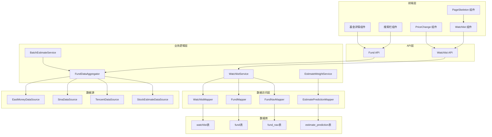
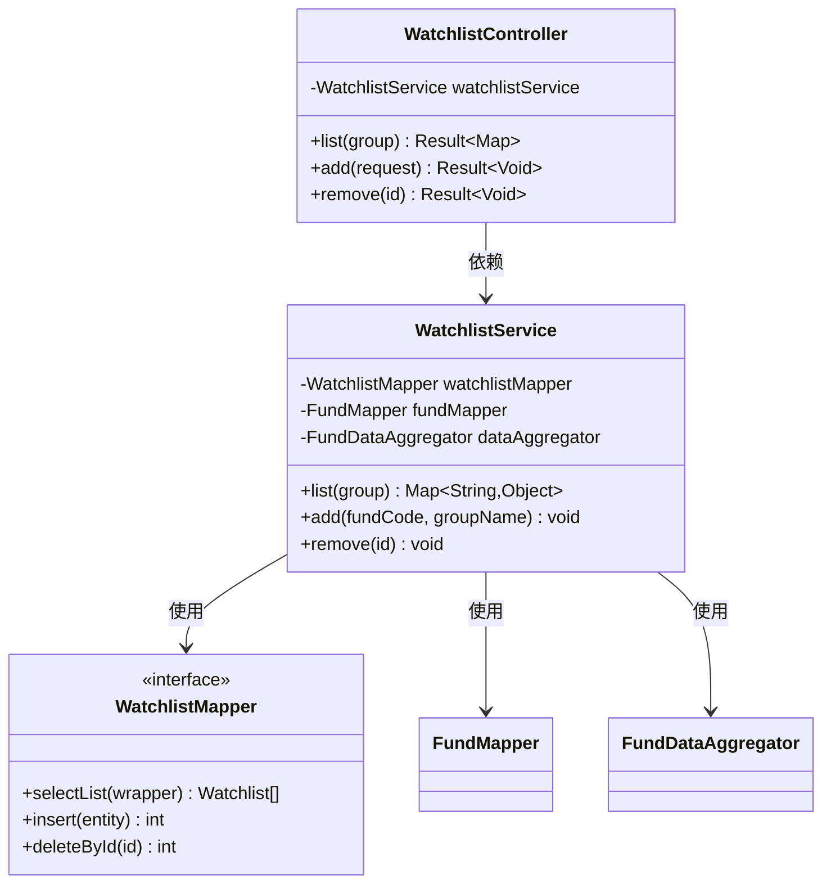
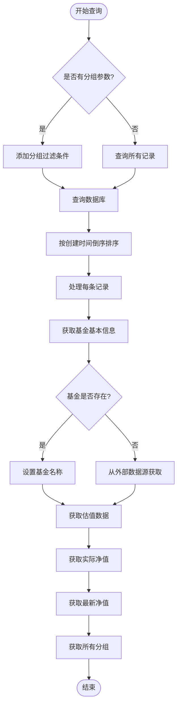
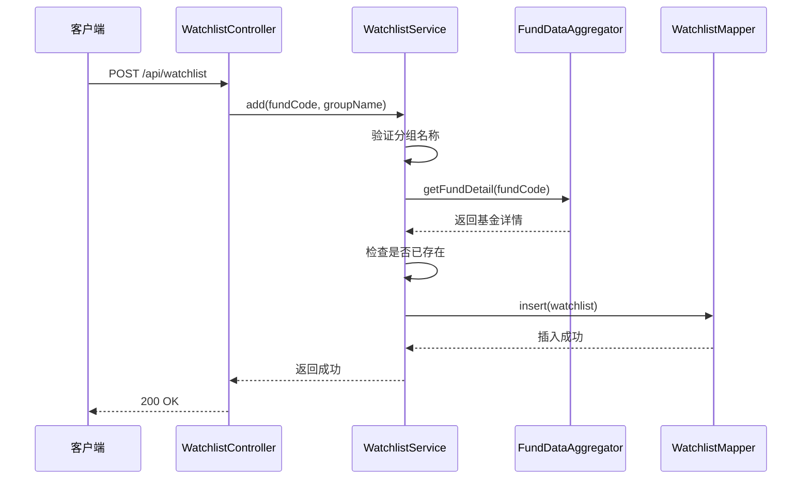
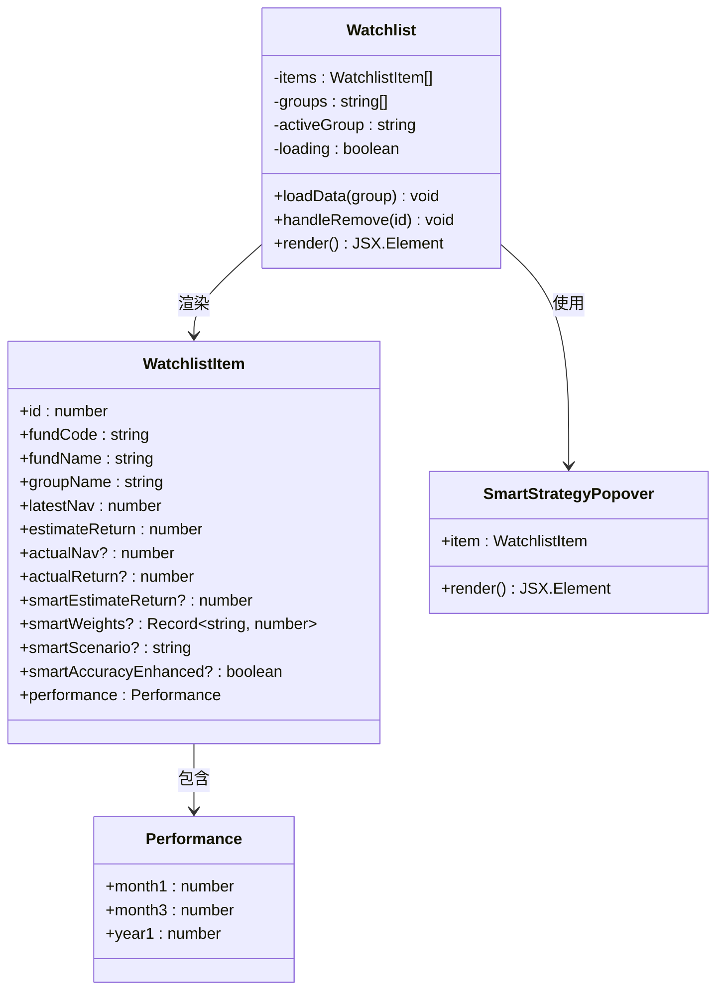
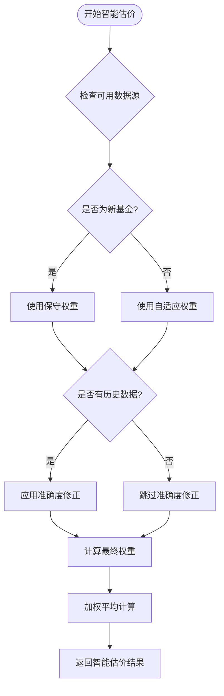
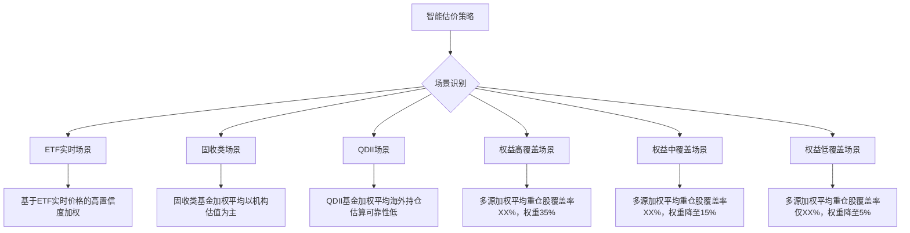
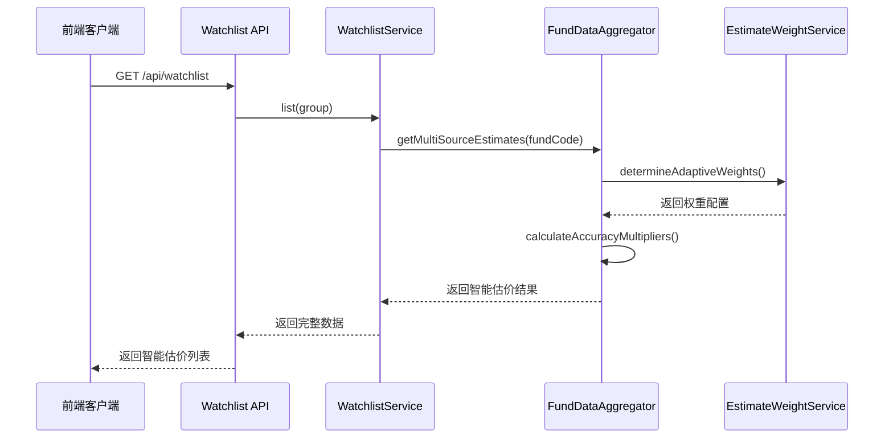
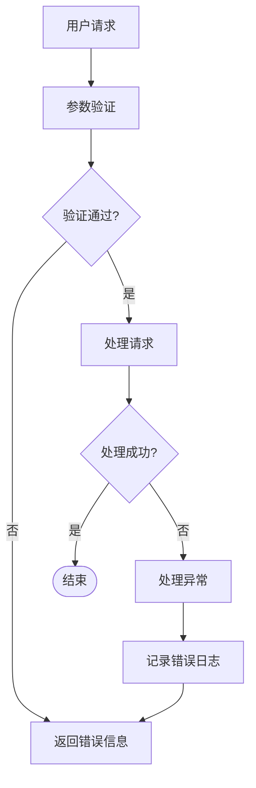

# 自选股增强

<cite>
**本文档引用的文件**
- [WatchlistController.java](file://src/main/java/com/qoder/fund/controller/WatchlistController.java)
- [WatchlistService.java](file://src/main/java/com/qoder/fund/service/WatchlistService.java)
- [WatchlistMapper.java](file://src/main/java/com/qoder/fund/mapper/WatchlistMapper.java)
- [Watchlist.java](file://src/main/java/com/qoder/fund/entity/Watchlist.java)
- [AddWatchlistRequest.java](file://src/main/java/com/qoder/fund/dto/request/AddWatchlistRequest.java)
- [WatchlistDTO.java](file://src/main/java/com/qoder/fund/dto/WatchlistDTO.java)
- [Watchlist 组件](file://fund-web/src/pages/Watchlist/index.tsx)
- [Watchlist API](file://fund-web/src/api/watchlist.ts)
- [PriceChange 组件](file://fund-web/src/components/PriceChange.tsx)
- [PageSkeleton 组件](file://fund-web/src/components/PageSkeleton.tsx)
- [搜索栏组件](file://fund-web/src/components/SearchBar.tsx)
- [基金详情组件](file://fund-web/src/pages/Fund/FundDetail.tsx)
- [FundDataAggregator.java](file://src/main/java/com/qoder/fund/datasource/FundDataAggregator.java)
- [EstimateWeightService.java](file://src/main/java/com/qoder/fund/service/EstimateWeightService.java)
- [BatchEstimateService.java](file://src/main/java/com/qoder/fund/service/BatchEstimateService.java)
- [EastMoneyDataSource.java](file://src/main/java/com/qoder/fund/datasource/EastMoneyDataSource.java)
- [schema.sql](file://src/main/resources/db/schema.sql)
- [application.yml](file://src/main/resources/application.yml)
- [PRD.md](file://PRD.md)
</cite>

## 更新摘要
**所做更改**
- 更新了自选股页面的界面设计和交互功能
- 新增了智能估价系统和权重可视化展示
- 增强了数据源说明和策略解释功能
- 改进了用户界面的视觉效果和交互体验

## 目录
1. [项目概述](#项目概述)
2. [Watchlist 功能架构](#watchlist-功能架构)
3. [后端服务分析](#后端服务分析)
4. [前端组件分析](#前端组件分析)
5. [智能估价系统](#智能估价系统)
6. [数据流分析](#数据流分析)
7. [性能优化建议](#性能优化建议)
8. [扩展功能建议](#扩展功能建议)
9. [故障排除指南](#故障排除指南)
10. [总结](#总结)

## 项目概述

Watchlist（自选清单）功能是基金管理系统中的核心模块之一，为用户提供关注但未购买的基金管理能力。该功能允许用户添加感兴趣的基金到自选列表，查看基金的实时估值和历史表现，并支持分组管理。

根据PRD文档，Watchlist功能属于P0级别的核心功能，必须在MVP版本中实现。该功能包括添加自选、自选列表展示、分组管理和排序筛选等核心特性。

**重大更新**：自选股页面进行了全面重设计，增强了用户界面和交互功能，新增了智能估价系统和权重可视化展示。

## Watchlist 功能架构

### 整体架构图

**架构图来源**
- [WatchlistController.java:12-35](file://src/main/java/com/qoder/fund/controller/WatchlistController.java#L12-L35)
- [WatchlistService.java:19-113](file://src/main/java/com/qoder/fund/service/WatchlistService.java#L19-L113)
- [FundDataAggregator.java:34-43](file://src/main/java/com/qoder/fund/datasource/FundDataAggregator.java#L34-L43)
- [EstimateWeightService.java:14-21](file://src/main/java/com/qoder/fund/service/EstimateWeightService.java#L14-L21)

## 后端服务分析

### WatchlistController 控制器

Watchlist控制器提供了RESTful API接口，负责处理自选基金相关的HTTP请求：

**类图来源**
- [WatchlistController.java:15-34](file://src/main/java/com/qoder/fund/controller/WatchlistController.java#L15-L34)
- [WatchlistService.java:22-26](file://src/main/java/com/qoder/fund/service/WatchlistService.java#L22-L26)
- [WatchlistMapper.java:7-9](file://src/main/java/com/qoder/fund/mapper/WatchlistMapper.java#L7-L9)

### WatchlistService 核心逻辑

WatchlistService实现了自选基金的核心业务逻辑，包括数据查询、添加和删除操作：

**列表查询流程**：

**添加自选流程**：

**添加自选流程图来源**
- [WatchlistService.java:87-108](file://src/main/java/com/qoder/fund/service/WatchlistService.java#L87-L108)
- [WatchlistController.java:24-28](file://src/main/java/com/qoder/fund/controller/WatchlistController.java#L24-L28)

**Section sources**
- [WatchlistController.java:15-34](file://src/main/java/com/qoder/fund/controller/WatchlistController.java#L15-L34)
- [WatchlistService.java:28-113](file://src/main/java/com/qoder/fund/service/WatchlistService.java#L28-L113)
- [AddWatchlistRequest.java:7-13](file://src/main/java/com/qoder/fund/dto/request/AddWatchlistRequest.java#L7-L13)

### 数据模型设计

Watchlist实体类定义了自选基金的数据结构：

| 字段名 | 类型 | 说明 | 约束 |
|--------|------|------|------|
| id | Long | 主键ID | 自增 |
| fundCode | String | 基金代码 | 非空 |
| groupName | String | 分组名称 | 默认'默认' |
| createdAt | LocalDateTime | 创建时间 | 自动设置 |

**Section sources**
- [Watchlist.java:12-20](file://src/main/java/com/qoder/fund/entity/Watchlist.java#L12-L20)
- [schema.sql:69-77](file://src/main/resources/db/schema.sql#L69-L77)

## 前端组件分析

### Watchlist 组件实现

前端Watchlist组件提供了完整的自选基金管理界面，经过全面重设计：

**组件功能特性**：
- 分组标签页管理：支持按分组筛选显示
- 智能估价展示：实时显示智能预估涨跌幅
- 权重可视化：展示各数据源权重构成
- 策略说明：解释智能估价的计算逻辑
- 实时数据展示：净值、估值、实际净值对比
- 交互操作：添加自选、移除、查看详情
- 性能指标：近1月、3月、1年收益展示

**Section sources**
- [Watchlist 组件:78-205](file://fund-web/src/pages/Watchlist/index.tsx#L78-L205)
- [Watchlist API:29-42](file://fund-web/src/api/watchlist.ts#L29-L42)

### API 接口设计

前端通过watchlistApi与后端进行数据交互：

| 接口 | 方法 | 参数 | 返回值 | 说明 |
|------|------|------|--------|------|
| /api/watchlist | GET | group: string | WatchlistData | 获取自选列表 |
| /api/watchlist | POST | AddWatchlistRequest | void | 添加自选基金 |
| /api/watchlist/{id} | DELETE | id: number | void | 删除自选基金 |
| /api/watchlist/check | GET | codes: string[] | string[] | 检查基金是否存在 |

**Section sources**
- [Watchlist API:29-42](file://fund-web/src/api/watchlist.ts#L29-L42)

### 用户界面增强功能

**新增功能**：
- 智能估价标签：显示"智能预估"标签
- 权重可视化条：展示各数据源权重分布
- 策略说明弹窗：点击问号图标查看详细说明
- 加载骨架屏：改善首次加载体验
- 响应式布局：适配不同屏幕尺寸

**Section sources**
- [Watchlist 组件:10-76](file://fund-web/src/pages/Watchlist/index.tsx#L10-L76)
- [PageSkeleton 组件:8-67](file://fund-web/src/components/PageSkeleton.tsx#L8-L67)

## 智能估价系统

### 智能估价算法

系统实现了先进的多数据源智能估价系统，通过自适应权重计算提供更准确的实时估值：

### 权重计算策略

系统根据基金类型和持仓覆盖率自动确定权重分配：

| 基金类型 | 场景描述 | 权重分配 |
|----------|----------|----------|
| ETF实时 | ETF基金使用实时价格 | 重仓股: 70% |
| 固收类 | 债券/货币基金 | 机构估值: 45% |
| QDII | 海外投资基金 | 机构估值: 40% |
| 权益高覆盖 | 重仓股覆盖率≥60% | 重仓股: 35% |
| 权益中覆盖 | 30%≤重仓股覆盖率<60% | 重仓股: 15% |
| 权益低覆盖 | 重仓股覆盖率<30% | 重仓股: 5% |

### 策略说明系统

系统提供详细的策略说明，帮助用户理解智能估价的计算逻辑：

**Section sources**
- [FundDataAggregator.java:500-627](file://src/main/java/com/qoder/fund/datasource/FundDataAggregator.java#L500-L627)
- [EstimateWeightService.java:25-128](file://src/main/java/com/qoder/fund/service/EstimateWeightService.java#L25-L128)
- [EstimateWeightService.java:138-182](file://src/main/java/com/qoder/fund/service/EstimateWeightService.java#L138-L182)

## 数据流分析

### 数据聚合流程

FundDataAggregator负责整合多个数据源的信息，为Watchlist提供准确的数据：

### 智能估价数据流

智能估价系统的工作流程：

**数据源优先级**：
1. **主数据源**：东方财富/天天基金
2. **备用数据源**：新浪财经、腾讯财经
3. **兜底数据源**：基于重仓股实时行情加权估算

**Section sources**
- [FundDataAggregator.java:86-106](file://src/main/java/com/qoder/fund/datasource/FundDataAggregator.java#L86-L106)
- [EastMoneyDataSource.java:184-210](file://src/main/java/com/qoder/fund/datasource/EastMoneyDataSource.java#L184-L210)

## 性能优化建议

### 缓存策略优化

当前系统已实现多层缓存机制，建议进一步优化：

1. **Redis缓存集成**：在application.yml中配置Redis缓存
2. **缓存失效策略**：设置合理的TTL时间（建议300秒）
3. **缓存预热**：启动时预加载热门基金数据

### 数据查询优化

1. **索引优化**：确保watchlist表的group_name字段有索引
2. **分页查询**：对于大量数据时实现分页加载
3. **批量查询**：优化多基金数据的批量获取

### 前端性能优化

1. **虚拟滚动**：对于大量自选基金使用虚拟滚动
2. **懒加载**：延迟加载非关键资源
3. **数据压缩**：启用Gzip压缩减少传输体积
4. **权重可视化优化**：使用CSS动画替代JavaScript动画

### 智能估价性能优化

1. **并发处理**：利用BatchEstimateService进行批量处理
2. **权重缓存**：缓存权重计算结果
3. **准确度修正缓存**：缓存历史准确度数据

**Section sources**
- [BatchEstimateService.java:24-34](file://src/main/java/com/qoder/fund/service/BatchEstimateService.java#L24-L34)
- [BatchEstimateService.java:180-200](file://src/main/java/com/qoder/fund/service/BatchEstimateService.java#L180-L200)

## 扩展功能建议

### 分组管理增强

1. **动态分组**：支持用户自定义分组名称和颜色
2. **分组排序**：支持自定义分组显示顺序
3. **分组统计**：显示每个分组的基金数量和平均收益

### 通知提醒功能

1. **涨跌提醒**：设置涨跌阈值提醒
2. **净值更新提醒**：基金净值更新时通知
3. **定期报告**：发送周报/月报邮件

### 高级分析功能

1. **收益对比**：与其他基金的收益对比分析
2. **风险评估**：基于历史波动率的风险评估
3. **投资建议**：基于机器学习的智能推荐

### 用户体验增强

1. **主题切换**：支持深色/浅色主题切换
2. **个性化设置**：支持用户自定义显示选项
3. **快捷操作**：支持键盘快捷键操作

## 故障排除指南

### 常见问题及解决方案

**问题1：添加自选失败**
- 检查基金代码是否正确
- 确认基金是否已在自选列表中
- 验证网络连接和数据源可用性

**问题2：数据显示异常**
- 清除浏览器缓存
- 检查数据源接口状态
- 验证数据库连接

**问题3：智能估价不准确**
- 检查基金类型识别是否正确
- 验证重仓股覆盖率数据
- 确认历史准确度数据是否充足

**问题4：权重可视化显示异常**
- 检查CSS样式是否正确加载
- 验证权重数据格式
- 确认浏览器兼容性

### 错误处理机制

系统实现了完善的错误处理机制：

**Section sources**
- [WatchlistService.java:92-99](file://src/main/java/com/qoder/fund/service/WatchlistService.java#L92-L99)

## 总结

Watchlist功能作为基金管理系统的核心模块，经过全面重设计后实现了更强大的自选基金管理能力。通过引入智能估价系统、权重可视化展示和增强的用户界面，为用户提供了更加专业和友好的自选基金管理体验。

系统的主要优势包括：
- **智能估价系统**：通过多数据源加权计算提供更准确的实时估值
- **权重可视化**：直观展示各数据源的权重分配和计算逻辑
- **策略说明**：详细解释智能估价的计算原理和适用场景
- **增强界面**：现代化的设计和流畅的交互体验
- **完整的功能覆盖**：支持添加、删除、分组、查询等核心功能
- **多数据源保障**：通过多个数据源确保数据的准确性和可靠性
- **良好的用户体验**：直观的界面设计和流畅的操作体验
- **可扩展性强**：模块化设计便于后续功能扩展

未来可以考虑增加更多智能化功能，如基于AI的投资建议、个性化提醒等，进一步提升用户体验和产品价值。

**重大更新亮点**：
- 全面重设计的自选股页面界面
- 智能估价系统的深度集成
- 权重可视化和策略说明功能
- 加载骨架屏和响应式布局优化
- 更丰富的数据展示和交互功能