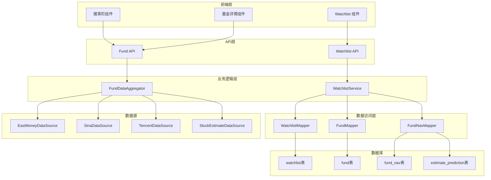
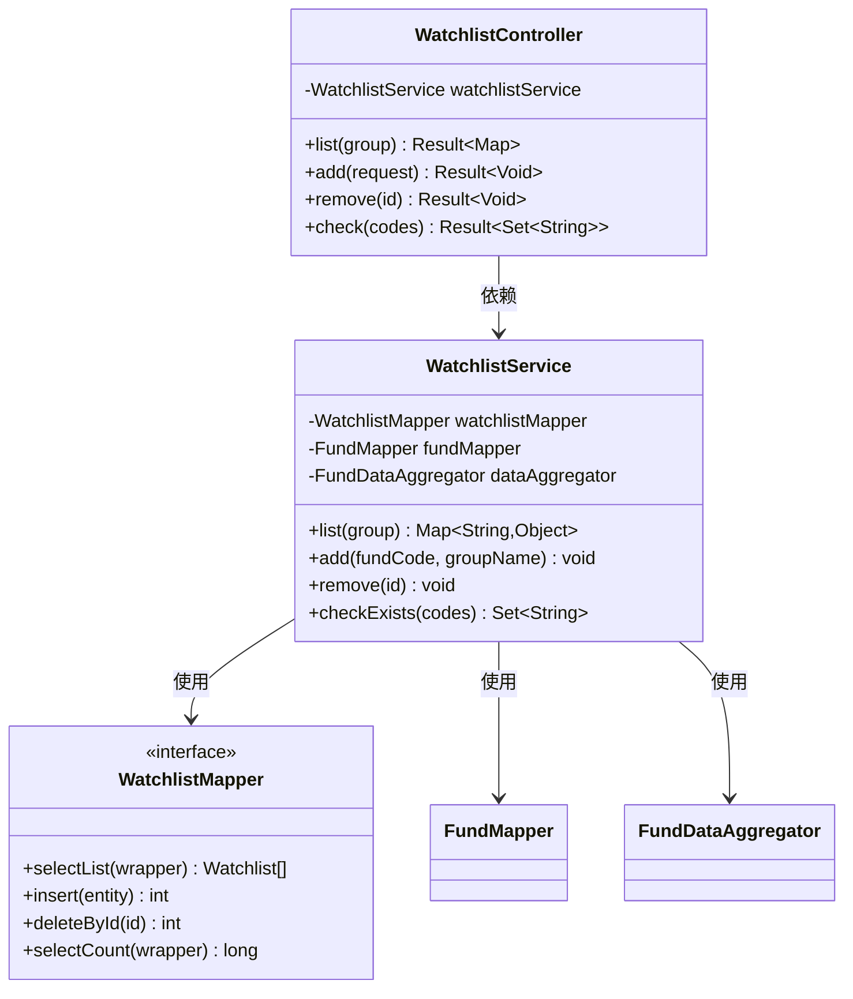
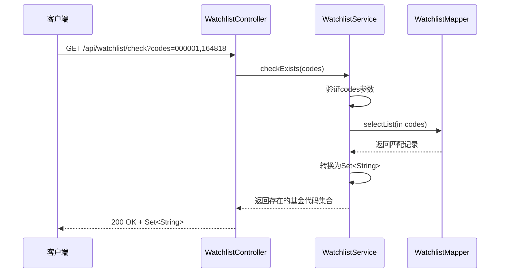
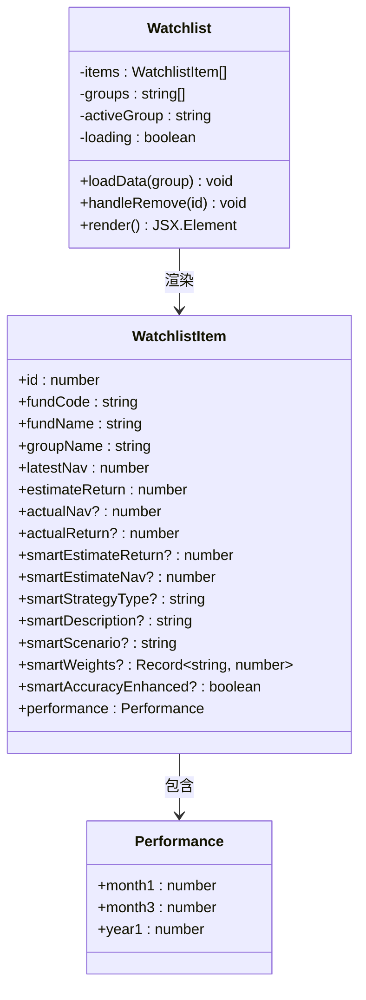
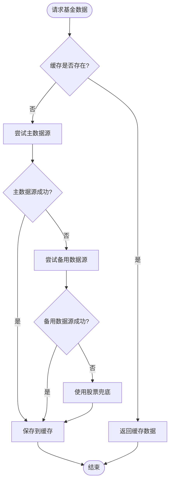
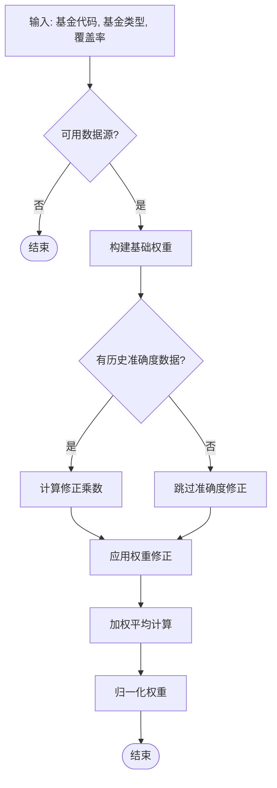
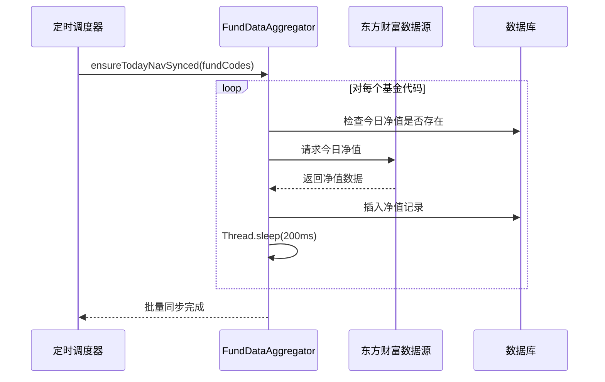

# Watchlist Enhancement

<cite>
**本文档引用的文件**
- [WatchlistController.java](file://src/main/java/com/qoder/fund/controller/WatchlistController.java)
- [WatchlistService.java](file://src/main/java/com/qoder/fund/service/WatchlistService.java)
- [WatchlistMapper.java](file://src/main/java/com/qoder/fund/mapper/WatchlistMapper.java)
- [Watchlist.java](file://src/main/java/com/qoder/fund/entity/Watchlist.java)
- [AddWatchlistRequest.java](file://src/main/java/com/qoder/fund/dto/request/AddWatchlistRequest.java)
- [WatchlistDTO.java](file://src/main/java/com/qoder/fund/dto/WatchlistDTO.java)
- [EstimateSourceDTO.java](file://src/main/java/com/qoder/fund/dto/EstimateSourceDTO.java)
- [Watchlist 组件](file://fund-web/src/pages/Watchlist/index.tsx)
- [Watchlist API](file://fund-web/src/api/watchlist.ts)
- [搜索栏组件](file://fund-web/src/components/SearchBar.tsx)
- [基金详情组件](file://fund-web/src/pages/Fund/FundDetail.tsx)
- [FundDataAggregator.java](file://src/main/java/com/qoder/fund/datasource/FundDataAggregator.java)
- [EastMoneyDataSource.java](file://src/main/java/com/qoder/fund/datasource/EastMoneyDataSource.java)
- [schema.sql](file://src/main/resources/db/schema.sql)
- [application.yml](file://src/main/resources/application.yml)
- [PRD.md](file://PRD.md)
</cite>

## 更新摘要
**变更内容**
- 新增批量检查功能，支持同时检查多个基金代码的存在性
- 优化数据流处理，增强智能综合预估算法的准确性
- 新增批量预同步功能，提升数据一致性
- 增强前端智能预估展示，提供权重分析和场景解释

## 目录
1. [项目概述](#项目概述)
2. [Watchlist 功能架构](#watchlist-功能架构)
3. [后端服务分析](#后端服务分析)
4. [前端组件分析](#前端组件分析)
5. [数据流分析](#数据流分析)
6. [性能优化建议](#性能优化建议)
7. [扩展功能建议](#扩展功能建议)
8. [故障排除指南](#故障排除指南)
9. [总结](#总结)

## 项目概述

Watchlist（自选清单）功能是基金管理系统中的核心模块之一，为用户提供关注但未购买的基金管理能力。该功能允许用户添加感兴趣的基金到自选列表，查看基金的实时估值和历史表现，并支持分组管理。

根据PRD文档，Watchlist功能属于P0级别的核心功能，必须在MVP版本中实现。该功能包括添加自选、自选列表展示、分组管理和排序筛选等核心特性。

**更新** 新增批量检查功能和智能预估算法优化，显著提升了系统的数据处理能力和用户体验。

## Watchlist 功能架构

### 整体架构图

**架构图来源**
- [WatchlistController.java:12-42](file://src/main/java/com/qoder/fund/controller/WatchlistController.java#L12-L42)
- [WatchlistService.java:19-138](file://src/main/java/com/qoder/fund/service/WatchlistService.java#L19-L138)
- [FundDataAggregator.java:34-43](file://src/main/java/com/qoder/fund/datasource/FundDataAggregator.java#L34-L43)

## 后端服务分析

### WatchlistController 控制器

Watchlist控制器提供了RESTful API接口，负责处理自选基金相关的HTTP请求：

**类图来源**
- [WatchlistController.java:15-42](file://src/main/java/com/qoder/fund/controller/WatchlistController.java#L15-L42)
- [WatchlistService.java:22-26](file://src/main/java/com/qoder/fund/service/WatchlistService.java#L22-L26)
- [WatchlistMapper.java:7-9](file://src/main/java/com/qoder/fund/mapper/WatchlistMapper.java#L7-L9)

### WatchlistService 核心逻辑

WatchlistService实现了自选基金的核心业务逻辑，包括数据查询、添加、删除和批量检查操作：

**列表查询流程**：

**批量检查流程**：

**批量检查流程图来源**
- [WatchlistService.java:127-136](file://src/main/java/com/qoder/fund/service/WatchlistService.java#L127-L136)
- [WatchlistController.java:38-41](file://src/main/java/com/qoder/fund/controller/WatchlistController.java#L38-L41)

**Section sources**
- [WatchlistController.java:15-42](file://src/main/java/com/qoder/fund/controller/WatchlistController.java#L15-L42)
- [WatchlistService.java:28-138](file://src/main/java/com/qoder/fund/service/WatchlistService.java#L28-L138)
- [AddWatchlistRequest.java:7-13](file://src/main/java/com/qoder/fund/dto/request/AddWatchlistRequest.java#L7-L13)

### 数据模型设计

Watchlist实体类定义了自选基金的数据结构：

| 字段名 | 类型 | 说明 | 约束 |
|--------|------|------|------|
| id | Long | 主键ID | 自增 |
| fundCode | String | 基金代码 | 非空 |
| groupName | String | 分组名称 | 默认'默认' |
| createdAt | LocalDateTime | 创建时间 | 自动设置 |

**Section sources**
- [Watchlist.java:12-20](file://src/main/java/com/qoder/fund/entity/Watchlist.java#L12-L20)
- [schema.sql:70-78](file://src/main/resources/db/schema.sql#L70-L78)

## 前端组件分析

### Watchlist 组件实现

前端Watchlist组件提供了完整的自选基金管理界面：

**组件功能特性**：
- 分组标签页管理：支持按分组筛选显示
- 实时数据展示：净值、估值、实际净值对比
- 智能预估展示：显示智能综合预估和权重分析
- 交互操作：添加自选、移除、查看详情
- 性能指标：近1月、3月、1年收益展示

**Section sources**
- [Watchlist 组件:76-198](file://fund-web/src/pages/Watchlist/index.tsx#L76-L198)
- [Watchlist API:28-40](file://fund-web/src/api/watchlist.ts#L28-L40)

### API 接口设计

前端通过watchlistApi与后端进行数据交互：

| 接口 | 方法 | 参数 | 返回值 | 说明 |
|------|------|------|--------|------|
| /api/watchlist | GET | group: string | WatchlistData | 获取自选列表 |
| /api/watchlist | POST | AddWatchlistRequest | void | 添加自选基金 |
| /api/watchlist/{id} | DELETE | id: number | void | 删除自选基金 |
| /api/watchlist/check | GET | codes: string[] | string[] | 批量检查基金存在性 |

**Section sources**
- [Watchlist API:28-40](file://fund-web/src/api/watchlist.ts#L28-L40)

## 数据流分析

### 数据聚合流程

FundDataAggregator负责整合多个数据源的信息，为Watchlist提供准确的数据：

**智能综合预估算法**：

**数据源优先级**：
1. **主数据源**：东方财富/天天基金
2. **备用数据源**：新浪财经、腾讯财经
3. **兜底数据源**：基于重仓股实时行情加权估算

**Section sources**
- [FundDataAggregator.java:86-106](file://src/main/java/com/qoder/fund/datasource/FundDataAggregator.java#L86-L106)
- [FundDataAggregator.java:542-620](file://src/main/java/com/qoder/fund/datasource/FundDataAggregator.java#L542-L620)
- [EastMoneyDataSource.java:184-210](file://src/main/java/com/qoder/fund/datasource/EastMoneyDataSource.java#L184-L210)

### 批量数据处理优化

**批量预同步机制**：

**Section sources**
- [FundDataAggregator.java:495-540](file://src/main/java/com/qoder/fund/datasource/FundDataAggregator.java#L495-L540)

## 性能优化建议

### 缓存策略优化

当前系统已实现多层缓存机制，建议进一步优化：

1. **Redis缓存集成**：在application.yml中配置Redis缓存
2. **缓存失效策略**：设置合理的TTL时间（建议300秒）
3. **缓存预热**：启动时预加载热门基金数据

### 数据查询优化

1. **索引优化**：确保watchlist表的group_name字段有索引
2. **分页查询**：对于大量数据时实现分页加载
3. **批量查询**：优化多基金数据的批量获取
4. **批量检查优化**：使用IN查询替代多次单点查询

### 前端性能优化

1. **虚拟滚动**：对于大量自选基金使用虚拟滚动
2. **懒加载**：延迟加载非关键资源
3. **数据压缩**：启用Gzip压缩减少传输体积
4. **智能预估缓存**：前端缓存智能预估结果

## 扩展功能建议

### 分组管理增强

1. **动态分组**：支持用户自定义分组名称和颜色
2. **分组排序**：支持自定义分组显示顺序
3. **分组统计**：显示每个分组的基金数量和平均收益

### 通知提醒功能

1. **涨跌提醒**：设置涨跌阈值提醒
2. **净值更新提醒**：基金净值更新时通知
3. **定期报告**：发送周报/月报邮件

### 高级分析功能

1. **收益对比**：与其他基金的收益对比分析
2. **风险评估**：基于历史波动率的风险评估
3. **投资建议**：基于机器学习的智能推荐

### 批量操作功能

1. **批量添加**：支持一次添加多个基金到自选列表
2. **批量删除**：支持批量移除自选基金
3. **批量检查优化**：提供更高效的批量检查API

## 故障排除指南

### 常见问题及解决方案

**问题1：添加自选失败**
- 检查基金代码是否正确
- 确认基金是否已在自选列表中
- 验证网络连接和数据源可用性

**问题2：数据显示异常**
- 清除浏览器缓存
- 检查数据源接口状态
- 验证数据库连接

**问题3：性能问题**
- 检查服务器资源使用情况
- 优化数据库查询语句
- 启用缓存机制

**问题4：批量检查功能异常**
- 验证codes参数格式
- 检查数据库连接
- 确认IN查询语法正确

### 错误处理机制

系统实现了完善的错误处理机制：

**Section sources**
- [WatchlistService.java:92-99](file://src/main/java/com/qoder/fund/service/WatchlistService.java#L92-L99)

## 总结

Watchlist功能作为基金管理系统的核心模块，实现了完整的自选基金管理能力。通过前后端分离的设计，采用RESTful API接口，结合多数据源聚合的技术，为用户提供了稳定可靠的自选基金管理体验。

**更新** 系统现已具备以下增强功能：

### 核心功能增强
- **批量检查功能**：支持同时检查多个基金代码的存在性，显著提升批量操作效率
- **智能预估算法**：基于自适应权重和历史准确度修正，提供更精准的估值预测
- **批量数据同步**：优化数据一致性，减少API限流影响
- **权重可视化展示**：前端提供智能预估的权重分析和场景解释

### 技术架构优化
- **多数据源聚合**：通过多个数据源确保数据的准确性和可靠性
- **智能缓存策略**：多层次缓存机制提升系统性能
- **自适应权重算法**：根据不同基金类型和持仓覆盖率动态调整权重
- **历史准确度追踪**：基于预测误差(MAE)动态修正权重

### 用户体验提升
- **直观的界面设计**：清晰展示智能预估结果和权重构成
- **流畅的操作体验**：优化的批量操作和数据同步机制
- **可扩展性强**：模块化设计便于后续功能扩展

未来可以考虑增加更多智能化功能，如基于AI的投资建议、个性化提醒等，进一步提升用户体验和产品价值。