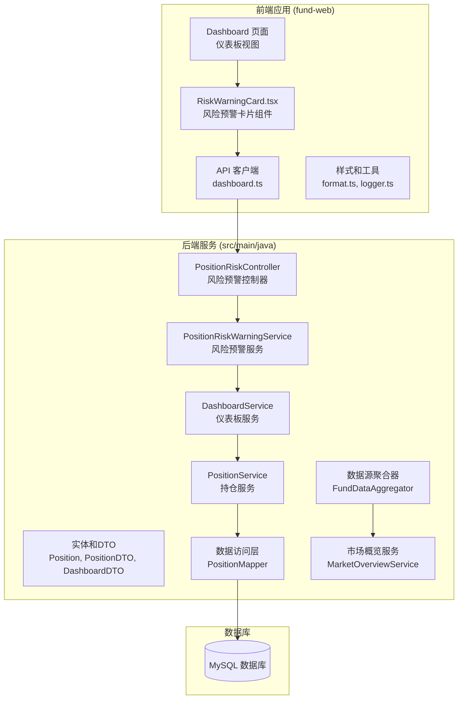
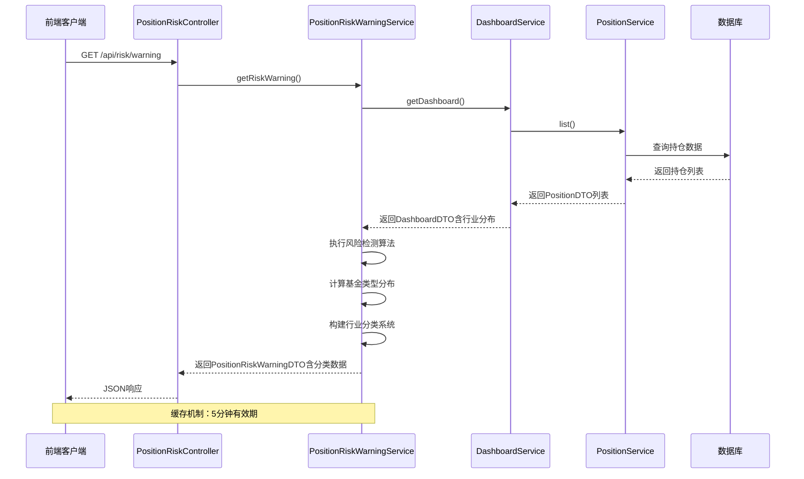
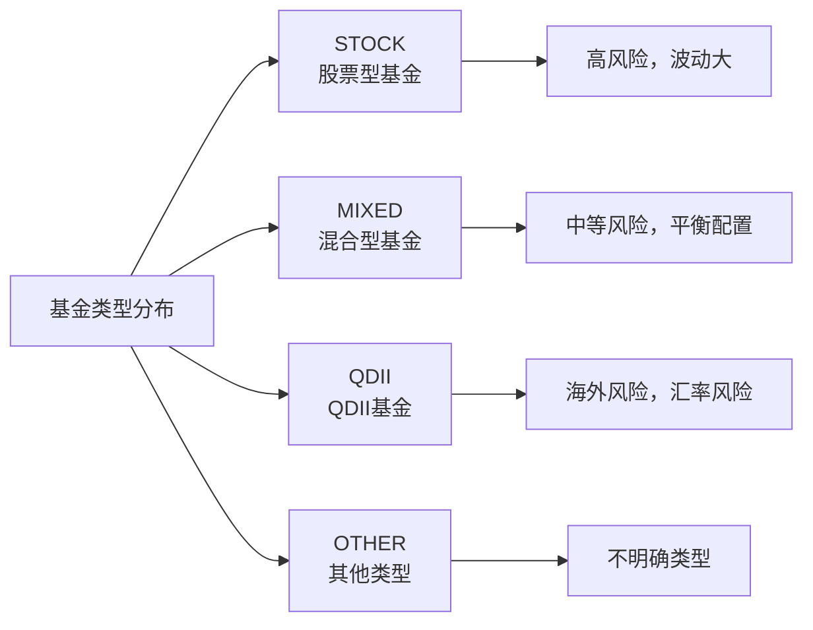
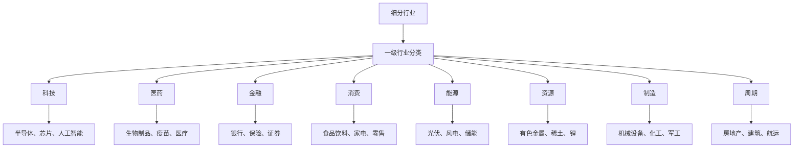
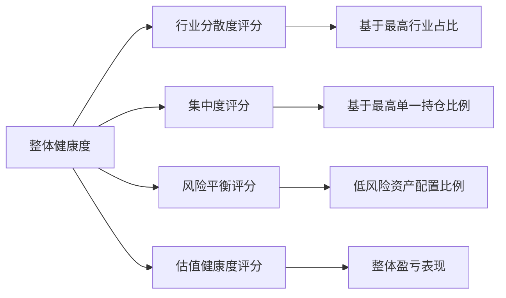
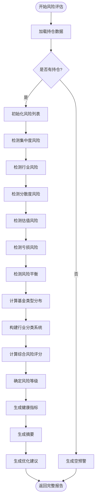
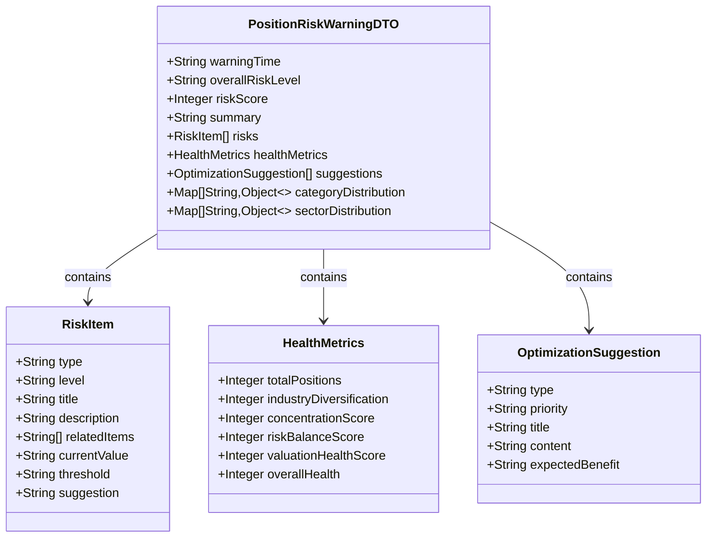
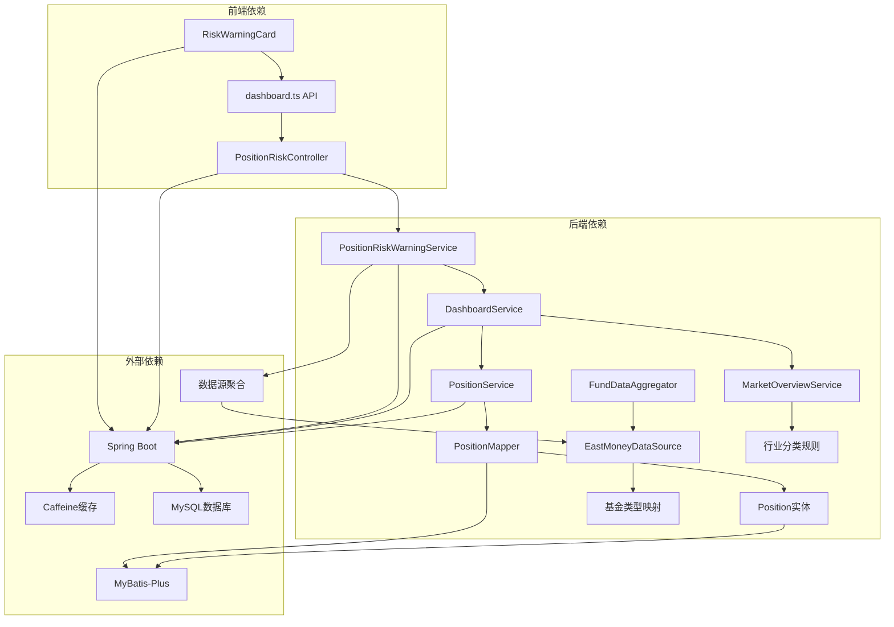

# 仓位风险警告服务

<cite>
**本文档引用的文件**
- [PositionRiskController.java](file://src/main/java/com/qoder/fund/controller/PositionRiskController.java)
- [PositionRiskWarningService.java](file://src/main/java/com/qoder/fund/service/PositionRiskWarningService.java)
- [PositionRiskWarningDTO.java](file://src/main/java/com/qoder/fund/dto/PositionRiskWarningDTO.java)
- [RiskWarningCard.tsx](file://fund-web/src/components/RiskWarningCard.tsx)
- [Position.java](file://src/main/java/com/qoder/fund/entity/Position.java)
- [PositionDTO.java](file://src/main/java/com/qoder/fund/dto/PositionDTO.java)
- [DashboardDTO.java](file://src/main/java/com/qoder/fund/dto/DashboardDTO.java)
- [DashboardService.java](file://src/main/java/com/qoder/fund/service/DashboardService.java)
- [PositionService.java](file://src/main/java/com/qoder/fund/service/PositionService.java)
- [PositionMapper.java](file://src/main/java/com/qoder/fund/mapper/PositionMapper.java)
- [dashboard.ts](file://fund-web/src/api/dashboard.ts)
- [application.yml](file://src/main/resources/application.yml)
- [index.tsx](file://fund-web/src/pages/Dashboard/index.tsx)
- [EastMoneyDataSource.java](file://src/main/java/com/qoder/fund/datasource/EastMoneyDataSource.java)
- [MarketOverviewService.java](file://src/main/java/com/qoder/fund/service/MarketOverviewService.java)
</cite>

## 更新摘要
**变更内容**
- 新增基金类型分布分析功能（按STOCK、MIXED、QDII、OTHER分类）
- 新增行业分类系统（将细分行业聚合为一级大类）
- 更新风险检测算法和阈值配置说明
- 增强健康指标评分体系的详细说明
- 完善风险预警服务的架构分析

## 目录
1. [简介](#简介)
2. [项目结构](#项目结构)
3. [核心组件](#核心组件)
4. [架构概览](#架构概览)
5. [详细组件分析](#详细组件分析)
6. [依赖关系分析](#依赖关系分析)
7. [性能考量](#性能考量)
8. [故障排除指南](#故障排除指南)
9. [结论](#结论)

## 简介

仓位风险警告服务是一个基于规则引擎的风险管理系统，旨在帮助投资者识别和管理投资组合中的潜在风险。该系统通过分析持仓集中度、行业分布、分散程度、估值水平、亏损状况和风险平衡等多个维度，为用户提供全面的风险预警和优化建议。

系统采用前后端分离架构，后端使用Spring Boot提供RESTful API服务，前端使用React构建用户界面，实现了实时的风险监控和可视化展示。该服务专门提供组合层面的风险评估，包括集中度检测、行业分散度分析、估值健康评分和**新增的基金类型分布分析**等功能。

**更新** 系统现已支持**行业分类系统**，将细分行业聚合为一级大类（科技、医药、金融、消费、能源、资源、制造、周期），提供更全面的投资组合风险评估。

## 项目结构

该项目采用典型的三层架构设计，分为前端Web应用和后端服务两大部分：



**图表来源**
- [RiskWarningCard.tsx:1-229](file://fund-web/src/components/RiskWarningCard.tsx#L1-L229)
- [PositionRiskController.java:1-41](file://src/main/java/com/qoder/fund/controller/PositionRiskController.java#L1-L41)
- [PositionRiskWarningService.java:1-845](file://src/main/java/com/qoder/fund/service/PositionRiskWarningService.java#L1-L845)

**章节来源**
- [application.yml:1-68](file://src/main/resources/application.yml#L1-L68)

## 核心组件

### 后端核心组件

1. **PositionRiskController**: RESTful API控制器，提供风险预警查询接口
2. **PositionRiskWarningService**: 核心业务服务，实现风险检测算法和**新增的基金类型分布分析**
3. **DashboardService**: 提供仪表板数据聚合功能，包含**行业分类系统**
4. **PositionService**: 管理持仓数据和估值计算

### 前端核心组件

1. **RiskWarningCard**: 风险预警展示组件，提供可视化界面
2. **Dashboard 页面**: 主页面集成多个分析卡片
3. **API 客户端**: 封装HTTP请求和响应处理

**章节来源**
- [PositionRiskController.java:1-41](file://src/main/java/com/qoder/fund/controller/PositionRiskController.java#L1-L41)
- [PositionRiskWarningService.java:1-845](file://src/main/java/com/qoder/fund/service/PositionRiskWarningService.java#L1-L845)
- [RiskWarningCard.tsx:1-229](file://fund-web/src/components/RiskWarningCard.tsx#L1-L229)

## 架构概览

系统采用微服务架构模式，通过清晰的分层设计实现职责分离：



**图表来源**
- [PositionRiskController.java:28-39](file://src/main/java/com/qoder/fund/controller/PositionRiskController.java#L28-L39)
- [PositionRiskWarningService.java:47-107](file://src/main/java/com/qoder/fund/service/PositionRiskWarningService.java#L47-L107)
- [DashboardService.java:44-165](file://src/main/java/com/qoder/fund/service/DashboardService.java#L44-L165)

## 详细组件分析

### 风险预警服务 (PositionRiskWarningService)

该服务是整个系统的核心，实现了多维度的风险检测算法和**新增的分类分析功能**：

#### 风险检测维度

1. **单一持仓集中度风险**
   - 阈值：≥50%危险，≥30%警告
   - 影响：单一基金过度集中带来的系统性风险

2. **行业集中度风险**
   - 阈值：≥60%危险，≥40%警告
   - 影响：行业政策变化或市场波动对投资组合的冲击

3. **分散度风险**
   - 最低分散要求：≥3只基金
   - 过度分散：>15只基金的管理困难

4. **估值风险**
   - 基于短期涨幅异常检测
   - 阈值：同时≥3只基金涨幅>5%

5. **亏损风险**
   - 整体亏损：≤-20%严重，≤-10%高风险，≤-3%中等风险
   - 单基金亏损：≤-15%严重

6. **风险平衡**
   - 缺乏低风险资产配置的警告
   - 高风险基金占比过高的提醒

#### 新增功能：基金类型分布分析

系统现在支持按基金类型进行分类统计，支持以下类型：



**图表来源**
- [PositionRiskWarningService.java:526-565](file://src/main/java/com/qoder/fund/service/PositionRiskWarningService.java#L526-L565)

#### 新增功能：行业分类系统

系统实现了行业分类系统，将细分行业聚合为一级大类：



**图表来源**
- [PositionRiskWarningService.java:568-648](file://src/main/java/com/qoder/fund/service/PositionRiskWarningService.java#L568-L648)

#### 健康指标体系

系统提供四个维度的健康评分：



**图表来源**
- [PositionRiskWarningService.java:412-521](file://src/main/java/com/qoder/fund/service/PositionRiskWarningService.java#L412-L521)

#### 风险评分算法



**图表来源**
- [PositionRiskWarningService.java:47-107](file://src/main/java/com/qoder/fund/service/PositionRiskWarningService.java#L47-L107)

**章节来源**
- [PositionRiskWarningService.java:29-845](file://src/main/java/com/qoder/fund/service/PositionRiskWarningService.java#L29-L845)

### 前端风险预警组件 (RiskWarningCard)

前端组件负责将后端返回的风险数据进行可视化展示：

#### 组件特性

1. **实时数据获取**
   - 自动加载风险预警数据
   - 错误处理和静默失败机制

2. **风险等级可视化**
   - 高风险：红色边框和标签
   - 中风险：橙色边框和标签  
   - 低风险：绿色边框和标签

3. **健康指标展示**
   - 整体健康度百分比
   - 四个维度的进度条显示
   - 颜色编码的健康状态

4. **风险项列表**
   - 按严重程度排序
   - 每项风险的详细描述
   - 优化建议和预期效果

**章节来源**
- [RiskWarningCard.tsx:1-229](file://fund-web/src/components/RiskWarningCard.tsx#L1-L229)

### 数据模型设计

系统采用清晰的数据传输对象设计，**新增了分类分析相关的字段**：



**图表来源**
- [PositionRiskWarningDTO.java:11-172](file://src/main/java/com/qoder/fund/dto/PositionRiskWarningDTO.java#L11-L172)

**章节来源**
- [PositionRiskWarningDTO.java:1-172](file://src/main/java/com/qoder/fund/dto/PositionRiskWarningDTO.java#L1-L172)

## 依赖关系分析

系统采用模块化设计，各组件间依赖关系清晰：



**图表来源**
- [PositionRiskController.java:1-41](file://src/main/java/com/qoder/fund/controller/PositionRiskController.java#L1-L41)
- [PositionRiskWarningService.java:1-845](file://src/main/java/com/qoder/fund/service/PositionRiskWarningService.java#L1-L845)
- [PositionService.java:1-562](file://src/main/java/com/qoder/fund/service/PositionService.java#L1-L562)

**章节来源**
- [application.yml:29-36](file://src/main/resources/application.yml#L29-L36)

## 性能考量

### 缓存策略

系统实现了多层次的缓存机制：

1. **仪表板数据缓存**
   - 缓存键：`dashboard:main`
   - 过期时间：5分钟
   - 作用：减少频繁的数据聚合计算

2. **风险预警缓存**
   - 缓存键：`positionRiskWarning:current`
   - 过期时间：5分钟
   - 作用：避免重复的风险评估计算

3. **Caffeine缓存配置**
   - 最大容量：1000条记录
   - 写入后过期：300秒
   - 缓存管理器：analysisCacheManager

### 性能优化措施

1. **批量数据处理**
   - 使用批量查询减少数据库访问次数
   - 采用流式处理优化内存使用

2. **异步数据获取**
   - 前端并行加载多个数据源
   - 避免串行依赖导致的性能瓶颈

3. **智能估值降级**
   - 多源估值系统避免单点故障
   - 自动降级机制保证服务可用性

4. **分类计算优化**
   - 基金类型分布按市值加权计算
   - 行业分类系统使用预定义规则快速聚合

**章节来源**
- [PositionRiskWarningService.java:47-107](file://src/main/java/com/qoder/fund/service/PositionRiskWarningService.java#L47-L107)
- [DashboardService.java:44-165](file://src/main/java/com/qoder/fund/service/DashboardService.java#L44-L165)
- [application.yml:29-36](file://src/main/resources/application.yml#L29-L36)

## 故障排除指南

### 常见问题及解决方案

1. **风险预警数据为空**
   - 检查数据库连接配置
   - 验证持仓数据是否正常
   - 确认缓存服务运行状态

2. **API响应超时**
   - 检查后端服务日志
   - 验证数据库查询性能
   - 监控缓存命中率

3. **前端组件渲染异常**
   - 检查网络请求状态码
   - 验证API响应格式
   - 确认组件错误边界处理

4. **风险等级计算异常**
   - 验证阈值配置参数
   - 检查数据类型转换
   - 确认数学运算精度

5. **分类分析功能异常**
   - 检查基金类型映射配置
   - 验证行业分类规则
   - 确认数据源完整性

### 调试建议

1. **启用详细日志**
   ```yaml
   logging:
     level:
       com.qoder.fund: debug
   ```

2. **监控关键指标**
   - 缓存命中率
   - 数据库查询时间
   - API响应延迟

3. **性能基准测试**
   - 基准数据集上的性能测试
   - 并发场景下的稳定性验证
   - 内存使用情况监控

**章节来源**
- [application.yml:50-68](file://src/main/resources/application.yml#L50-L68)

## 结论

仓位风险警告服务通过精心设计的规则引擎和可视化界面，为投资者提供了全面的投资组合风险管理解决方案。系统的主要优势包括：

1. **多维度风险评估**：涵盖集中度、行业分布、分散程度、估值水平、亏损状况和风险平衡六个维度
2. **智能化预警机制**：基于阈值规则的自动化风险检测和分级
3. **实时可视化展示**：直观的风险等级和健康指标展示
4. **高性能架构设计**：缓存优化和批量处理确保系统响应速度
5. **可扩展性设计**：模块化的组件结构便于功能扩展和维护
6. **新增分类分析功能**：提供基金类型分布和行业分类系统，支持更全面的风险评估

**更新** 本版本文档已基于PositionRiskWarningService类的完整实现进行了更新，包含了最新的风险检测算法、阈值配置、健康指标评分体系以及**新增的基金类型分布分析和行业分类系统**的详细分析。

该系统不仅能够帮助投资者及时发现潜在风险，还能提供具体的优化建议，是现代投资组合管理的重要工具。通过持续的监控和优化，系统能够适应不断变化的市场环境，为投资者创造长期价值。