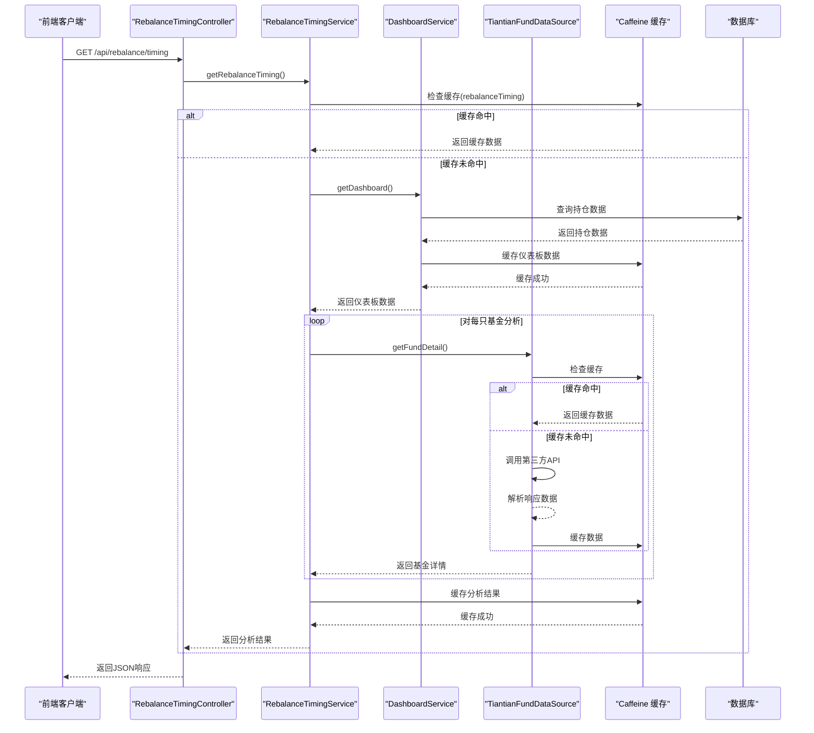
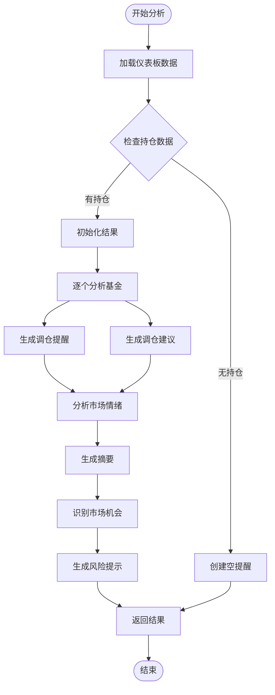
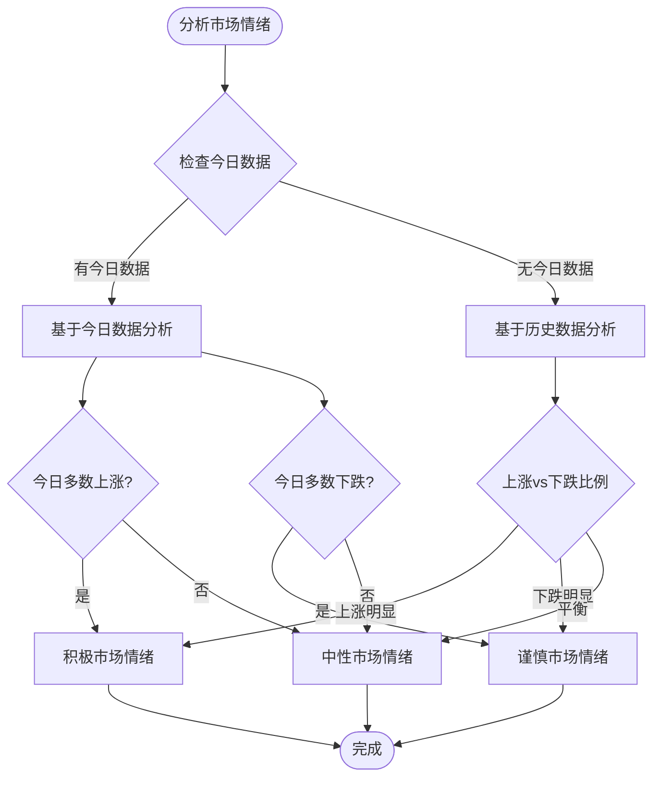
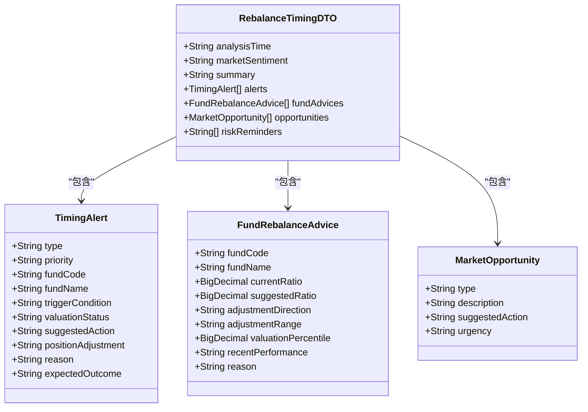
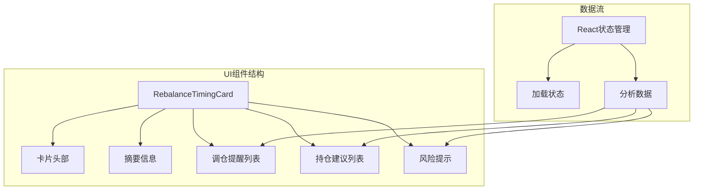
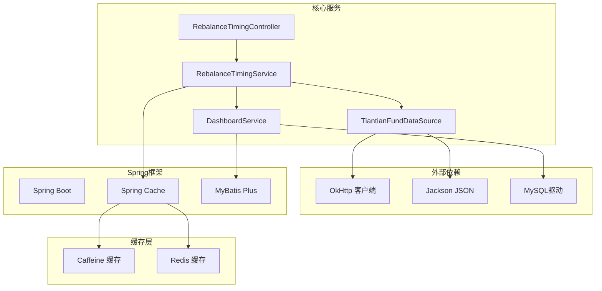

# 再平衡时机服务

<cite>
**本文档引用的文件**
- [RebalanceTimingController.java](file://src/main/java/com/qoder/fund/controller/RebalanceTimingController.java)
- [RebalanceTimingService.java](file://src/main/java/com/qoder/fund/service/RebalanceTimingService.java)
- [RebalanceTimingDTO.java](file://src/main/java/com/qoder/fund/dto/RebalanceTimingDTO.java)
- [RebalanceTimingCard.tsx](file://fund-web/src/components/RebalanceTimingCard.tsx)
- [dashboard.ts](file://fund-web/src/api/dashboard.ts)
- [TiantianFundDataSource.java](file://src/main/java/com/qoder/fund/datasource/TiantianFundDataSource.java)
- [DashboardService.java](file://src/main/java/com/qoder/fund/service/DashboardService.java)
- [CacheConfig.java](file://src/main/java/com/qoder/fund/config/CacheConfig.java)
- [application.yml](file://src/main/resources/application.yml)
- [index.tsx](file://fund-web/src/pages/Dashboard/index.tsx)
</cite>

## 目录
1. [简介](#简介)
2. [项目结构](#项目结构)
3. [核心组件](#核心组件)
4. [架构概览](#架构概览)
5. [详细组件分析](#详细组件分析)
6. [依赖关系分析](#依赖关系分析)
7. [性能考量](#性能考量)
8. [故障排除指南](#故障排除指南)
9. [结论](#结论)

## 简介

再平衡时机服务是基金管理系统中的一个核心功能模块，旨在为用户提供智能化的调仓时机建议。该服务通过综合分析用户的持仓情况、基金历史业绩、实时市场数据以及当前市场情绪，为投资者提供个性化的投资决策支持。

该服务采用多维度分析策略，结合技术面和基本面因素，帮助用户在合适的时机进行资产再平衡，优化投资组合配置，控制风险并提升收益潜力。

## 项目结构

再平衡时机服务在整个系统中采用分层架构设计，主要分布在以下层次：

```mermaid
graph TB
subgraph "前端层"
FE[React 前端应用]
RT[RebalanceTimingCard.tsx]
API[dashboard.ts]
end
subgraph "控制层"
CTRL[RebalanceTimingController]
end
subgraph "服务层"
RSVC[RebalanceTimingService]
DSVC[DashboardService]
TDS[TiantianFundDataSource]
end
subgraph "数据层"
DB[(MySQL 数据库)]
CACHE[Caffeine 缓存)
end
FE --> RT
RT --> API
API --> CTRL
CTRL --> RSVC
RSVC --> DSVC
RSVC --> TDS
DSVC --> DB
RSVC --> CACHE
DSVC --> CACHE
TDS --> CACHE
```

**图表来源**
- [RebalanceTimingController.java:1-41](file://src/main/java/com/qoder/fund/controller/RebalanceTimingController.java#L1-L41)
- [RebalanceTimingService.java:1-585](file://src/main/java/com/qoder/fund/service/RebalanceTimingService.java#L1-L585)
- [RebalanceTimingCard.tsx:1-231](file://fund-web/src/components/RebalanceTimingCard.tsx#L1-L231)

**章节来源**
- [RebalanceTimingController.java:1-41](file://src/main/java/com/qoder/fund/controller/RebalanceTimingController.java#L1-L41)
- [RebalanceTimingService.java:1-585](file://src/main/java/com/qoder/fund/service/RebalanceTimingService.java#L1-L585)
- [RebalanceTimingCard.tsx:1-231](file://fund-web/src/components/RebalanceTimingCard.tsx#L1-L231)

## 核心组件

再平衡时机服务由多个核心组件构成，每个组件都有明确的职责分工：

### 控制器层
- **RebalanceTimingController**: REST API 控制器，负责接收前端请求并返回调仓时机数据

### 服务层
- **RebalanceTimingService**: 主要业务逻辑服务，实现复杂的调仓时机分析算法
- **DashboardService**: 仪表板数据服务，提供用户持仓和市场概况数据
- **TiantianFundDataSource**: 第三方数据源，获取基金详细信息和历史业绩

### 数据传输对象
- **RebalanceTimingDTO**: 调仓时机数据传输对象，封装所有分析结果

### 前端组件
- **RebalanceTimingCard**: React 组件，负责展示调仓时机信息

**章节来源**
- [RebalanceTimingController.java:15-40](file://src/main/java/com/qoder/fund/controller/RebalanceTimingController.java#L15-L40)
- [RebalanceTimingService.java:24-585](file://src/main/java/com/qoder/fund/service/RebalanceTimingService.java#L24-L585)
- [RebalanceTimingDTO.java:8-182](file://src/main/java/com/qoder/fund/dto/RebalanceTimingDTO.java#L8-L182)
- [RebalanceTimingCard.tsx:18-231](file://fund-web/src/components/RebalanceTimingCard.tsx#L18-L231)

## 架构概览

再平衡时机服务采用分层架构，实现了清晰的关注点分离：



**图表来源**
- [RebalanceTimingController.java:28-39](file://src/main/java/com/qoder/fund/controller/RebalanceTimingController.java#L28-L39)
- [RebalanceTimingService.java:55-115](file://src/main/java/com/qoder/fund/service/RebalanceTimingService.java#L55-L115)
- [DashboardService.java:44-165](file://src/main/java/com/qoder/fund/service/DashboardService.java#L44-L165)
- [TiantianFundDataSource.java:41-71](file://src/main/java/com/qoder/fund/datasource/TiantianFundDataSource.java#L41-L71)

## 详细组件分析

### RebalanceTimingService 分析

RebalanceTimingService 是整个再平衡时机服务的核心，实现了复杂的多维度分析算法：

#### 核心分析流程



**图表来源**
- [RebalanceTimingService.java:56-115](file://src/main/java/com/qoder/fund/service/RebalanceTimingService.java#L56-L115)
- [RebalanceTimingService.java:121-238](file://src/main/java/com/qoder/fund/service/RebalanceTimingService.java#L121-L238)
- [RebalanceTimingService.java:244-315](file://src/main/java/com/qoder/fund/service/RebalanceTimingService.java#L244-L315)

#### 调仓时机分析算法

服务实现了五级优先级的调仓时机分析：

1. **今日暴涨 + 已有收益**: 最高优先级，建议部分止盈
2. **今日大跌**: 中等优先级，建议关注买入机会
3. **历史跌幅较大**: 中等优先级，建议定投或加仓
4. **历史涨幅较大**: 中等优先级，建议部分止盈
5. **持仓过重再平衡**: 低优先级，建议适当减仓

#### 市场情绪分析



**图表来源**
- [RebalanceTimingService.java:321-394](file://src/main/java/com/qoder/fund/service/RebalanceTimingService.java#L321-L394)

#### 调仓建议生成

服务根据基金历史业绩和当前持仓比例生成具体的调仓建议：

| 业绩表现 | 持仓比例 | 建议方向 | 建议比例 |
|---------|---------|---------|---------|
| 近期大幅下跌(-15%以下) | 任意 | 增加 | 15% |
| 表现优异(30%以上) | 持仓较重(>20%) | 减少 | 15% |
| 持仓过少(<3%) | 任意 | 增加 | 8% |
| 其他情况 | 任意 | 维持 | 当前比例 |

**章节来源**
- [RebalanceTimingService.java:121-238](file://src/main/java/com/qoder/fund/service/RebalanceTimingService.java#L121-L238)
- [RebalanceTimingService.java:244-315](file://src/main/java/com/qoder/fund/service/RebalanceTimingService.java#L244-L315)
- [RebalanceTimingService.java:321-394](file://src/main/java/com/qoder/fund/service/RebalanceTimingService.java#L321-L394)

### RebalanceTimingDTO 数据模型

RebalanceTimingDTO 定义了完整的数据传输结构：



**图表来源**
- [RebalanceTimingDTO.java:12-182](file://src/main/java/com/qoder/fund/dto/RebalanceTimingDTO.java#L12-L182)

**章节来源**
- [RebalanceTimingDTO.java:12-182](file://src/main/java/com/qoder/fund/dto/RebalanceTimingDTO.java#L12-L182)

### 前端组件 RebalanceTimingCard

前端组件负责用户界面展示：



**图表来源**
- [RebalanceTimingCard.tsx:18-231](file://fund-web/src/components/RebalanceTimingCard.tsx#L18-L231)

**章节来源**
- [RebalanceTimingCard.tsx:18-231](file://fund-web/src/components/RebalanceTimingCard.tsx#L18-L231)

## 依赖关系分析

再平衡时机服务的依赖关系体现了良好的架构设计：



**图表来源**
- [RebalanceTimingController.java:3-10](file://src/main/java/com/qoder/fund/controller/RebalanceTimingController.java#L3-L10)
- [RebalanceTimingService.java:3-10](file://src/main/java/com/qoder/fund/service/RebalanceTimingService.java#L3-L10)
- [TiantianFundDataSource.java:6-9](file://src/main/java/com/qoder/fund/datasource/TiantianFundDataSource.java#L6-L9)

### 缓存策略

系统采用了多层缓存策略来优化性能：

| 缓存类型 | 过期时间 | 缓存键 | 使用场景 |
|---------|---------|-------|---------|
| 热数据缓存 | 1分钟 | positionEstimate, watchlistEstimate | 实时估值数据 |
| 温数据缓存 | 5分钟 | dashboard, profitTrend, profitAnalysis | 常用查询数据 |
| 分析缓存 | 15分钟 | rebalanceTiming, aiFundDiagnosis | 分析类数据 |
| 市场缓存 | 5分钟 | marketOverview | 市场概览数据 |
| 冷数据缓存 | 1小时 | fundSearchHistory | 历史搜索数据 |
| 持久缓存 | 24小时 | fundBasicInfo | 基本信息数据 |

**章节来源**
- [CacheConfig.java:22-111](file://src/main/java/com/qoder/fund/config/CacheConfig.java#L22-L111)
- [application.yml:29-36](file://src/main/resources/application.yml#L29-L36)

## 性能考量

再平衡时机服务在设计时充分考虑了性能优化：

### 缓存优化
- **多级缓存策略**: 根据数据访问频率和时效性采用不同的缓存策略
- **智能过期机制**: 使用随机偏移避免缓存雪崩效应
- **软引用缓存**: 使用软引用值，防止内存溢出

### 数据获取优化
- **并行数据获取**: 同时从多个数据源获取数据，减少总等待时间
- **降级策略**: 当第三方API不可用时，使用替代数据源
- **增量更新**: 只更新发生变化的数据

### 计算优化
- **批量处理**: 对多只基金的分析采用批量处理方式
- **早期退出**: 在满足条件时提前结束分析过程
- **内存优化**: 使用BigDecimal进行精确计算，避免精度丢失

## 故障排除指南

### 常见问题及解决方案

#### 1. API 请求失败
**症状**: 调仓时机数据无法获取
**可能原因**:
- 第三方API接口异常
- 网络连接问题
- 数据源解析错误

**解决方法**:
- 检查网络连接状态
- 验证第三方API可用性
- 查看日志中的错误信息

#### 2. 缓存失效问题
**症状**: 数据更新不及时
**可能原因**:
- 缓存过期时间设置不当
- 缓存键冲突
- 缓存管理器配置错误

**解决方法**:
- 检查缓存配置参数
- 验证缓存键的唯一性
- 重启应用以清除异常缓存

#### 3. 性能问题
**症状**: 接口响应缓慢
**可能原因**:
- 数据库查询性能问题
- 缓存命中率低
- 第三方API响应慢

**解决方法**:
- 优化数据库查询语句
- 调整缓存策略
- 实施请求限流

**章节来源**
- [RebalanceTimingService.java:111-114](file://src/main/java/com/qoder/fund/service/RebalanceTimingService.java#L111-L114)
- [CacheConfig.java:96-111](file://src/main/java/com/qoder/fund/config/CacheConfig.java#L96-L111)

## 结论

再平衡时机服务是一个设计精良的投资辅助工具，具有以下特点：

### 技术优势
- **多维度分析**: 结合技术面和基本面因素进行全面分析
- **智能缓存**: 采用多级缓存策略确保高性能
- **可扩展性**: 模块化设计便于功能扩展和维护
- **容错性**: 完善的错误处理和降级机制

### 业务价值
- **个性化建议**: 基于用户具体持仓提供定制化建议
- **风险控制**: 通过及时提醒帮助用户控制投资风险
- **收益优化**: 通过合理的调仓时机提升投资收益
- **用户体验**: 直观的界面设计和实时数据展示

### 发展建议
- **机器学习集成**: 可考虑引入机器学习算法提升预测准确性
- **多市场支持**: 扩展支持更多市场和投资品种
- **移动端优化**: 进一步优化移动端用户体验
- **社交功能**: 添加投资社区和经验分享功能

该服务为现代投资者提供了强有力的技术支持，有助于做出更加明智的投资决策。