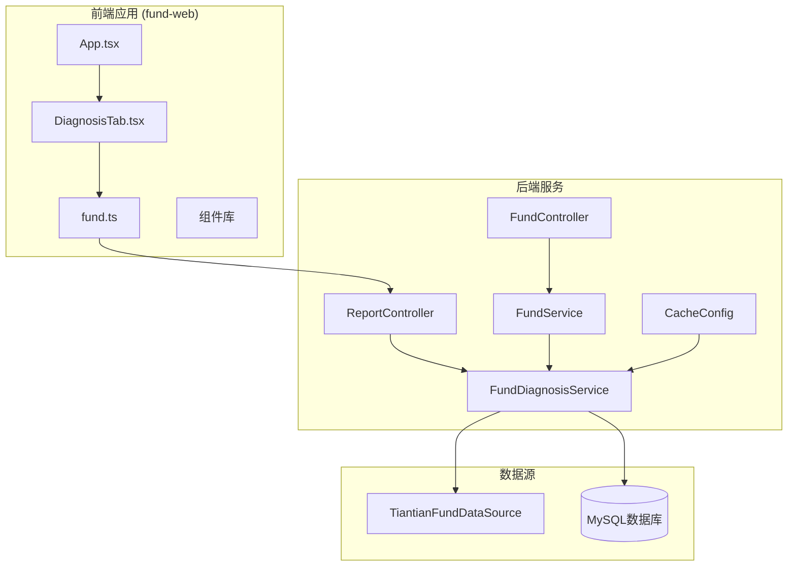
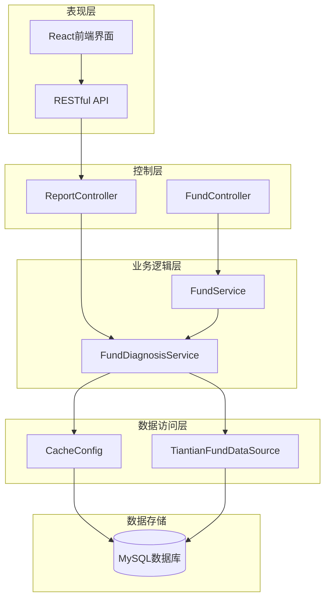
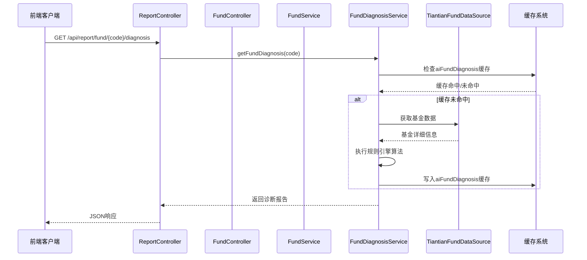
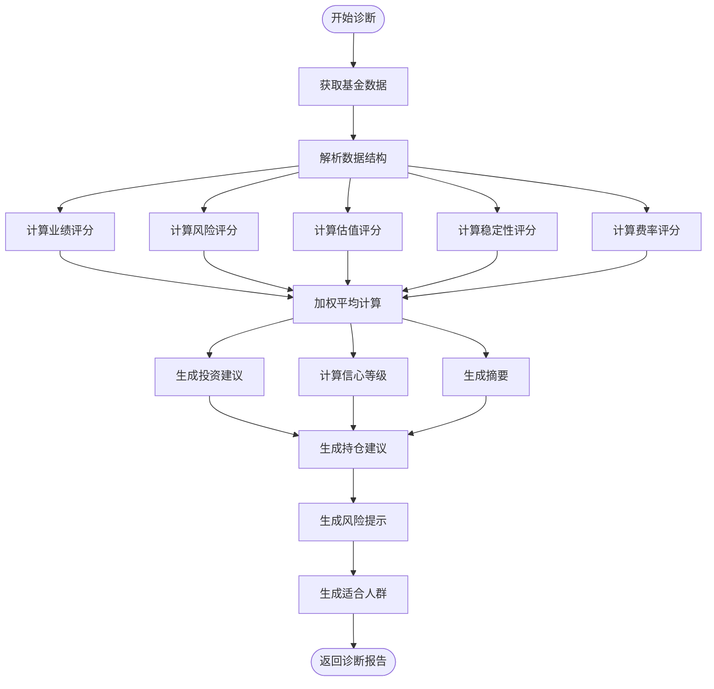
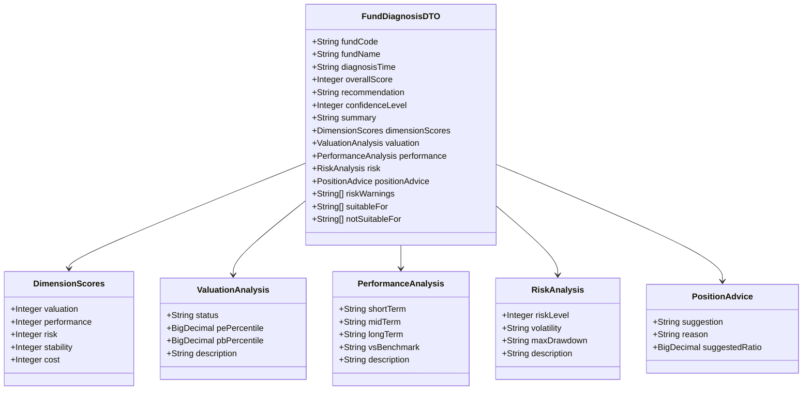
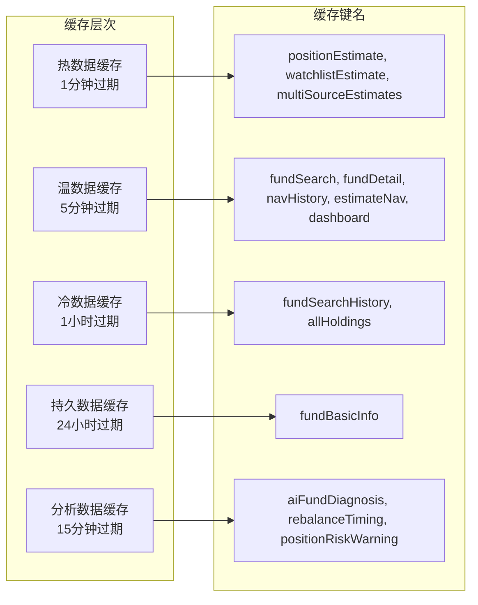
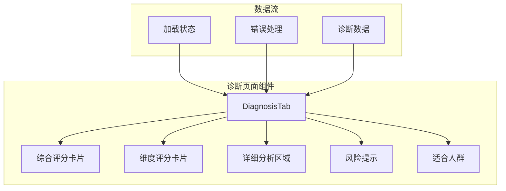
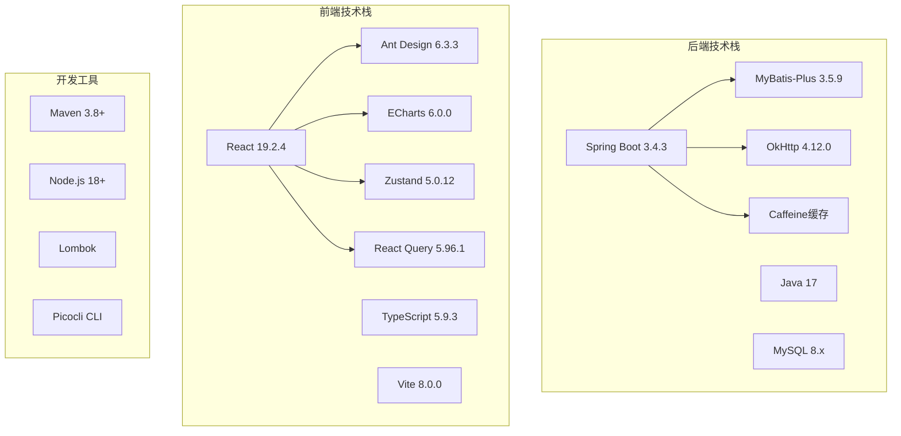
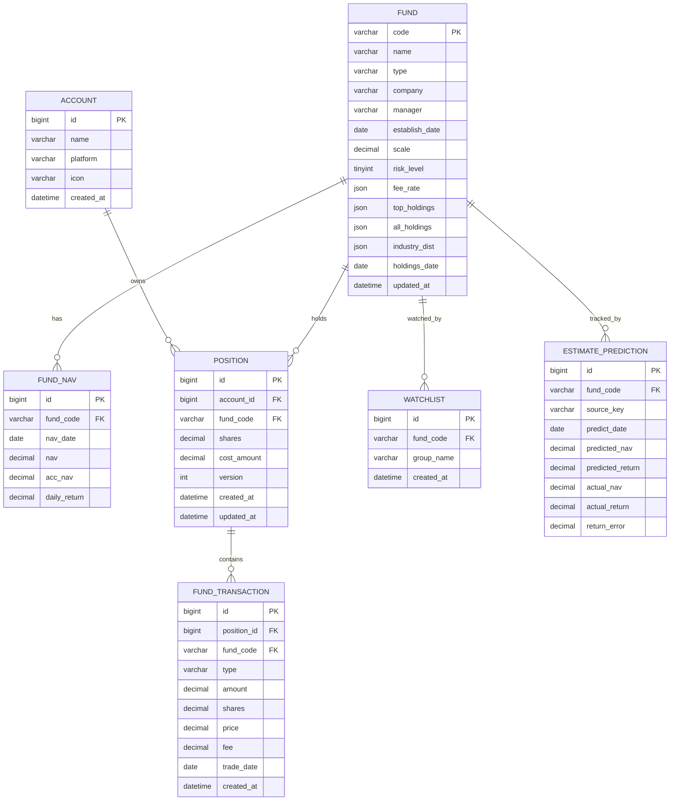

# 基金诊断服务

<cite>
**本文档引用的文件**
- [PRD.md](file://PRD.md)
- [README.md](file://README.md)
- [FundApplication.java](file://src/main/java/com/qoder/fund/FundApplication.java)
- [FundDiagnosisService.java](file://src/main/java/com/qoder/fund/service/FundDiagnosisService.java)
- [FundDiagnosisDTO.java](file://src/main/java/com/qoder/fund/dto/FundDiagnosisDTO.java)
- [ReportController.java](file://src/main/java/com/qoder/fund/controller/ReportController.java)
- [FundController.java](file://src/main/java/com/qoder/fund/controller/FundController.java)
- [FundService.java](file://src/main/java/com/qoder/fund/service/FundService.java)
- [TiantianFundDataSource.java](file://src/main/java/com/qoder/fund/datasource/TiantianFundDataSource.java)
- [CacheConfig.java](file://src/main/java/com/qoder/fund/config/CacheConfig.java)
- [schema.sql](file://src/main/resources/db/schema.sql)
- [App.tsx](file://fund-web/src/App.tsx)
- [DiagnosisTab.tsx](file://fund-web/src/pages/Fund/DiagnosisTab.tsx)
- [fund.ts](file://fund-web/src/api/fund.ts)
- [pom.xml](file://pom.xml)
</cite>

## 更新摘要
**变更内容**
- 新增完整的多维度评分系统实现
- 新增规则引擎算法和评分权重体系
- 新增专门的诊断API接口和前端展示组件
- 新增分析数据缓存策略
- 新增详细的诊断报告数据结构

## 目录
1. [简介](#简介)
2. [项目结构](#项目结构)
3. [核心组件](#核心组件)
4. [架构概览](#架构概览)
5. [详细组件分析](#详细组件分析)
6. [依赖关系分析](#依赖关系分析)
7. [性能考虑](#性能考虑)
8. [故障排除指南](#故障排除指南)
9. [结论](#结论)

## 简介

基金诊断服务是一个基于规则引擎的智能基金分析平台，专注于为个人投资者提供专业的基金诊断报告和投资决策辅助。该系统通过多数据源聚合、智能评分算法和可视化展示，帮助用户全面了解基金的投资价值。

### 核心特性

- **智能诊断引擎**：基于规则引擎的多维度基金评分系统
- **实时数据聚合**：整合多个权威数据源的基金信息
- **专业分析报告**：提供业绩、风险、估值、稳定性、费率等全方位分析
- **可视化展示**：直观的图表和评分系统
- **缓存优化**：多层次缓存策略确保系统性能

## 项目结构

项目采用前后端分离架构，后端使用Spring Boot，前端使用React技术栈。

**图表来源**
- [App.tsx:1-67](file://fund-web/src/App.tsx#L1-L67)
- [ReportController.java:1-39](file://src/main/java/com/qoder/fund/controller/ReportController.java#L1-L39)
- [FundController.java:1-79](file://src/main/java/com/qoder/fund/controller/FundController.java#L1-L79)
- [FundDiagnosisService.java:1-587](file://src/main/java/com/qoder/fund/service/FundDiagnosisService.java#L1-L587)

**章节来源**
- [README.md:191-222](file://README.md#L191-L222)
- [pom.xml:1-179](file://pom.xml#L1-L179)

## 核心组件

### 后端核心组件

#### FundDiagnosisService
基金诊断服务是整个系统的核心，负责执行规则引擎算法生成诊断报告。

**主要功能**：
- 多维度评分计算（业绩、风险、估值、稳定性、费率）
- 综合评分算法
- 投资建议生成
- 风险预警分析

#### FundService
服务层协调各个数据源，提供统一的基金信息服务。

**主要功能**：
- 基金搜索和详情查询
- 净值历史数据获取
- 多数据源估值聚合
- 数据刷新和同步

#### TiantianFundDataSource
专门的数据源组件，负责从天天基金API获取基金详细信息。

**主要功能**：
- 基金基本信息获取
- 业绩数据解析
- 风险指标提取
- 历史净值查询

#### ReportController
新的诊断报告控制器，提供RESTful API接口。

**主要功能**：
- 暴露基金诊断API接口
- 处理诊断报告请求
- 返回JSON格式的诊断数据

### 前端核心组件

#### DiagnosisTab
基金诊断展示组件，负责将后端返回的诊断数据可视化呈现。

**主要功能**：
- 综合评分卡片展示
- 多维度评分可视化
- 详细分析报告展示
- 风险提示和建议

**章节来源**
- [FundDiagnosisService.java:1-587](file://src/main/java/com/qoder/fund/service/FundDiagnosisService.java#L1-L587)
- [FundService.java:1-75](file://src/main/java/com/qoder/fund/service/FundService.java#L1-L75)
- [TiantianFundDataSource.java:1-189](file://src/main/java/com/qoder/fund/datasource/TiantianFundDataSource.java#L1-L189)
- [ReportController.java:1-39](file://src/main/java/com/qoder/fund/controller/ReportController.java#L1-L39)
- [DiagnosisTab.tsx:1-306](file://fund-web/src/pages/Fund/DiagnosisTab.tsx#L1-L306)

## 架构概览

系统采用分层架构设计，确保职责分离和代码可维护性。

**图表来源**
- [ReportController.java:1-39](file://src/main/java/com/qoder/fund/controller/ReportController.java#L1-L39)
- [FundController.java:1-79](file://src/main/java/com/qoder/fund/controller/FundController.java#L1-L79)
- [FundService.java:1-75](file://src/main/java/com/qoder/fund/service/FundService.java#L1-L75)
- [FundDiagnosisService.java:1-587](file://src/main/java/com/qoder/fund/service/FundDiagnosisService.java#L1-L587)
- [CacheConfig.java:1-112](file://src/main/java/com/qoder/fund/config/CacheConfig.java#L1-L112)

### 数据流流程

**图表来源**
- [ReportController.java:27-38](file://src/main/java/com/qoder/fund/controller/ReportController.java#L27-L38)
- [FundDiagnosisService.java:45-70](file://src/main/java/com/qoder/fund/service/FundDiagnosisService.java#L45-L70)
- [TiantianFundDataSource.java:41-71](file://src/main/java/com/qoder/fund/datasource/TiantianFundDataSource.java#L41-L71)

## 详细组件分析

### 基金诊断服务组件

#### 规则引擎算法

**图表来源**
- [FundDiagnosisService.java:75-144](file://src/main/java/com/qoder/fund/service/FundDiagnosisService.java#L75-L144)

#### 评分权重分配

系统采用科学的评分权重体系：

| 维度 | 权重 | 评分范围 | 说明 |
|------|------|----------|------|
| 业绩表现 | 40% | 0-100分 | 基于1年、3年、6月业绩加权计算 |
| 风险控制 | 25% | 0-100分 | 基于风险等级、最大回撤、夏普比率 |
| 估值合理性 | 20% | 0-100分 | 基于近期表现反映的估值状态 |
| 稳定性 | 10% | 0-100分 | 基于基金规模和成立年限 |
| 费率优势 | 5% | 0-100分 | 基于管理费率水平 |

#### 多维度分析结构

**图表来源**
- [FundDiagnosisDTO.java:1-130](file://src/main/java/com/qoder/fund/dto/FundDiagnosisDTO.java#L1-L130)

**章节来源**
- [FundDiagnosisService.java:28-144](file://src/main/java/com/qoder/fund/service/FundDiagnosisService.java#L28-L144)
- [FundDiagnosisDTO.java:8-130](file://src/main/java/com/qoder/fund/dto/FundDiagnosisDTO.java#L8-L130)

### 缓存策略分析

系统采用多层次缓存策略，针对不同类型的数据设置不同的缓存策略：

**图表来源**
- [CacheConfig.java:22-94](file://src/main/java/com/qoder/fund/config/CacheConfig.java#L22-L94)

**章节来源**
- [CacheConfig.java:1-112](file://src/main/java/com/qoder/fund/config/CacheConfig.java#L1-L112)

### 前端组件架构

#### 诊断页面组件结构

**图表来源**
- [DiagnosisTab.tsx:93-302](file://fund-web/src/pages/Fund/DiagnosisTab.tsx#L93-L302)

**章节来源**
- [DiagnosisTab.tsx:1-306](file://fund-web/src/pages/Fund/DiagnosisTab.tsx#L1-L306)
- [App.tsx:1-67](file://fund-web/src/App.tsx#L1-L67)

## 依赖关系分析

### 技术栈依赖

**图表来源**
- [pom.xml:20-116](file://pom.xml#L20-L116)
- [README.md:66-92](file://README.md#L66-L92)

### 数据库表结构关系

**图表来源**
- [schema.sql:1-96](file://src/main/resources/db/schema.sql#L1-L96)

**章节来源**
- [pom.xml:1-179](file://pom.xml#L1-L179)
- [schema.sql:1-96](file://src/main/resources/db/schema.sql#L1-L96)

## 性能考虑

### 缓存策略优化

系统实现了多层次缓存策略来优化性能：

1. **热数据缓存**：用户实时估值数据，1分钟过期
2. **温数据缓存**：常规基金信息，5分钟过期  
3. **冷数据缓存**：不常用数据，1小时过期
4. **分析数据缓存**：诊断报告等分析数据，15分钟过期
5. **持久数据缓存**：基础信息，24小时过期

### 性能指标

- **首屏加载**：< 2秒（首次）、< 1秒（缓存后）
- **搜索响应**：< 500ms
- **图表渲染**：< 1秒
- **API响应**：P95 < 500ms

### 数据源优化

- 多数据源备份策略
- 智能权重算法
- 实时数据缓存
- 异常降级处理

## 故障排除指南

### 常见问题及解决方案

#### 诊断数据获取失败

**症状**：前端显示"诊断暂时不可用"

**可能原因**：
1. 天天基金API接口异常
2. 网络连接问题
3. 基金代码无效

**解决步骤**：
1. 检查网络连接状态
2. 验证基金代码格式
3. 查看后端日志中的API调用错误
4. 系统会自动降级到备用诊断报告

#### 缓存失效问题

**症状**：数据更新不及时

**解决方法**：
1. 检查缓存配置是否正确
2. 验证缓存键名是否匹配
3. 确认缓存过期时间设置
4. 使用Redis客户端检查缓存状态

#### 性能问题

**症状**：页面加载缓慢

**排查步骤**：
1. 检查数据库连接池配置
2. 分析API响应时间
3. 监控缓存命中率
4. 优化SQL查询语句

**章节来源**
- [FundDiagnosisService.java:556-585](file://src/main/java/com/qoder/fund/service/FundDiagnosisService.java#L556-L585)

## 结论

基金诊断服务通过先进的规则引擎算法和多数据源聚合技术，为投资者提供了专业、全面的基金分析工具。系统采用现代化的技术架构，具备良好的扩展性和维护性。

### 主要优势

1. **智能化分析**：基于规则引擎的多维度评分系统
2. **实时数据**：多数据源实时聚合和缓存优化
3. **用户体验**：直观的可视化展示和响应式设计
4. **技术先进**：采用最新的Spring Boot和React技术栈
5. **可扩展性**：模块化的架构设计便于功能扩展

### 发展方向

1. **功能完善**：继续完善基金排行榜、指数估值等功能
2. **算法优化**：持续改进评分算法的准确性和实用性
3. **性能提升**：进一步优化系统性能和用户体验
4. **数据丰富**：扩展更多数据源和分析维度

该系统为个人投资者提供了一个专业、可靠的基金分析平台，有助于提高投资决策的质量和效率。