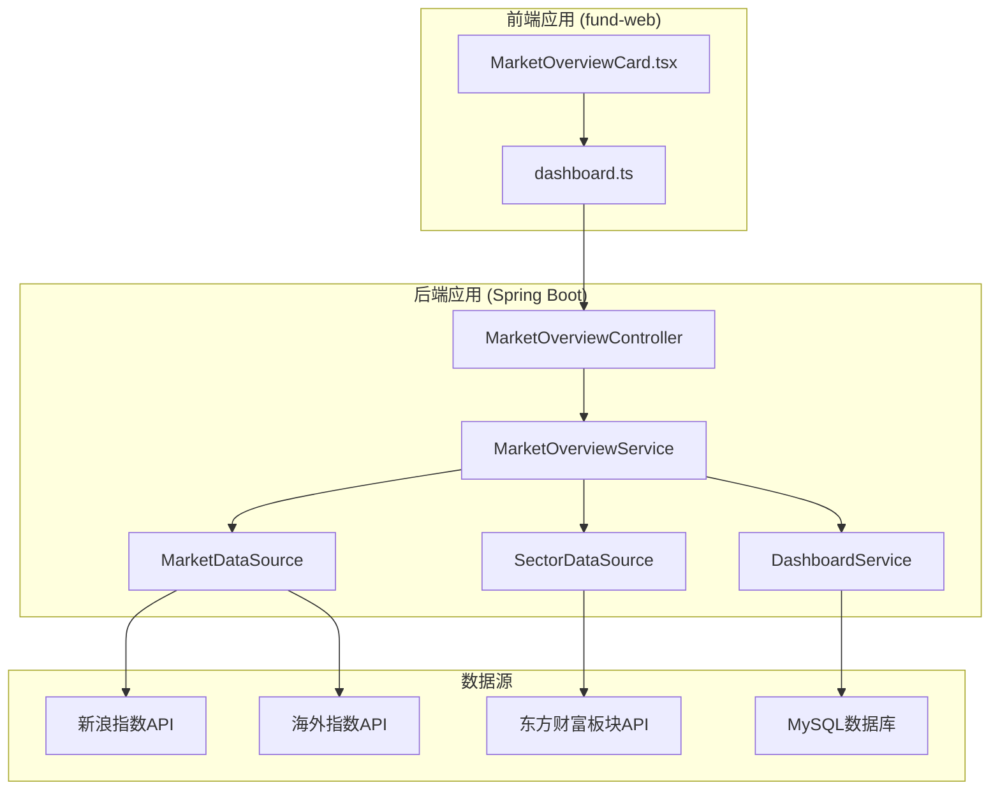
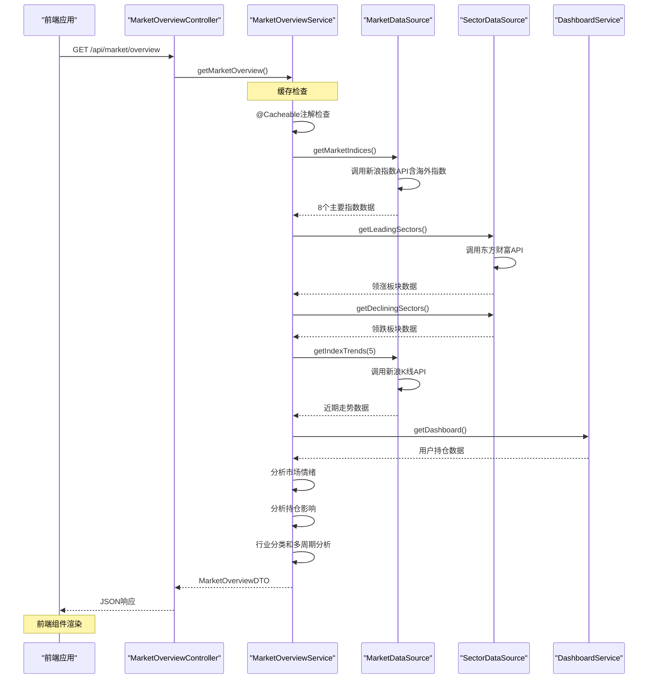
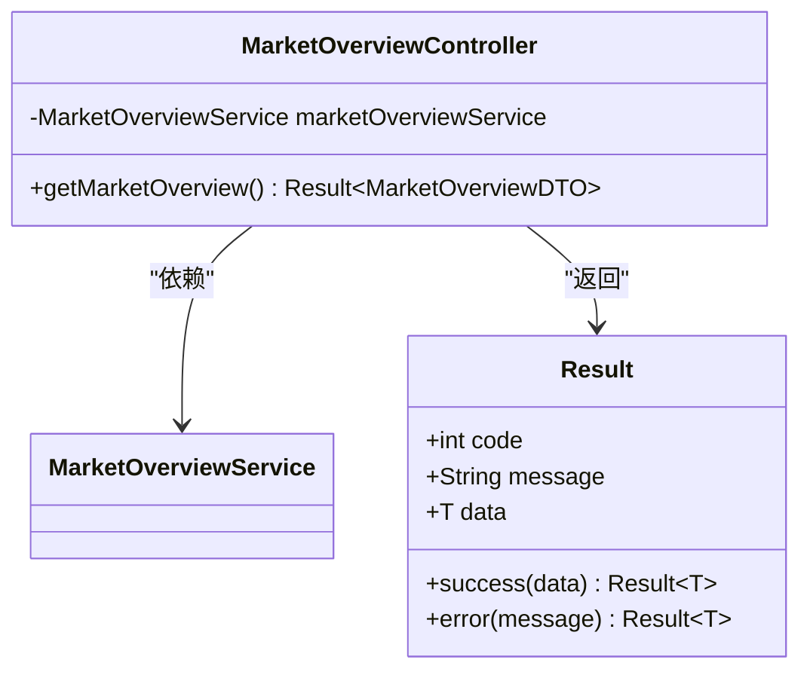
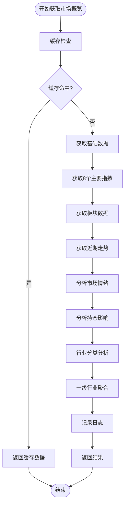
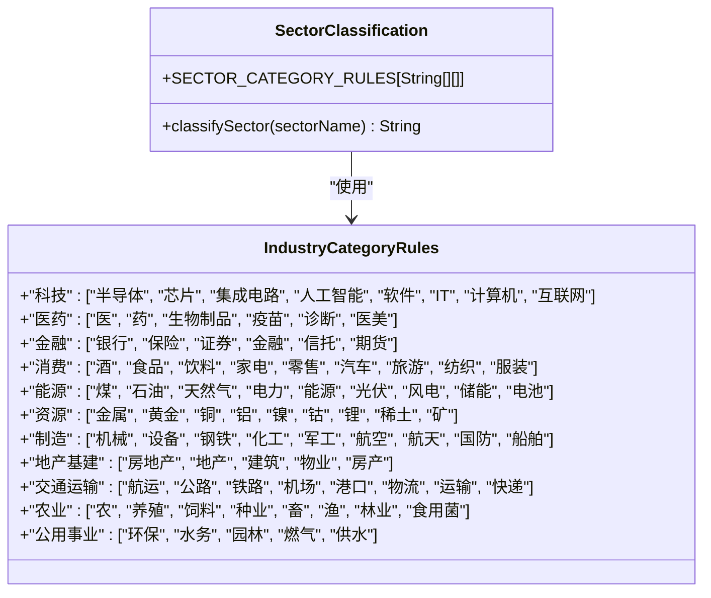
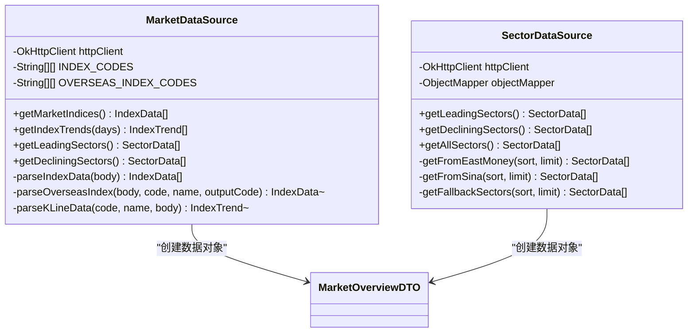
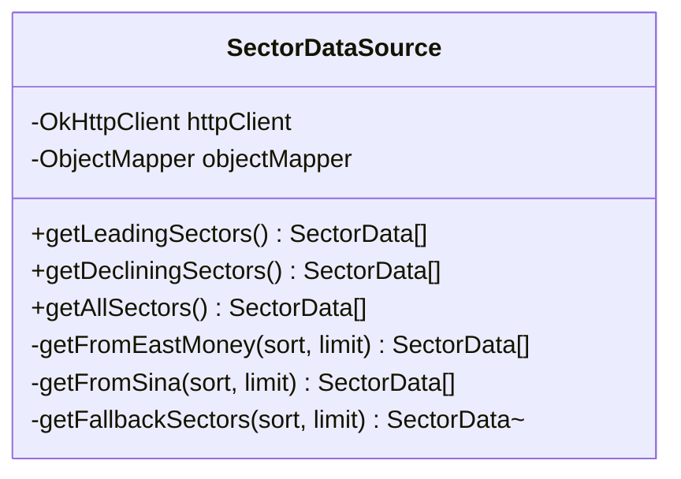
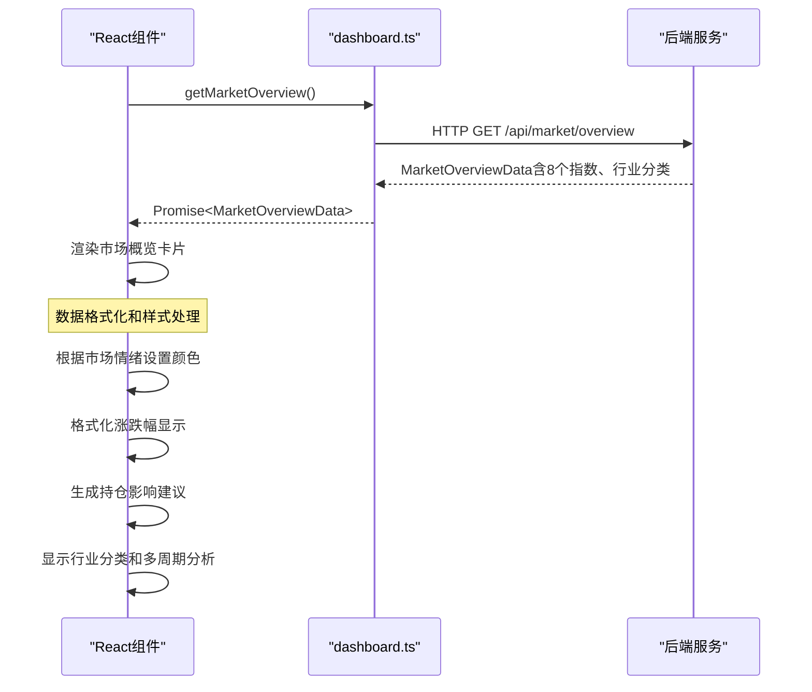
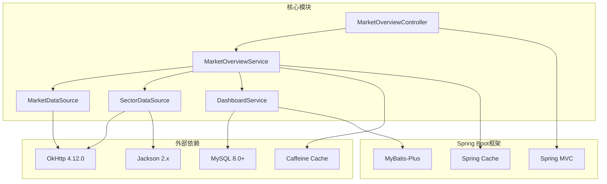

# 市场概览服务

<cite>
**本文档引用的文件**
- [MarketOverviewController.java](file://src/main/java/com/qoder/fund/controller/MarketOverviewController.java)
- [MarketOverviewService.java](file://src/main/java/com/qoder/fund/service/MarketOverviewService.java)
- [MarketDataSource.java](file://src/main/java/com/qoder/fund/datasource/MarketDataSource.java)
- [SectorDataSource.java](file://src/main/java/com/qoder/fund/datasource/SectorDataSource.java)
- [MarketOverviewDTO.java](file://src/main/java/com/qoder/fund/dto/MarketOverviewDTO.java)
- [DashboardService.java](file://src/main/java/com/qoder/fund/service/DashboardService.java)
- [CacheConfig.java](file://src/main/java/com/qoder/fund/config/CacheConfig.java)
- [Result.java](file://src/main/java/com/qoder/fund/common/Result.java)
- [application.yml](file://src/main/resources/application.yml)
- [MarketOverviewCard.tsx](file://fund-web/src/components/MarketOverviewCard.tsx)
- [dashboard.ts](file://fund-web/src/api/dashboard.ts)
- [PRD.md](file://PRD.md)
- [README.md](file://README.md)
</cite>

## 更新摘要
**变更内容**
- 大盘指数从4个扩展到8个，新增国际指数支持
- 新增一级行业分类系统和多周期变化分析功能
- 增强板块数据分析能力，支持近5日和近10日涨跌幅分析
- 实现板块到行业的聚合分析功能

## 目录
1. [简介](#简介)
2. [项目结构](#项目结构)
3. [核心组件](#核心组件)
4. [架构概览](#架构概览)
5. [详细组件分析](#详细组件分析)
6. [依赖关系分析](#依赖关系分析)
7. [性能考量](#性能考量)
8. [故障排查指南](#故障排查指南)
9. [结论](#结论)

## 简介

市场概览服务是基金管家系统中的核心功能模块，负责整合和展示市场宏观数据，包括大盘指数、板块热度、市场情绪以及对用户持仓的影响分析。该服务采用多数据源架构，通过缓存机制提升响应性能，并提供面向前端的统一数据接口。

**更新** 服务现已扩展支持8个主要市场指数，包括恒生指数、恒生科技、标普500、纳斯达克等国际指数，以及全新的行业分类系统和多周期变化分析功能。

## 项目结构

基金管家项目采用前后端分离架构，市场概览服务位于后端Spring Boot应用中，前端React应用通过API接口消费这些数据。

**图表来源**
- [MarketOverviewController.java:1-41](file://src/main/java/com/qoder/fund/controller/MarketOverviewController.java#L1-L41)
- [MarketOverviewService.java:1-353](file://src/main/java/com/qoder/fund/service/MarketOverviewService.java#L1-L353)
- [MarketDataSource.java:1-477](file://src/main/java/com/qoder/fund/datasource/MarketDataSource.java#L1-L477)
- [SectorDataSource.java:1-249](file://src/main/java/com/qoder/fund/datasource/SectorDataSource.java#L1-L249)

**章节来源**
- [README.md:191-222](file://README.md#L191-L222)
- [PRD.md:57-111](file://PRD.md#L57-L111)

## 核心组件

市场概览服务由四个核心组件构成，每个组件都有明确的职责分工：

### 控制器层
- **MarketOverviewController**: 提供RESTful API接口，负责接收HTTP请求并返回标准响应格式

### 服务层
- **MarketOverviewService**: 核心业务逻辑处理，整合多数据源数据，执行市场分析算法，新增行业分类和多周期分析功能
- **DashboardService**: 提供用户持仓数据，用于分析对个人持仓的影响

### 数据源层
- **MarketDataSource**: 大盘指数数据获取，支持8个主要指数（上证指数、深证成指、创业板指、沪深300、恒生指数、恒生科技、标普500、纳斯达克）
- **SectorDataSource**: 板块数据获取，支持东方财富和新浪财经数据源，新增全量板块数据获取功能

### 数据传输对象
- **MarketOverviewDTO**: 统一的数据传输格式，包含所有市场概览相关信息，新增行业分类和多周期分析字段

**章节来源**
- [MarketOverviewController.java:15-40](file://src/main/java/com/qoder/fund/controller/MarketOverviewController.java#L15-L40)
- [MarketOverviewService.java:23-75](file://src/main/java/com/qoder/fund/service/MarketOverviewService.java#L23-L75)
- [MarketOverviewDTO.java:12-236](file://src/main/java/com/qoder/fund/dto/MarketOverviewDTO.java#L12-L236)

## 架构概览

市场概览服务采用分层架构设计，实现了高内聚、低耦合的系统结构。

**图表来源**
- [MarketOverviewController.java:28-39](file://src/main/java/com/qoder/fund/controller/MarketOverviewController.java#L28-L39)
- [MarketOverviewService.java:36-125](file://src/main/java/com/qoder/fund/service/MarketOverviewService.java#L36-L125)
- [MarketDataSource.java:55-96](file://src/main/java/com/qoder/fund/datasource/MarketDataSource.java#L55-L96)
- [SectorDataSource.java:41-82](file://src/main/java/com/qoder/fund/datasource/SectorDataSource.java#L41-L82)

## 详细组件分析

### MarketOverviewController 分析

控制器层采用Spring MVC注解，提供RESTful API接口。

**图表来源**
- [MarketOverviewController.java:15-40](file://src/main/java/com/qoder/fund/controller/MarketOverviewController.java#L15-L40)
- [Result.java:6-33](file://src/main/java/com/qoder/fund/common/Result.java#L6-L33)

**章节来源**
- [MarketOverviewController.java:28-39](file://src/main/java/com/qoder/fund/controller/MarketOverviewController.java#L28-L39)

### MarketOverviewService 分析

服务层是市场概览的核心，实现了复杂的业务逻辑和数据整合。

**图表来源**
- [MarketOverviewService.java:83-125](file://src/main/java/com/qoder/fund/service/MarketOverviewService.java#L83-L125)

#### 市场情绪分析算法

服务实现了多层次的市场情绪判断机制：

1. **平均涨跌幅优先**: 通过计算所有指数的平均涨跌幅判断市场情绪
2. **涨跌数量次优**: 当平均涨跌幅接近时，比较上涨和下跌指数数量
3. **阈值判断**: 设置1%的阈值来区分积极和谨慎市场

**章节来源**
- [MarketOverviewService.java:127-165](file://src/main/java/com/qoder/fund/service/MarketOverviewService.java#L127-L165)

#### 持仓影响分析

服务通过DashboardService获取用户持仓数据，进行个性化影响分析：

- **平均持仓回报率**: 计算用户持有的所有基金的平均涨跌幅
- **影响程度判断**: 基于平均回报率判断对用户持仓的整体影响
- **建议生成**: 根据市场状况提供相应的投资建议

**章节来源**
- [MarketOverviewService.java:205-277](file://src/main/java/com/qoder/fund/service/MarketOverviewService.java#L205-L277)

#### 新增行业分类系统

服务实现了基于关键词规则的一级行业分类系统：

**图表来源**
- [MarketOverviewService.java:37-59](file://src/main/java/com/qoder/fund/service/MarketOverviewService.java#L37-L59)

**章节来源**
- [MarketOverviewService.java:37-77](file://src/main/java/com/qoder/fund/service/MarketOverviewService.java#L37-L77)

#### 多周期变化分析

服务实现了板块的多周期变化分析功能：

- **近5日涨跌幅**: 支持板块近5日涨跌幅分析
- **近10日涨跌幅**: 支持板块近10日涨跌幅分析
- **平均涨跌幅聚合**: 将子板块聚合为一级行业分类的平均涨跌幅

**章节来源**
- [MarketOverviewService.java:280-340](file://src/main/java/com/qoder/fund/service/MarketOverviewService.java#L280-L340)

### MarketDataSource 分析

数据源层负责从多个外部API获取市场数据，实现了数据聚合和转换。

**图表来源**
- [MarketDataSource.java:22-50](file://src/main/java/com/qoder/fund/datasource/MarketDataSource.java#L22-L50)
- [SectorDataSource.java:23-36](file://src/main/java/com/qoder/fund/datasource/SectorDataSource.java#L23-L36)

#### 大盘指数数据获取

支持8个主要指数的实时数据获取：

- **A股指数**:
  - 上证指数 (sh000001): 中国最重要的股票指数
  - 深证成指 (sz399001): 深圳证券交易所主要指数
  - 创业板指 (sz399006): 创业板主要指数
  - 沪深300 (sh000300): 跨市场大型企业指数

- **国际指数**:
  - 恒生指数 (hkHSI): 香港市场代表指数
  - 恒生科技 (hkHSTECH): 香港科技类股指数
  - 标普500 (gb_$inx): 美国市场代表指数
  - 纳斯达克 (gb_$ixic): 美国科技股指数

**章节来源**
- [MarketDataSource.java:32-46](file://src/main/java/com/qoder/fund/datasource/MarketDataSource.java#L32-L46)

#### 海外指数获取机制

实现了完整的海外指数获取机制：

1. **统一API接口**: 通过新浪海外指数API获取港股和美股数据
2. **格式适配**: 支持港股(rt_hk*)和美股(gb_*)的不同数据格式
3. **数据转换**: 将海外指数转换为统一的内部格式

**章节来源**
- [MarketDataSource.java:155-272](file://src/main/java/com/qoder/fund/datasource/MarketDataSource.java#L155-L272)

### SectorDataSource 分析

数据源层负责从多个外部API获取板块数据，实现了数据聚合和转换。

**图表来源**
- [SectorDataSource.java:23-36](file://src/main/java/com/qoder/fund/datasource/SectorDataSource.java#L23-L36)

#### 全量板块数据获取

新增了全量板块数据获取功能：

- **getAllSectors()**: 获取所有板块数据用于行业分类聚合
- **支持100个板块**: 可获取最多100个板块的详细数据
- **多周期涨跌幅**: 支持近5日和近10日涨跌幅分析

**章节来源**
- [SectorDataSource.java:52-57](file://src/main/java/com/qoder/fund/datasource/SectorDataSource.java#L52-L57)

### 前端集成分析

前端通过React组件消费后端API，实现了直观的市场概览展示。

**图表来源**
- [MarketOverviewCard.tsx:19-31](file://fund-web/src/components/MarketOverviewCard.tsx#L19-L31)
- [dashboard.ts:220-223](file://fund-web/src/api/dashboard.ts#L220-L223)

**章节来源**
- [MarketOverviewCard.tsx:15-35](file://fund-web/src/components/MarketOverviewCard.tsx#L15-L35)

## 依赖关系分析

系统采用了分层依赖架构，确保了良好的模块化和可维护性。

**图表来源**
- [CacheConfig.java:44-76](file://src/main/java/com/qoder/fund/config/CacheConfig.java#L44-L76)
- [application.yml:29-42](file://src/main/resources/application.yml#L29-L42)

### 缓存策略

系统实现了多级缓存架构，针对不同数据类型的访问频率设置了合适的缓存策略：

- **热数据缓存**: 1分钟过期，用于实时估值等高频数据
- **温数据缓存**: 5分钟过期，用于市场概览等中等频率数据
- **冷数据缓存**: 1小时过期，用于不常用数据
- **持久数据缓存**: 24小时过期，用于基本不变的数据

**章节来源**
- [CacheConfig.java:22-94](file://src/main/java/com/qoder/fund/config/CacheConfig.java#L22-L94)

### 数据库集成

系统通过MyBatis-Plus框架与MySQL数据库交互，实现了数据的持久化存储。

**章节来源**
- [application.yml:7-27](file://src/main/resources/application.yml#L7-L27)

## 性能考量

市场概览服务在设计时充分考虑了性能优化，采用了多种策略来提升响应速度和用户体验。

### 缓存优化

- **多级缓存架构**: 不同数据类型采用不同的缓存策略
- **随机过期时间**: 在基础过期时间基础上增加随机偏移，避免缓存雪崩
- **软引用值**: 使用软引用存储缓存数据，便于内存管理

### 异步处理

- **HTTP客户端优化**: 使用OkHttp进行高效的HTTP请求
- **数据解析优化**: 实现了高效的JSON解析和字符串处理算法

### 错误处理

- **降级机制**: 当外部API不可用时，系统会自动降级到备用数据源
- **静默失败**: 前端组件在获取数据失败时不会中断用户体验

## 故障排查指南

### 常见问题及解决方案

#### API调用失败

**症状**: 前端无法获取市场概览数据

**可能原因**:
1. 外部API接口不可用
2. 网络连接问题
3. 数据源配置错误

**解决步骤**:
1. 检查后端日志中的API调用错误信息
2. 验证外部API的可用性和响应格式
3. 确认网络连接正常

#### 数据解析错误

**症状**: 市场数据解析失败或显示异常

**可能原因**:
1. 外部API响应格式变更
2. 数据编码问题
3. 网络传输损坏

**解决步骤**:
1. 检查API响应的原始数据
2. 验证数据编码格式（GBK/UTF-8）
3. 实现数据格式兼容性处理

#### 缓存问题

**症状**: 数据更新不及时或显示过期数据

**可能原因**:
1. 缓存配置不当
2. 缓存键冲突
3. 缓存过期时间设置不合理

**解决步骤**:
1. 检查缓存配置参数
2. 验证缓存键的唯一性
3. 调整缓存过期时间

### 监控和调试

系统提供了完善的日志记录和监控机制：

- **请求日志**: 记录所有API请求的详细信息
- **性能监控**: 监控关键操作的执行时间和成功率
- **错误追踪**: 提供完整的错误堆栈信息

**章节来源**
- [application.yml:50-68](file://src/main/resources/application.yml#L50-L68)

## 结论

市场概览服务通过精心设计的架构和优化的实现，为用户提供了一个功能完整、性能优异的市场数据展示平台。系统的主要优势包括：

1. **多数据源架构**: 通过多个数据源的聚合，提高了数据的准确性和可靠性
2. **智能缓存策略**: 针对不同数据类型的访问模式，采用了最优的缓存策略
3. **前后端分离**: 清晰的职责分工和接口设计，提升了系统的可维护性
4. **错误处理机制**: 完善的降级和错误处理机制，保证了系统的稳定性
5. **国际化支持**: 新增8个主要市场指数，包括国际指数支持
6. **行业分类系统**: 实现了一级行业分类和多周期分析功能
7. **增强的板块分析**: 支持近5日和近10日的板块变化分析

未来可以考虑的功能扩展包括：
- 增加更多的数据源以提高数据覆盖度
- 实现更复杂的技术分析指标
- 提供个性化的市场数据推送功能
- 扩展行业分类系统的覆盖范围
- 增加更多国际市场的指数支持