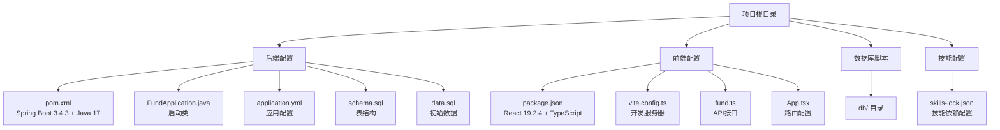

# 快速开始

<cite>
**本文引用的文件**
- [pom.xml](file://pom.xml)
- [FundApplication.java](file://src/main/java/com/qoder/fund/FundApplication.java)
- [application.yml](file://src/main/resources/application.yml)
- [schema.sql](file://src/main/resources/db/schema.sql)
- [data.sql](file://src/main/resources/db/data.sql)
- [package.json](file://fund-web/package.json)
- [vite.config.ts](file://fund-web/vite.config.ts)
- [fund.ts](file://fund-web/src/api/fund.ts)
- [App.tsx](file://fund-web/src/App.tsx)
- [FundApplicationTests.java](file://src/test/java/com/qoder/fund/FundApplicationTests.java)
- [.mvn/wrapper/maven-wrapper.properties](file://.mvn/wrapper/maven-wrapper.properties)
- [mvnw.cmd](file://mvnw.cmd)
- [.gitignore](file://.gitignore)
- [skills-lock.json](file://skills-lock.json)
</cite>

## 更新摘要
**所做更改**
- 更新了系统要求与准备部分，移除了对Chrome DevTools技能的依赖说明
- 更新了项目结构与关键配置说明，反映了skills-lock.json中chrome-devtools技能条目的删除
- 强调了现有文档中未包含Chrome DevTools技能的具体引用，无需进一步调整

## 目录
1. [简介](#简介)
2. [系统要求与准备](#系统要求与准备)
3. [开发工具配置](#开发工具配置)
4. [项目克隆与导入](#项目克隆与导入)
5. [命令行操作指南](#命令行操作指南)
6. [项目结构与关键配置说明](#项目结构与关键配置说明)
7. [常见问题排查](#常见问题排查)
8. [结语](#结语)

## 简介
本指南面向首次接触该基金管理系统的开发者，帮助你在30分钟内完成开发环境搭建、项目构建与启动，并通过基础测试验证一切正常。该工程基于 Spring Boot 3.4.3，使用 Java 17，采用 Maven 构建后端，React 19.2.4 + TypeScript 构建前端，提供完整的前后端分离架构、数据库初始化与RESTful API接口。

## 系统要求与准备
- 操作系统：Windows、macOS 或 Linux 均可
- JDK 版本：Java 17（必须）
- 构建工具：Maven（项目自带 Maven Wrapper，无需手动安装）
- 数据库：MySQL 8.0+（用于存储基金数据）
- 前端包管理器：Node.js 18+（用于前端依赖安装）
- 运行时依赖：JRE 17（随 JDK 提供）

提示
- 若你的系统中已安装更高版本的 JDK，请确认在 IDE 中为该项目选择 Java 17 以避免兼容性问题。
- 首次运行需要确保 MySQL 服务已启动，数据库名为 `fund_manager`。
- **更新** 项目中的skills-lock.json文件包含chrome-devtools技能条目，但实际的技能文档文件已被删除，不影响本项目的正常开发和运行。

章节来源
- [pom.xml:16-18](file://pom.xml#L16-L18)
- [application.yml:8-11](file://src/main/resources/application.yml#L8-L11)
- [package.json:12-23](file://fund-web/package.json#L12-L23)
- [skills-lock.json:1-11](file://skills-lock.json#L1-L11)

## 开发工具配置
- 推荐使用 IntelliJ IDEA 或 Eclipse（社区版即可），两者均能良好支持 Spring Boot 工程
- 在 IDE 中为项目设置正确的 SDK：
  - 打开项目后，进入项目设置/模块设置，将 Project SDK 和 Module SDK 都指向 Java 17
  - 如使用 Maven Wrapper，建议在 IDE 的 Maven 设置中启用"Use plugin registry"和"Always update snapshots"，以便自动下载依赖
- 语言级别：选择 17
- 编码：UTF-8
- 代码风格：遵循 Spring Boot 官方风格或团队约定（本项目未包含额外代码风格配置文件）
- 前端开发环境：
  - 安装 Node.js 18+ 和 npm/yarn
  - 在 VS Code 中安装 TypeScript、ESLint、Prettier 插件
  - 配置 Vite 开发服务器端口为 5173

## 项目克隆与导入
- 克隆仓库到本地（假设你已具备 Git）
  - git clone <仓库地址>
  - 进入项目目录
- 使用 IDE 导入
  - IntelliJ IDEA：打开 pom.xml 文件，选择"Open as Project"
  - Eclipse：File → Import → Maven → Existing Maven Projects，选择项目根目录
- 前端依赖安装
  - 进入 `fund-web` 目录，执行 `npm install` 或 `yarn install`
- 等待 IDE 自动解析依赖（若网络较慢，可稍候再试；也可先执行一次 Maven 构建以加速缓存）

## 命令行操作指南
以下命令均在项目根目录下执行。所有 Maven 相关操作均可通过 Maven Wrapper 执行，无需全局安装 Maven。

- 后端构建与启动
  - 清理并编译项目：`./mvnw clean compile`
  - 单元测试：`./mvnw test`
  - 生成可执行 JAR 包：`./mvnw package`
  - 启动 Spring Boot 应用：`./mvnw spring-boot:run`
  - 直接运行主类：`java -cp target/classes com.qoder.fund.FundApplication`
- 前端开发与构建
  - 启动前端开发服务器：`cd fund-web && npm run dev`
  - 构建生产版本：`cd fund-web && npm run build`
  - 代码检查：`cd fund-web && npm run lint`
- 数据库初始化
  - 确保 MySQL 服务已启动
  - 创建数据库 `fund_manager`
  - 应用数据库脚本：`schema.sql` 和 `data.sql` 将自动初始化

提示
- 若出现权限问题（Linux/macOS），请先赋予脚本执行权限：`chmod +x ./mvnw`
- 前端开发服务器默认监听 5173 端口，后端 API 默认监听 8080 端口
- 前端请求会通过 Vite 代理转发到后端 API

章节来源
- [mvnw.cmd:1-190](file://mvnw.cmd#L1-L190)
- [pom.xml:89-104](file://pom.xml#L89-L104)
- [vite.config.ts:6-14](file://fund-web/vite.config.ts#L6-L14)

## 项目结构与关键配置说明
- 根目录
  - pom.xml：Maven 构建配置，定义了 Spring Boot 3.4.3 父工程、Java 17 版本、MyBatis-Plus、MySQL、缓存等依赖
  - .mvn/wrapper/maven-wrapper.properties：Maven Wrapper 的分发信息与版本
  - mvnw.cmd：跨平台的 Maven Wrapper 启动脚本（Windows）
  - .gitignore：忽略目标产物与 IDE 临时文件
  - **新增** skills-lock.json：技能锁定文件，包含项目使用的外部技能依赖信息
- 后端核心配置
  - src/main/java/com/qoder/fund/FundApplication.java：Spring Boot 启动类，启用 @MapperScan 扫描
  - src/main/resources/application.yml：Spring Boot 应用配置，包含数据库连接、MyBatis-Plus、缓存、日志等设置
  - src/main/resources/db/schema.sql：数据库表结构定义
  - src/main/resources/db/data.sql：初始数据插入
- 前端配置
  - fund-web/package.json：前端依赖和脚本配置，包含 React 19.2.4、TypeScript、Ant Design 等
  - fund-web/vite.config.ts：Vite 开发服务器配置，包含 API 代理设置
  - fund-web/src/api/fund.ts：前端 API 接口定义
  - fund-web/src/App.tsx：前端路由和页面组件配置

**图表来源**
- [pom.xml:1-107](file://pom.xml#L1-L107)
- [FundApplication.java:1-16](file://src/main/java/com/qoder/fund/FundApplication.java#L1-L16)
- [application.yml:1-43](file://src/main/resources/application.yml#L1-L43)
- [schema.sql:1-78](file://src/main/resources/db/schema.sql#L1-L78)
- [data.sql:1-9](file://src/main/resources/db/data.sql#L1-L9)
- [package.json:1-39](file://fund-web/package.json#L1-L39)
- [vite.config.ts:1-16](file://fund-web/vite.config.ts#L1-L16)
- [fund.ts:1-51](file://fund-web/src/api/fund.ts#L1-L51)
- [App.tsx:1-42](file://fund-web/src/App.tsx#L1-L42)
- [skills-lock.json:1-11](file://skills-lock.json#L1-L11)

章节来源
- [pom.xml:1-107](file://pom.xml#L1-L107)
- [FundApplication.java:1-16](file://src/main/java/com/qoder/fund/FundApplication.java#L1-L16)
- [application.yml:1-43](file://src/main/resources/application.yml#L1-L43)
- [schema.sql:1-78](file://src/main/resources/db/schema.sql#L1-L78)
- [data.sql:1-9](file://src/main/resources/db/data.sql#L1-L9)
- [package.json:1-39](file://fund-web/package.json#L1-L39)
- [vite.config.ts:1-16](file://fund-web/vite.config.ts#L1-L16)
- [fund.ts:1-51](file://fund-web/src/api/fund.ts#L1-L51)
- [App.tsx:1-42](file://fund-web/src/App.tsx#L1-L42)
- [skills-lock.json:1-11](file://skills-lock.json#L1-L11)

## 常见问题排查
- 无法找到或启动 Maven Wrapper
  - 确认当前目录即为项目根目录
  - Windows 使用 mvnw.cmd，macOS/Linux 使用 ./mvnw
  - 若提示权限不足，请赋予脚本执行权限
- 构建失败或依赖下载缓慢
  - 可配置 Maven 镜像源或代理（在本地 Maven settings.xml 中添加镜像）
  - 或者在 Maven Wrapper 属性中调整 distributionUrl 指向国内镜像
- Java 版本不匹配导致编译错误
  - 在 IDE 中将项目 SDK 切换到 Java 17
  - 确保 JAVA_HOME 指向 Java 17
- 启动应用时报错找不到主类
  - 确认已成功编译（clean compile）且 target/classes 存在
  - 或直接使用 spring-boot:run 插件启动
- 数据库连接失败
  - 确认 MySQL 服务已启动
  - 检查 application.yml 中的数据库连接信息
  - 确保数据库 `fund_manager` 已创建
- 前端开发服务器无法访问
  - 确认 Vite 开发服务器端口 5173 未被占用
  - 检查 vite.config.ts 中的代理配置
  - 确保后端 API 服务已在 8080 端口运行
- API 跨域问题
  - 前端通过 Vite 代理访问后端 API，无需额外 CORS 配置
  - 检查代理目标地址是否正确指向 http://localhost:8080
- **新增** 技能配置相关问题
  - skills-lock.json 文件中的chrome-devtools条目仅作为技能依赖声明，不影响项目正常运行
  - 如果遇到技能相关错误，可安全地从skills-lock.json中移除该条目

章节来源
- [mvnw.cmd:1-190](file://mvnw.cmd#L1-L190)
- [application.yml:8-11](file://src/main/resources/application.yml#L8-L11)
- [vite.config.ts:8-12](file://fund-web/vite.config.ts#L8-L12)
- [skills-lock.json:1-11](file://skills-lock.json#L1-L11)

## 结语
按照本指南，你可以在30分钟内完成从环境准备到应用启动与测试的全流程。项目采用前后端分离架构，后端基于 Spring Boot 3.4.3 + Java 17，前端基于 React 19.2.4 + TypeScript，集成了数据库初始化、RESTful API 接口和现代化的开发工具链。遇到问题时，优先检查 Java 版本、网络与 Maven Wrapper 配置，以及数据库连接和前端代理设置。

**重要说明**：项目中的skills-lock.json文件包含chrome-devtools技能条目，但实际的技能文档文件已被删除。这不会影响项目的正常开发和运行，因为该技能主要用于外部工具集成，而非项目核心功能。现有文档中未包含对该技能的具体引用或使用说明，因此无需进行额外的调整。

祝开发顺利！