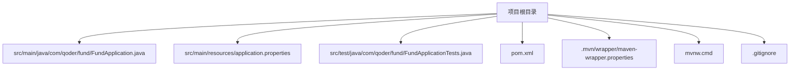

# 快速开始

<cite>
**本文引用的文件**
- [pom.xml](file://pom.xml)
- [FundApplication.java](file://src/main/java/com/qoder/fund/FundApplication.java)
- [application.properties](file://src/main/resources/application.properties)
- [FundApplicationTests.java](file://src/test/java/com/qoder/fund/FundApplicationTests.java)
- [.mvn/wrapper/maven-wrapper.properties](file://.mvn/wrapper/maven-wrapper.properties)
- [mvnw.cmd](file://mvnw.cmd)
- [.gitignore](file://.gitignore)
</cite>

## 目录
1. [简介](#简介)
2. [系统要求与准备](#系统要求与准备)
3. [开发工具配置](#开发工具配置)
4. [项目克隆与导入](#项目克隆与导入)
5. [命令行操作指南](#命令行操作指南)
6. [项目结构与关键配置说明](#项目结构与关键配置说明)
7. [常见问题排查](#常见问题排查)
8. [结语](#结语)

## 简介
本指南面向首次接触该基金管理系统的开发者，帮助你在30分钟内完成开发环境搭建、项目构建与启动，并通过基础测试验证一切正常。该工程基于 Spring Boot 4.0.3，使用 Java 17，采用 Maven 构建，提供最小可用的启动类、配置文件与单元测试骨架。

## 系统要求与准备
- 操作系统：Windows、macOS 或 Linux 均可
- JDK 版本：Java 17（必须）
- 构建工具：Maven（项目自带 Maven Wrapper，无需手动安装）
- 运行时依赖：JRE 17（随 JDK 提供）

提示
- 若你的系统中已安装更高版本的 JDK，请确认在 IDE 中为该项目选择 Java 17 以避免兼容性问题。
- 本项目未声明数据库或 Web 依赖，因此无需额外安装数据库或容器服务。

章节来源
- [pom.xml:29-31](file://pom.xml#L29-L31)

## 开发工具配置
- 推荐使用 IntelliJ IDEA 或 Eclipse（社区版即可），两者均能良好支持 Spring Boot 工程
- 在 IDE 中为项目设置正确的 SDK：
  - 打开项目后，进入项目设置/模块设置，将 Project SDK 和 Module SDK 都指向 Java 17
  - 如使用 Maven Wrapper，建议在 IDE 的 Maven 设置中启用“Use plugin registry”和“Always update snapshots”，以便自动下载依赖
- 语言级别：选择 17
- 编码：UTF-8
- 代码风格：遵循 Spring Boot 官方风格或团队约定（本项目未包含额外代码风格配置文件）

## 项目克隆与导入
- 克隆仓库到本地（假设你已具备 Git）
  - git clone <仓库地址>
  - 进入项目目录
- 使用 IDE 导入
  - IntelliJ IDEA：打开 pom.xml 文件，选择“Open as Project”
  - Eclipse：File → Import → Maven → Existing Maven Projects，选择项目根目录
- 等待 IDE 自动解析依赖（若网络较慢，可稍候再试；也可先执行一次 Maven 构建以加速缓存）

## 命令行操作指南
以下命令均在项目根目录下执行。所有 Maven 相关操作均可通过 Maven Wrapper 执行，无需全局安装 Maven。

- 清理并编译项目
  - Windows：mvnw.cmd clean compile
  - macOS/Linux：./mvnw clean compile
- 单元测试
  - Windows：mvnw.cmd test
  - macOS/Linux：./mvnw test
- 生成可执行 JAR 包（可选）
  - Windows：mvnw.cmd package
  - macOS/Linux：./mvnw package
- 启动 Spring Boot 应用
  - Windows：mvnw.cmd spring-boot:run
  - macOS/Linux：./mvnw spring-boot:run
- 直接运行主类（如需）
  - java -cp target/classes com.qoder.fund.FundApplication

提示
- 若出现权限问题（Linux/macOS），请先赋予脚本执行权限：chmod +x ./mvnw
- 如果网络受限，可在 Maven Wrapper 属性中配置镜像源或代理（见“常见问题排查”）

章节来源
- [mvnw.cmd:1-190](file://mvnw.cmd#L1-L190)
- [pom.xml:45-52](file://pom.xml#L45-L52)

## 项目结构与关键配置说明
- 根目录
  - pom.xml：Maven 构建配置，定义了父工程、Java 版本、依赖与插件
  - .mvn/wrapper/maven-wrapper.properties：Maven Wrapper 的分发信息与版本
  - mvnw.cmd：跨平台的 Maven Wrapper 启动脚本（Windows）
  - .gitignore：忽略目标产物与 IDE 临时文件
- src/main
  - java/com/qoder/fund/FundApplication.java：Spring Boot 启动类，包含 main 方法
  - resources/application.properties：Spring Boot 应用属性文件（当前为空，仅设置了应用名）
- src/test
  - java/com/qoder/fund/FundApplicationTests.java：基础上下文加载测试

图表来源
- [FundApplication.java:1-14](file://src/main/java/com/qoder/fund/FundApplication.java#L1-L14)
- [application.properties:1-2](file://src/main/resources/application.properties#L1-L2)
- [FundApplicationTests.java:1-14](file://src/test/java/com/qoder/fund/FundApplicationTests.java#L1-L14)
- [pom.xml:1-55](file://pom.xml#L1-L55)
- [.mvn/wrapper/maven-wrapper.properties:1-4](file://.mvn/wrapper/maven-wrapper.properties#L1-L4)
- [mvnw.cmd:1-190](file://mvnw.cmd#L1-L190)
- [.gitignore:1-34](file://.gitignore#L1-L34)

章节来源
- [pom.xml:1-55](file://pom.xml#L1-L55)
- [FundApplication.java:1-14](file://src/main/java/com/qoder/fund/FundApplication.java#L1-L14)
- [application.properties:1-2](file://src/main/resources/application.properties#L1-L2)
- [FundApplicationTests.java:1-14](file://src/test/java/com/qoder/fund/FundApplicationTests.java#L1-L14)
- [.mvn/wrapper/maven-wrapper.properties:1-4](file://.mvn/wrapper/maven-wrapper.properties#L1-L4)
- [mvnw.cmd:1-190](file://mvnw.cmd#L1-L190)
- [.gitignore:1-34](file://.gitignore#L1-L34)

## 常见问题排查
- 无法找到或启动 Maven Wrapper
  - 确认当前目录即为项目根目录
  - Windows 使用 mvnw.cmd，macOS/Linux 使用 ./mvnw
  - 若提示权限不足，请赋予脚本执行权限
- 构建失败或依赖下载缓慢
  - 可配置 Maven 镜像源或代理（在本地 Maven settings.xml 中添加镜像）
  - 或者在 Maven Wrapper 属性中调整 distributionUrl 指向国内镜像
- Java 版本不匹配导致编译错误
  - 在 IDE 中将项目 SDK 切换到 Java 17
  - 确保 JAVA_HOME 指向 Java 17
- 启动应用时报错找不到主类
  - 确认已成功编译（clean compile）且 target/classes 存在
  - 或直接使用 spring-boot:run 插件启动
- 测试失败
  - 当前测试仅验证上下文加载，若失败请检查依赖是否完整下载
  - 可尝试重新执行 mvn dependency:resolve

章节来源
- [mvnw.cmd:1-190](file://mvnw.cmd#L1-L190)
- [pom.xml:29-31](file://pom.xml#L29-L31)

## 结语
按照本指南，你可以在30分钟内完成从环境准备到应用启动与测试的全流程。由于本项目为最小化示例，后续你可以在此基础上逐步引入数据库、Web、安全等模块。遇到问题时，优先检查 Java 版本、网络与 Maven Wrapper 配置。祝开发顺利！