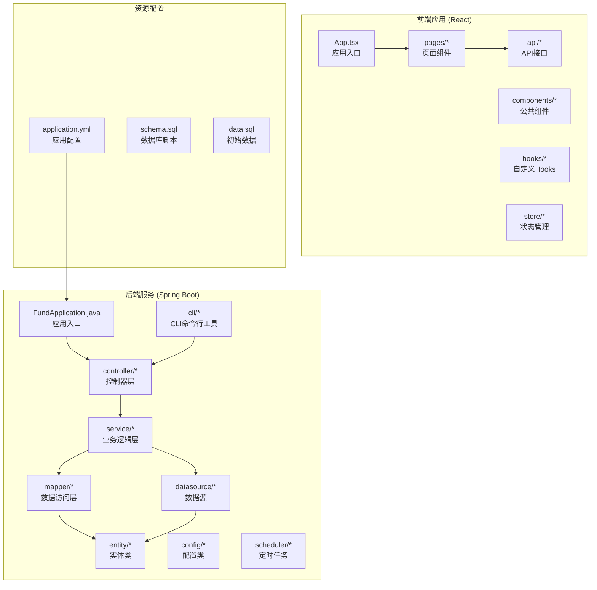
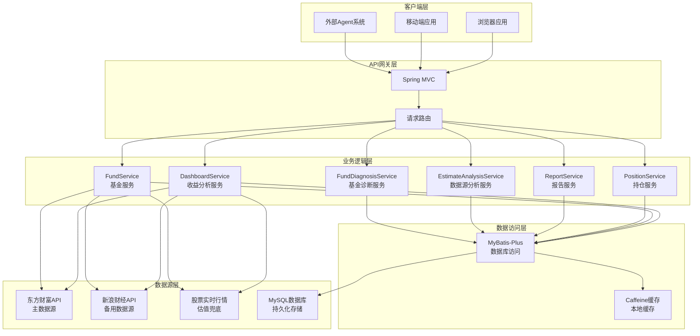
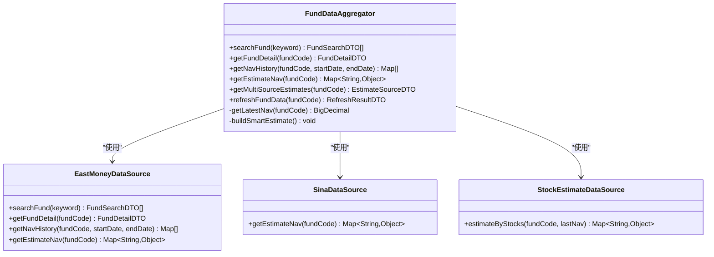
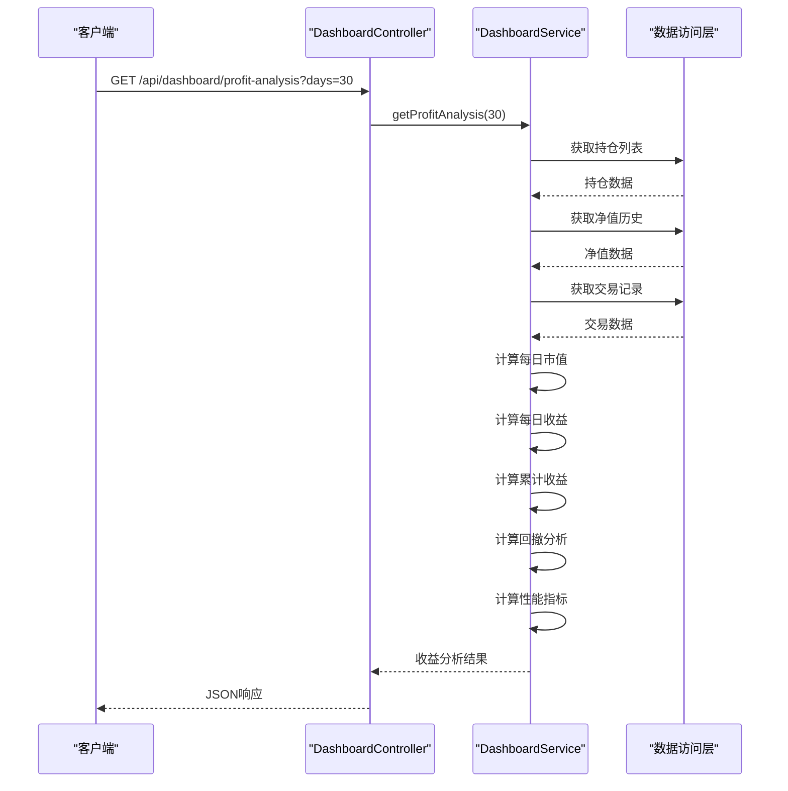
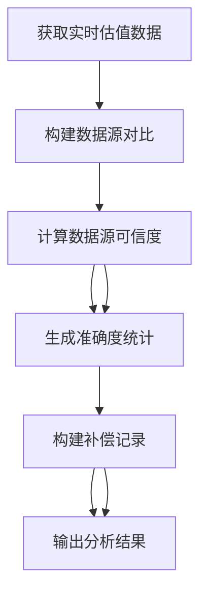
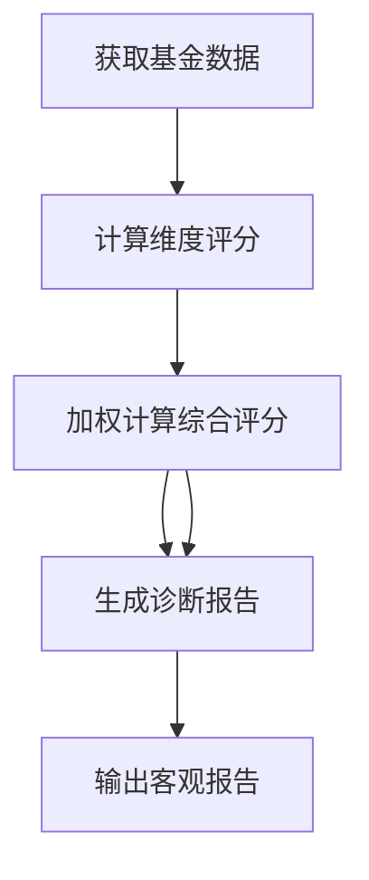
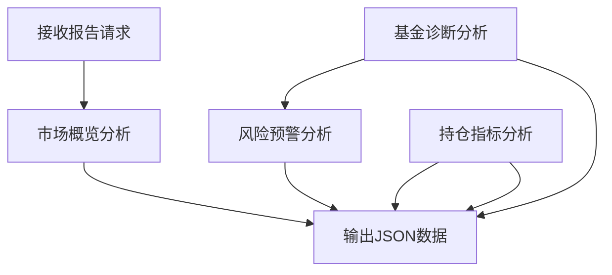
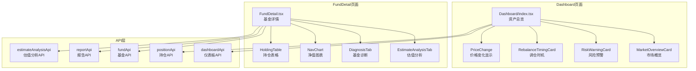
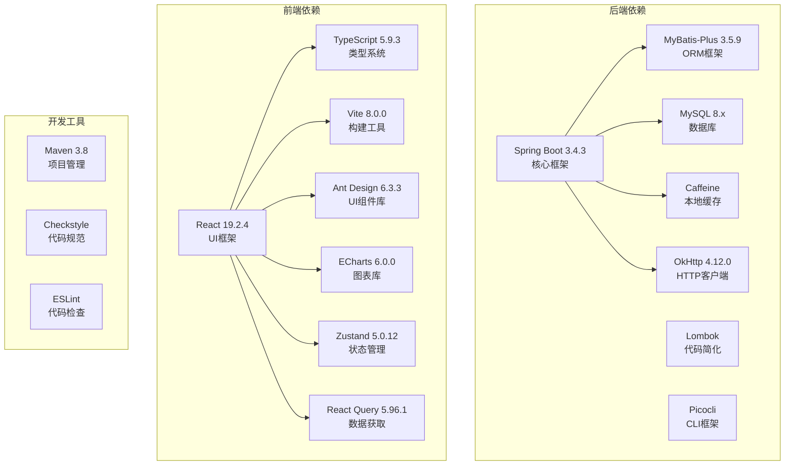

# 报告分析系统

<cite>
**本文档引用的文件**
- [FundApplication.java](file://src/main/java/com/qoder/fund/FundApplication.java)
- [README.md](file://README.md)
- [PRD.md](file://PRD.md)
- [pom.xml](file://pom.xml)
- [FundController.java](file://src/main/java/com/qoder/fund/controller/FundController.java)
- [FundService.java](file://src/main/java/com/qoder/fund/service/FundService.java)
- [FundDataAggregator.java](file://src/main/java/com/qoder/fund/datasource/FundDataAggregator.java)
- [EastMoneyDataSource.java](file://src/main/java/com/qoder/fund/datasource/EastMoneyDataSource.java)
- [Fund.java](file://src/main/java/com/qoder/fund/entity/Fund.java)
- [DashboardService.java](file://src/main/java/com/qoder/fund/service/DashboardService.java)
- [EstimateAnalysisService.java](file://src/main/java/com/qoder/fund/service/EstimateAnalysisService.java)
- [EstimateAnalysisDTO.java](file://src/main/java/com/qoder/fund/dto/EstimateAnalysisDTO.java)
- [FundDiagnosisService.java](file://src/main/java/com/qoder/fund/service/FundDiagnosisService.java)
- [FundDiagnosisDTO.java](file://src/main/java/com/qoder/fund/dto/FundDiagnosisDTO.java)
- [ReportController.java](file://src/main/java/com/qoder/fund/controller/ReportController.java)
- [ReportCommand.java](file://src/main/java/com/qoder/fund/cli/ReportCommand.java)
- [application.yml](file://src/main/resources/application.yml)
- [WebConfig.java](file://src/main/java/com/qoder/fund/config/WebConfig.java)
- [App.tsx](file://fund-web/src/App.tsx)
- [Dashboard/index.tsx](file://fund-web/src/pages/Dashboard/index.tsx)
- [FundDetail.tsx](file://fund-web/src/pages/Fund/FundDetail.tsx)
- [EstimateAnalysisTab.tsx](file://fund-web/src/pages/Fund/EstimateAnalysisTab.tsx)
- [DiagnosisTab.tsx](file://fund-web/src/pages/Fund/DiagnosisTab.tsx)
- [RebalanceTimingCard.tsx](file://fund-web/src/components/RebalanceTimingCard.tsx)
- [RiskWarningCard.tsx](file://fund-web/src/components/RiskWarningCard.tsx)
- [estimateAnalysis.ts](file://fund-web/src/api/estimateAnalysis.ts)
- [fund.ts](file://fund-web/src/api/fund.ts)
- [dashboard.ts](file://fund-web/src/api/dashboard.ts)
</cite>

## 更新摘要
**所做更改**
- 系统已从"AI分析系统"重命名为"报告分析系统"
- 移除了所有AI智能分析功能，包括AI推荐、AI诊断、AI预测等
- 更新了系统定位描述，强调客观数据聚合和分析
- 删除了AI相关的组件和功能实现
- 更新了架构图和组件说明，反映纯客观数据分析模式
- 移除了AI分析相关的API接口和前端组件

## 目录
1. [简介](#简介)
2. [项目结构](#项目结构)
3. [核心组件](#核心组件)
4. [架构概览](#架构概览)
5. [详细组件分析](#详细组件分析)
6. [依赖分析](#依赖分析)
7. [性能考虑](#性能考虑)
8. [故障排除指南](#故障排除指南)
9. [结论](#结论)

## 简介

"基金管家"报告分析系统是一个面向个人投资者的客观数据分析系统，定位为"一站式基金数据聚合管理工具"。该系统专注于基金数据展示、持仓管理、收益分析和投资决策辅助，帮助用户高效管理分散在多个平台的基金投资。

系统采用前后端分离架构，后端基于Spring Boot 3.4.3，前端基于React 19.2.4，提供实时估值、客观分析、数据聚合等核心功能。系统具备CLI工具支持，可进行定时任务和数据同步。

**更新** 系统现已完全移除AI分析功能，专注于客观的数据聚合和分析，不再提供AI驱动的预测和推荐。系统现更名为"报告分析系统"，专门提供面向外部Agent的数据供给接口。

## 项目结构

**图表来源**
- [FundApplication.java:1-16](file://src/main/java/com/qoder/fund/FundApplication.java#L1-L16)
- [App.tsx:1-67](file://fund-web/src/App.tsx#L1-L67)

**章节来源**
- [README.md:191-222](file://README.md#L191-L222)
- [pom.xml:1-179](file://pom.xml#L1-L179)

## 核心组件

### 后端核心组件

系统的核心组件包括数据聚合器、多数据源适配器、业务服务层和控制器层：

- **FundDataAggregator**: 多数据源聚合器，负责整合多个数据源的数据，提供统一的估值计算和数据验证
- **FundService**: 业务服务层，封装基金相关的业务逻辑，包括搜索、详情查询、净值历史获取等
- **FundController**: 控制器层，处理HTTP请求，提供RESTful API接口
- **数据源适配器**: 包括东方财富、新浪财经、股票估值等数据源适配器
- **EstimateAnalysisService**: 数据源准确度分析服务，提供客观的数据质量评估
- **FundDiagnosisService**: 基金诊断服务，基于规则引擎提供客观的诊断报告
- **ReportController**: 报告分析控制器，提供面向外部Agent的数据供给接口
- **ReportCommand**: CLI命令行工具，提供数据分析报告的命令行接口

### 前端核心组件

前端采用React + TypeScript架构，主要组件包括：

- **Dashboard页面**: 资产总览、收益趋势、持仓列表展示
- **FundDetail页面**: 基金详情、净值走势、历史业绩分析
- **估值分析组件**: 数据源对比、准确度统计、补偿记录展示
- **诊断报告组件**: 基金诊断报告、多维度评分展示
- **数据可视化组件**: ECharts图表、价格变化显示、行业分布饼图

**更新** 移除了AI智能分析组件，包括市场概览、风险预警、调仓时机分析等AI相关功能。

**章节来源**
- [FundDataAggregator.java:1-770](file://src/main/java/com/qoder/fund/datasource/FundDataAggregator.java#L1-L770)
- [FundService.java:1-75](file://src/main/java/com/qoder/fund/service/FundService.java#L1-L75)
- [FundController.java:1-79](file://src/main/java/com/qoder/fund/controller/FundController.java#L1-L79)
- [ReportController.java:1-40](file://src/main/java/com/qoder/fund/controller/ReportController.java#L1-L40)
- [ReportCommand.java:1-701](file://src/main/java/com/qoder/fund/cli/ReportCommand.java#L1-L701)

## 架构概览

**图表来源**
- [DashboardService.java:1-624](file://src/main/java/com/qoder/fund/service/DashboardService.java#L1-L624)
- [FundDataAggregator.java:1-770](file://src/main/java/com/qoder/fund/datasource/FundDataAggregator.java#L1-L770)
- [EstimateAnalysisService.java:1-392](file://src/main/java/com/qoder/fund/service/EstimateAnalysisService.java#L1-L392)
- [FundDiagnosisService.java:1-587](file://src/main/java/com/qoder/fund/service/FundDiagnosisService.java#L1-L587)
- [application.yml:1-68](file://src/main/resources/application.yml#L1-L68)

## 详细组件分析

### 数据聚合器组件

数据聚合器是系统的核心组件，负责多数据源的协调和数据融合：

**图表来源**
- [FundDataAggregator.java:1-770](file://src/main/java/com/qoder/fund/datasource/FundDataAggregator.java#L1-L770)
- [EastMoneyDataSource.java:1-800](file://src/main/java/com/qoder/fund/datasource/EastMoneyDataSource.java#L1-L800)

数据聚合器实现了以下关键功能：

1. **多数据源降级机制**: 主数据源失败时自动切换到备用数据源
2. **智能估值计算**: 基于历史准确度数据动态调整各数据源权重
3. **缓存策略**: 对频繁访问的数据进行缓存，提高响应速度
4. **数据验证**: 对获取的数据进行完整性检查和验证

**章节来源**
- [FundDataAggregator.java:56-146](file://src/main/java/com/qoder/fund/datasource/FundDataAggregator.java#L56-L146)
- [FundDataAggregator.java:237-341](file://src/main/java/com/qoder/fund/datasource/FundDataAggregator.java#L237-L341)

### 收益分析服务

收益分析服务提供了复杂的投资收益分析功能：

**图表来源**
- [DashboardService.java:195-345](file://src/main/java/com/qoder/fund/service/DashboardService.java#L195-L345)

收益分析服务的主要功能包括：

1. **精确收益计算**: 正确处理交易记录，排除本金变动干扰
2. **回撤分析**: 计算最大回撤、回撤恢复时间等关键指标
3. **性能指标**: 夏普比率、波动率、胜率等专业分析指标
4. **可视化支持**: 为前端提供图表友好的数据格式

**章节来源**
- [DashboardService.java:347-433](file://src/main/java/com/qoder/fund/service/DashboardService.java#L347-L433)
- [DashboardService.java:450-622](file://src/main/java/com/qoder/fund/service/DashboardService.java#L450-L622)

### 估值分析服务

**更新** 新增的估值分析服务提供客观的数据质量评估：

**图表来源**
- [EstimateAnalysisService.java:45-65](file://src/main/java/com/qoder/fund/service/EstimateAnalysisService.java#L45-L65)
- [EstimateAnalysisService.java:70-147](file://src/main/java/com/qoder/fund/service/EstimateAnalysisService.java#L70-L147)
- [EstimateAnalysisService.java:169-202](file://src/main/java/com/qoder/fund/service/EstimateAnalysisService.java#L169-L202)
- [EstimateAnalysisService.java:242-351](file://src/main/java/com/qoder/fund/service/EstimateAnalysisService.java#L242-L351)

估值分析服务提供以下客观分析功能：

1. **数据源对比**: 展示各数据源的实时估值、权重、可信度
2. **准确度统计**: 基于历史数据计算MAE、命中率、星级评级
3. **补偿记录**: 追踪预测数据与实际净值的对比情况
4. **智能综合**: 基于历史准确度的加权综合估值

**章节来源**
- [EstimateAnalysisService.java:1-392](file://src/main/java/com/qoder/fund/service/EstimateAnalysisService.java#L1-L392)
- [EstimateAnalysisDTO.java:1-156](file://src/main/java/com/qoder/fund/dto/EstimateAnalysisDTO.java#L1-L156)

### 基金诊断服务

**更新** 基金诊断服务现为纯客观分析，基于规则引擎和公开数据：

**图表来源**
- [FundDiagnosisService.java:46-70](file://src/main/java/com/qoder/fund/service/FundDiagnosisService.java#L46-L70)
- [FundDiagnosisService.java:75-144](file://src/main/java/com/qoder/fund/service/FundDiagnosisService.java#L75-L144)

基金诊断服务提供以下客观分析功能：

1. **多维度评分**: 估值合理性、业绩表现、风险控制、稳定性、费率优势
2. **综合评分**: 基于权重计算的客观评分
3. **诊断摘要**: 基于评分的客观总结
4. **风险提示**: 基于数据的客观风险警告

**章节来源**
- [FundDiagnosisService.java:1-587](file://src/main/java/com/qoder/fund/service/FundDiagnosisService.java#L1-L587)
- [FundDiagnosisDTO.java:1-130](file://src/main/java/com/qoder/fund/dto/FundDiagnosisDTO.java#L1-L130)

### 报告分析服务

**新增** 报告分析服务提供面向外部Agent的数据供给接口：

**图表来源**
- [ReportCommand.java:85-228](file://src/main/java/com/qoder/fund/cli/ReportCommand.java#L85-L228)
- [ReportCommand.java:230-393](file://src/main/java/com/qoder/fund/cli/ReportCommand.java#L230-L393)
- [ReportCommand.java:395-685](file://src/main/java/com/qoder/fund/cli/ReportCommand.java#L395-L685)

报告分析服务提供以下客观数据输出功能：

1. **市场概览**: 大盘指数、板块涨跌、指数走势等客观数据
2. **基金诊断**: 维度评分、估值分析、业绩分析、风险分析等客观指标
3. **风险预警**: 组合级风险检测、健康指标、风险项列表等客观数据
4. **持仓指标**: 近期走势、重仓股表现、数据源准确度等客观指标

**章节来源**
- [ReportCommand.java:1-701](file://src/main/java/com/qoder/fund/cli/ReportCommand.java#L1-L701)
- [ReportController.java:1-40](file://src/main/java/com/qoder/fund/controller/ReportController.java#L1-L40)

### 前端组件架构

前端采用模块化的组件架构，主要页面组件包括：

**图表来源**
- [Dashboard/index.tsx:1-230](file://fund-web/src/pages/Dashboard/index.tsx#L1-L230)
- [FundDetail.tsx:1-393](file://fund-web/src/pages/Fund/FundDetail.tsx#L1-L393)
- [EstimateAnalysisTab.tsx:1-428](file://fund-web/src/pages/Fund/EstimateAnalysisTab.tsx#L1-L428)
- [DiagnosisTab.tsx:1-306](file://fund-web/src/pages/Fund/DiagnosisTab.tsx#L1-L306)

**更新** 移除了AI智能分析相关的组件，包括市场概览、风险预警、调仓时机等AI相关功能。

**章节来源**
- [Dashboard/index.tsx:16-227](file://fund-web/src/pages/Dashboard/index.tsx#L16-L227)
- [FundDetail.tsx:24-389](file://fund-web/src/pages/Fund/FundDetail.tsx#L24-L389)

## 依赖分析

系统采用现代化的技术栈，主要依赖关系如下：

**图表来源**
- [pom.xml:20-116](file://pom.xml#L20-L116)
- [README.md:66-92](file://README.md#L66-L92)

**章节来源**
- [pom.xml:16-179](file://pom.xml#L16-L179)
- [README.md:95-187](file://README.md#L95-L187)

## 性能考虑

系统在性能方面采用了多项优化策略：

### 缓存策略
- **多级缓存**: Caffeine本地缓存 + Redis分布式缓存
- **智能过期**: 不同数据类型的缓存时间差异化配置
- **缓存穿透防护**: 对空结果也进行缓存，防止恶意请求

### 数据访问优化
- **批量查询**: 支持批量获取基金数据，减少网络往返
- **索引优化**: 对常用查询字段建立数据库索引
- **连接池配置**: HikariCP连接池优化数据库连接管理

### 前端性能优化
- **懒加载**: 路由级别的代码分割
- **虚拟滚动**: 大列表数据的虚拟化渲染
- **请求去重**: 相同请求的去重处理

### 算法优化
- **智能估值**: 基于历史准确度的动态权重调整
- **增量更新**: 只更新变化的数据，减少全量刷新
- **并发处理**: 多数据源并行获取，缩短响应时间

## 故障排除指南

### 常见问题及解决方案

#### 数据源连接问题
**症状**: 基金数据无法获取或显示为空
**原因**: 第三方API接口限制或网络问题
**解决方案**:
1. 检查数据源连接状态
2. 查看熔断器状态
3. 验证API密钥配置
4. 检查网络代理设置

#### 缓存失效问题
**症状**: 数据更新不及时或显示过期数据
**解决方法**:
1. 手动清除相关缓存键
2. 检查缓存配置参数
3. 验证缓存清理策略
4. 重启应用以重置缓存状态

#### 性能问题
**症状**: 接口响应缓慢或超时
**排查步骤**:
1. 检查数据库查询执行计划
2. 监控缓存命中率
3. 分析GC日志
4. 检查线程池状态

**章节来源**
- [FundDataAggregator.java:43-52](file://src/main/java/com/qoder/fund/datasource/FundDataAggregator.java#L43-L52)
- [application.yml:29-36](file://src/main/resources/application.yml#L29-L36)

## 结论

"基金管家"报告分析系统通过现代化的技术架构和智能化的数据处理能力，为个人投资者提供了全面的基金管理和分析工具。系统的主要优势包括：

1. **多数据源聚合**: 通过智能降级机制确保数据获取的可靠性
2. **精确计算**: 基于交易记录的精确收益分析算法
3. **客观分析**: 提供基于规则引擎的诊断报告和数据质量评估
4. **用户体验**: 响应式的界面设计和流畅的交互体验
5. **数据供给**: 面向外部Agent的标准化数据接口，提供客观指标

系统采用微服务化的架构设计，具备良好的扩展性和维护性。通过合理的缓存策略和性能优化，能够满足大规模用户同时使用的场景需求。

**更新** 系统现已完全移除AI分析功能，专注于客观的数据聚合和分析，为用户提供更加可靠和透明的投资决策支持。系统现更名为"报告分析系统"，专门提供面向外部Agent的数据供给接口，所有输出均为客观事实性指标，不包含任何主观投资建议。未来可以进一步增强的功能包括：更多数据源的接入、移动端原生应用的支持、更丰富的技术分析指标等。