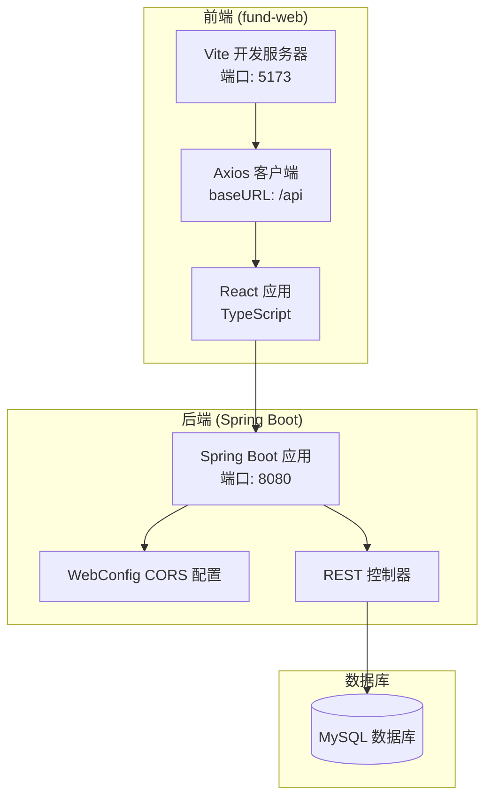
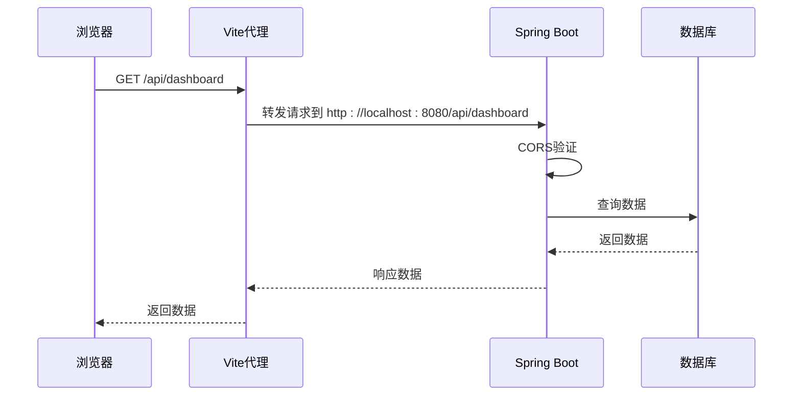
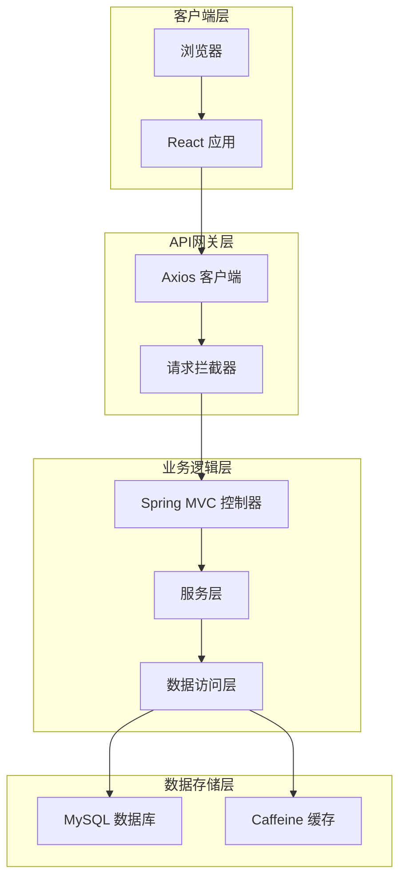
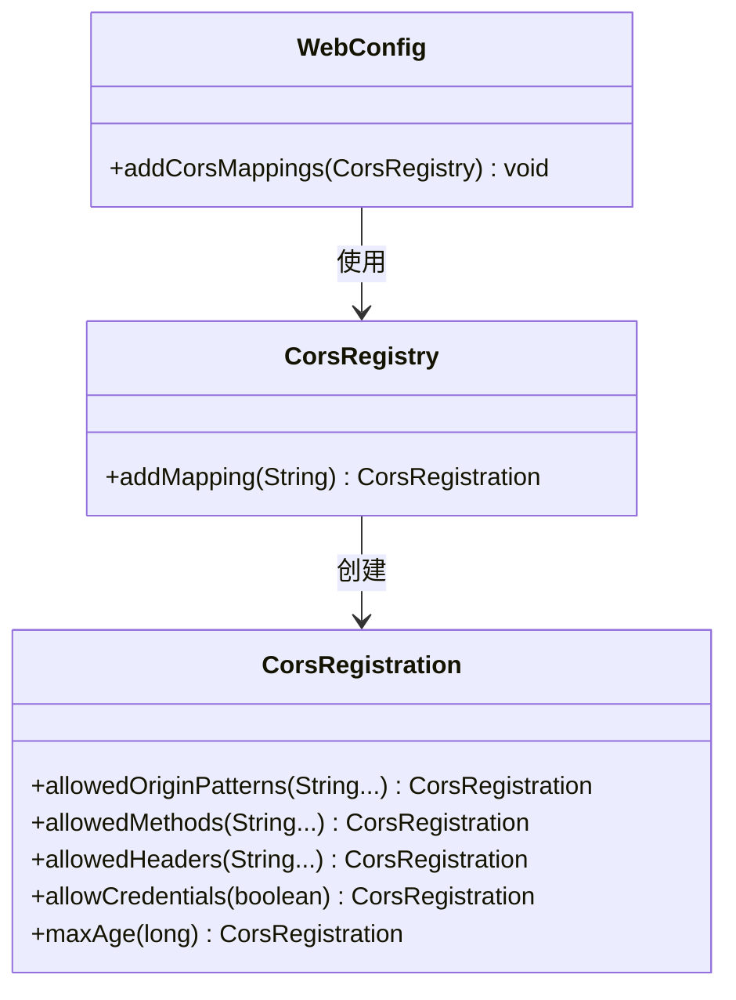
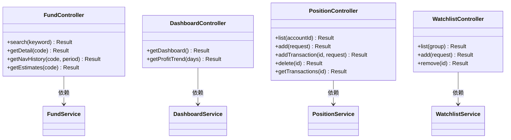
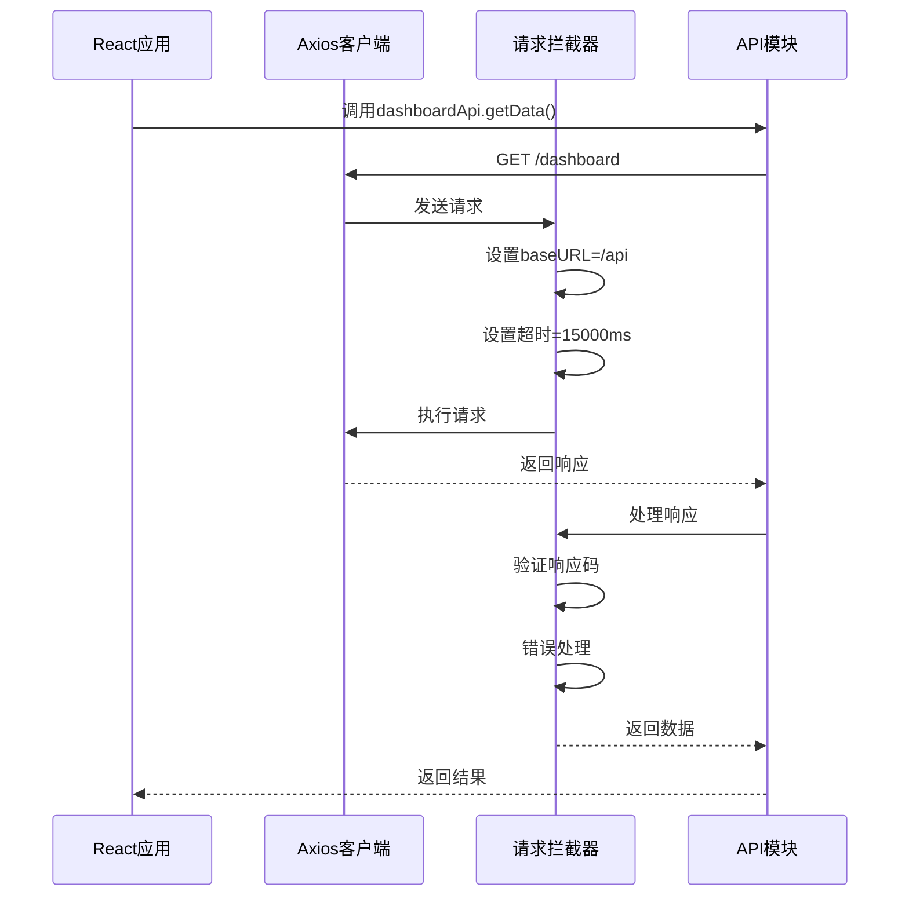
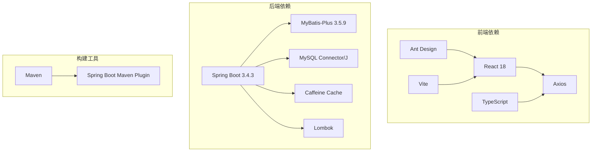
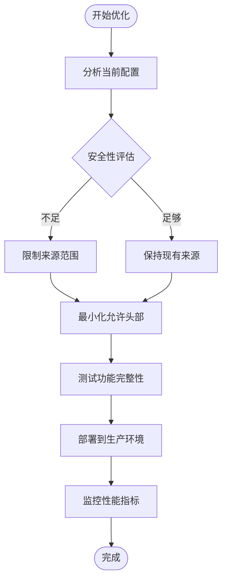

# CORS配置改进

<cite>
**本文档引用的文件**
- [WebConfig.java](file://src/main/java/com/qoder/fund/config/WebConfig.java)
- [application.yml](file://src/main/resources/application.yml)
- [vite.config.ts](file://fund-web/vite.config.ts)
- [FundController.java](file://src/main/java/com/qoder/fund/controller/FundController.java)
- [DashboardController.java](file://src/main/java/com/qoder/fund/controller/DashboardController.java)
- [PositionController.java](file://src/main/java/com/qoder/fund/controller/PositionController.java)
- [WatchlistController.java](file://src/main/java/com/qoder/fund/controller/WatchlistController.java)
- [client.ts](file://fund-web/src/api/client.ts)
- [dashboard.ts](file://fund-web/src/api/dashboard.ts)
- [fund.ts](file://fund-web/src/api/fund.ts)
- [position.ts](file://fund-web/src/api/position.ts)
- [watchlist.ts](file://fund-web/src/api/watchlist.ts)
- [pom.xml](file://pom.xml)
</cite>

## 目录
1. [简介](#简介)
2. [项目结构](#项目结构)
3. [CORS配置现状分析](#cors配置现状分析)
4. [架构概览](#架构概览)
5. [详细组件分析](#详细组件分析)
6. [依赖关系分析](#依赖关系分析)
7. [性能考虑](#性能考虑)
8. [故障排除指南](#故障排除指南)
9. [结论](#结论)

## 简介

本文档深入分析了基金管理系统中的CORS（跨域资源共享）配置改进。该系统采用前后端分离架构，前端使用React + TypeScript，后端使用Spring Boot，通过代理服务器实现跨域通信。本文档将详细分析当前的CORS配置、存在的问题以及改进建议。

## 项目结构

基金管理系统采用典型的前后端分离架构：

**图表来源**
- [vite.config.ts:1-16](file://fund-web/vite.config.ts#L1-L16)
- [WebConfig.java:1-20](file://src/main/java/com/qoder/fund/config/WebConfig.java#L1-L20)
- [application.yml:1-43](file://src/main/resources/application.yml#L1-L43)

**章节来源**
- [vite.config.ts:1-16](file://fund-web/vite.config.ts#L1-L16)
- [WebConfig.java:1-20](file://src/main/java/com/qoder/fund/config/WebConfig.java#L1-L20)
- [application.yml:1-43](file://src/main/resources/application.yml#L1-L43)

## CORS配置现状分析

### 当前配置分析

系统采用了双重CORS配置策略：

1. **前端代理配置**：Vite开发服务器通过代理转发所有/api请求到后端
2. **后端CORS配置**：Spring Boot应用配置允许特定来源的跨域请求

**图表来源**
- [vite.config.ts:8-13](file://fund-web/vite.config.ts#L8-L13)
- [WebConfig.java:11-17](file://src/main/java/com/qoder/fund/config/WebConfig.java#L11-L17)

### 配置细节分析

#### 后端CORS配置
当前后端配置存在以下特点：
- **路径映射**：仅对`/api/**`路径启用CORS
- **来源限制**：仅允许`http://localhost:*`模式
- **方法开放**：允许GET、POST、PUT、DELETE、OPTIONS
- **凭证支持**：允许携带Cookie和认证信息
- **缓存设置**：预检请求缓存1小时

#### 前端代理配置
前端通过Vite代理实现：
- **代理目标**：http://localhost:8080
- **变更源**：保持原始请求头信息
- **开发友好**：简化开发环境下的跨域问题

**章节来源**
- [WebConfig.java:10-18](file://src/main/java/com/qoder/fund/config/WebConfig.java#L10-L18)
- [vite.config.ts:6-14](file://fund-web/vite.config.ts#L6-L14)

## 架构概览

系统采用微服务架构风格的单体应用：

**图表来源**
- [client.ts:4-7](file://fund-web/src/api/client.ts#L4-L7)
- [FundController.java:16-51](file://src/main/java/com/qoder/fund/controller/FundController.java#L16-L51)
- [application.yml:18-21](file://src/main/resources/application.yml#L18-L21)

## 详细组件分析

### WebConfig CORS配置组件

WebConfig类实现了Spring MVC的WebMvcConfigurer接口，提供全局CORS配置：

**图表来源**
- [WebConfig.java:8-18](file://src/main/java/com/qoder/fund/config/WebConfig.java#L8-L18)

#### 配置参数详解

| 参数 | 当前值 | 说明 | 安全性影响 |
|------|--------|------|------------|
| 路径映射 | `/api/**` | 仅对API端点启用CORS | ✅ 精确控制 |
| 允许来源 | `http://localhost:*` | 仅限本地开发环境 | ⚠️ 生产环境风险 |
| 允许方法 | GET, POST, PUT, DELETE, OPTIONS | 完整HTTP方法集 | ✅ 安全 |
| 允许头部 | `*` | 允许所有请求头 | ⚠️ 可能暴露敏感信息 |
| 凭证支持 | `true` | 允许携带Cookie | ⚠️ 安全风险 |
| 预检缓存 | 3600秒 | 缓存预检请求结果 | ✅ 性能优化 |

**章节来源**
- [WebConfig.java:11-17](file://src/main/java/com/qoder/fund/config/WebConfig.java#L11-L17)

### API控制器组件

系统提供了多个REST API控制器，每个都位于不同的命名空间下：

**图表来源**
- [FundController.java:16-51](file://src/main/java/com/qoder/fund/controller/FundController.java#L16-L51)
- [DashboardController.java:10-26](file://src/main/java/com/qoder/fund/controller/DashboardController.java#L10-L26)
- [PositionController.java:15-51](file://src/main/java/com/qoder/fund/controller/PositionController.java#L15-L51)
- [WatchlistController.java:12-35](file://src/main/java/com/qoder/fund/controller/WatchlistController.java#L12-L35)

### 前端API客户端组件

前端使用Axios创建统一的API客户端：

**图表来源**
- [client.ts:4-28](file://fund-web/src/api/client.ts#L4-L28)
- [dashboard.ts:33-39](file://fund-web/src/api/dashboard.ts#L33-L39)

**章节来源**
- [client.ts:9-28](file://fund-web/src/api/client.ts#L9-L28)
- [dashboard.ts:33-39](file://fund-web/src/api/dashboard.ts#L33-L39)

## 依赖关系分析

系统的技术栈依赖关系如下：

**图表来源**
- [pom.xml:20-86](file://pom.xml#L20-L86)

### 核心依赖特性

| 依赖项 | 版本 | 用途 | 安全特性 |
|--------|------|------|----------|
| Spring Boot | 3.4.3 | Web框架 | ✅ 官方维护 |
| MyBatis-Plus | 3.5.9 | ORM框架 | ✅ 稳定版本 |
| MySQL Connector/J | 运行时 | 数据库驱动 | ✅ 官方驱动 |
| Caffeine | 缓存库 | 内存缓存 | ✅ 高性能 |
| Axios | HTTP客户端 | API调用 | ✅ 成熟库 |
| Vite | 构建工具 | 开发服务器 | ✅ 现代工具 |

**章节来源**
- [pom.xml:16-18](file://pom.xml#L16-L18)
- [pom.xml:20-86](file://pom.xml#L20-L86)

## 性能考虑

### CORS配置对性能的影响

当前CORS配置在性能方面具有以下特点：

1. **预检请求缓存**：3600秒的maxAge设置减少了重复的预检请求
2. **精确路径匹配**：仅对`/api/**`启用CORS，避免不必要的跨域处理
3. **凭证支持**：允许携带Cookie可能增加请求复杂度
4. **头部通配符**：`*`允许所有头部可能影响缓存效率

### 优化建议

## 故障排除指南

### 常见CORS问题及解决方案

#### 1. 开发环境跨域问题
**症状**：前端请求后端API时出现CORS错误
**原因**：开发服务器端口与后端端口不匹配
**解决方案**：使用Vite代理配置

#### 2. 生产环境CORS配置问题
**症状**：部署到生产环境后API请求失败
**原因**：当前配置仅允许localhost来源
**解决方案**：修改WebConfig中的allowedOriginPatterns

#### 3. 凭证相关问题
**症状**：登录状态无法保持
**原因**：allowCredentials配置不当
**解决方案**：确保前后端凭证配置一致

**章节来源**
- [WebConfig.java:13](file://src/main/java/com/qoder/fund/config/WebConfig.java#L13)
- [client.ts:15](file://fund-web/src/api/client.ts#L15)

### 调试步骤

1. **检查浏览器开发者工具**：查看Network标签页中的CORS相关错误
2. **验证代理配置**：确认Vite代理正确转发到后端
3. **测试后端CORS**：直接访问后端API验证CORS响应头
4. **检查凭证设置**：验证是否正确处理Cookie和认证信息

## 结论

通过对基金管理系统CORS配置的深入分析，可以得出以下结论：

### 现状评估

当前配置在开发环境中运行良好，但在生产环境中存在明显的安全风险。主要问题包括：

1. **来源限制过于宽松**：仅限localhost，不适合生产环境
2. **凭证支持风险**：允许携带Cookie可能带来安全风险
3. **头部通配符**：可能暴露敏感信息

### 改进建议

1. **生产环境配置**：根据实际域名配置allowedOriginPatterns
2. **最小权限原则**：仅开放必要的HTTP方法和头部
3. **凭证安全**：谨慎使用allowCredentials，考虑使用Token认证
4. **监控和日志**：添加CORS相关的监控和审计日志

### 实施优先级

1. **短期**：修复开发环境的CORS配置问题
2. **中期**：完善生产环境的安全配置
3. **长期**：建立CORS配置的自动化测试和监控

通过这些改进，系统可以在保证功能完整性的同时，提升安全性和可维护性。