# FundController增强

<cite>
**本文档引用的文件**
- [FundController.java](file://src/main/java/com/qoder/fund/controller/FundController.java)
- [FundService.java](file://src/main/java/com/qoder/fund/service/FundService.java)
- [FundDataAggregator.java](file://src/main/java/com/qoder/fund/datasource/FundDataAggregator.java)
- [EastMoneyDataSource.java](file://src/main/java/com/qoder/fund/datasource/EastMoneyDataSource.java)
- [StockEstimateDataSource.java](file://src/main/java/com/qoder/fund/datasource/StockEstimateDataSource.java)
- [SinaDataSource.java](file://src/main/java/com/qoder/fund/datasource/SinaDataSource.java)
- [TencentDataSource.java](file://src/main/java/com/qoder/fund/datasource/TencentDataSource.java)
- [FundDataSource.java](file://src/main/java/com/qoder/fund/datasource/FundDataSource.java)
- [FundDetailDTO.java](file://src/main/java/com/qoder/fund/dto/FundDetailDTO.java)
- [EstimateSourceDTO.java](file://src/main/java/com/qoder/fund/dto/EstimateSourceDTO.java)
- [FundSearchDTO.java](file://src/main/java/com/qoder/fund/dto/FundSearchDTO.java)
- [NavHistoryDTO.java](file://src/main/java/com/qoder/fund/dto/NavHistoryDTO.java)
- [RefreshResultDTO.java](file://src/main/java/com/qoder/fund/dto/RefreshResultDTO.java)
- [application.yml](file://src/main/resources/application.yml)
- [schema.sql](file://src/main/resources/db/schema.sql)
- [data.sql](file://src/main/resources/db/data.sql)
- [FundDetail.tsx](file://fund-web/src/pages/Fund/FundDetail.tsx)
- [fund.ts](file://fund-web/src/api/fund.ts)
- [PRD.md](file://PRD.md)
</cite>

## 更新摘要
**变更内容**
- 新增手动数据刷新端点功能，支持前端主动刷新数据
- 添加RefreshResultDTO数据传输对象
- 更新FundController控制器，新增POST /api/fund/{code}/refresh端点
- 增强FundService和FundDataAggregator的刷新数据处理能力
- 完善前端FundDetail页面的刷新功能集成
- 新增多个数据源支持（新浪、腾讯财经）

## 目录
1. [简介](#简介)
2. [项目结构](#项目结构)
3. [核心组件](#核心组件)
4. [架构概览](#架构概览)
5. [详细组件分析](#详细组件分析)
6. [依赖关系分析](#依赖关系分析)
7. [性能考虑](#性能考虑)
8. [故障排除指南](#故障排除指南)
9. [结论](#结论)

## 简介

FundController增强项目是一个基于Spring Boot和React的基金管理系统，专注于提供基金数据聚合、查询和分析功能。该项目实现了完整的基金数据获取、处理和展示流程，包括多数据源聚合、实时估值、净值历史查询等功能。

项目采用前后端分离架构，后端使用Java Spring Boot提供RESTful API，前端使用React TypeScript构建用户界面。系统集成了多个基金数据源，包括东方财富、天天基金等，提供了丰富的基金信息展示和分析功能。

**更新** 新增手动数据刷新功能，允许用户主动触发数据同步，提供更灵活的数据更新机制。系统现已支持6个数据源，包括东方财富、天天基金、新浪财经、腾讯财经、股票估算等多种数据源，提供更全面的估值覆盖。

## 项目结构

项目采用标准的Maven多模块结构，主要包含以下目录：

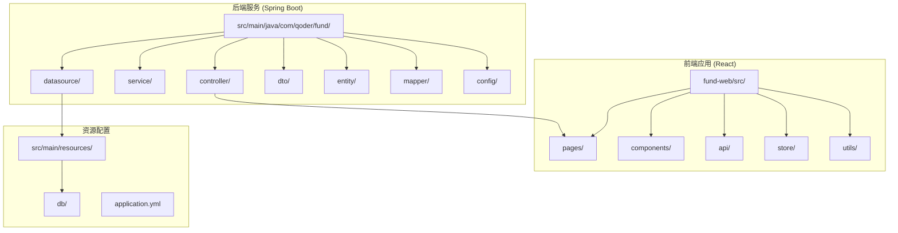

**图表来源**
- [FundController.java:1-67](file://src/main/java/com/qoder/fund/controller/FundController.java#L1-L67)
- [FundService.java:1-75](file://src/main/java/com/qoder/fund/service/FundService.java#L1-L75)
- [FundDataAggregator.java:1-678](file://src/main/java/com/qoder/fund/datasource/FundDataAggregator.java#L1-L678)

**章节来源**
- [FundController.java:1-67](file://src/main/java/com/qoder/fund/controller/FundController.java#L1-L67)
- [application.yml:1-43](file://src/main/resources/application.yml#L1-L43)

## 核心组件

### 控制器层

FundController是系统的核心控制器，负责处理所有与基金相关的HTTP请求：

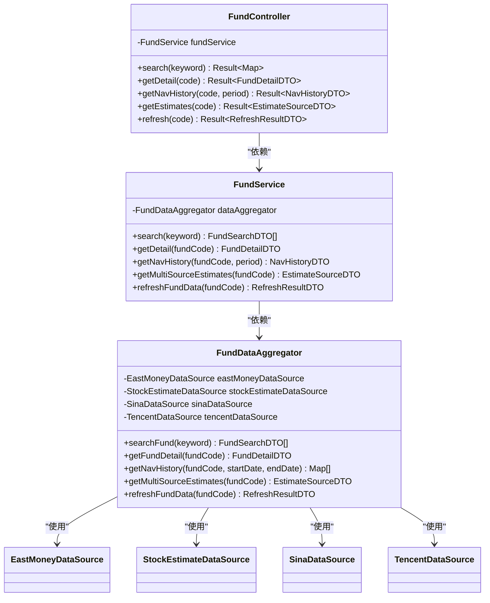

**图表来源**
- [FundController.java:22-67](file://src/main/java/com/qoder/fund/controller/FundController.java#L22-L67)
- [FundService.java:20-75](file://src/main/java/com/qoder/fund/service/FundService.java#L20-L75)
- [FundDataAggregator.java:40-56](file://src/main/java/com/qoder/fund/datasource/FundDataAggregator.java#L40-L56)

### 数据源层

系统实现了多数据源聚合架构，确保数据获取的可靠性和完整性：

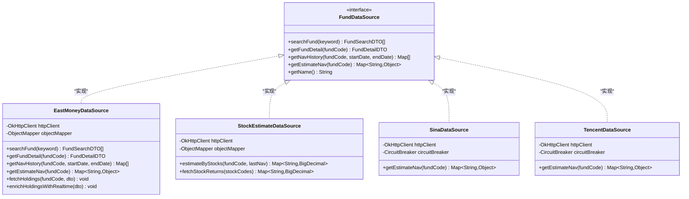

**图表来源**
- [FundDataSource.java:13-44](file://src/main/java/com/qoder/fund/datasource/FundDataSource.java#L13-L44)
- [EastMoneyDataSource.java:26-695](file://src/main/java/com/qoder/fund/datasource/EastMoneyDataSource.java#L26-L695)
- [StockEstimateDataSource.java:24-183](file://src/main/java/com/qoder/fund/datasource/StockEstimateDataSource.java#L24-L183)
- [SinaDataSource.java:15-123](file://src/main/java/com/qoder/fund/datasource/SinaDataSource.java#L15-L123)
- [TencentDataSource.java:15-126](file://src/main/java/com/qoder/fund/datasource/TencentDataSource.java#L15-L126)

### 数据传输对象

系统定义了完整的DTO结构来封装数据传输：

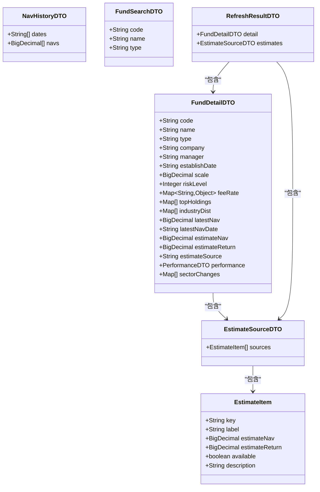

**图表来源**
- [FundDetailDTO.java:10-40](file://src/main/java/com/qoder/fund/dto/FundDetailDTO.java#L10-L40)
- [EstimateSourceDTO.java:9-22](file://src/main/java/com/qoder/fund/dto/EstimateSourceDTO.java#L9-L22)
- [NavHistoryDTO.java:9-12](file://src/main/java/com/qoder/fund/dto/NavHistoryDTO.java#L9-L12)
- [FundSearchDTO.java:6-10](file://src/main/java/com/qoder/fund/dto/FundSearchDTO.java#L6-L10)
- [RefreshResultDTO.java:5-9](file://src/main/java/com/qoder/fund/dto/RefreshResultDTO.java#L5-L9)

**章节来源**
- [FundController.java:22-67](file://src/main/java/com/qoder/fund/controller/FundController.java#L22-L67)
- [FundService.java:20-75](file://src/main/java/com/qoder/fund/service/FundService.java#L20-L75)
- [FundDataAggregator.java:36-349](file://src/main/java/com/qoder/fund/datasource/FundDataAggregator.java#L36-L349)

## 架构概览

系统采用分层架构设计，实现了清晰的关注点分离：

```mermaid
graph TB
subgraph "表现层"
FE[前端React应用]
API[RESTful API]
end
subgraph "业务逻辑层"
CTRL[控制器层]
SVC[服务层]
AGG[数据聚合层]
end
subgraph "数据访问层"
DS[数据源接口]
EM[东方财富数据源]
SE[股票估值数据源]
SI[新浪财经数据源]
TC[Tencent数据源]
end
subgraph "数据存储层"
DB[(MySQL数据库)]
CACHE[(Caffeine缓存)]
END
FE --> API
API --> CTRL
CTRL --> SVC
SVC --> AGG
AGG --> DS
DS --> EM
DS --> SE
DS --> SI
DS --> TC
AGG --> CACHE
AGG --> DB
SVC --> DB
CTRL --> API
```

**图表来源**
- [FundController.java:17-67](file://src/main/java/com/qoder/fund/controller/FundController.java#L17-L67)
- [FundService.java:20-75](file://src/main/java/com/qoder/fund/service/FundService.java#L20-L75)
- [FundDataAggregator.java:23-95](file://src/main/java/com/qoder/fund/datasource/FundDataAggregator.java#L23-L95)

### 数据流处理

系统的数据处理流程体现了完整的数据生命周期：

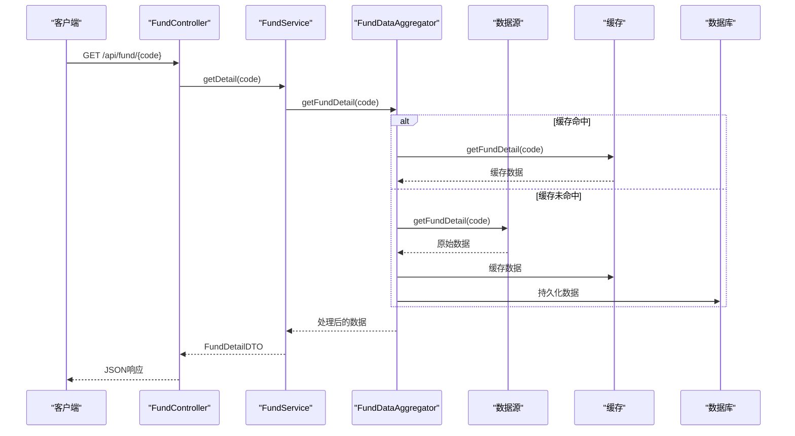

**图表来源**
- [FundController.java:37-44](file://src/main/java/com/qoder/fund/controller/FundController.java#L37-L44)
- [FundService.java:33-35](file://src/main/java/com/qoder/fund/service/FundService.java#L33-L35)
- [FundDataAggregator.java:68-87](file://src/main/java/com/qoder/fund/datasource/FundDataAggregator.java#L68-L87)

**章节来源**
- [application.yml:18-25](file://src/main/resources/application.yml#L18-L25)
- [FundDataAggregator.java:36-95](file://src/main/java/com/qoder/fund/datasource/FundDataAggregator.java#L36-L95)

## 详细组件分析

### FundController组件分析

FundController作为系统的入口点，提供了六个核心API端点：

#### 搜索功能
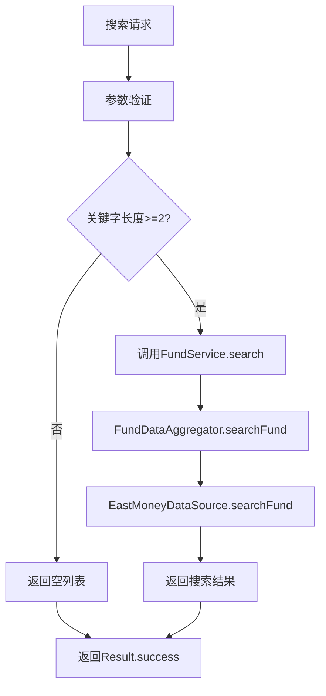

**图表来源**
- [FundController.java:29-35](file://src/main/java/com/qoder/fund/controller/FundController.java#L29-L35)
- [FundService.java:26-31](file://src/main/java/com/qoder/fund/service/FundService.java#L26-L31)
- [FundDataAggregator.java:60-63](file://src/main/java/com/qoder/fund/datasource/FundDataAggregator.java#L60-L63)

#### 详情查询功能
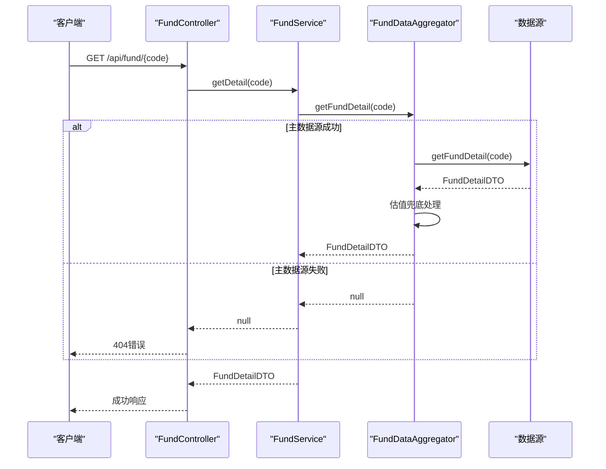

**图表来源**
- [FundController.java:37-44](file://src/main/java/com/qoder/fund/controller/FundController.java#L37-L44)
- [FundService.java:33-35](file://src/main/java/com/qoder/fund/service/FundService.java#L33-L35)
- [FundDataAggregator.java:68-87](file://src/main/java/com/qoder/fund/datasource/FundDataAggregator.java#L68-L87)

#### 净值历史查询功能
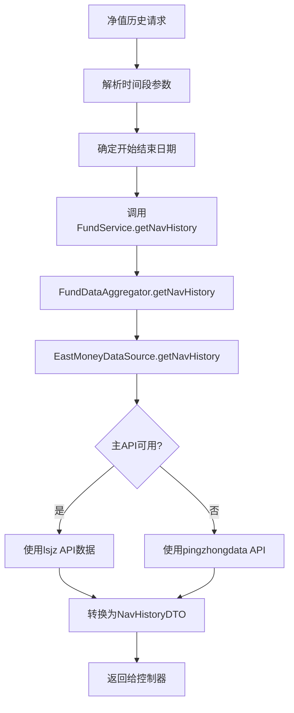

**图表来源**
- [FundController.java:46-51](file://src/main/java/com/qoder/fund/controller/FundController.java#L46-L51)
- [FundService.java:37-65](file://src/main/java/com/qoder/fund/service/FundService.java#L37-L65)
- [EastMoneyDataSource.java:102-181](file://src/main/java/com/qoder/fund/datasource/EastMoneyDataSource.java#L102-L181)

#### 实时估值查询功能
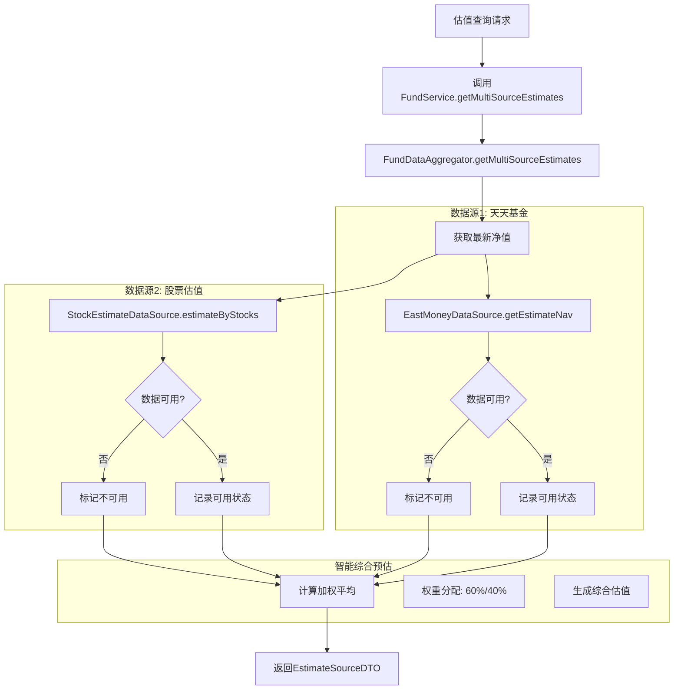

**图表来源**
- [FundController.java:53-56](file://src/main/java/com/qoder/fund/controller/FundController.java#L53-L56)
- [FundService.java:67-69](file://src/main/java/com/qoder/fund/service/FundService.java#L67-L69)
- [FundDataAggregator.java:188-312](file://src/main/java/com/qoder/fund/datasource/FundDataAggregator.java#L188-L312)

#### 手动数据刷新功能
**新增功能** FundController新增了手动数据刷新端点，允许用户主动触发数据同步：

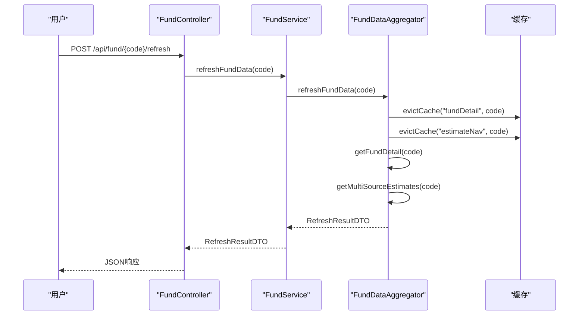

**图表来源**
- [FundController.java:58-67](file://src/main/java/com/qoder/fund/controller/FundController.java#L58-L67)
- [FundService.java:71-73](file://src/main/java/com/qoder/fund/service/FundService.java#L71-L73)
- [FundDataAggregator.java:172-183](file://src/main/java/com/qoder/fund/datasource/FundDataAggregator.java#L172-L183)

**章节来源**
- [FundController.java:29-67](file://src/main/java/com/qoder/fund/controller/FundController.java#L29-L67)
- [FundService.java:26-75](file://src/main/java/com/qoder/fund/service/FundService.java#L26-L75)

### 数据聚合器组件分析

FundDataAggregator是系统的核心组件，实现了多数据源聚合和缓存管理：

#### 缓存策略
系统采用了多层次的缓存策略来提升性能：

```mermaid
graph LR
subgraph "缓存层次"
A[Caffeine缓存] --> B[Redis缓存]
B --> C[数据库缓存]
end
subgraph "缓存键规则"
D[fundSearch:{keyword}] --> A
E[fundDetail:{code}] --> A
F[navHistory:{code}_{startDate}_{endDate}] --> A
G[estimateNav:{code}] --> A
end
subgraph "缓存失效"
H[300秒过期] --> A
I[数据更新触发失效] --> A
J[手动清除] --> A
end
```

**图表来源**
- [FundDataAggregator.java:60-95](file://src/main/java/com/qoder/fund/datasource/FundDataAggregator.java#L60-L95)
- [application.yml:20-21](file://src/main/resources/application.yml#L20-L21)

#### 估值兜底机制
系统实现了智能的估值兜底机制，确保在主数据源不可用时仍能提供估值数据：

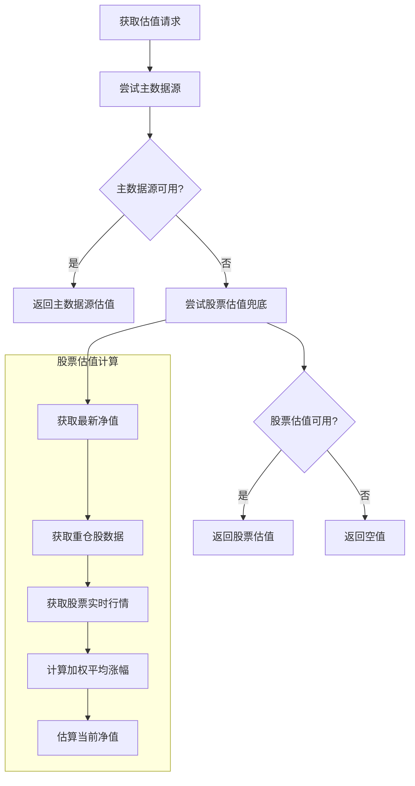

**图表来源**
- [FundDataAggregator.java:76-120](file://src/main/java/com/qoder/fund/datasource/FundDataAggregator.java#L76-L120)
- [StockEstimateDataSource.java:43-102](file://src/main/java/com/qoder/fund/datasource/StockEstimateDataSource.java#L43-L102)

#### 手动数据刷新机制
**新增功能** FundDataAggregator实现了手动数据刷新功能：

```mermaid
flowchart TD
A[手动刷新请求] --> B[清除详情缓存]
B --> C[清除估值缓存]
C --> D[重新获取基金详情]
D --> E[重新获取估值数据]
E --> F[封装刷新结果]
F --> G[返回RefreshResultDTO]
subgraph "缓存清理策略"
H[evictCache("fundDetail", code)]
I[evictCache("estimateNav", code)]
J[确保数据新鲜度]
end
A --> H
H --> I
I --> J
```

**图表来源**
- [FundDataAggregator.java:172-183](file://src/main/java/com/qoder/fund/datasource/FundDataAggregator.java#L172-L183)

#### 多数据源支持
**新增功能** 系统现已支持6个数据源，提供更全面的估值覆盖：

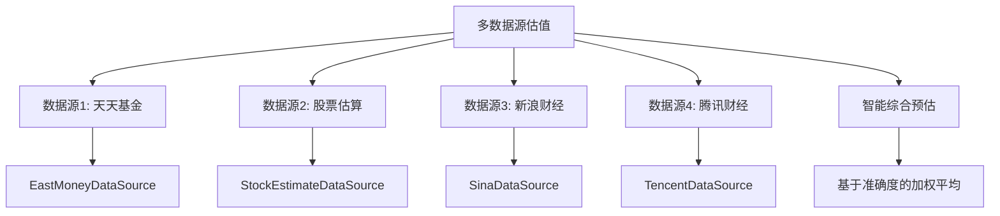

**图表来源**
- [FundDataAggregator.java:188-312](file://src/main/java/com/qoder/fund/datasource/FundDataAggregator.java#L188-L312)
- [SinaDataSource.java:40-104](file://src/main/java/com/qoder/fund/datasource/SinaDataSource.java#L40-L104)
- [TencentDataSource.java:40-106](file://src/main/java/com/qoder/fund/datasource/TencentDataSource.java#L40-L106)

**章节来源**
- [FundDataAggregator.java:40-678](file://src/main/java/com/qoder/fund/datasource/FundDataAggregator.java#L40-L678)
- [StockEstimateDataSource.java:26-183](file://src/main/java/com/qoder/fund/datasource/StockEstimateDataSource.java#L26-183)

### 前端集成分析

前端React应用与后端API的集成展现了完整的用户体验：

#### 基金详情页面
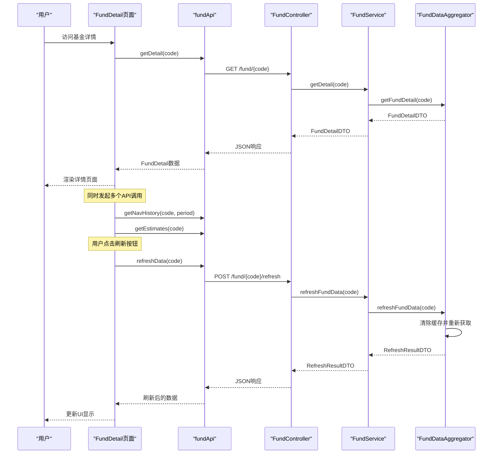

**图表来源**
- [FundDetail.tsx:35-70](file://fund-web/src/pages/Fund/FundDetail.tsx#L35-L70)
- [fund.ts:79-81](file://fund-web/src/api/fund.ts#L79-L81)

#### 实时估值切换
前端实现了灵活的估值数据源切换功能：

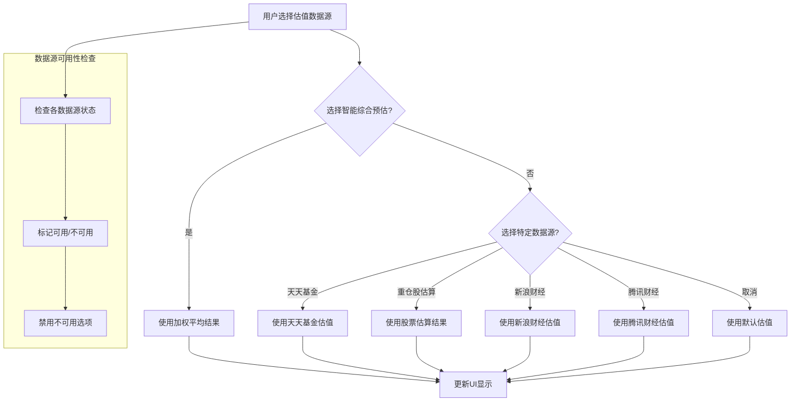

**图表来源**
- [FundDetail.tsx:207-237](file://fund-web/src/pages/Fund/FundDetail.tsx#L207-237)
- [FundDataAggregator.java:188-312](file://src/main/java/com/qoder/fund/datasource/FundDataAggregator.java#L188-L312)

#### 刷新功能集成
**新增功能** 前端集成了手动数据刷新功能：

```mermaid
flowchart TD
A[用户点击刷新按钮] --> B[设置刷新状态]
B --> C[调用refreshData(code)]
C --> D[POST /fund/{code}/refresh]
D --> E[等待响应]
E --> F{请求成功?}
F --> |是| G[更新详情数据]
F --> |否| H[显示错误提示]
G --> I[更新估值数据]
I --> J[重置刷新状态]
J --> K[显示成功消息]
H --> L[重置刷新状态]
L --> M[显示失败消息]
```

**图表来源**
- [FundDetail.tsx:72-93](file://fund-web/src/pages/Fund/FundDetail.tsx#L72-L93)
- [fund.ts:79-81](file://fund-web/src/api/fund.ts#L79-L81)

**章节来源**
- [FundDetail.tsx:20-327](file://fund-web/src/pages/Fund/FundDetail.tsx#L20-L327)
- [fund.ts:66-81](file://fund-web/src/api/fund.ts#L66-L81)

## 依赖关系分析

系统采用了清晰的依赖注入和模块化设计：

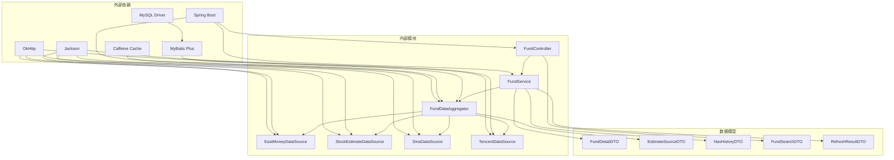

**图表来源**
- [FundController.java:3-9](file://src/main/java/com/qoder/fund/controller/FundController.java#L3-L9)
- [EastMoneyDataSource.java:9-12](file://src/main/java/com/qoder/fund/datasource/EastMoneyDataSource.java#L9-L12)
- [StockEstimateDataSource.java:8-11](file://src/main/java/com/qoder/fund/datasource/StockEstimateDataSource.java#L8-L11)
- [SinaDataSource.java:26-27](file://src/main/java/com/qoder/fund/datasource/SinaDataSource.java#L26-L27)
- [TencentDataSource.java:26-27](file://src/main/java/com/qoder/fund/datasource/TencentDataSource.java#L26-L27)

### 数据库设计

系统采用了规范的数据库设计，支持完整的基金数据管理：

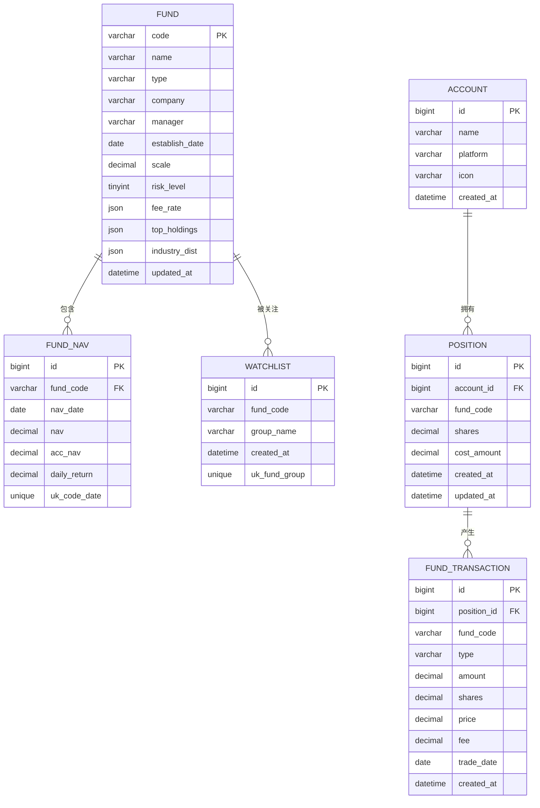

**图表来源**
- [schema.sql:1-78](file://src/main/resources/db/schema.sql#L1-L78)

**章节来源**
- [schema.sql:1-78](file://src/main/resources/db/schema.sql#L1-L78)
- [data.sql:1-9](file://src/main/resources/db/data.sql#L1-L9)

## 性能考虑

系统在设计时充分考虑了性能优化，采用了多种策略来提升响应速度和资源利用率：

### 缓存策略
- **多级缓存架构**：Caffeine本地缓存 + Redis分布式缓存
- **智能过期策略**：300秒自动过期，确保数据新鲜度
- **条件缓存**：使用unless条件避免空结果缓存
- **定向缓存清理**：支持按键名精确清理特定缓存项

### 异步处理
- **HTTP客户端优化**：连接超时10秒，读取超时15秒
- **批量数据获取**：支持批量股票行情查询减少API调用次数
- **数据预加载**：首页Dashboard预加载关键数据

### 数据优化
- **数据库索引**：为常用查询字段建立索引
- **JSON字段存储**：使用MySQL JSON类型存储动态数据
- **数据去重**：防止重复插入净值数据

### 刷新性能优化
**新增功能** 手动刷新功能采用了高效的缓存清理策略：
- **精准缓存清理**：仅清理相关键值对，避免全量缓存失效
- **并行数据获取**：同时获取详情和估值数据，减少请求次数
- **快速响应**：刷新操作完成后立即更新前端显示

### 多数据源优化
**新增功能** 多数据源支持带来了额外的性能考量：
- **熔断器机制**：防止数据源故障影响整体系统稳定性
- **智能降级**：当主数据源不可用时自动切换到备用数据源
- **并发请求**：支持多个数据源并行查询提升响应速度

## 故障排除指南

### 常见问题诊断

#### API响应异常
1. **检查网络连接**：确认能够访问外部数据源API
2. **验证缓存配置**：检查Caffeine缓存是否正常工作
3. **查看日志输出**：关注ERROR级别的异常信息

#### 数据不一致问题
1. **清理缓存**：删除相关缓存键重新获取数据
2. **检查数据库连接**：验证MySQL连接配置
3. **重置数据源**：临时禁用某个数据源测试系统稳定性

#### 前端显示异常
1. **检查API响应格式**：确认后端返回的数据结构正确
2. **验证前端类型定义**：确保TypeScript类型与后端DTO一致
3. **调试图表组件**：检查ECharts配置参数

#### 刷新功能异常
**新增功能** 刷新功能相关的故障排除：
1. **检查缓存清理**：确认evictCache方法正常执行
2. **验证数据源连通性**：确保外部数据源API可用
3. **查看刷新日志**：关注refreshFundData方法的执行情况
4. **检查前端状态**：确认刷新按钮的状态更新正常

#### 多数据源异常
**新增功能** 多数据源相关的故障排除：
1. **检查熔断器状态**：确认数据源熔断器正常工作
2. **验证数据源配置**：检查各数据源的API密钥和配置
3. **查看数据源日志**：关注各数据源的错误信息
4. **测试单个数据源**：逐一测试各数据源的可用性

**章节来源**
- [EastMoneyDataSource.java:71-75](file://src/main/java/com/qoder/fund/datasource/EastMoneyDataSource.java#L71-L75)
- [FundDataAggregator.java:314-323](file://src/main/java/com/qoder/fund/datasource/FundDataAggregator.java#L314-L323)

## 结论

FundController增强项目展现了一个完整的基金数据管理系统的设计和实现。通过采用多数据源聚合、智能缓存、优雅降级等技术手段，系统在保证数据准确性的同时，提供了优秀的用户体验。

**更新** 新增的手动数据刷新功能和多数据源支持进一步增强了系统的灵活性和用户控制能力。用户现在可以主动触发数据同步，确保获取到最新的基金信息，特别是在市场波动较大或数据延迟的情况下。系统现已支持6个数据源，包括东方财富、天天基金、新浪财经、腾讯财经、股票估算等多种数据源，提供更全面的估值覆盖和更高的数据可靠性。

### 主要优势

1. **高可用性**：多数据源备份和估值兜底机制确保系统稳定运行
2. **高性能**：多级缓存和异步处理提升了系统响应速度
3. **可扩展性**：模块化设计便于功能扩展和维护
4. **用户体验**：前端交互设计直观友好，支持多种数据源切换
5. **用户控制**：手动刷新功能让用户能够主动控制数据更新时机
6. **数据可靠性**：多数据源并行查询和智能降级机制提升数据准确性

### 技术亮点

- **智能估值算法**：结合多个数据源提供准确的实时估值
- **行业分析功能**：基于重仓股数据提供行业分布和板块预测
- **缓存优化**：合理的缓存策略平衡了数据新鲜度和性能
- **错误处理**：完善的异常处理和降级机制
- **精准刷新**：定向缓存清理确保数据更新的准确性和效率
- **熔断器机制**：防止数据源故障影响整体系统稳定性
- **智能综合预估**：基于历史准确度数据的自适应权重计算

该系统为个人投资者提供了全面的基金数据查询和分析工具，是现代金融科技应用的典型代表。新增的刷新功能和多数据源支持进一步完善了系统的数据管理能力，为用户提供更加灵活、可靠和全面的基金信息服务。