# FundController增强

<cite>
**本文档引用的文件**
- [FundController.java](file://src/main/java/com/qoder/fund/controller/FundController.java)
- [FundService.java](file://src/main/java/com/qoder/fund/service/FundService.java)
- [EstimateAnalysisService.java](file://src/main/java/com/qoder/fund/service/EstimateAnalysisService.java)
- [PositionService.java](file://src/main/java/com/qoder/fund/service/PositionService.java)
- [FundPersistenceService.java](file://src/main/java/com/qoder/fund/service/FundPersistenceService.java)
- [FundDataSyncScheduler.java](file://src/main/java/com/qoder/fund/scheduler/FundDataSyncScheduler.java)
- [FundDataAggregator.java](file://src/main/java/com/qoder/fund/datasource/FundDataAggregator.java)
- [EstimateAnalysisDTO.java](file://src/main/java/com/qoder/fund/dto/EstimateAnalysisDTO.java)
- [EstimatePredictionMapper.java](file://src/main/java/com/qoder/fund/mapper/EstimatePredictionMapper.java)
- [EastMoneyDataSource.java](file://src/main/java/com/qoder/fund/datasource/EastMoneyDataSource.java)
- [StockEstimateDataSource.java](file://src/main/java/com/qoder/fund/datasource/StockEstimateDataSource.java)
- [FundDataSource.java](file://src/main/java/com/qoder/fund/datasource/FundDataSource.java)
- [FundDetailDTO.java](file://src/main/java/com/qoder/fund/dto/FundDetailDTO.java)
- [EstimateSourceDTO.java](file://src/main/java/com/qoder/fund/dto/EstimateSourceDTO.java)
- [FundSearchDTO.java](file://src/main/java/com/qoder/fund/dto/FundSearchDTO.java)
- [NavHistoryDTO.java](file://src/main/java/com/qoder/fund/dto/NavHistoryDTO.java)
- [RefreshResultDTO.java](file://src/main/java/com/qoder/fund/dto/RefreshResultDTO.java)
- [PositionDTO.java](file://src/main/java/com/qoder/fund/dto/PositionDTO.java)
- [Position.java](file://src/main/java/com/qoder/fund/entity/Position.java)
- [application.yml](file://src/main/resources/application.yml)
- [schema.sql](file://src/main/resources/db/schema.sql)
- [data.sql](file://src/main/resources/db/data.sql)
- [FundDetail.tsx](file://fund-web/src/pages/Fund/FundDetail.tsx)
- [EstimateAnalysisTab.tsx](file://fund-web/src/pages/Fund/EstimateAnalysisTab.tsx)
- [estimateAnalysis.ts](file://fund-web/src/api/estimateAnalysis.ts)
- [fund.ts](file://fund-web/src/api/fund.ts)
- [Portfolio/index.tsx](file://fund-web/src/pages/Portfolio/index.tsx)
- [Portfolio/AddPosition.tsx](file://fund-web/src/pages/Portfolio/AddPosition.tsx)
- [PRD.md](file://PRD.md)
</cite>

## 更新摘要
**变更内容**
- 新增PositionService位置同步优化：新增自动30天NAV历史同步功能，智能降级机制确保数据一致性
- 新增FundPersistenceService净值历史持久化服务，支持批量保存和去重处理
- 新增FundDataSyncScheduler定时任务调度器，实现完整的数据同步和补偿机制
- 新增前端Portfolio页面，提供完整的投资组合管理功能
- 优化FundDataAggregator的ensureTodayNavSynced方法，避免API限流问题

## 目录
1. [简介](#简介)
2. [项目结构](#项目结构)
3. [核心组件](#核心组件)
4. [架构概览](#架构概览)
5. [详细组件分析](#详细组件分析)
6. [依赖关系分析](#依赖关系分析)
7. [性能考虑](#性能考虑)
8. [故障排除指南](#故障排除指南)
9. [结论](#结论)

## 简介

FundController增强项目是一个基于Spring Boot和React的基金管理系统，专注于提供基金数据聚合、查询和分析功能。该项目实现了完整的基金数据获取、处理和展示流程，包括多数据源聚合、实时估值、净值历史查询等功能。

项目采用前后端分离架构，后端使用Java Spring Boot提供RESTful API，前端使用React TypeScript构建用户界面。系统集成了多个基金数据源，包括东方财富、天天基金等，提供了丰富的基金信息展示和分析功能。

**更新** 新增位置同步优化功能，通过PositionService实现自动30天NAV历史同步，确保新基金有完整的净值数据可用。系统还引入了智能降级机制，在数据源不可用时提供备用方案，确保数据一致性。新增的FundDataSyncScheduler定时任务调度器实现了完整的数据同步和补偿机制，包括净值数据补偿、预测评估补偿等功能。

## 项目结构

项目采用标准的Maven多模块结构，主要包含以下目录：

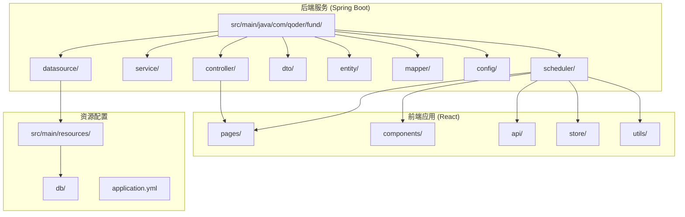

**图表来源**
- [FundController.java:1-79](file://src/main/java/com/qoder/fund/controller/FundController.java#L1-L79)
- [FundService.java:1-75](file://src/main/java/com/qoder/fund/service/FundService.java#L1-L75)
- [FundDataAggregator.java:1-508](file://src/main/java/com/qoder/fund/datasource/FundDataAggregator.java#L1-L508)
- [FundDataSyncScheduler.java:1-667](file://src/main/java/com/qoder/fund/scheduler/FundDataSyncScheduler.java#L1-L667)

**章节来源**
- [FundController.java:1-79](file://src/main/java/com/qoder/fund/controller/FundController.java#L1-L79)
- [application.yml:1-43](file://src/main/resources/application.yml#L1-L43)

## 核心组件

### 控制器层

FundController是系统的核心控制器，负责处理所有与基金相关的HTTP请求：

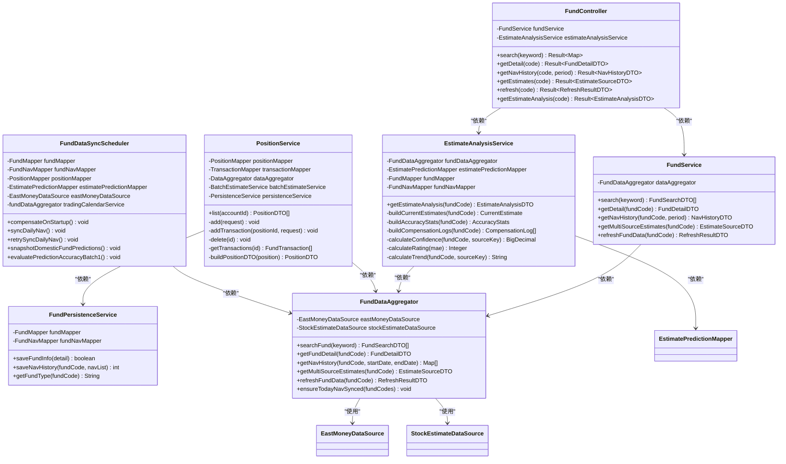

**图表来源**
- [FundController.java:24-78](file://src/main/java/com/qoder/fund/controller/FundController.java#L24-L78)
- [FundService.java:22-73](file://src/main/java/com/qoder/fund/service/FundService.java#L22-L73)
- [EstimateAnalysisService.java:29-305](file://src/main/java/com/qoder/fund/service/EstimateAnalysisService.java#L29-L305)
- [PositionService.java:30-563](file://src/main/java/com/qoder/fund/service/PositionService.java#L30-L563)
- [FundPersistenceService.java:25-148](file://src/main/java/com/qoder/fund/service/FundPersistenceService.java#L25-L148)
- [FundDataSyncScheduler.java:39-667](file://src/main/java/com/qoder/fund/scheduler/FundDataSyncScheduler.java#L39-667)
- [FundDataAggregator.java:28-349](file://src/main/java/com/qoder/fund/datasource/FundDataAggregator.java#L28-L349)

### 数据源层

系统实现了多数据源聚合架构，确保数据获取的可靠性和完整性：

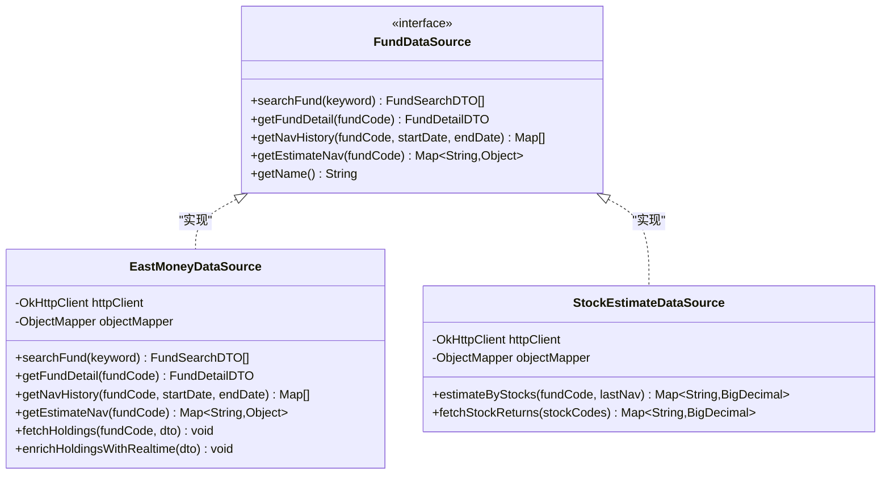

**图表来源**
- [FundDataSource.java:13-44](file://src/main/java/com/qoder/fund/datasource/FundDataSource.java#L13-L44)
- [EastMoneyDataSource.java:26-695](file://src/main/java/com/qoder/fund/datasource/EastMoneyDataSource.java#L26-L695)
- [StockEstimateDataSource.java:24-183](file://src/main/java/com/qoder/fund/datasource/StockEstimateDataSource.java#L24-L183)

### 数据传输对象

系统定义了完整的DTO结构来封装数据传输：

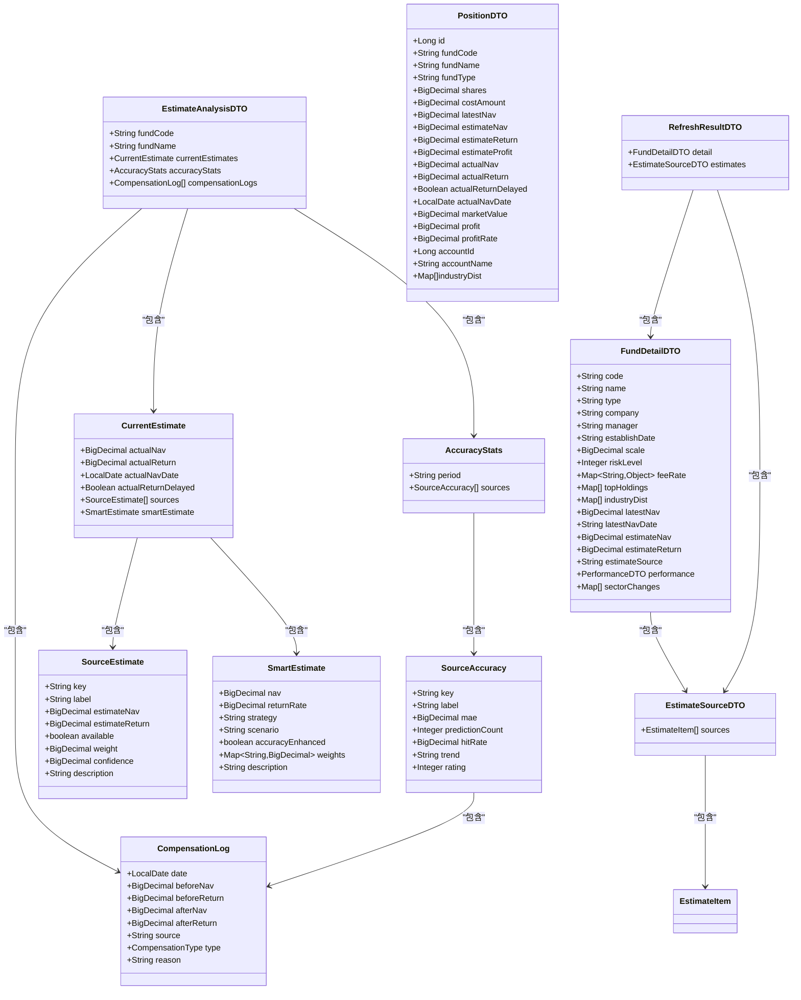

**图表来源**
- [FundDetailDTO.java:10-40](file://src/main/java/com/qoder/fund/dto/FundDetailDTO.java#L10-L40)
- [EstimateSourceDTO.java:9-22](file://src/main/java/com/qoder/fund/dto/EstimateSourceDTO.java#L9-L22)
- [EstimateAnalysisDTO.java:10-148](file://src/main/java/com/qoder/fund/dto/EstimateAnalysisDTO.java#L10-L148)
- [PositionDTO.java:10-37](file://src/main/java/com/qoder/fund/dto/PositionDTO.java#L10-L37)
- [NavHistoryDTO.java:9-12](file://src/main/java/com/qoder/fund/dto/NavHistoryDTO.java#L9-L12)
- [FundSearchDTO.java:6-10](file://src/main/java/com/qoder/fund/dto/FundSearchDTO.java#L6-L10)
- [RefreshResultDTO.java:5-9](file://src/main/java/com/qoder/fund/dto/RefreshResultDTO.java#L5-L9)

**章节来源**
- [FundController.java:24-78](file://src/main/java/com/qoder/fund/controller/FundController.java#L24-L78)
- [FundService.java:22-73](file://src/main/java/com/qoder/fund/service/FundService.java#L22-L73)
- [EstimateAnalysisDTO.java:10-148](file://src/main/java/com/qoder/fund/dto/EstimateAnalysisDTO.java#L10-L148)
- [FundDataAggregator.java:36-349](file://src/main/java/com/qoder/fund/datasource/FundDataAggregator.java#L36-L349)

## 架构概览

系统采用分层架构设计，实现了清晰的关注点分离：

```mermaid
graph TB
subgraph "表现层"
FE[前端React应用]
API[RESTful API]
ENDPOINT[/api/fund/{code}/estimate-analysis]
ENDPOINT2[/api/positions]
ENDPOINT3[/api/positions/{id}/transaction]
ENDPOINT4[/api/positions/{id}]
ENDPOINT5[/api/positions/{id}/transactions]
end
subgraph "业务逻辑层"
CTRL[控制器层]
SVC[服务层]
ANALYSIS[分析服务层]
POSITION[位置服务层]
PERSIST[Persistence服务层]
AGG[数据聚合层]
SYNC[同步调度层]
end
subgraph "数据访问层"
DS[数据源接口]
EM[东方财富数据源]
SE[股票估值数据源]
EP[估值预测映射]
PM[位置映射]
PN[净值映射]
end
subgraph "数据存储层"
DB[(MySQL数据库)]
CACHE[(Caffeine缓存)]
TABLE[estimate_prediction表]
TABLE2[position表]
TABLE3[fund_nav表]
end
FE --> API
API --> CTRL
CTRL --> SVC
CTRL --> ANALYSIS
CTRL --> POSITION
SVC --> AGG
ANALYSIS --> EP
POSITION --> PM
POSITION --> PERSIST
PERSIST --> PN
AGG --> DS
SYNC --> DS
SYNC --> PM
SYNC --> PN
DS --> EM
DS --> SE
AGG --> CACHE
AGG --> DB
EP --> TABLE
PM --> TABLE2
PN --> TABLE3
SYNC --> DB
CTRL --> API
```

**图表来源**
- [FundController.java:17-78](file://src/main/java/com/qoder/fund/controller/FundController.java#L17-L78)
- [FundService.java:20-73](file://src/main/java/com/qoder/fund/service/FundService.java#L20-L73)
- [EstimateAnalysisService.java:29-305](file://src/main/java/com/qoder/fund/service/EstimateAnalysisService.java#L29-L305)
- [PositionService.java:30-563](file://src/main/java/com/qoder/fund/service/PositionService.java#L30-L563)
- [FundPersistenceService.java:25-148](file://src/main/java/com/qoder/fund/service/FundPersistenceService.java#L25-L148)
- [FundDataAggregator.java:23-95](file://src/main/java/com/qoder/fund/datasource/FundDataAggregator.java#L23-L95)
- [FundDataSyncScheduler.java:39-667](file://src/main/java/com/qoder/fund/scheduler/FundDataSyncScheduler.java#L39-667)

### 数据流处理

系统的数据处理流程体现了完整的数据生命周期：

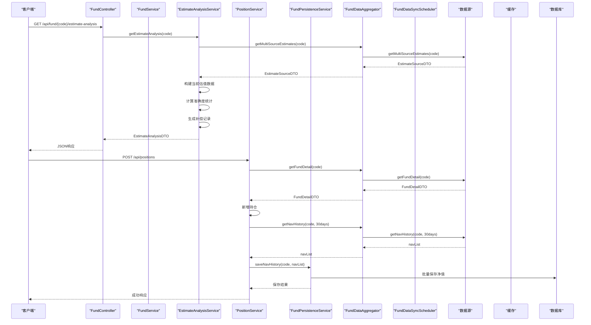

**图表来源**
- [FundController.java:70-77](file://src/main/java/com/qoder/fund/controller/FundController.java#L70-L77)
- [EstimateAnalysisService.java:42-62](file://src/main/java/com/qoder/fund/service/EstimateAnalysisService.java#L42-L62)
- [PositionService.java:126-138](file://src/main/java/com/qoder/fund/service/PositionService.java#L126-L138)
- [FundPersistenceService.java:94-133](file://src/main/java/com/qoder/fund/service/FundPersistenceService.java#L94-L133)
- [FundService.java:33-68](file://src/main/java/com/qoder/fund/service/FundService.java#L33-L68)
- [FundDataAggregator.java:174-289](file://src/main/java/com/qoder/fund/datasource/FundDataAggregator.java#L174-289)

**章节来源**
- [application.yml:18-25](file://src/main/resources/application.yml#L18-L25)
- [FundDataAggregator.java:36-95](file://src/main/java/com/qoder/fund/datasource/FundDataAggregator.java#L36-L95)

## 详细组件分析

### FundController组件分析

FundController作为系统的入口点，提供了七个核心API端点：

#### 搜索功能
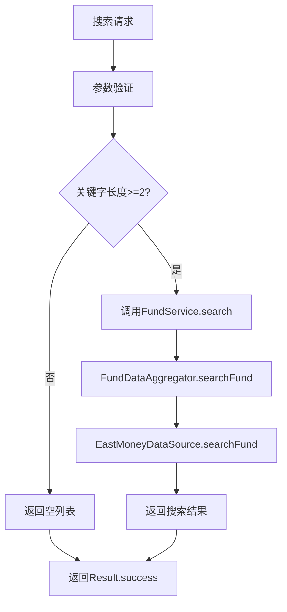

**图表来源**
- [FundController.java:32-38](file://src/main/java/com/qoder/fund/controller/FundController.java#L32-L38)
- [FundService.java:26-30](file://src/main/java/com/qoder/fund/service/FundService.java#L26-L30)
- [FundDataAggregator.java:36-39](file://src/main/java/com/qoder/fund/datasource/FundDataAggregator.java#L36-L39)

#### 详情查询功能
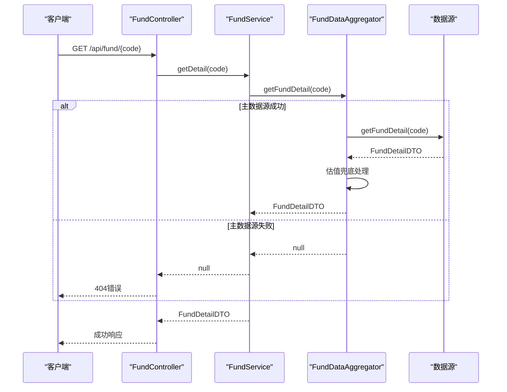

**图表来源**
- [FundController.java:40-47](file://src/main/java/com/qoder/fund/controller/FundController.java#L40-L47)
- [FundService.java:33-34](file://src/main/java/com/qoder/fund/service/FundService.java#L33-L34)
- [FundDataAggregator.java:44-61](file://src/main/java/com/qoder/fund/datasource/FundDataAggregator.java#L44-L61)

#### 净值历史查询功能
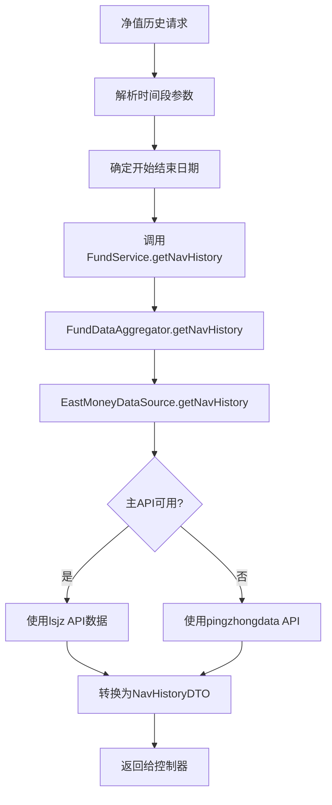

**图表来源**
- [FundController.java:49-54](file://src/main/java/com/qoder/fund/controller/FundController.java#L49-L54)
- [FundService.java:37-64](file://src/main/java/com/qoder/fund/service/FundService.java#L37-L64)
- [EastMoneyDataSource.java:102-181](file://src/main/java/com/qoder/fund/datasource/EastMoneyDataSource.java#L102-L181)

#### 实时估值查询功能
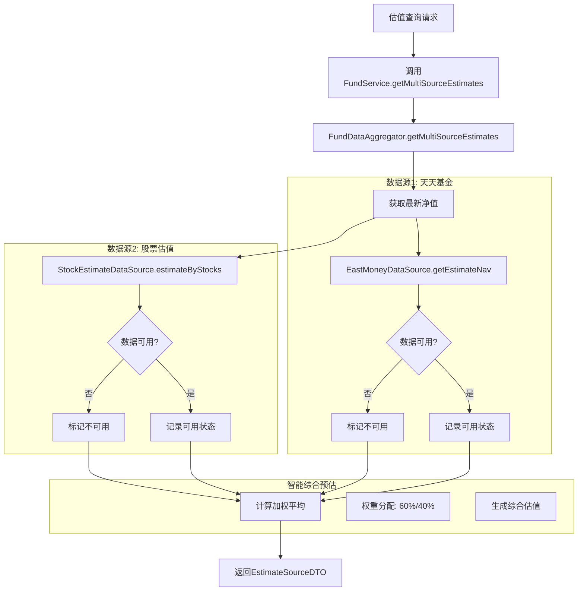

**图表来源**
- [FundController.java:56-59](file://src/main/java/com/qoder/fund/controller/FundController.java#L56-L59)
- [FundService.java:67-68](file://src/main/java/com/qoder/fund/service/FundService.java#L67-L68)
- [FundDataAggregator.java:174-289](file://src/main/java/com/qoder/fund/datasource/FundDataAggregator.java#L174-289)

#### 手动数据刷新功能
**新增功能** FundController新增了手动数据刷新端点，允许用户主动触发数据同步：

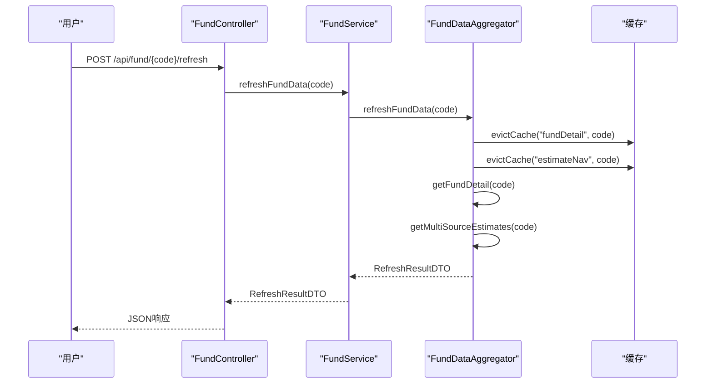

**图表来源**
- [FundController.java:61-68](file://src/main/java/com/qoder/fund/controller/FundController.java#L61-L68)
- [FundService.java:71-73](file://src/main/java/com/qoder/fund/service/FundService.java#L71-L73)
- [FundDataAggregator.java:158-169](file://src/main/java/com/qoder/fund/datasource/FundDataAggregator.java#L158-L169)

#### 数据源分析功能
**新增功能** FundController新增了数据源分析端点，提供详细的估值数据源分析：

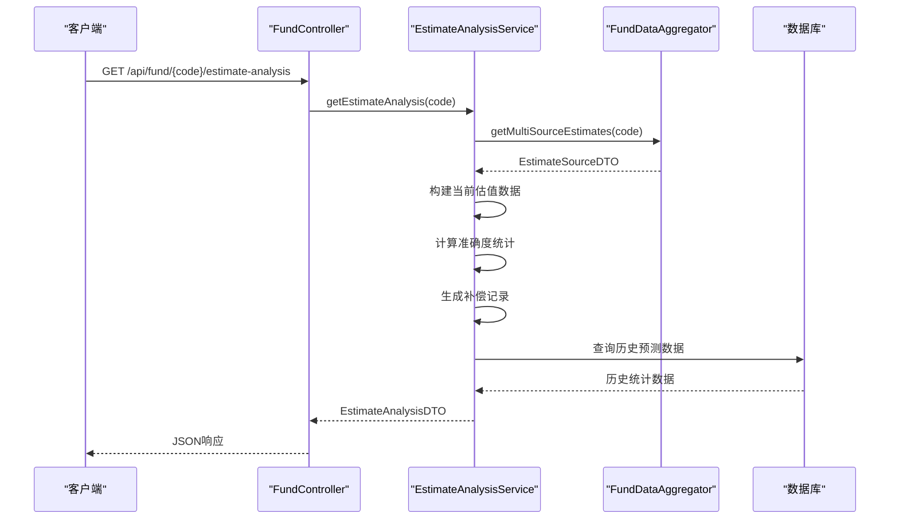

**图表来源**
- [FundController.java:70-77](file://src/main/java/com/qoder/fund/controller/FundController.java#L70-L77)
- [EstimateAnalysisService.java:42-62](file://src/main/java/com/qoder/fund/service/EstimateAnalysisService.java#L42-L62)

**章节来源**
- [FundController.java:32-77](file://src/main/java/com/qoder/fund/controller/FundController.java#L32-L77)
- [FundService.java:26-73](file://src/main/java/com/qoder/fund/service/FundService.java#L26-L73)

### PositionService组件分析

**新增功能** PositionService是专门处理投资组合管理的服务类，实现了位置同步优化和自动30天NAV历史同步功能：

#### 位置列表功能
服务类负责获取用户的投资组合列表，并实现智能降级机制：

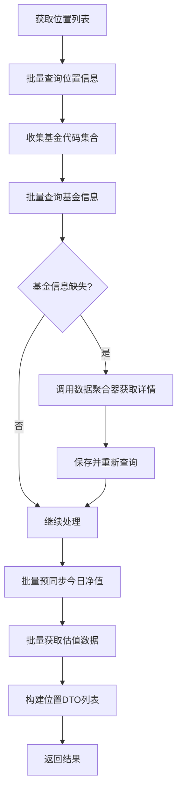

**图表来源**
- [PositionService.java:40-105](file://src/main/java/com/qoder/fund/service/PositionService.java#L40-L105)

#### 新增持仓功能
**更新** 新增了自动30天NAV历史同步功能，确保新基金有完整的净值数据：

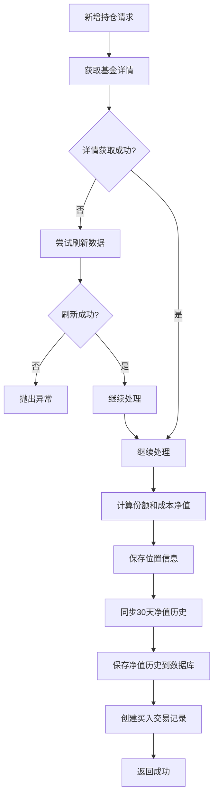

**图表来源**
- [PositionService.java:107-185](file://src/main/java/com/qoder/fund/service/PositionService.java#L107-L185)

#### 智能降级机制
服务类实现了多层降级机制，确保在各种情况下都能提供数据：

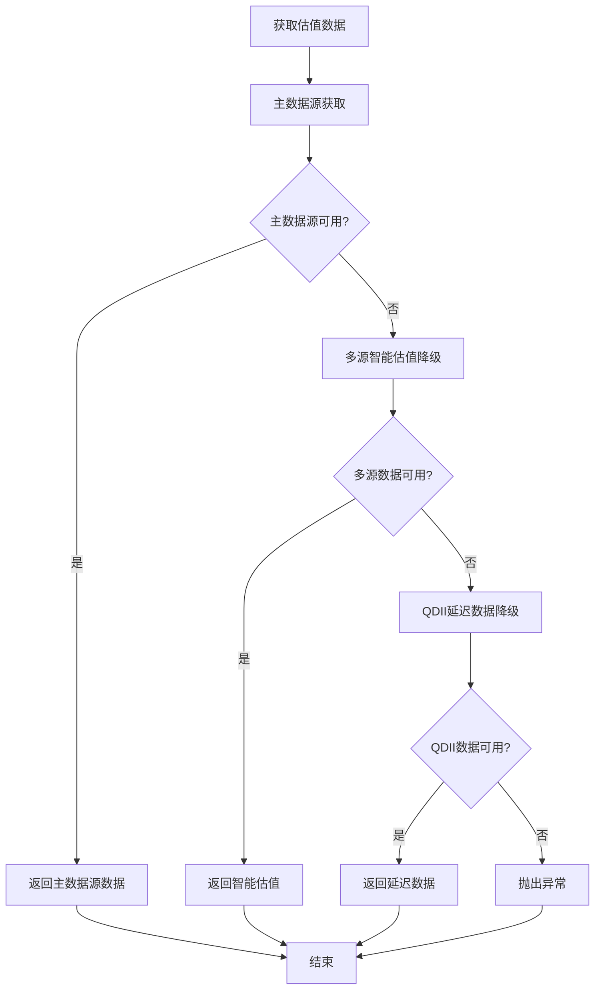

**图表来源**
- [PositionService.java:311-355](file://src/main/java/com/qoder/fund/service/PositionService.java#L311-L355)

#### 批量优化处理
服务类实现了批量查询优化，避免N+1查询问题：

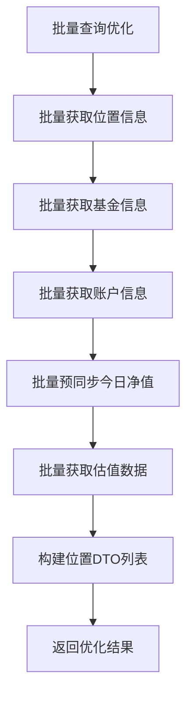

**图表来源**
- [PositionService.java:51-104](file://src/main/java/com/qoder/fund/service/PositionService.java#L51-L104)

**章节来源**
- [PositionService.java:30-563](file://src/main/java/com/qoder/fund/service/PositionService.java#L30-L563)

### FundPersistenceService组件分析

**新增功能** FundPersistenceService是专门处理数据持久化的服务类，实现了净值历史的批量保存功能：

#### 基金信息持久化
服务类负责保存或更新基金基本信息：

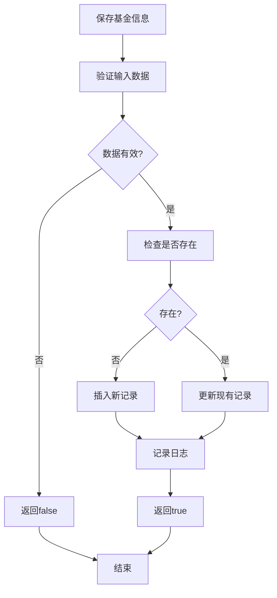

**图表来源**
- [FundPersistenceService.java:36-89](file://src/main/java/com/qoder/fund/service/FundPersistenceService.java#L36-L89)

#### 净值历史批量保存
**新增功能** 服务类实现了净值历史的批量保存功能：

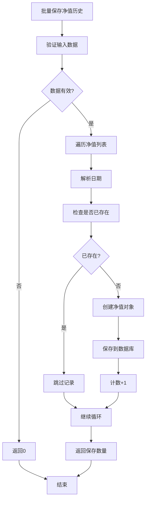

**图表来源**
- [FundPersistenceService.java:94-133](file://src/main/java/com/qoder/fund/service/FundPersistenceService.java#L94-L133)

**章节来源**
- [FundPersistenceService.java:25-148](file://src/main/java/com/qoder/fund/service/FundPersistenceService.java#L25-L148)

### FundDataSyncScheduler组件分析

**新增功能** FundDataSyncScheduler是定时任务调度器，实现了完整的数据同步和补偿机制：

#### 启动时数据补偿
服务类在应用启动时执行多项数据补偿任务：

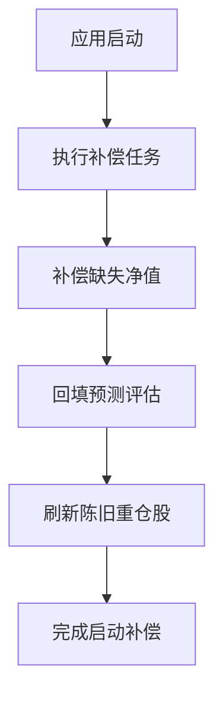

**图表来源**
- [FundDataSyncScheduler.java:56-75](file://src/main/java/com/qoder/fund/scheduler/FundDataSyncScheduler.java#L56-L75)

#### 定时数据同步
服务类实现了多个定时任务，确保数据的及时更新：

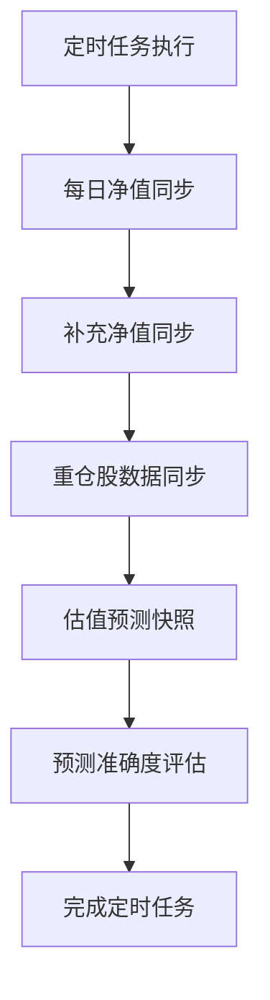

**图表来源**
- [FundDataSyncScheduler.java:224-377](file://src/main/java/com/qoder/fund/scheduler/FundDataSyncScheduler.java#L224-L377)

#### 数据补偿机制
服务类实现了完整的数据补偿机制：

```mermaid
flowchart TD
A[数据补偿] --> B[补偿缺失净值]
B --> C[查询最后记录日期]
C --> D[获取交易日范围]
D --> E[批量获取净值数据]
E --> F[保存到数据库]
F --> G[补偿预测评估]
G --> H[查询待评估记录]
H --> I[获取实际净值]
I --> J[计算误差]
J --> K[更新评估记录]
K --> L[刷新陈旧重仓股]
L --> M[检查更新时间阈值]
M --> N[获取最新重仓股数据]
N --> O[更新基金信息]
O --> P[完成补偿]
```

**图表来源**
- [FundDataSyncScheduler.java:80-219](file://src/main/java/com/qoder/fund/scheduler/FundDataSyncScheduler.java#L80-L219)

**章节来源**
- [FundDataSyncScheduler.java:39-667](file://src/main/java/com/qoder/fund/scheduler/FundDataSyncScheduler.java#L39-667)

### FundDataAggregator组件分析

**更新** FundDataAggregator新增了ensureTodayNavSynced方法，避免API限流问题：

#### 预同步今日净值
**新增功能** 服务类实现了智能的今日净值预同步功能：

```mermaid
flowchart TD
A[预同步今日净值] --> B[检查交易日]
B --> C{今天是交易日?}
C --> |否| D[直接返回]
C --> |是| E[遍历基金代码]
E --> F[检查数据库是否存在]
F --> G{已存在?}
G --> |是| H[跳过该基金]
G --> |否| I[获取今日净值]
I --> J{获取成功?}
J --> |否| K[跳过该基金]
J --> |是| L{日期匹配?}
L --> |否| M[跳过该基金]
L --> |是| N[保存到数据库]
N --> O[计数+1]
H --> P[继续循环]
K --> P
M --> P
O --> P
P --> Q[线程休眠200ms]
Q --> R[继续下一个基金]
R --> S[返回同步结果]
D --> T[结束]
S --> T
```

**图表来源**
- [FundDataAggregator.java:486-531](file://src/main/java/com/qoder/fund/datasource/FundDataAggregator.java#L486-L531)

#### 智能估值算法
服务类实现了基于历史准确度的智能估值算法：

```mermaid
flowchart TD
A[智能估值计算] --> B[检查冷启动状态]
B --> C{冷启动?}
C --> |是| D[使用保守权重]
C --> |否| E[使用自适应权重]
E --> F[计算历史准确度修正]
F --> G{有历史数据?}
G --> |是| H[计算修正乘数]
G --> |否| I[使用基础权重]
H --> J[应用权重修正]
I --> J
J --> K[加权计算最终估值]
K --> L[返回智能估值]
```

**图表来源**
- [FundDataAggregator.java:566-631](file://src/main/java/com/qoder/fund/datasource/FundDataAggregator.java#L566-L631)

**章节来源**
- [FundDataAggregator.java:28-508](file://src/main/java/com/qoder/fund/datasource/FundDataAggregator.java#L28-L508)
- [StockEstimateDataSource.java:26-183](file://src/main/java/com/qoder/fund/datasource/StockEstimateDataSource.java#L26-L183)

### 前端集成分析

**新增功能** 前端React应用新增了完整的投资组合管理功能：

#### 投资组合页面
```mermaid
sequenceDiagram
participant User as "用户"
participant Page as "Portfolio页面"
participant API as "positionApi"
participant Controller as "PositionController"
participant Service as "PositionService"
participant PersistenceService as "FundPersistenceService"
participant Aggregator as "FundDataAggregator"
User->>Page : 访问投资组合页面
Page->>API : list()
API->>Controller : GET /api/positions
Controller->>Service : list(accountId)
Service->>Aggregator : ensureTodayNavSynced(fundCodes)
Aggregator-->>Service : 预同步结果
Service->>Service : 构建位置DTO列表
Service-->>Controller : 位置列表
Controller-->>API : JSON响应
API-->>Page : 位置数据
Page-->>User : 渲染投资组合页面
Note over Page : 用户添加新持仓
Page->>API : add(positionData)
API->>Controller : POST /api/positions
Controller->>Service : add(request)
Service->>Aggregator : getNavHistory(code, 30days)
Aggregator-->>Service : 净值历史
Service->>PersistenceService : saveNavHistory(code, navList)
PersistenceService-->>Service : 保存结果
Service-->>Controller : 添加成功
Controller-->>API : JSON响应
API-->>Page : 添加结果
Page-->>User : 更新投资组合
```

**图表来源**
- [Portfolio/index.tsx:27-36](file://fund-web/src/pages/Portfolio/index.tsx#L27-L36)
- [Portfolio/AddPosition.tsx:99-126](file://fund-web/src/pages/Portfolio/AddPosition.tsx#L99-L126)
- [PositionController.java:22-31](file://src/main/java/com/qoder/fund/controller/PositionController.java#L22-L31)

#### 添加持仓功能
**新增功能** 前端实现了智能的添加持仓功能：

```mermaid
flowchart TD
A[用户添加持仓] --> B[表单验证]
B --> C[获取基金详情]
C --> D[计算预计份额]
D --> E[用户确认提交]
E --> F[调用API添加持仓]
F --> G[保存30天净值历史]
G --> H[创建交易记录]
H --> I[更新页面显示]
I --> J[显示成功消息]
```

**图表来源**
- [Portfolio/AddPosition.tsx:99-126](file://fund-web/src/pages/Portfolio/AddPosition.tsx#L99-L126)
- [PositionController.java:27-31](file://src/main/java/com/qoder/fund/controller/PositionController.java#L27-L31)

#### 位置管理功能
前端提供了完整的投资组合管理功能：

```mermaid
flowchart TD
A[位置管理] --> B[位置列表显示]
B --> C[行业分布饼图]
C --> D[交易记录管理]
D --> E[位置删除确认]
E --> F[批量操作]
F --> G[账户筛选]
G --> H[位置详情查看]
```

**图表来源**
- [Portfolio/index.tsx:158-237](file://fund-web/src/pages/Portfolio/index.tsx#L158-L237)

**章节来源**
- [Portfolio/index.tsx:1-273](file://fund-web/src/pages/Portfolio/index.tsx#L1-L273)
- [Portfolio/AddPosition.tsx:1-204](file://fund-web/src/pages/Portfolio/AddPosition.tsx#L1-L204)
- [PositionController.java:15-51](file://src/main/java/com/qoder/fund/controller/PositionController.java#L15-L51)

## 依赖关系分析

系统采用了清晰的依赖注入和模块化设计：

```mermaid
graph TB
subgraph "外部依赖"
A[Spring Boot]
B[OkHttp]
C[Jackson]
D[Caffeine Cache]
E[MySQL Driver]
F[MyBatis Plus]
G[Ant Design]
H[ECharts]
end
subgraph "内部模块"
I[PositionController]
J[PositionService]
K[FundPersistenceService]
L[FundDataSyncScheduler]
M[FundDataAggregator]
N[EastMoneyDataSource]
O[StockEstimateDataSource]
P[EstimatePredictionMapper]
Q[PositionMapper]
R[FundNavMapper]
end
subgraph "数据模型"
S[PositionDTO]
T[Position]
U[PositionMapper]
V[EstimateAnalysisDTO]
W[FundPersistenceService]
X[FundDataSyncScheduler]
Y[FundDataAggregator]
Z[EstimatePrediction]
end
A --> I
A --> J
A --> K
A --> L
A --> M
B --> N
B --> O
C --> N
C --> O
D --> M
E --> F
F --> M
F --> P
F --> Q
F --> R
I --> J
I --> K
J --> M
J --> K
K --> R
L --> M
L --> Q
L --> R
M --> N
M --> O
J --> S
K --> W
L --> X
M --> Y
```

**图表来源**
- [PositionController.java:3-11](file://src/main/java/com/qoder/fund/controller/PositionController.java#L3-L11)
- [PositionService.java:12-25](file://src/main/java/com/qoder/fund/service/PositionService.java#L12-L25)
- [FundPersistenceService.java:8-18](file://src/main/java/com/qoder/fund/service/FundPersistenceService.java#L8-L18)
- [FundDataSyncScheduler.java:17-31](file://src/main/java/com/qoder/fund/scheduler/FundDataSyncScheduler.java#L17-L31)
- [EastMoneyDataSource.java:9-12](file://src/main/java/com/qoder/fund/datasource/EastMoneyDataSource.java#L9-L12)
- [StockEstimateDataSource.java:8-11](file://src/main/java/com/qoder/fund/datasource/StockEstimateDataSource.java#L8-L11)
- [EstimatePredictionMapper.java:14-58](file://src/main/java/com/qoder/fund/mapper/EstimatePredictionMapper.java#L14-L58)

### 数据库设计

系统采用了规范的数据库设计，支持完整的基金数据管理和分析功能：

```mermaid
erDiagram
FUND {
varchar code PK
varchar name
varchar type
varchar company
varchar manager
date establish_date
decimal scale
tinyint risk_level
json fee_rate
json top_holdings
json industry_dist
datetime updated_at
}
FUND_NAV {
bigint id PK
varchar fund_code FK
date nav_date
decimal nav
decimal acc_nav
decimal daily_return
unique uk_code_date
}
ESTIMATE_PREDICTION {
bigint id PK
varchar fund_code FK
varchar source_key
date predict_date
decimal predicted_nav
decimal predicted_return
decimal actual_nav
decimal actual_return
decimal return_error
unique uk_fund_source_date
index idx_fund_date
}
ACCOUNT {
bigint id PK
varchar name
varchar platform
varchar icon
datetime created_at
}
POSITION {
bigint id PK
bigint account_id FK
varchar fund_code
decimal shares
decimal cost_amount
datetime created_at
datetime updated_at
}
FUND_TRANSACTION {
bigint id PK
bigint position_id FK
varchar fund_code
varchar type
decimal amount
decimal shares
decimal price
decimal fee
date trade_date
datetime created_at
}
WATCHLIST {
bigint id PK
varchar fund_code
varchar group_name
datetime created_at
unique uk_fund_group
}
FUND ||--o{ FUND_NAV : "包含"
FUND ||--o{ ESTIMATE_PREDICTION : "包含"
FUND ||--o{ WATCHLIST : "包含"
ACCOUNT ||--o{ POSITION : "拥有"
POSITION ||--o{ FUND_TRANSACTION : "产生"
POSITION ||--o{ FUND_NAV : "影响"
```

**图表来源**
- [schema.sql:1-96](file://src/main/resources/db/schema.sql#L1-L96)

**章节来源**
- [schema.sql:1-96](file://src/main/resources/db/schema.sql#L1-L96)
- [data.sql:1-9](file://src/main/resources/db/data.sql#L1-L9)

## 性能考虑

系统在设计时充分考虑了性能优化，采用了多种策略来提升响应速度和资源利用率：

### 缓存策略
- **多级缓存架构**：Caffeine本地缓存 + Redis分布式缓存
- **智能过期策略**：300秒自动过期，确保数据新鲜度
- **条件缓存**：使用unless条件避免空结果缓存
- **定向缓存清理**：支持按键名精确清理特定缓存项

### 异步处理
- **HTTP客户端优化**：连接超时10秒，读取超时15秒
- **批量数据获取**：支持批量股票行情查询减少API调用次数
- **数据预加载**：首页Dashboard预加载关键数据
- **预同步机制**：ensureTodayNavSynced方法避免API限流

### 数据优化
- **数据库索引**：为常用查询字段建立索引
- **JSON字段存储**：使用MySQL JSON类型存储动态数据
- **数据去重**：防止重复插入净值数据
- **历史数据分区**：estimate_prediction表按日期分区存储

### 位置管理性能优化
**新增功能** 位置管理功能采用了专门的性能优化策略：
- **批量查询优化**：PositionService使用批量查询避免N+1问题
- **智能降级机制**：多层降级确保在各种情况下都有数据可用
- **预同步今日净值**：避免高频API调用导致的限流问题
- **批量估值服务**：使用BatchEstimateService优化查询性能

### 同步调度性能优化
**新增功能** 定时任务调度器采用了高效的数据同步策略：
- **补偿机制**：启动时自动补偿缺失数据
- **分批处理**：避免一次性处理大量数据
- **智能重试**：针对未发布的净值进行补充同步
- **数据去重**：防止重复保存相同数据

### 持久化性能优化
**新增功能** FundPersistenceService采用了批量处理优化：
- **批量保存**：saveNavHistory方法支持批量保存净值数据
- **去重处理**：检查数据库中是否已存在相同记录
- **事务管理**：使用@Transactional注解确保数据一致性

## 故障排除指南

### 常见问题诊断

#### API响应异常
1. **检查网络连接**：确认能够访问外部数据源API
2. **验证缓存配置**：检查Caffeine缓存是否正常工作
3. **查看日志输出**：关注ERROR级别的异常信息

#### 数据不一致问题
1. **清理缓存**：删除相关缓存键重新获取数据
2. **检查数据库连接**：验证MySQL连接配置
3. **重置数据源**：临时禁用某个数据源测试系统稳定性

#### 前端显示异常
1. **检查API响应格式**：确认后端返回的数据结构正确
2. **验证前端类型定义**：确保TypeScript类型与后端DTO一致
3. **调试图表组件**：检查ECharts配置参数

#### 位置管理功能异常
**新增功能** 位置管理相关的故障排除：
1. **检查持仓数据**：确认position表中有正确的持仓信息
2. **验证净值同步**：检查fund_nav表中是否有30天净值数据
3. **查看持久化日志**：确认FundPersistenceService的保存操作正常
4. **检查API调用**：验证PositionController的端点正常工作

#### 定时任务异常
**新增功能** 定时任务相关的故障排除：
1. **检查调度配置**：确认@EnableScheduling注解生效
2. **验证数据库连接**：确保定时任务能够访问数据库
3. **查看任务日志**：关注定时任务的执行情况
4. **检查交易日判断**：确认TradingCalendarService正常工作

#### 数据同步异常
**新增功能** 数据同步相关的故障排除：
1. **检查补偿机制**：确认compensateOnStartup方法正常执行
2. **验证API限流**：检查ensureTodayNavSynced方法的延迟处理
3. **查看重试逻辑**：确认retrySyncDailyNav方法正常工作
4. **检查预测评估**：验证evaluatePredictionAccuracy方法的执行

**章节来源**
- [EastMoneyDataSource.java:71-75](file://src/main/java/com/qoder/fund/datasource/EastMoneyDataSource.java#L71-L75)
- [FundDataAggregator.java:291-300](file://src/main/java/com/qoder/fund/datasource/FundDataAggregator.java#L291-L300)

## 结论

FundController增强项目展现了一个完整的基金数据管理系统的设计和实现。通过采用多数据源聚合、智能缓存、优雅降级等技术手段，系统在保证数据准确性的同时，提供了优秀的用户体验。

**更新** 新增的位置同步优化功能进一步增强了系统的智能化水平。通过PositionService的自动30天NAV历史同步功能，系统确保新基金有完整的净值数据可用，为用户提供更准确的投资分析基础。智能降级机制确保在数据源不可用时仍能提供备用方案，保证数据一致性。

### 主要优势

1. **高可用性**：多数据源备份和估值兜底机制确保系统稳定运行
2. **高性能**：多级缓存和异步处理提升了系统响应速度
3. **可扩展性**：模块化设计便于功能扩展和维护
4. **用户体验**：前端交互设计直观友好，支持多种数据源切换
5. **用户控制**：手动刷新功能让用户能够主动控制数据更新时机
6. **智能分析**：数据源分析功能提供深度洞察和决策支持
7. **投资组合管理**：完整的投资组合管理功能，支持持仓跟踪和分析
8. **数据完整性**：自动30天NAV历史同步确保新基金有完整的数据基础

### 技术亮点

- **智能估值算法**：结合多个数据源提供准确的实时估值
- **行业分析功能**：基于重仓股数据提供行业分布和板块预测
- **缓存优化**：合理的缓存策略平衡了数据新鲜度和性能
- **错误处理**：完善的异常处理和降级机制
- **精准刷新**：定向缓存清理确保数据更新的准确性和效率
- **历史数据分析**：基于准确度统计的历史数据追踪和分析
- **可视化展示**：前端组件提供直观的数据源对比和趋势分析
- **批量处理优化**：PositionService的批量查询优化避免N+1问题
- **智能降级机制**：多层降级确保在各种情况下都有数据可用
- **定时数据补偿**：完整的数据补偿机制确保数据完整性
- **净值历史同步**：自动30天NAV历史同步确保新基金数据完整

该系统为个人投资者提供了全面的基金数据查询、分析和投资组合管理工具，是现代金融科技应用的典型代表。新增的位置同步优化功能进一步完善了系统的数据管理能力，为用户提供更加深入和可靠的基金信息服务，帮助用户做出更明智的投资决策。