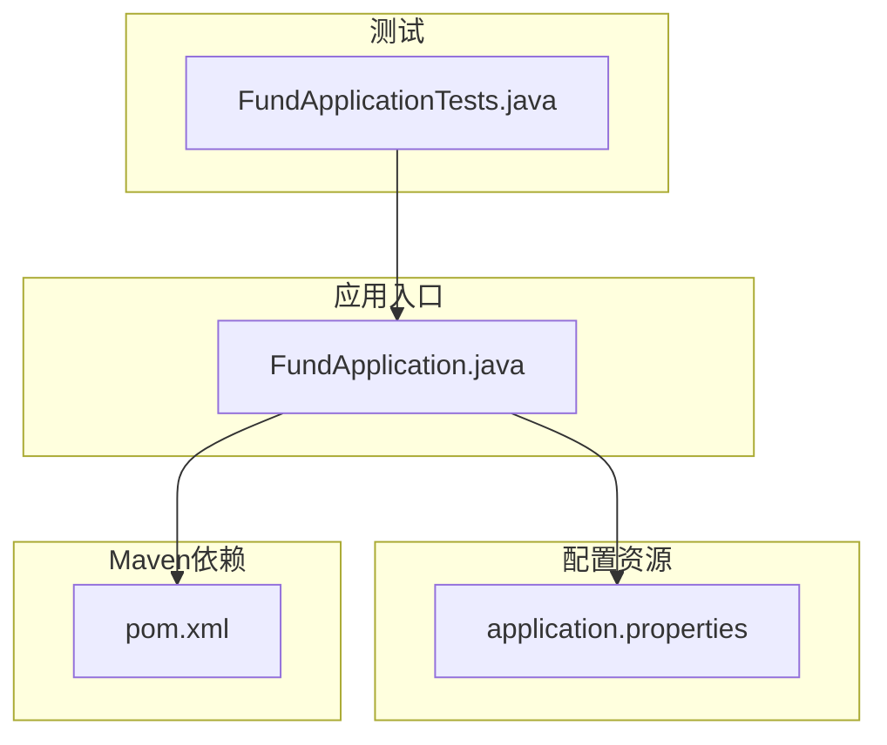
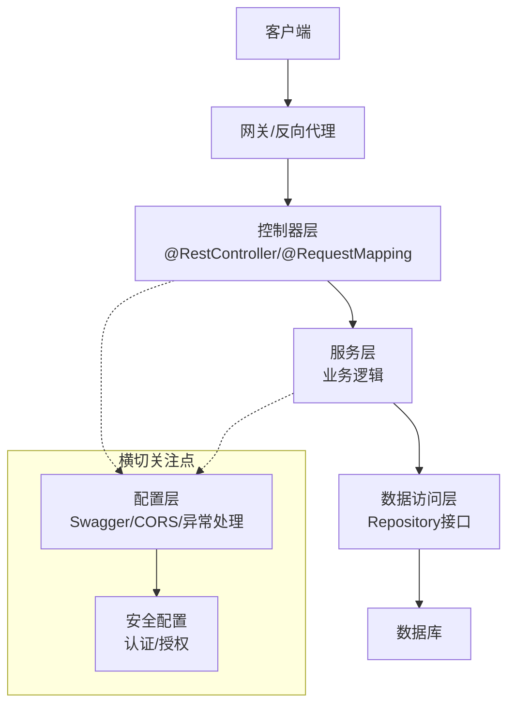
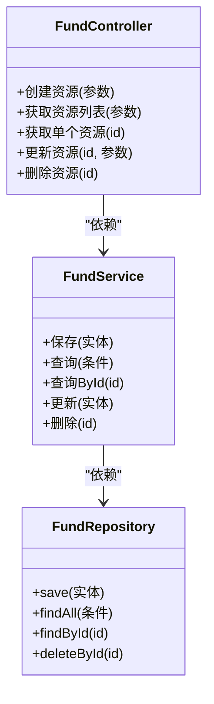
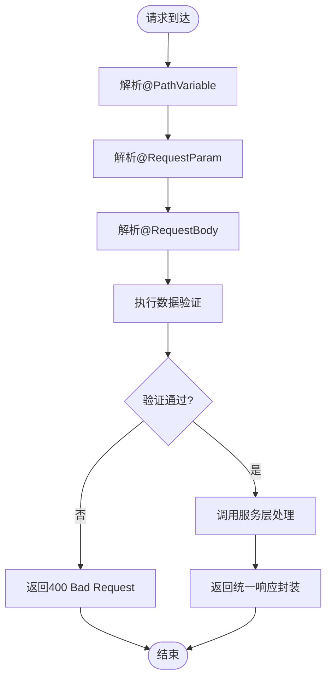
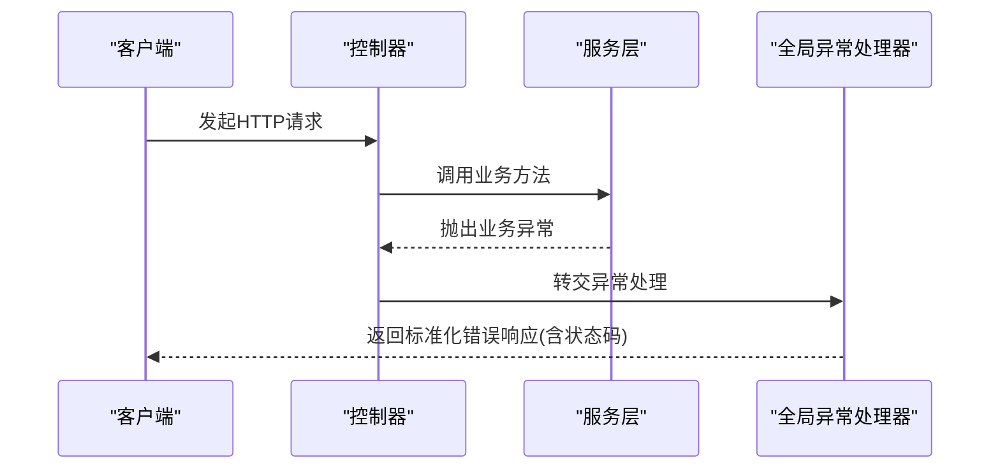
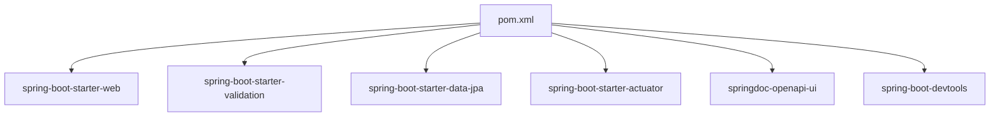

# REST API开发

<cite>
**本文引用的文件**
- [FundApplication.java](file://src/main/java/com/qoder/fund/FundApplication.java)
- [application.properties](file://src/main/resources/application.properties)
- [FundApplicationTests.java](file://src/test/java/com/qoder/fund/FundApplicationTests.java)
- [pom.xml](file://pom.xml)
</cite>

## 目录
1. [简介](#简介)
2. [项目结构](#项目结构)
3. [核心组件](#核心组件)
4. [架构概览](#架构概览)
5. [详细组件分析](#详细组件分析)
6. [依赖分析](#依赖分析)
7. [性能考虑](#性能考虑)
8. [故障排除指南](#故障排除指南)
9. [结论](#结论)
10. [附录](#附录)

## 简介
本指南面向基金管理系统的RESTful API开发，提供从零开始构建Spring MVC Web服务的完整实践路径。内容涵盖HTTP端点设计与实现、请求参数处理、响应格式化、状态码管理、数据验证、异常处理、API文档生成、CORS配置以及性能优化策略。即使当前仓库仅包含基础Spring Boot骨架，本文也将指导您逐步扩展为具备完整REST API能力的企业级应用。

## 项目结构
当前项目采用标准Spring Boot多模块布局，包含应用入口类、资源配置和单元测试。为支持REST API开发，建议在现有结构基础上增加以下层次：
- 控制器层：定义HTTP端点与路由映射
- 服务层：封装业务逻辑与领域模型
- 数据访问层：持久化与查询抽象
- 配置层：安全、CORS、Swagger等横切关注点
- 工具层：统一响应封装、异常处理、校验工具

**图表来源**
- [FundApplication.java:1-14](file://src/main/java/com/qoder/fund/FundApplication.java#L1-L14)
- [application.properties:1-2](file://src/main/resources/application.properties#L1-L2)
- [FundApplicationTests.java:1-14](file://src/test/java/com/qoder/fund/FundApplicationTests.java#L1-L14)
- [pom.xml:1-55](file://pom.xml#L1-L55)

**章节来源**
- [FundApplication.java:1-14](file://src/main/java/com/qoder/fund/FundApplication.java#L1-L14)
- [application.properties:1-2](file://src/main/resources/application.properties#L1-L2)
- [FundApplicationTests.java:1-14](file://src/test/java/com/qoder/fund/FundApplicationTests.java#L1-L14)
- [pom.xml:1-55](file://pom.xml#L1-L55)

## 核心组件
为实现REST API，建议按分层架构组织核心组件：

- 控制器层
  - 使用@RestController定义资源端点
  - 通过@RequestMapping映射HTTP方法与路径
  - 利用@RequestBody、@RequestParam、@PathVariable处理不同类型的请求参数
  - 返回统一响应封装对象，设置合适的HTTP状态码

- 服务层
  - 实现业务规则与流程编排
  - 调用数据访问层完成持久化操作
  - 执行数据验证与转换

- 数据访问层
  - 定义Repository接口进行数据库交互
  - 提供查询方法与事务管理

- 配置层
  - Swagger/OpenAPI文档生成
  - CORS跨域配置
  - 全局异常处理器
  - WebMvcConfigurer自定义

**章节来源**
- [FundApplication.java:6-13](file://src/main/java/com/qoder/fund/FundApplication.java#L6-L13)

## 架构概览
下图展示了REST API的典型分层架构，从客户端到后端服务的完整调用链路。

## 详细组件分析

### 控制器层设计
控制器负责对外暴露HTTP端点，遵循REST语义设计资源路径与HTTP方法映射。

- 基础映射
  - @RestController：声明控制器并启用@ResponseBody
  - @RequestMapping：定义路径前缀与HTTP方法映射
  - @GetMapping/@PostMapping/@PutMapping/@DeleteMapping：简化常用HTTP方法映射

- 参数处理
  - @PathVariable：从URL路径提取资源标识符
  - @RequestParam：从查询字符串读取参数
  - @RequestBody：从请求体解析JSON/XML等格式

- 响应处理
  - 返回值自动序列化为JSON
  - 使用HttpStatus枚举设置状态码
  - 统一响应包装类封装错误信息与数据

**图表来源**
- [FundApplication.java:6-13](file://src/main/java/com/qoder/fund/FundApplication.java#L6-L13)

**章节来源**
- [FundApplication.java:6-13](file://src/main/java/com/qoder/fund/FundApplication.java#L6-L13)

### 请求参数处理流程
下图展示不同参数类型在控制器中的处理流程。

**图表来源**
- [FundApplication.java:6-13](file://src/main/java/com/qoder/fund/FundApplication.java#L6-L13)

### 异常处理与状态码管理
- 全局异常处理器：捕获业务异常与系统异常，返回标准化错误响应
- HTTP状态码：根据业务场景选择2xx/4xx/5xx状态码
- 统一响应格式：包含时间戳、状态码、消息与数据字段

**图表来源**
- [FundApplication.java:6-13](file://src/main/java/com/qoder/fund/FundApplication.java#L6-L13)

## 依赖分析
当前项目依赖较为精简，为支持REST API开发，建议在pom.xml中引入以下关键依赖：

- spring-boot-starter-web：提供Spring MVC与嵌入式Tomcat
- spring-boot-starter-validation：Bean Validation支持
- spring-boot-starter-data-jpa：JPA数据访问
- spring-boot-starter-actuator：生产环境监控
- springdoc-openapi-ui：OpenAPI/Swagger文档
- spring-boot-devtools：开发时热部署

**图表来源**
- [pom.xml:32-43](file://pom.xml#L32-L43)

**章节来源**
- [pom.xml:29-31](file://pom.xml#L29-L31)
- [pom.xml:32-43](file://pom.xml#L32-L43)

## 性能考虑
- 连接池配置：合理设置数据库连接池大小与超时参数
- 缓存策略：利用Redis或本地缓存减少重复计算
- 分页查询：大数据量场景使用分页避免全表扫描
- 异步处理：耗时任务异步化，提升接口响应速度
- 监控指标：通过Actuator暴露健康检查与性能指标
- 压力测试：使用JMeter或Gatling模拟高并发场景

## 故障排除指南
- 启动失败排查
  - 检查Java版本是否符合要求
  - 确认端口未被占用
  - 排查application.properties配置项
- 接口调试
  - 使用Postman或curl验证端点
  - 查看控制台日志定位异常
  - 开启DEBUG级别日志获取详细信息
- 常见问题
  - JSON序列化异常：检查实体类getter/setter与构造函数
  - 跨域问题：确认CORS配置正确性
  - 数据验证失败：核对@Validated注解与约束注解使用

**章节来源**
- [application.properties:1-2](file://src/main/resources/application.properties#L1-L2)
- [FundApplicationTests.java:6-13](file://src/test/java/com/qoder/fund/FundApplicationTests.java#L6-L13)

## 结论
通过以上架构设计与实现步骤，您可以将当前的基础Spring Boot项目扩展为功能完备的REST API服务。关键在于清晰的分层设计、规范的参数处理、完善的异常管理与文档化配置。建议在开发过程中持续集成测试与性能监控，确保系统稳定性与可维护性。

## 附录
- 快速开始清单
  - 在pom.xml中添加Web与OpenAPI依赖
  - 创建实体类与Repository接口
  - 实现Service层业务逻辑
  - 编写Controller端点并配置CORS
  - 配置Swagger文档与全局异常处理
  - 编写单元测试覆盖核心场景
  - 进行性能测试与压力验证