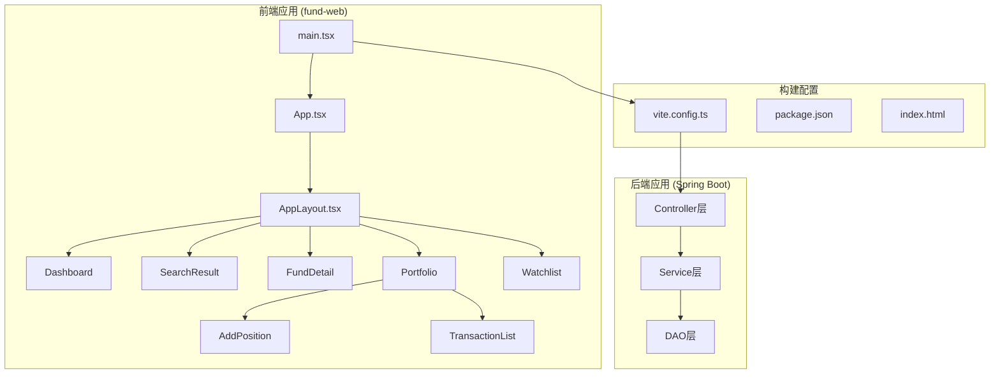
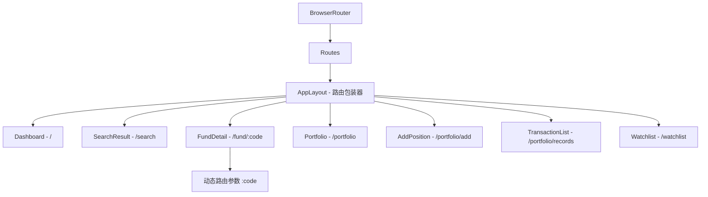
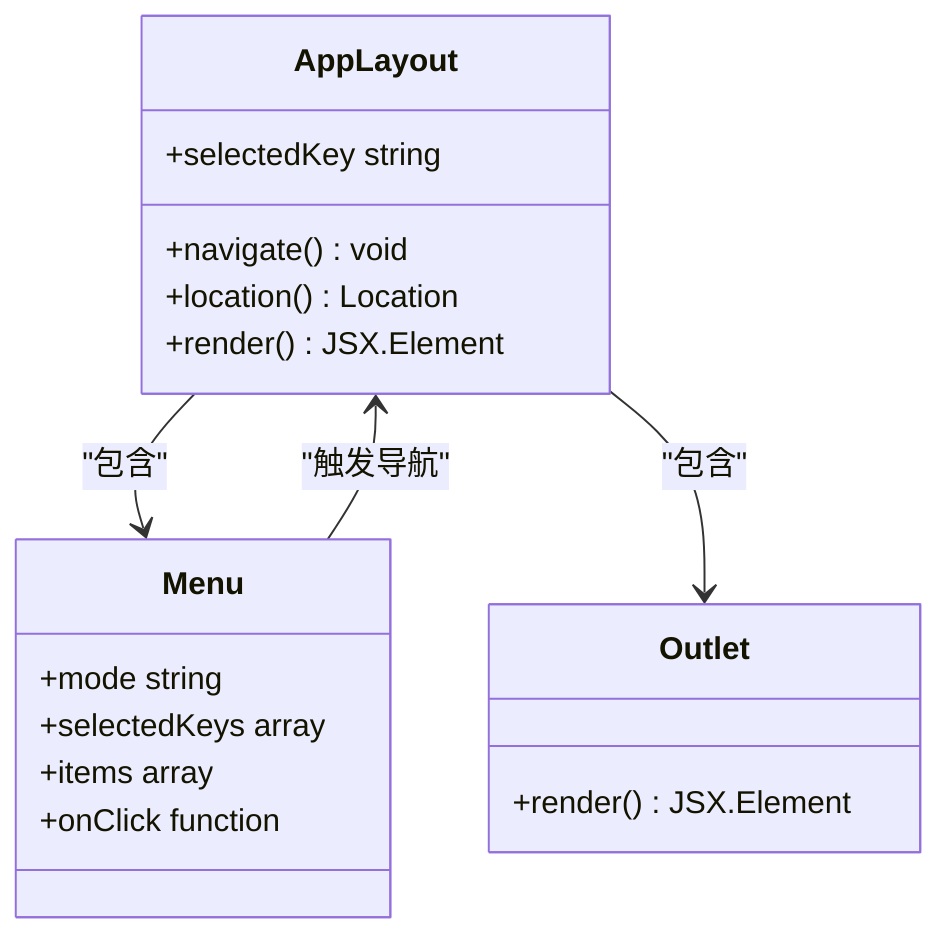
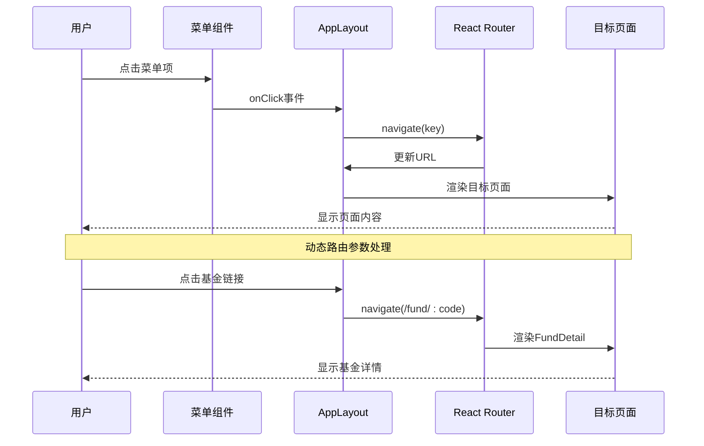
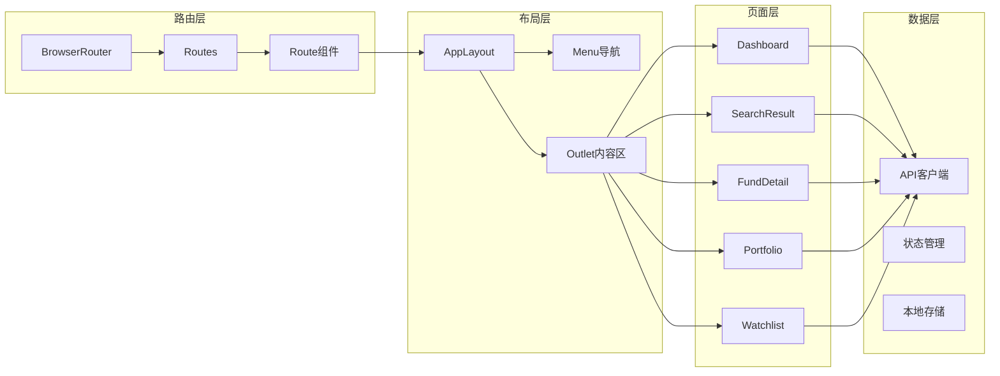
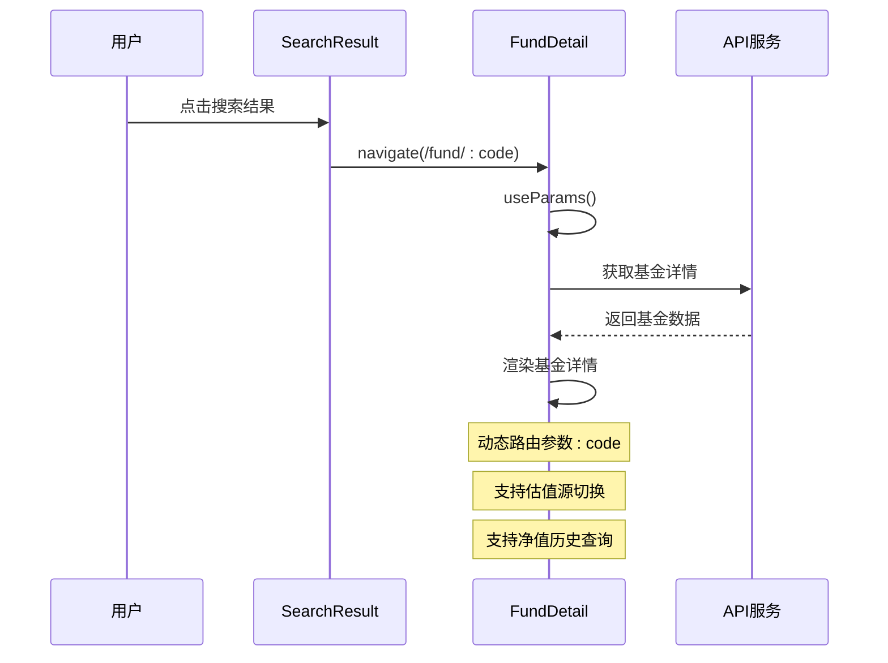
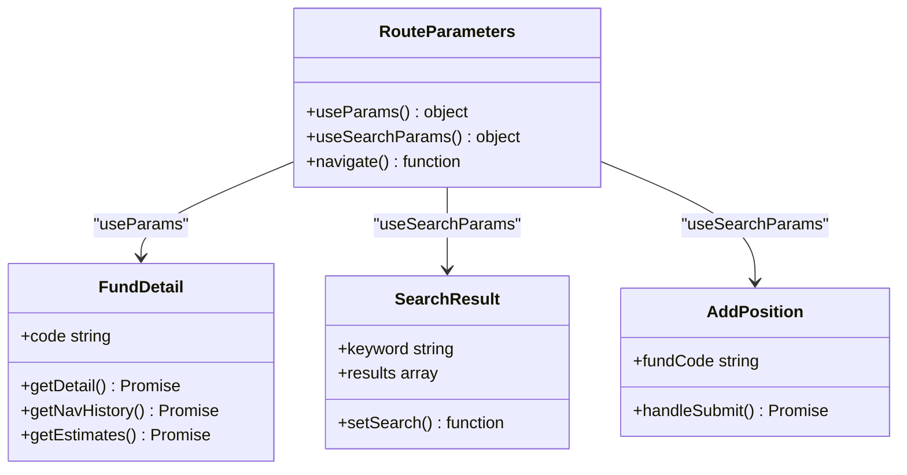
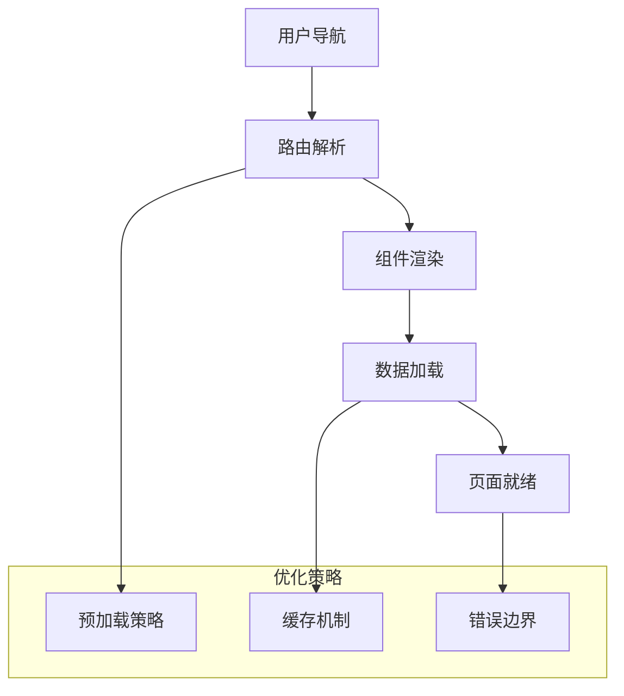
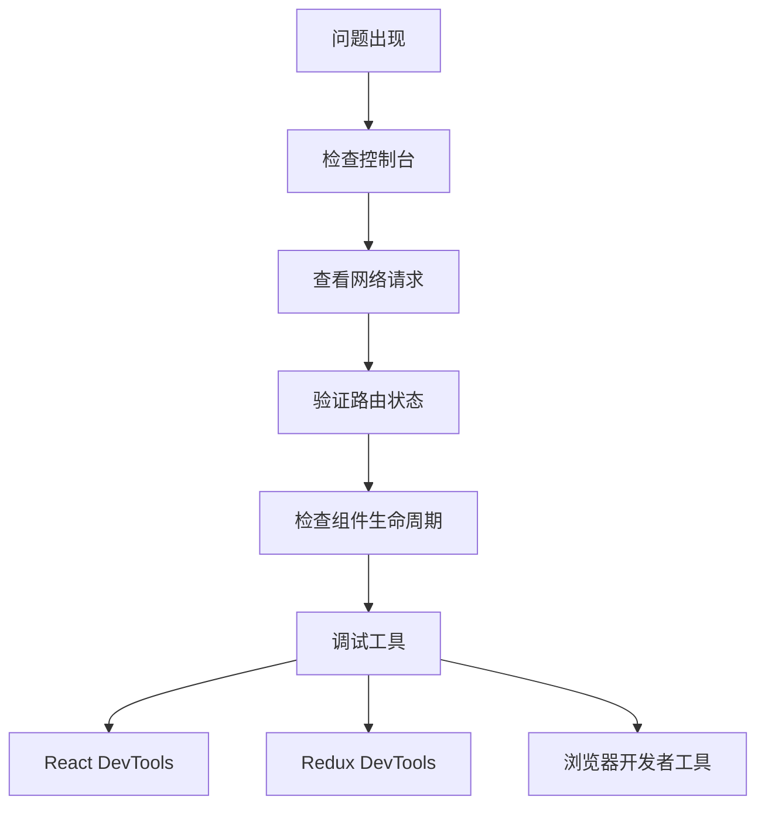

# SPA路由支持

<cite>
**本文档引用的文件**
- [App.tsx](file://fund-web/src/App.tsx)
- [main.tsx](file://fund-web/src/main.tsx)
- [AppLayout.tsx](file://fund-web/src/components/AppLayout.tsx)
- [SearchResult.tsx](file://fund-web/src/pages/Fund/SearchResult.tsx)
- [FundDetail.tsx](file://fund-web/src/pages/Fund/FundDetail.tsx)
- [Portfolio.tsx](file://fund-web/src/pages/Portfolio/index.tsx)
- [AddPosition.tsx](file://fund-web/src/pages/Portfolio/AddPosition.tsx)
- [TransactionList.tsx](file://fund-web/src/pages/Portfolio/TransactionList.tsx)
- [Watchlist.tsx](file://fund-web/src/pages/Watchlist/index.tsx)
- [Dashboard.tsx](file://fund-web/src/pages/Dashboard/index.tsx)
- [vite.config.ts](file://fund-web/vite.config.ts)
- [package.json](file://fund-web/package.json)
- [index.html](file://src/main/resources/static/index.html)
- [PRD.md](file://PRD.md)
</cite>

## 目录
1. [简介](#简介)
2. [项目结构](#项目结构)
3. [核心组件](#核心组件)
4. [架构概览](#架构概览)
5. [详细组件分析](#详细组件分析)
6. [依赖关系分析](#依赖关系分析)
7. [性能考虑](#性能考虑)
8. [故障排除指南](#故障排除指南)
9. [结论](#结论)

## 简介

本文档深入分析了"基金管家"项目的SPA（单页应用）路由系统实现。该项目采用React 19和React Router DOM 7.13.1构建，提供了完整的前端路由支持，包括静态路由、动态路由参数、嵌套路由以及路由间的导航机制。

项目的核心路由系统支持以下页面：
- 首页仪表板（Dashboard）
- 基金搜索结果页面
- 基金详情页面（动态路由参数）
- 持仓管理页面
- 添加持仓页面
- 交易记录页面
- 自选基金页面

## 项目结构

项目采用典型的React单页应用结构，前端代码位于`fund-web`目录中，后端Spring Boot应用位于根目录。



**图表来源**
- [main.tsx:1-11](file://fund-web/src/main.tsx#L1-L11)
- [App.tsx:1-42](file://fund-web/src/App.tsx#L1-L42)
- [vite.config.ts:1-16](file://fund-web/vite.config.ts#L1-L16)

**章节来源**
- [main.tsx:1-11](file://fund-web/src/main.tsx#L1-L11)
- [App.tsx:1-42](file://fund-web/src/App.tsx#L1-L42)
- [vite.config.ts:1-16](file://fund-web/vite.config.ts#L1-L16)

## 核心组件

### 路由配置系统

应用的路由系统基于React Router DOM构建，采用嵌套路由模式：



**图表来源**
- [App.tsx:24-36](file://fund-web/src/App.tsx#L24-L36)

### 应用布局系统

AppLayout组件作为所有页面的公共布局容器，提供了统一的导航菜单和侧边栏：



**图表来源**
- [AppLayout.tsx:21-32](file://fund-web/src/components/AppLayout.tsx#L21-L32)

**章节来源**
- [App.tsx:21-39](file://fund-web/src/App.tsx#L21-L39)
- [AppLayout.tsx:14-19](file://fund-web/src/components/AppLayout.tsx#L14-L19)

## 架构概览

### 路由导航流程

应用采用声明式路由导航，结合编程式导航实现复杂的页面跳转逻辑：



**图表来源**
- [AppLayout.tsx:22-28](file://fund-web/src/components/AppLayout.tsx#L22-L28)
- [Dashboard.tsx:100-108](file://fund-web/src/pages/Dashboard/index.tsx#L100-L108)

### 数据流架构



**图表来源**
- [App.tsx:24-36](file://fund-web/src/App.tsx#L24-L36)
- [AppLayout.tsx:34-78](file://fund-web/src/components/AppLayout.tsx#L34-L78)

**章节来源**
- [App.tsx:21-39](file://fund-web/src/App.tsx#L21-L39)
- [AppLayout.tsx:33-93](file://fund-web/src/components/AppLayout.tsx#L33-L93)

## 详细组件分析

### Dashboard页面路由集成

Dashboard页面集成了多种路由导航模式：

```mermaid
graph TD
A[Dashboard页面] --> B[持仓列表点击]
A --> C[添加持仓按钮]
A --> D[基金详情链接]
B --> E[navigate('/portfolio/add')]
C --> E
D --> F[navigate(/fund/:code)]
E --> G[AddPosition页面]
F --> H[FundDetail页面]
subgraph "路由参数"
I[:code - 基金代码]
end
```

**图表来源**
- [Dashboard.tsx:100-108](file://fund-web/src/pages/Dashboard/index.tsx#L100-L108)
- [Dashboard.tsx:107](file://fund-web/src/pages/Dashboard/index.tsx#L107)

**章节来源**
- [Dashboard.tsx:100-108](file://fund-web/src/pages/Dashboard/index.tsx#L100-L108)

### FundDetail页面动态路由

FundDetail页面使用动态路由参数处理基金详情展示：



**图表来源**
- [FundDetail.tsx:21](file://fund-web/src/pages/Fund/FundDetail.tsx#L21)
- [FundDetail.tsx:36-40](file://fund-web/src/pages/Fund/FundDetail.tsx#L36-L40)

**章节来源**
- [FundDetail.tsx:20-40](file://fund-web/src/pages/Fund/FundDetail.tsx#L20-L40)

### Portfolio页面路由管理

Portfolio页面实现了复杂的路由导航逻辑：

```mermaid
flowchart TD
A[Portfolio页面] --> B[Tab切换]
A --> C[持仓列表点击]
A --> D[添加交易按钮]
A --> E[删除持仓]
B --> F[按账户筛选]
C --> G[navigate(/fund/:code)]
D --> H[navigate(/portfolio/add)]
E --> I[删除确认]
G --> J[FundDetail页面]
H --> K[AddPosition页面]
subgraph "路由参数"
L[:code - 基金代码]
M[?fundCode - 查询参数]
end
```

**图表来源**
- [Portfolio.tsx:114-118](file://fund-web/src/pages/Portfolio/index.tsx#L114-L118)
- [Portfolio.tsx:142-157](file://fund-web/src/pages/Portfolio/index.tsx#L142-L157)

**章节来源**
- [Portfolio.tsx:114-118](file://fund-web/src/pages/Portfolio/index.tsx#L114-L118)
- [Portfolio.tsx:142-157](file://fund-web/src/pages/Portfolio/index.tsx#L142-L157)

### 路由参数处理机制

应用使用多种方式处理路由参数：



**图表来源**
- [FundDetail.tsx:21](file://fund-web/src/pages/Fund/FundDetail.tsx#L21)
- [SearchResult.tsx:12-18](file://fund-web/src/pages/Fund/SearchResult.tsx#L12-L18)
- [AddPosition.tsx:14](file://fund-web/src/pages/Portfolio/AddPosition.tsx#L14)

**章节来源**
- [FundDetail.tsx:21](file://fund-web/src/pages/Fund/FundDetail.tsx#L21)
- [SearchResult.tsx:12-18](file://fund-web/src/pages/Fund/SearchResult.tsx#L12-L18)
- [AddPosition.tsx:14](file://fund-web/src/pages/Portfolio/AddPosition.tsx#L14)

## 依赖关系分析

### 技术栈依赖

应用的路由系统依赖于以下核心库：

```mermaid
graph TB
subgraph "路由相关依赖"
A[react-router-dom@7.13.1]
B[react@19.2.4]
C[react-dom@19.2.4]
end
subgraph "UI组件库"
D[antd@6.3.3]
E[@ant-design/icons@6.1.0]
end
subgraph "构建工具"
F[vite@8.0.0]
G[@vitejs/plugin-react@6.0.0]
end
subgraph "状态管理"
H[zustand@5.0.12]
end
A --> B
A --> C
D --> A
F --> G
H --> B
```

**图表来源**
- [package.json:12-22](file://fund-web/package.json#L12-L22)
- [package.json:24-36](file://fund-web/package.json#L24-L36)

### 开发环境配置

Vite配置支持代理和开发服务器设置：

```mermaid
flowchart LR
A[Vite开发服务器] --> B[端口5173]
A --> C[代理配置]
C --> D[/api -> http://localhost:8080]
C --> E[changeOrigin: true]
A --> F[React插件]
F --> G[热重载]
F --> H[TypeScript支持]
```

**图表来源**
- [vite.config.ts:6-14](file://fund-web/vite.config.ts#L6-L14)

**章节来源**
- [package.json:12-38](file://fund-web/package.json#L12-L38)
- [vite.config.ts:1-16](file://fund-web/vite.config.ts#L1-L16)

## 性能考虑

### 路由性能优化

应用采用了多种路由性能优化策略：

1. **懒加载支持**：虽然当前实现使用静态导入，但路由结构已为未来的代码分割做好准备
2. **内存管理**：路由切换时正确清理组件状态和事件监听器
3. **渲染优化**：使用React.memo和useMemo优化频繁更新的组件
4. **缓存策略**：利用浏览器缓存和API缓存减少重复请求

### 导航性能



## 故障排除指南

### 常见路由问题

1. **路由不生效**
   - 检查BrowserRouter包裹
   - 确认路由路径匹配
   - 验证组件导入

2. **参数获取失败**
   - 使用useParams()检查参数名
   - 验证路由定义中的参数占位符
   - 检查导航链接格式

3. **导航失效**
   - 确认useNavigate()实例
   - 检查路由配置
   - 验证组件挂载状态

### 调试技巧



**章节来源**
- [App.tsx:24-36](file://fund-web/src/App.tsx#L24-L36)
- [AppLayout.tsx:22-28](file://fund-web/src/components/AppLayout.tsx#L22-L28)

## 结论

该SPA路由系统实现了完整的单页应用功能，具有以下特点：

1. **完整的路由覆盖**：支持静态路由、动态路由参数和嵌套路由
2. **良好的用户体验**：流畅的页面切换和导航体验
3. **可扩展性**：模块化的路由结构便于功能扩展
4. **性能优化**：合理的组件设计和状态管理

系统采用现代化的React技术栈，路由配置清晰，导航逻辑直观，为用户提供了一致的应用体验。未来可以进一步优化的方向包括代码分割、路由预加载和更精细的状态管理。