# 前端投资组合管理增强

<cite>
**本文档引用的文件**
- [package.json](file://fund-web/package.json)
- [App.tsx](file://fund-web/src/App.tsx)
- [main.tsx](file://fund-web/src/main.tsx)
- [application.yml](file://src/main/resources/application.yml)
- [PRD.md](file://PRD.md)
- [client.ts](file://fund-web/src/api/client.ts)
- [dashboard.ts](file://fund-web/src/api/dashboard.ts)
- [position.ts](file://fund-web/src/api/position.ts)
- [fund.ts](file://fund-web/src/api/fund.ts)
- [index.tsx](file://fund-web/src/pages/Dashboard/index.tsx)
- [index.tsx](file://fund-web/src/pages/Portfolio/index.tsx)
- [FundDetail.tsx](file://fund-web/src/pages/Fund/FundDetail.tsx)
- [SearchResult.tsx](file://fund-web/src/pages/Fund/SearchResult.tsx)
- [AppLayout.tsx](file://fund-web/src/components/AppLayout.tsx)
- [DashboardController.java](file://src/main/java/com/qoder/fund/controller/DashboardController.java)
- [DashboardService.java](file://src/main/java/com/qoder/fund/service/DashboardService.java)
- [DashboardDTO.java](file://src/main/java/com/qoder/fund/dto/DashboardDTO.java)
- [FundController.java](file://src/main/java/com/qoder/fund/controller/FundController.java)
- [FundService.java](file://src/main/java/com/qoder/fund/service/FundService.java)
- [RefreshResultDTO.java](file://src/main/java/com/qoder/fund/dto/RefreshResultDTO.java)
- [Position.java](file://src/main/java/com/qoder/fund/entity/Position.java)
- [searchStore.ts](file://fund-web/src/store/searchStore.ts)
</cite>

## 更新摘要
**变更内容**
- 新增FundDetail页面刷新按钮功能，支持手动刷新基金数据
- 实现SearchResult页面的持久化缓存机制，提升搜索性能
- 新增fund-web API层的刷新端点支持，提供数据实时更新能力
- 后端新增完整的刷新端点，支持多数据源刷新

## 目录
1. [项目概述](#项目概述)
2. [项目结构](#项目结构)
3. [核心组件](#核心组件)
4. [架构概览](#架构概览)
5. [详细组件分析](#详细组件分析)
6. [依赖关系分析](#依赖关系分析)
7. [性能考虑](#性能考虑)
8. [故障排除指南](#故障排除指南)
9. [结论](#结论)

## 项目概述

"基金管家"是一个面向个人投资者的基金管理与查询Web应用，定位为"一站式基金数据聚合管理工具"。该项目专注于基金数据展示、持仓管理、收益分析和投资决策辅助，帮助用户高效管理分散在多个平台的基金投资。

### 产品特性

- **纯工具属性**：不做交易，不接触用户资金，零风险使用
- **Web优先**：无需下载App，浏览器直接使用，跨设备同步
- **数据聚合**：汇总多平台持仓，一屏掌握投资全貌
- **智能分析**：提供专业级收益归因、风险分析和资产配置建议
- **实时数据**：支持手动刷新，确保数据时效性

### 技术架构

前端采用React 18 + TypeScript + Ant Design + ECharts的技术栈，后端基于Spring Boot框架，实现了完整的前后端分离架构。

## 项目结构

项目采用前后端分离的Maven多模块结构：

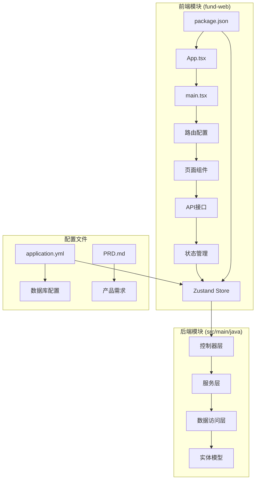

**图表来源**
- [package.json:1-39](file://fund-web/package.json#L1-L39)
- [App.tsx:1-42](file://fund-web/src/App.tsx#L1-L42)
- [application.yml:1-43](file://src/main/resources/application.yml#L1-L43)

**章节来源**
- [package.json:1-39](file://fund-web/package.json#L1-L39)
- [PRD.md:1-488](file://PRD.md#L1-L488)

## 核心组件

### 前端核心组件

#### 应用入口组件
应用入口负责全局路由配置和主题设置，采用Ant Design的ConfigProvider组件提供统一的主题配置。

#### 页面组件层次
- **Dashboard页面**：展示资产总览、持仓列表和收益趋势
- **Portfolio页面**：管理用户持仓，支持添加、编辑、删除操作
- **FundDetail页面**：展示基金详情信息，包含新增的刷新功能
- **SearchResult页面**：展示搜索结果，实现持久化缓存机制
- **Watchlist页面**：管理自选基金

#### API接口层
- **client.ts**：封装Axios实例，处理统一的响应拦截和错误处理
- **dashboard.ts**：Dashboard相关API接口定义
- **position.ts**：持仓管理相关API接口定义
- **fund.ts**：基金相关API接口定义，包含新增的刷新功能

#### 状态管理
- **searchStore.ts**：实现搜索结果的持久化缓存，使用Zustand状态管理库

**章节来源**
- [App.tsx:21-42](file://fund-web/src/App.tsx#L21-L42)
- [index.tsx:1-160](file://fund-web/src/pages/Dashboard/index.tsx#L1-L160)
- [index.tsx:1-206](file://fund-web/src/pages/Portfolio/index.tsx#L1-L206)
- [FundDetail.tsx:186](file://fund-web/src/pages/Fund/FundDetail.tsx#L186)
- [SearchResult.tsx:19-46](file://fund-web/src/pages/Fund/SearchResult.tsx#L19-L46)
- [searchStore.ts:10-14](file://fund-web/src/store/searchStore.ts#L10-L14)

### 后端核心组件

#### 控制器层
- **DashboardController**：提供Dashboard数据接口
- **PositionController**：处理持仓相关的REST API
- **FundController**：管理基金数据接口，新增刷新端点

#### 服务层
- **DashboardService**：计算总资产、总收益、今日收益等核心指标
- **PositionService**：处理持仓数据的业务逻辑
- **FundService**：管理基金相关信息，包含数据刷新功能

#### 数据模型
- **DashboardDTO**：Dashboard数据传输对象
- **Position**：持仓实体模型
- **Fund**：基金实体模型
- **RefreshResultDTO**：刷新结果数据传输对象

**章节来源**
- [DashboardController.java:1-27](file://src/main/java/com/qoder/fund/controller/DashboardController.java#L1-L27)
- [DashboardService.java:1-83](file://src/main/java/com/qoder/fund/service/DashboardService.java#L1-L83)
- [DashboardDTO.java:1-16](file://src/main/java/com/qoder/fund/dto/DashboardDTO.java#L1-L16)
- [Position.java:1-25](file://src/main/java/com/qoder/fund/entity/Position.java#L1-L25)
- [FundController.java:53-60](file://src/main/java/com/qoder/fund/controller/FundController.java#L53-L60)
- [FundService.java:71-73](file://src/main/java/com/qoder/fund/service/FundService.java#L71-L73)
- [RefreshResultDTO.java:1-10](file://src/main/java/com/qoder/fund/dto/RefreshResultDTO.java#L1-L10)

## 架构概览

系统采用经典的三层架构模式，实现了清晰的职责分离：

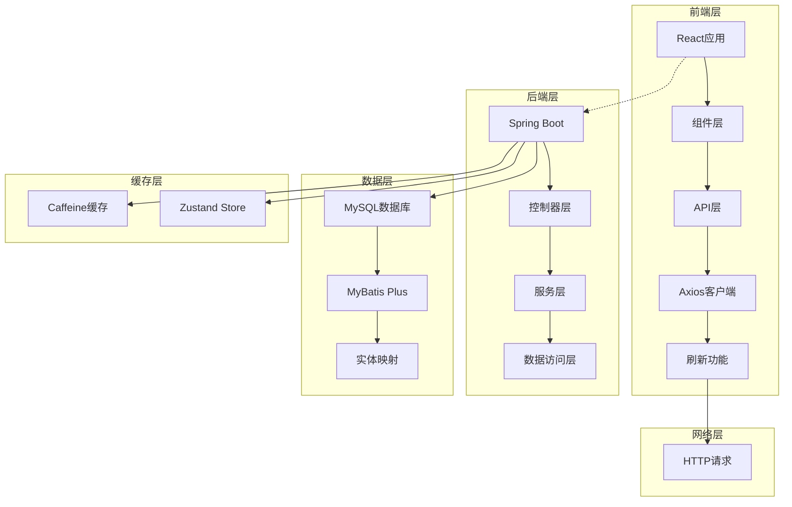

**图表来源**
- [client.ts:1-31](file://fund-web/src/api/client.ts#L1-L31)
- [application.yml:18-21](file://src/main/resources/application.yml#L18-L21)

### 数据流处理

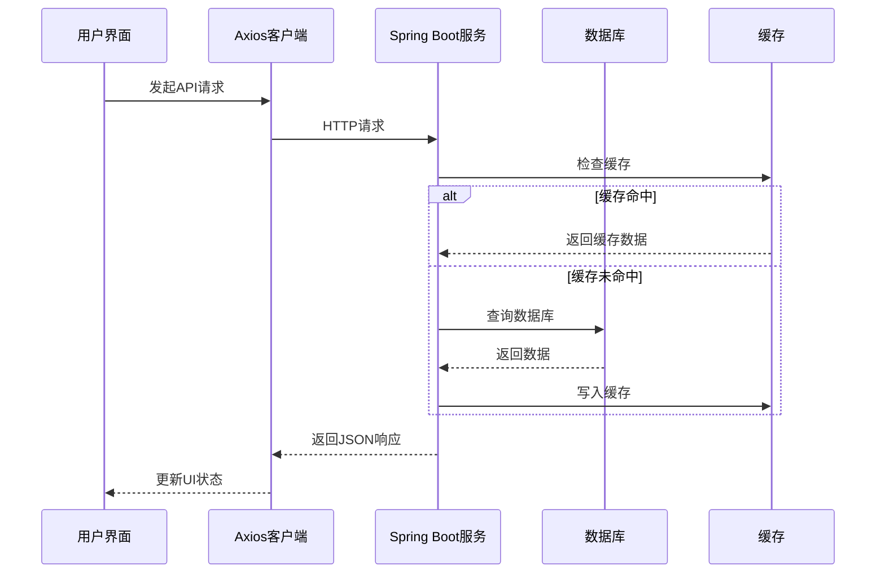

**图表来源**
- [client.ts:9-28](file://fund-web/src/api/client.ts#L9-L28)
- [application.yml:18-21](file://src/main/resources/application.yml#L18-L21)

## 详细组件分析

### FundDetail组件分析

FundDetail组件是基金详情展示的核心组件，新增了手动刷新功能，提升了用户体验。

#### 组件架构

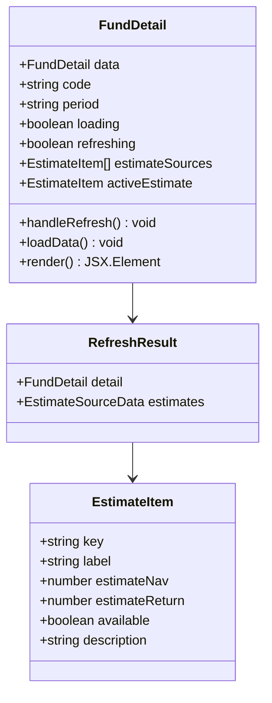

**图表来源**
- [FundDetail.tsx:20-86](file://fund-web/src/pages/Fund/FundDetail.tsx#L20-L86)
- [fund.ts:56-76](file://fund-web/src/api/fund.ts#L56-L76)

#### 核心功能实现

1. **数据刷新功能**：新增刷新按钮，支持手动获取最新基金数据
2. **多数据源估值**：支持多种估值数据源，可切换查看
3. **实时状态显示**：刷新过程中显示加载状态，提升用户体验
4. **错误处理机制**：刷新失败时提供友好的错误提示

#### 刷新流程

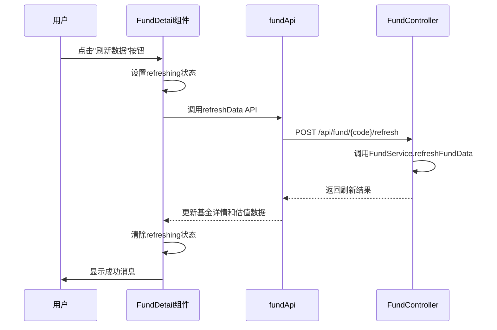

**图表来源**
- [FundDetail.tsx:66-86](file://fund-web/src/pages/Fund/FundDetail.tsx#L66-L86)
- [fund.ts:74-76](file://fund-web/src/api/fund.ts#L74-L76)
- [FundController.java:53-60](file://src/main/java/com/qoder/fund/controller/FundController.java#L53-L60)

**章节来源**
- [FundDetail.tsx:186](file://fund-web/src/pages/Fund/FundDetail.tsx#L186)
- [fund.ts:74-76](file://fund-web/src/api/fund.ts#L74-L76)
- [FundController.java:53-60](file://src/main/java/com/qoder/fund/controller/FundController.java#L53-L60)

### SearchResult组件分析

SearchResult组件实现了持久化缓存机制，显著提升了搜索性能和用户体验。

#### 组件架构

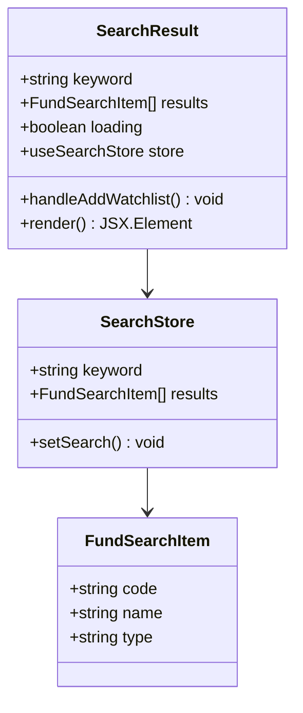

**图表来源**
- [SearchResult.tsx:11-46](file://fund-web/src/pages/Fund/SearchResult.tsx#L11-L46)
- [searchStore.ts:4-14](file://fund-web/src/store/searchStore.ts#L4-L14)

#### 缓存策略实现

1. **URL参数优先**：优先使用URL参数作为搜索关键字
2. **缓存回退机制**：当URL无参数时，回退到Zustand缓存
3. **智能请求控制**：避免重复请求相同关键词的搜索结果
4. **状态同步**：搜索结果同时存储到URL和Zustand store中

#### 缓存流程

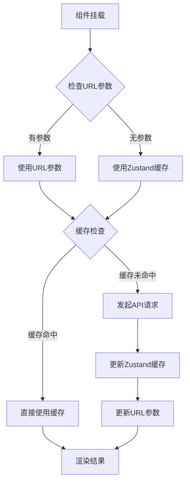

**图表来源**
- [SearchResult.tsx:19-46](file://fund-web/src/pages/Fund/SearchResult.tsx#L19-L46)
- [searchStore.ts:10-14](file://fund-web/src/store/searchStore.ts#L10-L14)

**章节来源**
- [SearchResult.tsx:19-46](file://fund-web/src/pages/Fund/SearchResult.tsx#L19-L46)
- [searchStore.ts:10-14](file://fund-web/src/store/searchStore.ts#L10-L14)

### API接口设计

#### 请求拦截器

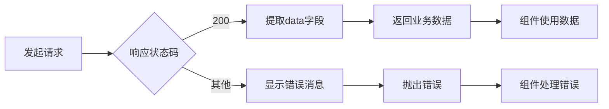

**图表来源**
- [client.ts:9-28](file://fund-web/src/api/client.ts#L9-L28)

#### 数据模型定义

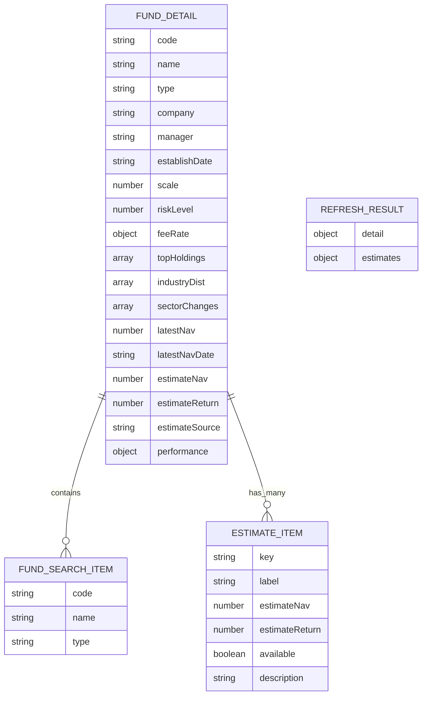

**图表来源**
- [fund.ts:9-76](file://fund-web/src/api/fund.ts#L9-L76)

**章节来源**
- [client.ts:1-31](file://fund-web/src/api/client.ts#L1-L31)
- [fund.ts:1-77](file://fund-web/src/api/fund.ts#L1-L77)

## 依赖关系分析

### 前端依赖关系

```mermaid
graph TB
subgraph "核心依赖"
A[react] --> B[react-dom]
C[antd] --> D[@ant-design/icons]
E[axios] --> F[message组件]
G[echarts] --> H[echarts-for-react]
I[zustand] --> J[状态管理]
K[react-router-dom] --> L[路由配置]
end
subgraph "开发依赖"
M[vite] --> N[构建工具]
O[typescript] --> P[类型检查]
Q[eslint] --> R[代码质量]
end
subgraph "工具类"
S[message] --> T[用户提示]
U[Spin] --> V[加载状态]
W[Button] --> X[交互元素]
end
```

**图表来源**
- [package.json:12-36](file://fund-web/package.json#L12-L36)

### 后端依赖关系

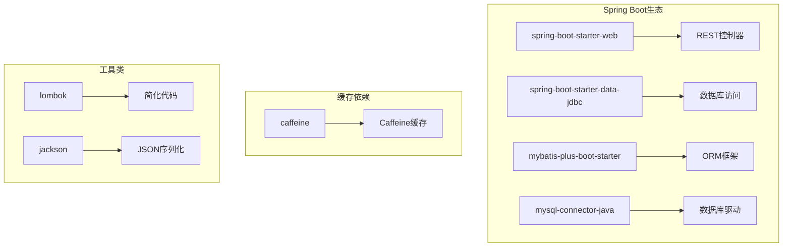

**图表来源**
- [application.yml:4-31](file://src/main/resources/application.yml#L4-L31)

**章节来源**
- [package.json:12-36](file://fund-web/package.json#L12-L36)
- [application.yml:4-31](file://src/main/resources/application.yml#L4-L31)

## 性能考虑

### 前端性能优化

1. **懒加载策略**：使用React.lazy和Suspense实现组件懒加载
2. **状态管理**：采用Zustand实现轻量级状态管理，避免不必要的重渲染
3. **缓存策略**：实现多层缓存机制，包括URL参数缓存和Zustand持久化缓存
4. **图表优化**：ECharts组件按需渲染，减少内存占用
5. **请求去重**：避免重复请求相同关键词的搜索结果

### 后端性能优化

1. **数据库优化**：配置Caffeine缓存，提升数据访问速度
2. **连接池配置**：合理配置数据库连接池参数
3. **查询优化**：使用MyBatis Plus的条件构造器优化SQL查询
4. **并发处理**：Spring Boot的异步处理能力
5. **数据刷新优化**：支持多数据源并行刷新

### 缓存策略

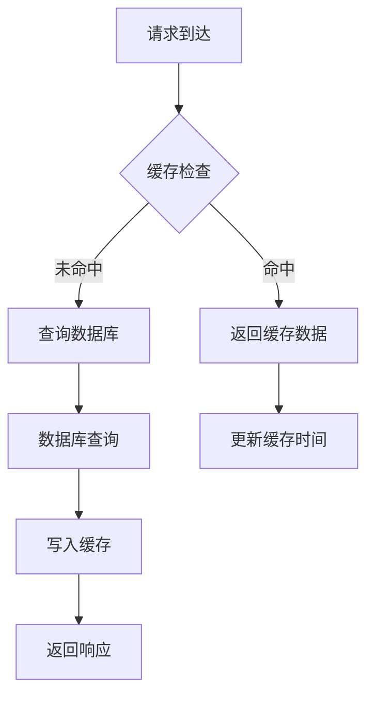

**图表来源**
- [application.yml:18-21](file://src/main/resources/application.yml#L18-L21)

## 故障排除指南

### 常见问题诊断

#### API请求失败
- 检查网络连接和代理设置
- 验证后端服务是否正常运行
- 查看浏览器开发者工具中的网络请求

#### 数据显示异常
- 确认数据库连接配置正确
- 检查数据模型映射关系
- 验证缓存数据的有效性

#### 性能问题
- 监控前端组件的渲染次数
- 检查后端数据库查询性能
- 分析图表渲染的内存占用
- 验证缓存机制是否正常工作

### 错误处理机制

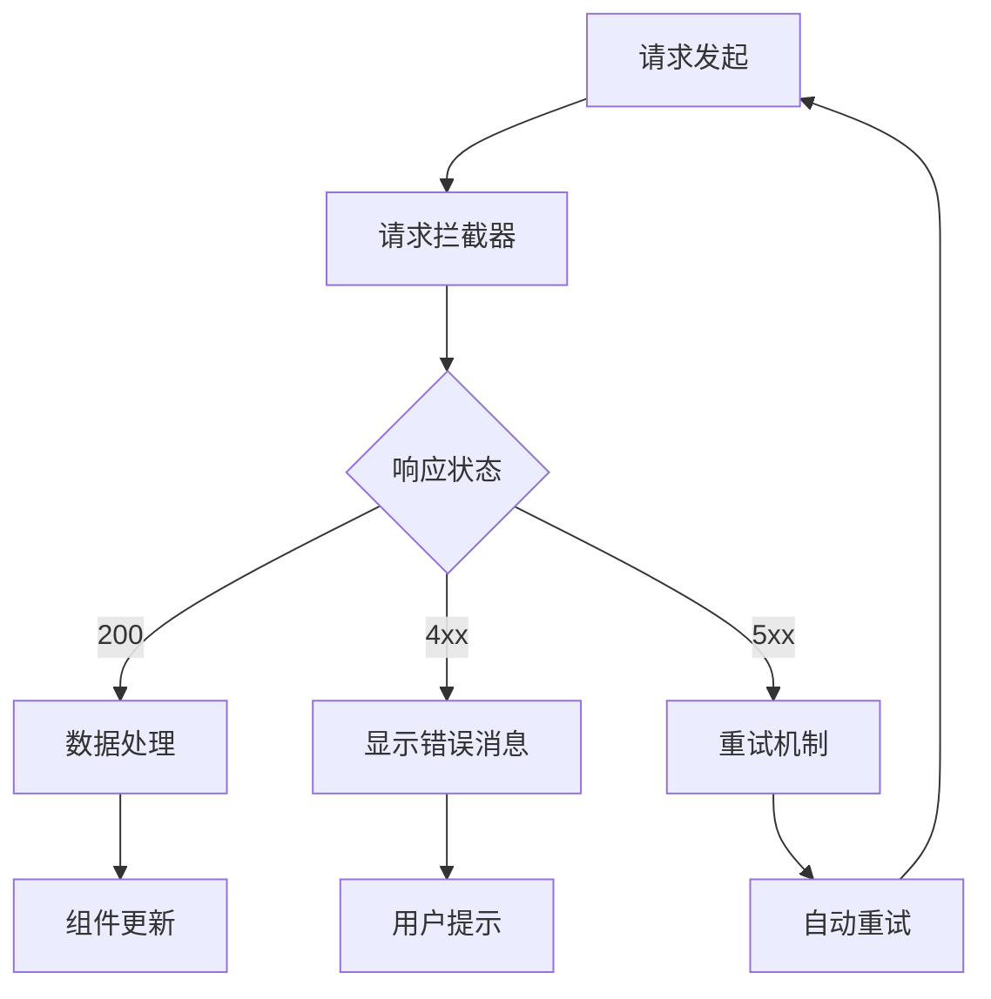

**图表来源**
- [client.ts:9-28](file://fund-web/src/api/client.ts#L9-L28)

**章节来源**
- [client.ts:9-28](file://fund-web/src/api/client.ts#L9-L28)

## 结论

"基金管家"项目展现了现代Web应用开发的最佳实践，通过前后端分离架构、清晰的组件划分和完善的错误处理机制，为用户提供了一个功能完整、性能优异的投资组合管理工具。

### 项目优势

1. **技术栈先进**：采用React 18、TypeScript、Ant Design等现代化技术
2. **架构清晰**：前后端分离，职责明确，易于维护和扩展
3. **用户体验优秀**：提供流畅的交互体验和直观的数据可视化
4. **性能优化到位**：从数据缓存到组件优化都有完善的考虑
5. **实时数据支持**：新增的刷新功能确保用户获得最新的基金数据

### 新增功能亮点

1. **手动刷新机制**：用户可随时手动刷新基金数据，确保信息准确性
2. **智能缓存系统**：实现多层缓存策略，显著提升搜索性能
3. **多数据源支持**：支持多种估值数据源，提供更全面的市场信息
4. **状态持久化**：使用Zustand实现搜索结果的持久化缓存

### 发展方向

1. **功能增强**：根据PRD文档逐步实现收益分析、指数估值等功能
2. **性能优化**：持续优化图表渲染和数据加载性能
3. **用户体验**：完善移动端适配和离线功能
4. **安全性加固**：加强用户认证和数据安全保护
5. **数据质量**：进一步优化数据刷新频率和准确性

该项目为个人投资者提供了一个专业、可靠的投资组合管理解决方案，具有良好的扩展性和维护性。新增的刷新功能和缓存机制进一步提升了应用的实用性和用户体验。