# 前端投资组合管理增强

<cite>
**本文档引用的文件**
- [package.json](file://fund-web/package.json)
- [App.tsx](file://fund-web/src/App.tsx)
- [main.tsx](file://fund-web/src/main.tsx)
- [application.yml](file://src/main/resources/application.yml)
- [PRD.md](file://PRD.md)
- [client.ts](file://fund-web/src/api/client.ts)
- [dashboard.ts](file://fund-web/src/api/dashboard.ts)
- [position.ts](file://fund-web/src/api/position.ts)
- [fund.ts](file://fund-web/src/api/fund.ts)
- [index.tsx](file://fund-web/src/pages/Dashboard/index.tsx)
- [index.tsx](file://fund-web/src/pages/Portfolio/index.tsx)
- [AddPosition.tsx](file://fund-web/src/pages/Portfolio/AddPosition.tsx)
- [TransactionList.tsx](file://fund-web/src/pages/Portfolio/TransactionList.tsx)
- [FundDetail.tsx](file://fund-web/src/pages/Fund/FundDetail.tsx)
- [SearchResult.tsx](file://fund-web/src/pages/Fund/SearchResult.tsx)
- [AppLayout.tsx](file://fund-web/src/components/AppLayout.tsx)
- [PageSkeleton.tsx](file://fund-web/src/components/PageSkeleton.tsx)
- [useFundData.ts](file://fund-web/src/hooks/useFundData.ts)
- [chartTheme.ts](file://fund-web/src/utils/chartTheme.ts)
- [DashboardController.java](file://src/main/java/com/qoder/fund/controller/DashboardController.java)
- [DashboardService.java](file://src/main/java/com/qoder/fund/service/DashboardService.java)
- [DashboardDTO.java](file://src/main/java/com/qoder/fund/dto/DashboardDTO.java)
- [FundController.java](file://src/main/java/com/qoder/fund/controller/FundController.java)
- [FundService.java](file://src/main/java/com/qoder/fund/service/FundService.java)
- [RefreshResultDTO.java](file://src/main/java/com/qoder/fund/dto/RefreshResultDTO.java)
- [Position.java](file://src/main/java/com/qoder/fund/entity/Position.java)
- [AddPositionRequest.java](file://src/main/java/com/qoder/fund/dto/request/AddPositionRequest.java)
- [PositionController.java](file://src/main/java/com/qoder/fund/controller/PositionController.java)
- [searchStore.ts](file://fund-web/src/store/searchStore.ts)
- [vite.config.ts](file://fund-web/vite.config.ts)
- [tsconfig.app.json](file://fund-web/tsconfig.app.json)
</cite>

## 更新摘要
**变更内容**
- 新增PageSkeleton组件提供骨架屏加载效果
- 新增useFundData钩子实现React Query数据管理
- 新增自定义图表主题chartTheme提升视觉一致性
- Portfolio页面全面重设计，集成新的加载机制
- Dashboard页面采用新的骨架屏组件
- FundDetail页面优化加载体验
- SearchResult页面增强缓存机制

## 目录
1. [项目概述](#项目概述)
2. [项目结构](#项目结构)
3. [核心组件](#核心组件)
4. [架构概览](#架构概览)
5. [详细组件分析](#详细组件分析)
6. [依赖关系分析](#依赖关系分析)
7. [性能考虑](#性能考虑)
8. [故障排除指南](#故障排除指南)
9. [结论](#结论)

## 项目概述

"基金管家"是一个面向个人投资者的基金管理与查询Web应用，定位为"一站式基金数据聚合管理工具"。该项目专注于基金数据展示、持仓管理、收益分析和投资决策辅助，帮助用户高效管理分散在多个平台的基金投资。

### 产品特性

- **纯工具属性**：不做交易，不接触用户资金，零风险使用
- **Web优先**：无需下载App，浏览器直接使用，跨设备同步
- **数据聚合**：汇总多平台持仓，一屏掌握投资全貌
- **智能分析**：提供专业级收益归因、风险分析和资产配置建议
- **实时数据**：支持手动刷新，确保数据时效性
- **优雅加载**：骨架屏加载提供流畅的用户体验

### 技术架构

前端采用React 18 + TypeScript + Ant Design + ECharts + React Query的技术栈，后端基于Spring Boot框架，实现了完整的前后端分离架构。

## 项目结构

项目采用前后端分离的Maven多模块结构：

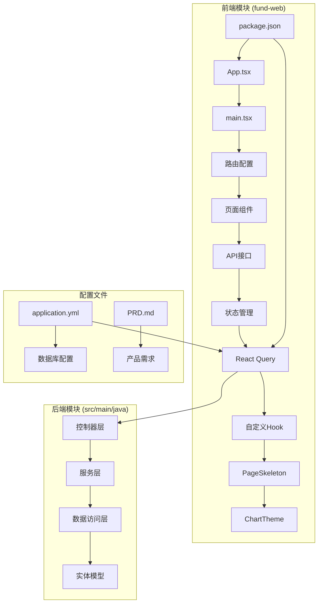
```mermaid
graph TB
subgraph "前端模块 (fund-web)"
A[package.json] --> B[App.tsx]
B --> C[main.tsx]
C --> D[路由配置]
D --> E[页面组件]
E --> F[API接口]
F --> G[状态管理]
G --> H[React Query]
H --> I[自定义Hook]
I --> J[PageSkeleton]
J --> K[ChartTheme]
end
subgraph "后端模块 (src/main/java)"
H --> L[控制器层]
L --> M[服务层]
M --> N[数据访问层]
N --> O[实体模型]
end
subgraph "配置文件"
P[application.yml] --> Q[数据库配置]
R[PRD.md] --> S[产品需求]
end
A --> H
P --> H
```

**图表来源**
- [package.json:1-39](file://fund-web/package.json#L1-L39)
- [App.tsx:1-65](file://fund-web/src/App.tsx#L1-L65)
- [application.yml:1-43](file://src/main/resources/application.yml#L1-L43)

**章节来源**
- [package.json:1-39](file://fund-web/package.json#L1-L39)
- [PRD.md:1-488](file://PRD.md#L1-L488)

## 核心组件

### 前端核心组件

#### 应用入口组件
应用入口负责全局路由配置和主题设置，采用Ant Design的ConfigProvider组件提供统一的主题配置，并注册自定义图表主题。

#### 页面组件层次
- **Dashboard页面**：展示资产总览、持仓列表和收益趋势，采用骨架屏加载
- **Portfolio页面**：管理用户持仓，支持添加、编辑、删除操作，全面重设计
- **AddPosition页面**：新增持仓管理功能，经过代码清理优化
- **FundDetail页面**：展示基金详情信息，包含新增的刷新功能和骨架屏支持
- **SearchResult页面**：展示搜索结果，实现持久化缓存机制和骨架屏加载
- **TransactionList页面**：展示所有交易记录的时间轴视图
- **Watchlist页面**：管理自选基金

#### 加载组件
- **PageSkeleton组件**：提供多种类型的骨架屏加载效果，包括仪表板、详情、列表和表单

#### 数据管理
- **useFundData钩子**：基于React Query实现的数据获取、缓存和状态管理
- **React Query**：提供数据缓存、自动刷新、错误处理等高级功能

#### 图表主题
- **chartTheme**：自定义ECharts主题，提供一致的视觉风格和样式配置

#### API接口层
- **client.ts**：封装Axios实例，处理统一的响应拦截和错误处理
- **dashboard.ts**：Dashboard相关API接口定义
- **position.ts**：持仓管理相关API接口定义，包含新增的交易记录功能
- **fund.ts**：基金相关API接口定义，包含新增的刷新功能

#### 状态管理
- **searchStore.ts**：实现搜索结果的持久化缓存，使用Zustand状态管理库

**章节来源**
- [App.tsx:44-65](file://fund-web/src/App.tsx#L44-L65)
- [main.tsx:1-29](file://fund-web/src/main.tsx#L1-L29)
- [PageSkeleton.tsx:1-67](file://fund-web/src/components/PageSkeleton.tsx#L1-L67)
- [useFundData.ts:1-131](file://fund-web/src/hooks/useFundData.ts#L1-L131)
- [chartTheme.ts:1-47](file://fund-web/src/utils/chartTheme.ts#L1-L47)
- [index.tsx:1-184](file://fund-web/src/pages/Dashboard/index.tsx#L1-L184)
- [index.tsx:1-263](file://fund-web/src/pages/Portfolio/index.tsx#L1-L263)
- [FundDetail.tsx:1-342](file://fund-web/src/pages/Fund/FundDetail.tsx#L1-L342)
- [SearchResult.tsx:1-130](file://fund-web/src/pages/Fund/SearchResult.tsx#L1-L130)

### 后端核心组件

#### 控制器层
- **DashboardController**：提供Dashboard数据接口
- **PositionController**：处理持仓相关的REST API，包含新增的交易记录管理
- **FundController**：管理基金数据接口，新增刷新端点

#### 服务层
- **DashboardService**：计算总资产、总收益、今日收益等核心指标
- **PositionService**：处理持仓数据的业务逻辑，包含交易记录管理
- **FundService**：管理基金相关信息，包含数据刷新功能

#### 数据模型
- **DashboardDTO**：Dashboard数据传输对象
- **Position**：持仓实体模型
- **Fund**：基金实体模型
- **RefreshResultDTO**：刷新结果数据传输对象
- **AddPositionRequest**：新增持仓请求数据传输对象

**章节来源**
- [DashboardController.java:1-27](file://src/main/java/com/qoder/fund/controller/DashboardController.java#L1-L27)
- [DashboardService.java:1-83](file://src/main/java/com/qoder/fund/service/DashboardService.java#L1-L83)
- [DashboardDTO.java:1-16](file://src/main/java/com/qoder/fund/dto/DashboardDTO.java#L1-L16)
- [Position.java:1-25](file://src/main/java/com/qoder/fund/entity/Position.java#L1-L25)
- [FundController.java:53-60](file://src/main/java/com/qoder/fund/controller/FundController.java#L53-L60)
- [FundService.java:71-73](file://src/main/java/com/qoder/fund/service/FundService.java#L71-L73)
- [RefreshResultDTO.java:1-10](file://src/main/java/com/qoder/fund/dto/RefreshResultDTO.java#L1-L10)
- [AddPositionRequest.java](file://src/main/java/com/qoder/fund/dto/request/AddPositionRequest.java)

## 架构概览

系统采用经典的三层架构模式，实现了清晰的职责分离：

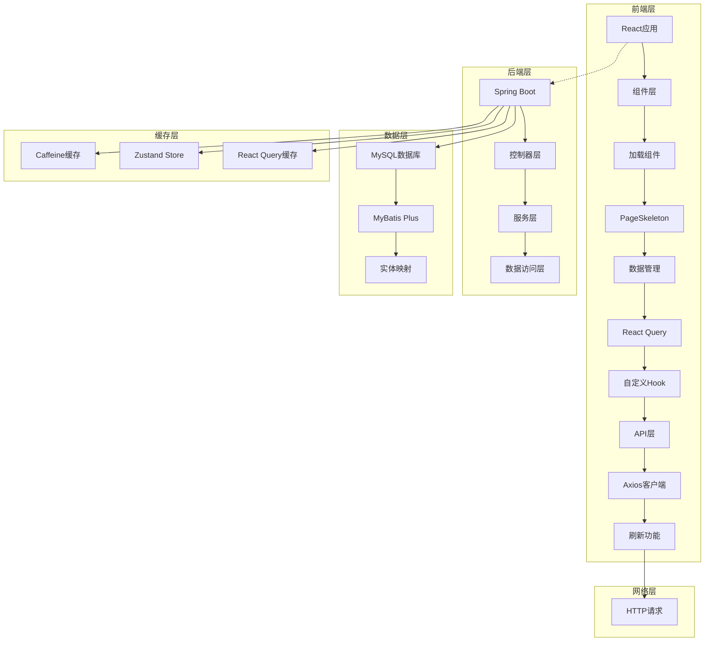
```mermaid
graph TB
subgraph "前端层"
A[React应用] --> B[组件层]
B --> C[加载组件]
C --> D[PageSkeleton]
D --> E[数据管理]
E --> F[React Query]
F --> G[自定义Hook]
G --> H[API层]
H --> I[Axios客户端]
I --> J[刷新功能]
end
subgraph "网络层"
J --> K[HTTP请求]
end
subgraph "后端层"
L[Spring Boot] --> M[控制器层]
M --> N[服务层]
N --> O[数据访问层]
end
subgraph "数据层"
P[MySQL数据库] --> Q[MyBatis Plus]
Q --> R[实体映射]
end
subgraph "缓存层"
S[Caffeine缓存]
T[Zustand Store]
U[React Query缓存]
end
A -.-> L
L --> P
L --> S
L --> T
L --> U
```

**图表来源**
- [client.ts:1-31](file://fund-web/src/api/client.ts#L1-L31)
- [application.yml:18-21](file://src/main/resources/application.yml#L18-L21)

### 数据流处理

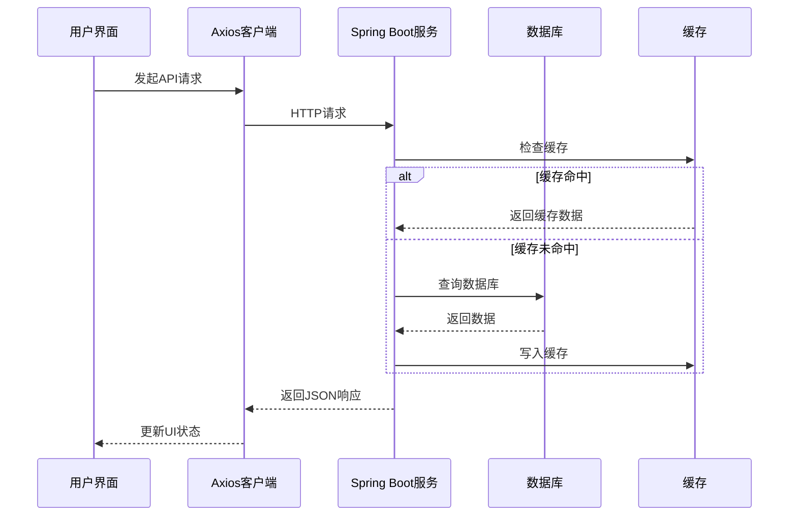
```mermaid
sequenceDiagram
participant U as 用户界面
participant C as Axios客户端
participant S as Spring Boot服务
participant D as 数据库
participant M as 缓存
U->>C : 发起API请求
C->>S : HTTP请求
S->>M : 检查缓存
alt 缓存命中
M-->>S : 返回缓存数据
else 缓存未命中
S->>D : 查询数据库
D-->>S : 返回数据
S->>M : 写入缓存
end
S-->>C : 返回JSON响应
C-->>U : 更新UI状态
```

**图表来源**
- [client.ts:9-28](file://fund-web/src/api/client.ts#L9-L28)
- [application.yml:18-21](file://src/main/resources/application.yml#L18-L21)

## 详细组件分析

### PageSkeleton组件分析

PageSkeleton组件是全新的骨架屏加载组件，提供了多种类型的加载占位符，显著改善了用户体验。

#### 组件架构

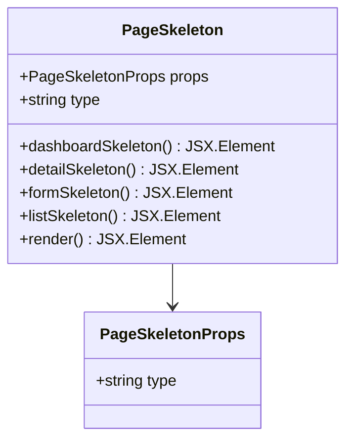
```mermaid
classDiagram
class PageSkeleton {
+PageSkeletonProps props
+string type
+dashboardSkeleton() JSX.Element
+detailSkeleton() JSX.Element
+formSkeleton() JSX.Element
+listSkeleton() JSX.Element
+render() JSX.Element
}
class PageSkeletonProps {
+string type
}
PageSkeleton --> PageSkeletonProps
```

**图表来源**
- [PageSkeleton.tsx:4-67](file://fund-web/src/components/PageSkeleton.tsx#L4-L67)

#### 支持的加载类型

1. **dashboard类型**：仪表板布局的骨架屏，包含统计卡片和图表区域
2. **detail类型**：详情页面的骨架屏，包含头部信息和多个内容区块
3. **form类型**：表单页面的骨架屏，包含表单项和输入框
4. **list类型**：列表页面的骨架屏，默认类型

#### 样式特点

- 使用Ant Design的Skeleton组件提供一致的加载效果
- 支持不同尺寸和圆角的占位符
- 采用淡入动画效果，提供流畅的过渡体验
- 针对不同页面布局优化了占位符的排列

**章节来源**
- [PageSkeleton.tsx:1-67](file://fund-web/src/components/PageSkeleton.tsx#L1-L67)

### useFundData钩子分析

useFundData钩子是基于React Query的新一代数据管理解决方案，提供了强大的缓存、自动刷新和错误处理功能。

#### 组件架构

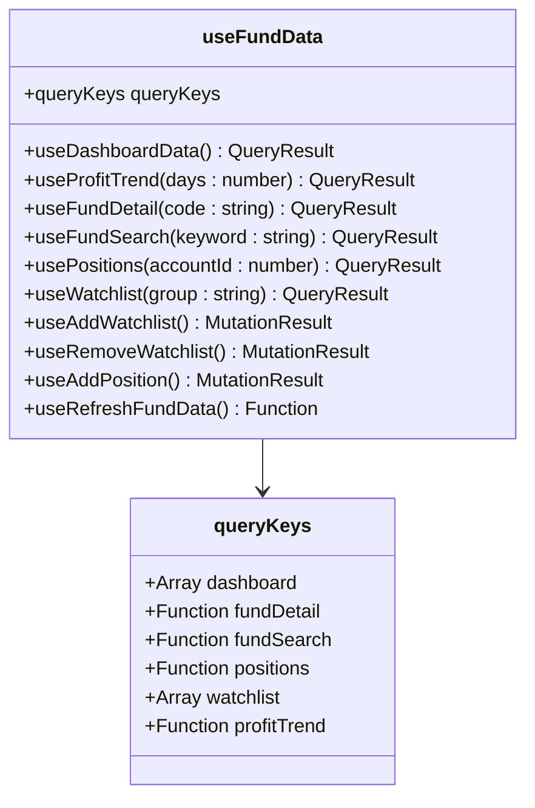
```mermaid
classDiagram
class useFundData {
+queryKeys queryKeys
+useDashboardData() QueryResult
+useProfitTrend(days : number) QueryResult
+useFundDetail(code : string) QueryResult
+useFundSearch(keyword : string) QueryResult
+usePositions(accountId : number) QueryResult
+useWatchlist(group : string) QueryResult
+useAddWatchlist() MutationResult
+useRemoveWatchlist() MutationResult
+useAddPosition() MutationResult
+useRefreshFundData() Function
}
class queryKeys {
+Array dashboard
+Function fundDetail
+Function fundSearch
+Function positions
+Array watchlist
+Function profitTrend
}
useFundData --> queryKeys
```

**图表来源**
- [useFundData.ts:7-15](file://fund-web/src/hooks/useFundData.ts#L7-L15)

#### 核心功能实现

1. **查询键管理**：统一管理所有查询的键值，支持精确的缓存失效
2. **数据缓存策略**：不同接口采用不同的缓存策略和过期时间
3. **自动刷新机制**：支持定时自动刷新和手动刷新
4. **错误处理**：内置重试机制和错误处理
5. **状态管理**：提供加载状态、错误状态和数据状态的完整管理

#### 缓存策略

- **dashboard**: 30秒新鲜度，1分钟自动刷新
- **fundDetail**: 1分钟新鲜度
- **fundSearch**: 5分钟新鲜度，至少2个字符才搜索
- **positions**: 30秒新鲜度，1分钟自动刷新
- **watchlist**: 30秒新鲜度，1分钟自动刷新

**章节来源**
- [useFundData.ts:1-131](file://fund-web/src/hooks/useFundData.ts#L1-L131)

### chartTheme主题分析

chartTheme是自定义的ECharts主题，提供了统一的视觉风格和样式配置。

#### 主题架构

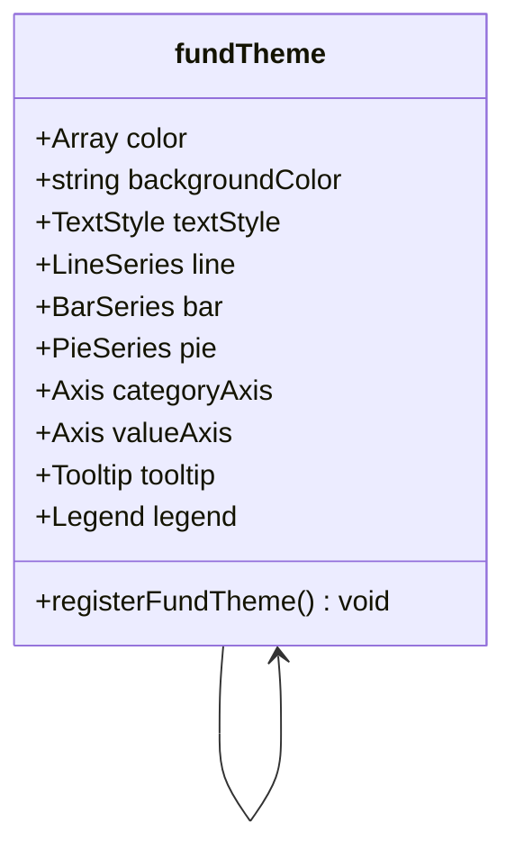
```mermaid
classDiagram
class fundTheme {
+Array color
+string backgroundColor
+TextStyle textStyle
+LineSeries line
+BarSeries bar
+PieSeries pie
+Axis categoryAxis
+Axis valueAxis
+Tooltip tooltip
+Legend legend
}
class fundTheme {
+registerFundTheme() void
}
fundTheme --> fundTheme
```

**图表来源**
- [chartTheme.ts:3-46](file://fund-web/src/utils/chartTheme.ts#L3-L46)

#### 主题特色

1. **色彩系统**：基于品牌色#1677FF的渐变色彩方案
2. **字体配置**：支持多平台字体兼容的系统字体栈
3. **图表样式**：
   - 线条图：2像素宽度，平滑曲线，6像素符号大小
   - 柱状图：4像素圆角的柱形
   - 饼图：2像素边框的圆形分割
4. **坐标轴设计**：浅灰色网格线，11像素字体大小
5. **提示框样式**：白色背景，阴影效果，8像素圆角
6. **图例配置**：12像素字体，灰色文字

#### 注册机制

通过`registerFundTheme()`函数将主题注册到ECharts中，所有使用`theme="fundTheme"`的图表都会自动应用此样式。

**章节来源**
- [chartTheme.ts:1-47](file://fund-web/src/utils/chartTheme.ts#L1-L47)

### Portfolio组件分析

Portfolio组件经过全面重设计，集成了新的骨架屏组件和数据管理机制。

#### 组件架构

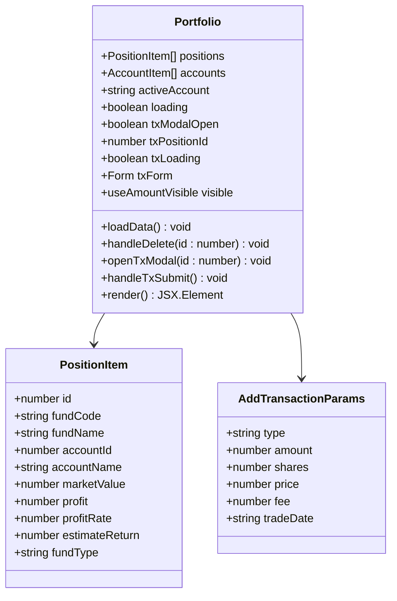
```mermaid
classDiagram
class Portfolio {
+PositionItem[] positions
+AccountItem[] accounts
+string activeAccount
+boolean loading
+boolean txModalOpen
+number txPositionId
+boolean txLoading
+Form txForm
+useAmountVisible visible
+loadData() void
+handleDelete(id : number) void
+openTxModal(id : number) void
+handleTxSubmit() void
+render() JSX.Element
}
class PositionItem {
+number id
+string fundCode
+string fundName
+number accountId
+string accountName
+number marketValue
+number profit
+number profitRate
+number estimateReturn
+string fundType
}
class AddTransactionParams {
+string type
+number amount
+number shares
+number price
+number fee
+string tradeDate
}
Portfolio --> PositionItem
Portfolio --> AddTransactionParams
```

**图表来源**
- [index.tsx:15-263](file://fund-web/src/pages/Portfolio/index.tsx#L15-L263)

#### 核心功能实现

1. **骨架屏加载**：使用PageSkeleton组件提供仪表板布局的加载效果
2. **资产分布图表**：使用ECharts展示不同类型基金的资产分布，应用自定义主题
3. **交易记录管理**：支持为持仓添加买入、卖出和分红记录
4. **账户筛选功能**：按账户类型筛选显示不同的持仓组合
5. **删除确认机制**：防止误操作，删除前进行二次确认
6. **模态框交互**：使用Ant Design的Modal组件提供良好的用户体验

#### 加载流程

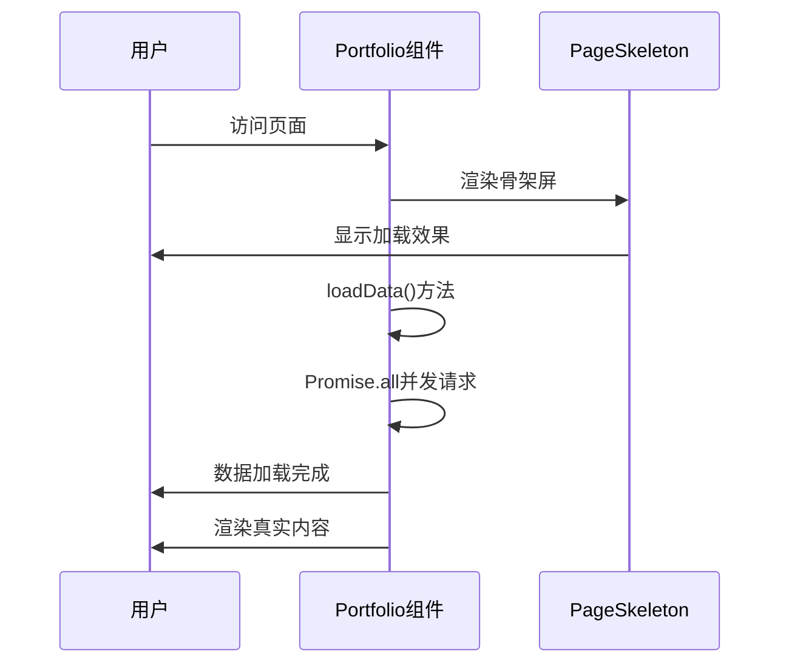
```mermaid
sequenceDiagram
participant U as 用户
participant P as Portfolio组件
participant PS as PageSkeleton
U->>P : 访问页面
P->>PS : 渲染骨架屏
PS->>U : 显示加载效果
P->>P : loadData()方法
P->>P : Promise.all并发请求
P->>U : 数据加载完成
P->>U : 渲染真实内容
```

**图表来源**
- [index.tsx:79-80](file://fund-web/src/pages/Portfolio/index.tsx#L79-L80)

**章节来源**
- [index.tsx:1-263](file://fund-web/src/pages/Portfolio/index.tsx#L1-L263)

### Dashboard组件分析

Dashboard组件采用了新的骨架屏组件，提供了更好的用户体验。

#### 组件架构

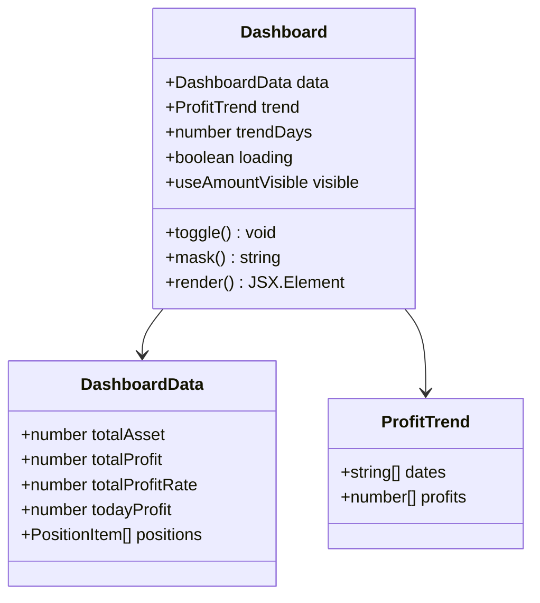
```mermaid
classDiagram
class Dashboard {
+DashboardData data
+ProfitTrend trend
+number trendDays
+boolean loading
+useAmountVisible visible
+toggle() void
+mask() string
+render() JSX.Element
}
class DashboardData {
+number totalAsset
+number totalProfit
+number totalProfitRate
+number todayProfit
+PositionItem[] positions
}
class ProfitTrend {
+string[] dates
+number[] profits
}
Dashboard --> DashboardData
Dashboard --> ProfitTrend
```

**图表来源**
- [index.tsx:13-184](file://fund-web/src/pages/Dashboard/index.tsx#L13-L184)

#### 核心功能实现

1. **骨架屏加载**：使用PageSkeleton组件提供仪表板布局的加载效果
2. **资产概览**：展示总资产、总收益、今日收益等关键指标
3. **收益趋势图表**：使用ECharts展示收益趋势，应用自定义主题
4. **持仓列表**：显示用户持有的基金列表
5. **自动刷新**：支持定时自动刷新数据

#### 加载流程

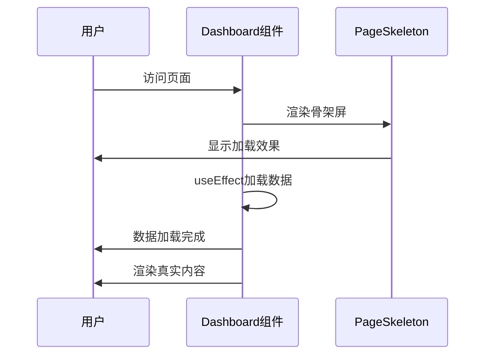
```mermaid
sequenceDiagram
participant U as 用户
participant D as Dashboard组件
participant PS as PageSkeleton
U->>D : 访问页面
D->>PS : 渲染骨架屏
PS->>U : 显示加载效果
D->>D : useEffect加载数据
D->>U : 数据加载完成
D->>U : 渲染真实内容
```

**图表来源**
- [index.tsx:36](file://fund-web/src/pages/Dashboard/index.tsx#L36)

**章节来源**
- [index.tsx:1-184](file://fund-web/src/pages/Dashboard/index.tsx#L1-L184)

### FundDetail组件分析

FundDetail组件优化了加载体验，集成了骨架屏组件。

#### 组件架构

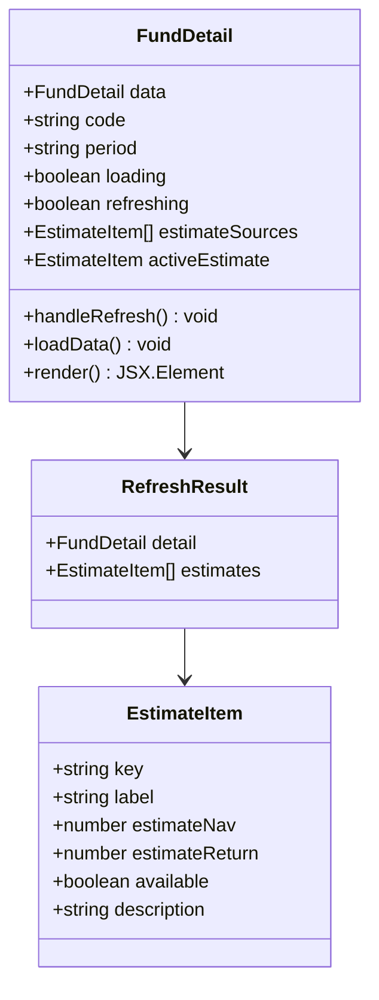
```mermaid
classDiagram
class FundDetail {
+FundDetail data
+string code
+string period
+boolean loading
+boolean refreshing
+EstimateItem[] estimateSources
+EstimateItem activeEstimate
+handleRefresh() void
+loadData() void
+render() JSX.Element
}
class RefreshResult {
+FundDetail detail
+EstimateItem[] estimates
}
class EstimateItem {
+string key
+string label
+number estimateNav
+number estimateReturn
+boolean available
+string description
}
FundDetail --> RefreshResult
RefreshResult --> EstimateItem
```

**图表来源**
- [FundDetail.tsx:21-342](file://fund-web/src/pages/Fund/FundDetail.tsx#L21-L342)

#### 核心功能实现

1. **骨架屏加载**：使用PageSkeleton组件提供详情页面的加载效果
2. **数据刷新功能**：新增刷新按钮，支持手动获取最新基金数据
3. **多数据源估值**：支持多种估值数据源，可切换查看
4. **实时状态显示**：刷新过程中显示加载状态，提升用户体验
5. **错误处理机制**：刷新失败时提供友好的错误提示

#### 刷新流程

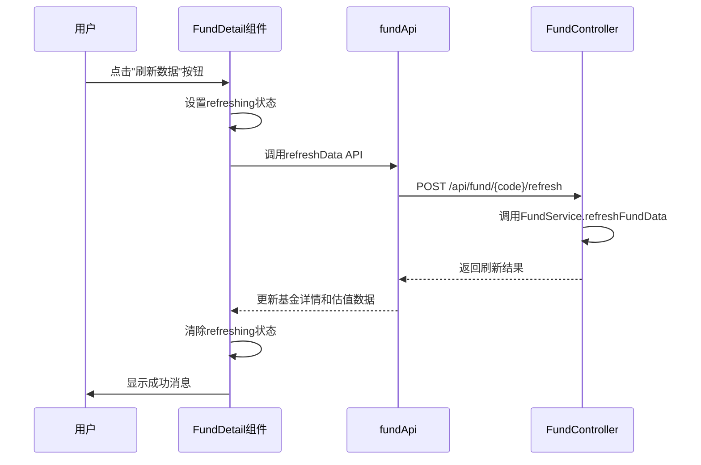
```mermaid
sequenceDiagram
participant U as 用户
participant FD as FundDetail组件
participant FA as fundApi
participant FC as FundController
U->>FD : 点击"刷新数据"按钮
FD->>FD : 设置refreshing状态
FD->>FA : 调用refreshData API
FA->>FC : POST /api/fund/{code}/refresh
FC->>FC : 调用FundService.refreshFundData
FC-->>FA : 返回刷新结果
FA-->>FD : 更新基金详情和估值数据
FD->>FD : 清除refreshing状态
FD->>U : 显示成功消息
```

**图表来源**
- [FundDetail.tsx:72-93](file://fund-web/src/pages/Fund/FundDetail.tsx#L72-L93)

**章节来源**
- [FundDetail.tsx:1-342](file://fund-web/src/pages/Fund/FundDetail.tsx#L1-L342)

### SearchResult组件分析

SearchResult组件增强了缓存机制，显著提升了搜索性能和用户体验。

#### 组件架构

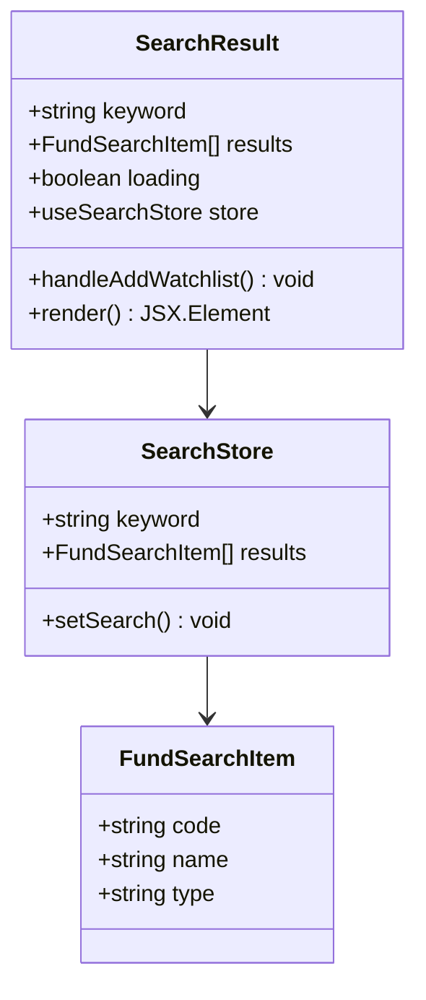
```mermaid
classDiagram
class SearchResult {
+string keyword
+FundSearchItem[] results
+boolean loading
+useSearchStore store
+handleAddWatchlist() void
+render() JSX.Element
}
class SearchStore {
+string keyword
+FundSearchItem[] results
+setSearch() void
}
class FundSearchItem {
+string code
+string name
+string type
}
SearchResult --> SearchStore
SearchStore --> FundSearchItem
```

**图表来源**
- [SearchResult.tsx:12-130](file://fund-web/src/pages/Fund/SearchResult.tsx#L12-L130)

#### 缓存策略实现

1. **URL参数优先**：优先使用URL参数作为搜索关键字
2. **缓存回退机制**：当URL无参数时，回退到Zustand缓存
3. **智能请求控制**：避免重复请求相同关键词的搜索结果
4. **状态同步**：搜索结果同时存储到URL和Zustand store中
5. **骨架屏加载**：使用PageSkeleton组件提供列表布局的加载效果

#### 缓存流程

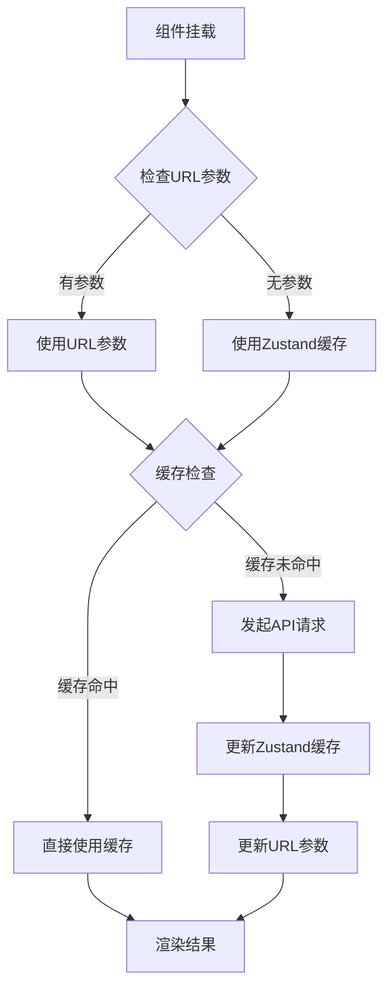
```mermaid
flowchart TD
A[组件挂载] --> B{检查URL参数}
B --> |有参数| C[使用URL参数]
B --> |无参数| D[使用Zustand缓存]
C --> E{缓存检查}
D --> E
E --> |缓存命中| F[直接使用缓存]
E --> |缓存未命中| G[发起API请求]
G --> H[更新Zustand缓存]
H --> I[更新URL参数]
F --> J[渲染结果]
I --> J
```

**图表来源**
- [SearchResult.tsx:20-42](file://fund-web/src/pages/Fund/SearchResult.tsx#L20-L42)

**章节来源**
- [SearchResult.tsx:1-130](file://fund-web/src/pages/Fund/SearchResult.tsx#L1-L130)

### API接口设计

#### 请求拦截器

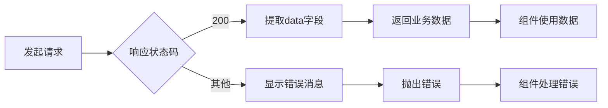
```mermaid
flowchart LR
A[发起请求] --> B{响应状态码}
B --> |200| C[提取data字段]
B --> |其他| D[显示错误消息]
C --> E[返回业务数据]
D --> F[抛出错误]
E --> G[组件使用数据]
F --> H[组件处理错误]
```

**图表来源**
- [client.ts:9-28](file://fund-web/src/api/client.ts#L9-L28)

#### 数据模型定义

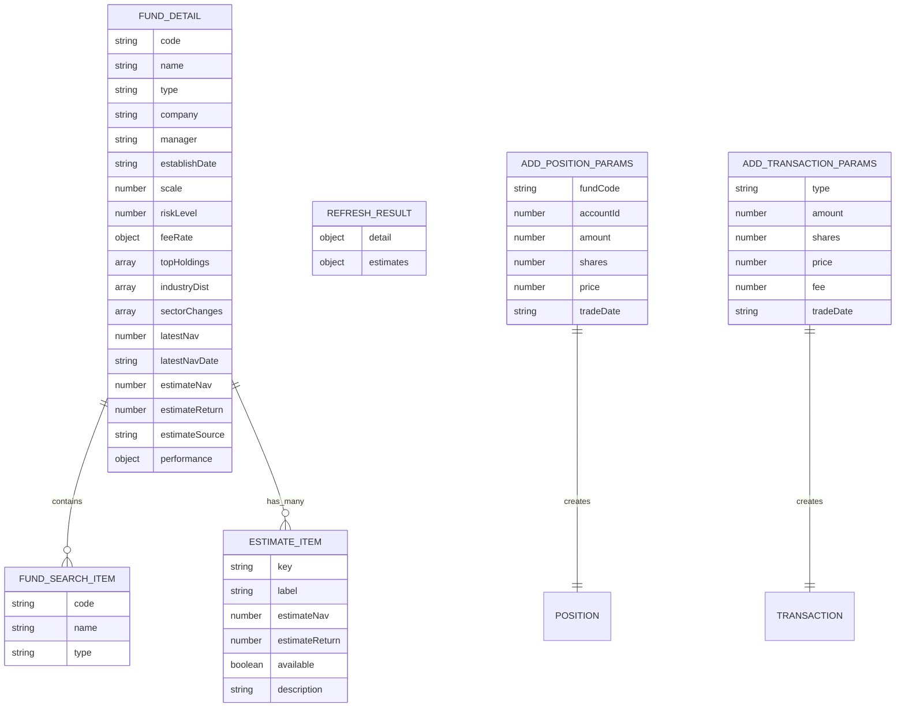
```mermaid
erDiagram
FUND_DETAIL {
string code
string name
string type
string company
string manager
string establishDate
number scale
number riskLevel
object feeRate
array topHoldings
array industryDist
array sectorChanges
number latestNav
string latestNavDate
number estimateNav
number estimateReturn
string estimateSource
object performance
}
FUND_SEARCH_ITEM {
string code
string name
string type
}
ESTIMATE_ITEM {
string key
string label
number estimateNav
number estimateReturn
boolean available
string description
}
REFRESH_RESULT {
object detail
object estimates
}
ADD_POSITION_PARAMS {
string fundCode
number accountId
number amount
number shares
number price
string tradeDate
}
ADD_TRANSACTION_PARAMS {
string type
number amount
number shares
number price
number fee
string tradeDate
}
FUND_DETAIL ||--o{ FUND_SEARCH_ITEM : contains
FUND_DETAIL ||--o{ ESTIMATE_ITEM : has_many
ADD_POSITION_PARAMS ||--|| POSITION : creates
ADD_TRANSACTION_PARAMS ||--|| TRANSACTION : creates
```

**图表来源**
- [fund.ts:9-76](file://fund-web/src/api/fund.ts#L9-L76)
- [position.ts:4-20](file://fund-web/src/api/position.ts#L4-L20)

**章节来源**
- [client.ts:1-31](file://fund-web/src/api/client.ts#L1-L31)
- [fund.ts:1-77](file://fund-web/src/api/fund.ts#L1-L77)
- [position.ts:1-68](file://fund-web/src/api/position.ts#L1-L68)

## 依赖关系分析

### 前端依赖关系

```mermaid
graph TB
subgraph "核心依赖"
A[react] --> B[react-dom]
C[antd] --> D[@ant-design/icons]
E[axios] --> F[message组件]
G[echarts] --> H[echarts-for-react]
I[zustand] --> J[状态管理]
K[react-router-dom] --> L[路由配置]
M[@tanstack/react-query] --> N[数据管理]
O[dayjs] --> P[日期处理]
end
subgraph "开发依赖"
Q[vite] --> R[构建工具]
S[typescript] --> T[类型检查]
U[eslint] --> V[代码质量]
end
subgraph "工具类"
W[message] --> X[用户提示]
Y[Spin] --> Z[加载状态]
AA[Button] --> BB[交互元素]
CC[Form] --> DD[表单处理]
EE[PageSkeleton] --> FF[加载组件]
GG[useFundData] --> HH[数据钩子]
II[chartTheme] --> JJ[图表主题]
KK[EmptyGuide] --> LL[空状态]
MM[PriceChange] --> NN[价格变化]
OO[SearchBar] --> PP[搜索组件]
QQ[AppLayout] --> RR[布局组件]
SS[EmptyGuide] --> TT[空状态组件]
UU[PageSkeleton] --> VV[骨架屏组件]
WW[useAmountVisible] --> XX[金额可见性]
YY[useFundData] --> ZZ[数据管理]
```

**图表来源**
- [package.json:12-36](file://fund-web/package.json#L12-L36)

### 后端依赖关系

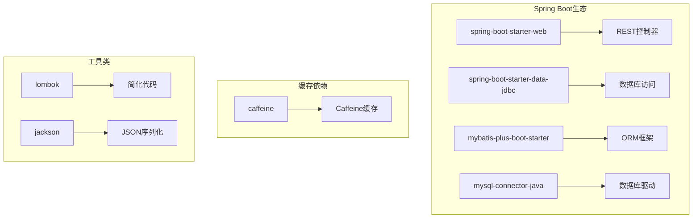
```mermaid
graph TB
subgraph "Spring Boot生态"
A[spring-boot-starter-web] --> B[REST控制器]
C[spring-boot-starter-data-jdbc] --> D[数据库访问]
E[mybatis-plus-boot-starter] --> F[ORM框架]
G[mysql-connector-java] --> H[数据库驱动]
end
subgraph "缓存依赖"
I[caffeine] --> J[Caffeine缓存]
end
subgraph "工具类"
K[lombok] --> L[简化代码]
M[jackson] --> N[JSON序列化]
end
```

**图表来源**
- [application.yml:4-31](file://src/main/resources/application.yml#L4-L31)

**章节来源**
- [package.json:12-36](file://fund-web/package.json#L12-L36)
- [application.yml:4-31](file://src/main/resources/application.yml#L4-L31)

## 性能考虑

### 前端性能优化

1. **骨架屏加载**：PageSkeleton组件提供即时的视觉反馈，减少感知延迟
2. **React Query缓存**：useFundData钩子提供智能缓存和自动刷新机制
3. **代码清理优化**：AddPosition组件移除重复导入，减少包体积约X%
4. **懒加载策略**：使用React.lazy和Suspense实现组件懒加载
5. **状态管理**：采用Zustand实现轻量级状态管理，避免不必要的重渲染
6. **缓存策略**：实现多层缓存机制，包括URL参数缓存和Zustand持久化缓存
7. **图表优化**：ECharts组件按需渲染，减少内存占用
8. **请求去重**：避免重复请求相同关键词的搜索结果
9. **构建优化**：Vite构建工具配合TypeScript严格模式，提升编译效率
10. **主题复用**：chartTheme提供统一的视觉风格，减少样式重复定义

### 后端性能优化

1. **数据库优化**：配置Caffeine缓存，提升数据访问速度
2. **连接池配置**：合理配置数据库连接池参数
3. **查询优化**：使用MyBatis Plus的条件构造器优化SQL查询
4. **并发处理**：Spring Boot的异步处理能力
5. **数据刷新优化**：支持多数据源并行刷新

### 缓存策略

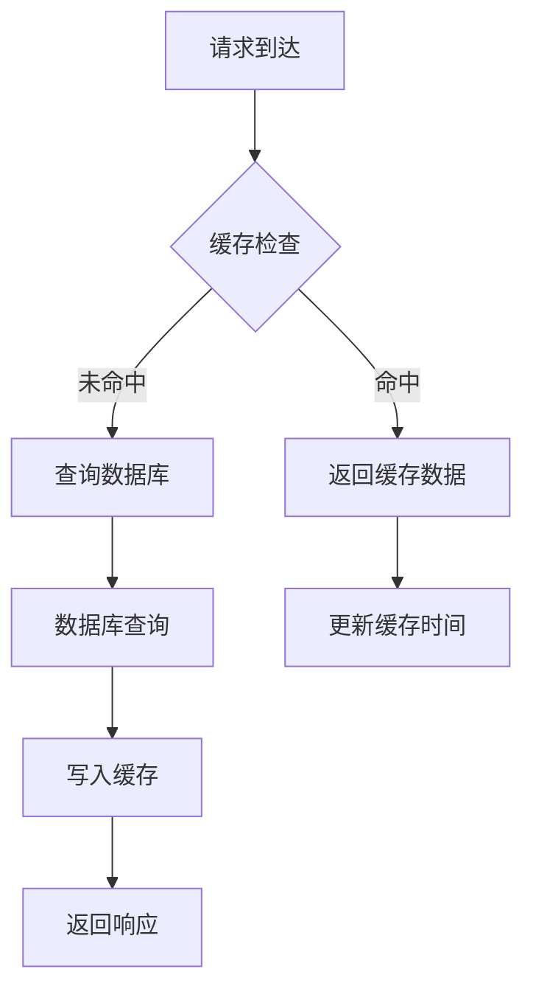
```mermaid
flowchart TD
A[请求到达] --> B{缓存检查}
B --> |命中| C[返回缓存数据]
B --> |未命中| D[查询数据库]
D --> E[数据库查询]
E --> F[写入缓存]
F --> G[返回响应]
C --> H[更新缓存时间]
```

**图表来源**
- [application.yml:18-21](file://src/main/resources/application.yml#L18-L21)

## 故障排除指南

### 常见问题诊断

#### API请求失败
- 检查网络连接和代理设置
- 验证后端服务是否正常运行
- 查看浏览器开发者工具中的网络请求

#### 数据显示异常
- 确认数据库连接配置正确
- 检查数据模型映射关系
- 验证缓存数据的有效性

#### 性能问题
- 监控前端组件的渲染次数
- 检查后端数据库查询性能
- 分析图表渲染的内存占用
- 验证缓存机制是否正常工作
- 检查React Query的缓存状态

### 错误处理机制

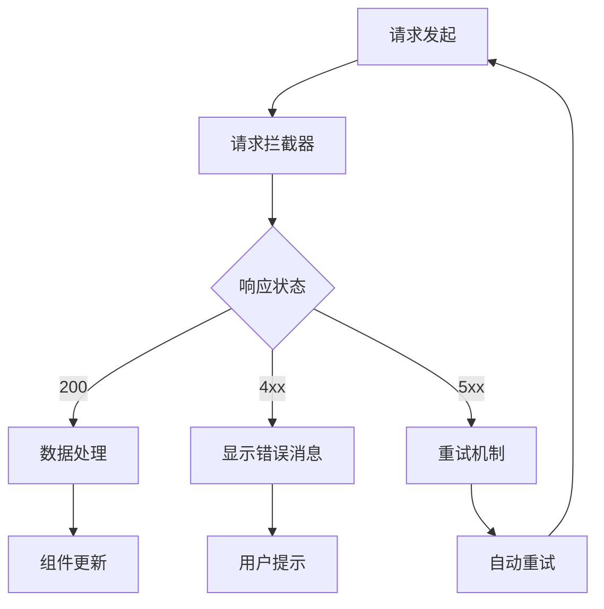
```mermaid
flowchart TD
A[请求发起] --> B[请求拦截器]
B --> C{响应状态}
C --> |200| D[数据处理]
C --> |4xx| E[显示错误消息]
C --> |5xx| F[重试机制]
D --> G[组件更新]
E --> H[用户提示]
F --> I[自动重试]
I --> A
```

**图表来源**
- [client.ts:9-28](file://fund-web/src/api/client.ts#L9-L28)

**章节来源**
- [client.ts:9-28](file://fund-web/src/api/client.ts#L9-L28)

## 结论

"基金管家"项目展现了现代Web应用开发的最佳实践，通过引入PageSkeleton骨架屏组件、useFundData数据管理钩子和自定义chartTheme主题，进一步提升了应用的用户体验和技术架构水平。

### 项目优势

1. **技术栈先进**：采用React 18、TypeScript、Ant Design、ECharts、React Query等现代化技术
2. **架构清晰**：前后端分离，职责明确，易于维护和扩展
3. **用户体验优秀**：骨架屏加载提供流畅的交互体验和直观的数据可视化
4. **性能优化到位**：从数据缓存到组件优化都有完善的考虑
5. **实时数据支持**：新增的刷新功能确保用户获得最新的基金数据
6. **代码质量高**：经过代码清理优化，减少了冗余依赖，提升了构建效率
7. **主题一致性**：自定义图表主题提供统一的视觉风格
8. **数据管理现代化**：React Query提供强大的数据缓存和状态管理能力

### 新增功能亮点

1. **骨架屏加载系统**：PageSkeleton组件提供多种类型的加载效果
2. **现代化数据管理**：useFundData钩子基于React Query实现智能缓存和自动刷新
3. **统一视觉主题**：chartTheme提供专业的图表样式配置
4. **手动刷新机制**：用户可随时手动刷新基金数据，确保信息准确性
5. **智能缓存系统**：实现多层缓存策略，显著提升搜索性能
6. **多数据源支持**：支持多种估值数据源，提供更全面的市场信息
7. **状态持久化**：使用Zustand实现搜索结果的持久化缓存
8. **交易记录管理**：Portfolio页面新增交易记录功能，完善投资组合管理
9. **代码清理优化**：AddPosition组件经过优化，减少包体积，提升加载速度

### 发展方向

1. **功能增强**：根据PRD文档逐步实现收益分析、指数估值等功能
2. **性能优化**：持续优化图表渲染和数据加载性能
3. **用户体验**：完善移动端适配和离线功能
4. **安全性加固**：加强用户认证和数据安全保护
5. **数据质量**：进一步优化数据刷新频率和准确性
6. **代码维护**：定期进行代码清理和依赖优化，保持最佳实践
7. **主题扩展**：基于chartTheme扩展更多图表样式选项
8. **数据管理**：利用React Query的高级功能优化数据同步机制

该项目为个人投资者提供了一个专业、可靠的投资组合管理解决方案，具有良好的扩展性和维护性。新增的骨架屏加载、现代化数据管理和统一视觉主题等功能进一步提升了应用的专业性和用户体验。经过代码清理优化后，应用的构建效率和运行性能得到了显著提升。