# 命令行界面

<cite>
**本文档引用的文件**
- [FundCliApplication.java](file://src/main/java/com/qoder/fund/cli/FundCliApplication.java)
- [CliTableFormatter.java](file://src/main/java/com/qoder/fund/cli/util/CliTableFormatter.java)
- [FundCommand.java](file://src/main/java/com/qoder/fund/cli/FundCommand.java)
- [PositionCommand.java](file://src/main/java/com/qoder/fund/cli/PositionCommand.java)
- [WatchlistCommand.java](file://src/main/java/com/qoder/fund/cli/WatchlistCommand.java)
- [DashboardCommand.java](file://src/main/java/com/qoder/fund/cli/DashboardCommand.java)
- [AccountCommand.java](file://src/main/java/com/qoder/fund/cli/AccountCommand.java)
- [SyncCommand.java](file://src/main/java/com/qoder/fund/cli/SyncCommand.java)
- [DashboardService.java](file://src/main/java/com/qoder/fund/service/DashboardService.java)
- [DashboardDTO.java](file://src/main/java/com/qoder/fund/dto/DashboardDTO.java)
- [HealthCheckConfig.java](file://src/main/java/com/qoder/fund/config/HealthCheckConfig.java)
- [CacheConfig.java](file://src/main/java/com/qoder/fund/config/CacheConfig.java)
- [application-cli.yml](file://src/main/resources/application-cli.yml)
- [application.yml](file://src/main/resources/application.yml)
- [logback-spring.xml](file://src/main/resources/logback-spring.xml)
- [pom.xml](file://pom.xml)
- [README.md](file://README.md)
- [install-cron.sh](file://scripts/install-cron.sh)
- [setup-harness.sh](file://scripts/setup-harness.sh)
- [pre-commit.sh](file://scripts/pre-commit.sh)
</cite>

## 更新摘要
**变更内容**
- 新增数据库连接验证功能，在CLI启动时自动检查数据库连通性
- 集成Spring Profile系统，CLI模式激活"cli"配置文件并禁用缓存
- 优化日志级别配置，通过application-cli.yml和logback-spring.xml实现精细化日志控制
- 增强健康检查功能，添加Actuator支持和多维度健康状态监控
- 新增dashboard broadcast命令功能，专为外部Agent定时任务设计
- 新增cron作业安装脚本，支持将Spring @Scheduled迁移到系统crontab
- 新增自动化部署脚本，提供完整的工程搭建和环境配置能力
- 新增Git钩子脚本，支持代码质量检查和架构约束验证

## 目录
1. [简介](#简介)
2. [项目结构](#项目结构)
3. [核心组件](#核心组件)
4. [架构概览](#架构概览)
5. [详细组件分析](#详细组件分析)
6. [自动化部署与运维](#自动化部署与运维)
7. [依赖关系分析](#依赖关系分析)
8. [性能考虑](#性能考虑)
9. [故障排除指南](#故障排除指南)
10. [结论](#结论)

## 简介

基金管家命令行界面是一个基于 Spring Boot 和 Picocli 的现代化 CLI 工具，为用户提供了一站式的基金数据聚合管理能力。该工具不仅支持日常的基金查询、持仓管理和数据同步操作，还提供了丰富的命令行选项和输出格式，满足不同用户的使用需求。

**更新** 新增数据库连接验证功能，在CLI启动时自动检查数据库连通性，确保应用正常运行。集成了Spring Profile系统，CLI模式激活"cli"配置文件并禁用缓存，优化了日志级别配置，通过application-cli.yml和logback-spring.xml实现精细化日志控制。增强了健康检查功能，添加了Actuator支持和多维度健康状态监控。新增了cron作业安装脚本，支持将Spring @Scheduled迁移到系统crontab，为定时任务管理提供完整的自动化部署能力。

该 CLI 工具采用模块化设计，通过命令分组的方式组织各种功能，包括基金查询、持仓管理、自选管理、仪表盘统计、账户管理和数据同步等核心功能模块。同时，通过cron作业安装脚本和自动化部署工具，使CLI工具从单纯的命令行工具演进为包含自动化部署功能的综合工具平台。

## 项目结构

命令行界面位于 `src/main/java/com/qoder/fund/cli/` 目录下，采用清晰的分层架构设计：

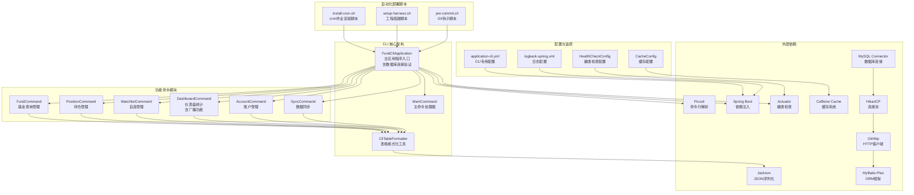

**图表来源**
- [FundCliApplication.java:19-100](file://src/main/java/com/qoder/fund/cli/FundCliApplication.java#L19-L100)
- [CliTableFormatter.java:15-40](file://src/main/java/com/qoder/fund/cli/util/CliTableFormatter.java#L15-L40)
- [HealthCheckConfig.java:14-50](file://src/main/java/com/qoder/fund/config/HealthCheckConfig.java#L14-L50)
- [CacheConfig.java:14-93](file://src/main/java/com/qoder/fund/config/CacheConfig.java#L14-L93)
- [install-cron.sh:1-82](file://scripts/install-cron.sh#L1-L82)
- [setup-harness.sh:1-87](file://scripts/setup-harness.sh#L1-L87)
- [pre-commit.sh:1-79](file://scripts/pre-commit.sh#L1-L79)

**章节来源**
- [FundCliApplication.java:1-215](file://src/main/java/com/qoder/fund/cli/FundCliApplication.java#L1-L215)
- [pom.xml:87-97](file://pom.xml#L87-L97)

## 核心组件

### 主应用程序入口

FundCliApplication 是整个 CLI 工具的入口点，负责初始化 Spring Boot 应用程序并配置命令行参数解析。该类实现了 CommandLineRunner 和 ExitCodeGenerator 接口，提供了灵活的应用模式切换能力。

**更新** 新增了数据库连接验证功能，在应用启动时自动检查数据库连通性，确保CLI工具能够正常工作。同时，通过Spring Profile系统激活"cli"配置文件，禁用缓存功能以适应CLI的单次执行特性。

### Spring Profile集成

**新增** CLI模式通过激活"cli"配置文件来优化运行时行为：

- 禁用缓存功能，因为CLI每次都是新进程，缓存没有意义
- 优化日志级别，减少不必要的日志输出
- 配置专用的CLI模式参数

### 健康检查系统

**新增** 集成了Spring Boot Actuator健康检查功能：

- 数据库连接健康检查
- 外部数据源状态监控
- 缓存系统健康状态
- 多维度健康状态报告

### 命令分组架构

CLI 工具采用分层命令结构，每个功能模块都有对应的命令处理器：

- **FundCommand**: 基金查询与管理
- **PositionCommand**: 持仓管理
- **WatchlistCommand**: 自选基金管理
- **DashboardCommand**: 资产概览统计（含广播功能）
- **AccountCommand**: 账户管理
- **SyncCommand**: 数据同步任务

### 输出格式化系统

CliTableFormatter 提供了统一的输出格式化能力，支持：
- 彩色输出控制
- JSON 格式输出
- 表格样式格式化
- 数值格式化处理

**更新** 新增对 DashboardDTO 的专门格式化支持，包括资产概览和收益趋势的格式化输出。

**章节来源**
- [FundCliApplication.java:22-130](file://src/main/java/com/qoder/fund/cli/FundCliApplication.java#L22-L130)
- [HealthCheckConfig.java:14-105](file://src/main/java/com/qoder/fund/config/HealthCheckConfig.java#L14-L105)
- [application-cli.yml:1-13](file://src/main/resources/application-cli.yml#L1-L13)

## 架构概览

命令行界面采用事件驱动的命令处理架构，通过 Picocli 实现命令解析和执行：

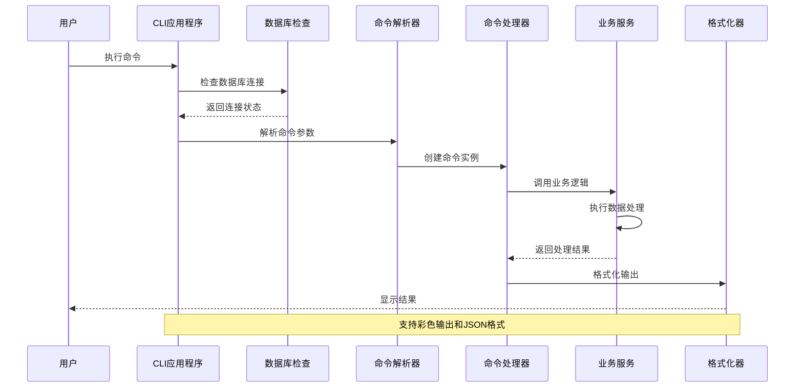

**图表来源**
- [FundCliApplication.java:85-113](file://src/main/java/com/qoder/fund/cli/FundCliApplication.java#L85-L113)
- [CliTableFormatter.java:39-48](file://src/main/java/com/qoder/fund/cli/util/CliTableFormatter.java#L39-L48)

## 详细组件分析

### 基金命令模块

基金命令模块提供了完整的基金数据查询和管理功能：

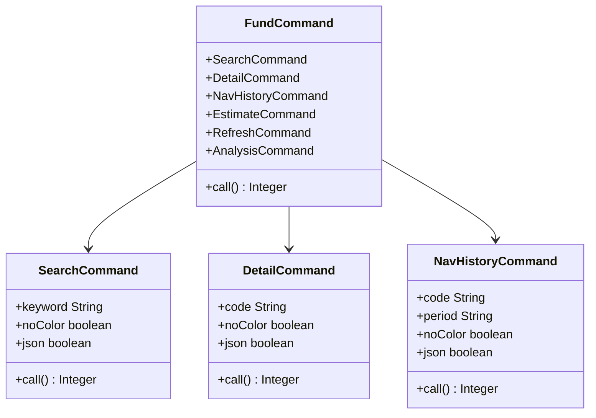

**图表来源**
- [FundCommand.java:17-49](file://src/main/java/com/qoder/fund/cli/FundCommand.java#L17-L49)
- [FundCommand.java:54-88](file://src/main/java/com/qoder/fund/cli/FundCommand.java#L54-L88)

#### 基金搜索功能

基金搜索支持关键词匹配，最少需要2个字符才能进行搜索。搜索结果包含基金代码、名称和类型信息。

#### 净值历史查询

支持多种时间周期的净值历史查询，包括1个月、3个月、6个月、1年、3年和全部历史数据。

#### 实时估值功能

提供多数据源的实时估值聚合，包括智能估值和实际净值对比分析。

**章节来源**
- [FundCommand.java:51-250](file://src/main/java/com/qoder/fund/cli/FundCommand.java#L51-L250)

### 持仓管理模块

持仓管理模块提供了完整的投资组合管理功能：

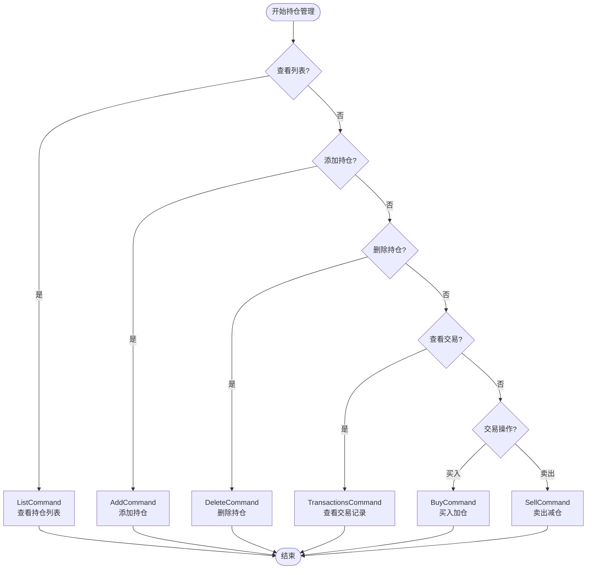

**图表来源**
- [PositionCommand.java:21-51](file://src/main/java/com/qoder/fund/cli/PositionCommand.java#L21-L51)

#### 交易记录管理

支持查看特定持仓的所有交易记录，包括买入、卖出和分红等操作。

#### 成本计算优化

自动计算持仓成本和收益，支持加权平均成本法和份额管理。

**章节来源**
- [PositionCommand.java:53-319](file://src/main/java/com/qoder/fund/cli/PositionCommand.java#L53-L319)

### 仪表盘统计模块

**更新** 仪表盘统计模块新增了广播功能，专为外部 Agent 定时任务设计：

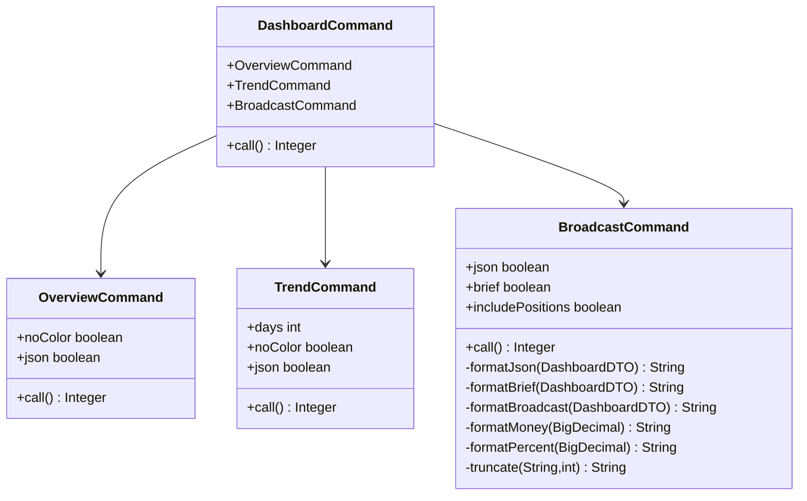

**图表来源**
- [DashboardCommand.java:21-31](file://src/main/java/com/qoder/fund/cli/DashboardCommand.java#L21-L31)
- [DashboardCommand.java:114-146](file://src/main/java/com/qoder/fund/cli/DashboardCommand.java#L114-L146)

#### 资产概览功能

提供完整的资产概览信息，包括总资产、总收益、收益率和今日收益等关键指标。

#### 收益趋势功能

支持查看指定天数内的收益趋势，帮助用户分析投资表现。

#### 收益播报功能

**新增** 专为外部 Agent 定时任务设计的收益播报功能，支持三种输出模式：

- **默认模式**: 详细的播报格式，包含标题、总资产、累计收益、今日收益和持仓表现等信息
- **简洁模式 (--brief)**: 仅输出关键数据，如今日预估收益和涨幅
- **JSON模式 (--json)**: 标准化的 JSON 格式输出，适合程序解析

播报功能包含以下特性：
- 支持包含持仓明细的详细输出
- 自动检测今日收益是否为预估值
- 格式化货币和百分比显示
- 支持中文日期格式和表情符号标识涨跌

**章节来源**
- [DashboardCommand.java:55-243](file://src/main/java/com/qoder/fund/cli/DashboardCommand.java#L55-L243)

### 数据同步模块

数据同步模块提供了定时任务的手动触发能力：

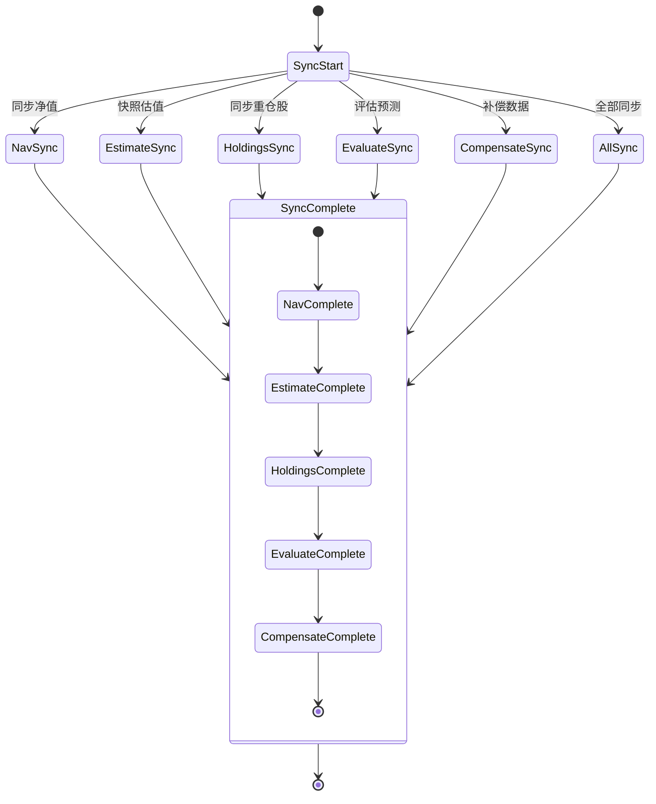

**图表来源**
- [SyncCommand.java:22-45](file://src/main/java/com/qoder/fund/cli/SyncCommand.java#L22-L45)

#### 交易日检测

自动检测交易日，非交易日会跳过相应的同步任务。

#### 批量数据处理

支持批量数据同步和补偿，提高数据处理效率。

**章节来源**
- [SyncCommand.java:47-259](file://src/main/java/com/qoder/fund/cli/SyncCommand.java#L47-L259)

### 输出格式化系统

CliTableFormatter 提供了统一的输出格式化能力：

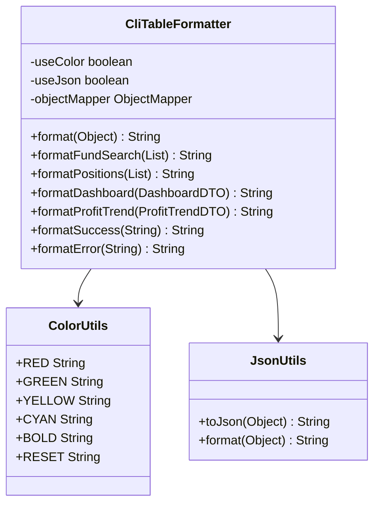

**图表来源**
- [CliTableFormatter.java:18-491](file://src/main/java/com/qoder/fund/cli/util/CliTableFormatter.java#L18-L491)

#### 多格式输出支持

支持彩色文本输出和 JSON 格式输出，满足不同使用场景的需求。

#### 数据类型适配

针对不同的数据类型提供专门的格式化方法，确保输出的一致性和可读性。

**更新** 新增对 DashboardDTO 和 ProfitTrendDTO 的专门格式化支持。

**章节来源**
- [CliTableFormatter.java:39-491](file://src/main/java/com/qoder/fund/cli/util/CliTableFormatter.java#L39-L491)

## 自动化部署与运维

**新增** CLI工具现已具备完整的自动化部署和运维能力，通过一系列脚本工具提供工程化的开发体验。

### Cron作业安装脚本

**新增** `install-cron.sh` 脚本提供了将Spring @Scheduled定时任务迁移到系统crontab的完整解决方案：

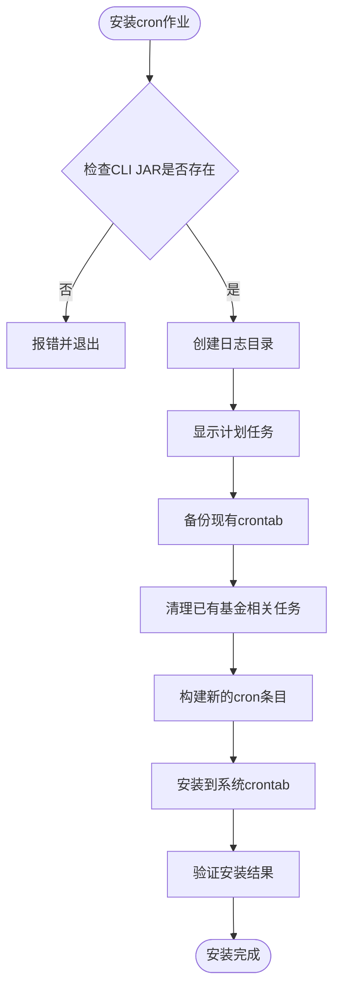

**图表来源**
- [install-cron.sh:12-82](file://scripts/install-cron.sh#L12-L82)

#### 计划任务配置

脚本定义了完整的交易日和每日任务计划：

- **交易日任务**:
  - 14:50 - A股估值快照 (`sync estimate`)
  - 19:30 - 净值同步 (`sync nav`)
  - 20:00 - 预测评估 (`sync evaluate`) [周一至周五]
  - 21:30 - 净值补充 (`sync nav`)
  - 23:00 - QDII估值快照 (`sync estimate --qdii`)

- **每日任务**:
  - 16:00 - 每日播报 (`dashboard broadcast --json`)

#### 自动化特性

- **智能备份**: 自动备份现有crontab，避免覆盖重要任务
- **重复清理**: 清理已有的基金相关cron任务，避免重复
- **日志管理**: 自动创建日志目录，统一输出到 `logs/cron.log`
- **验证机制**: 安装完成后自动显示当前crontab状态

### 工程搭建脚本

**新增** `setup-harness.sh` 脚本提供了完整的工程环境搭建能力：

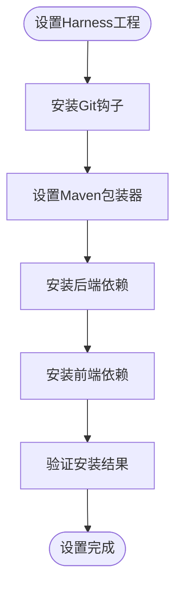

**图表来源**
- [setup-harness.sh:16-87](file://scripts/setup-harness.sh#L16-L87)

#### 依赖管理

脚本自动处理前后端依赖安装：

- **后端**: 通过Maven自动下载依赖
- **前端**: 自动安装Node.js依赖
- **代码检查**: 验证Checkstyle配置和CI配置

#### 开发环境准备

- **Git钩子**: 自动安装pre-commit钩子
- **Maven包装器**: 确保Maven版本一致性
- **开发指南**: 提供快速开始指导

### Git钩子脚本

**新增** `pre-commit.sh` 脚本提供了代码质量检查和架构约束验证：

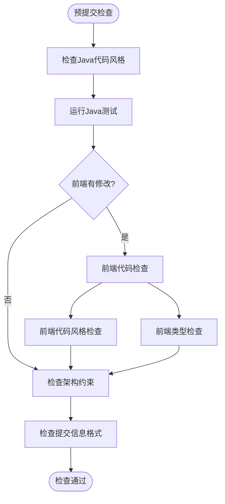

**图表来源**
- [pre-commit.sh:15-79](file://scripts/pre-commit.sh#L15-L79)

#### 质量保证

脚本包含多层次的质量检查：

- **Java代码风格**: 使用Checkstyle验证代码规范
- **单元测试**: 确保代码功能正确性
- **前端检查**: 对修改的前端代码进行lint和类型检查
- **架构约束**: 验证分层架构的正确性

#### 提交规范

- **提交信息格式**: 验证符合约定式提交规范
- **架构违规检测**: 防止Controller直接依赖Mapper等架构违规

**章节来源**
- [install-cron.sh:1-82](file://scripts/install-cron.sh#L1-L82)
- [setup-harness.sh:1-87](file://scripts/setup-harness.sh#L1-L87)
- [pre-commit.sh:1-79](file://scripts/pre-commit.sh#L1-L79)

## 依赖关系分析

命令行界面的依赖关系相对简单，主要依赖于 Spring Boot 和 Picocli 框架：

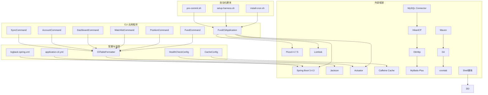

**图表来源**
- [pom.xml:87-97](file://pom.xml#L87-L97)
- [FundCliApplication.java:1-10](file://src/main/java/com/qoder/fund/cli/FundCliApplication.java#L1-L10)
- [install-cron.sh:1-82](file://scripts/install-cron.sh#L1-L82)
- [setup-harness.sh:1-87](file://scripts/setup-harness.sh#L1-L87)
- [pre-commit.sh:1-79](file://scripts/pre-commit.sh#L1-L79)

### 核心依赖配置

项目使用 Maven 管理依赖，核心依赖包括：

- **Picocli**: 命令行解析框架
- **Spring Boot**: 应用程序框架
- **Lombok**: 代码简化工具
- **Jackson**: JSON 处理库
- **Actuator**: 健康检查和监控
- **Caffeine**: 分布式缓存
- **MySQL Connector**: 数据库连接
- **HikariCP**: 连接池管理
- **OkHttp**: HTTP客户端
- **MyBatis-Plus**: ORM框架

**更新** 新增了Actuator和Caffeine缓存系统的集成，提供了完整的监控和缓存功能。同时，通过Maven插件支持CLI打包和自动化部署。

**章节来源**
- [pom.xml:87-97](file://pom.xml#L87-L97)

## 性能考虑

### 命令执行优化

CLI 工具采用了多项性能优化策略：

- **延迟加载**: 命令处理器按需加载，减少内存占用
- **批量处理**: 支持批量数据处理，提高处理效率
- **缓存优化**: 通过Spring Profile禁用不必要的缓存，提升CLI模式性能

### 数据库连接优化

**新增** 数据库连接验证和优化：

- 启动时进行数据库连接检查
- HikariCP连接池优化配置
- 连接泄漏检测和超时设置

### 日志级别优化

**新增** 通过application-cli.yml和logback-spring.xml实现精细化日志控制：

- CLI模式禁用详细日志输出
- 生产环境优化日志级别
- 异步日志输出提高性能
- 多级别日志文件分离

### 输出格式化优化

CliTableFormatter 通过以下方式优化性能：

- 条件格式化: 根据用户选择决定是否进行格式化处理
- 字符串缓冲: 使用StringBuilder提高字符串拼接性能
- 数值格式化: 预分配格式化结果，减少内存分配

### 并发处理

虽然 CLI 工具主要是单线程应用，但通过以下方式支持并发操作：

- 异步数据源: 支持多数据源并发访问
- 批处理优化: 批量查询和处理提升整体性能
- 缓存分层: 不同级别的缓存策略优化性能

### Cron作业性能

**新增** Cron作业安装脚本提供了性能优化：

- **任务调度**: 精确的时间调度，避免与其他任务冲突
- **日志管理**: 统一的日志输出，便于性能监控
- **资源隔离**: 每个任务独立执行，避免相互影响

## 故障排除指南

### 常见问题诊断

#### 命令执行失败

当命令执行失败时，CLI 工具会返回相应的错误码和错误信息：

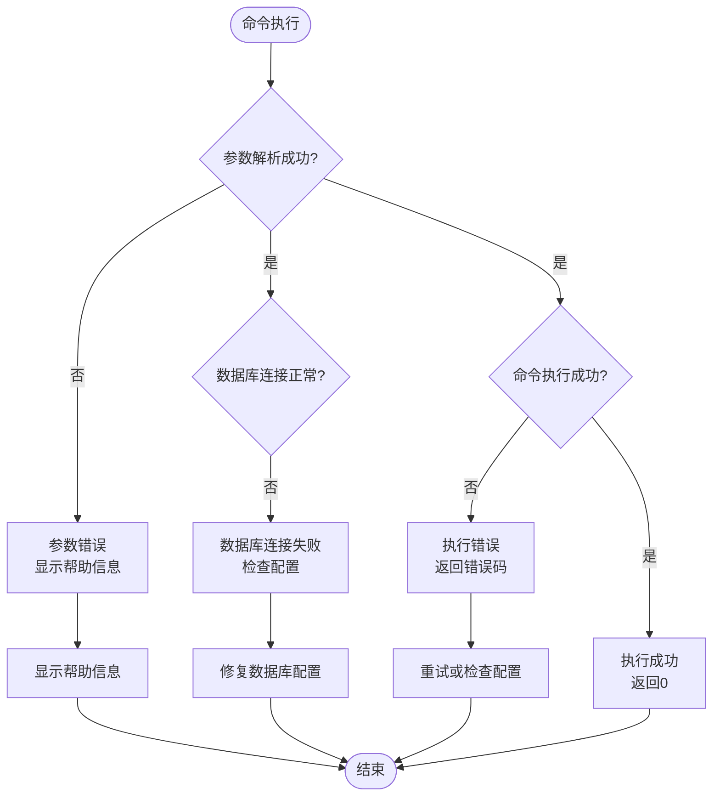

#### 数据库连接问题

**新增** 数据库连接问题的诊断和解决：

- **连接超时**: 检查网络连接和数据库服务状态
- **认证失败**: 验证DB_USERNAME和DB_PASSWORD环境变量
- **数据库不存在**: 确认fund_manager数据库已创建
- **连接池问题**: 检查HikariCP配置和最大连接数

#### 数据同步问题

数据同步过程中可能遇到的问题：

- **网络连接超时**: 检查网络连接和数据源可用性
- **数据源限制**: 遵循各数据源的API限制和频率控制
- **数据库连接问题**: 检查数据库连接配置和权限

### 健康检查

**新增** 通过Actuator进行健康检查：

```bash
# 检查应用健康状态
curl http://localhost:8080/actuator/health

# 检查数据库连接状态
curl http://localhost:8080/actuator/health/database

# 检查数据源状态
curl http://localhost:8080/actuator/health/datasource
```

### Cron作业故障排除

**新增** Cron作业安装和运行问题的诊断：

#### Cron安装问题

```bash
# 检查cron作业状态
crontab -l

# 查看cron日志
tail -f /var/log/cron.log

# 验证CLI JAR路径
ls -la target/fund-0.0.1-SNAPSHOT-cli.jar

# 检查日志目录
ls -la logs/
```

#### Cron作业执行问题

```bash
# 手动测试cron命令
java -jar target/fund-0.0.1-SNAPSHOT-cli.jar dashboard broadcast --json

# 检查数据库连接
java -jar target/fund-0.0.1-SNAPSHOT-cli.jar sync nav

# 查看详细日志
tail -f logs/cron.log
```

### 调试和日志

CLI 工具支持详细的日志输出，可以通过以下方式启用调试模式：

- **详细日志**: 在命令中添加 `--verbose` 参数
- **错误追踪**: 查看完整的异常堆栈信息
- **性能监控**: 监控命令执行时间和资源使用情况
- **日志级别**: 通过application-cli.yml调整日志详细程度

**章节来源**
- [FundCliApplication.java:85-130](file://src/main/java/com/qoder/fund/cli/FundCliApplication.java#L85-L130)
- [HealthCheckConfig.java:25-90](file://src/main/java/com/qoder/fund/config/HealthCheckConfig.java#L25-L90)
- [install-cron.sh:73-82](file://scripts/install-cron.sh#L73-L82)

## 结论

基金管家命令行界面是一个功能完整、架构清晰的现代化 CLI 工具。它成功地将复杂的基金数据管理功能封装为简洁易用的命令行接口，为用户提供了强大的数据查询、分析和管理能力。

**更新** 最新的更新显著增强了工具的可靠性和自动化能力，特别是新增的数据库连接验证、Spring Profile集成、日志级别优化、cron作业安装脚本和自动化部署脚本等功能。这些增强使得工具不仅适用于个人用户，也完全胜任企业级自动化场景的需求。

### 主要优势

1. **模块化设计**: 清晰的功能分组和职责分离
2. **灵活的输出格式**: 支持彩色输出和 JSON 格式
3. **丰富的命令选项**: 满足不同用户的需求
4. **性能优化**: 采用多种优化策略提升执行效率
5. **易于扩展**: 良好的架构设计便于功能扩展
6. **自动化友好**: 新增的广播功能专为定时任务设计
7. **可靠性增强**: 数据库连接验证和健康检查功能
8. **配置灵活性**: Spring Profile系统支持多环境配置
9. **工程化支持**: 完整的自动化部署和运维脚本
10. **质量保证**: Git钩子和代码检查机制

### 技术特色

- 基于 Spring Boot 的现代化框架
- 使用 Picocli 实现优雅的命令行解析
- 统一的输出格式化系统
- 完善的错误处理和调试支持
- **新增**: 专为外部 Agent 设计的广播功能
- **新增**: 数据库连接验证和健康检查
- **新增**: Spring Profile配置系统
- **新增**: 精细化日志级别控制
- **新增**: cron作业安装和管理系统
- **新增**: 完整的工程搭建和环境配置脚本
- **新增**: Git钩子和代码质量检查机制

该 CLI 工具为基金数据管理提供了一个强大而灵活的命令行解决方案，适合技术用户和自动化脚本集成使用。新增的广播功能特别适合以下场景：
- 定时任务播报
- 语音播报系统集成
- 监控告警通知
- 企业内部数据展示

**更新** 新增的cron作业安装脚本和自动化部署能力标志着CLI工具从单纯的命令行工具演进为包含自动化部署功能的综合工具平台。通过install-cron.sh脚本，用户可以轻松将Spring @Scheduled定时任务迁移到系统crontab，实现真正的自动化部署。配合setup-harness.sh和pre-commit.sh脚本，提供了完整的工程化开发体验。

新增的数据库连接验证和Spring Profile集成确保了CLI工具在各种部署环境下的稳定性和可靠性，为生产环境部署提供了坚实的技术基础。这些改进使得基金管家CLI工具不仅是一个优秀的命令行工具，更是一个完整的自动化运维平台，为现代DevOps实践提供了强有力的支持。