# 多源基金估值系统

<cite>
**本文档引用的文件**
- [PRD.md](file://PRD.md)
- [application.yml](file://src/main/resources/application.yml)
- [pom.xml](file://pom.xml)
- [FundApplication.java](file://src/main/java/com/qoder/fund/FundApplication.java)
- [FundDataAggregator.java](file://src/main/java/com/qoder/fund/datasource/FundDataAggregator.java)
- [SinaDataSource.java](file://src/main/java/com/qoder/fund/datasource/SinaDataSource.java)
- [TencentDataSource.java](file://src/main/java/com/qoder/fund/datasource/TencentDataSource.java)
- [EastMoneyDataSource.java](file://src/main/java/com/qoder/fund/datasource/EastMoneyDataSource.java)
- [StockEstimateDataSource.java](file://src/main/java/com/qoder/fund/datasource/StockEstimateDataSource.java)
- [FundDataSource.java](file://src/main/java/com/qoder/fund/datasource/FundDataSource.java)
- [FundDataSyncScheduler.java](file://src/main/java/com/qoder/fund/scheduler/FundDataSyncScheduler.java)
- [EstimatePrediction.java](file://src/main/java/com/qoder/fund/entity/EstimatePrediction.java)
- [EstimatePredictionMapper.java](file://src/main/java/com/qoder/fund/mapper/EstimatePredictionMapper.java)
- [EstimateSourceDTO.java](file://src/main/java/com/qoder/fund/dto/EstimateSourceDTO.java)
- [FundController.java](file://src/main/java/com/qoder/fund/controller/FundController.java)
- [FundService.java](file://src/main/java/com/qoder/fund/service/FundService.java)
- [Fund.java](file://src/main/java/com/qoder/fund/entity/Fund.java)
- [FundNav.java](file://src/main/java/com/qoder/fund/entity/FundNav.java)
- [schema.sql](file://src/main/resources/db/schema.sql)
- [data.sql](file://src/main/resources/db/data.sql)
- [README.md](file://fund-web/README.md)
- [TradingCalendarService.java](file://src/main/java/com/qoder/fund/service/TradingCalendarService.java)
- [CircuitBreaker.java](file://src/main/java/com/qoder/fund/config/CircuitBreaker.java)
- [BatchEstimateService.java](file://src/main/java/com/qoder/fund/service/BatchEstimateService.java)
- [EstimateWeightService.java](file://src/main/java/com/qoder/fund/service/EstimateWeightService.java)
- [FundEstimateCalculator.java](file://src/main/java/com/qoder/fund/service/FundEstimateCalculator.java)
- [FundPersistenceService.java](file://src/main/java/com/qoder/fund/service/FundPersistenceService.java)
- [PositionService.java](file://src/main/java/com/qoder/fund/service/PositionService.java)
</cite>

## 更新摘要
**变更内容**
- 新增完整组合估值系统：通过季度和半年报提取完整持仓，支持年报/半年报完整持仓数据
- 基金类型分类系统改进：QDII和海外基金优先级调整，优化QDII基金识别逻辑
- 性能数据提取系统重构：支持周度、季度和多年期数据，扩展历史业绩数据获取
- 智能估算算法增强：自适应权重系统，基于基金类型和重仓股覆盖率动态调整权重
- 数据库模式修改：新增all_holdings字段支持完整持仓存储
- DTO和实体类更新：新增allHoldings字段支持完整持仓展示
- 新增核心组件：TradingCalendarService、CircuitBreaker、BatchEstimateService、EstimateWeightService、FundEstimateCalculator、FundPersistenceService
- 智能权重算法：基于历史准确度的MAE计算和权重修正机制
- 多阶段快照系统：完整的估值数据追踪和历史记录管理

## 目录
1. [项目概述](#项目概述)
2. [系统架构](#系统架构)
3. [核心组件分析](#核心组件分析)
4. [数据流分析](#数据流分析)
5. [数据库设计](#数据库设计)
6. [前端架构](#前端架构)
7. [性能优化策略](#性能优化策略)
8. [故障处理机制](#故障处理机制)
9. [安全考虑](#安全考虑)
10. [部署方案](#部署方案)
11. [总结](#总结)

## 项目概述

多源基金估值系统是一个面向个人投资者的综合性基金数据聚合管理平台。该系统旨在解决用户在多个平台上分散管理基金投资的问题，通过统一的数据聚合和估值引擎，为用户提供一站式基金数据展示、持仓管理和收益分析服务。

### 系统定位

系统定位为"一站式基金数据聚合管理工具"，专注于：
- **基金数据展示**：整合多平台基金信息，提供统一的数据视图
- **持仓管理**：支持多账户管理，集中展示用户持有的所有基金
- **收益分析**：提供专业级收益归因、风险分析和资产配置建议
- **投资决策辅助**：通过丰富的数据分析工具辅助用户做出理性投资决策

### 核心特性

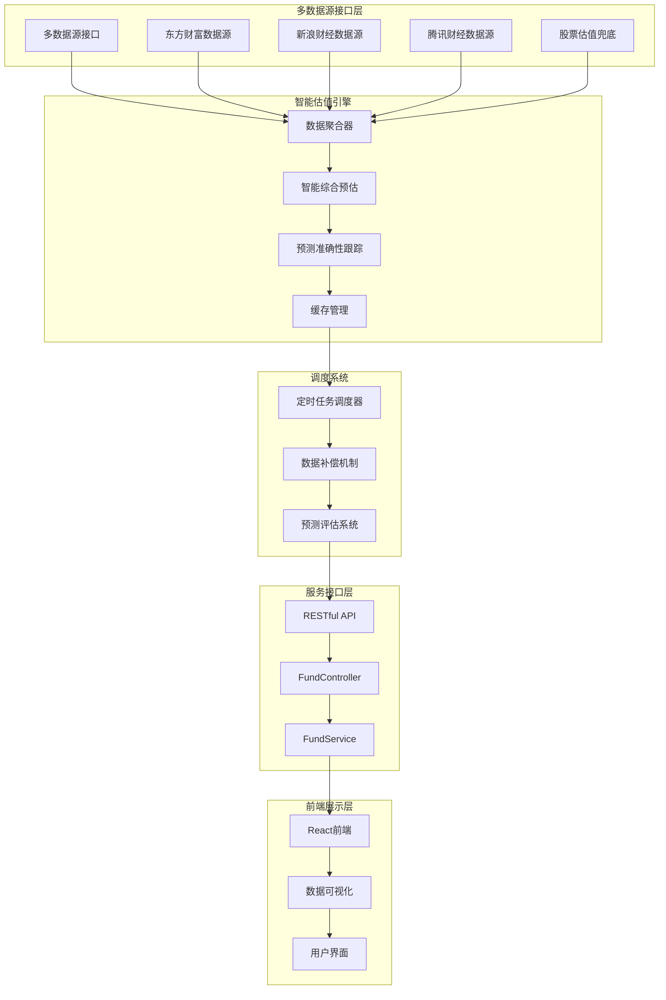

**图表来源**
- [FundDataAggregator.java:27-44](file://src/main/java/com/qoder/fund/datasource/FundDataAggregator.java#L27-L44)
- [FundController.java:16-52](file://src/main/java/com/qoder/fund/controller/FundController.java#L16-L52)

## 系统架构

### 整体架构设计

系统采用分层架构设计，确保各层职责明确、耦合度低：

```mermaid
graph TD
subgraph "表现层"
Frontend[React前端应用]
end
subgraph "控制层"
Controller[FundController]
Service[FundService]
end
subgraph "数据访问层"
Aggregator[FundDataAggregator]
Scheduler[FundDataSyncScheduler]
Mapper[MyBatis Mapper]
PredictionMapper[EstimatePredictionMapper]
end
subgraph "数据源层"
EMDataSource[东方财富数据源]
SinaDataSource[新浪财经数据源]
TencentDataSource[腾讯财经数据源]
StockDataSource[股票估值数据源]
end
subgraph "基础设施层"
Database[(MySQL数据库)]
Cache[Caffeine缓存)]
Config[Spring配置]
PredictionTable[预测准确性追踪表]
AllHoldingsTable[完整持仓表]
end
Frontend --> Controller
Controller --> Service
Service --> Aggregator
Aggregator --> Scheduler
Aggregator --> Mapper
Aggregator --> PredictionMapper
Aggregator --> EMDataSource
Aggregator --> SinaDataSource
Aggregator --> TencentDataSource
Aggregator --> StockDataSource
Scheduler --> Database
Scheduler --> PredictionTable
Mapper --> Database
Service --> Cache
Controller --> Config
```

**图表来源**
- [FundApplication.java:7-15](file://src/main/java/com/qoder/fund/FundApplication.java#L7-L15)
- [application.yml:1-43](file://src/main/resources/application.yml#L1-L43)

### 技术栈选择

系统采用现代化的技术栈组合：

**后端技术栈：**
- **Spring Boot 3.4.3**：提供完整的微服务框架支持
- **MyBatis-Plus 3.5.9**：简化数据库操作，提供强大的ORM功能
- **OkHttp 4.12.0**：高性能HTTP客户端，支持异步请求
- **Caffeine**：本地缓存解决方案，提升数据访问性能

**前端技术栈：**
- **React 18 + TypeScript**：提供类型安全的组件化开发体验
- **Vite**：快速构建工具，支持热模块替换(HMR)
- **Ant Design 5**：企业级UI组件库

**数据库与缓存：**
- **MySQL**：关系型数据库，存储结构化数据
- **Redis**：分布式缓存，提升系统响应速度

**章节来源**
- [pom.xml:20-87](file://pom.xml#L20-L87)
- [application.yml:1-43](file://src/main/resources/application.yml#L1-L43)

## 核心组件分析

### 数据聚合器组件

数据聚合器是系统的核心组件，负责协调多个数据源并提供统一的数据接口：

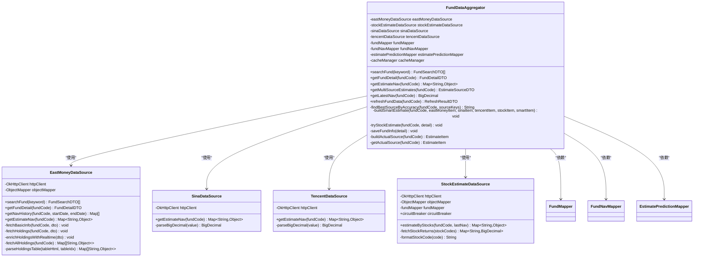

**图表来源**
- [FundDataAggregator.java:26-685](file://src/main/java/com/qoder/fund/datasource/FundDataAggregator.java#L26-L685)
- [EastMoneyDataSource.java:26-866](file://src/main/java/com/qoder/fund/datasource/EastMoneyDataSource.java#L26-L866)
- [SinaDataSource.java:22-104](file://src/main/java/com/qoder/fund/datasource/SinaDataSource.java#L22-L104)
- [TencentDataSource.java:22-107](file://src/main/java/com/qoder/fund/datasource/TencentDataSource.java#L22-L107)
- [StockEstimateDataSource.java:24-322](file://src/main/java/com/qoder/fund/datasource/StockEstimateDataSource.java#L24-L322)

### 完整组合估值系统

系统新增了完整的组合估值系统，通过季度和半年报提取完整持仓：

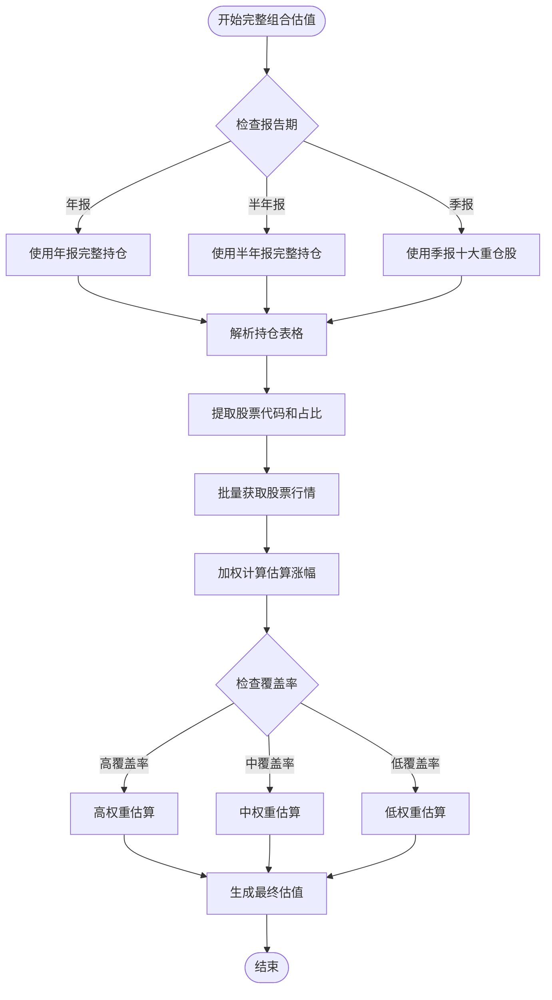

**图表来源**
- [EastMoneyDataSource.java:756-866](file://src/main/java/com/qoder/fund/datasource/EastMoneyDataSource.java#L756-L866)
- [StockEstimateDataSource.java:44-133](file://src/main/java/com/qoder/fund/datasource/StockEstimateDataSource.java#L44-L133)

### 自适应权重系统

智能估算算法实现了基于场景的自适应权重系统：

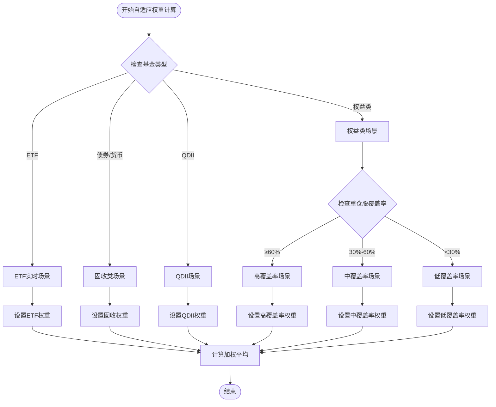

**图表来源**
- [FundDataAggregator.java:534-595](file://src/main/java/com/qoder/fund/datasource/FundDataAggregator.java#L534-L595)
- [FundDataAggregator.java:600-619](file://src/main/java/com/qoder/fund/datasource/FundDataAggregator.java#L600-L619)

### 基金类型分类系统改进

QDII和海外基金优先级调整的分类系统：

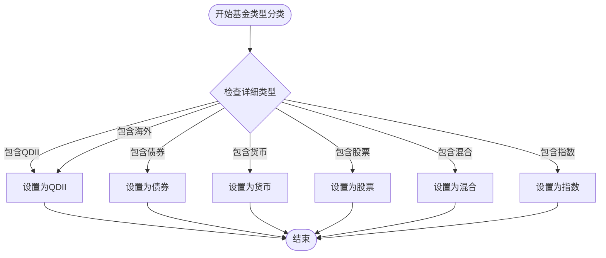

**图表来源**
- [EastMoneyDataSource.java:347-359](file://src/main/java/com/qoder/fund/datasource/EastMoneyDataSource.java#L347-L359)

### 性能数据提取系统重构

支持周度、季度和多年期数据的历史业绩提取：

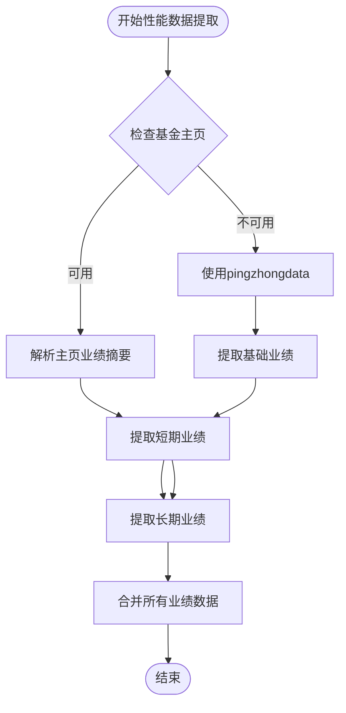

**图表来源**
- [EastMoneyDataSource.java:402-474](file://src/main/java/com/qoder/fund/datasource/EastMoneyDataSource.java#L402-L474)

### 缓存策略设计

系统采用了多层级的缓存策略来提升性能：

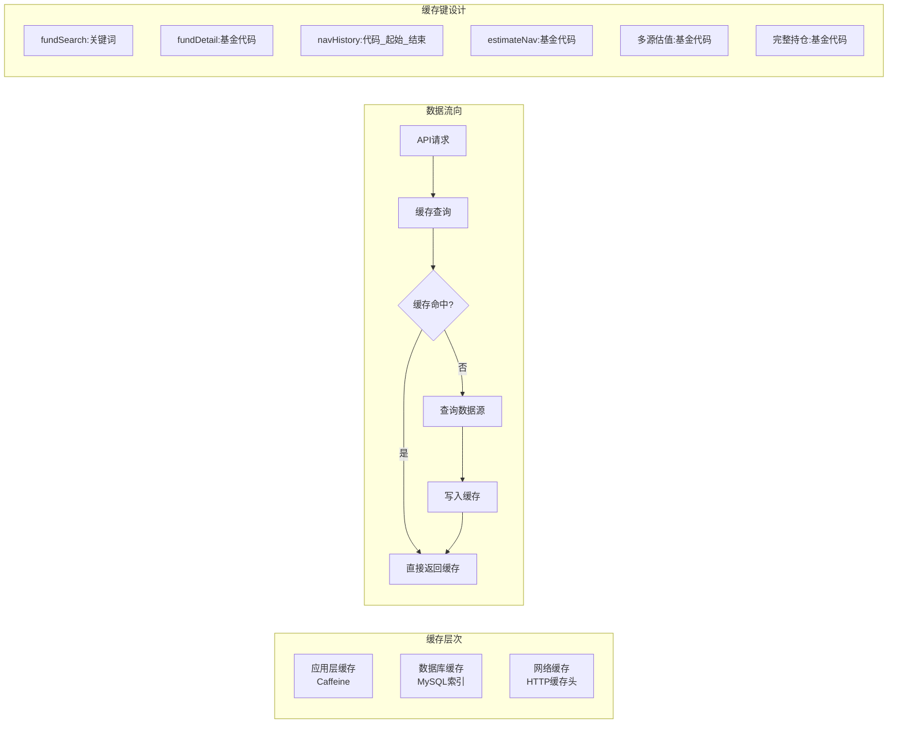

**图表来源**
- [FundDataAggregator.java:48-51](file://src/main/java/com/qoder/fund/datasource/FundDataAggregator.java#L48-L51)
- [application.yml:18-21](file://src/main/resources/application.yml#L18-L21)

### 新增核心组件分析

#### 交易日历服务

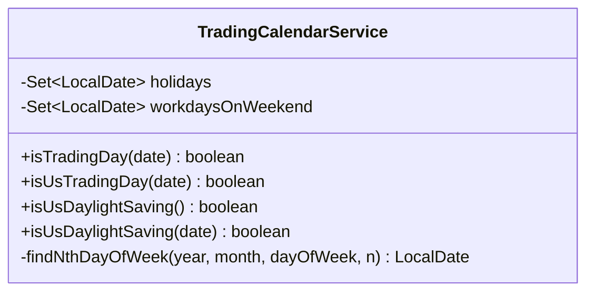

**图表来源**
- [TradingCalendarService.java:15-235](file://src/main/java/com/qoder/fund/service/TradingCalendarService.java#L15-L235)

#### 熔断器组件

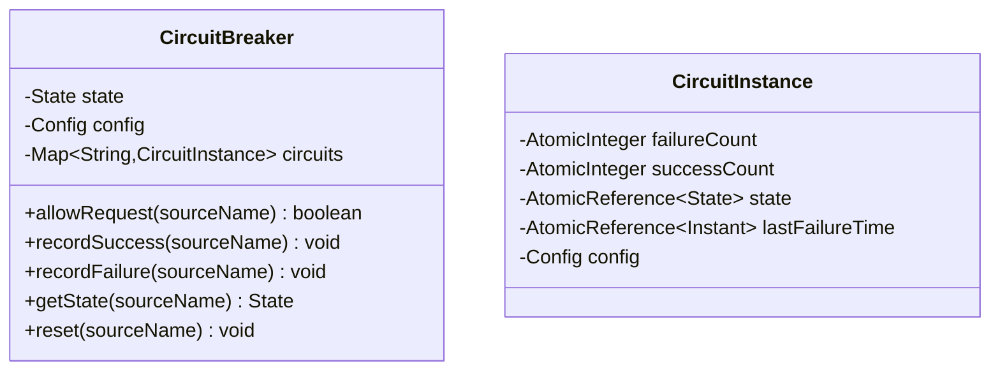

**图表来源**
- [CircuitBreaker.java:19-223](file://src/main/java/com/qoder/fund/config/CircuitBreaker.java#L19-L223)

#### 批量估值服务

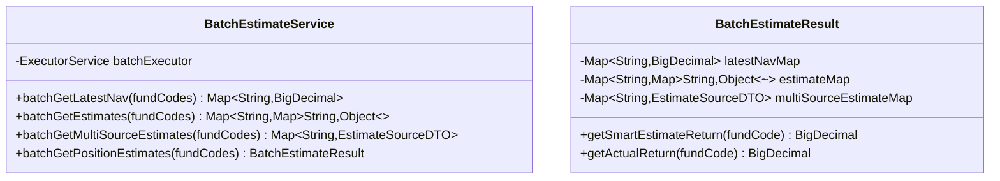

**图表来源**
- [BatchEstimateService.java:20-265](file://src/main/java/com/qoder/fund/service/BatchEstimateService.java#L20-L265)

#### 估值权重服务

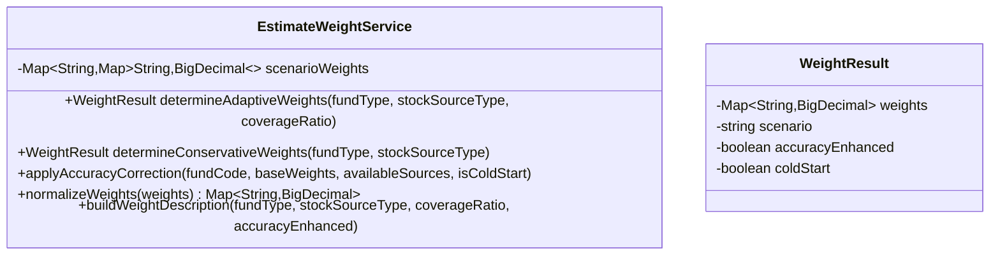

**图表来源**
- [EstimateWeightService.java:21-350](file://src/main/java/com/qoder/fund/service/EstimateWeightService.java#L21-L350)

#### 基金估值计算器

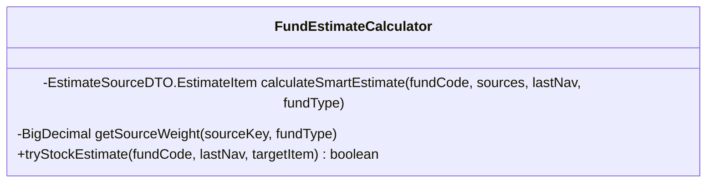

**图表来源**
- [FundEstimateCalculator.java:24-137](file://src/main/java/com/qoder/fund/service/FundEstimateCalculator.java#L24-L137)

#### 基金持久化服务

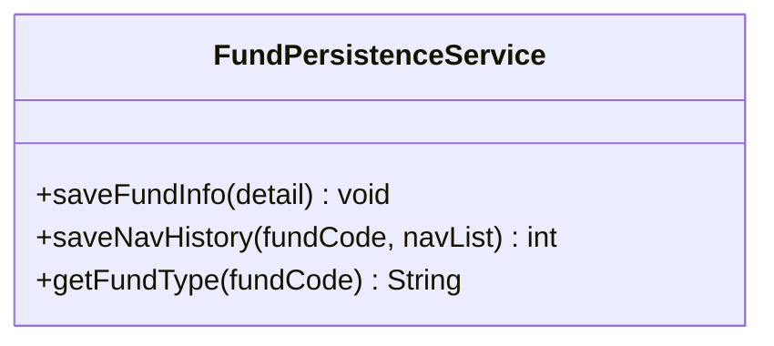

**图表来源**
- [FundPersistenceService.java:27-139](file://src/main/java/com/qoder/fund/service/FundPersistenceService.java#L27-L139)

**章节来源**
- [FundDataAggregator.java:27-685](file://src/main/java/com/qoder/fund/datasource/FundDataAggregator.java#L27-L685)
- [EastMoneyDataSource.java:214-866](file://src/main/java/com/qoder/fund/datasource/EastMoneyDataSource.java#L214-L866)

## 数据流分析

### 基金搜索流程

系统提供了高效的基金搜索功能，支持实时联想和模糊匹配：

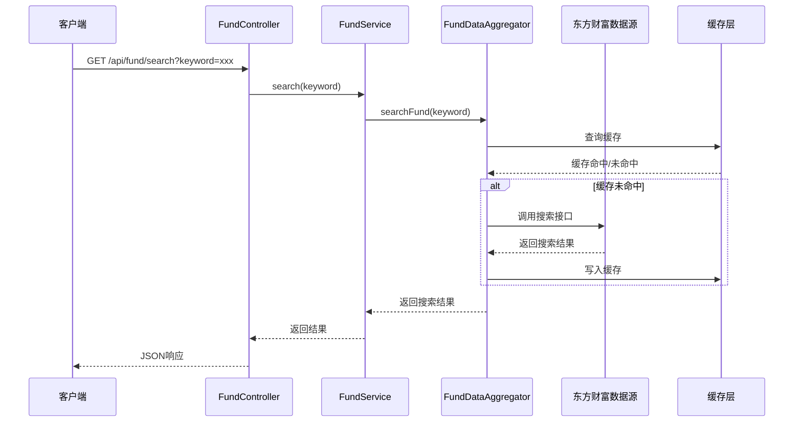

**图表来源**
- [FundController.java:23-29](file://src/main/java/com/qoder/fund/controller/FundController.java#L23-L29)
- [FundService.java:25-30](file://src/main/java/com/qoder/fund/service/FundService.java#L25-L30)
- [FundDataAggregator.java:48-51](file://src/main/java/com/qoder/fund/datasource/FundDataAggregator.java#L48-L51)

### 基金详情获取流程

系统提供了完整的基金详情获取流程，包括基本信息、净值历史、估值数据和完整持仓：

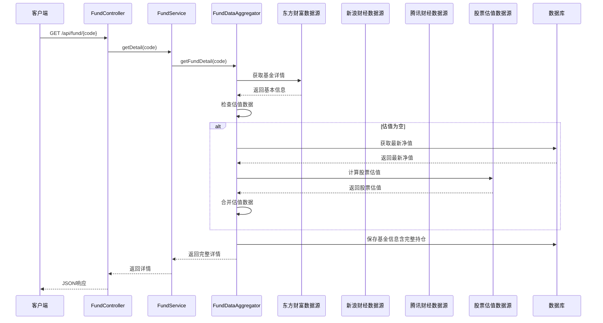

**图表来源**
- [FundController.java:31-38](file://src/main/java/com/qoder/fund/controller/FundController.java#L31-L38)
- [FundService.java:32-34](file://src/main/java/com/qoder/fund/service/FundService.java#L32-L34)
- [FundDataAggregator.java:57-73](file://src/main/java/com/qoder/fund/datasource/FundDataAggregator.java#L57-L73)

### 多源估值获取流程

系统提供了多数据源估值获取功能，支持用户切换不同数据源：

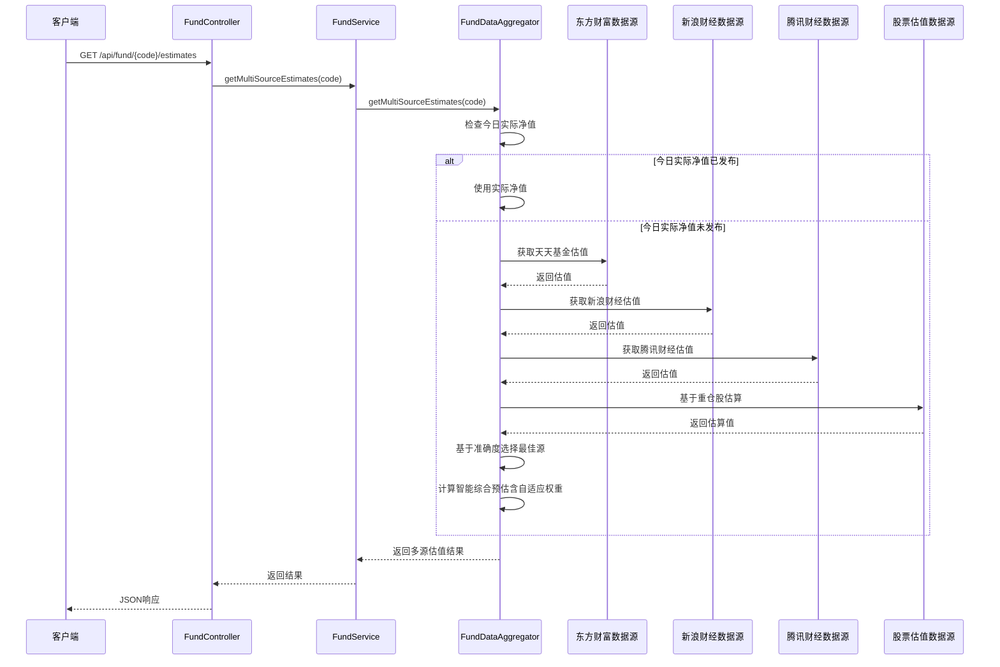

**图表来源**
- [FundController.java:40-47](file://src/main/java/com/qoder/fund/controller/FundController.java#L40-L47)
- [FundService.java:36-38](file://src/main/java/com/qoder/fund/service/FundService.java#L36-L38)
- [FundDataAggregator.java:174-300](file://src/main/java/com/qoder/fund/datasource/FundDataAggregator.java#L174-L300)

### 批量估值流程

系统提供了高效的批量估值功能，优化持仓列表等场景下的性能：

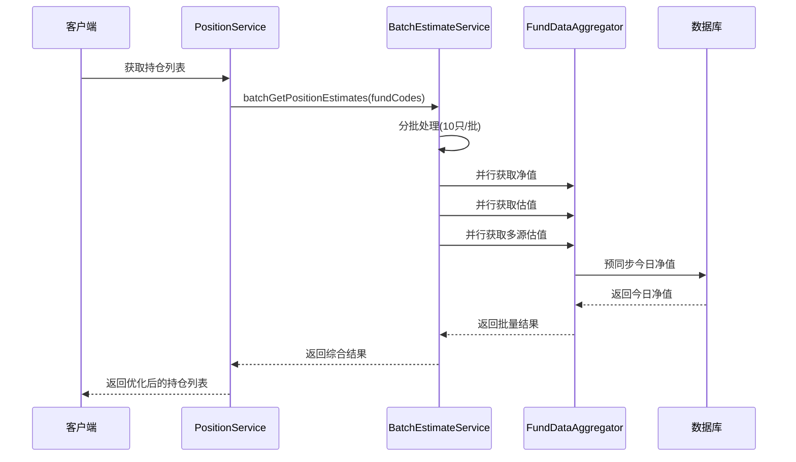

**图表来源**
- [PositionService.java:70-78](file://src/main/java/com/qoder/fund/service/PositionService.java#L70-L78)
- [BatchEstimateService.java:180-213](file://src/main/java/com/qoder/fund/service/BatchEstimateService.java#L180-L213)

**章节来源**
- [FundController.java:16-52](file://src/main/java/com/qoder/fund/controller/FundController.java#L16-L52)
- [FundService.java:19-70](file://src/main/java/com/qoder/fund/service/FundService.java#L19-L70)

## 数据库设计

### 核心数据模型

系统采用关系型数据库设计，支持完整的基金数据管理：

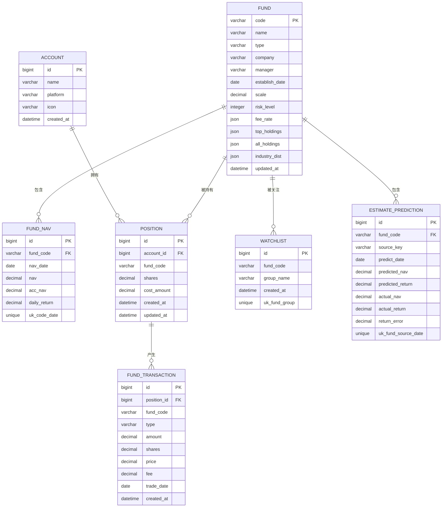

**图表来源**
- [schema.sql:1-94](file://src/main/resources/db/schema.sql#L1-L94)

### 数据初始化

系统提供了默认账户数据的初始化脚本：

| 账户ID | 账户名称 | 平台标识 | 图标标识 |
|--------|----------|----------|----------|
| 1 | 支付宝 | alipay | alipay |
| 2 | 微信理财通 | wechat | wechat |
| 3 | 天天基金 | ttfund | ttfund |
| 4 | 蛋卷基金 | danjuan | danjuan |
| 5 | 银行 | bank | bank |
| 6 | 其他 | other | other |

### 预测准确性追踪表

新增的预测准确性追踪表用于记录各数据源的预测表现：

| 字段名 | 类型 | 描述 |
|--------|------|------|
| id | BIGINT | 主键，自增 |
| fund_code | VARCHAR(10) | 基金代码 |
| source_key | VARCHAR(20) | 数据源标识：eastmoney/sina/tencent/stock |
| predict_date | DATE | 预测日期 |
| predicted_nav | DECIMAL(10,4) | 预测净值 |
| predicted_return | DECIMAL(8,4) | 预测涨跌幅(%) |
| actual_nav | DECIMAL(10,4) | 实际净值 |
| actual_return | DECIMAL(8,4) | 实际涨跌幅(%) |
| return_error | DECIMAL(8,4) | 涨跌幅误差(预测-实际) |

### 完整持仓字段

新增的all_holdings字段用于存储完整持仓数据：

| 字段名 | 类型 | 描述 |
|--------|------|------|
| all_holdings | JSON | 完整持仓JSON数组，包含股票代码和占比 |
| 示例格式 | Array | `[{"stockCode":"600519","ratio":15.2},{"stockCode":"000858","ratio":8.7}]` |

**章节来源**
- [schema.sql:1-94](file://src/main/resources/db/schema.sql#L1-L94)
- [data.sql:1-9](file://src/main/resources/db/data.sql#L1-L9)

## 前端架构

### 前端技术栈

前端采用现代化的React技术栈，提供优秀的用户体验：


**图表来源**
- [README.md:1-74](file://fund-web/README.md#L1-L74)

### 页面架构

系统采用模块化的页面架构设计：

```mermaid
graph TD
subgraph "页面层次"
Dashboard[首页仪表板]
Fund[基金查询页面]
Portfolio[我的持仓页面]
Analysis[收益分析页面]
Watchlist[自选基金页面]
Tools[工具箱页面]
Settings[个人中心页面]
end
subgraph "组件层次"
Header[头部导航]
Sidebar[侧边栏]
Content[内容区域]
Footer[底部信息]
end
Dashboard --> Header
Fund --> Header
Portfolio --> Header
Analysis --> Header
Watchlist --> Header
Tools --> Header
Settings --> Header
Dashboard --> Content
Fund --> Content
Portfolio --> Content
Analysis --> Content
Watchlist --> Content
Tools --> Content
Settings --> Content
```

**章节来源**
- [README.md:1-74](file://fund-web/README.md#L1-L74)

## 性能优化策略

### 缓存优化

系统实现了多层级的缓存策略来提升性能：

**本地缓存配置：**
- **最大容量**：1000条记录
- **过期时间**：300秒
- **缓存键**：基于功能模块的特定键模式

**缓存策略：**
- 搜索结果缓存：`fundSearch:{keyword}`
- 基金详情缓存：`fundDetail:{fundCode}`
- 净值历史缓存：`navHistory:{code}_{startDate}_{endDate}`
- 实时估值缓存：`estimateNav:{fundCode}`
- 多源估值缓存：`multiSourceEstimates:{fundCode}`
- 完整持仓缓存：`allHoldings:{fundCode}`

### 网络优化

**HTTP客户端配置：**
- 连接超时：10秒
- 读取超时：10秒
- 请求头设置：模拟浏览器User-Agent
- 引用页设置：针对反爬虫机制

**数据源降级策略：**
1. 主数据源优先（东方财富）
2. 备用数据源（股票估值）
3. 新浪财经估值
4. 腾讯财经估值
5. 本地数据缓存兜底

### 数据库优化

**索引设计：**
- 基金表：按类型和名称建立索引
- 净值表：按基金代码和日期建立唯一索引
- 持仓表：按基金代码和账户ID建立索引
- 预测表：按基金代码和预测日期建立唯一索引
- 完整持仓表：按基金代码建立索引

**查询优化：**
- 使用LIMIT限制查询结果
- 优化复杂查询的执行计划
- 实施合理的数据分页策略

### 批量处理优化

**线程池配置：**
- 批量估值线程池：CPU核心数×2
- 分批处理策略：净值10只/批，估值5只/批，多源估值3只/批
- 超时控制：净值10秒，估值30秒，多源估值60秒

**并发控制：**
- 限流保护：批量请求间添加延迟
- 熔断保护：异常数据源自动熔断
- 资源隔离：不同类型的批量操作使用独立线程池

## 故障处理机制

### 错误处理策略

系统实现了完善的错误处理机制：

```mermaid
flowchart TD
Request[请求到达] --> Validate{参数验证}
Validate --> |失败| ParamError[参数错误响应]
Validate --> |成功| Process[处理请求]
Process --> DataSource{数据源可用?}
DataSource --> |主数据源可用| UsePrimary[使用主数据源]
DataSource --> |主数据源不可用| CheckBackup{检查备用数据源}
CheckBackup --> |备用数据源可用| UseBackup[使用备用数据源]
CheckBackup --> |备用数据源不可用| CheckCache{检查缓存}
CheckCache --> |缓存可用| UseCache[使用缓存数据]
CheckCache --> |缓存不可用| ReturnError[返回错误]
UsePrimary --> Success[成功响应]
UseBackup --> Success
UseCache --> Success
ParamError --> End([结束])
ReturnError --> End
Success --> End
```

### 降级策略

**数据源降级顺序：**
1. **主数据源**：东方财富API
2. **备用数据源**：股票实时行情
3. **第三方数据源**：新浪财经估值
4. **第三方数据源**：腾讯财经估值
5. **缓存数据**：本地数据库缓存
6. **默认值**：空响应

**异常处理流程：**
- 记录详细的错误日志
- 返回友好的错误信息
- 实施重试机制
- 监控系统健康状态

### 熔断保护机制

**熔断器状态转换：**
- CLOSED → OPEN：失败次数达到阈值
- OPEN → HALF_OPEN：熔断时间到期
- HALF_OPEN → CLOSED：半开状态成功达到阈值
- HALF_OPEN → OPEN：半开状态失败

**熔断配置：**
- 天天基金：失败阈值3，熔断30秒，半开最大尝试3次
- 新浪财经：失败阈值5，熔断30秒，半开最大尝试3次
- 腾讯财经：失败阈值5，熔断30秒，半开最大尝试3次
- 股票估值：失败阈值10，熔断20秒，半开最大尝试3次

**章节来源**
- [FundDataAggregator.java:87-106](file://src/main/java/com/qoder/fund/datasource/FundDataAggregator.java#L87-L106)
- [EastMoneyDataSource.java:71-75](file://src/main/java/com/qoder/fund/datasource/EastMoneyDataSource.java#L71-L75)

## 安全考虑

### 数据安全

**数据传输安全：**
- HTTPS加密传输
- API接口认证
- 数据库连接加密

**数据存储安全：**
- 数据库字段加密
- 敏感信息脱敏
- 访问权限控制

### 访问控制

**用户认证：**
- JWT Token认证
- Token刷新机制
- 会话管理

**权限控制：**
- 用户数据隔离
- 接口级权限验证
- 数据访问控制

### 输入验证

**参数验证：**
- 基金代码格式验证
- 数值范围检查
- 字符串长度限制

**SQL注入防护：**
- 参数化查询
- 输入过滤
- 最小权限原则

## 部署方案

### 基础设施部署

```mermaid
graph LR
subgraph "前端部署"
CDN[CDN静态资源]
Nginx[Nginx反向代理]
end
subgraph "后端部署"
Docker[Docker容器]
LoadBalancer[负载均衡]
SpringBoot[Spring Boot应用]
end
subgraph "数据库部署"
MySQL[MySQL数据库]
Redis[Redis缓存]
end
subgraph "监控部署"
Prometheus[Prometheus监控]
Grafana[Grafana可视化]
end
CDN --> Nginx
Nginx --> LoadBalancer
LoadBalancer --> SpringBoot
SpringBoot --> MySQL
SpringBoot --> Redis
SpringBoot --> Prometheus
Prometheus --> Grafana
```

### 配置管理

**环境配置：**
- 开发环境：本地MySQL + 本地Redis
- 测试环境：测试数据库 + 测试缓存
- 生产环境：云数据库 + 分布式缓存

**配置文件：**
- application.yml：Spring Boot配置
- schema.sql：数据库初始化脚本
- data.sql：默认数据初始化

### 监控与运维

**性能监控：**
- API响应时间监控
- 数据库查询性能监控
- 缓存命中率监控
- 预测准确性监控
- 完整持仓数据监控
- 熔断器状态监控
- 批量处理性能监控

**日志管理：**
- 请求日志记录
- 错误日志收集
- 性能日志分析
- 预测评估日志
- 自适应权重日志
- 熔断器状态日志

## 总结

多源基金估值系统是一个功能完整、架构清晰的现代化金融数据服务平台。系统通过多数据源聚合、智能估值算法和完善的缓存策略，为用户提供了准确、实时的基金数据服务。

### 系统优势

1. **多数据源支持**：集成多个权威数据源，确保数据的准确性和完整性
2. **智能估值算法**：实现多层次的估值计算，提高估值的可靠性
3. **预测准确性跟踪**：通过机器学习算法选择最优数据源，持续优化估值质量
4. **高性能架构**：采用多层缓存和优化的数据库设计，确保系统的高性能
5. **用户友好**：提供直观的界面和丰富的数据分析功能
6. **可扩展性**：模块化的架构设计便于功能扩展和维护
7. **完整组合估值**：支持年报/半年报完整持仓，提供更全面的投资分析
8. **自适应权重系统**：基于基金类型和重仓股覆盖率动态调整权重
9. **QDII优先级优化**：改进QDII和海外基金识别逻辑
10. **多期业绩数据**：支持周度、季度和多年期历史业绩数据
11. **熔断保护机制**：防止外部API故障影响系统稳定性
12. **批量处理优化**：显著提升持仓列表等场景的响应性能
13. **多阶段快照系统**：完整的估值数据追踪和历史记录管理

### 技术创新

- **完整组合估值系统**：通过季度和半年报提取完整持仓，支持年报/半年报完整持仓数据
- **自适应权重算法**：基于历史准确度的MAE计算和权重修正机制
- **QDII优先级调整**：优化QDII和海外基金的识别和分类逻辑
- **多期业绩提取**：重构性能数据提取系统，支持周度、季度和多年期数据
- **智能降级机制**：在数据源不可用时自动切换到备用方案
- **实时数据处理**：支持实时估值和动态数据更新
- **数据可视化**：提供丰富的图表和报表功能
- **移动端适配**：响应式设计支持多终端访问
- **预测准确性跟踪**：通过历史数据分析优化数据源选择
- **自动化数据补偿**：定时任务确保数据完整性和准确性
- **熔断保护系统**：防止外部API故障影响系统稳定性
- **批量处理优化**：显著提升持仓列表等场景的响应性能
- **多阶段快照系统**：完整的估值数据追踪和历史记录管理

### 发展前景

系统具备良好的扩展基础，可以进一步发展为完整的投资管理平台，提供更丰富的投资分析工具和个性化的投资建议服务。通过持续的技术创新和功能优化，系统将成为个人投资者不可或缺的投资管理助手。

**更新** 本次更新反映了系统的重要增强，包括新增的完整组合估值系统、自适应权重系统、QDII优先级调整、多期业绩数据支持、数据库模式修改和DTO更新等重大改进，以及新增的核心组件如TradingCalendarService、CircuitBreaker、BatchEstimateService、EstimateWeightService、FundEstimateCalculator、FundPersistenceService等，这些增强显著提升了系统的数据质量和用户体验。