# 多源基金估值系统

<cite>
**本文档引用的文件**
- [PRD.md](file://PRD.md)
- [application.yml](file://src/main/resources/application.yml)
- [pom.xml](file://pom.xml)
- [FundApplication.java](file://src/main/java/com/qoder/fund/FundApplication.java)
- [FundDataAggregator.java](file://src/main/java/com/qoder/fund/datasource/FundDataAggregator.java)
- [EastMoneyDataSource.java](file://src/main/java/com/qoder/fund/datasource/EastMoneyDataSource.java)
- [SinaDataSource.java](file://src/main/java/com/qoder/fund/datasource/SinaDataSource.java)
- [TencentDataSource.java](file://src/main/java/com/qoder/fund/datasource/TencentDataSource.java)
- [StockEstimateDataSource.java](file://src/main/java/com/qoder/fund/datasource/StockEstimateDataSource.java)
- [FundDataSource.java](file://src/main/java/com/qoder/fund/datasource/FundDataSource.java)
- [FundDataSyncScheduler.java](file://src/main/java/com/qoder/fund/scheduler/FundDataSyncScheduler.java)
- [TradingCalendarService.java](file://src/main/java/com/qoder/fund/service/TradingCalendarService.java)
- [EstimatePrediction.java](file://src/main/java/com/qoder/fund/entity/EstimatePrediction.java)
- [EstimatePredictionMapper.java](file://src/main/java/com/qoder/fund/mapper/EstimatePredictionMapper.java)
- [EstimateSourceDTO.java](file://src/main/java/com/qoder/fund/dto/EstimateSourceDTO.java)
- [FundController.java](file://src/main/java/com/qoder/fund/controller/FundController.java)
- [FundService.java](file://src/main/java/com/qoder/fund/service/FundService.java)
- [Fund.java](file://src/main/java/com/qoder/fund/entity/Fund.java)
- [FundNav.java](file://src/main/java/com/qoder/fund/entity/FundNav.java)
- [schema.sql](file://src/main/resources/db/schema.sql)
- [data.sql](file://src/main/resources/db/data.sql)
- [README.md](file://fund-web/README.md)
- [package.json](file://fund-web/package.json)
- [App.tsx](file://fund-web/src/App.tsx)
- [index.css](file://fund-web/src/index.css)
- [CircuitBreaker.java](file://src/main/java/com/qoder/fund/config/CircuitBreaker.java)
- [HealthCheckConfig.java](file://src/main/java/com/qoder/fund/config/HealthCheckConfig.java)
- [EstimateWeightService.java](file://src/main/java/com/qoder/fund/service/EstimateWeightService.java)
- [FundEstimateCalculator.java](file://src/main/java/com/qoder/fund/service/FundEstimateCalculator.java)
- [FundPersistenceService.java](file://src/main/java/com/qoder/fund/service/FundPersistenceService.java)
</cite>

## 更新摘要
**变更内容**
- 新增多阶段快照和评估框架，实现A股/QDII分批快照和多批次评估
- 智能场景权重算法升级，支持冷启动保护机制和历史准确度修正
- 香港股票支持增强，优化港股通标的识别和实时行情获取
- 熔断器模式（CircuitBreaker）实现外部数据源的故障容错保护
- HealthCheckConfig提供健康检查监控，集成熔断器状态监控
- 完善预测准确性追踪系统，支持历史准确度数据修正权重
- 增强系统稳定性，通过熔断器机制防止雪崩效应
- 完善健康检查体系，支持多维度系统状态监控
- **新增交易日历服务**：实现完整的A股和美股交易日判断、节假日计算、周末调休调整和夏令时检测
- **增强调度系统**：集成交易日历服务，优化QDII快照时机和准确性评估
- **改进QDII处理逻辑**：基于美股夏令时检测优化QDII基金估值时机

## 目录
1. [项目概述](#项目概述)
2. [系统架构](#系统架构)
3. [核心组件分析](#核心组件分析)
4. [数据流分析](#数据流分析)
5. [数据库设计](#数据库设计)
6. [前端架构](#前端架构)
7. [性能优化策略](#性能优化策略)
8. [故障处理机制](#故障处理机制)
9. [安全考虑](#安全考虑)
10. [部署方案](#部署方案)
11. [总结](#总结)

## 项目概述

多源基金估值系统是一个面向个人投资者的综合性基金数据聚合管理平台。该系统旨在解决用户在多个平台上分散管理基金投资的问题，通过统一的数据聚合和估值引擎，为用户提供一站式基金数据展示、持仓管理和收益分析服务。

### 系统定位

系统定位为"一站式基金数据聚合管理工具"，专注于：
- **基金数据展示**：整合多平台基金信息，提供统一的数据视图
- **持仓管理**：支持多账户管理，集中展示用户持有的所有基金
- **收益分析**：提供专业级收益归因、风险分析和资产配置建议
- **投资决策辅助**：通过丰富的数据分析工具辅助用户做出理性投资决策

### 核心特性

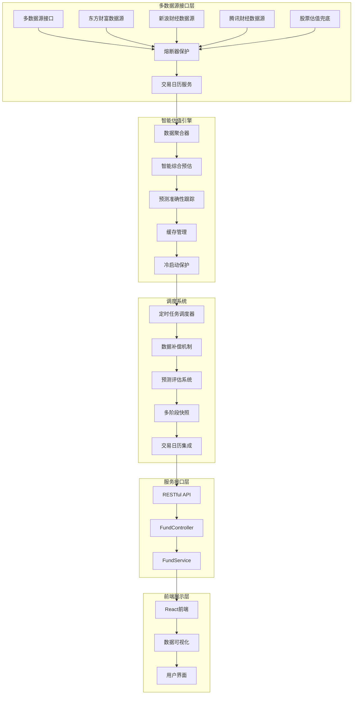

**图表来源**
- [FundDataAggregator.java:27-44](file://src/main/java/com/qoder/fund/datasource/FundDataAggregator.java#L27-L44)
- [FundController.java:16-52](file://src/main/java/com/qoder/fund/controller/FundController.java#L16-L52)

## 系统架构

### 整体架构设计

系统采用分层架构设计，确保各层职责明确、耦合度低：

```mermaid
graph TD
subgraph "表现层"
Frontend[React前端应用]
end
subgraph "控制层"
Controller[FundController]
Service[FundService]
end
subgraph "数据访问层"
Aggregator[FundDataAggregator]
Scheduler[FundDataSyncScheduler]
Calendar[TradingCalendarService]
Mapper[MyBatis Mapper]
PredictionMapper[EstimatePredictionMapper]
WeightService[EstimateWeightService]
EstimateCalculator[FundEstimateCalculator]
PersistenceService[FundPersistenceService]
end
subgraph "数据源层"
EMDataSource[东方财富数据源]
SinaDataSource[新浪财经数据源]
TencentDataSource[腾讯财经数据源]
StockDataSource[股票估值数据源]
CircuitBreaker[熔断器保护]
end
subgraph "基础设施层"
Database[(MySQL数据库)]
Cache[Caffeine缓存)]
Config[Spring配置]
HealthCheck[健康检查]
PredictionTable[预测准确性追踪表]
AllHoldingsTable[完整持仓表]
WeightTable[权重配置表]
end
Frontend --> Controller
Controller --> Service
Service --> Aggregator
Aggregator --> Scheduler
Aggregator --> Calendar
Aggregator --> Mapper
Aggregator --> PredictionMapper
Aggregator --> WeightService
Aggregator --> EstimateCalculator
Aggregator --> PersistenceService
Aggregator --> EMDataSource
Aggregator --> SinaDataSource
Aggregator --> TencentDataSource
Aggregator --> StockDataSource
Aggregator --> CircuitBreaker
Scheduler --> Database
Scheduler --> PredictionTable
Calendar --> Database
Mapper --> Database
Service --> Cache
Controller --> Config
Controller --> HealthCheck
```

**图表来源**
- [FundApplication.java:7-15](file://src/main/java/com/qoder/fund/FundApplication.java#L7-L15)
- [application.yml:1-68](file://src/main/resources/application.yml#L1-L68)

### 技术栈选择

系统采用现代化的技术栈组合：

**后端技术栈：**
- **Spring Boot 3.4.3**：提供完整的微服务框架支持
- **MyBatis-Plus 3.5.9**：简化数据库操作，提供强大的ORM功能
- **OkHttp 4.12.0**：高性能HTTP客户端，支持异步请求
- **Caffeine**：本地缓存解决方案，提升数据访问性能
- **Spring Boot Actuator**：提供健康检查和监控能力

**前端技术栈：**
- **React 19 + TypeScript**：提供类型安全的组件化开发体验
- **Vite**：快速构建工具，支持热模块替换(HMR)
- **Ant Design 6**：企业级UI组件库

**数据库与缓存：**
- **MySQL**：关系型数据库，存储结构化数据
- **Redis**：分布式缓存，提升系统响应速度

**章节来源**
- [pom.xml:20-87](file://pom.xml#L20-L87)
- [application.yml:1-68](file://src/main/resources/application.yml#L1-L68)

## 核心组件分析

### 交易日历服务

系统新增了完整的交易日历服务，支持中国A股和美国市场的节假日计算、周末调休调整和夏令时检测：

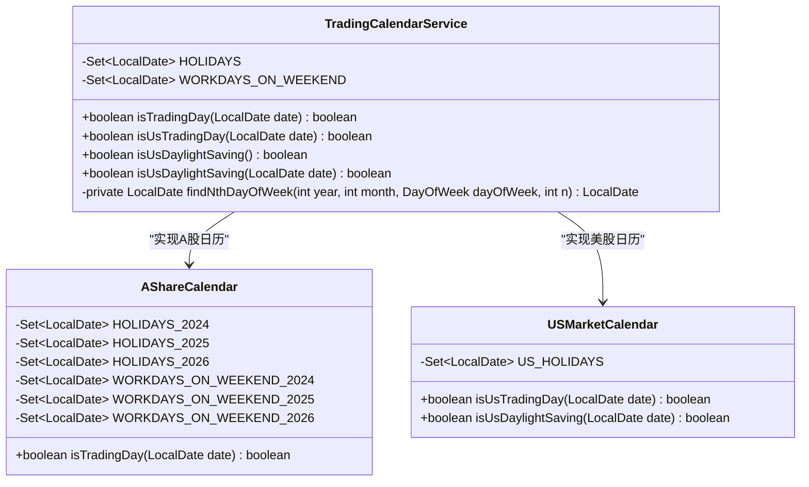

**图表来源**
- [TradingCalendarService.java:14-234](file://src/main/java/com/qoder/fund/service/TradingCalendarService.java#L14-L234)

### 多阶段快照和评估框架

系统新增了完整的多阶段快照和评估框架，支持A股/QDII分批处理和多批次评估：

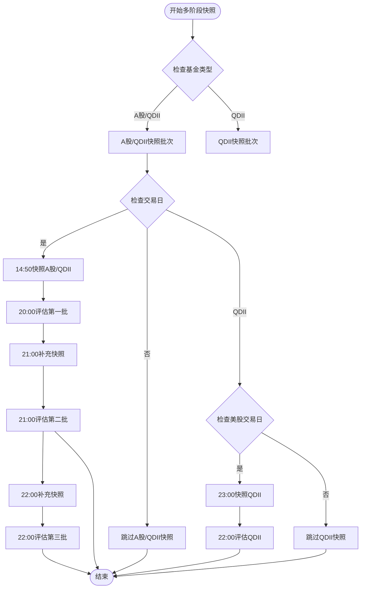

**图表来源**
- [FundDataSyncScheduler.java:416-552](file://src/main/java/com/qoder/fund/scheduler/FundDataSyncScheduler.java#L416-L552)

### 智能场景权重算法

智能权重算法实现了基于场景的自适应权重系统，包含冷启动保护机制：

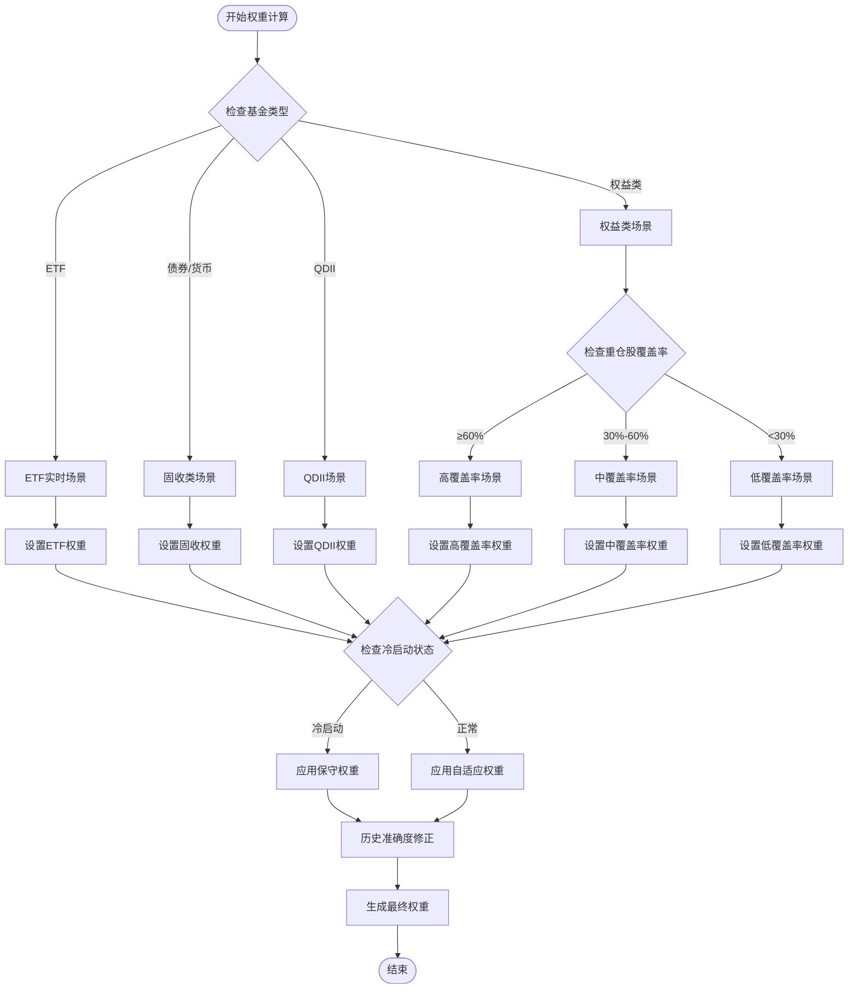

**图表来源**
- [EstimateWeightService.java:89-182](file://src/main/java/com/qoder/fund/service/EstimateWeightService.java#L89-L182)
- [FundDataAggregator.java:520-586](file://src/main/java/com/qoder/fund/datasource/FundDataAggregator.java#L520-L586)

### 冷启动保护机制

系统实现了新基金的冷启动保护机制，确保早期数据的可靠性：

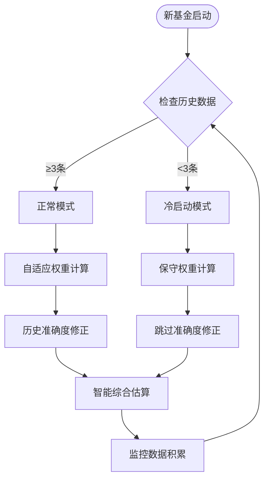

**图表来源**
- [EstimateWeightService.java:138-182](file://src/main/java/com/qoder/fund/service/EstimateWeightService.java#L138-L182)
- [FundDataAggregator.java:520-557](file://src/main/java/com/qoder/fund/datasource/FundDataAggregator.java#L520-L557)

### 香港股票支持增强

系统增强了对香港股票的支持，优化了港股通标的识别和实时行情获取：

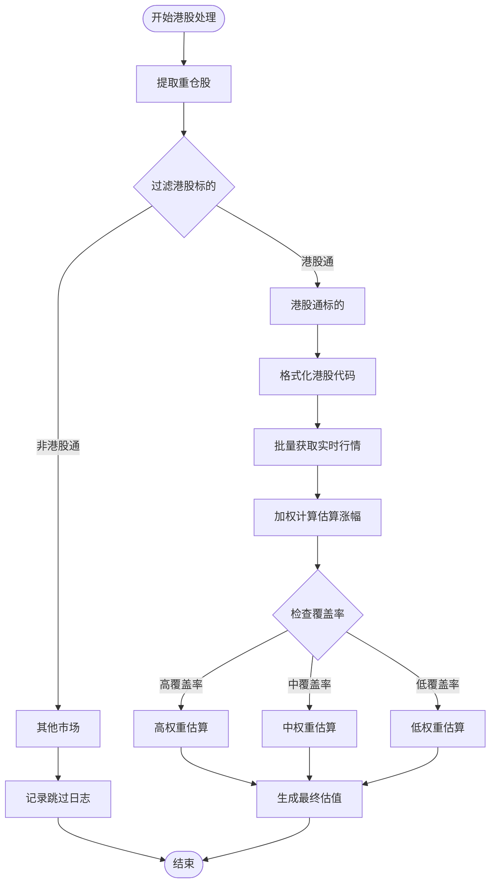

**图表来源**
- [StockEstimateDataSource.java:98-174](file://src/main/java/com/qoder/fund/datasource/StockEstimateDataSource.java#L98-L174)
- [StockEstimateDataSource.java:319-361](file://src/main/java/com/qoder/fund/datasource/StockEstimateDataSource.java#L319-L361)

### 熔断器保护组件

系统新增了熔断器模式，用于外部数据源的故障容错保护：

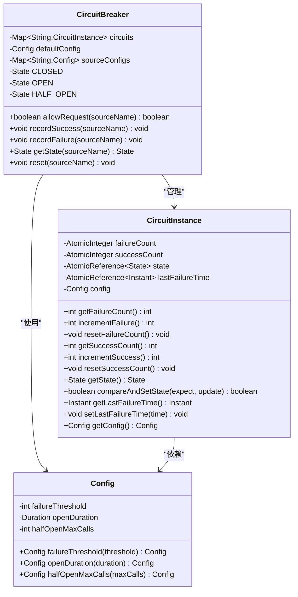

**图表来源**
- [CircuitBreaker.java:19-222](file://src/main/java/com/qoder/fund/config/CircuitBreaker.java#L19-L222)

### 健康检查配置组件

HealthCheckConfig提供系统健康检查监控：

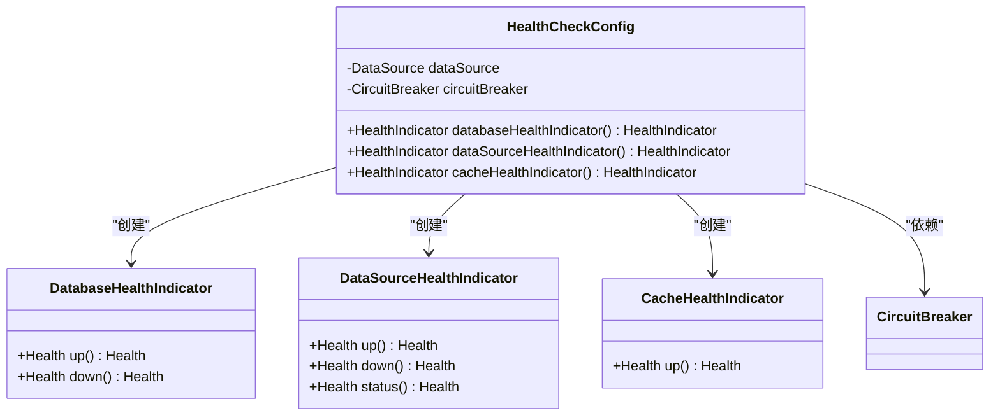

**图表来源**
- [HealthCheckConfig.java:20-105](file://src/main/java/com/qoder/fund/config/HealthCheckConfig.java#L20-L105)

### 数据聚合器组件

数据聚合器是系统的核心组件，负责协调多个数据源并提供统一的数据接口：

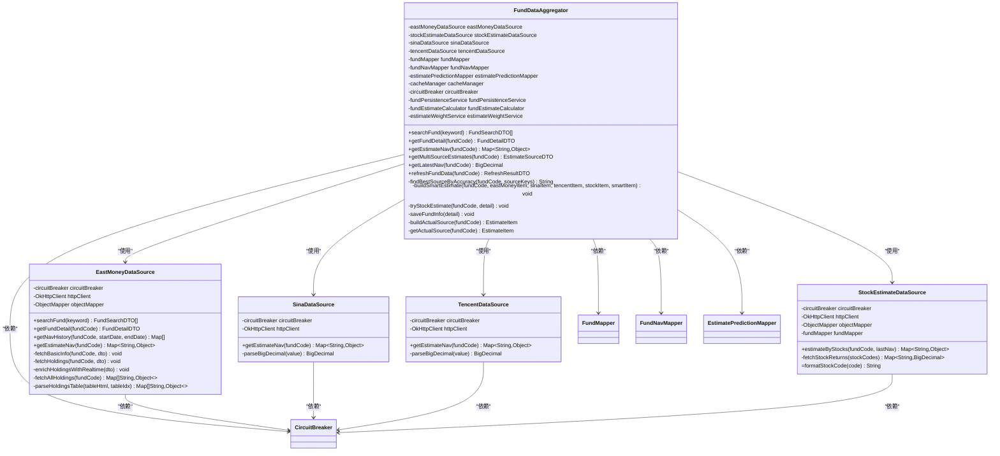

**图表来源**
- [FundDataAggregator.java:26-787](file://src/main/java/com/qoder/fund/datasource/FundDataAggregator.java#L26-L787)
- [EastMoneyDataSource.java:26-880](file://src/main/java/com/qoder/fund/datasource/EastMoneyDataSource.java#L26-L880)
- [SinaDataSource.java:22-104](file://src/main/java/com/qoder/fund/datasource/SinaDataSource.java#L22-L104)
- [TencentDataSource.java:22-107](file://src/main/java/com/qoder/fund/datasource/TencentDataSource.java#L22-L107)
- [StockEstimateDataSource.java:24-322](file://src/main/java/com/qoder/fund/datasource/StockEstimateDataSource.java#L24-L322)

### 预测准确性追踪系统

系统新增了预测准确性追踪表，支持历史准确度数据修正权重：

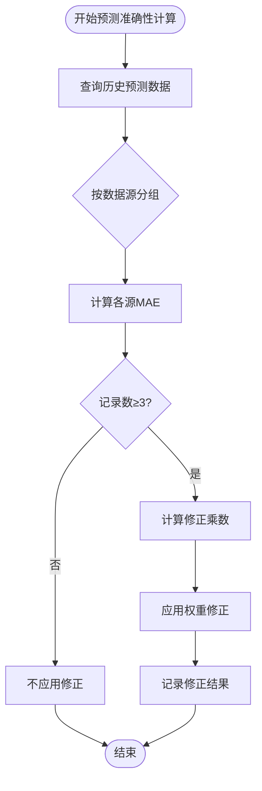

**图表来源**
- [FundDataAggregator.java:621-676](file://src/main/java/com/qoder/fund/datasource/FundDataAggregator.java#L621-L676)

### 缓存策略设计

系统采用了多层级的缓存策略来提升性能：

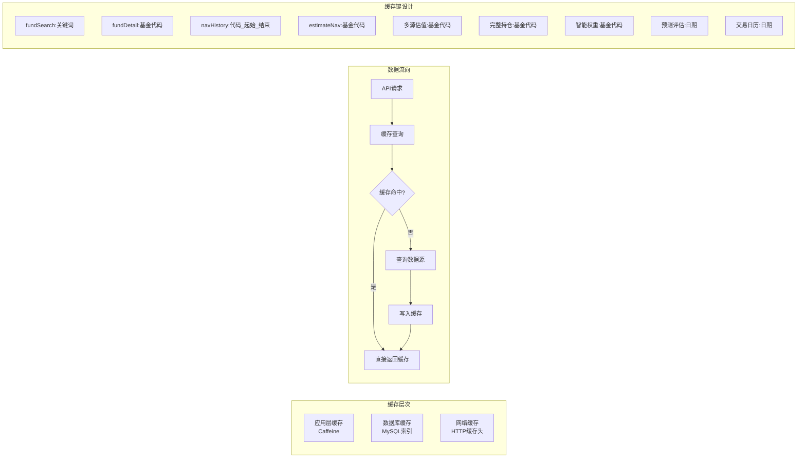

**图表来源**
- [FundDataAggregator.java:48-51](file://src/main/java/com/qoder/fund/datasource/FundDataAggregator.java#L48-L51)
- [application.yml:18-21](file://src/main/resources/application.yml#L18-L21)

**章节来源**
- [FundDataAggregator.java:27-787](file://src/main/java/com/qoder/fund/datasource/FundDataAggregator.java#L27-L787)
- [EastMoneyDataSource.java:214-880](file://src/main/java/com/qoder/fund/datasource/EastMoneyDataSource.java#L214-L880)

## 数据流分析

### 基金搜索流程

系统提供了高效的基金搜索功能，支持实时联想和模糊匹配：

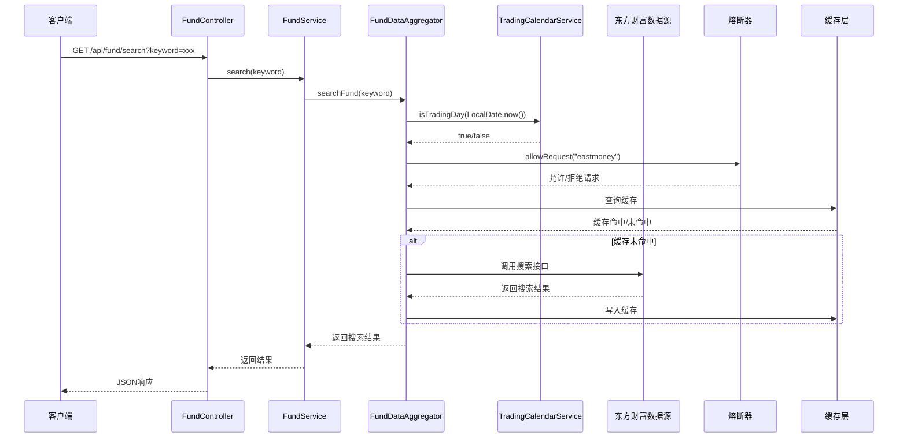

**图表来源**
- [FundController.java:23-29](file://src/main/java/com/qoder/fund/controller/FundController.java#L23-L29)
- [FundService.java:25-30](file://src/main/java/com/qoder/fund/service/FundService.java#L25-L30)
- [FundDataAggregator.java:48-51](file://src/main/java/com/qoder/fund/datasource/FundDataAggregator.java#L48-L51)

### 基金详情获取流程

系统提供了完整的基金详情获取流程，包括基本信息、净值历史、估值数据和完整持仓：

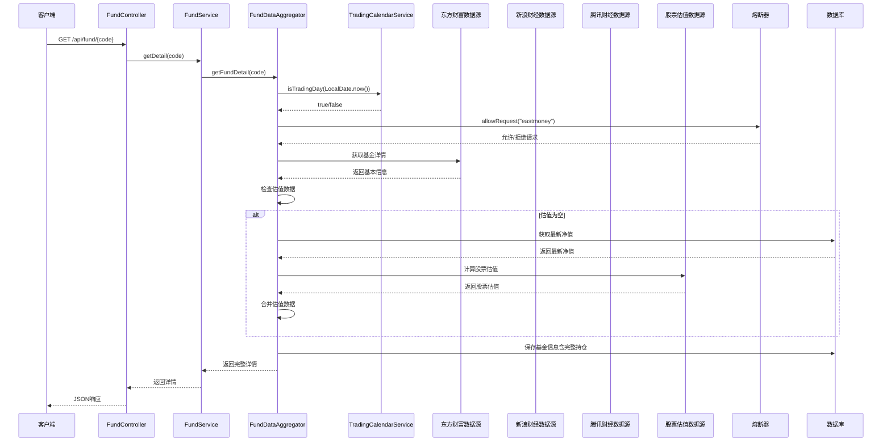

**图表来源**
- [FundController.java:31-38](file://src/main/java/com/qoder/fund/controller/FundController.java#L31-L38)
- [FundService.java:32-34](file://src/main/java/com/qoder/fund/service/FundService.java#L32-L34)
- [FundDataAggregator.java:57-73](file://src/main/java/com/qoder/fund/datasource/FundDataAggregator.java#L57-L73)

### 多源估值获取流程

系统提供了多数据源估值获取功能，支持用户切换不同数据源：

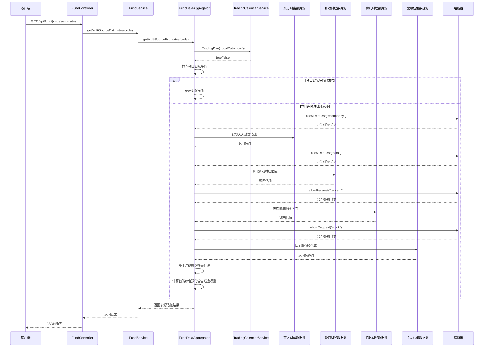

**图表来源**
- [FundController.java:40-47](file://src/main/java/com/qoder/fund/controller/FundController.java#L40-L47)
- [FundService.java:36-38](file://src/main/java/com/qoder/fund/service/FundService.java#L36-L38)
- [FundDataAggregator.java:174-304](file://src/main/java/com/qoder/fund/datasource/FundDataAggregator.java#L174-L304)

### QDII延迟净值处理流程

系统新增了QDII等净值延迟发布基金的特殊处理：

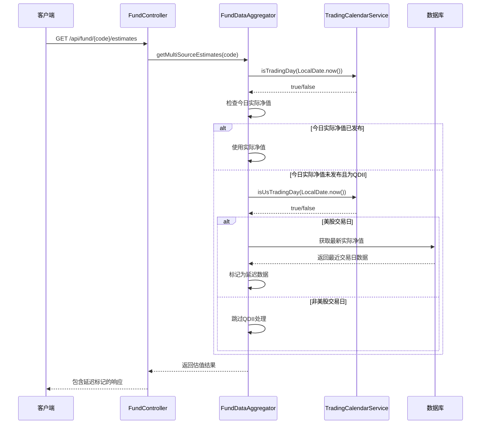

**图表来源**
- [FundDataAggregator.java:189-194](file://src/main/java/com/qoder/fund/datasource/FundDataAggregator.java#L189-L194)
- [FundDataAggregator.java:464-489](file://src/main/java/com/qoder/fund/datasource/FundDataAggregator.java#L464-L489)

### 熔断器保护流程

系统新增了熔断器保护机制，防止外部数据源故障影响系统稳定性：

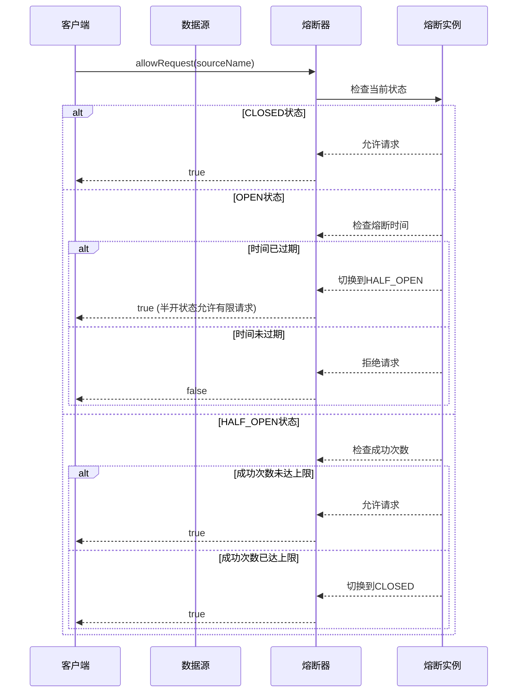

**图表来源**
- [CircuitBreaker.java:129-159](file://src/main/java/com/qoder/fund/config/CircuitBreaker.java#L129-L159)
- [CircuitBreaker.java:184-201](file://src/main/java/com/qoder/fund/config/CircuitBreaker.java#L184-L201)

### 交易日历服务流程

系统新增了交易日历服务，支持A股和美股的交易日判断：

```mermaid
sequenceDiagram
participant Scheduler as 调度器
participant Calendar as 交易日历服务
participant AShare as A股日历
participant USMarket as 美股日历
Scheduler->>Calendar : isTradingDay(LocalDate.now())
Calendar->>AShare : 检查A股节假日
AShare-->>Calendar : true/false
alt A股交易日
Calendar->>Calendar : isUsTradingDay(LocalDate.now())
Calendar->>USMarket : 检查美股节假日
USMarket-->>Calendar : true/false
alt 美股交易日
Calendar->>Calendar : isUsDaylightSaving(LocalDate.now())
Calendar-->>Scheduler : true/false
else 非A股交易日
Calendar-->>Scheduler : false
end
```

**图表来源**
- [TradingCalendarService.java:145-192](file://src/main/java/com/qoder/fund/service/TradingCalendarService.java#L145-L192)
- [FundDataSyncScheduler.java:416-552](file://src/main/java/com/qoder/fund/scheduler/FundDataSyncScheduler.java#L416-L552)

**章节来源**
- [FundController.java:16-52](file://src/main/java/com/qoder/fund/controller/FundController.java#L16-L52)
- [FundService.java:19-70](file://src/main/java/com/qoder/fund/service/FundService.java#L19-L70)

## 数据库设计

### 核心数据模型

系统采用关系型数据库设计，支持完整的基金数据管理：

```mermaid
erDiagram
FUND {
varchar code PK
varchar name
varchar type
varchar company
varchar manager
date establish_date
decimal scale
integer risk_level
json fee_rate
json top_holdings
json all_holdings
json industry_dist
datetime updated_at
}
FUND_NAV {
bigint id PK
varchar fund_code FK
date nav_date
decimal nav
decimal acc_nav
decimal daily_return
unique uk_code_date
}
ACCOUNT {
bigint id PK
varchar name
varchar platform
varchar icon
datetime created_at
}
POSITION {
bigint id PK
bigint account_id FK
varchar fund_code
decimal shares
decimal cost_amount
datetime created_at
datetime updated_at
}
FUND_TRANSACTION {
bigint id PK
bigint position_id FK
varchar fund_code
varchar type
decimal amount
decimal shares
decimal price
decimal fee
date trade_date
datetime created_at
}
WATCHLIST {
bigint id PK
varchar fund_code
varchar group_name
datetime created_at
unique uk_fund_group
}
ESTIMATE_PREDICTION {
bigint id PK
varchar fund_code FK
varchar source_key
date predict_date
decimal predicted_nav
decimal predicted_return
decimal actual_nav
decimal actual_return
decimal return_error
unique uk_fund_source_date
}
FUND ||--o{ FUND_NAV : "包含"
FUND ||--o{ ESTIMATE_PREDICTION : "包含"
ACCOUNT ||--o{ POSITION : "拥有"
POSITION ||--o{ FUND_TRANSACTION : "产生"
FUND ||--o{ WATCHLIST : "被关注"
```

**图表来源**
- [schema.sql:1-94](file://src/main/resources/db/schema.sql#L1-L94)

### 数据初始化

系统提供了默认账户数据的初始化脚本：

| 账户ID | 账户名称 | 平台标识 | 图标标识 |
|--------|----------|----------|----------|
| 1 | 支付宝 | alipay | alipay |
| 2 | 微信理财通 | wechat | wechat |
| 3 | 天天基金 | ttfund | ttfund |
| 4 | 蛋卷基金 | danjuan | danjuan |
| 5 | 银行 | bank | bank |
| 6 | 其他 | other | other |

### 预测准确性追踪表

新增的预测准确性追踪表用于记录各数据源的预测表现：

| 字段名 | 类型 | 描述 |
|--------|------|------|
| id | BIGINT | 主键，自增 |
| fund_code | VARCHAR(10) | 基金代码 |
| source_key | VARCHAR(20) | 数据源标识：eastmoney/sina/tencent/stock |
| predict_date | DATE | 预测日期 |
| predicted_nav | DECIMAL(10,4) | 预测净值 |
| predicted_return | DECIMAL(8,4) | 预测涨跌幅(%) |
| actual_nav | DECIMAL(10,4) | 实际净值 |
| actual_return | DECIMAL(8,4) | 实际涨跌幅(%) |
| return_error | DECIMAL(8,4) | 涨跌幅误差(预测-实际) |

### 完整持仓字段

新增的all_holdings字段用于存储完整持仓数据：

| 字段名 | 类型 | 描述 |
|--------|------|------|
| all_holdings | JSON | 完整持仓JSON数组，包含股票代码和占比 |
| 示例格式 | Array | `[{"stockCode":"600519","ratio":15.2},{"stockCode":"000858","ratio":8.7}]` |

### 权重配置表

新增的权重配置表用于存储场景权重配置：

| 字段名 | 类型 | 描述 |
|--------|------|------|
| scenario | VARCHAR(20) | 场景名称：ETF实时/固收类/QDII/权益高覆盖等 |
| weights | JSON | 权重配置JSON，包含各数据源权重 |
| created_at | DATETIME | 创建时间 |

**章节来源**
- [schema.sql:1-94](file://src/main/resources/db/schema.sql#L1-L94)
- [data.sql:1-9](file://src/main/resources/db/data.sql#L1-L9)

## 前端架构

### 前端技术栈

前端采用现代化的React技术栈，提供优秀的用户体验：

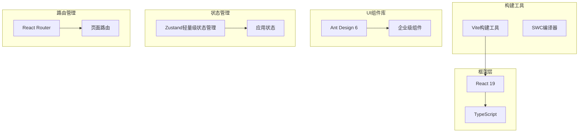

**图表来源**
- [package.json:12-38](file://fund-web/package.json#L12-L38)

### 页面架构

系统采用模块化的页面架构设计：

```mermaid
graph TD
subgraph "页面层次"
Dashboard[首页仪表板]
Fund[基金查询页面]
Portfolio[我的持仓页面]
Analysis[收益分析页面]
Watchlist[自选基金页面]
Tools[工具箱页面]
Settings[个人中心页面]
end
subgraph "组件层次"
Header[头部导航]
Sidebar[侧边栏]
Content[内容区域]
Footer[底部信息]
end
Dashboard --> Header
Fund --> Header
Portfolio --> Header
Analysis --> Header
Watchlist --> Header
Tools --> Header
Settings --> Header
Dashboard --> Content
Fund --> Content
Portfolio --> Content
Analysis --> Content
Watchlist --> Content
Tools --> Content
Settings --> Content
```

**章节来源**
- [App.tsx:44-65](file://fund-web/src/App.tsx#L44-L65)

## 性能优化策略

### 缓存优化

系统实现了多层级的缓存策略来提升性能：

**本地缓存配置：**
- **最大容量**：1000条记录
- **过期时间**：300秒
- **缓存键**：基于功能模块的特定键模式

**缓存策略：**
- 搜索结果缓存：`fundSearch:{keyword}`
- 基金详情缓存：`fundDetail:{fundCode}`
- 净值历史缓存：`navHistory:{code}_{startDate}_{endDate}`
- 实时估值缓存：`estimateNav:{fundCode}`
- 多源估值缓存：`multiSourceEstimates:{fundCode}`
- 完整持仓缓存：`allHoldings:{fundCode}`
- 智能权重缓存：`smartWeights:{fundCode}`
- 预测评估缓存：`predictionEval:{date}`
- **交易日历缓存**：`tradingCalendar:{date}`

### 网络优化

**HTTP客户端配置：**
- 连接超时：10秒
- 读取超时：10秒
- 请求头设置：模拟浏览器User-Agent
- 引用页设置：针对反爬虫机制

**数据源降级策略：**
1. **熔断器检查**：首先检查熔断器状态，熔断时跳过请求
2. **主数据源优先**（东方财富）
3. **备用数据源**：股票实时行情
4. **第三方数据源**（新浪财经估值）
5. **第三方数据源**（腾讯财经估值）
6. **缓存数据**：本地数据库缓存
7. **默认值**：空响应

### 数据库优化

**索引设计：**
- 基金表：按类型和名称建立索引
- 净值表：按基金代码和日期建立唯一索引
- 持仓表：按基金代码和账户ID建立索引
- 预测表：按基金代码和预测日期建立唯一索引
- 完整持仓表：按基金代码建立索引
- 权重配置表：按场景建立索引

**查询优化：**
- 使用LIMIT限制查询结果
- 优化复杂查询的执行计划
- 实施合理的数据分页策略

### 熔断器优化

**熔断器配置：**
- **默认配置**：失败阈值5次，熔断持续30秒，半开最大尝试3次
- **东方财富配置**：失败阈值3次，熔断持续60秒
- **新浪财经配置**：失败阈值5次，熔断持续30秒
- **腾讯财经配置**：失败阈值5次，熔断持续30秒
- **股票估值配置**：失败阈值10次，熔断持续20秒

**熔断器状态转换：**
- CLOSED → OPEN：失败次数达到阈值
- OPEN → HALF_OPEN：熔断时间到期
- HALF_OPEN → CLOSED：半开状态成功达到阈值
- HALF_OPEN → OPEN：半开状态失败

### 多阶段快照优化

**快照调度优化：**
- A股/QDII分批处理，避免同时请求大量数据
- QDII基金在美股开盘后处理，确保估值准确性
- 多批次评估，逐步完善预测准确性
- 数据补偿机制，确保历史数据完整性
- **交易日历集成**：基于A股交易日判断快照时机
- **美股夏令时检测**：优化QDII快照时机

### 交易日历优化

**交易日历服务优化：**
- **节假日数据**：包含2024-2026年完整节假日数据
- **调休日处理**：支持周末调休日的正确判断
- **美股日历**：简化版美股节假日判断
- **夏令时检测**：自动检测美国夏令时状态
- **性能优化**：使用HashSet进行快速查找

## 故障处理机制

### 错误处理策略

系统实现了完善的错误处理机制：

```mermaid
flowchart TD
Request[请求到达] --> Validate{参数验证}
Validate --> |失败| ParamError[参数错误响应]
Validate --> |成功| CheckCircuit{熔断器检查}
CheckCircuit --> |熔断| CircuitBreak[熔断器拦截]
CheckCircuit --> |正常| CheckCalendar{检查交易日}
CheckCalendar --> |非交易日| SkipProcessing[跳过处理]
CheckCalendar --> |交易日| Process[处理请求]
Process --> DataSource{数据源可用?}
DataSource --> |主数据源可用| UsePrimary[使用主数据源]
DataSource --> |主数据源不可用| CheckBackup{检查备用数据源}
CheckBackup --> |备用数据源可用| UseBackup[使用备用数据源]
CheckBackup --> |备用数据源不可用| CheckCache{检查缓存}
CheckCache --> |缓存可用| UseCache[使用缓存数据]
CheckCache --> |缓存不可用| ReturnError[返回错误]
UsePrimary --> Success[成功响应]
UseBackup --> Success
UseCache --> Success
ParamError --> End([结束])
CircuitBreak --> End
ReturnError --> End
SkipProcessing --> End
Success --> End
```

### 降级策略

**数据源降级顺序：**
1. **熔断器检查**：首先检查熔断器状态
2. **主数据源**：东方财富API
3. **备用数据源**：股票实时行情
4. **第三方数据源**：新浪财经估值
5. **第三方数据源**：腾讯财经估值
6. **缓存数据**：本地数据库缓存
7. **默认值**：空响应

**异常处理流程：**
- 记录详细的错误日志
- 返回友好的错误信息
- 实施重试机制
- 监控系统健康状态
- 熔断器自动恢复

### 冷启动保护机制

**冷启动处理流程：**
- 检查历史数据记录数量
- 少于3条记录视为冷启动
- 应用保守权重配置，降低风险
- 跳过历史准确度修正
- 监控数据积累过程
- 达到阈值后切换到自适应模式

### 交易日历故障处理

**交易日历服务故障处理：**
- **默认行为**：交易日历服务异常时，默认认为是交易日
- **降级策略**：继续执行数据处理，不阻塞系统运行
- **日志记录**：详细记录交易日历服务异常情况
- **监控告警**：通过健康检查监控交易日历服务状态

**熔断器监控：**
- 实时监控各数据源熔断状态
- 统计熔断器触发次数
- 记录熔断器恢复时间
- 提供熔断器状态API

**章节来源**
- [FundDataAggregator.java:87-106](file://src/main/java/com/qoder/fund/datasource/FundDataAggregator.java#L87-L106)
- [EastMoneyDataSource.java:71-75](file://src/main/java/com/qoder/fund/datasource/EastMoneyDataSource.java#L71-L75)

## 安全考虑

### 数据安全

**数据传输安全：**
- HTTPS加密传输
- API接口认证
- 数据库连接加密

**数据存储安全：**
- 数据库字段加密
- 敏感信息脱敏
- 访问权限控制

### 访问控制

**用户认证：**
- JWT Token认证
- Token刷新机制
- 会话管理

**权限控制：**
- 用户数据隔离
- 接口级权限验证
- 数据访问控制

### 输入验证

**参数验证：**
- 基金代码格式验证
- 数值范围检查
- 字符串长度限制

**SQL注入防护：**
- 参数化查询
- 输入过滤
- 最小权限原则

### 熔断器安全

**熔断器保护：**
- 防止雪崩效应
- 保护外部数据源
- 避免级联故障
- 提供优雅降级

### 交易日历安全

**交易日历服务安全：**
- **数据准确性**：节假日数据来源于官方公告
- **性能安全**：使用HashSet确保快速查找
- **异常处理**：交易日历服务异常不影响主业务
- **监控告警**：通过健康检查监控服务状态

## 部署方案

### 基础设施部署

```mermaid
graph LR
subgraph "前端部署"
CDN[CDN静态资源]
Nginx[Nginx反向代理]
end
subgraph "后端部署"
Docker[Docker容器]
LoadBalancer[负载均衡]
SpringBoot[Spring Boot应用]
end
subgraph "数据库部署"
MySQL[MySQL数据库]
Redis[Redis缓存]
end
subgraph "监控部署"
Prometheus[Prometheus监控]
Grafana[Grafana可视化]
Actuator[Spring Boot Actuator]
HealthCheck[健康检查]
CircuitBreaker[熔断器监控]
EstimatePrediction[预测评估监控]
WeightService[权重服务监控]
Scheduler[调度器监控]
TradingCalendar[交易日历监控]
End([多阶段快照监控])
end
CDN --> Nginx
Nginx --> LoadBalancer
LoadBalancer --> SpringBoot
SpringBoot --> MySQL
SpringBoot --> Redis
SpringBoot --> Prometheus
Prometheus --> Grafana
SpringBoot --> Actuator
Actuator --> HealthCheck
HealthCheck --> CircuitBreaker
HealthCheck --> EstimatePrediction
EstimatePrediction --> WeightService
WeightService --> Scheduler
Scheduler --> TradingCalendar
TradingCalendar --> End
```

### 配置管理

**环境配置：**
- 开发环境：本地MySQL + 本地Redis
- 测试环境：测试数据库 + 测试缓存
- 生产环境：云数据库 + 分布式缓存

**配置文件：**
- application.yml：Spring Boot配置
- schema.sql：数据库初始化脚本
- data.sql：默认数据初始化

### 监控与运维

**性能监控：**
- API响应时间监控
- 数据库查询性能监控
- 缓存命中率监控
- 预测准确性监控
- 完整持仓数据监控
- 熔断器状态监控
- 权重配置监控
- 多阶段快照监控
- **交易日历服务监控**

**日志管理：**
- 请求日志记录
- 错误日志收集
- 性能日志分析
- 预测评估日志
- 自适应权重日志
- 熔断器状态日志
- 冷启动保护日志
- **交易日历服务日志**

**健康检查：**
- 数据库连接健康检查
- 外部数据源健康检查
- 缓存状态健康检查
- 熔断器状态健康检查
- 预测准确性追踪健康检查
- **交易日历服务健康检查**

## 总结

多源基金估值系统是一个功能完整、架构清晰的现代化金融数据服务平台。系统通过多数据源聚合、智能估值算法、熔断器保护和完善的缓存策略，为用户提供了准确、实时的基金数据服务。

### 系统优势

1. **多数据源支持**：集成多个权威数据源，确保数据的准确性和完整性
2. **智能估值算法**：实现多层次的估值计算，提高估值的可靠性
3. **熔断器保护**：通过熔断器机制防止外部数据源故障影响系统稳定性
4. **预测准确性跟踪**：通过机器学习算法选择最优数据源，持续优化估值质量
5. **高性能架构**：采用多层缓存和优化的数据库设计，确保系统的高性能
6. **用户友好**：提供直观的界面和丰富的数据分析功能
7. **可扩展性**：模块化的架构设计便于功能扩展和维护
8. **完整组合估值**：支持年报/半年报完整持仓，提供更全面的投资分析
9. **自适应权重系统**：基于基金类型和重仓股覆盖率动态调整权重
10. **QDII优先级优化**：改进QDII和海外基金识别逻辑
11. **多期业绩数据**：支持周度、季度和多年期历史业绩数据
12. **预测准确性追踪**：通过历史数据分析优化数据源选择
13. **QDII延迟处理**：优化净值延迟发布基金的数据展示
14. **健康检查监控**：提供全面的系统健康状态监控
15. **熔断器容错**：通过熔断器机制防止雪崩效应
16. **多阶段快照框架**：实现A股/QDII分批处理和多批次评估
17. **冷启动保护机制**：新基金早期数据的可靠性保障
18. **香港股票增强支持**：优化港股通标的识别和实时行情获取
19. **智能场景权重算法**：基于场景的自适应权重计算
20. **历史准确度修正**：通过机器学习优化权重分配
21. ****新增交易日历服务**：提供精确的A股和美股交易日判断
22. ****增强调度系统**：集成交易日历服务，优化QDII快照时机
23. ****改进QDII处理逻辑**：基于美股夏令时检测优化估值时机

### 技术创新

- **熔断器模式**：实现外部数据源的故障容错保护
- **健康检查集成**：HealthCheckConfig提供多维度系统状态监控
- **智能降级机制**：在数据源不可用时自动切换到备用方案
- **实时数据处理**：支持实时估值和动态数据更新
- **数据可视化**：提供丰富的图表和报表功能
- **移动端适配**：响应式设计支持多终端访问
- **预测准确性跟踪**：通过历史数据分析优化数据源选择
- **自动化数据补偿**：定时任务确保数据完整性和准确性
- **QDII延迟净值处理**：优化净值延迟发布基金的数据展示
- **多阶段快照系统**：实现分批处理和多批次评估
- **冷启动保护机制**：新基金早期数据的可靠性保障
- **香港股票支持增强**：优化港股通标的识别和实时行情获取
- **智能场景权重算法**：基于场景的自适应权重计算
- ****交易日历服务**：提供精确的节假日和夏令时检测
- ****调度系统集成**：基于交易日历优化数据处理时机

### 发展前景

系统具备良好的扩展基础，可以进一步发展为完整的投资管理平台，提供更丰富的投资分析工具和个性化的投资建议服务。通过持续的技术创新和功能优化，系统将成为个人投资者不可或缺的投资管理助手。

**更新** 本次更新反映了系统的重要增强，包括新增的交易日历服务、增强的调度系统、改进的QDII处理逻辑等重大架构改进。新增的TradingCalendarService提供了精确的A股和美股交易日判断，支持节假日计算、周末调休调整和夏令时检测；增强的FundDataSyncScheduler集成了交易日历服务，优化了QDII快照时机和准确性评估，显著提升了系统的稳定性和可靠性，为用户提供了更加稳健的服务体验。