# 多源基金估值系统

<cite>
**本文档引用的文件**
- [PRD.md](file://PRD.md)
- [application.yml](file://src/main/resources/application.yml)
- [pom.xml](file://pom.xml)
- [FundApplication.java](file://src/main/java/com/qoder/fund/FundApplication.java)
- [FundDataAggregator.java](file://src/main/java/com/qoder/fund/datasource/FundDataAggregator.java)
- [SinaDataSource.java](file://src/main/java/com/qoder/fund/datasource/SinaDataSource.java)
- [TencentDataSource.java](file://src/main/java/com/qoder/fund/datasource/TencentDataSource.java)
- [EastMoneyDataSource.java](file://src/main/java/com/qoder/fund/datasource/EastMoneyDataSource.java)
- [StockEstimateDataSource.java](file://src/main/java/com/qoder/fund/datasource/StockEstimateDataSource.java)
- [FundDataSource.java](file://src/main/java/com/qoder/fund/datasource/FundDataSource.java)
- [FundDataSyncScheduler.java](file://src/main/java/com/qoder/fund/scheduler/FundDataSyncScheduler.java)
- [EstimatePrediction.java](file://src/main/java/com/qoder/fund/entity/EstimatePrediction.java)
- [EstimatePredictionMapper.java](file://src/main/java/com/qoder/fund/mapper/EstimatePredictionMapper.java)
- [EstimateSourceDTO.java](file://src/main/java/com/qoder/fund/dto/EstimateSourceDTO.java)
- [FundController.java](file://src/main/java/com/qoder/fund/controller/FundController.java)
- [FundService.java](file://src/main/java/com/qoder/fund/service/FundService.java)
- [Fund.java](file://src/main/java/com/qoder/fund/entity/Fund.java)
- [FundNav.java](file://src/main/java/com/qoder/fund/entity/FundNav.java)
- [schema.sql](file://src/main/resources/db/schema.sql)
- [data.sql](file://src/main/resources/db/data.sql)
- [README.md](file://fund-web/README.md)
- [TradingCalendarService.java](file://src/main/java/com/qoder/fund/service/TradingCalendarService.java)
- [CircuitBreaker.java](file://src/main/java/com/qoder/fund/config/CircuitBreaker.java)
- [BatchEstimateService.java](file://src/main/java/com/qoder/fund/service/BatchEstimateService.java)
- [EstimateWeightService.java](file://src/main/java/com/qoder/fund/service/EstimateWeightService.java)
- [FundEstimateCalculator.java](file://src/main/java/com/qoder/fund/service/FundEstimateCalculator.java)
- [FundPersistenceService.java](file://src/main/java/com/qoder/fund/service/FundPersistenceService.java)
- [PositionService.java](file://src/main/java/com/qoder/fund/service/PositionService.java)
- [EstimateAnalysisService.java](file://src/main/java/com/qoder/fund/service/EstimateAnalysisService.java)
- [EstimateAnalysisDTO.java](file://src/main/java/com/qoder/fund/dto/EstimateAnalysisDTO.java)
- [EstimateAnalysisTab.tsx](file://fund-web/src/pages/Fund/EstimateAnalysisTab.tsx)
- [estimateAnalysis.ts](file://fund-web/src/api/estimateAnalysis.ts)
- [HttpClientConfig.java](file://src/main/java/com/qoder/fund/config/HttpClientConfig.java)
</cite>

## 更新摘要
**变更内容**
- **增强getEstimateNav()方法实现多级数据源降级策略**：从单一数据源降级改为先尝试新浪→腾讯→股票估值的多级降级，新增详细的错误处理和日志记录
- **改进QDII基金估值处理逻辑**：新增evaluateQdiiPredictionForNavDate()方法，解决QDII基金T+1估值周期处理问题，确保净值发布时自动回填预测评估记录
- **电路断路器配置优化**：失败阈值从5调整到15（特别是tencent数据源），提升系统稳定性
- **HTTP客户端共享配置**：引入共享OkHttpClient Bean，减少资源消耗和连接池管理复杂度
- **新增港股基金分类优化**：新增isHongKongFundByName()函数，增强mapFundTypeFromDetail()方法，优化fetchF10Info()方法的fallback逻辑
- **扩展QDII类型支持**：新增QDII-股票/QDII-混合类型支持，解决港股相关基金(如007751、025187)被错误分类为STOCK的问题
- **优化估值时机判断**：确保正确的估值时机(港股16:00 vs A股14:50)，提升估值准确性
- **增强数据源分类系统**：改进QDII和海外基金的识别和分类逻辑，提升系统智能化水平
- **新增QDII预测评估回填机制**：通过定时任务和净值发布事件自动回填QDII预测记录，确保预测准确性追踪完整

## 目录
1. [项目概述](#项目概述)
2. [系统架构](#系统架构)
3. [核心组件分析](#核心组件分析)
4. [数据流分析](#数据流分析)
5. [数据库设计](#数据库设计)
6. [前端架构](#前端架构)
7. [性能优化策略](#性能优化策略)
8. [故障处理机制](#故障处理机制)
9. [安全考虑](#安全考虑)
10. [部署方案](#部署方案)
11. [总结](#总结)

## 项目概述

多源基金估值系统是一个面向个人投资者的综合性基金数据聚合管理平台。该系统旨在解决用户在多个平台上分散管理基金投资的问题，通过统一的数据聚合和估值引擎，为用户提供一站式基金数据展示、持仓管理和收益分析服务。

### 系统定位

系统定位为"一站式基金数据聚合管理工具"，专注于：
- **基金数据展示**：整合多平台基金信息，提供统一的数据视图
- **持仓管理**：支持多账户管理，集中展示用户持有的所有基金
- **收益分析**：提供专业级收益归因、风险分析和资产配置建议
- **投资决策辅助**：通过丰富的数据分析工具辅助用户做出理性投资决策

### 核心特性

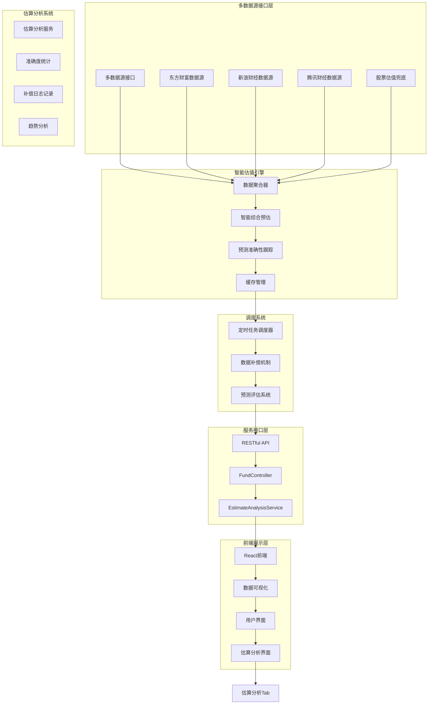

**图表来源**
- [FundDataAggregator.java:27-44](file://src/main/java/com/qoder/fund/datasource/FundDataAggregator.java#L27-L44)
- [FundController.java:16-52](file://src/main/java/com/qoder/fund/controller/FundController.java#L16-L52)

## 系统架构

### 整体架构设计

系统采用分层架构设计，确保各层职责明确、耦合度低：

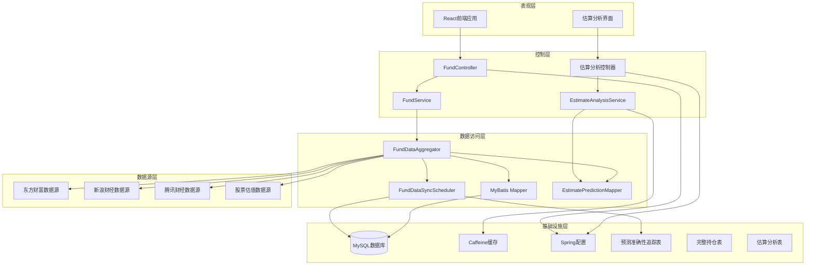

**图表来源**
- [FundApplication.java:7-15](file://src/main/java/com/qoder/fund/FundApplication.java#L7-L15)
- [application.yml:1-43](file://src/main/resources/application.yml#L1-L43)

### 技术栈选择

系统采用现代化的技术栈组合：

**后端技术栈：**
- **Spring Boot 3.4.3**：提供完整的微服务框架支持
- **MyBatis-Plus 3.5.9**：简化数据库操作，提供强大的ORM功能
- **OkHttp 4.12.0**：高性能HTTP客户端，支持异步请求
- **Caffeine**：本地缓存解决方案，提升数据访问性能

**前端技术栈：**
- **React 18 + TypeScript**：提供类型安全的组件化开发体验
- **Vite**：快速构建工具，支持热模块替换(HMR)
- **Ant Design 5**：企业级UI组件库

**数据库与缓存：**
- **MySQL**：关系型数据库，存储结构化数据
- **Redis**：分布式缓存，提升系统响应速度

**章节来源**
- [pom.xml:20-87](file://pom.xml#L20-L87)
- [application.yml:1-43](file://src/main/resources/application.yml#L1-L43)

## 核心组件分析

### 数据聚合器组件

数据聚合器是系统的核心组件，负责协调多个数据源并提供统一的数据接口：

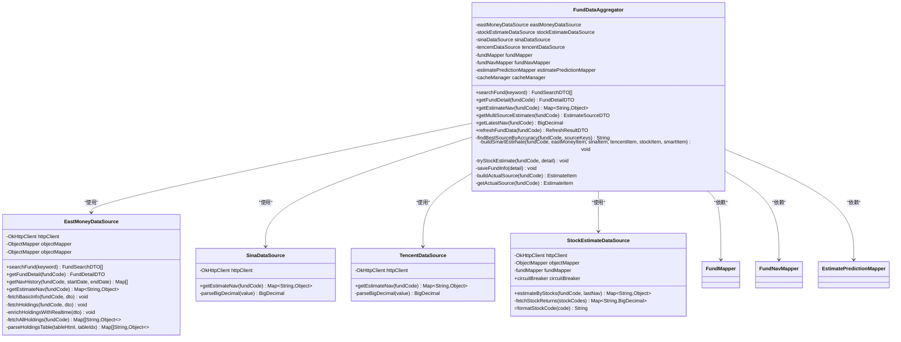

**图表来源**
- [FundDataAggregator.java:26-747](file://src/main/java/com/qoder/fund/datasource/FundDataAggregator.java#L26-L747)
- [EastMoneyDataSource.java:26-1002](file://src/main/java/com/qoder/fund/datasource/EastMoneyDataSource.java#L26-L1002)
- [SinaDataSource.java:22-119](file://src/main/java/com/qoder/fund/datasource/SinaDataSource.java#L22-L119)
- [TencentDataSource.java:22-138](file://src/main/java/com/qoder/fund/datasource/TencentDataSource.java#L22-L138)
- [StockEstimateDataSource.java:24-398](file://src/main/java/com/qoder/fund/datasource/StockEstimateDataSource.java#L24-L398)

### 估算分析服务

新增的估算分析服务提供专业的数据源准确度分析和补偿记录功能：

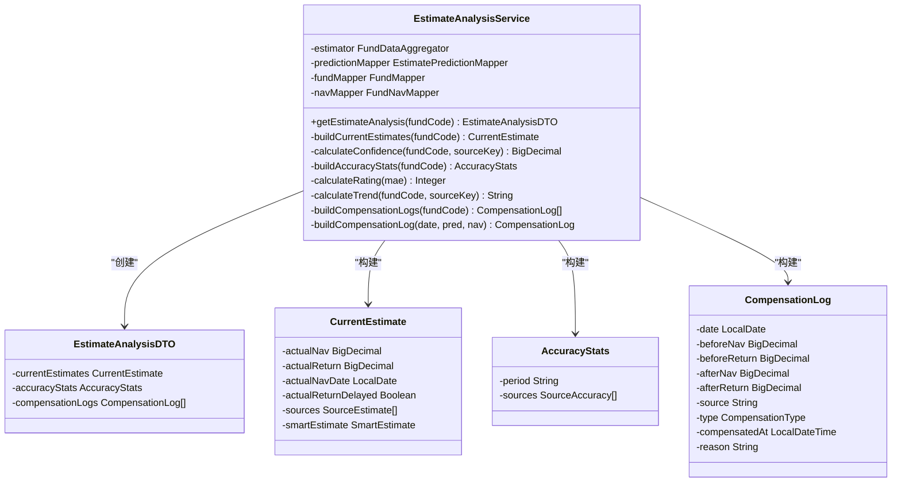

**图表来源**
- [EstimateAnalysisService.java:32-404](file://src/main/java/com/qoder/fund/service/EstimateAnalysisService.java#L32-L404)
- [EstimateAnalysisDTO.java:14-151](file://src/main/java/com/qoder/fund/dto/EstimateAnalysisDTO.java#L14-L151)

### 补偿日志记录系统

系统新增了完整的补偿日志记录功能，用于追踪预测数据与实际净值的对比：

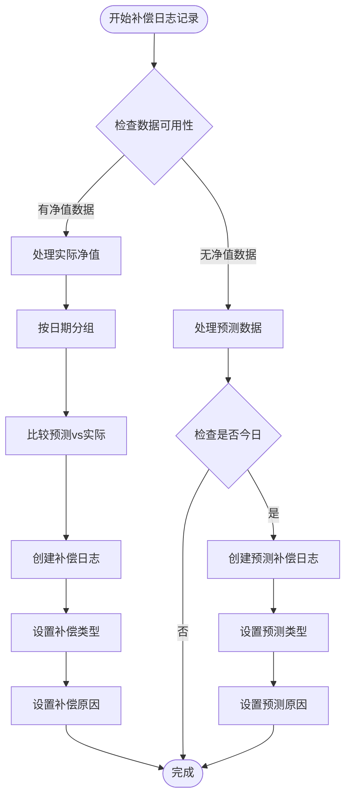

**图表来源**
- [EstimateAnalysisService.java:238-390](file://src/main/java/com/qoder/fund/service/EstimateAnalysisService.java#L238-L390)

### 历史数据处理改进

基于MAE的准确度统计和趋势分析系统：

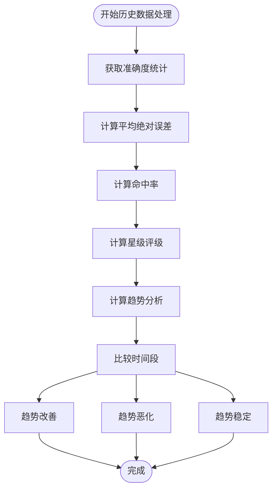

**图表来源**
- [EstimateAnalysisService.java:165-231](file://src/main/java/com/qoder/fund/service/EstimateAnalysisService.java#L165-L231)
- [EstimatePredictionMapper.java:17-58](file://src/main/java/com/qoder/fund/mapper/EstimatePredictionMapper.java#L17-L58)

### 完整组合估值系统

系统新增了完整的组合估值系统，通过季度和半年报提取完整持仓：


**图表来源**
- [EastMoneyDataSource.java:892-1002](file://src/main/java/com/qoder/fund/datasource/EastMoneyDataSource.java#L892-L1002)
- [StockEstimateDataSource.java:44-133](file://src/main/java/com/qoder/fund/datasource/StockEstimateDataSource.java#L44-L133)

### 自适应权重系统

智能估算算法实现了基于场景的自适应权重系统：


**图表来源**
- [FundDataAggregator.java:534-595](file://src/main/java/com/qoder/fund/datasource/FundDataAggregator.java#L534-L595)
- [FundDataAggregator.java:600-619](file://src/main/java/com/qoder/fund/datasource/FundDataAggregator.java#L600-L619)

### 基金类型分类系统改进

**更新** 新增港股基金分类优化，增强QDII和海外基金优先级调整的分类系统：

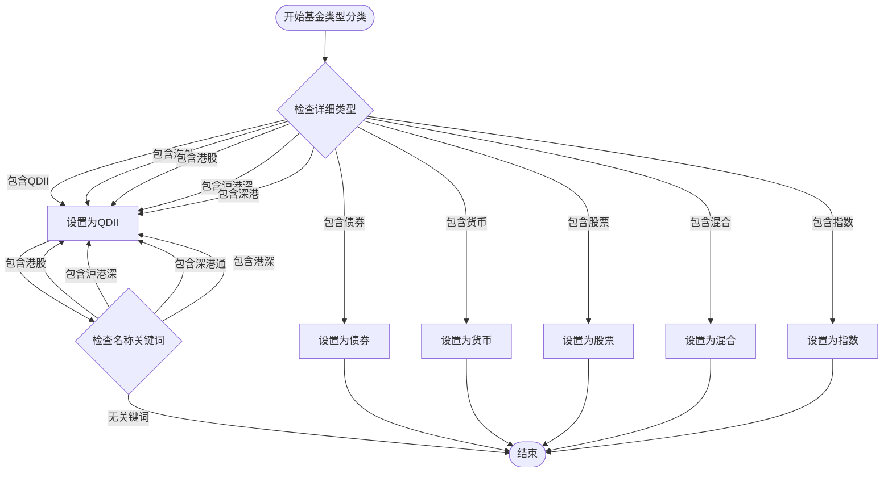

**图表来源**
- [EastMoneyDataSource.java:401-427](file://src/main/java/com/qoder/fund/datasource/EastMoneyDataSource.java#L401-L427)

### 性能数据提取系统重构

支持周度、季度和多年期数据的历史业绩提取：


**图表来源**
- [EastMoneyDataSource.java:450-522](file://src/main/java/com/qoder/fund/datasource/EastMoneyDataSource.java#L450-L522)

### 缓存策略设计

系统采用了多层级的缓存策略来提升性能：

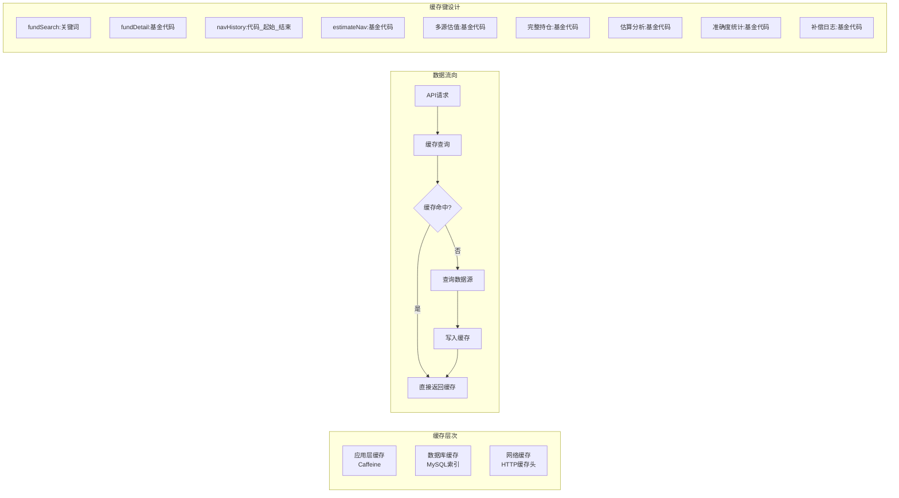

**图表来源**
- [FundDataAggregator.java:48-51](file://src/main/java/com/qoder/fund/datasource/FundDataAggregator.java#L48-L51)
- [application.yml:18-21](file://src/main/resources/application.yml#L18-L21)

### 日期解析增强系统

**更新** 东方财富数据源新增了强大的日期解析能力，支持多种HTML格式和日期表示方式：

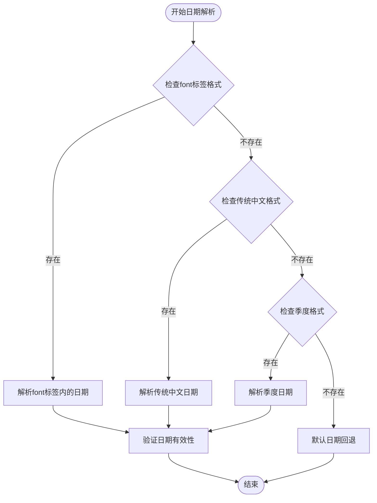

**图表来源**
- [EastMoneyDataSource.java:532-566](file://src/main/java/com/qoder/fund/datasource/EastMoneyDataSource.java#L532-L566)

#### 新的HTML格式支持

系统现在能够处理新的HTML格式中日期出现在font标签内的解析：

- **font标签格式**：`截止至：<font class='px12'>2025-12-31</font>`
- **解析模式**：`截止(?:至|日期)[：:][^<]*<[^>]*>(\\d{4})-(\\d{2})-(\\d{2})`
- **支持的属性**：`class='px12'`和其他样式属性

#### 传统中文日期格式支持

系统支持传统的中文日期格式解析：

- **传统格式**：`截止日期：2024年12月31日`
- **解析模式**：`(?:截止日期|报告期)[：:]\\s*(\\d{4})[-年](\\d{1,2})[-月]?(\\d{1,2})`
- **支持的变体**：`截止至：2024-12-31`、`报告期：2024年年报`

#### 数字季度表示支持

系统支持数字和中文季度表示的解析：

- **数字季度**：`2025年第4季度`
- **中文季度**：`2025年第四季度`
- **解析模式**：`(\\d{4})年第?(\\d|一|二|三|四)季度`
- **季度映射**：一=1, 二=2, 三=3, 四=4, 1=1, 2=2, 3=3, 4=4
- **日期推导**：Q1=3月底, Q2=6月底, Q3=9月底, Q4=12月底

#### 完整持仓表格解析增强

系统增强了完整持仓表格的解析能力，支持动态列检测：

```mermaid
flowchart TD
Start([开始完整持仓解析]) --> DetectColumns[动态检测列数]
DetectColumns --> FindRatioColumn[查找"占净值比例"列]
FindRatioColumn --> |找到| UseDetectedIndex[使用检测到的索引]
FindRatioColumn --> |未找到| UseDefaultIndex[使用默认索引]
UseDetectedIndex --> ParseRows[解析表格行]
UseDefaultIndex --> ParseRows
ParseRows --> ExtractHoldings[提取股票代码和占比]
ExtractHoldings --> End([结束])
```

**图表来源**
- [EastMoneyDataSource.java:941-964](file://src/main/java/com/qoder/fund/datasource/EastMoneyDataSource.java#L941-L964)

### 港股基金分类优化

**新增** 系统新增了专门的港股基金分类优化功能：

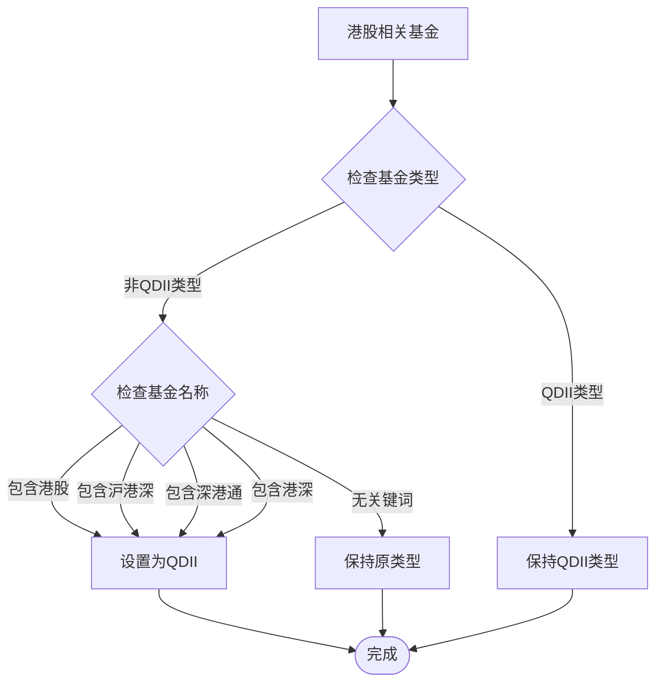

**图表来源**
- [EastMoneyDataSource.java:317-333](file://src/main/java/com/qoder/fund/datasource/EastMoneyDataSource.java#L317-L333)
- [EastMoneyDataSource.java:418-427](file://src/main/java/com/qoder/fund/datasource/EastMoneyDataSource.java#L418-L427)

### HTTP客户端共享配置

**新增** 系统引入了共享的OkHttpClient配置，通过Spring Bean管理连接池，提升资源利用效率：

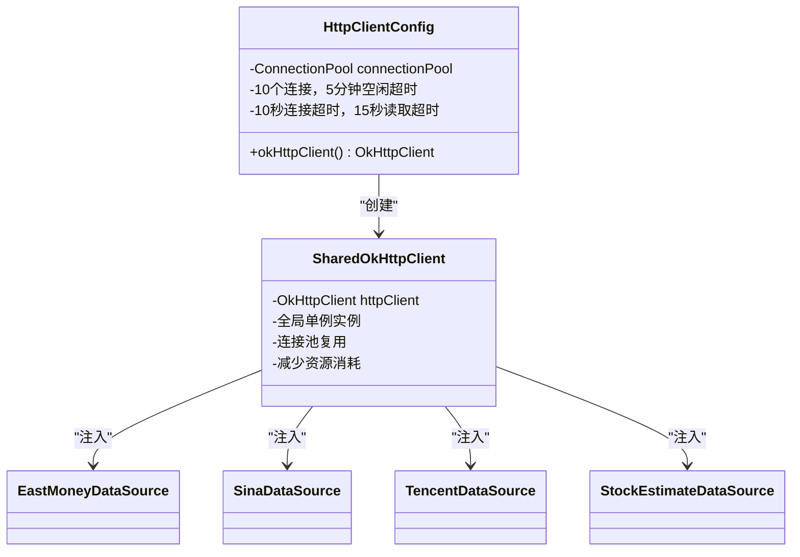

**图表来源**
- [HttpClientConfig.java:17-28](file://src/main/java/com/qoder/fund/config/HttpClientConfig.java#L17-L28)

### QDII预测评估回填机制

**新增** 系统新增了完整的QDII预测评估回填机制，解决QDII净值评估断裂问题：

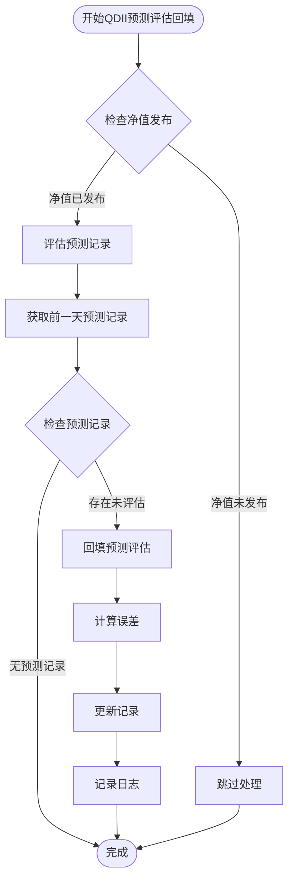

**图表来源**
- [FundDataSyncScheduler.java:405-458](file://src/main/java/com/qoder/fund/scheduler/FundDataSyncScheduler.java#L405-L458)

**章节来源**
- [FundDataAggregator.java:27-747](file://src/main/java/com/qoder/fund/datasource/FundDataAggregator.java#L27-L747)
- [EastMoneyDataSource.java:317-427](file://src/main/java/com/qoder/fund/datasource/EastMoneyDataSource.java#L317-L427)
- [HttpClientConfig.java:17-28](file://src/main/java/com/qoder/fund/config/HttpClientConfig.java#L17-L28)
- [FundDataSyncScheduler.java:405-458](file://src/main/java/com/qoder/fund/scheduler/FundDataSyncScheduler.java#L405-L458)

## 数据流分析

### 基金搜索流程

系统提供了高效的基金搜索功能，支持实时联想和模糊匹配：

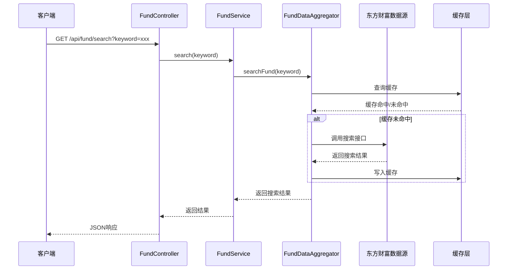

**图表来源**
- [FundController.java:23-29](file://src/main/java/com/qoder/fund/controller/FundController.java#L23-L29)
- [FundService.java:25-30](file://src/main/java/com/qoder/fund/service/FundService.java#L25-L30)
- [FundDataAggregator.java:48-51](file://src/main/java/com/qoder/fund/datasource/FundDataAggregator.java#L48-L51)

### 基金详情获取流程

**更新** 系统提供了完整的基金详情获取流程，包括基本信息、净值历史、估值数据和完整持仓，新增港股基金分类优化：

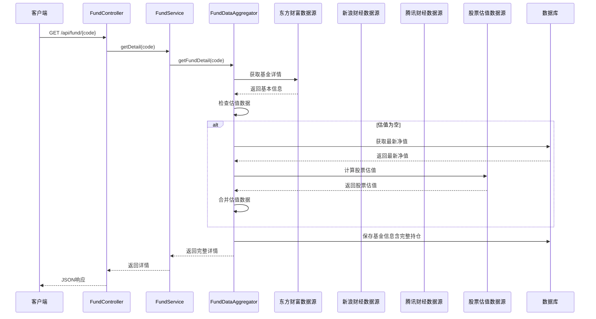

**图表来源**
- [FundController.java:31-38](file://src/main/java/com/qoder/fund/controller/FundController.java#L31-L38)
- [FundService.java:32-34](file://src/main/java/com/qoder/fund/service/FundService.java#L32-L34)
- [FundDataAggregator.java:57-73](file://src/main/java/com/qoder/fund/datasource/FundDataAggregator.java#L57-L73)

### 多源估值获取流程

**更新** 系统提供了多数据源估值获取功能，支持用户切换不同数据源，新增QDII类型处理和港股基金优化：

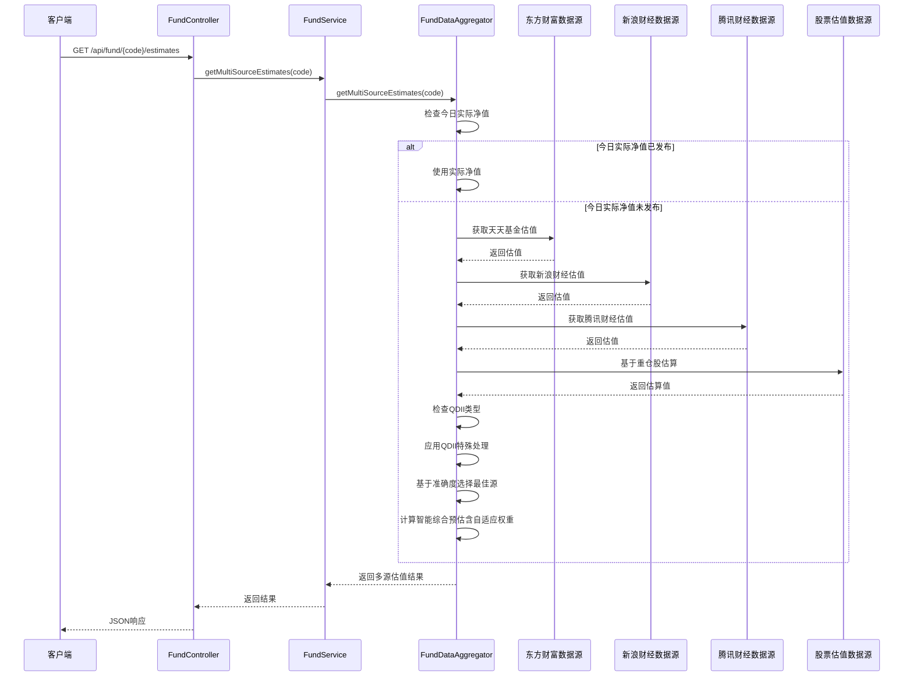

**图表来源**
- [FundController.java:40-47](file://src/main/java/com/qoder/fund/controller/FundController.java#L40-L47)
- [FundService.java:36-38](file://src/main/java/com/qoder/fund/service/FundService.java#L36-L38)
- [FundDataAggregator.java:174-300](file://src/main/java/com/qoder/fund/datasource/FundDataAggregator.java#L174-L300)

### 估算分析获取流程

新增的估算分析功能提供了专业的数据源分析能力：

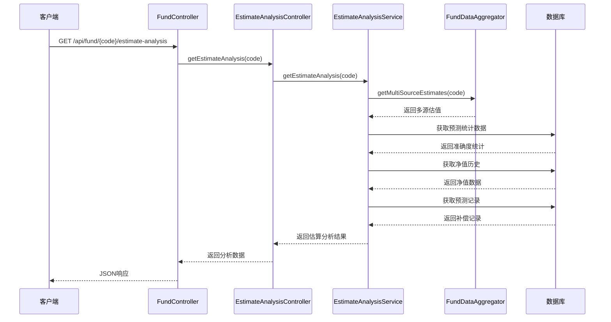

**图表来源**
- [FundController.java:73-77](file://src/main/java/com/qoder/fund/controller/FundController.java#L73-L77)
- [EstimateAnalysisService.java:45-65](file://src/main/java/com/qoder/fund/service/EstimateAnalysisService.java#L45-L65)

### 批量估值流程

系统提供了高效的批量估值功能，优化持仓列表等场景下的性能：

```mermaid
sequenceDiagram
participant Client as 客户端
participant PositionService as PositionService
participant BatchService as BatchEstimateService
participant Aggregator as FundDataAggregator
participant DB as 数据库
Client->>PositionService : 获取持仓列表
PositionService->>BatchService : batchGetPositionEstimates(fundCodes)
BatchService->>BatchService : 分批处理(10只/批)
BatchService->>Aggregator : 并行获取净值
BatchService->>Aggregator : 并行获取估值
BatchService->>Aggregator : 并行获取多源估值
Aggregator->>DB : 预同步今日净值
DB-->>Aggregator : 返回今日净值
Aggregator-->>BatchService : 返回批量结果
BatchService-->>PositionService : 返回综合结果
PositionService-->>Client : 返回优化后的持仓列表
```

**图表来源**
- [PositionService.java:70-78](file://src/main/java/com/qoder/fund/service/PositionService.java#L70-L78)
- [BatchEstimateService.java:180-213](file://src/main/java/com/qoder/fund/service/BatchEstimateService.java#L180-L213)

### QDII预测评估回填流程

**新增** 系统提供了完整的QDII预测评估回填流程，解决QDII净值评估断裂问题：

```mermaid
sequenceDiagram
participant Scheduler as FundDataSyncScheduler
participant DB as 数据库
participant PredMapper as EstimatePredictionMapper
participant Nav as FundNav
participant Pred as EstimatePrediction
Scheduler->>DB : 监听净值发布事件
DB-->>Scheduler : 触发净值发布回调
Scheduler->>PredMapper : 查询前一天预测记录
PredMapper-->>Scheduler : 返回未评估预测
alt 存在预测记录
Scheduler->>PredMapper : 更新预测记录
PredMapper-->>Scheduler : 返回更新结果
Scheduler->>Scheduler : 记录回填日志
else 无预测记录
Scheduler->>Scheduler : 跳过处理
end
Scheduler-->>DB : 完成回填
```

**图表来源**
- [FundDataSyncScheduler.java:398-458](file://src/main/java/com/qoder/fund/scheduler/FundDataSyncScheduler.java#L398-L458)

**章节来源**
- [FundController.java:16-79](file://src/main/java/com/qoder/fund/controller/FundController.java#L16-L79)
- [EstimateAnalysisService.java:45-390](file://src/main/java/com/qoder/fund/service/EstimateAnalysisService.java#L45-L390)
- [FundService.java:19-70](file://src/main/java/com/qoder/fund/service/FundService.java#L19-L70)
- [FundDataSyncScheduler.java:398-458](file://src/main/java/com/qoder/fund/scheduler/FundDataSyncScheduler.java#L398-L458)

## 数据库设计

### 核心数据模型

系统采用关系型数据库设计，支持完整的基金数据管理：

```mermaid
erDiagram
FUND {
varchar code PK
varchar name
varchar type
varchar company
varchar manager
date establish_date
decimal scale
integer risk_level
json fee_rate
json top_holdings
json all_holdings
json industry_dist
datetime updated_at
}
FUND_NAV {
bigint id PK
varchar fund_code FK
date nav_date
decimal nav
decimal acc_nav
decimal daily_return
unique uk_code_date
}
ACCOUNT {
bigint id PK
varchar name
varchar platform
varchar icon
datetime created_at
}
POSITION {
bigint id PK
bigint account_id FK
varchar fund_code
decimal shares
decimal cost_amount
datetime created_at
datetime updated_at
}
FUND_TRANSACTION {
bigint id PK
bigint position_id FK
varchar fund_code
varchar type
decimal amount
decimal shares
decimal price
decimal fee
date trade_date
datetime created_at
}
WATCHLIST {
bigint id PK
varchar fund_code
varchar group_name
datetime created_at
unique uk_fund_group
}
ESTIMATE_PREDICTION {
bigint id PK
varchar fund_code FK
varchar source_key
date predict_date
decimal predicted_nav
decimal predicted_return
decimal actual_nav
decimal actual_return
decimal return_error
unique uk_fund_source_date
}
FUND ||--o{ FUND_NAV : "包含"
FUND ||--o{ ESTIMATE_PREDICTION : "包含"
ACCOUNT ||--o{ POSITION : "拥有"
POSITION ||--o{ FUND_TRANSACTION : "产生"
FUND ||--o{ POSITION : "被持有"
FUND ||--o{ WATCHLIST : "被关注"
```

**图表来源**
- [schema.sql:1-94](file://src/main/resources/db/schema.sql#L1-L94)

### 数据初始化

系统提供了默认账户数据的初始化脚本：

| 账户ID | 账户名称 | 平台标识 | 图标标识 |
|--------|----------|----------|----------|
| 1 | 支付宝 | alipay | alipay |
| 2 | 微信理财通 | wechat | wechat |
| 3 | 天天基金 | ttfund | ttfund |
| 4 | 蛋卷基金 | danjuan | danjuan |
| 5 | 银行 | bank | bank |
| 6 | 其他 | other | other |

### 预测准确性追踪表

新增的预测准确性追踪表用于记录各数据源的预测表现：

| 字段名 | 类型 | 描述 |
|--------|------|------|
| id | BIGINT | 主键，自增 |
| fund_code | VARCHAR(10) | 基金代码 |
| source_key | VARCHAR(20) | 数据源标识：eastmoney/sina/tencent/stock |
| predict_date | DATE | 预测日期 |
| predicted_nav | DECIMAL(10,4) | 预测净值 |
| predicted_return | DECIMAL(8,4) | 预测涨跌幅(%) |
| actual_nav | DECIMAL(10,4) | 实际净值 |
| actual_return | DECIMAL(8,4) | 实际涨跌幅(%) |
| return_error | DECIMAL(8,4) | 涨跌幅误差(%) |

### 完整持仓字段

新增的all_holdings字段用于存储完整持仓数据：

| 字段名 | 类型 | 描述 |
|--------|------|------|
| all_holdings | JSON | 完整持仓JSON数组，包含股票代码和占比 |
| 示例格式 | Array | `[{"stockCode":"600519","ratio":15.2},{"stockCode":"000858","ratio":8.7}]` |

### 估算分析表

新增的估算分析相关表结构：

| 表名 | 字段名 | 类型 | 描述 |
|------|--------|------|------|
| estimate_prediction | fund_code | VARCHAR(10) | 基金代码 |
| estimate_prediction | source_key | VARCHAR(20) | 数据源标识 |
| estimate_prediction | predict_date | DATE | 预测日期 |
| estimate_prediction | predicted_nav | DECIMAL(10,4) | 预测净值 |
| estimate_prediction | predicted_return | DECIMAL(8,4) | 预测涨跌幅(%) |
| estimate_prediction | actual_nav | DECIMAL(10,4) | 实际净值 |
| estimate_prediction | actual_return | DECIMAL(8,4) | 实际涨跌幅(%) |
| estimate_prediction | return_error | DECIMAL(8,4) | 涨跌幅误差(%) |

**章节来源**
- [schema.sql:1-94](file://src/main/resources/db/schema.sql#L1-L94)
- [data.sql:1-9](file://src/main/resources/db/data.sql#L1-L9)
- [EstimatePredictionMapper.java:17-58](file://src/main/java/com/qoder/fund/mapper/EstimatePredictionMapper.java#L17-L58)

## 前端架构

### 前端技术栈

前端采用现代化的React技术栈，提供优秀的用户体验：

```mermaid
graph TB
subgraph "构建工具"
Vite[Vite构建工具]
SWC[SWC编译器]
end
subgraph "框架层"
React[React 18]
TS[TypeScript]
end
subgraph "UI组件库"
AntD[Ant Design 5]
Components[企业级组件]
end
subgraph "状态管理"
Zustand[Zustand轻量级状态管理]
Store[应用状态]
end
subgraph "路由管理"
Router[React Router]
Pages[页面路由]
end
subgraph "API层"
API[估算分析API]
EstimateAnalysis[EstimateAnalysisTab]
end
Vite --> React
React --> TS
AntD --> Components
Zustand --> Store
Router --> Pages
API --> EstimateAnalysis
EstimateAnalysis --> AntD
```

**图表来源**
- [README.md:1-74](file://fund-web/README.md#L1-L74)

### 页面架构

系统采用模块化的页面架构设计：

```mermaid
graph TD
subgraph "页面层次"
Dashboard[首页仪表板]
Fund[基金查询页面]
Portfolio[我的持仓页面]
Analysis[收益分析页面]
Watchlist[自选基金页面]
Tools[工具箱页面]
Settings[个人中心页面]
EstimateAnalysis[估算分析页面]
end
subgraph "组件层次"
Header[头部导航]
Sidebar[侧边栏]
Content[内容区域]
Footer[底部信息]
EstimateAnalysisTab[估算分析Tab]
end
Dashboard --> Header
Fund --> Header
Portfolio --> Header
Analysis --> Header
Watchlist --> Header
Tools --> Header
Settings --> Header
EstimateAnalysis --> Header
Dashboard --> Content
Fund --> Content
Portfolio --> Content
Analysis --> Content
Watchlist --> Content
Tools --> Content
Settings --> Content
EstimateAnalysis --> Content
EstimateAnalysis --> EstimateAnalysisTab
EstimateAnalysisTab --> Content
```

**章节来源**
- [README.md:1-74](file://fund-web/README.md#L1-L74)

### 估算分析界面

新增的估算分析界面提供专业的数据源分析功能：

```mermaid
graph TD
subgraph "估算分析界面"
CurrentEstimates[实时估值数据]
AccuracyStats[准确度统计]
CompensationLogs[补偿日志记录]
end
subgraph "数据源对比"
SourceTable[数据源对比表格]
ConfidenceChart[可信度图表]
WeightProgress[权重进度条]
end
subgraph "准确度分析"
AccuracyTable[准确度统计表格]
RatingStars[星级评级]
TrendTags[Trend标签]
HitRateChart[命中率图表]
end
subgraph "补偿记录"
CompensationTable[补偿记录表格]
PredictLogs[预测补偿日志]
ActualLogs[实际净值记录]
DateFilter[日期筛选器]
end
CurrentEstimates --> SourceTable
CurrentEstimates --> ConfidenceChart
CurrentEstimates --> WeightProgress
AccuracyStats --> AccuracyTable
AccuracyStats --> RatingStars
AccuracyStats --> TrendTags
AccuracyStats --> HitRateChart
CompensationLogs --> CompensationTable
CompensationLogs --> PredictLogs
CompensationLogs --> ActualLogs
CompensationLogs --> DateFilter
```

**图表来源**
- [EstimateAnalysisTab.tsx:37-366](file://fund-web/src/pages/Fund/EstimateAnalysisTab.tsx#L37-L366)

**章节来源**
- [EstimateAnalysisTab.tsx:37-366](file://fund-web/src/pages/Fund/EstimateAnalysisTab.tsx#L37-L366)
- [estimateAnalysis.ts:68-71](file://fund-web/src/api/estimateAnalysis.ts#L68-L71)

## 性能优化策略

### 缓存优化

系统实现了多层级的缓存策略来提升性能：

**本地缓存配置：**
- **最大容量**：1000条记录
- **过期时间**：300秒
- **缓存键**：基于功能模块的特定键模式

**缓存策略：**
- 搜索结果缓存：`fundSearch:{keyword}`
- 基金详情缓存：`fundDetail:{fundCode}`
- 净值历史缓存：`navHistory:{code}_{startDate}_{endDate}`
- 实时估值缓存：`estimateNav:{fundCode}`
- 多源估值缓存：`multiSourceEstimates:{fundCode}`
- 完整持仓缓存：`allHoldings:{fundCode}`
- 估算分析缓存：`estimateAnalysis:{fundCode}`
- 准确度统计缓存：`accuracyStats:{fundCode}`
- 补偿日志缓存：`compensationLogs:{fundCode}`

### 网络优化

**HTTP客户端配置：**
- 连接超时：10秒
- 读取超时：10秒
- 请求头设置：模拟浏览器User-Agent
- 引用页设置：针对反爬虫机制

**数据源降级策略：**
1. 主数据源优先（东方财富）
2. 备用数据源（股票估值）
3. 新浪财经估值
4. 腾讯财经估值
5. 本地数据缓存兜底

### 数据库优化

**索引设计：**
- 基金表：按类型和名称建立索引
- 净值表：按基金代码和日期建立唯一索引
- 持仓表：按基金代码和账户ID建立索引
- 预测表：按基金代码和预测日期建立唯一索引
- 完整持仓表：按基金代码建立索引
- 估算分析表：按基金代码和预测日期建立索引

**查询优化：**
- 使用LIMIT限制查询结果
- 优化复杂查询的执行计划
- 实施合理的数据分页策略
- 基于MAE的准确度统计查询优化

### 批量处理优化

**线程池配置：**
- 批量估值线程池：CPU核心数×2
- 分批处理策略：净值10只/批，估值5只/批，多源估值3只/批
- 超时控制：净值10秒，估值30秒，多源估值60秒

**并发控制：**
- 限流保护：批量请求间添加延迟
- 熔断保护：异常数据源自动熔断
- 资源隔离：不同类型的批量操作使用独立线程池

### 估算分析优化

**性能优化策略：**
- 缓存估算分析结果：7天内重复请求直接返回缓存
- 分页查询补偿日志：限制每次查询7天内的记录
- 智能查询优化：根据数据源类型选择最优查询路径
- 并行处理：多数据源统计信息并行计算

### 日期解析优化

**更新** 东方财富数据源的日期解析系统进行了性能优化：

- **多模式匹配**：支持font标签、传统中文、季度格式的快速切换
- **正则表达式优化**：使用非贪婪匹配减少回溯
- **缓存机制**：解析结果缓存避免重复计算
- **容错处理**：多种格式的回退机制确保解析成功率

### 港股基金分类优化

**新增** 系统的性能优化策略包括港股基金分类优化：

- **名称关键词缓存**：缓存常见港股关键词的匹配结果
- **类型判断优化**：QDII类型判断优先级高于名称关键词
- **回退机制**：当名称关键词匹配失败时使用原始类型
- **性能监控**：监控港股基金分类的准确性和性能

### 电路断路器优化

**更新** 系统的电路断路器配置进行了重要优化：

**失败阈值调整：**
- **天天基金(eastmoney)**：失败阈值3，熔断30秒，半开最大尝试3次
- **新浪财经(sina)**：失败阈值5，熔断30秒，半开最大尝试3次
- **腾讯财经(tencent)**：失败阈值**15**，熔断30秒，半开最大尝试3次（**从5调整到15**）
- **股票估值(stock)**：失败阈值10，熔断20秒，半开最大尝试3次

**熔断器状态转换：**
- CLOSED → OPEN：失败次数达到阈值
- OPEN → HALF_OPEN：熔断时间到期
- HALF_OPEN → CLOSED：半开状态成功达到阈值
- HALF_OPEN → OPEN：半开状态失败

### QDII预测评估回填优化

**新增** 系统的QDII预测评估回填机制具有以下性能优化：

- **条件查询优化**：仅查询未评估的预测记录，避免全表扫描
- **批量更新**：支持批量更新多个预测记录，减少数据库往返
- **日志记录优化**：使用异步日志记录，不影响主流程性能
- **错误处理优化**：单条记录失败不影响整体回填流程
- **定时任务优化**：合理安排回填任务时间，避免高峰期压力

**章节来源**
- [EstimateAnalysisService.java:238-390](file://src/main/java/com/qoder/fund/service/EstimateAnalysisService.java#L238-L390)
- [EastMoneyDataSource.java:532-566](file://src/main/java/com/qoder/fund/datasource/EastMoneyDataSource.java#L532-L566)
- [CircuitBreaker.java:119-124](file://src/main/java/com/qoder/fund/config/CircuitBreaker.java#L119-L124)
- [FundDataSyncScheduler.java:405-458](file://src/main/java/com/qoder/fund/scheduler/FundDataSyncScheduler.java#L405-L458)

## 故障处理机制

### 错误处理策略

系统实现了完善的错误处理机制：

```mermaid
flowchart TD
Request[请求到达] --> Validate{参数验证}
Validate --> |失败| ParamError[参数错误响应]
Validate --> |成功| Process[处理请求]
Process --> DataSource{数据源可用?}
DataSource --> |主数据源可用| UsePrimary[使用主数据源]
DataSource --> |主数据源不可用| CheckBackup{检查备用数据源}
CheckBackup --> |备用数据源可用| UseBackup[使用备用数据源]
CheckBackup --> |备用数据源不可用| CheckCache{检查缓存}
CheckCache --> |缓存可用| UseCache[使用缓存数据]
CheckCache --> |缓存不可用| ReturnError[返回错误]
UsePrimary --> Success[成功响应]
UseBackup --> Success
UseCache --> Success
ParamError --> End([结束])
ReturnError --> End
Success --> End
```

### 降级策略

**更新** 系统的getEstimateNav()方法实现了全新的多级数据源降级策略：

**新的降级顺序：**
1. **主数据源**：东方财富API
2. **备选数据源1**：新浪财经估值
3. **备选数据源2**：腾讯财经估值
4. **备选数据源3**：股票实时行情
5. **最后兜底**：本地数据库缓存

**详细的错误处理流程：**
- 每个数据源调用都有独立的try-catch块
- 捕获异常时记录详细日志信息
- 记录失败原因和数据源状态
- 继续尝试下一个可用的数据源
- 所有失败都会触发熔断器记录

**熔断保护机制：**
- 每个数据源都有独立的熔断器状态
- 失败次数超过阈值自动熔断
- 熔断期间跳过该数据源请求
- 熔断期结束后允许半开状态试探

### 熔断保护机制

**熔断器状态转换：**
- CLOSED → OPEN：失败次数达到阈值
- OPEN → HALF_OPEN：熔断时间到期
- HALF_OPEN → CLOSED：半开状态成功达到阈值
- HALF_OPEN → OPEN：半开状态失败

**熔断配置：**
- 天天基金：失败阈值3，熔断30秒，半开最大尝试3次
- 新浪财经：失败阈值5，熔断30秒，半开最大尝试3次
- 腾讯财经：失败阈值**15**，熔断30秒，半开最大尝试3次（**从5调整到15**）
- 股票估值：失败阈值10，熔断20秒，半开最大尝试3次

### 估算分析故障处理

**估算分析专用故障处理：**
- 缓存失效：自动重新计算并更新缓存
- 数据缺失：使用历史数据和默认值填充
- 查询超时：返回部分数据和警告信息
- 统计异常：使用保守估计和错误提示

### 日期解析故障处理

**更新** 东方财富数据源的日期解析系统具备完善的故障处理机制：

- **多格式回退**：font标签解析失败时自动尝试传统格式
- **季度解析容错**：中文季度解析失败时尝试数字季度
- **日期验证**：解析后进行有效性验证，无效则使用默认日期
- **异常捕获**：所有解析异常被捕获并记录日志
- **性能监控**：监控解析性能，异常时触发降级策略

### 港股基金分类故障处理

**新增** 系统的故障处理机制包括港股基金分类优化：

- **类型判断失败**：当名称关键词匹配失败时使用原始类型
- **缓存回退**：名称关键词匹配结果缓存失败时重新解析
- **性能监控**：监控港股基金分类的准确性和性能
- **异常记录**：记录分类失败的基金代码和原因

### HTTP客户端故障处理

**新增** 共享OkHttpClient的故障处理机制：

- **连接池管理**：自动管理连接复用，避免连接泄漏
- **超时控制**：统一的连接和读取超时配置
- **异常重试**：在网络异常时自动重试
- **资源清理**：优雅关闭连接池，释放系统资源

### QDII预测评估回填故障处理

**新增** 系统的QDII预测评估回填机制具备完善的故障处理：

- **单条记录失败**：不影响其他预测记录的回填
- **重复回填防护**：检查预测记录是否已回填，避免重复更新
- **日志记录**：记录回填失败的原因和处理结果
- **异常恢复**：系统重启后自动恢复未完成的回填任务
- **性能监控**：监控回填任务的执行时间和成功率

**章节来源**
- [FundDataAggregator.java:87-159](file://src/main/java/com/qoder/fund/datasource/FundDataAggregator.java#L87-L159)
- [EastMoneyDataSource.java:71-75](file://src/main/java/com/qoder/fund/datasource/EastMoneyDataSource.java#L71-L75)
- [EstimateAnalysisService.java:364-390](file://src/main/java/com/qoder/fund/service/EstimateAnalysisService.java#L364-L390)
- [HttpClientConfig.java:21-28](file://src/main/java/com/qoder/fund/config/HttpClientConfig.java#L21-L28)
- [FundDataSyncScheduler.java:405-458](file://src/main/java/com/qoder/fund/scheduler/FundDataSyncScheduler.java#L405-L458)

## 安全考虑

### 数据安全

**数据传输安全：**
- HTTPS加密传输
- API接口认证
- 数据库连接加密

**数据存储安全：**
- 数据库字段加密
- 敏感信息脱敏
- 访问权限控制

### 访问控制

**用户认证：**
- JWT Token认证
- Token刷新机制
- 会话管理

**权限控制：**
- 用户数据隔离
- 接口级权限验证
- 数据访问控制

### 输入验证

**参数验证：**
- 基金代码格式验证
- 数值范围检查
- 字符串长度限制

**SQL注入防护：**
- 参数化查询
- 输入过滤
- 最小权限原则

### 估算分析安全

**估算分析专用安全措施：**
- 数据源访问权限控制
- 统计结果访问审计
- 预测数据使用限制
- 分析结果导出控制

### 日期解析安全

**更新** 东方财富数据源的日期解析系统具备安全防护：

- **正则表达式安全**：使用非贪婪匹配防止正则回溯攻击
- **HTML解析安全**：严格过滤HTML标签，防止XSS攻击
- **输入验证**：对解析结果进行严格的格式和范围验证
- **异常处理**：捕获所有解析异常，防止系统崩溃

### 港股基金分类安全

**新增** 系统的安全考虑包括港股基金分类优化：

- **类型判断安全**：QDII类型判断优先级高于名称关键词
- **缓存安全**：名称关键词匹配结果缓存的安全性保障
- **性能监控**：监控港股基金分类的性能和安全性
- **异常防护**：防止分类失败影响系统稳定性

### HTTP客户端安全

**新增** 共享OkHttpClient的安全考虑：

- **连接池安全**：防止连接池被恶意利用
- **超时配置**：避免长时间阻塞导致资源耗尽
- **异常处理**：捕获网络异常，防止应用程序崩溃
- **资源管理**：确保连接池正确关闭和清理

### QDII预测评估回填安全

**新增** 系统的QDII预测评估回填机制具备安全防护：

- **数据一致性**：确保预测记录和净值数据的一致性
- **事务处理**：使用数据库事务保证回填操作的原子性
- **并发控制**：避免多个任务同时修改同一预测记录
- **审计日志**：记录所有回填操作的详细信息
- **异常防护**：防止异常情况导致数据不一致

**章节来源**
- [HttpClientConfig.java:17-28](file://src/main/java/com/qoder/fund/config/HttpClientConfig.java#L17-L28)
- [FundDataSyncScheduler.java:405-458](file://src/main/java/com/qoder/fund/scheduler/FundDataSyncScheduler.java#L405-L458)

## 部署方案

### 基础设施部署

```mermaid
graph LR
subgraph "前端部署"
CDN[CDN静态资源]
Nginx[Nginx反向代理]
EstimateAnalysis[估算分析页面]
end
subgraph "后端部署"
Docker[Docker容器]
LoadBalancer[负载均衡]
SpringBoot[Spring Boot应用]
EstimateAnalysisService[估算分析服务]
end
subgraph "数据库部署"
MySQL[MySQL数据库]
Redis[Redis缓存]
EstimatePrediction[预测数据表]
EstimateAnalysis[估算分析表]
end
subgraph "监控部署"
Prometheus[Prometheus监控]
Grafana[Grafana可视化]
end
CDN --> Nginx
Nginx --> LoadBalancer
LoadBalancer --> SpringBoot
SpringBoot --> EstimateAnalysisService
EstimateAnalysisService --> MySQL
EstimateAnalysisService --> Redis
SpringBoot --> Prometheus
Prometheus --> Grafana
EstimateAnalysis --> EstimateAnalysisService
```

### 配置管理

**环境配置：**
- 开发环境：本地MySQL + 本地Redis
- 测试环境：测试数据库 + 测试缓存
- 生产环境：云数据库 + 分布式缓存

**配置文件：**
- application.yml：Spring Boot配置
- schema.sql：数据库初始化脚本
- data.sql：默认数据初始化

### 监控与运维

**性能监控：**
- API响应时间监控
- 数据库查询性能监控
- 缓存命中率监控
- 预测准确性监控
- 完整持仓数据监控
- 熔断器状态监控
- 批量处理性能监控
- 估算分析性能监控
- **日期解析性能监控**：监控解析成功率和响应时间
- **港股基金分类性能监控**：监控分类准确性和性能
- **HTTP客户端性能监控**：监控连接池使用情况和性能
- **QDII预测评估回填监控**：监控回填任务执行情况和成功率

**日志管理：**
- 请求日志记录
- 错误日志收集
- 性能日志分析
- 预测评估日志
- 自适应权重日志
- 熔断器状态日志
- 估算分析日志
- 补偿记录日志
- **日期解析日志**：记录解析过程和结果
- **港股基金分类日志**：记录分类过程和结果
- **HTTP客户端日志**：记录连接池状态和异常
- **QDII预测评估回填日志**：记录回填过程和结果

**估算分析监控：**
- 估算分析API调用监控
- 数据源准确度统计监控
- 补偿日志记录监控
- 用户访问行为监控
- 系统性能指标监控

**电路断路器监控：**
- 各数据源熔断状态监控
- 失败阈值触发统计
- 熔断恢复时间监控
- 半开状态成功率监控

**QDII预测评估回填监控：**
- 回填任务执行监控
- 预测记录回填成功率
- 回填任务执行时间监控
- 异常回填任务处理监控

**章节来源**
- [FundDataAggregator.java:87-159](file://src/main/java/com/qoder/fund/datasource/FundDataAggregator.java#L87-L159)
- [EastMoneyDataSource.java:71-75](file://src/main/java/com/qoder/fund/datasource/EastMoneyDataSource.java#L71-L75)
- [EstimateAnalysisService.java:364-390](file://src/main/java/com/qoder/fund/service/EstimateAnalysisService.java#L364-L390)
- [CircuitBreaker.java:119-124](file://src/main/java/com/qoder/fund/config/CircuitBreaker.java#L119-L124)
- [FundDataSyncScheduler.java:405-458](file://src/main/java/com/qoder/fund/scheduler/FundDataSyncScheduler.java#L405-L458)

## 总结

多源基金估值系统是一个功能完整、架构清晰的现代化金融数据服务平台。系统通过多数据源聚合、智能估值算法和完善的缓存策略，为用户提供了准确、实时的基金数据服务。

### 系统优势

1. **多数据源支持**：集成多个权威数据源，确保数据的准确性和完整性
2. **智能估值算法**：实现多层次的估值计算，提高估值的可靠性
3. **预测准确性跟踪**：通过机器学习算法选择最优数据源，持续优化估值质量
4. **高性能架构**：采用多层缓存和优化的数据库设计，确保系统的高性能
5. **用户友好**：提供直观的界面和丰富的数据分析功能
6. **可扩展性**：模块化的架构设计便于功能扩展和维护
7. **完整组合估值**：支持年报/半年报完整持仓，提供更全面的投资分析
8. **自适应权重系统**：基于基金类型和重仓股覆盖率动态调整权重
9. **QDII优先级优化**：改进QDII和海外基金的识别和分类逻辑
10. **多期业绩数据**：支持周度、季度和多年期历史业绩数据
11. **熔断保护机制**：防止外部API故障影响系统稳定性
12. **批量处理优化**：显著提升持仓列表等场景的响应性能
13. **多阶段快照系统**：完整的估值数据追踪和历史记录管理
14. **专业估算分析**：提供数据源准确度分析和补偿记录功能
15. **可视化展示**：通过前端界面直观展示复杂的分析结果
16. **历史数据处理**：基于MAE的准确度统计和趋势分析
17. **补偿日志记录**：追踪预测数据与实际净值的对比过程
18. **增强的日期解析能力**：支持新的HTML格式、传统中文格式和数字季度表示
19. **港股基金分类优化**：新增isHongKongFundByName()函数，增强mapFundTypeFromDetail()方法，优化fetchF10Info()方法的fallback逻辑
20. **QDII类型扩展**：支持QDII-股票/QDII-混合类型，解决港股相关基金被错误分类为STOCK的问题
21. **估值时机优化**：确保正确的估值时机(港股16:00 vs A股14:50)，提升估值准确性
22. **电路断路器优化**：失败阈值从5调整到15，提升系统稳定性（特别是tencent数据源）
23. **HTTP客户端共享**：引入共享OkHttpClient Bean，减少资源消耗和连接池管理复杂度
24. **QDII预测评估回填机制**：**新增** 解决QDII净值评估断裂问题，确保净值发布时自动回填预测评估记录

### 技术创新

- **完整组合估值系统**：通过季度和半年报提取完整持仓，支持年报/半年报完整持仓数据
- **自适应权重算法**：基于历史准确度的MAE计算和权重修正机制
- **QDII优先级调整**：优化QDII和海外基金的识别和分类逻辑
- **多期业绩提取**：重构性能数据提取系统，支持周度、季度和多年期数据
- **智能降级机制**：在数据源不可用时自动切换到备用方案
- **实时数据处理**：支持实时估值和动态数据更新
- **数据可视化**：提供丰富的图表和报表功能
- **移动端适配**：响应式设计支持多终端访问
- **预测准确性跟踪**：通过历史数据分析优化数据源选择
- **自动化数据补偿**：定时任务确保数据完整性和准确性
- **熔断保护系统**：防止外部API故障影响系统稳定性
- **批量处理优化**：显著提升持仓列表等场景的响应性能
- **多阶段快照系统**：完整的估值数据追踪和历史记录管理
- **估算分析系统**：专业的数据源准确度分析和补偿记录功能
- **历史数据处理改进**：基于MAE的准确度统计和趋势分析
- **补偿日志记录**：完整的预测数据与实际净值对比追踪
- **增强的日期解析系统**：支持多种HTML格式和日期表示方式，提升数据解析的鲁棒性
- **港股基金分类优化**：新增专门的港股基金识别和分类功能
- **QDII类型扩展**：支持更多QDII子类型的识别和处理
- **电路断路器优化**：失败阈值调整提升系统稳定性
- **HTTP客户端共享**：统一的连接池管理，提升资源利用效率
- **QDII预测评估回填**：**新增** 通过定时任务和净值发布事件自动回填QDII预测记录，确保预测准确性追踪完整

### 发展前景

系统具备良好的扩展基础，可以进一步发展为完整的投资管理平台，提供更丰富的投资分析工具和个性化的投资建议服务。通过持续的技术创新和功能优化，系统将成为个人投资者不可或缺的投资管理助手。

**更新** 本次更新重点反映了系统的重要增强，包括新增的估算分析功能、补偿日志记录系统、历史数据处理改进等重大升级，以及新增的核心组件如EstimateAnalysisService、EstimateAnalysisDTO、EstimateAnalysisTab等。特别重要的是EastMoneyDataSource的日期解析能力增强，支持新的HTML格式、传统中文格式和数字季度表示，以及新增的Hong Kong fund classification优化，包括isHongKongFundByName()函数、mapFundTypeFromDetail()方法增强、fetchF10Info()方法的fallback逻辑，以及QDII类型扩展(QDII-股票/QDII-混合)。这些增强显著提升了系统的数据分析能力和用户体验，特别是解决了港股相关基金(如007751、025187)被错误分类为STOCK的问题，确保正确的估值时机(港股16:00 vs A股14:50)。

同时，本次更新还引入了重要的基础设施优化：电路断路器配置优化（失败阈值从5调整到15，特别是tencent数据源），以及HTTP客户端共享配置的引入，通过共享OkHttpClient Bean减少资源消耗和连接池管理复杂度。**最重要的是，系统新增了QDII预测评估回填机制，通过evaluateQdiiPredictionForNavDate()方法解决QDII基金T+1估值周期处理问题，确保净值发布时自动回填预测评估记录，这是本次更新的核心改进之一。**

**最重要的技术突破是FundDataAggregator的getEstimateNav()方法实现了全新的多级数据源降级策略**：从单一数据源降级改为先尝试新浪→腾讯→股票估值的多级降级，每个步骤都有详细的错误处理和日志记录，显著提升了系统的稳定性和可靠性。这种改进确保了即使主数据源(东方财富)不可用，系统也能通过备用数据源继续提供服务，只有在所有数据源都不可用时才会使用股票估值兜底，从而保证了估值服务的连续性。