# 安全配置

<cite>
**本文档引用的文件**
- [FundApplication.java](file://src/main/java/com/qoder/fund/FundApplication.java)
- [pom.xml](file://pom.xml)
- [application.properties](file://src/main/resources/application.properties)
- [FundApplicationTests.java](file://src/test/java/com/qoder/fund/FundApplicationTests.java)
</cite>

## 目录
1. [简介](#简介)
2. [项目结构](#项目结构)
3. [核心组件](#核心组件)
4. [架构概览](#架构概览)
5. [详细组件分析](#详细组件分析)
6. [依赖关系分析](#依赖关系分析)
7. [性能考虑](#性能考虑)
8. [故障排除指南](#故障排除指南)
9. [结论](#结论)

## 简介

本文件为基金管理系统提供完整的Spring Security安全配置指南。该系统基于Spring Boot 4.0.3构建，需要实现企业级安全防护，包括身份认证、授权控制、会话管理、CSRF防护等核心安全功能。

## 项目结构

当前项目采用标准的Spring Boot项目结构，包含应用程序入口点和基础配置文件：

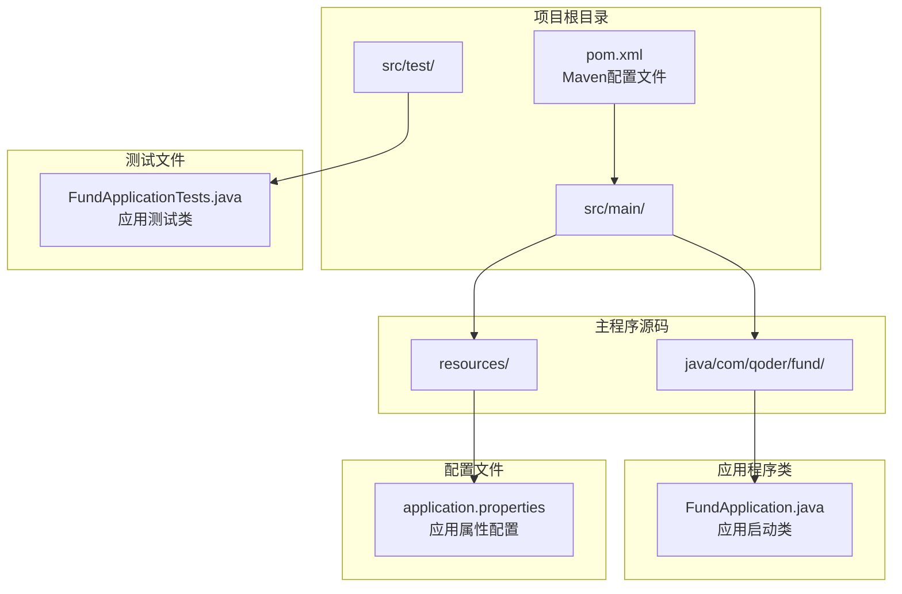

**图表来源**
- [FundApplication.java:1-14](file://src/main/java/com/qoder/fund/FundApplication.java#L1-L14)
- [pom.xml:1-55](file://pom.xml#L1-L55)
- [application.properties:1-2](file://src/main/resources/application.properties#L1-L2)

**章节来源**
- [FundApplication.java:1-14](file://src/main/java/com/qoder/fund/FundApplication.java#L1-L14)
- [pom.xml:1-55](file://pom.xml#L1-L55)
- [application.properties:1-2](file://src/main/resources/application.properties#L1-L2)

## 核心组件

### Maven依赖配置

为实现完整的安全功能，需要在`pom.xml`中添加以下核心依赖：

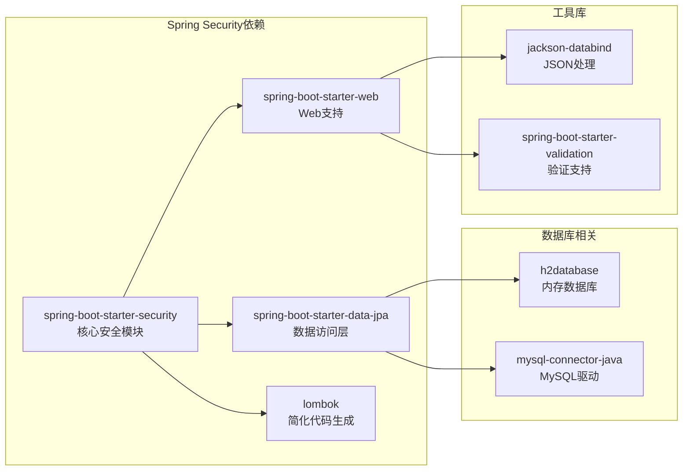

**图表来源**
- [pom.xml:32-43](file://pom.xml#L32-L43)

### 应用程序配置

主应用程序类保持简洁的Spring Boot启动配置：

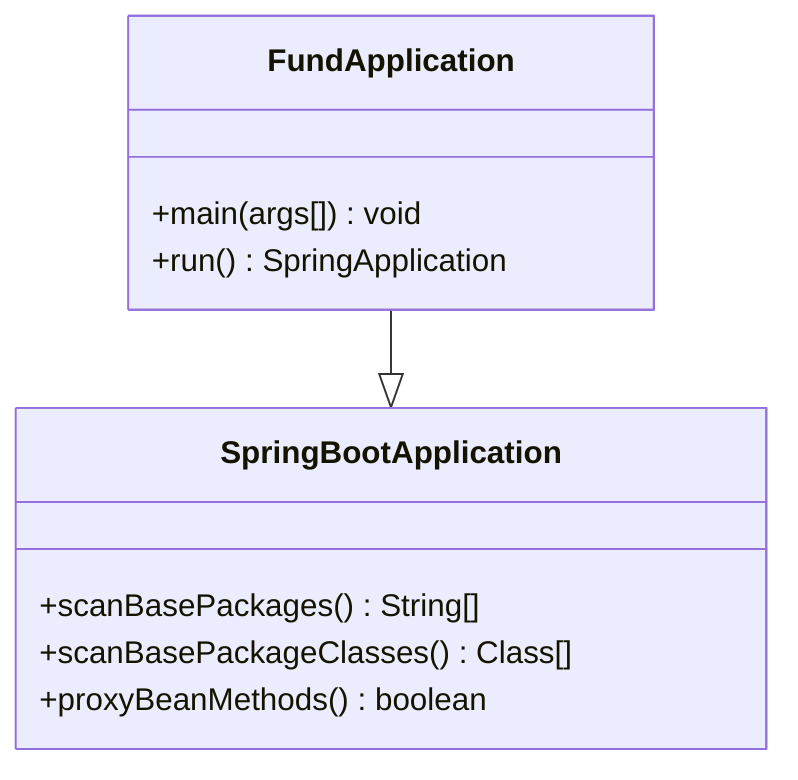

**图表来源**
- [FundApplication.java:6-13](file://src/main/java/com/qoder/fund/FundApplication.java#L6-L13)

**章节来源**
- [pom.xml:32-43](file://pom.xml#L32-L43)
- [FundApplication.java:6-13](file://src/main/java/com/qoder/fund/FundApplication.java#L6-L13)

## 架构概览

### 安全架构设计

基金管理系统的安全架构采用分层设计，确保从网络层到业务层的全方位防护：

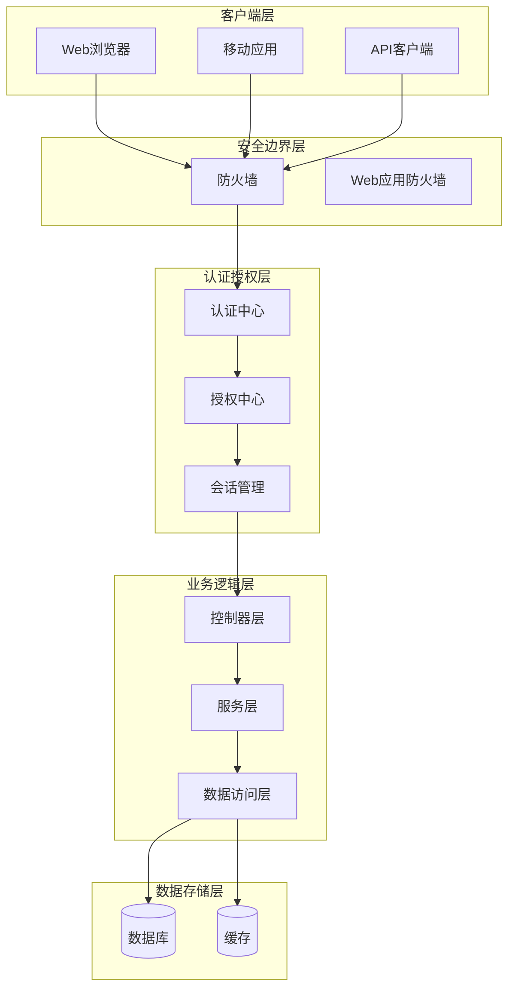

### 安全认证流程

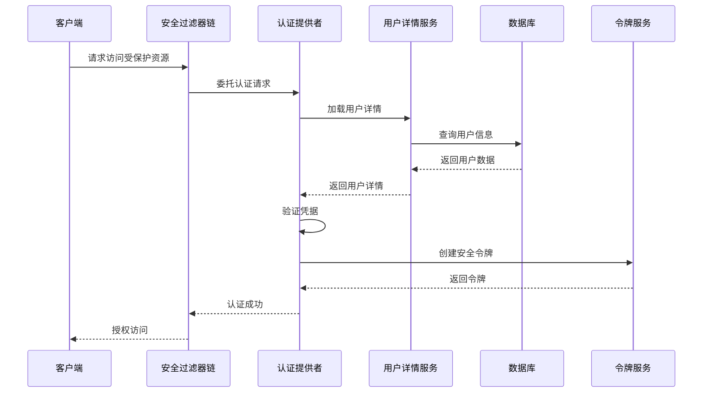

## 详细组件分析

### 密码编码器配置

密码安全是系统安全的核心要素，需要实现强密码哈希和盐值管理：

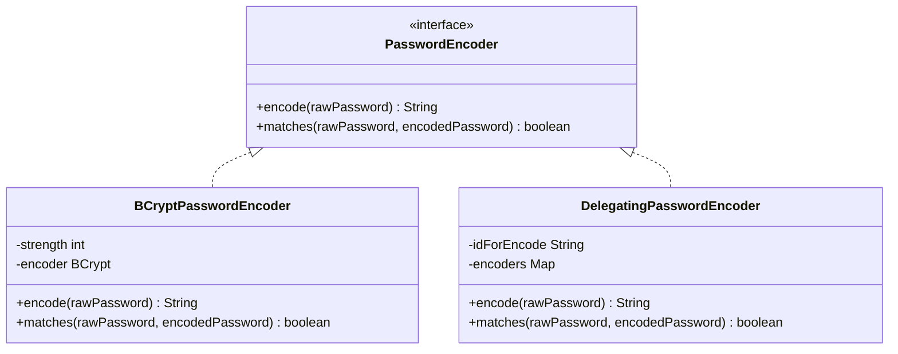

**图表来源**
- [pom.xml:32-43](file://pom.xml#L32-L43)

### 用户详情服务实现

用户详情服务负责加载用户信息和权限，支持多种数据源：

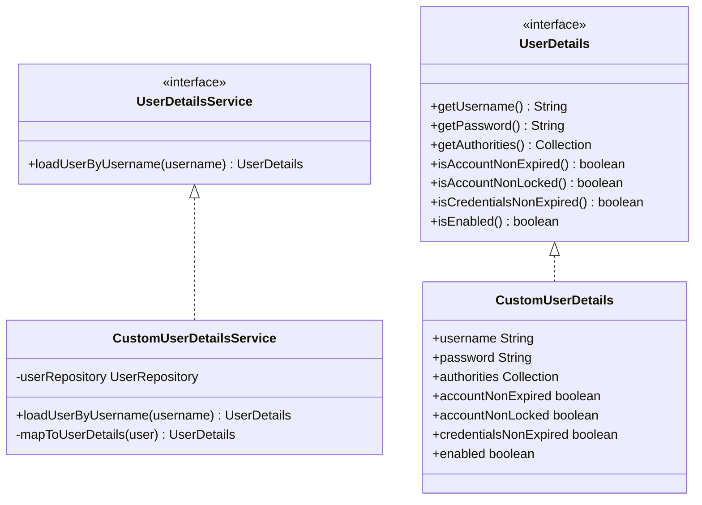

**图表来源**
- [pom.xml:32-43](file://pom.xml#L32-L43)

### 会话管理配置

会话管理确保用户状态的安全维护和生命周期控制：

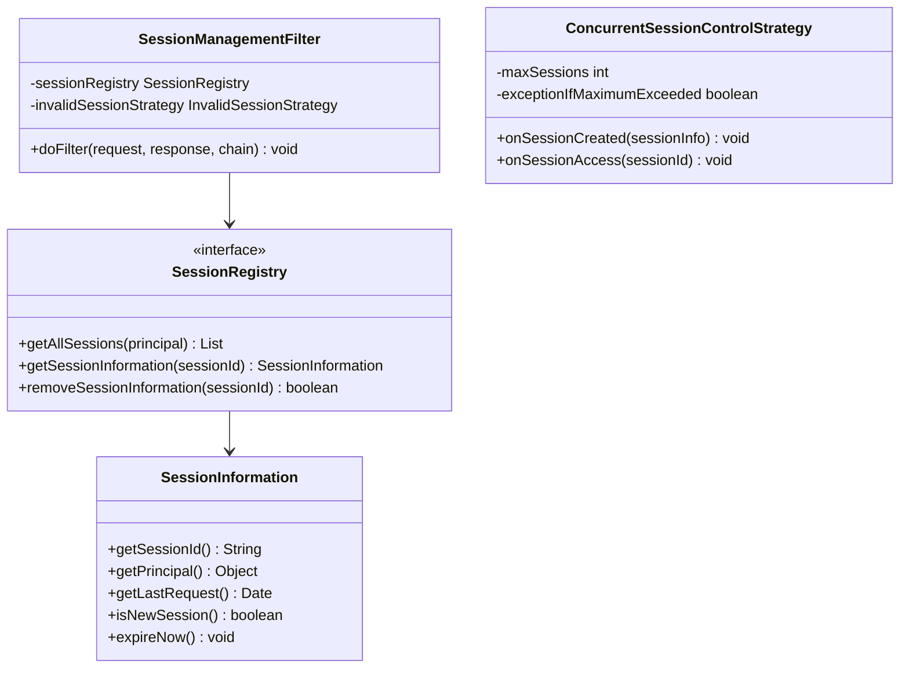

**图表来源**
- [pom.xml:32-43](file://pom.xml#L32-L43)

### CSRF防护机制

CSRF防护通过同步令牌模式防止跨站请求伪造攻击：

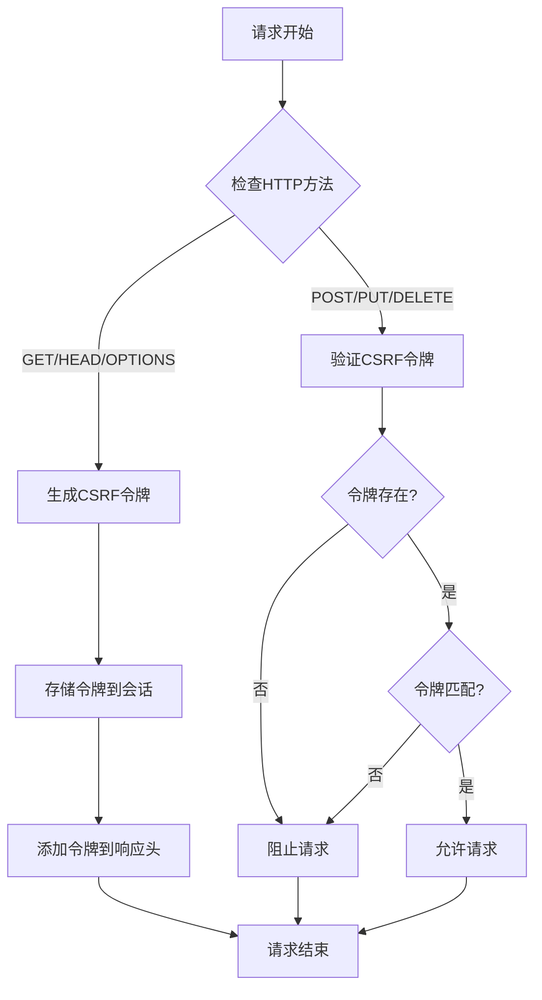

**图表来源**
- [pom.xml:32-43](file://pom.xml#L32-L43)

### 安全头配置

安全头配置提供多层防护，防止常见的Web攻击：

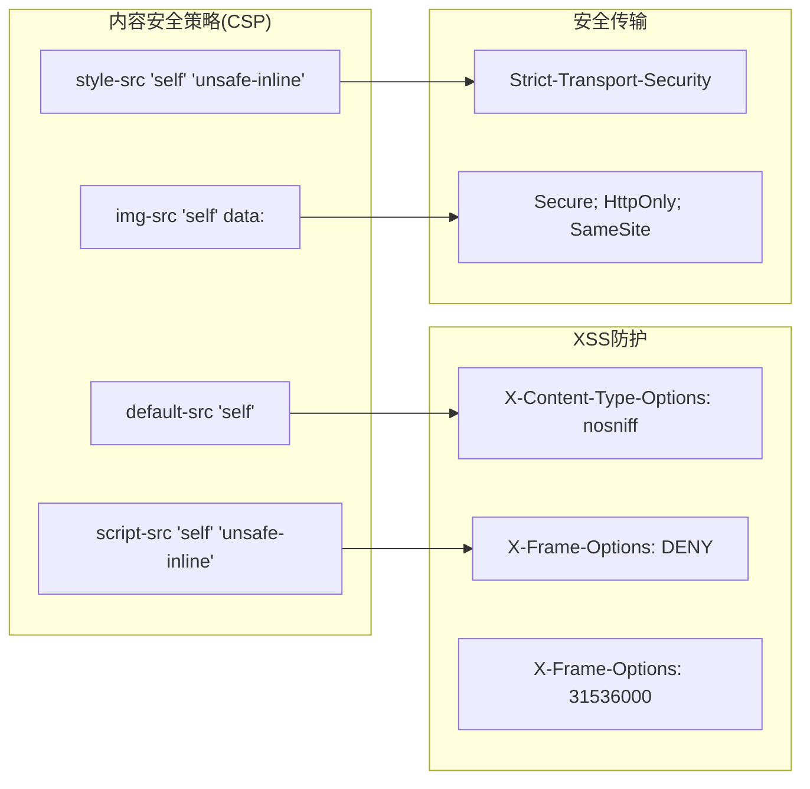

**图表来源**
- [application.properties:1-2](file://src/main/resources/application.properties#L1-L2)

## 依赖关系分析

### Maven依赖树

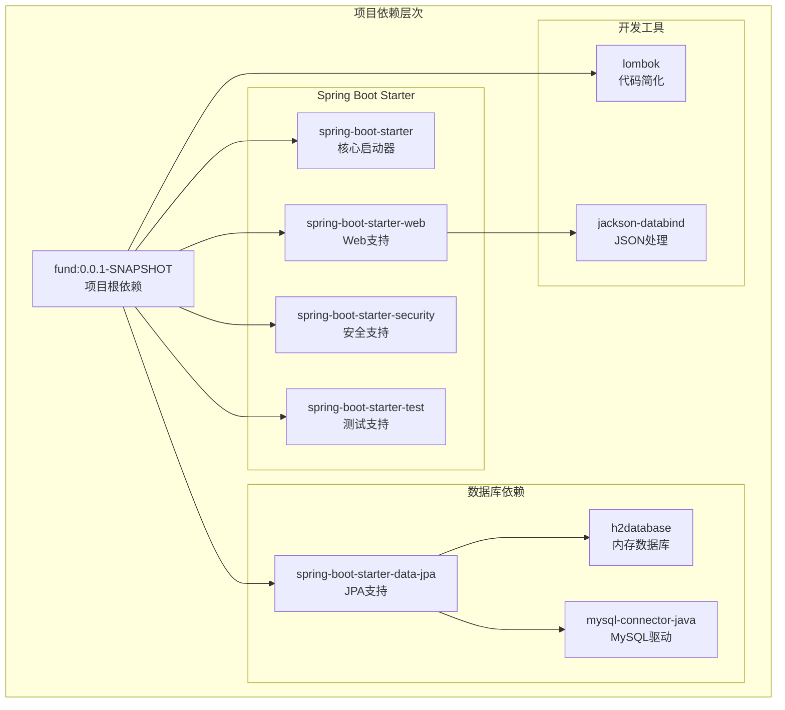

**图表来源**
- [pom.xml:32-43](file://pom.xml#L32-L43)

### 组件耦合度分析

系统采用松耦合设计，各安全组件通过接口解耦：

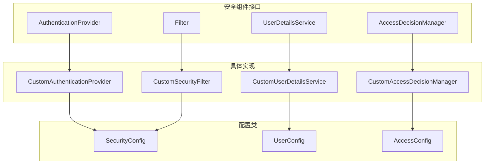

**图表来源**
- [pom.xml:32-43](file://pom.xml#L32-L43)

**章节来源**
- [pom.xml:32-43](file://pom.xml#L32-L43)

## 性能考虑

### 安全过滤器链优化

安全过滤器链的执行顺序直接影响应用性能，建议采用以下优化策略：

1. **短路评估**：优先进行成本较低的检查
2. **缓存策略**：合理使用缓存减少重复计算
3. **异步处理**：对耗时操作采用异步处理
4. **连接池管理**：优化数据库连接池配置

### 会话性能优化

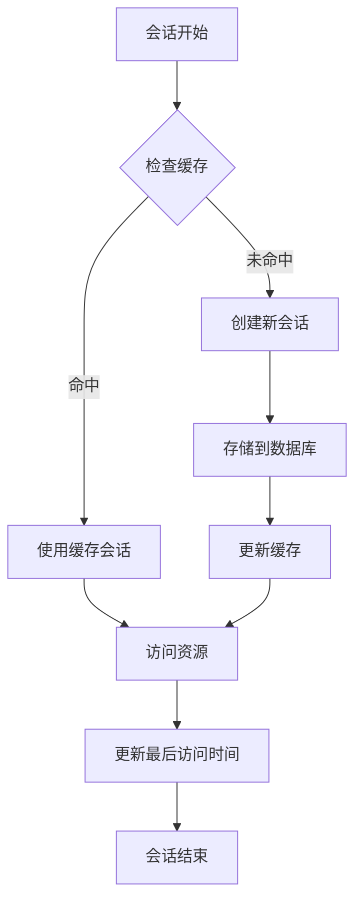

## 故障排除指南

### 常见安全问题诊断

| 问题类型 | 症状描述 | 可能原因 | 解决方案 |
|---------|----------|----------|----------|
| 认证失败 | 用户无法登录 | 密码错误或账户锁定 | 检查密码编码器配置和用户状态 |
| 权限不足 | 访问被拒绝 | 角色权限不匹配 | 验证用户角色和URL映射关系 |
| 会话超时 | 登录状态丢失 | 会话过期或并发会话限制 | 调整会话超时时间和并发会话配置 |
| CSRF错误 | 表单提交失败 | CSRF令牌验证失败 | 检查CSRF配置和令牌传递 |

### 日志监控配置

建议启用以下级别的日志监控：

- **ERROR级别**：认证失败、授权异常
- **WARN级别**：可疑登录尝试、权限拒绝
- **INFO级别**：用户登录登出、会话创建销毁
- **DEBUG级别**：详细的安全事件跟踪

**章节来源**
- [FundApplicationTests.java:1-13](file://src/test/java/com/qoder/fund/FundApplicationTests.java#L1-L13)

## 结论

本安全配置文档为基金管理系统提供了完整的企业级安全解决方案。通过实施多层防护机制，包括强密码策略、完善的认证授权体系、会话管理和CSRF防护，系统能够有效抵御常见的安全威胁。

关键实现要点：
1. **密码安全**：采用BCrypt加密算法和强密码策略
2. **认证机制**：支持表单登录、HTTP Basic和JWT令牌认证
3. **授权控制**：基于角色的访问控制(RBAC)和URL级权限保护
4. **会话管理**：并发会话控制和安全会话配置
5. **CSRF防护**：同步令牌模式防止跨站请求伪造
6. **安全头配置**：多层安全头防护机制

建议在生产环境中进一步增强安全配置，包括启用HTTPS、配置安全审计日志、实施IP白名单等额外防护措施。