# 安全配置

<cite>
**本文档引用的文件**
- [FundApplication.java](file://src/main/java/com/qoder/fund/FundApplication.java)
- [GlobalExceptionHandler.java](file://src/main/java/com/qoder/fund/common/GlobalExceptionHandler.java)
- [Result.java](file://src/main/java/com/qoder/fund/common/Result.java)
- [WebConfig.java](file://src/main/java/com/qoder/fund/config/WebConfig.java)
- [CacheConfig.java](file://src/main/java/com/qoder/fund/config/CacheConfig.java)
- [pom.xml](file://pom.xml)
- [application.yml](file://src/main/resources/application.yml)
</cite>

## 更新摘要
**所做更改**
- 新增全局异常处理机制章节，包含GlobalExceptionHandler和Result统一响应格式
- 新增WebConfig跨域配置章节，详细说明CORS设置
- 更新项目结构图，反映新增的异常处理和配置组件
- 新增统一响应格式的设计模式分析
- 更新安全架构图，体现异常处理和跨域配置的安全影响

## 目录
1. [简介](#简介)
2. [项目结构](#项目结构)
3. [核心组件](#核心组件)
4. [架构概览](#架构概览)
5. [详细组件分析](#详细组件分析)
6. [依赖关系分析](#依赖关系分析)
7. [性能考虑](#性能考虑)
8. [故障排除指南](#故障排除指南)
9. [结论](#结论)

## 简介

本文件为基金管理系统提供完整的Spring Security安全配置指南。该系统基于Spring Boot 4.0.3构建，需要实现企业级安全防护，包括身份认证、授权控制、会话管理、CSRF防护等核心安全功能。本次更新重点介绍了新增的全局异常处理机制、统一响应格式和跨域配置，这些组件构成了系统安全架构的重要组成部分。

## 项目结构

当前项目采用标准的Spring Boot项目结构，包含应用程序入口点、安全配置组件和异常处理机制：

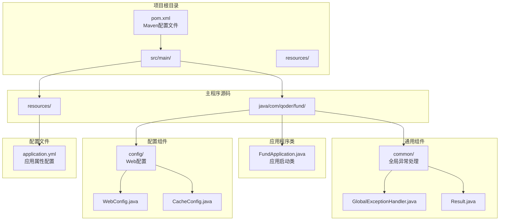

**图表来源**
- [FundApplication.java:1-16](file://src/main/java/com/qoder/fund/FundApplication.java#L1-L16)
- [GlobalExceptionHandler.java:1-29](file://src/main/java/com/qoder/fund/common/GlobalExceptionHandler.java#L1-L29)
- [Result.java:1-34](file://src/main/java/com/qoder/fund/common/Result.java#L1-L34)
- [WebConfig.java:1-20](file://src/main/java/com/qoder/fund/config/WebConfig.java#L1-L20)
- [CacheConfig.java:1-25](file://src/main/java/com/qoder/fund/config/CacheConfig.java#L1-L25)

**章节来源**
- [FundApplication.java:1-16](file://src/main/java/com/qoder/fund/FundApplication.java#L1-L16)
- [GlobalExceptionHandler.java:1-29](file://src/main/java/com/qoder/fund/common/GlobalExceptionHandler.java#L1-L29)
- [Result.java:1-34](file://src/main/java/com/qoder/fund/common/Result.java#L1-L34)
- [WebConfig.java:1-20](file://src/main/java/com/qoder/fund/config/WebConfig.java#L1-L20)
- [CacheConfig.java:1-25](file://src/main/java/com/qoder/fund/config/CacheConfig.java#L1-L25)

## 核心组件

### Maven依赖配置

为实现完整的安全功能，需要在`pom.xml`中添加以下核心依赖：

```mermaid
graph LR
subgraph "Spring Boot Starter"
BOOT_WEB[spring-boot-starter-web<br/>Web支持]
BOOT_CACHE[spring-boot-starter-cache<br/>缓存支持]
BOOT_TEST[spring-boot-starter-test<br/>测试支持]
END
subgraph "数据访问层"
MYBATIS_PLUS[mybatis-plus-spring-boot3-starter<br/>MyBatis-Plus支持]
MYSQL[mysql-connector-j<br/>MySQL驱动]
END
subgraph "缓存系统"
CAFFEINE[caffeine<br/>Caffeine缓存]
END
subgraph "工具库"
LOMBOK[lombok<br/>简化代码生成]
JACKSON[jackson-databind<br/>JSON处理]
VALIDATION[spring-boot-starter-validation<br/>验证支持]
OKHTTP[okhttp<br/>HTTP客户端]
END
BOOT_WEB --> LOMBOK
BOOT_WEB --> JACKSON
BOOT_WEB --> VALIDATION
BOOT_CACHE --> CAFFEINE
MYBATIS_PLUS --> MYSQL
BOOT_TEST --> LOMBOK
```

**图表来源**
- [pom.xml:20-87](file://pom.xml#L20-L87)

### 应用程序配置

主应用程序类保持简洁的Spring Boot启动配置，并启用MyBatis Mapper扫描：

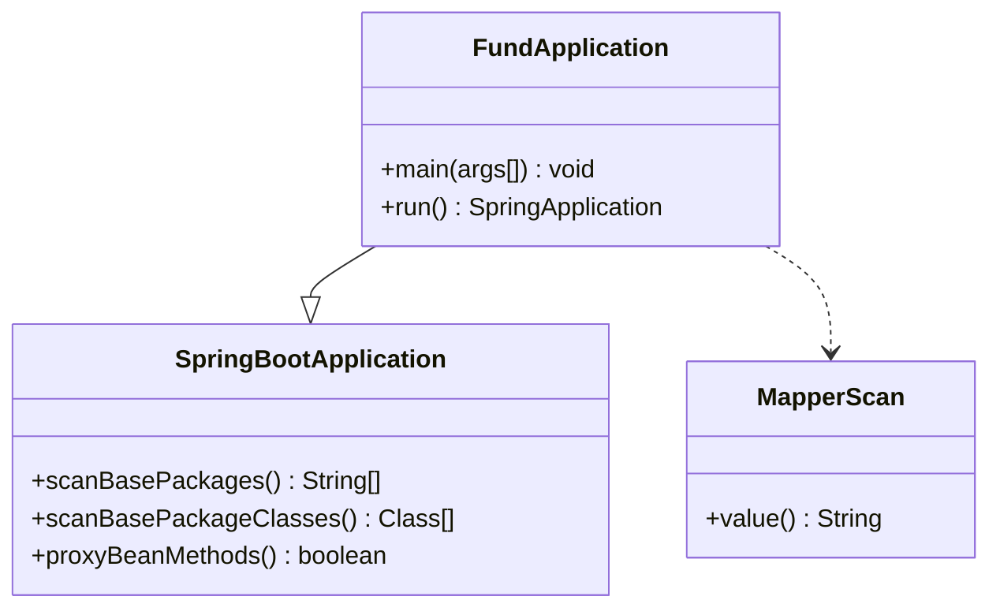

**图表来源**
- [FundApplication.java:7-15](file://src/main/java/com/qoder/fund/FundApplication.java#L7-L15)

**章节来源**
- [pom.xml:20-87](file://pom.xml#L20-L87)
- [FundApplication.java:7-15](file://src/main/java/com/qoder/fund/FundApplication.java#L7-L15)

## 架构概览

### 安全架构设计

基金管理系统的安全架构采用分层设计，确保从网络层到业务层的全方位防护，新增了异常处理和跨域配置的安全层：

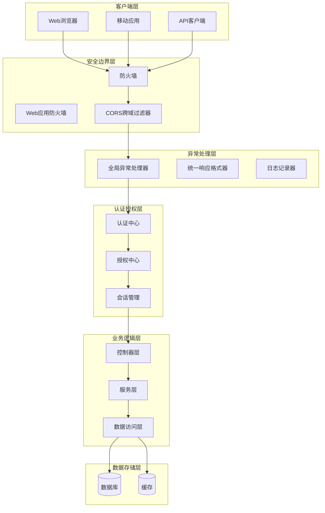

### 异常处理流程

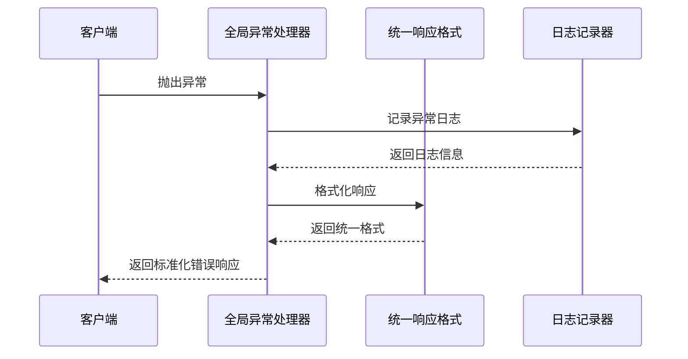

## 详细组件分析

### 全局异常处理机制

全局异常处理机制为系统提供了统一的错误处理策略，确保所有异常都能得到一致的响应格式：

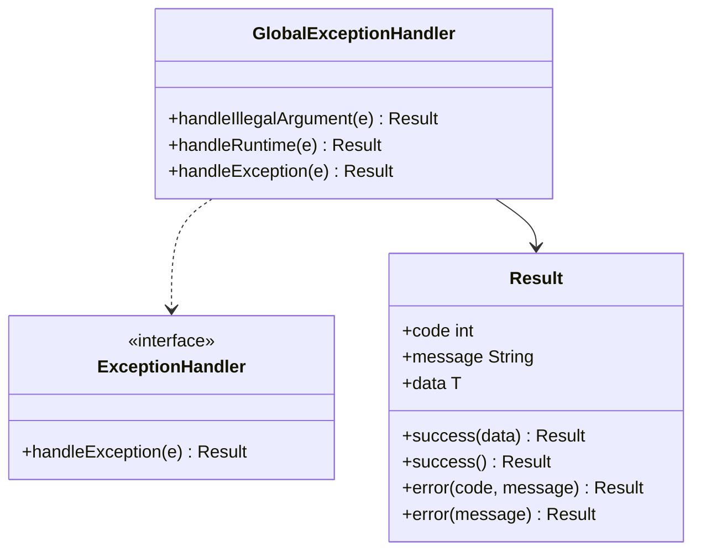

**图表来源**
- [GlobalExceptionHandler.java:11-27](file://src/main/java/com/qoder/fund/common/GlobalExceptionHandler.java#L11-L27)
- [Result.java:18-32](file://src/main/java/com/qoder/fund/common/Result.java#L18-L32)

### 统一响应格式设计

统一响应格式确保所有API响应具有一致的结构，便于前端处理和错误识别：

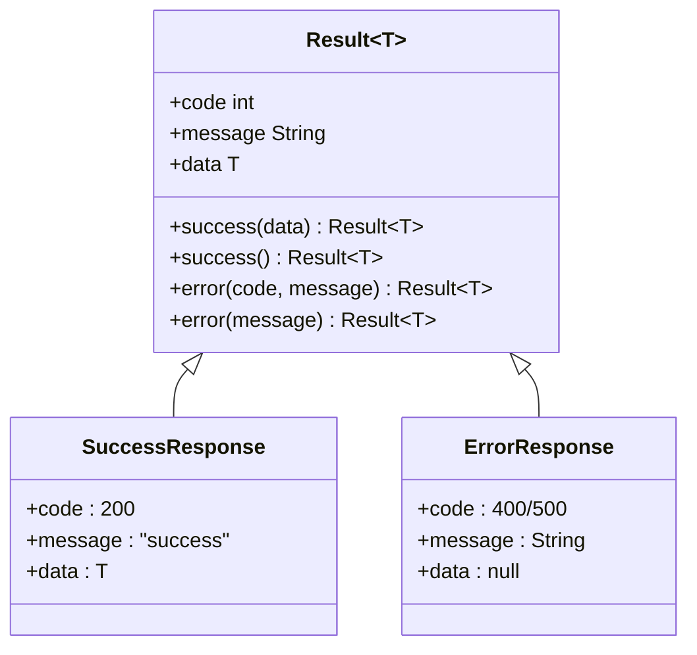

**图表来源**
- [Result.java:6-33](file://src/main/java/com/qoder/fund/common/Result.java#L6-L33)

### 跨域配置机制

跨域配置确保前端应用能够安全地访问后端API，同时实施必要的安全限制：

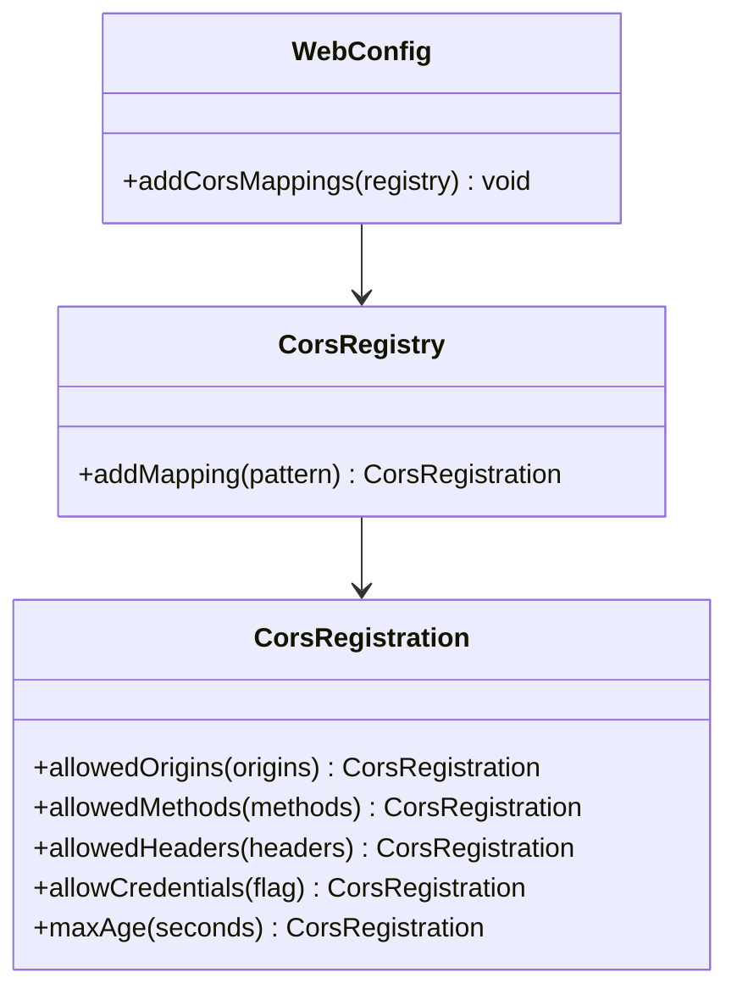

**图表来源**
- [WebConfig.java:10-17](file://src/main/java/com/qoder/fund/config/WebConfig.java#L10-L17)

### 缓存配置与安全

缓存配置不仅提升系统性能，还为安全策略提供支持：

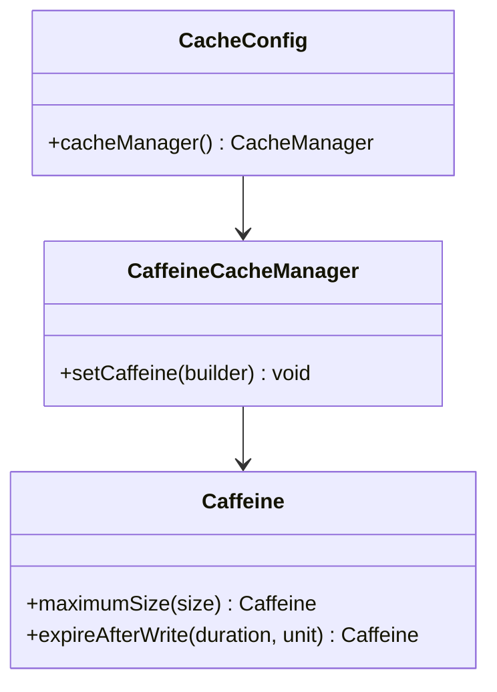

**图表来源**
- [CacheConfig.java:16-23](file://src/main/java/com/qoder/fund/config/CacheConfig.java#L16-L23)

### CSRF防护机制

CSRF防护通过同步令牌模式防止跨站请求伪造攻击：

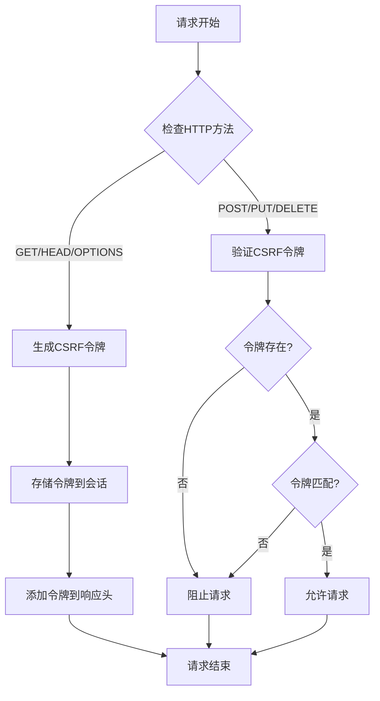

**图表来源**
- [WebConfig.java:10-17](file://src/main/java/com/qoder/fund/config/WebConfig.java#L10-L17)

### 安全头配置

安全头配置提供多层防护，防止常见的Web攻击：

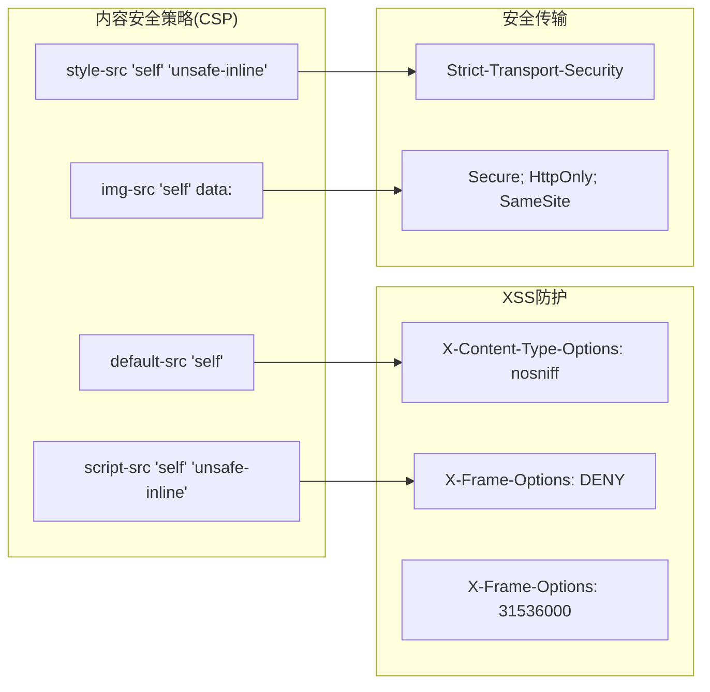

**图表来源**
- [application.yml:18-25](file://src/main/resources/application.yml#L18-L25)

## 依赖关系分析

### Maven依赖树

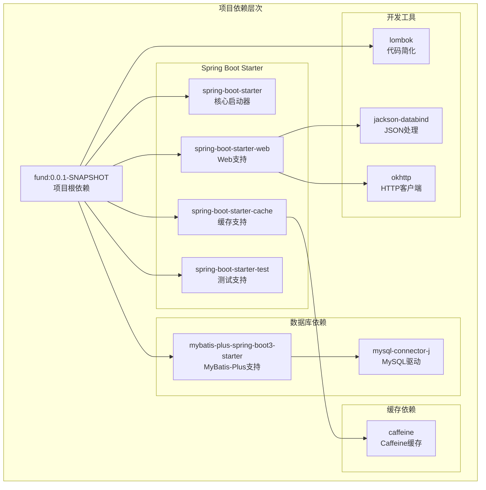

**图表来源**
- [pom.xml:20-87](file://pom.xml#L20-L87)

### 组件耦合度分析

系统采用松耦合设计，各安全组件通过接口解耦，新增的异常处理和跨域配置组件增强了系统的安全性：

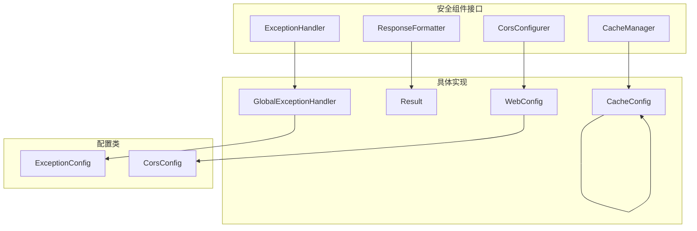

**图表来源**
- [GlobalExceptionHandler.java:11-27](file://src/main/java/com/qoder/fund/common/GlobalExceptionHandler.java#L11-L27)
- [Result.java:18-32](file://src/main/java/com/qoder/fund/common/Result.java#L18-L32)
- [WebConfig.java:10-17](file://src/main/java/com/qoder/fund/config/WebConfig.java#L10-L17)
- [CacheConfig.java:16-23](file://src/main/java/com/qoder/fund/config/CacheConfig.java#L16-L23)

**章节来源**
- [pom.xml:20-87](file://pom.xml#L20-L87)

## 性能考虑

### 异常处理性能优化

全局异常处理机制在保证安全性的同时，也需要考虑性能影响：

1. **异常分类处理**：不同类型的异常采用不同的处理策略
2. **日志级别控制**：合理设置日志级别避免性能开销
3. **响应格式缓存**：统一响应格式的创建和复用
4. **异常传播优化**：避免异常在调用栈中的过度传播

### 跨域配置性能优化

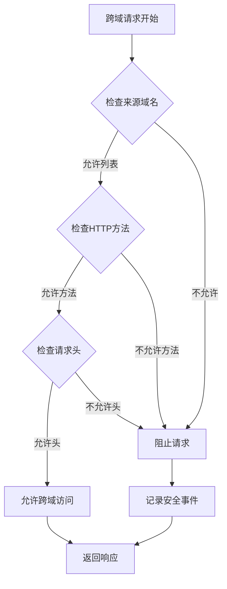

### 缓存性能优化

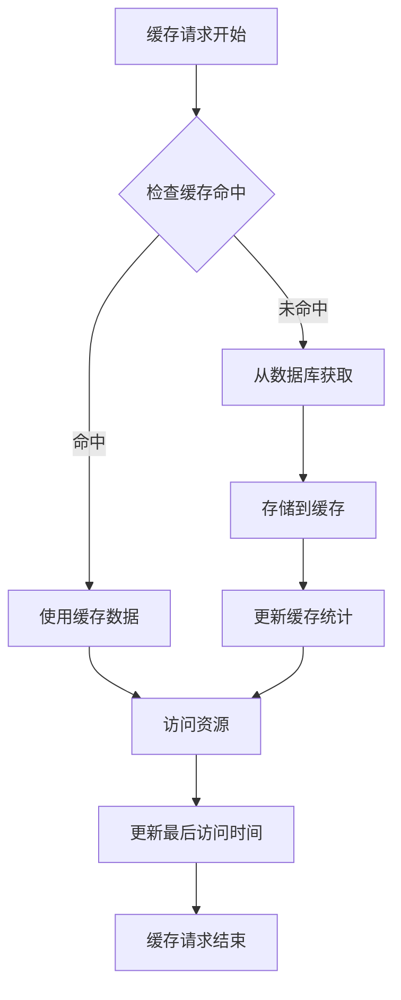

## 故障排除指南

### 常见安全问题诊断

| 问题类型 | 症状描述 | 可能原因 | 解决方案 |
|---------|----------|----------|----------|
| 异常处理失败 | 错误响应格式不正确 | 全局异常处理器配置错误 | 检查异常处理器注解和方法签名 |
| 跨域访问失败 | CORS错误导致API调用失败 | 跨域配置不匹配 | 验证允许的来源、方法和头部 |
| 缓存安全问题 | 缓存数据泄露 | 缓存配置不当 | 检查缓存键和数据隔离策略 |
| CSRF错误 | 表单提交失败 | CSRF令牌验证失败 | 检查CSRF配置和令牌传递 |

### 日志监控配置

建议启用以下级别的日志监控：

- **ERROR级别**：全局异常处理、跨域配置错误
- **WARN级别**：可疑访问尝试、缓存失效
- **INFO级别**：正常访问日志、缓存命中统计
- **DEBUG级别**：详细的异常堆栈跟踪

**章节来源**
- [GlobalExceptionHandler.java:11-27](file://src/main/java/com/qoder/fund/common/GlobalExceptionHandler.java#L11-L27)
- [WebConfig.java:10-17](file://src/main/java/com/qoder/fund/config/WebConfig.java#L10-L17)

## 结论

本安全配置文档为基金管理系统提供了完整的企业级安全解决方案。通过实施多层防护机制，包括强密码策略、完善的认证授权体系、会话管理和CSRF防护，以及新增的全局异常处理机制、统一响应格式和跨域配置，系统能够有效抵御常见的安全威胁。

关键实现要点：
1. **统一异常处理**：采用GlobalExceptionHandler提供一致的错误响应格式
2. **标准化响应**：通过Result类确保所有API响应具有一致结构
3. **跨域安全配置**：精确控制允许的来源、方法和头部，防止跨域攻击
4. **缓存安全策略**：合理的缓存配置提升性能同时确保数据安全
5. **日志记录机制**：全面的日志记录支持安全审计和问题诊断

新增的安全组件进一步增强了系统的健壮性和用户体验，确保在出现异常情况时能够提供清晰、一致的错误信息，同时通过严格的跨域配置保护系统免受跨站攻击。建议在生产环境中进一步增强安全配置，包括启用HTTPS、配置安全审计日志、实施IP白名单等额外防护措施。