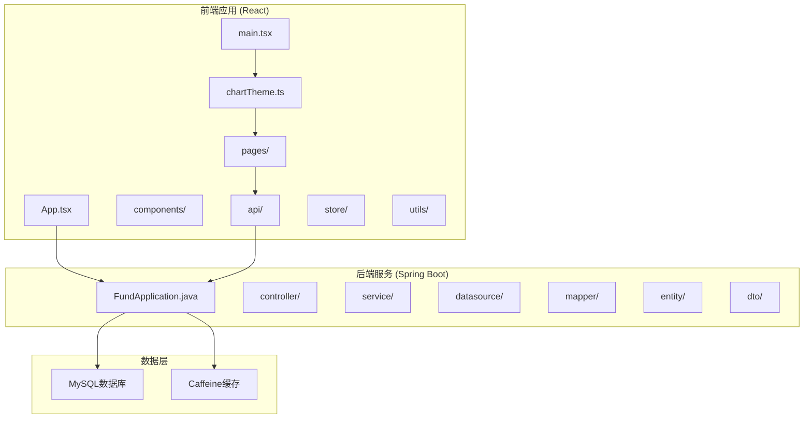
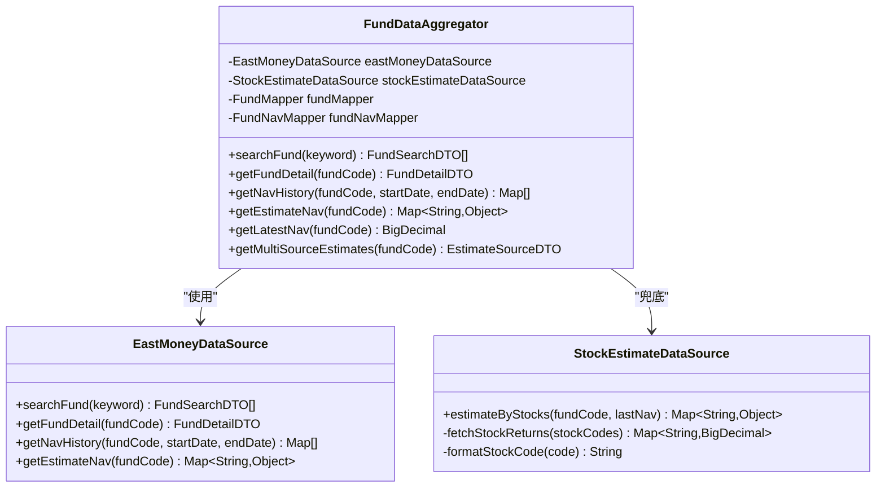
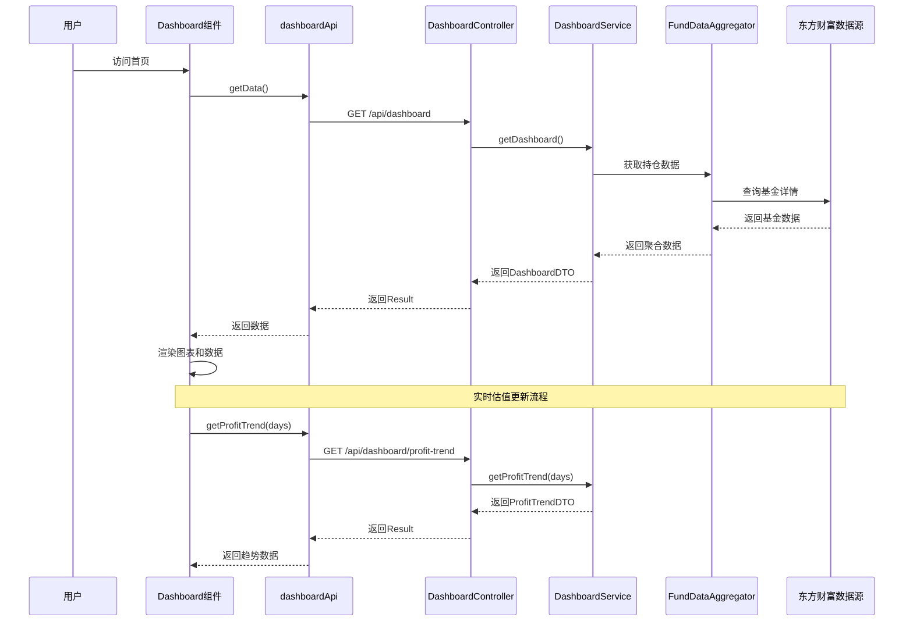
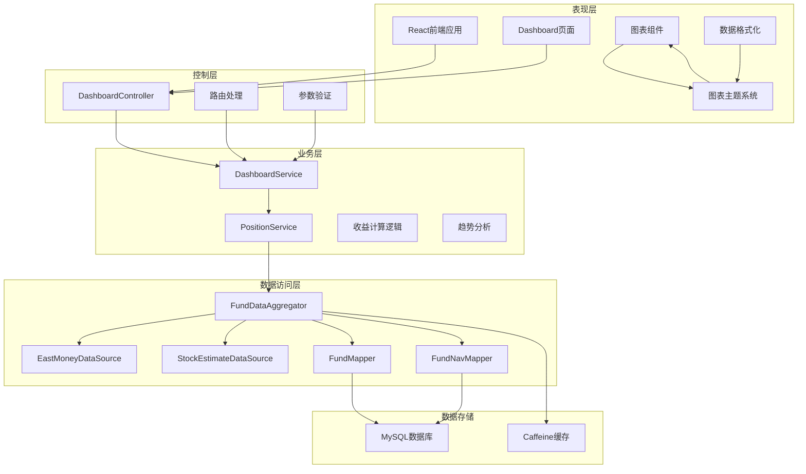
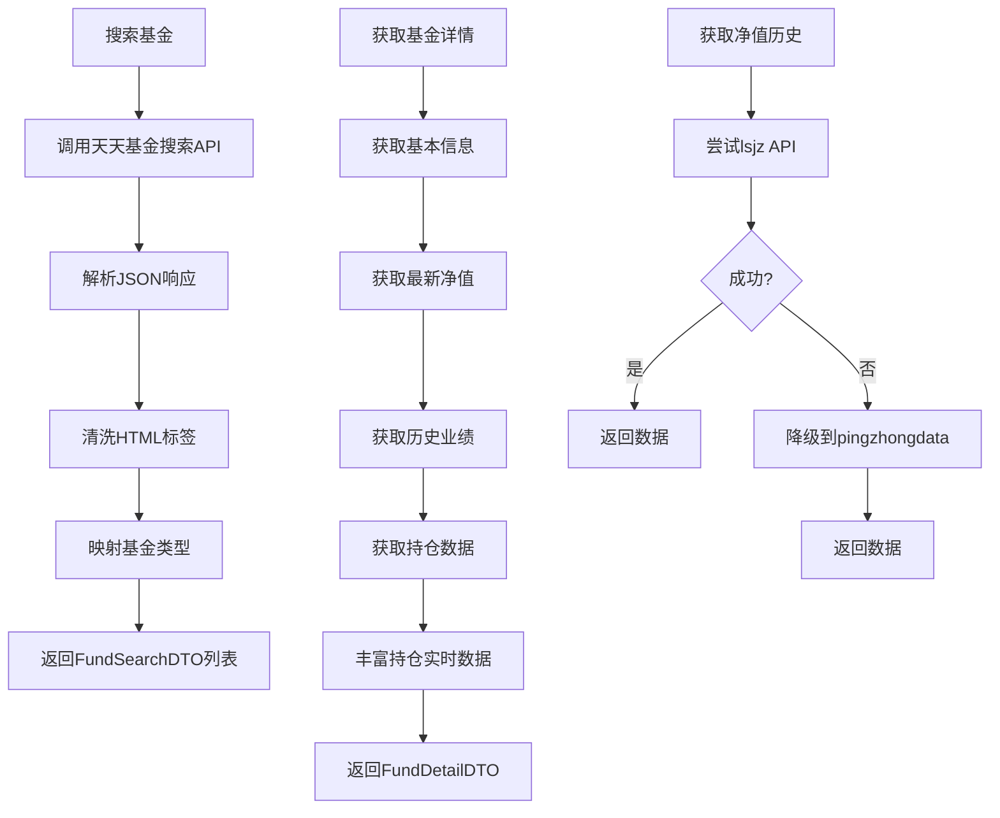
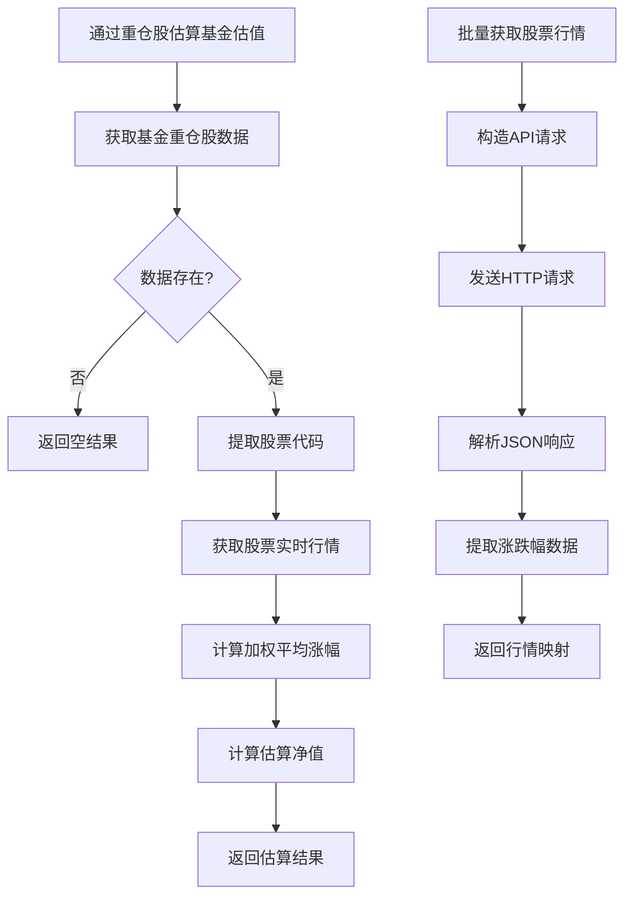
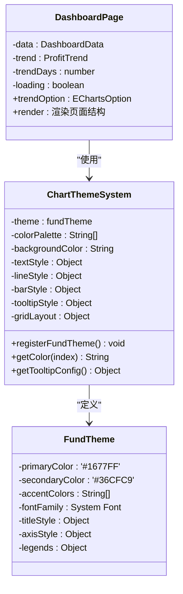
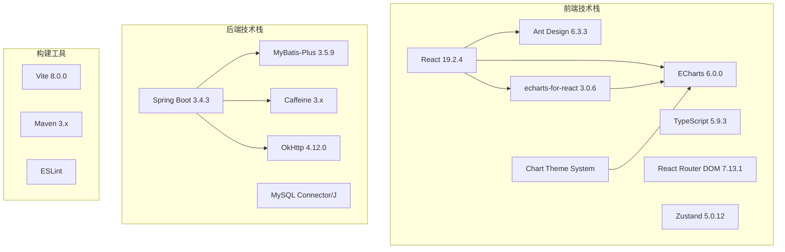
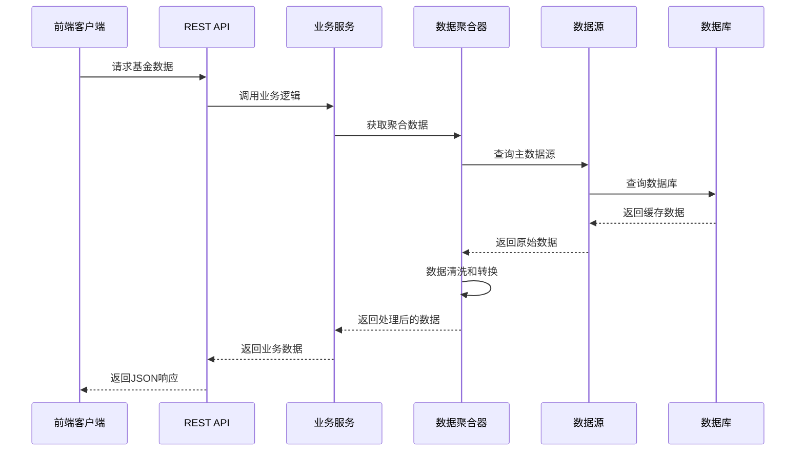
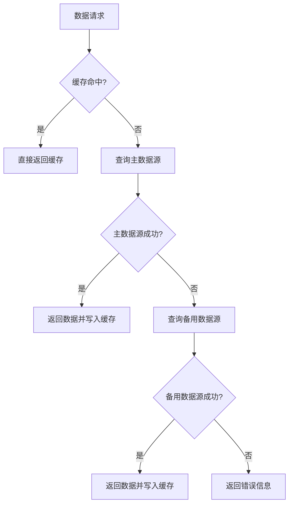

# 实时市场数据可视化

<cite>
**本文档引用的文件**
- [PRD.md](file://PRD.md)
- [application.yml](file://src/main/resources/application.yml)
- [package.json](file://fund-web/package.json)
- [pom.xml](file://pom.xml)
- [FundApplication.java](file://src/main/java/com/qoder/fund/FundApplication.java)
- [EastMoneyDataSource.java](file://src/main/java/com/qoder/fund/datasource/EastMoneyDataSource.java)
- [FundDataAggregator.java](file://src/main/java/com/qoder/fund/datasource/FundDataAggregator.java)
- [StockEstimateDataSource.java](file://src/main/java/com/qoder/fund/datasource/StockEstimateDataSource.java)
- [DashboardController.java](file://src/main/java/com/qoder/fund/controller/DashboardController.java)
- [DashboardService.java](file://src/main/java/com/qoder/fund/service/DashboardService.java)
- [schema.sql](file://src/main/resources/db/schema.sql)
- [App.tsx](file://fund-web/src/App.tsx)
- [index.tsx](file://fund-web/src/pages/Dashboard/index.tsx)
- [dashboard.ts](file://fund-web/src/api/dashboard.ts)
- [PriceChange.tsx](file://fund-web/src/components/PriceChange.tsx)
- [chartTheme.ts](file://fund-web/src/utils/chartTheme.ts)
- [main.tsx](file://fund-web/src/main.tsx)
</cite>

## 更新摘要
**变更内容**
- 新增专用图表主题配置系统，提供统一的视觉风格
- 增强收益趋势图表的主题化展示效果
- 优化图表组件的样式一致性和用户体验
- 完善数据可视化组件的配置和渲染机制

## 目录
1. [项目概述](#项目概述)
2. [项目结构](#项目结构)
3. [核心组件](#核心组件)
4. [架构概览](#架构概览)
5. [详细组件分析](#详细组件分析)
6. [依赖关系分析](#依赖关系分析)
7. [性能考虑](#性能考虑)
8. [故障排除指南](#故障排除指南)
9. [结论](#结论)

## 项目概述

"基金管家"是一个面向个人投资者的基金管理与查询Web应用，定位为"一站式基金数据聚合管理工具"。该项目专注于基金数据展示、持仓管理、收益分析和投资决策辅助，帮助用户高效管理分散在多个平台的基金投资。

### 产品特色

- **纯工具属性**：不做交易，不接触用户资金，零风险使用
- **Web优先**：无需下载App，浏览器直接使用，跨设备同步
- **数据聚合**：汇总多平台持仓，一屏掌握投资全貌
- **智能分析**：提供专业级收益归因、风险分析和资产配置建议

### 技术架构

系统采用前后端分离架构，后端使用Spring Boot + MyBatis-Plus，前端使用React + TypeScript，数据可视化采用ECharts。

## 项目结构



**图表来源**
- [FundApplication.java:1-16](file://src/main/java/com/qoder/fund/FundApplication.java#L1-L16)
- [App.tsx:1-65](file://fund-web/src/App.tsx#L1-L65)
- [chartTheme.ts:1-47](file://fund-web/src/utils/chartTheme.ts#L1-L47)
- [main.tsx:1-28](file://fund-web/src/main.tsx#L1-L28)

**章节来源**
- [PRD.md:1-488](file://PRD.md#L1-L488)
- [application.yml:1-43](file://src/main/resources/application.yml#L1-L43)
- [package.json:1-39](file://fund-web/package.json#L1-L39)
- [pom.xml:1-107](file://pom.xml#L1-L107)

## 核心组件

### 数据源聚合器

FundDataAggregator是系统的核心组件，负责多数据源的统一管理和聚合：



**图表来源**
- [FundDataAggregator.java:23-296](file://src/main/java/com/qoder/fund/datasource/FundDataAggregator.java#L23-L296)
- [EastMoneyDataSource.java:24-696](file://src/main/java/com/qoder/fund/datasource/EastMoneyDataSource.java#L24-L696)
- [StockEstimateDataSource.java:22-184](file://src/main/java/com/qoder/fund/datasource/StockEstimateDataSource.java#L22-L184)

### 前端数据可视化

Dashboard页面实现了完整的实时数据可视化，现已集成专用图表主题系统：



**图表来源**
- [index.tsx:12-184](file://fund-web/src/pages/Dashboard/index.tsx#L12-L184)
- [dashboard.ts:33-43](file://fund-web/src/api/dashboard.ts#L33-L43)
- [DashboardController.java:13-27](file://src/main/java/com/qoder/fund/controller/DashboardController.java#L13-L27)
- [DashboardService.java:22-83](file://src/main/java/com/qoder/fund/service/DashboardService.java#L22-L83)

**章节来源**
- [FundDataAggregator.java:23-296](file://src/main/java/com/qoder/fund/datasource/FundDataAggregator.java#L23-L296)
- [EastMoneyDataSource.java:24-696](file://src/main/java/com/qoder/fund/datasource/EastMoneyDataSource.java#L24-L696)
- [StockEstimateDataSource.java:22-184](file://src/main/java/com/qoder/fund/datasource/StockEstimateDataSource.java#L22-L184)
- [index.tsx:12-184](file://fund-web/src/pages/Dashboard/index.tsx#L12-L184)

## 架构概览

系统采用分层架构设计，确保各组件职责明确、耦合度低，并新增了专用的图表主题管理系统：



**图表来源**
- [App.tsx:21-65](file://fund-web/src/App.tsx#L21-L65)
- [DashboardController.java:10-27](file://src/main/java/com/qoder/fund/controller/DashboardController.java#L10-L27)
- [DashboardService.java:16-83](file://src/main/java/com/qoder/fund/service/DashboardService.java#L16-L83)
- [FundDataAggregator.java:24-296](file://src/main/java/com/qoder/fund/datasource/FundDataAggregator.java#L24-L296)
- [chartTheme.ts:44-46](file://fund-web/src/utils/chartTheme.ts#L44-L46)

## 详细组件分析

### 数据源适配器

#### 东方财富数据源

EastMoneyDataSource实现了完整的基金数据获取功能：



**图表来源**
- [EastMoneyDataSource.java:45-75](file://src/main/java/com/qoder/fund/datasource/EastMoneyDataSource.java#L45-L75)
- [EastMoneyDataSource.java:78-100](file://src/main/java/com/qoder/fund/datasource/EastMoneyDataSource.java#L78-L100)
- [EastMoneyDataSource.java:103-110](file://src/main/java/com/qoder/fund/datasource/EastMoneyDataSource.java#L103-L110)

#### 股票估值兜底数据源

StockEstimateDataSource提供了估值系统的兜底机制：



**图表来源**
- [StockEstimateDataSource.java:43-102](file://src/main/java/com/qoder/fund/datasource/StockEstimateDataSource.java#L43-L102)
- [StockEstimateDataSource.java:107-147](file://src/main/java/com/qoder/fund/datasource/StockEstimateDataSource.java#L107-L147)

### 前端可视化组件

#### 专用图表主题系统

系统新增了专门的图表主题配置，提供统一的视觉风格和交互体验：



**图表来源**
- [chartTheme.ts:3-46](file://fund-web/src/utils/chartTheme.ts#L3-L46)
- [index.tsx:40-53](file://fund-web/src/pages/Dashboard/index.tsx#L40-L53)

#### 收益趋势图表

Dashboard页面实现了交互式的收益趋势可视化，现已集成主题化配置：

```mermaid
classDiagram
class DashboardPage {
-data : DashboardData
-trend : ProfitTrend
-trendDays : number
-loading : boolean
+trendOption : EChartsOption
+useEffect : 初始化数据加载
+render : 渲染页面结构
+handleRefresh : 刷新数据
}
class ChartComponent {
-option : EChartsOption
-theme : 'fundTheme'
+tooltip : 触摸/鼠标交互
+xAxis : 日期轴
+yAxis : 收益轴
+series : 柱状图系列
+grid : 图表布局
}
class PriceChangeComponent {
-value : number
+formatPercent : 格式化百分比
+getProfitColor : 获取颜色
}
class ChartThemeSystem {
-themeName : 'fundTheme'
-colorPalette : ['#1677FF', '#36CFC9', '#FAAD14']
+itemStyle : {borderRadius : [4,4,0,0]}
+tooltipStyle : {boxShadow : '0 2px 8px rgba(0,0,0,0.1)'}
}
DashboardPage --> ChartComponent : "使用"
DashboardPage --> PriceChangeComponent : "使用"
ChartComponent --> ChartThemeSystem : "应用主题"
```

**图表来源**
- [index.tsx:12-184](file://fund-web/src/pages/Dashboard/index.tsx#L12-L184)
- [PriceChange.tsx:4-38](file://fund-web/src/components/PriceChange.tsx#L4-L38)
- [chartTheme.ts:44-46](file://fund-web/src/utils/chartTheme.ts#L44-L46)

**章节来源**
- [EastMoneyDataSource.java:24-696](file://src/main/java/com/qoder/fund/datasource/EastMoneyDataSource.java#L24-L696)
- [StockEstimateDataSource.java:22-184](file://src/main/java/com/qoder/fund/datasource/StockEstimateDataSource.java#L22-L184)
- [index.tsx:12-184](file://fund-web/src/pages/Dashboard/index.tsx#L12-L184)
- [PriceChange.tsx:1-38](file://fund-web/src/components/PriceChange.tsx#L1-L38)
- [chartTheme.ts:1-47](file://fund-web/src/utils/chartTheme.ts#L1-L47)

## 依赖关系分析

### 技术栈依赖

系统采用了现代化的技术栈组合，新增了图表主题管理功能：



**图表来源**
- [package.json:12-23](file://fund-web/package.json#L12-L23)
- [pom.xml:20-87](file://pom.xml#L20-L87)
- [chartTheme.ts:1](file://fund-web/src/utils/chartTheme.ts#L1)

### 数据流依赖



**图表来源**
- [DashboardController.java:17-25](file://src/main/java/com/qoder/fund/controller/DashboardController.java#L17-L25)
- [DashboardService.java:22-62](file://src/main/java/com/qoder/fund/service/DashboardService.java#L22-L62)
- [FundDataAggregator.java:44-61](file://src/main/java/com/qoder/fund/datasource/FundDataAggregator.java#L44-L61)

**章节来源**
- [package.json:1-39](file://fund-web/package.json#L1-L39)
- [pom.xml:1-107](file://pom.xml#L1-L107)
- [application.yml:18-25](file://src/main/resources/application.yml#L18-L25)

## 性能考虑

### 缓存策略

系统实现了多层次的缓存机制以提升性能：

1. **应用层缓存**：使用Caffeine本地缓存，配置最大1000条记录，300秒过期
2. **数据库缓存**：MySQL数据库优化，包含适当的索引
3. **前端缓存**：React组件级别的状态缓存

### 数据源优化



**图表来源**
- [application.yml:18-21](file://src/main/resources/application.yml#L18-L21)
- [FundDataAggregator.java:36-39](file://src/main/java/com/qoder/fund/datasource/FundDataAggregator.java#L36-L39)

### 前端性能优化

- **懒加载**：React.lazy实现组件懒加载
- **虚拟滚动**：大数据集时使用虚拟滚动
- **图表优化**：ECharts配置优化，减少重绘
- **状态管理**：Zustand轻量级状态管理
- **主题注册**：一次性注册图表主题，避免重复初始化

## 故障排除指南

### 常见问题诊断

#### 数据源连接问题

1. **检查网络连接**
   - 确认能够访问东方财富API
   - 检查防火墙设置

2. **验证API密钥**
   - 检查API访问权限
   - 确认请求头设置正确

#### 缓存问题

1. **清除缓存**
   ```bash
   # 清除Caffeine缓存
   curl -X POST http://localhost:8080/actuator/cache/flush
   ```

2. **检查数据库连接**
   ```sql
   -- 检查数据库连接状态
   SHOW STATUS LIKE 'Threads_connected';
   ```

#### 前端渲染问题

1. **检查ECharts配置**
   - 确认图表容器尺寸
   - 验证数据格式正确性
   - 检查主题是否正确注册

2. **调试工具**
   - 使用浏览器开发者工具
   - 检查网络请求状态
   - 验证图表主题配置

#### 图表主题问题

1. **主题注册检查**
   ```typescript
   // 确保在应用启动时注册主题
   import { registerFundTheme } from './utils/chartTheme';
   registerFundTheme();
   ```

2. **主题使用验证**
   ```typescript
   // 在图表组件中正确使用主题
   <ReactECharts option={trendOption} theme="fundTheme" />
   ```

**章节来源**
- [EastMoneyDataSource.java:598-632](file://src/main/java/com/qoder/fund/datasource/EastMoneyDataSource.java#L598-L632)
- [application.yml:18-21](file://src/main/resources/application.yml#L18-L21)
- [chartTheme.ts:44-46](file://fund-web/src/utils/chartTheme.ts#L44-L46)

## 结论

"基金管家"项目展现了现代Web应用的最佳实践，通过合理的架构设计和丰富的功能实现，为用户提供了一站式的基金数据管理解决方案。

### 技术亮点

1. **多数据源聚合**：实现了主数据源与备用数据源的无缝切换
2. **实时数据可视化**：通过ECharts实现了直观的收益趋势展示
3. **专用图表主题系统**：新增了统一的图表主题配置，提升了视觉一致性
4. **性能优化**：多层次缓存策略确保了良好的用户体验
5. **可扩展性**：模块化设计便于功能扩展和维护

### 新增功能特性

**图表主题系统**：系统新增了专用的图表主题配置，提供：
- 统一的颜色方案和视觉风格
- 优化的交互体验和用户界面
- 可定制的主题配置选项
- 与现有组件的无缝集成

### 未来发展方向

1. **增强分析功能**：扩展更多的收益分析和风险评估工具
2. **移动端优化**：针对移动设备进行深度优化
3. **AI辅助决策**：集成机器学习算法提供智能化投资建议
4. **多语言支持**：扩展国际化支持
5. **主题定制**：提供更多图表主题选择和自定义选项

该系统为个人投资者提供了一个强大而易用的基金数据管理平台，通过实时数据可视化和智能分析功能，帮助用户做出更明智的投资决策。新增的图表主题系统进一步提升了用户体验和视觉效果的一致性。