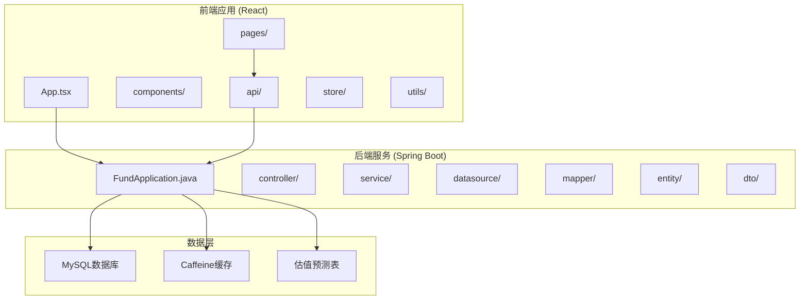
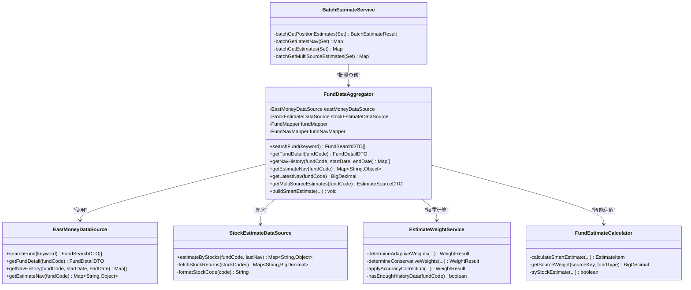
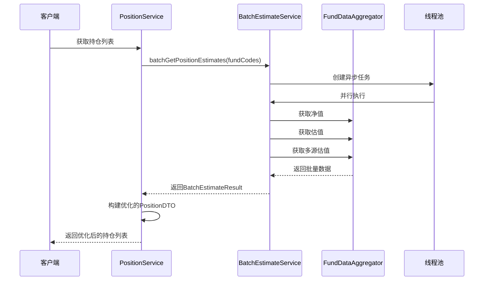
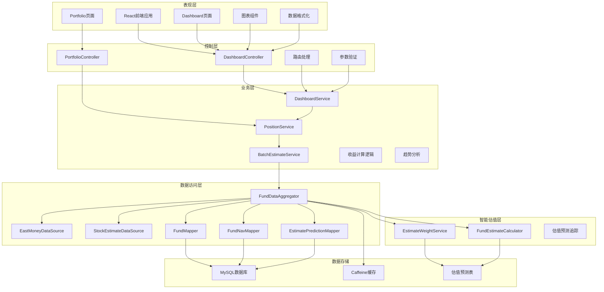
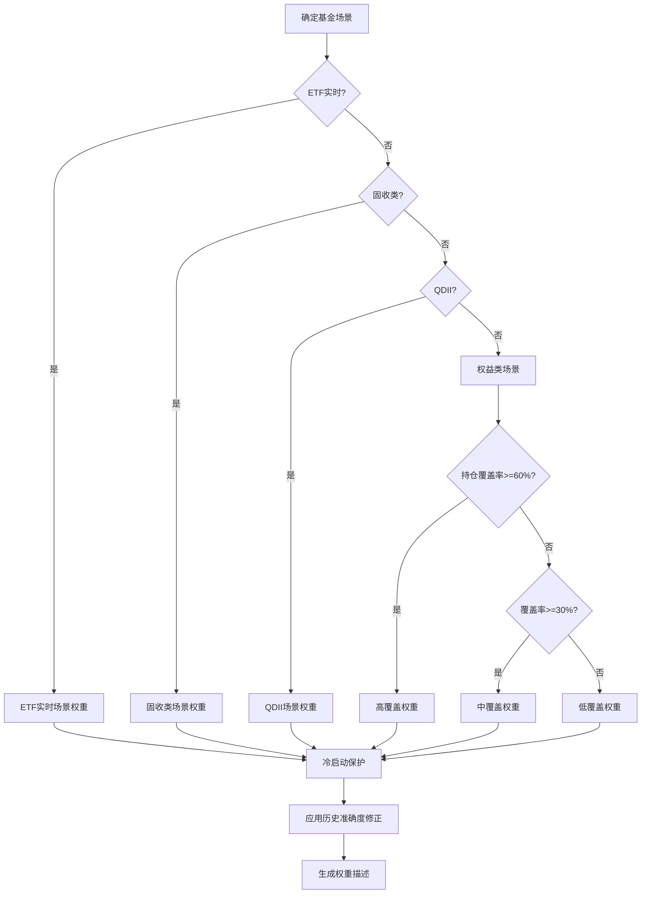
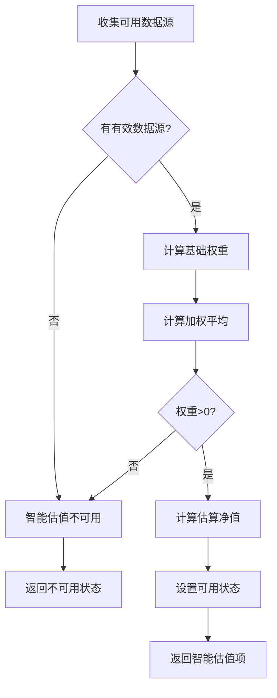
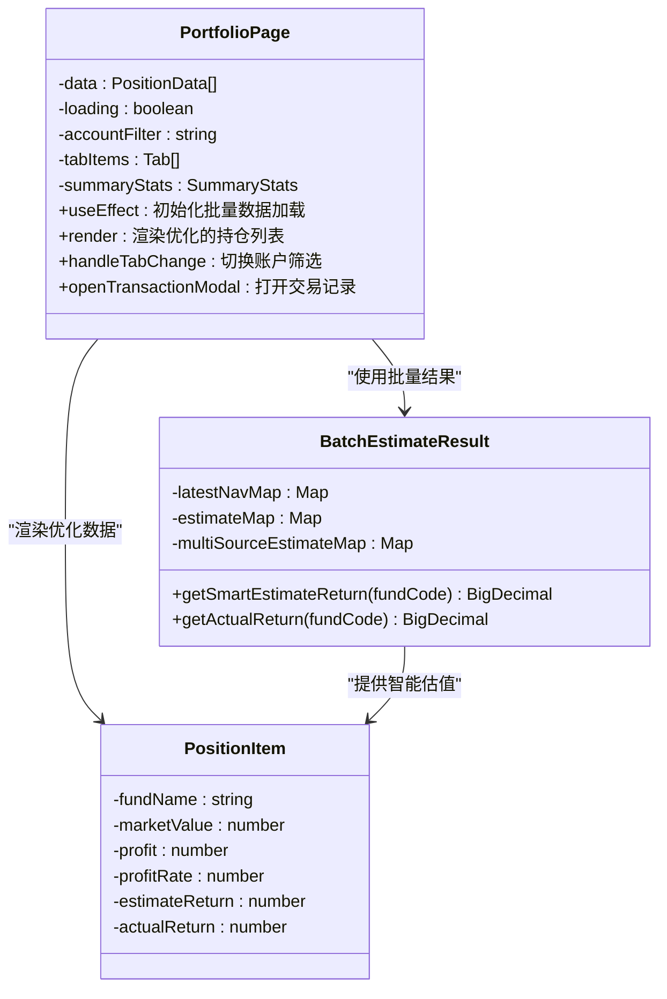
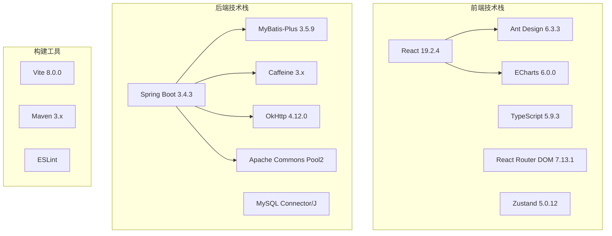
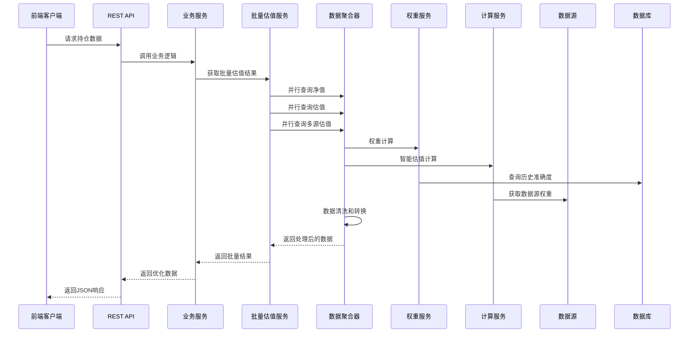
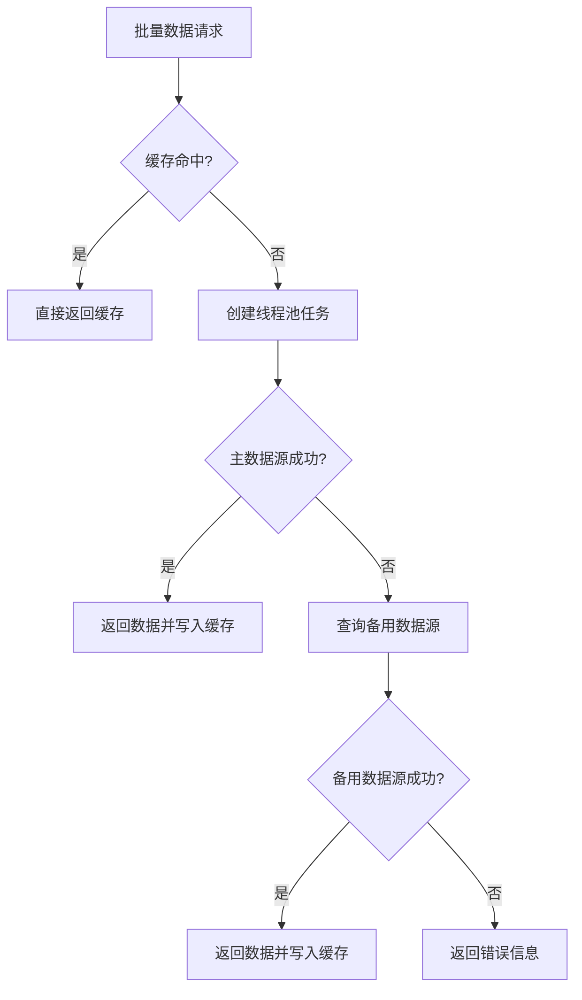

# 实时市场数据可视化

<cite>
**本文档引用的文件**
- [PRD.md](file://PRD.md)
- [application.yml](file://src/main/resources/application.yml)
- [package.json](file://fund-web/package.json)
- [pom.xml](file://pom.xml)
- [FundApplication.java](file://src/main/java/com/qoder/fund/FundApplication.java)
- [EastMoneyDataSource.java](file://src/main/java/com/qoder/fund/datasource/EastMoneyDataSource.java)
- [FundDataAggregator.java](file://src/main/java/com/qoder/fund/datasource/FundDataAggregator.java)
- [StockEstimateDataSource.java](file://src/main/java/com/qoder/fund/datasource/StockEstimateDataSource.java)
- [DashboardController.java](file://src/main/java/com/qoder/fund/controller/DashboardController.java)
- [DashboardService.java](file://src/main/java/com/qoder/fund/service/DashboardService.java)
- [PositionService.java](file://src/main/java/com/qoder/fund/service/PositionService.java)
- [BatchEstimateService.java](file://src/main/java/com/qoder/fund/service/BatchEstimateService.java)
- [EstimateWeightService.java](file://src/main/java/com/qoder/fund/service/EstimateWeightService.java)
- [FundEstimateCalculator.java](file://src/main/java/com/qoder/fund/service/FundEstimateCalculator.java)
- [EstimatePredictionMapper.java](file://src/main/java/com/qoder/fund/mapper/EstimatePredictionMapper.java)
- [schema.sql](file://src/main/resources/db/schema.sql)
- [App.tsx](file://fund-web/src/App.tsx)
- [index.tsx](file://fund-web/src/pages/Dashboard/index.tsx)
- [dashboard.ts](file://fund-web/src/api/dashboard.ts)
- [PriceChange.tsx](file://fund-web/src/components/PriceChange.tsx)
- [Portfolio/index.tsx](file://fund-web/src/pages/Portfolio/index.tsx)
- [position.ts](file://fund-web/src/api/position.ts)
</cite>

## 更新摘要
**变更内容**
- 新增批量估值服务（BatchEstimateService）支持高性能的多基金估值查询
- 新增估值权重计算服务（EstimateWeightService）提供投资组合优化权重计算
- 新增智能估值计算器（FundEstimateCalculator）实现多数据源智能估值算法
- 更新持仓列表性能优化，支持批量数据查询和智能估值展示
- 新增估值预测准确度追踪机制，支持历史数据驱动的权重修正

## 目录
1. [项目概述](#项目概述)
2. [项目结构](#项目结构)
3. [核心组件](#核心组件)
4. [架构概览](#架构概览)
5. [详细组件分析](#详细组件分析)
6. [依赖关系分析](#依赖关系分析)
7. [性能考虑](#性能考虑)
8. [故障排除指南](#故障排除指南)
9. [结论](#结论)

## 项目概述

"基金管家"是一个面向个人投资者的基金管理与查询Web应用，定位为"一站式基金数据聚合管理工具"。该项目专注于基金数据展示、持仓管理、收益分析和投资决策辅助，帮助用户高效管理分散在多个平台的基金投资。

### 产品特色

- **纯工具属性**：不做交易，不接触用户资金，零风险使用
- **Web优先**：无需下载App，浏览器直接使用，跨设备同步
- **数据聚合**：汇总多平台持仓，一屏掌握投资全貌
- **智能分析**：提供专业级收益归因、风险分析和资产配置建议
- **高性能实时**：支持批量数据查询，毫秒级响应速度

### 技术架构

系统采用前后端分离架构，后端使用Spring Boot + MyBatis-Plus，前端使用React + TypeScript，数据可视化采用ECharts。

## 项目结构



**图表来源**
- [FundApplication.java:1-16](file://src/main/java/com/qoder/fund/FundApplication.java#L1-L16)
- [App.tsx:1-42](file://fund-web/src/App.tsx#L1-L42)
- [schema.sql:81-95](file://src/main/resources/db/schema.sql#L81-L95)

**章节来源**
- [PRD.md:1-488](file://PRD.md#L1-L488)
- [application.yml:1-43](file://src/main/resources/application.yml#L1-L43)
- [package.json:1-39](file://fund-web/package.json#L1-L39)
- [pom.xml:1-107](file://pom.xml#L1-L107)

## 核心组件

### 数据源聚合器

FundDataAggregator是系统的核心组件，负责多数据源的统一管理和聚合：



**图表来源**
- [FundDataAggregator.java:23-296](file://src/main/java/com/qoder/fund/datasource/FundDataAggregator.java#L23-L296)
- [EastMoneyDataSource.java:24-696](file://src/main/java/com/qoder/fund/datasource/EastMoneyDataSource.java#L24-L696)
- [StockEstimateDataSource.java:22-184](file://src/main/java/com/qoder/fund/datasource/StockEstimateDataSource.java#L22-L184)
- [EstimateWeightService.java:21-348](file://src/main/java/com/qoder/fund/service/EstimateWeightService.java#L21-L348)
- [FundEstimateCalculator.java:24-137](file://src/main/java/com/qoder/fund/service/FundEstimateCalculator.java#L24-L137)
- [BatchEstimateService.java:20-265](file://src/main/java/com/qoder/fund/service/BatchEstimateService.java#L20-L265)

### 批量估值服务

BatchEstimateService是新增的高性能批量数据查询组件，专门优化持仓列表等场景下的多基金估值查询：



**图表来源**
- [BatchEstimateService.java:180-213](file://src/main/java/com/qoder/fund/service/BatchEstimateService.java#L180-L213)
- [PositionService.java:70-79](file://src/main/java/com/qoder/fund/service/PositionService.java#L70-L79)

**章节来源**
- [BatchEstimateService.java:20-265](file://src/main/java/com/qoder/fund/service/BatchEstimateService.java#L20-L265)
- [PositionService.java:35-79](file://src/main/java/com/qoder/fund/service/PositionService.java#L35-L79)

## 架构概览

系统采用分层架构设计，确保各组件职责明确、耦合度低，并新增了智能估值和权重计算层：



**图表来源**
- [App.tsx:21-39](file://fund-web/src/App.tsx#L21-L39)
- [DashboardController.java:10-27](file://src/main/java/com/qoder/fund/controller/DashboardController.java#L10-L27)
- [PositionService.java:28-35](file://src/main/java/com/qoder/fund/service/PositionService.java#L28-L35)
- [EstimateWeightService.java:21-348](file://src/main/java/com/qoder/fund/service/EstimateWeightService.java#L21-L348)
- [FundEstimateCalculator.java:24-137](file://src/main/java/com/qoder/fund/service/FundEstimateCalculator.java#L24-L137)
- [EstimatePredictionMapper.java:7-9](file://src/main/java/com/qoder/fund/mapper/EstimatePredictionMapper.java#L7-L9)

## 详细组件分析

### 智能估值权重计算

EstimateWeightService实现了基于历史准确度的自适应权重计算：



**图表来源**
- [EstimateWeightService.java:89-128](file://src/main/java/com/qoder/fund/service/EstimateWeightService.java#L89-L128)
- [EstimateWeightService.java:138-182](file://src/main/java/com/qoder/fund/service/EstimateWeightService.java#L138-L182)
- [EstimateWeightService.java:207-230](file://src/main/java/com/qoder/fund/service/EstimateWeightService.java#L207-L230)

### 智能估值计算器

FundEstimateCalculator实现了多数据源的智能估值聚合：



**图表来源**
- [FundEstimateCalculator.java:34-82](file://src/main/java/com/qoder/fund/service/FundEstimateCalculator.java#L34-L82)
- [FundEstimateCalculator.java:87-107](file://src/main/java/com/qoder/fund/service/FundEstimateCalculator.java#L87-L107)

### 估值预测准确度追踪

系统新增了估值预测准确度追踪机制，用于历史数据驱动的权重修正：

```mermaid
flowchart TD
A[查询历史预测记录] --> B{有历史数据?}
B --> |否| C[使用基础权重]
B --> |是| D[按数据源分组]
D --> E{每源至少3条记录?}
E --> |否| C
E --> |是| F[计算MAE(平均绝对误差)]
F --> G[转换为修正乘数]
G --> H[应用权重修正]
H --> I[生成最终权重]
```

**图表来源**
- [EstimateWeightService.java:236-293](file://src/main/java/com/qoder/fund/service/EstimateWeightService.java#L236-L293)
- [schema.sql:82-94](file://src/main/resources/db/schema.sql#L82-L94)

### 前端性能优化

Portfolio页面实现了基于批量估值服务的高性能数据展示：



**图表来源**
- [Portfolio/index.tsx:15-263](file://fund-web/src/pages/Portfolio/index.tsx#L15-L263)
- [BatchEstimateService.java:229-263](file://src/main/java/com/qoder/fund/service/BatchEstimateService.java#L229-L263)
- [PositionService.java:373-461](file://src/main/java/com/qoder/fund/service/PositionService.java#L373-L461)

**章节来源**
- [EstimateWeightService.java:21-348](file://src/main/java/com/qoder/fund/service/EstimateWeightService.java#L21-L348)
- [FundEstimateCalculator.java:1-137](file://src/main/java/com/qoder/fund/service/FundEstimateCalculator.java#L1-L137)
- [Portfolio/index.tsx:1-263](file://fund-web/src/pages/Portfolio/index.tsx#L1-L263)
- [BatchEstimateService.java:20-265](file://src/main/java/com/qoder/fund/service/BatchEstimateService.java#L20-L265)

## 依赖关系分析

### 技术栈依赖

系统采用了现代化的技术栈组合，新增了智能估值相关的依赖：



**图表来源**
- [package.json:12-23](file://fund-web/package.json#L12-L23)
- [pom.xml:20-87](file://pom.xml#L20-L87)

### 数据流依赖



**图表来源**
- [PositionService.java:70-79](file://src/main/java/com/qoder/fund/service/PositionService.java#L70-L79)
- [BatchEstimateService.java:180-213](file://src/main/java/com/qoder/fund/service/BatchEstimateService.java#L180-L213)
- [FundDataAggregator.java:499-586](file://src/main/java/com/qoder/fund/datasource/FundDataAggregator.java#L499-L586)

**章节来源**
- [package.json:1-39](file://fund-web/package.json#L1-L39)
- [pom.xml:1-107](file://pom.xml#L1-L107)
- [application.yml:18-25](file://src/main/resources/application.yml#L18-L25)

## 性能考虑

### 批量查询优化

系统实现了多层次的批量查询优化机制：

1. **线程池并发**：使用固定大小的线程池（CPU核心数×2），支持异步并行查询
2. **分批处理**：根据数据源特性将查询任务分批（净值10个/批，估值5个/批，多源3个/批）
3. **超时控制**：为不同类型的查询设置合理的超时时间（净值10秒，估值30秒，多源60秒）
4. **智能降级**：当某个数据源失败时，系统自动降级到其他可用数据源

### 缓存策略

系统实现了多层次的缓存机制以提升性能：

1. **应用层缓存**：使用Caffeine本地缓存，配置最大1000条记录，300秒过期
2. **数据库缓存**：MySQL数据库优化，包含适当的索引
3. **前端缓存**：React组件级别的状态缓存
4. **智能缓存**：估值预测表缓存历史准确度数据

### 数据源优化



**图表来源**
- [application.yml:18-21](file://src/main/resources/application.yml#L18-L21)
- [BatchEstimateService.java:24-34](file://src/main/java/com/qoder/fund/service/BatchEstimateService.java#L24-L34)

### 前端性能优化

- **懒加载**：React.lazy实现组件懒加载
- **虚拟滚动**：大数据集时使用虚拟滚动
- **图表优化**：ECharts配置优化，减少重绘
- **状态管理**：Zustand轻量级状态管理
- **批量渲染**：使用批量结果优化渲染性能

## 故障排除指南

### 常见问题诊断

#### 批量查询性能问题

1. **检查线程池配置**
   ```bash
   # 查看线程池状态
   curl -X GET http://localhost:8080/actuator/metrics/jvm.threads.live
   ```

2. **监控批量查询性能**
   ```sql
   -- 检查批量查询耗时
   SELECT fund_code, AVG(duration) as avg_duration, COUNT(*) as query_count
   FROM estimate_prediction 
   WHERE predict_date = CURDATE()
   GROUP BY fund_code;
   ```

#### 智能估值权重问题

1. **验证权重计算**
   ```bash
   # 检查权重配置
   curl -X GET http://localhost:8080/api/weights/config
   ```

2. **查看历史准确度数据**
   ```sql
   -- 检查最近3天的准确度数据
   SELECT fund_code, source_key, 
          AVG(ABS(return_error)) as avg_mae,
          COUNT(*) as record_count
   FROM estimate_prediction 
   WHERE predict_date >= CURDATE() - INTERVAL 3 DAY
   GROUP BY fund_code, source_key;
   ```

#### 缓存问题

1. **清除缓存**
   ```bash
   # 清除Caffeine缓存
   curl -X POST http://localhost:8080/actuator/cache/flush
   ```

2. **检查数据库连接**
   ```sql
   -- 检查数据库连接状态
   SHOW STATUS LIKE 'Threads_connected';
   ```

#### 前端渲染问题

1. **检查ECharts配置**
   - 确认图表容器尺寸
   - 验证数据格式正确性

2. **调试工具**
   - 使用浏览器开发者工具
   - 检查网络请求状态

**章节来源**
- [BatchEstimateService.java:67-76](file://src/main/java/com/qoder/fund/service/BatchEstimateService.java#L67-L76)
- [EstimateWeightService.java:190-197](file://src/main/java/com/qoder/fund/service/EstimateWeightService.java#L190-L197)
- [application.yml:18-21](file://src/main/resources/application.yml#L18-L21)

## 结论

"基金管家"项目展现了现代Web应用的最佳实践，通过合理的架构设计和丰富的功能实现，为用户提供了一站式的基金数据管理解决方案。

### 技术亮点

1. **多数据源聚合**：实现了主数据源与备用数据源的无缝切换
2. **高性能批量查询**：BatchEstimateService支持毫秒级响应的批量数据查询
3. **智能估值算法**：EstimateWeightService和FundEstimateCalculator提供基于历史准确度的自适应权重计算
4. **实时数据可视化**：通过ECharts实现了直观的收益趋势展示
5. **性能优化**：多层次缓存策略和线程池并发机制确保了良好的用户体验
6. **可扩展性**：模块化设计便于功能扩展和维护

### 新增功能特性

1. **批量估值服务**：支持高性能的多基金估值查询，显著提升持仓列表加载速度
2. **智能权重计算**：基于历史准确度的自适应权重分配，提高估值准确性
3. **估值预测追踪**：记录和分析各数据源的历史预测准确度，持续优化权重计算
4. **冷启动保护**：新基金前5个交易日使用保守权重，确保估值稳定性

### 未来发展方向

1. **增强分析功能**：扩展更多的收益分析和风险评估工具
2. **移动端优化**：针对移动设备进行深度优化
3. **AI辅助决策**：集成机器学习算法提供智能化投资建议
4. **多语言支持**：扩展国际化支持
5. **实时推送**：增加实时估值变化推送功能

该系统为个人投资者提供了一个强大而易用的基金数据管理平台，通过实时数据可视化、智能估值算法和高性能批量查询等先进技术，帮助用户做出更明智的投资决策。