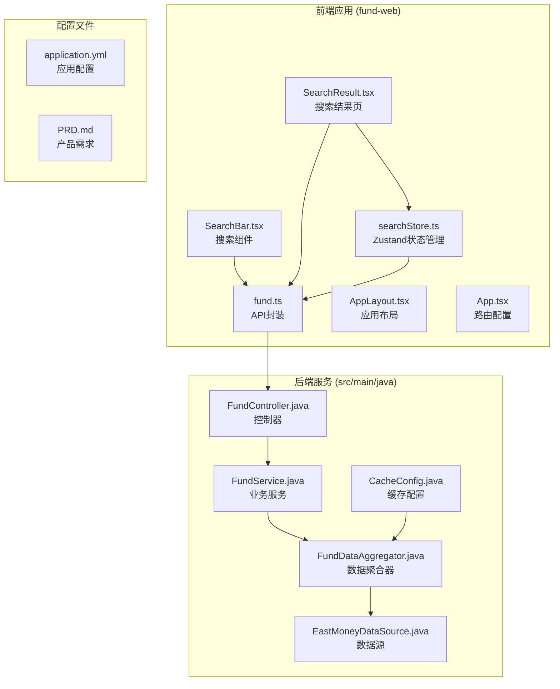
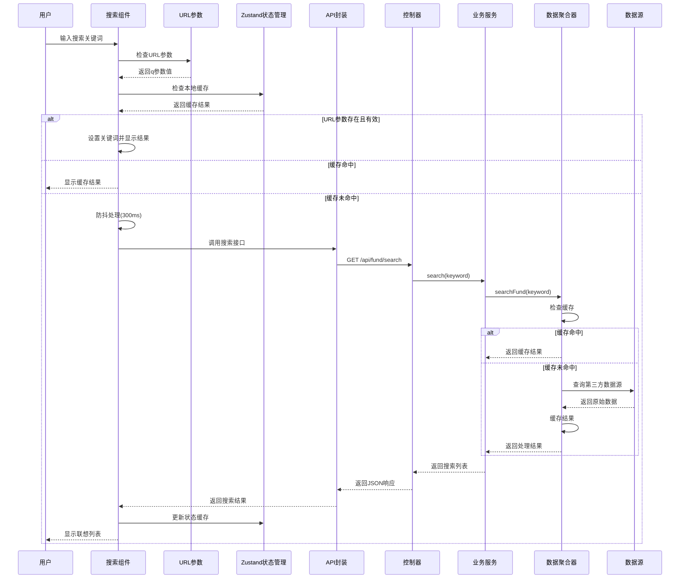
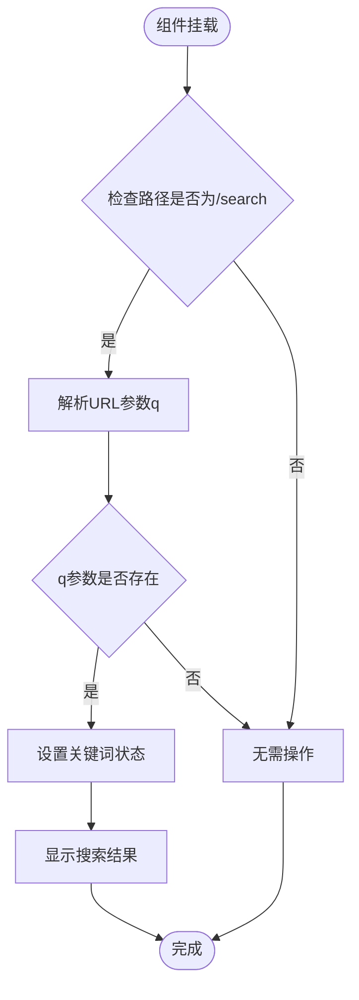
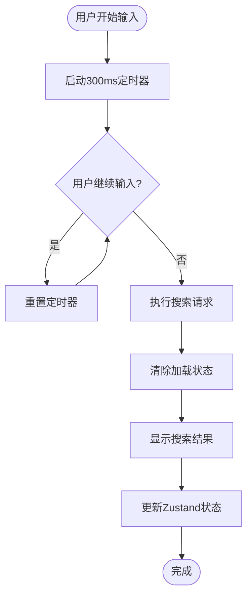
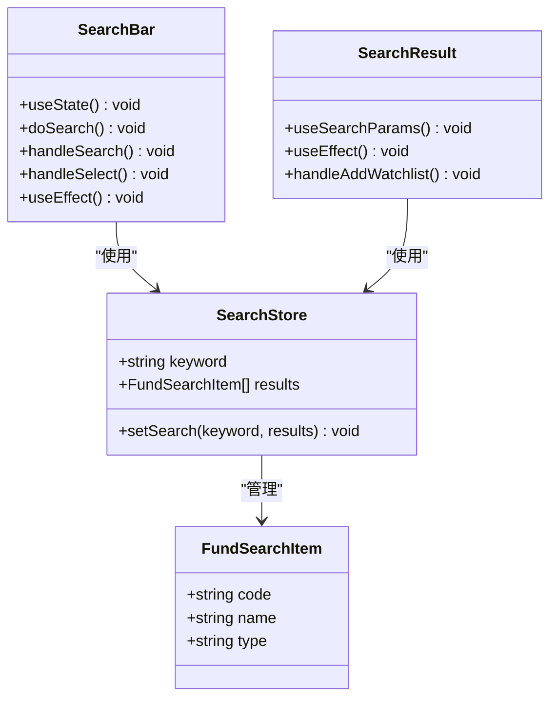
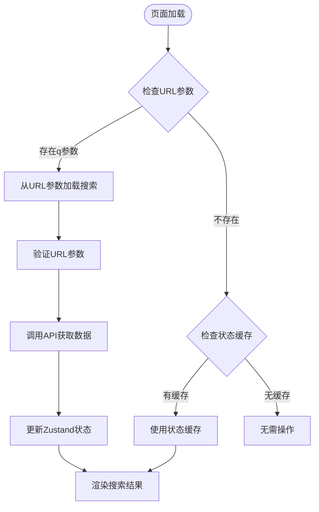
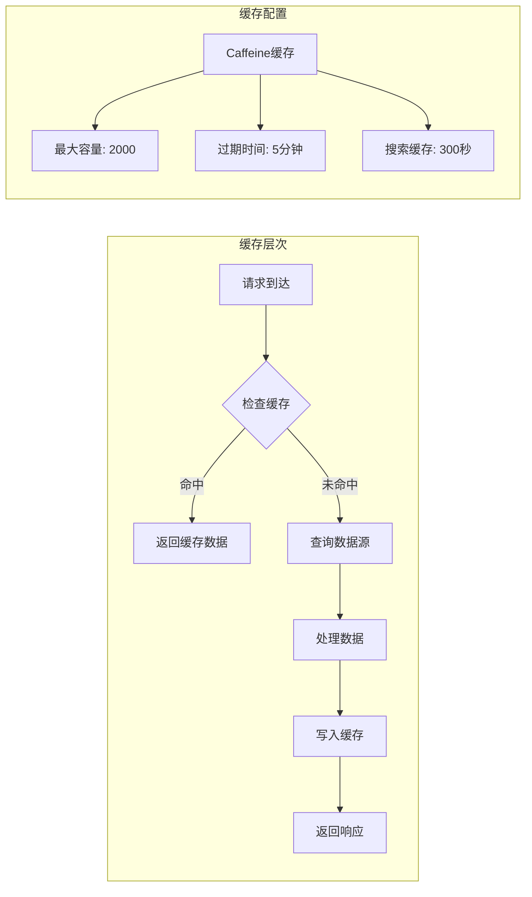
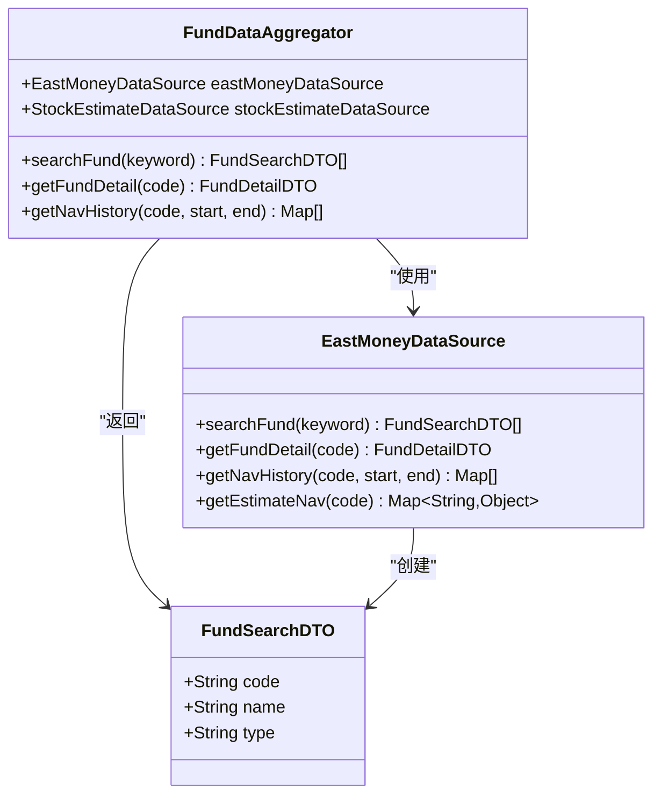
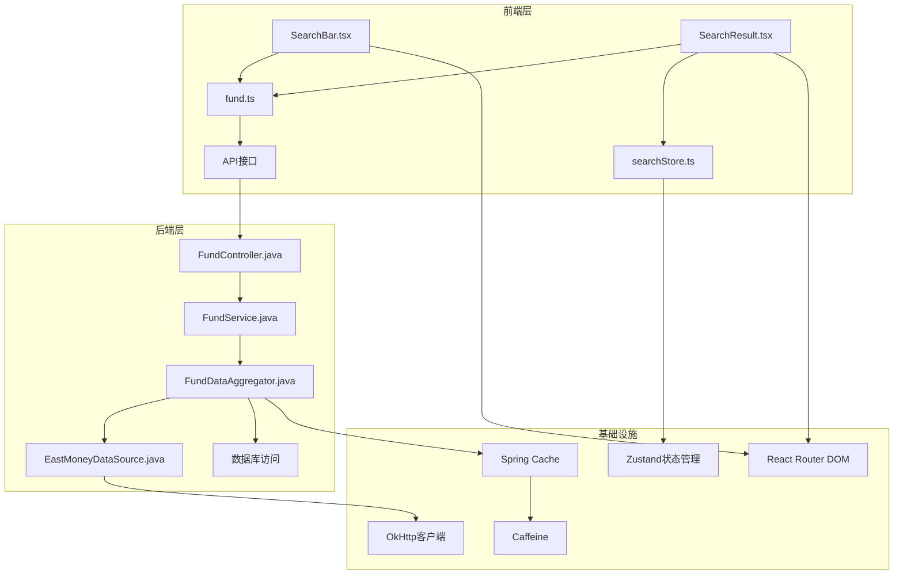

# 搜索功能优化

<cite>
**本文档引用的文件**
- [SearchBar.tsx](file://fund-web/src/components/SearchBar.tsx)
- [searchStore.ts](file://fund-web/src/store/searchStore.ts)
- [fund.ts](file://fund-web/src/api/fund.ts)
- [SearchResult.tsx](file://fund-web/src/pages/Fund/SearchResult.tsx)
- [App.tsx](file://fund-web/src/App.tsx)
- [AppLayout.tsx](file://fund-web/src/components/AppLayout.tsx)
- [FundController.java](file://src/main/java/com/qoder/fund/controller/FundController.java)
- [FundService.java](file://src/main/java/com/qoder/fund/service/FundService.java)
- [FundDataAggregator.java](file://src/main/java/com/qoder/fund/datasource/FundDataAggregator.java)
- [EastMoneyDataSource.java](file://src/main/java/com/qoder/fund/datasource/EastMoneyDataSource.java)
- [FundSearchDTO.java](file://src/main/java/com/qoder/fund/dto/FundSearchDTO.java)
- [CacheConfig.java](file://src/main/java/com/qoder/fund/config/CacheConfig.java)
- [application.yml](file://src/main/resources/application.yml)
- [PRD.md](file://PRD.md)
</cite>

## 更新摘要
**变更内容**
- 增强了SearchBar组件的URL同步功能，支持通过URL参数自动填充搜索条件
- 新增了useLocation钩子实现URL与组件状态的双向同步机制
- 更新了搜索流程图以反映URL参数驱动的搜索流程
- 完善了跨页面导航的URL参数传递和状态保持功能

## 目录
1. [简介](#简介)
2. [项目结构](#项目结构)
3. [核心组件](#核心组件)
4. [架构概览](#架构概览)
5. [详细组件分析](#详细组件分析)
6. [依赖关系分析](#依赖关系分析)
7. [性能考虑](#性能考虑)
8. [故障排除指南](#故障排除指南)
9. [结论](#结论)

## 简介

本文档深入分析了基金管家项目的搜索功能优化，这是一个基于React + Spring Boot构建的基金数据聚合管理应用。搜索功能作为用户获取基金信息的核心入口，需要在用户体验、性能和可靠性方面达到最佳平衡。

该系统采用前后端分离架构，前端使用React 18 + TypeScript，后端使用Spring Boot，通过RESTful API进行通信。搜索功能实现了实时联想、防抖处理、Zustand状态管理、URL参数驱动搜索等关键技术特性，显著提升了用户体验。

**更新** 新增了SearchBar组件的URL同步功能，允许用户通过URL参数直接访问搜索结果，增强了应用的可导航性和用户体验。

## 项目结构

项目采用模块化组织方式，主要分为前端Web应用和后端服务两大部分：



**图表来源**
- [SearchBar.tsx:1-98](file://fund-web/src/components/SearchBar.tsx#L1-L98)
- [FundController.java:1-62](file://src/main/java/com/qoder/fund/controller/FundController.java#L1-L62)
- [FundDataAggregator.java:1-546](file://src/main/java/com/qoder/fund/datasource/FundDataAggregator.java#L1-L546)

**章节来源**
- [AppLayout.tsx:1-97](file://fund-web/src/components/AppLayout.tsx#L1-L97)
- [App.tsx:1-42](file://fund-web/src/App.tsx#L1-L42)

## 核心组件

### 前端搜索组件

前端搜索功能由多个组件协同工作，实现了完整的搜索体验：

1. **SearchBar组件**：提供实时搜索联想功能，支持防抖处理和URL参数同步
2. **SearchResult页面**：展示搜索结果列表，支持URL参数驱动搜索
3. **searchStore状态管理**：使用Zustand实现搜索结果的持久化存储
4. **fund API封装**：统一的API调用接口

### 后端搜索服务

后端搜索服务采用多层架构设计：

1. **FundController**：RESTful API入口点，处理搜索请求
2. **FundService**：业务逻辑处理，验证关键词长度
3. **FundDataAggregator**：数据聚合和缓存管理，使用Spring Cache注解
4. **EastMoneyDataSource**：第三方数据源集成

**章节来源**
- [SearchBar.tsx:10-98](file://fund-web/src/components/SearchBar.tsx#L10-L98)
- [SearchResult.tsx:11-96](file://fund-web/src/pages/Fund/SearchResult.tsx#L11-L96)
- [FundController.java:24-30](file://src/main/java/com/qoder/fund/controller/FundController.java#L24-L30)

## 架构概览

搜索功能的整体架构采用分层设计，现在集成了Zustand状态管理和URL参数同步机制：



**图表来源**
- [SearchBar.tsx:18-24](file://fund-web/src/components/SearchBar.tsx#L18-L24)
- [FundController.java:24-30](file://src/main/java/com/qoder/fund/controller/FundController.java#L24-L30)
- [FundDataAggregator.java:48-51](file://src/main/java/com/qoder/fund/datasource/FundDataAggregator.java#L48-L51)

## 详细组件分析

### URL参数同步机制

SearchBar组件现在支持通过URL参数自动填充搜索条件，实现了更流畅的用户体验：



**图表来源**
- [SearchBar.tsx:18-24](file://fund-web/src/components/SearchBar.tsx#L18-L24)

### 搜索防抖机制

搜索防抖是提升用户体验的关键技术，通过延迟执行搜索请求来减少不必要的网络调用：



**图表来源**
- [SearchBar.tsx:33-37](file://fund-web/src/components/SearchBar.tsx#L33-L37)

### Zustand状态管理

系统采用了Zustand轻量级状态管理库来缓存搜索结果，实现了跨标签页的结果持久化：



**图表来源**
- [searchStore.ts:4-14](file://fund-web/src/store/searchStore.ts#L4-L14)
- [SearchBar.tsx:10-98](file://fund-web/src/components/SearchBar.tsx#L10-L98)
- [SearchResult.tsx:11-96](file://fund-web/src/pages/Fund/SearchResult.tsx#L11-L96)

**章节来源**
- [searchStore.ts:1-15](file://fund-web/src/store/searchStore.ts#L1-L15)
- [SearchBar.tsx:17-98](file://fund-web/src/components/SearchBar.tsx#L17-L98)

### URL参数驱动搜索

SearchResult组件现在支持通过URL参数驱动搜索，提供了更好的用户体验：



**图表来源**
- [SearchResult.tsx:20-32](file://fund-web/src/pages/Fund/SearchResult.tsx#L20-L32)

**章节来源**
- [SearchResult.tsx:11-96](file://fund-web/src/pages/Fund/SearchResult.tsx#L11-L96)

### 后端缓存策略

后端实现了多层次的缓存机制来提升搜索性能：



**图表来源**
- [CacheConfig.java:16-23](file://src/main/java/com/qoder/fund/config/CacheConfig.java#L16-L23)
- [application.yml:18-21](file://src/main/resources/application.yml#L18-L21)

**章节来源**
- [FundDataAggregator.java:48-51](file://src/main/java/com/qoder/fund/datasource/FundDataAggregator.java#L48-L51)
- [CacheConfig.java:1-24](file://src/main/java/com/qoder/fund/config/CacheConfig.java#L1-L24)

### 数据源集成

系统集成了多个数据源以确保数据的准确性和可靠性：



**图表来源**
- [FundDataAggregator.java:36-43](file://src/main/java/com/qoder/fund/datasource/FundDataAggregator.java#L36-L43)
- [EastMoneyDataSource.java:45-75](file://src/main/java/com/qoder/fund/datasource/EastMoneyDataSource.java#L45-L75)
- [FundSearchDTO.java:6-10](file://src/main/java/com/qoder/fund/dto/FundSearchDTO.java#L6-L10)

**章节来源**
- [EastMoneyDataSource.java:45-75](file://src/main/java/com/qoder/fund/datasource/EastMoneyDataSource.java#L45-L75)
- [FundSearchDTO.java:1-11](file://src/main/java/com/qoder/fund/dto/FundSearchDTO.java#L1-L11)

## 依赖关系分析

搜索功能的依赖关系体现了清晰的分层架构，现在包含了Zustand状态管理和URL参数同步：



**图表来源**
- [SearchBar.tsx:4-6](file://fund-web/src/components/SearchBar.tsx#L4-L6)
- [FundController.java](file://src/main/java/com/qoder/fund/controller/FundController.java#L24)
- [FundDataAggregator.java](file://src/main/java/com/qoder/fund/datasource/FundDataAggregator.java#L36)

**章节来源**
- [App.tsx:26-34](file://fund-web/src/App.tsx#L26-L34)
- [FundController.java:1-62](file://src/main/java/com/qoder/fund/controller/FundController.java#L1-L62)

## 性能考虑

### 前端性能优化

1. **防抖机制**：300ms延迟避免频繁请求
2. **结果限制**：最多显示10个结果选项
3. **Zustand状态缓存**：使用Zustand实现跨标签页结果缓存
4. **URL参数优化**：支持直接通过URL参数驱动搜索
5. **加载指示**：提供视觉反馈改善用户体验
6. **URL同步优化**：useLocation钩子实现高效的URL状态同步

### Zustand状态管理优化

1. **跨标签页缓存**：搜索结果在Zustand store中持久化，支持跨标签页共享
2. **状态同步**：URL参数变化时自动更新状态缓存
3. **内存管理**：合理的状态结构设计，避免内存泄漏
4. **性能监控**：可通过Zustand DevTools进行性能分析

### 后端性能优化

1. **缓存策略**：
   - Caffeine本地缓存，最大2000条，5分钟过期
   - 搜索专用缓存，300秒过期
   - 自动缓存失效，避免数据陈旧

2. **数据源优化**：
   - 多数据源备份，提高可用性
   - 异步数据获取，避免阻塞主线程
   - 结果集大小限制，减少内存占用

3. **网络优化**：
   - OkHttp连接池复用
   - 请求超时控制（连接10s，读取15s）
   - 错误重试机制

**章节来源**
- [SearchBar.tsx:17-31](file://fund-web/src/components/SearchBar.tsx#L17-L31)
- [application.yml:18-21](file://src/main/resources/application.yml#L18-L21)
- [EastMoneyDataSource.java:33-37](file://src/main/java/com/qoder/fund/datasource/EastMoneyDataSource.java#L33-L37)

## 故障排除指南

### 常见问题及解决方案

1. **搜索无结果**
   - 检查关键词长度（至少2个字符）
   - 验证网络连接状态
   - 查看Zustand状态缓存是否正常工作
   - 检查URL参数格式是否正确

2. **搜索响应缓慢**
   - 检查后端缓存配置
   - 监控第三方数据源状态
   - 查看OkHttp连接池使用情况
   - 检查Zustand状态更新频率

3. **前端UI异常**
   - 确认防抖定时器正确清理
   - 检查Zustand store初始化
   - 验证路由配置正确性
   - 检查URL参数解析逻辑

4. **跨标签页缓存问题**
   - 确认Zustand store正确初始化
   - 检查浏览器本地存储权限
   - 验证状态序列化/反序列化逻辑

5. **URL参数同步问题**
   - 确认useLocation钩子正确监听URL变化
   - 检查路由配置是否正确
   - 验证URL编码和解码逻辑
   - 确认组件卸载时清理定时器

### 调试建议

1. **前端调试**
   ```javascript
   // 在SearchBar组件中添加调试信息
   console.log('搜索关键词:', value);
   console.log('防抖定时器:', timerRef.current);
   console.log('Zustand状态:', useSearchStore.getState());
   console.log('URL参数:', new URLSearchParams(location.search).get('q'));
   ```

2. **后端调试**
   ```java
   // 在FundDataAggregator中添加缓存状态检查
   log.info("缓存状态: key={}, hit={}", keyword, cacheManager.getCache("fundSearch").getIfPresent(keyword));
   ```

3. **性能监控**
   - 监控搜索请求响应时间
   - 跟踪Zustand状态更新次数
   - 分析缓存命中率
   - 监控URL参数驱动搜索的性能

**章节来源**
- [SearchBar.tsx:52-98](file://fund-web/src/components/SearchBar.tsx#L52-L98)
- [FundDataAggregator.java:48-51](file://src/main/java/com/qoder/fund/datasource/FundDataAggregator.java#L48-L51)

## 结论

基金管家的搜索功能经过精心设计，在以下方面表现出色：

### 优势总结

1. **用户体验优秀**：300ms防抖、实时联想、加载指示、URL参数驱动搜索、URL同步功能
2. **性能表现优异**：多层次缓存、Zustand状态管理、异步处理、连接池复用、URL参数优化
3. **架构设计合理**：清晰的分层、模块化设计、可扩展性、跨标签页缓存、URL参数同步
4. **可靠性强**：多数据源备份、错误处理、监控告警、状态持久化、URL状态同步

### 技术创新亮点

1. **Zustand状态管理**：实现了搜索结果的持久化存储，支持跨标签页共享
2. **URL参数驱动**：支持直接通过URL参数进行搜索，提升导航体验
3. **智能缓存策略**：前端和后端双重缓存，确保最佳性能
4. **状态同步机制**：URL参数变化时自动更新状态缓存
5. **URL同步功能**：SearchBar组件支持从URL参数自动填充搜索条件

### 优化建议

1. **搜索算法优化**
   - 实现模糊匹配算法
   - 添加搜索历史记录
   - 支持热门搜索词推荐

2. **性能进一步优化**
   - 实现搜索结果分页
   - 添加搜索结果排序
   - 优化Zustand状态结构

3. **功能扩展**
   - 支持高级搜索过滤
   - 添加搜索结果收藏
   - 实现搜索结果分享
   - 增加搜索统计分析
   - 扩展URL参数支持更多搜索条件

**更新** 新增的URL同步功能显著提升了应用的可导航性和用户体验，用户可以通过直接访问`/search?q=关键词`的方式快速获取搜索结果，同时保持了原有的搜索交互体验。

该搜索功能为整个基金管家应用奠定了坚实的基础，通过持续的优化和改进，能够为用户提供更加优质的搜索体验。Zustand状态管理和URL参数驱动搜索的引入，以及最新的URL同步功能，显著提升了系统的性能和用户体验。