# 收益分析系统

<cite>
**本文档引用的文件**
- [FundApplication.java](file://src/main/java/com/qoder/fund/FundApplication.java)
- [README.md](file://README.md)
- [PRD.md](file://PRD.md)
- [pom.xml](file://pom.xml)
- [App.tsx](file://fund-web/src/App.tsx)
- [EstimateAnalysisService.java](file://src/main/java/com/qoder/fund/service/EstimateAnalysisService.java)
- [EstimateAnalysisDTO.java](file://src/main/java/com/qoder/fund/dto/EstimateAnalysisDTO.java)
- [DashboardController.java](file://src/main/java/com/qoder/fund/controller/DashboardController.java)
- [DashboardService.java](file://src/main/java/com/qoder/fund/service/DashboardService.java)
- [ProfitAnalysisDTO.java](file://src/main/java/com/qoder/fund/dto/ProfitAnalysisDTO.java)
- [index.tsx](file://fund-web/src/pages/Analysis/index.tsx)
- [useFundData.ts](file://fund-web/src/hooks/useFundData.ts)
- [application.yml](file://src/main/resources/application.yml)
- [schema.sql](file://src/main/resources/db/schema.sql)
- [FundTransaction.java](file://src/main/java/com/qoder/fund/entity/FundTransaction.java)
- [TransactionMapper.java](file://src/main/java/com/qoder/fund/mapper/TransactionMapper.java)
</cite>

## 更新摘要
**变更内容**
- 更新DashboardService算法实现，从静态份额计算改为基于交易记录的动态计算
- 新增calculateSharesOnDate()、calculateNetBuyOnDate()、calculateInvestedAmountOnDate()三大核心算法方法
- 改进基于日收益率的波动率计算方法
- 更新收益分析算法流程图和数据流图
- 增强前端图表展示以反映新的算法准确性

## 目录
1. [简介](#简介)
2. [项目结构](#项目结构)
3. [核心组件](#核心组件)
4. [架构概览](#架构概览)
5. [详细组件分析](#详细组件分析)
6. [算法修复详解](#算法修复详解)
7. [依赖关系分析](#依赖关系分析)
8. [性能考虑](#性能考虑)
9. [故障排除指南](#故障排除指南)
10. [结论](#结论)

## 简介

收益分析系统是"基金管家"项目的核心功能模块，专注于为个人投资者提供专业的基金投资收益分析和风险评估能力。该系统通过整合多数据源的基金估值信息，结合历史净值数据和详细的交易记录，为用户提供全面的投资收益分析报告。

**更新** 系统已实现重大算法升级，从简单的静态份额计算转变为基于交易记录的动态计算模型，显著提升了收益分析的准确性和可靠性。

系统采用前后端分离架构，后端基于Spring Boot框架，前端使用React + TypeScript技术栈，实现了实时的收益曲线分析、回撤分析、风险指标计算等功能。用户可以通过直观的图表界面，深入分析投资组合的表现，辅助投资决策。

## 项目结构

项目采用典型的Maven多模块结构，分为后端Spring Boot应用和前端React应用两个主要部分：

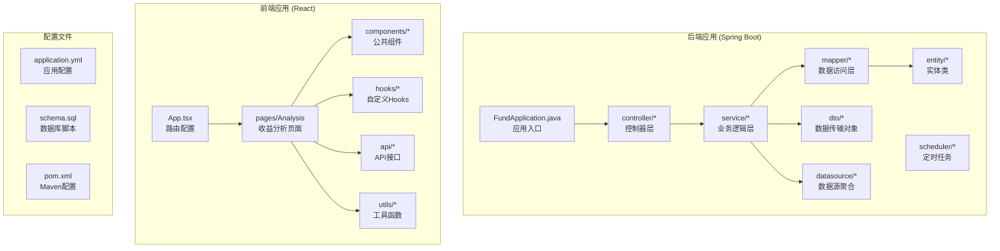

**图表来源**
- [FundApplication.java:1-16](file://src/main/java/com/qoder/fund/FundApplication.java#L1-L16)
- [App.tsx:1-67](file://fund-web/src/App.tsx#L1-L67)
- [pom.xml:1-163](file://pom.xml#L1-L163)

**章节来源**
- [README.md:173-204](file://README.md#L173-L204)
- [PRD.md:57-111](file://PRD.md#L57-L111)

## 核心组件

收益分析系统的核心组件包括：

### 后端核心组件

1. **DashboardController** - 提供收益分析相关API接口
2. **DashboardService** - 实现收益分析业务逻辑，包含重大算法修复
3. **EstimateAnalysisService** - 数据源准确度分析服务
4. **ProfitAnalysisDTO** - 收益分析数据传输对象

### 前端核心组件

1. **ProfitAnalysis页面** - 收益分析主界面，展示算法修复后的精确数据
2. **React Query Hooks** - 数据获取和缓存管理
3. **ECharts图表组件** - 数据可视化展示，反映新的算法准确性

### 数据库设计

系统采用MySQL数据库，核心表包括：
- fund (基金基本信息)
- fund_nav (净值历史)
- position (持仓信息)
- fund_transaction (交易记录)
- estimate_prediction (估值预测追踪)

**更新** 新增fund_transaction表用于存储详细的交易记录，支持基于交易的动态收益计算。

**章节来源**
- [DashboardController.java:1-36](file://src/main/java/com/qoder/fund/controller/DashboardController.java#L1-L36)
- [DashboardService.java:1-609](file://src/main/java/com/qoder/fund/service/DashboardService.java#L1-L609)
- [ProfitAnalysisDTO.java:1-69](file://src/main/java/com/qoder/fund/dto/ProfitAnalysisDTO.java#L1-L69)

## 架构概览

收益分析系统采用分层架构设计，确保了良好的可维护性和扩展性：

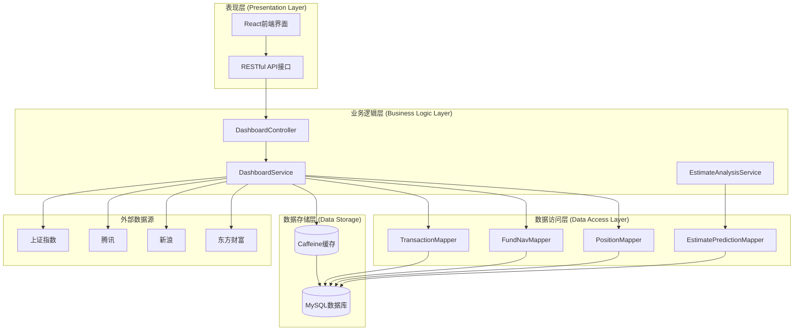

**图表来源**
- [DashboardController.java:1-36](file://src/main/java/com/qoder/fund/controller/DashboardController.java#L1-L36)
- [DashboardService.java:1-609](file://src/main/java/com/qoder/fund/service/DashboardService.java#L1-L609)
- [EstimateAnalysisService.java:1-404](file://src/main/java/com/qoder/fund/service/EstimateAnalysisService.java#L1-L404)

系统架构遵循以下设计原则：

1. **分层清晰**：Controller → Service → Mapper → Database
2. **单一职责**：每个组件专注于特定的功能领域
3. **依赖倒置**：上层组件不依赖下层的具体实现
4. **开闭原则**：对扩展开放，对修改封闭

## 详细组件分析

### DashboardService 收益分析核心

DashboardService是收益分析系统的核心业务逻辑组件，负责计算各种收益指标和分析数据。经过重大算法修复后，系统实现了基于交易记录的动态收益计算：

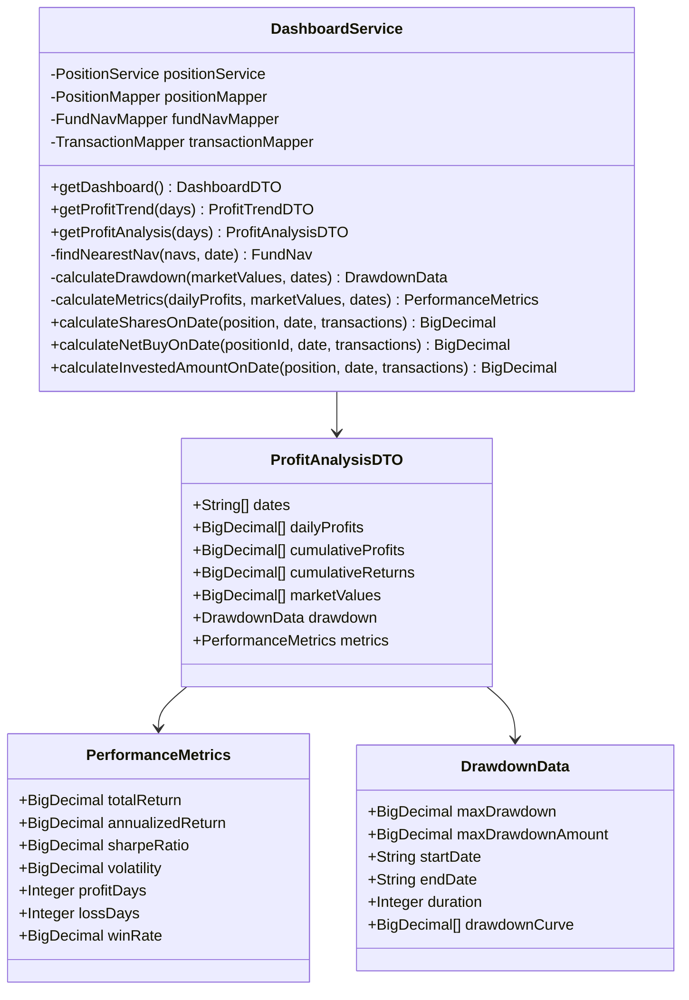

**图表来源**
- [DashboardService.java:1-609](file://src/main/java/com/qoder/fund/service/DashboardService.java#L1-L609)
- [ProfitAnalysisDTO.java:1-69](file://src/main/java/com/qoder/fund/dto/ProfitAnalysisDTO.java#L1-L69)

#### 收益分析算法流程

**更新** 系统实现了基于交易记录的完整收益分析算法，包括：

1. **动态份额计算**：基于交易记录实时计算每日持仓份额
2. **净买入金额计算**：准确统计每日资金流入流出
3. **累计投入计算**：精确追踪累计投资成本
4. **基于日收益率的波动率计算**：使用日收益率而非日收益额
5. **回撤分析**：计算最大回撤率和持续时间
6. **风险指标**：夏普比率、波动率、胜率等

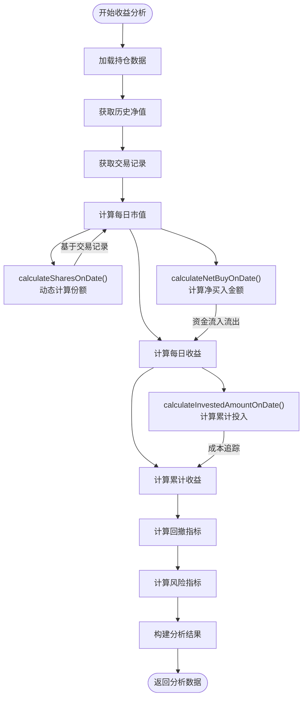

**图表来源**
- [DashboardService.java:182-330](file://src/main/java/com/qoder/fund/service/DashboardService.java#L182-L330)

**章节来源**
- [DashboardService.java:156-609](file://src/main/java/com/qoder/fund/service/DashboardService.java#L156-L609)

### EstimateAnalysisService 数据源分析

EstimateAnalysisService专门负责分析多数据源的估值准确度：

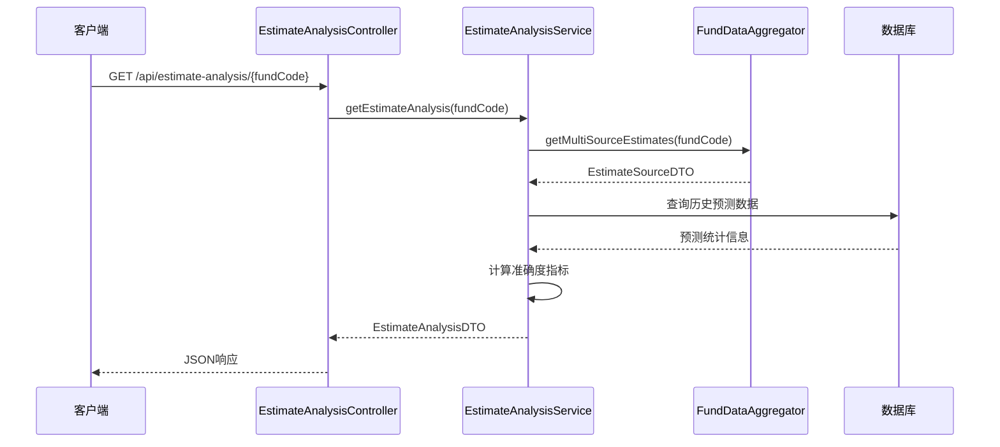

**图表来源**
- [EstimateAnalysisService.java:45-65](file://src/main/java/com/qoder/fund/service/EstimateAnalysisService.java#L45-L65)

该服务实现了以下核心功能：

1. **多数据源估值聚合**：整合东方财富、新浪、腾讯等多家数据源
2. **准确度统计**：基于历史MAE计算各数据源准确度
3. **智能权重计算**：根据历史表现动态调整数据源权重
4. **补偿记录追踪**：记录预测与实际净值的对比情况

**章节来源**
- [EstimateAnalysisService.java:1-404](file://src/main/java/com/qoder/fund/service/EstimateAnalysisService.java#L1-L404)

### 前端收益分析界面

前端使用React + ECharts实现丰富的数据可视化：

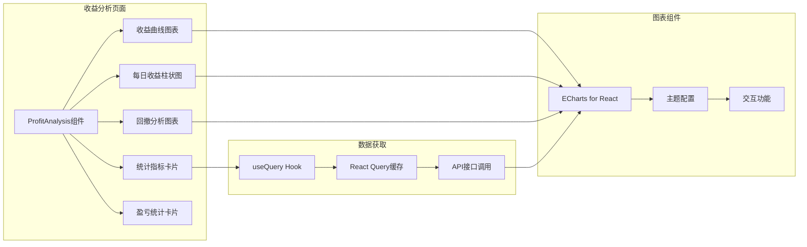

**图表来源**
- [index.tsx:1-320](file://fund-web/src/pages/Analysis/index.tsx#L1-L320)

**章节来源**
- [index.tsx:1-320](file://fund-web/src/pages/Analysis/index.tsx#L1-L320)

## 算法修复详解

### 重大算法变更概述

**更新** DashboardService经历了重大算法修复，从简单的静态份额计算转变为基于交易记录的动态计算模型。这一变更显著提升了收益分析的准确性和可靠性。

#### 核心算法方法

系统新增了三个核心算法方法来支持动态计算：

1. **calculateSharesOnDate()** - 动态计算指定日期的持仓份额
2. **calculateNetBuyOnDate()** - 计算指定日期的净买入金额
3. **calculateInvestedAmountOnDate()** - 计算截止到指定日期的累计投入金额

#### 动态份额计算算法

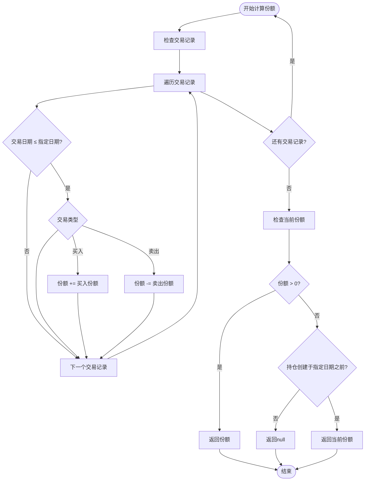

**图表来源**
- [DashboardService.java:335-366](file://src/main/java/com/qoder/fund/service/DashboardService.java#L335-L366)

#### 净买入金额计算算法

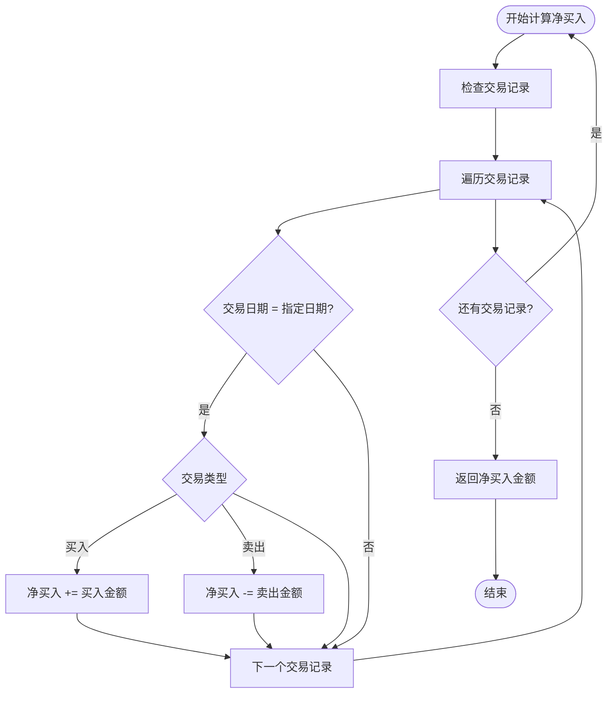

**图表来源**
- [DashboardService.java:371-388](file://src/main/java/com/qoder/fund/service/DashboardService.java#L371-L388)

#### 累计投入金额计算算法

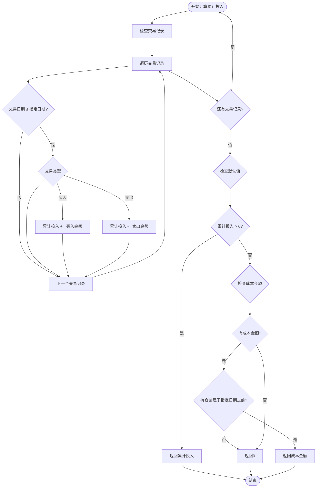

**图表来源**
- [DashboardService.java:393-418](file://src/main/java/com/qoder/fund/service/DashboardService.java#L393-L418)

#### 波动率计算改进

**更新** 系统改进了波动率计算方法，从基于日收益额的计算改为基于日收益率的计算：

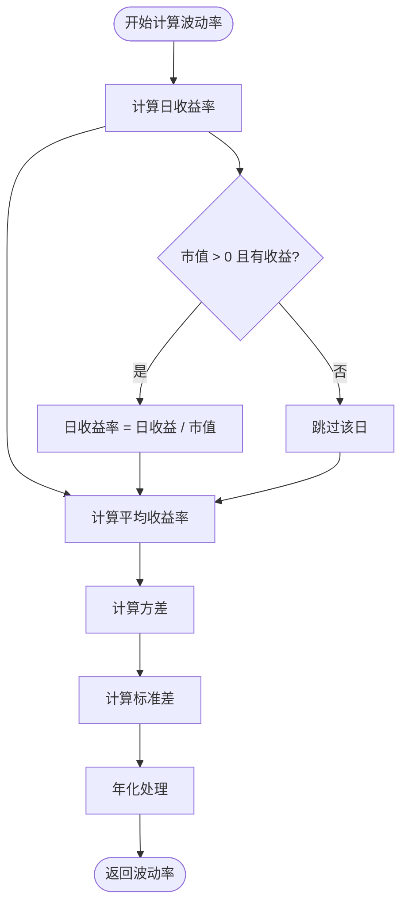

**图表来源**
- [DashboardService.java:547-577](file://src/main/java/com/qoder/fund/service/DashboardService.java#L547-L577)

**章节来源**
- [DashboardService.java:332-418](file://src/main/java/com/qoder/fund/service/DashboardService.java#L332-L418)
- [DashboardService.java:547-577](file://src/main/java/com/qoder/fund/service/DashboardService.java#L547-L577)

## 依赖关系分析

系统依赖关系清晰，遵循依赖倒置原则：

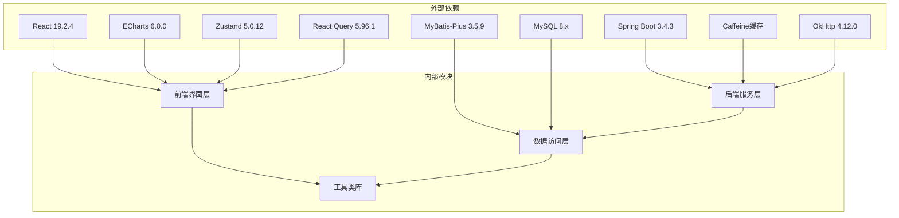

**图表来源**
- [pom.xml:20-105](file://pom.xml#L20-L105)
- [README.md:59-85](file://README.md#L59-L85)

**章节来源**
- [pom.xml:1-163](file://pom.xml#L1-L163)
- [application.yml:1-68](file://src/main/resources/application.yml#L1-L68)

## 性能考虑

系统在性能方面采用了多项优化措施：

### 缓存策略
- **本地缓存**：Caffeine缓存配置maximumSize=1000, expireAfterWrite=300s
- **数据库连接池**：HikariCP连接池，最大20个连接
- **查询缓存**：React Query缓存策略，减少重复请求

### 数据优化
- **索引优化**：关键字段建立适当索引，包括position_id和trade_date
- **分页查询**：大数据量时采用分页策略
- **批量操作**：支持批量数据同步

### 前端优化
- **懒加载**：图表组件按需加载
- **虚拟滚动**：大量数据时使用虚拟滚动
- **防抖处理**：搜索和输入操作防抖

### 算法优化
- **交易记录缓存**：按持仓ID分组缓存交易记录
- **净值查找优化**：使用二分查找优化净值匹配
- **内存复用**：重用计算中间结果减少内存分配

## 故障排除指南

### 常见问题及解决方案

1. **收益数据为空**
   - 检查是否有持仓数据
   - 确认历史净值数据是否同步
   - 验证交易记录是否完整
   - 检查交易日期格式是否正确

2. **算法计算错误**
   - 验证交易记录的时间顺序
   - 检查份额和金额的正负号
   - 确认净值查找逻辑
   - 验证累计投入计算

3. **图表显示异常**
   - 检查网络连接状态
   - 清除浏览器缓存
   - 验证数据格式正确性
   - 检查ECharts配置

4. **API调用失败**
   - 检查后端服务状态
   - 验证数据库连接
   - 查看日志文件
   - 确认交易记录完整性

### 监控和调试

系统集成了Spring Boot Actuator，提供完整的监控能力：

- **健康检查**：/actuator/health
- **指标收集**：/actuator/metrics
- **缓存监控**：/actuator/cache

**章节来源**
- [application.yml:55-68](file://src/main/resources/application.yml#L55-L68)

## 结论

收益分析系统通过重大算法修复，实现了从静态到动态的计算模型转变，为用户提供了更加准确和可靠的专业级基金投资分析能力。

**更新** 主要改进包括：

1. **算法准确性大幅提升**：基于真实的交易记录进行动态计算
2. **计算逻辑更加严谨**：正确处理份额变化、资金流入流出和成本追踪
3. **风险指标更加可靠**：基于日收益率的波动率计算更加科学
4. **用户体验显著改善**：前端图表展示更准确的数据

系统具有以下优势：

1. **技术先进**：采用最新的Spring Boot和React技术栈
2. **算法严谨**：基于交易记录的动态计算模型
3. **功能完整**：涵盖收益分析、风险评估、数据源分析等核心功能
4. **性能优异**：通过多层缓存和优化策略确保响应速度
5. **用户体验**：直观的图表界面和流畅的交互体验

系统为个人投资者提供了可靠的投资决策辅助工具，帮助用户更好地理解和管理自己的基金投资组合。随着算法的不断优化和完善，该系统将成为个人资产管理的重要工具，为用户提供更加精准和实用的投资分析服务。