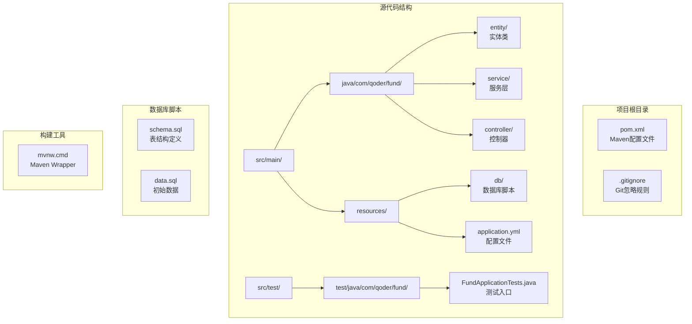
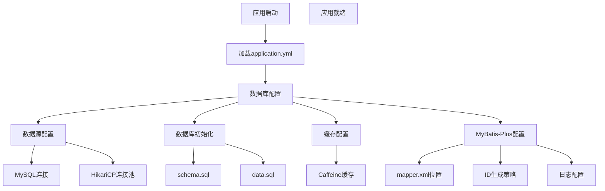
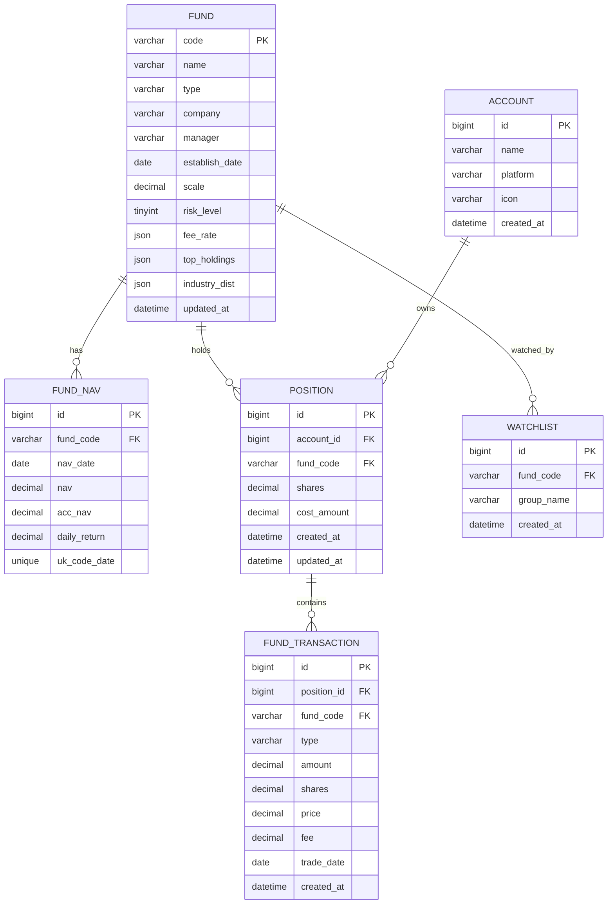
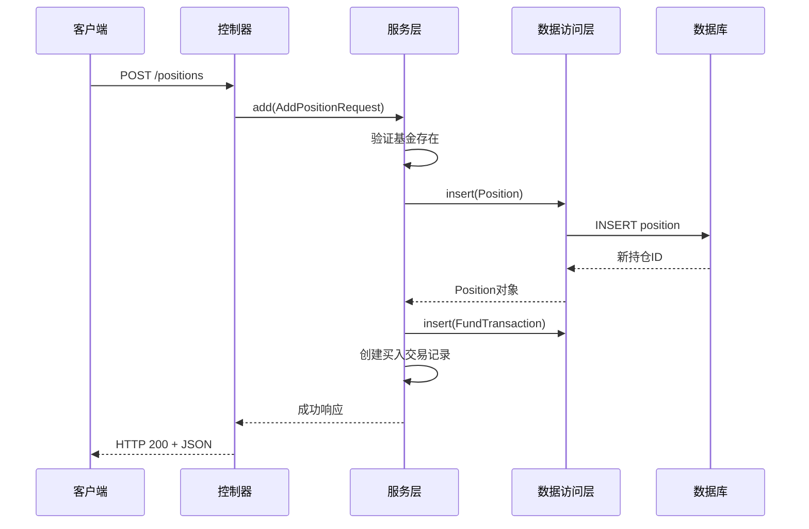
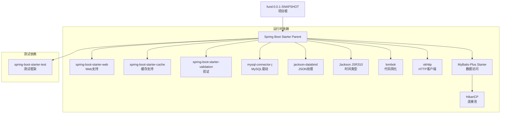
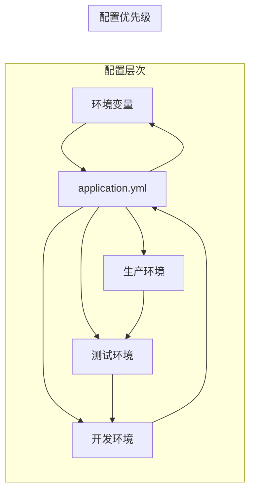
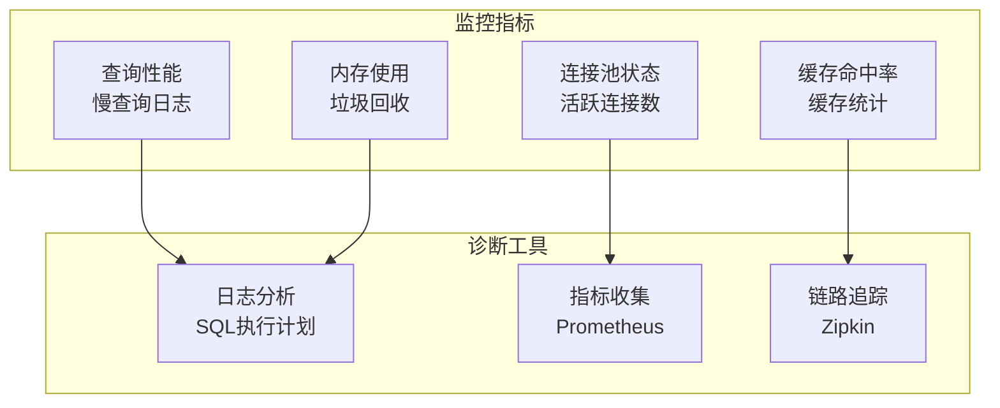
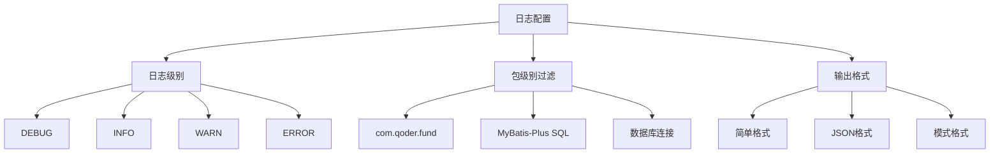

# 数据库集成

<cite>
**本文档引用的文件**
- [pom.xml](file://pom.xml)
- [application.yml](file://src/main/resources/application.yml)
- [schema.sql](file://src/main/resources/db/schema.sql)
- [data.sql](file://src/main/resources/db/data.sql)
- [Fund.java](file://src/main/java/com/qoder/fund/entity/Fund.java)
- [FundNav.java](file://src/main/java/com/qoder/fund/entity/FundNav.java)
- [Account.java](file://src/main/java/com/qoder/fund/entity/Account.java)
- [Position.java](file://src/main/java/com/qoder/fund/entity/Position.java)
- [FundTransaction.java](file://src/main/java/com/qoder/fund/entity/FundTransaction.java)
- [Watchlist.java](file://src/main/java/com/qoder/fund/entity/Watchlist.java)
- [AccountService.java](file://src/main/java/com/qoder/fund/service/AccountService.java)
- [PositionService.java](file://src/main/java/com/qoder/fund/service/PositionService.java)
- [FundService.java](file://src/main/java/com/qoder/fund/service/FundService.java)
</cite>

## 目录
1. [简介](#简介)
2. [项目结构](#项目结构)
3. [核心组件](#核心组件)
4. [架构概览](#架构概览)
5. [详细组件分析](#详细组件分析)
6. [依赖分析](#依赖分析)
7. [性能考虑](#性能考虑)
8. [故障排除指南](#故障排除指南)
9. [结论](#结论)

## 简介

本文档为基金管理系统的数据库集成提供了完整的实施指南。该系统基于Spring Boot框架构建，采用MyBatis-Plus作为主要的数据访问技术，实现了企业级的数据持久化解决方案。文档涵盖了从基础依赖配置到高级数据库特性配置的完整流程，包括MySQL数据库支持、实体模型设计、数据访问层实现以及最佳实践建议。

## 项目结构

当前项目采用标准的Spring Boot目录结构，已包含完整的数据库集成组件。项目的核心结构如下：



**图表来源**
- [pom.xml:1-107](file://pom.xml#L1-L107)
- [application.yml:1-43](file://src/main/resources/application.yml#L1-L43)

**章节来源**
- [pom.xml:1-107](file://pom.xml#L1-L107)
- [application.yml:1-43](file://src/main/resources/application.yml#L1-L43)

## 核心组件

### Maven依赖配置

项目已配置完整的数据库相关依赖，主要包含以下核心组件：

#### MyBatis-Plus支持
- mybatis-plus-spring-boot3-starter：提供MyBatis-Plus集成支持
- spring-boot-starter-cache：缓存支持
- caffeine：本地缓存实现

#### 数据库驱动程序
- mysql-connector-j：MySQL数据库驱动
- HikariCP：高性能连接池（MyBatis-Plus自动配置）

#### JSON处理和工具
- jackson-databind：JSON序列化支持
- jackson-datatype-jsr310：Java时间类型支持
- lombok：简化实体类代码

### 配置文件结构

应用程序配置文件采用YAML格式，支持多环境配置和数据库初始化：



**图表来源**
- [application.yml:4-43](file://src/main/resources/application.yml#L4-L43)

**章节来源**
- [pom.xml:20-87](file://pom.xml#L20-L87)
- [application.yml:4-43](file://src/main/resources/application.yml#L4-L43)

## 架构概览

基金管理系统的数据库架构采用分层设计模式，确保关注点分离和可维护性：

```mermaid
graph TB
subgraph "表现层"
CONTROLLER[Controller层<br/>REST API端点]
end
subgraph "业务逻辑层"
SERVICE[Service层<br/>业务逻辑处理]
TRANSACTION[事务管理<br/>@Transactional]
end
subgraph "数据访问层"
MAPPER[Mapper接口<br/>MyBatis-Plus]
ENTITY[Entity模型<br/>MyBatis-Plus注解]
end
subgraph "基础设施层"
DATABASE[(MySQL数据库)<br/>基金数据存储]
INIT[数据库初始化<br/>schema.sql + data.sql]
CACHE[Caffeine缓存<br/>性能优化]
CONNECTION[HikariCP连接池<br/>连接管理]
end
CONTROLLER --> SERVICE
SERVICE --> TRANSACTION
SERVICE --> MAPPER
MAPPER --> ENTITY
ENTITY --> DATABASE
MAPPER --> CONNECTION
SERVICE --> CONNECTION
INIT --> DATABASE
CACHE --> SERVICE
```

**图表来源**
- [application.yml:8-17](file://src/main/resources/application.yml#L8-L17)

## 详细组件分析

### 实体模型设计

系统包含6个核心实体表，支持完整的基金管理和投资组合分析功能：

#### 基金实体模型



**图表来源**
- [schema.sql:1-78](file://src/main/resources/db/schema.sql#L1-L78)

#### 核心实体详细说明

1. **Fund（基金基本信息）**
   - 主键：基金代码（code），使用INPUT类型
   - 支持JSON字段存储费率、重仓股、行业分布
   - 包含基金类型、公司、经理、成立日期、规模等信息

2. **FundNav（基金净值历史）**
   - 主键：自增ID
   - 唯一索引：基金代码+净值日期组合
   - 存储单位净值、累计净值、日涨跌幅

3. **Account（投资账户）**
   - 主键：自增ID
   - 支持多平台账户：支付宝、微信、天天基金等
   - 记录账户创建时间

4. **Position（基金持仓）**
   - 主键：自增ID
   - 关联账户和基金
   - 记录持有份额和成本金额
   - 支持成本计算和收益分析

5. **FundTransaction（交易记录）**
   - 主键：自增ID
   - 关联持仓ID
   - 支持买入、卖出、分红等交易类型
   - 记录交易金额、份额、手续费等

6. **Watchlist（自选基金）**
   - 主键：自增ID
   - 支持分组管理
   - 唯一索引：基金代码+分组名称

**章节来源**
- [Fund.java:16-41](file://src/main/java/com/qoder/fund/entity/Fund.java#L16-L41)
- [FundNav.java:11-23](file://src/main/java/com/qoder/fund/entity/FundNav.java#L11-L23)
- [Account.java:10-21](file://src/main/java/com/qoder/fund/entity/Account.java#L10-L21)
- [Position.java:11-24](file://src/main/java/com/qoder/fund/entity/Position.java#L11-L24)
- [FundTransaction.java:12-28](file://src/main/java/com/qoder/fund/entity/FundTransaction.java#L12-L28)
- [Watchlist.java:10-20](file://src/main/java/com/qoder/fund/entity/Watchlist.java#L10-L20)

### 数据库初始化脚本

系统使用SQL脚本进行数据库初始化，包含完整的表结构和初始数据：

#### 表结构设计要点

1. **索引优化**
   - 基金类型、名称索引（Fund）
   - 基金代码索引（FundNav、Position、FundTransaction、Watchlist）
   - 交易日期索引（FundTransaction）

2. **唯一约束**
   - 基金代码+净值日期唯一约束（FundNav）
   - 基金代码+分组名称唯一约束（Watchlist）

3. **JSON字段支持**
   - 费率信息、重仓股、行业分布使用JSON存储
   - 支持灵活的数据结构扩展

**章节来源**
- [schema.sql:1-78](file://src/main/resources/db/schema.sql#L1-L78)
- [data.sql:1-9](file://src/main/resources/db/data.sql#L1-L9)

### Service层实现

#### 业务逻辑封装



**图表来源**
- [PositionService.java:46-69](file://src/main/java/com/qoder/fund/service/PositionService.java#L46-L69)

#### 事务管理策略

1. **声明式事务**
   - @Transactional注解管理事务边界
   - 买入、卖出、删除操作均在事务中执行
   - 异常自动回滚机制

2. **复杂业务逻辑**
   - 持仓成本计算和更新
   - 买入卖出后的份额和成本调整
   - 多表数据一致性保证

**章节来源**
- [PositionService.java:46-103](file://src/main/java/com/qoder/fund/service/PositionService.java#L46-L103)
- [AccountService.java:32-39](file://src/main/java/com/qoder/fund/service/AccountService.java#L32-L39)

### 缓存策略

系统采用多层缓存策略提升性能：

#### Caffeine本地缓存
- 缓存大小：1000个条目
- 过期时间：5分钟
- 适用于频繁访问的静态数据

#### MyBatis-Plus二级缓存
- 自动缓存查询结果
- 支持逻辑删除字段配置
- 减少数据库查询压力

**章节来源**
- [application.yml:18-21](file://src/main/resources/application.yml#L18-L21)
- [application.yml:32-37](file://src/main/resources/application.yml#L32-L37)

## 依赖分析

### Maven依赖树



**图表来源**
- [pom.xml:20-87](file://pom.xml#L20-L87)

### 数据库配置策略

#### 多环境配置管理



**图表来源**
- [application.yml:1-43](file://src/main/resources/application.yml#L1-L43)

**章节来源**
- [pom.xml:16-19](file://pom.xml#L16-L19)
- [application.yml:4-43](file://src/main/resources/application.yml#L4-L43)

## 性能考虑

### 查询优化策略

1. **索引设计**
   - 为常用查询字段建立索引
   - 复合索引优化复杂查询
   - 覆盖索引减少回表

2. **缓存策略**
   - 一级缓存：EntityManager级别
   - 二级缓存：跨EntityManager共享
   - 分布式缓存：Redis支持

3. **连接池优化**
   - HikariCP默认配置已优化
   - 连接超时和空闲检查
   - 最大连接数和最小空闲连接

### 监控和诊断



## 故障排除指南

### 常见问题诊断

#### 连接问题
1. **数据库连接失败**
   - 检查连接字符串格式
   - 验证网络连通性
   - 确认防火墙设置

2. **连接池耗尽**
   - 增加最大连接数
   - 优化查询性能
   - 检查未关闭的连接

#### 性能问题
1. **查询缓慢**
   - 分析执行计划
   - 添加必要索引
   - 优化WHERE条件

2. **内存溢出**
   - 检查大对象处理
   - 实施分页查询
   - 优化对象映射

### 日志配置



**图表来源**
- [application.yml:39-43](file://src/main/resources/application.yml#L39-L43)

**章节来源**
- [application.yml:39-43](file://src/main/resources/application.yml#L39-L43)

## 结论

本数据库集成文档为基金管理系统的数据持久化提供了完整的实施蓝图。通过采用MyBatis-Plus技术栈、标准化的Spring Boot配置和最佳实践，系统能够支持复杂的金融数据管理需求，包括多账户管理、成本计算、收益分析等功能。

关键成功因素包括：
- 清晰的架构分层和职责分离
- 标准化的配置管理和多环境支持
- 优化的查询策略和性能监控
- 完善的错误处理和故障排除机制
- 多层缓存策略提升系统性能

系统现已具备完整的数据库集成能力，支持MySQL数据库的完整功能，包括实体关系映射、事务管理、缓存优化等高级特性。建议在实际部署前完成所有配置验证和性能测试，确保系统在生产环境中的稳定运行。