# 数据库集成

<cite>
**本文档引用的文件**
- [pom.xml](file://pom.xml)
- [application.yml](file://src/main/resources/application.yml)
- [schema.sql](file://src/main/resources/db/schema.sql)
- [data.sql](file://src/main/resources/db/data.sql)
- [FundPersistenceService.java](file://src/main/java/com/qoder/fund/service/FundPersistenceService.java)
- [FundDataSyncScheduler.java](file://src/main/java/com/qoder/fund/scheduler/FundDataSyncScheduler.java)
- [CacheConfig.java](file://src/main/java/com/qoder/fund/config/CacheConfig.java)
- [HealthCheckConfig.java](file://src/main/java/com/qoder/fund/config/HealthCheckConfig.java)
- [EastMoneyDataSource.java](file://src/main/java/com/qoder/fund/datasource/EastMoneyDataSource.java)
- [Fund.java](file://src/main/java/com/qoder/fund/entity/Fund.java)
- [FundNav.java](file://src/main/java/com/qoder/fund/entity/FundNav.java)
- [Account.java](file://src/main/java/com/qoder/fund/entity/Account.java)
- [Position.java](file://src/main/java/com/qoder/fund/entity/Position.java)
- [FundTransaction.java](file://src/main/java/com/qoder/fund/entity/FundTransaction.java)
- [Watchlist.java](file://src/main/java/com/qoder/fund/entity/Watchlist.java)
- [FundMapper.java](file://src/main/java/com/qoder/fund/mapper/FundMapper.java)
- [FundNavMapper.java](file://src/main/java/com/qoder/fund/mapper/FundNavMapper.java)
- [AccountService.java](file://src/main/java/com/qoder/fund/service/AccountService.java)
- [PositionService.java](file://src/main/java/com/qoder/fund/service/PositionService.java)
- [FundService.java](file://src/main/java/com/qoder/fund/service/FundService.java)
</cite>

## 更新摘要
**变更内容**
- 新增FundPersistenceService专门处理数据持久化操作
- 优化数据库连接池配置（HikariCP）
- 增强数据同步调度器功能
- 改进缓存策略配置
- 新增健康检查配置

## 目录
1. [简介](#简介)
2. [项目结构](#项目结构)
3. [核心组件](#核心组件)
4. [架构概览](#架构概览)
5. [详细组件分析](#详细组件分析)
6. [依赖分析](#依赖分析)
7. [性能考虑](#性能考虑)
8. [故障排除指南](#故障排除指南)
9. [结论](#结论)

## 简介

本文档为基金管理系统的数据库集成提供了完整的实施指南。该系统基于Spring Boot框架构建，采用MyBatis-Plus作为主要的数据访问技术，实现了企业级的数据持久化解决方案。文档涵盖了从基础依赖配置到高级数据库特性配置的完整流程，包括MySQL数据库支持、实体模型设计、数据访问层实现以及最佳实践建议。

**更新** 新增了专门的数据持久化服务（FundPersistenceService）、优化的连接池配置和增强的数据同步调度器。

## 项目结构

当前项目采用标准的Spring Boot目录结构，已包含完整的数据库集成组件。项目的核心结构如下：

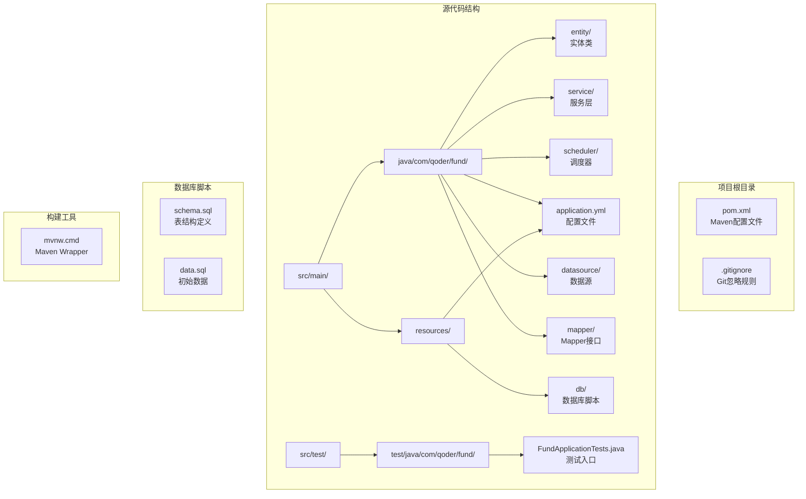

**图表来源**
- [pom.xml:1-107](file://pom.xml#L1-L107)
- [application.yml:1-67](file://src/main/resources/application.yml#L1-L67)

**章节来源**
- [pom.xml:1-107](file://pom.xml#L1-L107)
- [application.yml:1-67](file://src/main/resources/application.yml#L1-L67)

## 核心组件

### Maven依赖配置

项目已配置完整的数据库相关依赖，主要包含以下核心组件：

#### MyBatis-Plus支持
- mybatis-plus-spring-boot3-starter：提供MyBatis-Plus集成支持
- spring-boot-starter-cache：缓存支持
- caffeine：本地缓存实现

#### 数据库驱动程序
- mysql-connector-j：MySQL数据库驱动
- HikariCP：高性能连接池（MyBatis-Plus自动配置）

#### JSON处理和工具
- jackson-databind：JSON序列化支持
- jackson-datatype-jsr310：Java时间类型支持
- lombok：简化实体类代码

### 配置文件结构

应用程序配置文件采用YAML格式，支持多环境配置和数据库初始化：

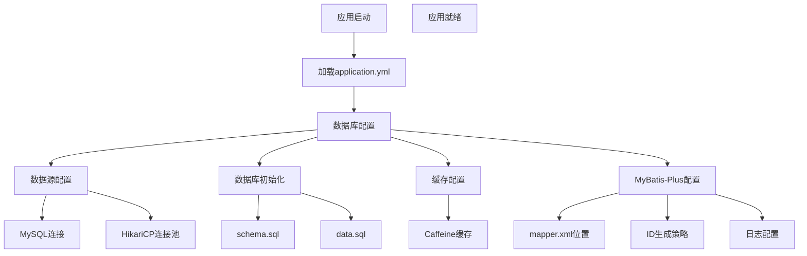

**图表来源**
- [application.yml:4-67](file://src/main/resources/application.yml#L4-L67)

**章节来源**
- [pom.xml:20-87](file://pom.xml#L20-L87)
- [application.yml:4-67](file://src/main/resources/application.yml#L4-L67)

## 架构概览

基金管理系统的数据库架构采用分层设计模式，确保关注点分离和可维护性：

```mermaid
graph TB
subgraph "表现层"
CONTROLLER[Controller层<br/>REST API端点]
end
subgraph "业务逻辑层"
SERVICE[Service层<br/>业务逻辑处理]
PERSISTENCE[FundPersistenceService<br/>数据持久化]
TRANSACTION[事务管理<br/>@Transactional]
end
subgraph "数据访问层"
MAPPER[Mapper接口<br/>MyBatis-Plus]
ENTITY[Entity模型<br/>MyBatis-Plus注解]
end
subgraph "基础设施层"
DATABASE[(MySQL数据库)<br/>基金数据存储]
INIT[数据库初始化<br/>schema.sql + data.sql]
CACHE[Caffeine缓存<br/>性能优化]
CONNECTION[HikariCP连接池<br/>连接管理]
SCHEDULER[FundDataSyncScheduler<br/>数据同步调度]
HEALTH[HealthCheckConfig<br/>健康检查]
DATASOURCE[EastMoneyDataSource<br/>外部数据源]
end
CONTROLLER --> SERVICE
SERVICE --> PERSISTENCE
SERVICE --> TRANSACTION
SERVICE --> MAPPER
PERSISTENCE --> MAPPER
MAPPER --> ENTITY
ENTITY --> DATABASE
MAPPER --> CONNECTION
SERVICE --> CONNECTION
SCHEDULER --> DATASOURCE
SCHEDULER --> MAPPER
HEALTH --> DATABASE
INIT --> DATABASE
CACHE --> SERVICE
```

**图表来源**
- [application.yml:8-22](file://src/main/resources/application.yml#L8-L22)

## 详细组件分析

### 实体模型设计

系统包含6个核心实体表，支持完整的基金管理和投资组合分析功能：

#### 基金实体模型

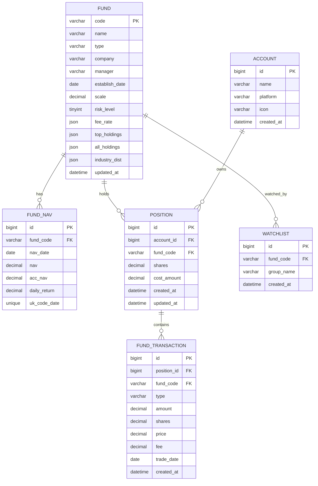

**图表来源**
- [schema.sql:1-95](file://src/main/resources/db/schema.sql#L1-L95)

#### 核心实体详细说明

1. **Fund（基金基本信息）**
   - 主键：基金代码（code），使用INPUT类型
   - 支持JSON字段存储费率、重仓股、行业分布
   - 包含基金类型、公司、经理、成立日期、规模等信息

2. **FundNav（基金净值历史）**
   - 主键：自增ID
   - 唯一索引：基金代码+净值日期组合
   - 存储单位净值、累计净值、日涨跌幅

3. **Account（投资账户）**
   - 主键：自增ID
   - 支持多平台账户：支付宝、微信、天天基金等
   - 记录账户创建时间

4. **Position（基金持仓）**
   - 主键：自增ID
   - 关联账户和基金
   - 记录持有份额和成本金额
   - 支持成本计算和收益分析

5. **FundTransaction（交易记录）**
   - 主键：自增ID
   - 关联持仓ID
   - 支持买入、卖出、分红等交易类型
   - 记录交易金额、份额、手续费等

6. **Watchlist（自选基金）**
   - 主键：自增ID
   - 支持分组管理
   - 唯一索引：基金代码+分组名称

**章节来源**
- [Fund.java:16-45](file://src/main/java/com/qoder/fund/entity/Fund.java#L16-L45)
- [FundNav.java:11-24](file://src/main/java/com/qoder/fund/entity/FundNav.java#L11-L24)
- [Account.java:10-21](file://src/main/java/com/qoder/fund/entity/Account.java#L10-L21)
- [Position.java:11-24](file://src/main/java/com/qoder/fund/entity/Position.java#L11-L24)
- [FundTransaction.java:12-28](file://src/main/java/com/qoder/fund/entity/FundTransaction.java#L12-L28)
- [Watchlist.java:10-20](file://src/main/java/com/qoder/fund/entity/Watchlist.java#L10-L20)

### 数据持久化服务

**新增** FundPersistenceService专门负责数据持久化操作，提供统一的数据访问接口。

#### FundPersistenceService核心功能

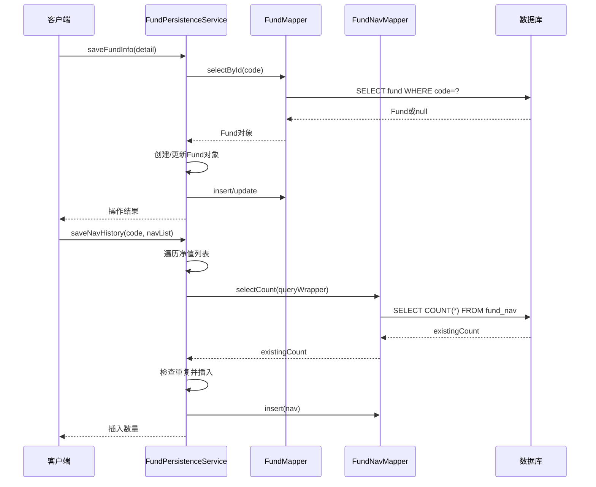

**图表来源**
- [FundPersistenceService.java:35-117](file://src/main/java/com/qoder/fund/service/FundPersistenceService.java#L35-L117)

#### 事务管理策略

1. **声明式事务**
   - @Transactional注解管理事务边界
   - 保存基金信息和净值历史均在事务中执行
   - 异常自动回滚机制

2. **数据一致性保证**
   - 基金信息保存：先查询再更新或插入
   - 净值历史保存：重复检查避免数据冗余
   - 统一的日志记录和异常处理

**章节来源**
- [FundPersistenceService.java:1-132](file://src/main/java/com/qoder/fund/service/FundPersistenceService.java#L1-L132)

### 数据同步调度器

**增强** FundDataSyncScheduler提供全面的数据同步和补偿机制。

#### 核心调度功能

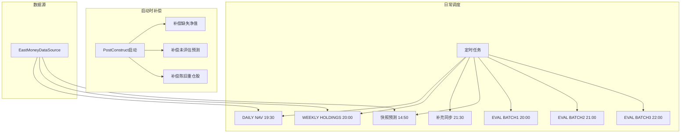

**图表来源**
- [FundDataSyncScheduler.java:55-587](file://src/main/java/com/qoder/fund/scheduler/FundDataSyncScheduler.java#L55-L587)

#### 详细调度策略

1. **启动时补偿**
   - 补偿缺失的净值数据
   - 回填未评估的预测记录
   - 刷新陈旧的重仓股数据

2. **日常同步**
   - 每交易日19:30同步净值数据
   - 每周一20:00同步重仓股数据
   - 每交易日晚上21:30补充同步
   - 每交易日14:50快照估值预测

3. **预测评估**
   - 分三批评估预测准确度
   - 计算预测误差并记录
   - 支持不同类型的基金评估

**章节来源**
- [FundDataSyncScheduler.java:1-587](file://src/main/java/com/qoder/fund/scheduler/FundDataSyncScheduler.java#L1-L587)

### 缓存策略配置

**改进** CacheConfig提供多层缓存策略，根据数据冷热程度设置不同的缓存策略。

#### 多层缓存架构

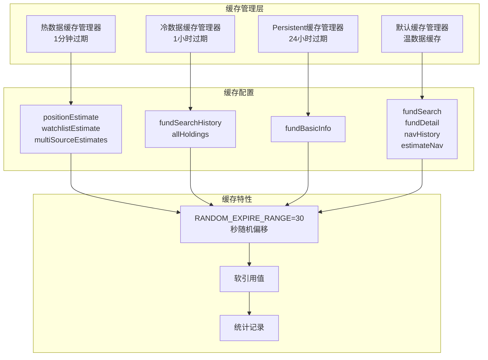

**图表来源**
- [CacheConfig.java:22-93](file://src/main/java/com/qoder/fund/config/CacheConfig.java#L22-L93)

#### 缓存策略详解

1. **热数据缓存（60秒过期，500条容量）**
   - 用户持仓实时估值
   - 自选基金实时估值
   - 多数据源估值聚合

2. **温数据缓存（300秒过期，2000条容量）**
   - 基金搜索结果
   - 基金详情信息
   - 净值历史数据
   - 估值预测数据

3. **冷数据缓存（3600秒过期，1000条容量）**
   - 搜索历史记录
   - 完整持仓列表

4. **持久数据缓存（86400秒过期，500条容量）**
   - 基金基本信息

**章节来源**
- [CacheConfig.java:1-93](file://src/main/java/com/qoder/fund/config/CacheConfig.java#L1-L93)

### 健康检查配置

**新增** HealthCheckConfig提供数据库和数据源的健康检查功能。

#### 健康检查架构

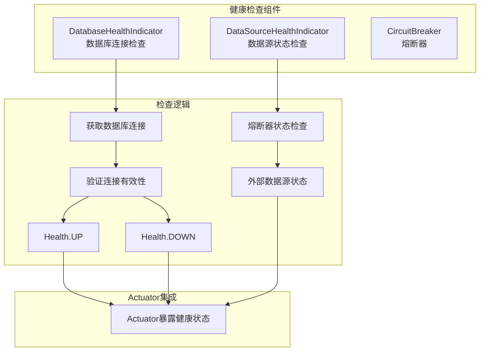

**图表来源**
- [HealthCheckConfig.java:25-59](file://src/main/java/com/qoder/fund/config/HealthCheckConfig.java#L25-L59)

#### 健康检查功能

1. **数据库健康检查**
   - 连接池连接有效性验证
   - MySQL数据库状态监控
   - 连接超时和错误处理

2. **数据源健康检查**
   - 外部数据源状态监控
   - 熔断器状态检查
   - 数据可用性评估

3. **Actuator集成**
   - 健康检查端点暴露
   - 详细状态信息
   - 组件健康状态

**章节来源**
- [HealthCheckConfig.java:1-59](file://src/main/java/com/qoder/fund/config/HealthCheckConfig.java#L1-L59)

### 数据库初始化脚本

系统使用SQL脚本进行数据库初始化，包含完整的表结构和初始数据：

#### 表结构设计要点

1. **索引优化**
   - 基金类型、名称索引（Fund）
   - 基金代码索引（FundNav、Position、FundTransaction、Watchlist）
   - 交易日期索引（FundTransaction）

2. **唯一约束**
   - 基金代码+净值日期唯一约束（FundNav）
   - 基金代码+分组名称唯一约束（Watchlist）

3. **JSON字段支持**
   - 费率信息、重仓股、行业分布使用JSON存储
   - 支持灵活的数据结构扩展

**章节来源**
- [schema.sql:1-95](file://src/main/resources/db/schema.sql#L1-L95)
- [data.sql:1-9](file://src/main/resources/db/data.sql#L1-L9)

### Service层实现

#### 业务逻辑封装

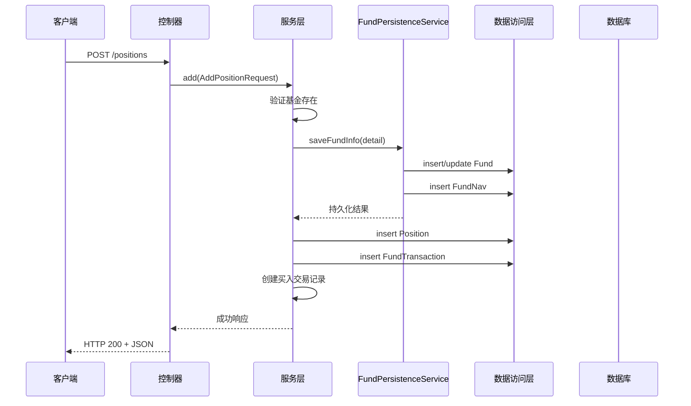

**图表来源**
- [PositionService.java:46-69](file://src/main/java/com/qoder/fund/service/PositionService.java#L46-L69)

#### 事务管理策略

1. **声明式事务**
   - @Transactional注解管理事务边界
   - 买入、卖出、删除操作均在事务中执行
   - 异常自动回滚机制

2. **复杂业务逻辑**
   - 持仓成本计算和更新
   - 买入卖出后的份额和成本调整
   - 多表数据一致性保证

**章节来源**
- [PositionService.java:46-103](file://src/main/java/com/qoder/fund/service/PositionService.java#L46-L103)
- [AccountService.java:32-39](file://src/main/java/com/qoder/fund/service/AccountService.java#L32-L39)

## 依赖分析

### Maven依赖树

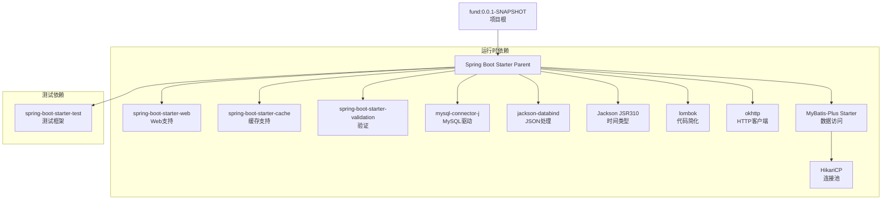

**图表来源**
- [pom.xml:20-87](file://pom.xml#L20-L87)

### 数据库配置策略

#### 多环境配置管理

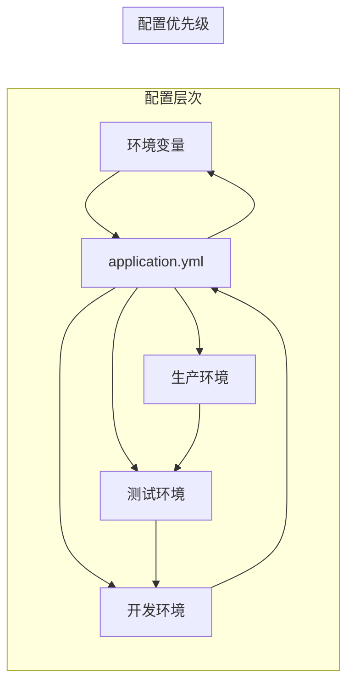

**图表来源**
- [application.yml:1-67](file://src/main/resources/application.yml#L1-L67)

**章节来源**
- [pom.xml:16-19](file://pom.xml#L16-L19)
- [application.yml:4-67](file://src/main/resources/application.yml#L4-L67)

## 性能考虑

### 查询优化策略

1. **索引设计**
   - 为常用查询字段建立索引
   - 复合索引优化复杂查询
   - 覆盖索引减少回表

2. **缓存策略**
   - 一级缓存：EntityManager级别
   - 二级缓存：跨EntityManager共享
   - 分层缓存：Caffeine多层缓存

3. **连接池优化**
   - HikariCP默认配置已优化
   - 连接超时和空闲检查
   - 最大连接数和最小空闲连接

4. **调度器优化**
   - 交易日智能判断
   - 请求间隔控制
   - 熔断器保护机制

### 监控和诊断

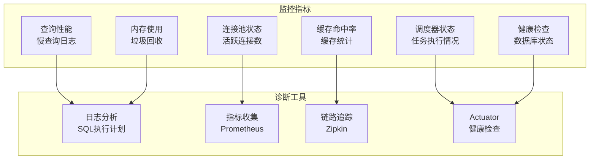

## 故障排除指南

### 常见问题诊断

#### 连接问题
1. **数据库连接失败**
   - 检查连接字符串格式
   - 验证网络连通性
   - 确认防火墙设置

2. **连接池耗尽**
   - 增加最大连接数
   - 优化查询性能
   - 检查未关闭的连接

#### 性能问题
1. **查询缓慢**
   - 分析执行计划
   - 添加必要索引
   - 优化WHERE条件

2. **内存溢出**
   - 检查大对象处理
   - 实施分页查询
   - 优化对象映射

#### 调度器问题
1. **数据同步失败**
   - 检查外部数据源可用性
   - 验证熔断器状态
   - 查看调度器日志

2. **缓存失效**
   - 检查缓存配置
   - 验证缓存键生成
   - 监控缓存命中率

### 日志配置

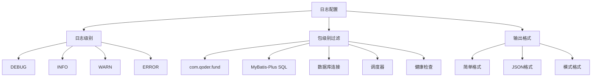

**图表来源**
- [application.yml:50-54](file://src/main/resources/application.yml#L50-L54)

**章节来源**
- [application.yml:50-54](file://src/main/resources/application.yml#L50-L54)

## 结论

本数据库集成文档为基金管理系统的数据持久化提供了完整的实施蓝图。通过采用MyBatis-Plus技术栈、标准化的Spring Boot配置和最佳实践，系统能够支持复杂的金融数据管理需求，包括多账户管理、成本计算、收益分析等功能。

**更新总结** 新增的FundPersistenceService专门处理数据持久化操作，优化了HikariCP连接池配置，增强了数据同步调度器功能，并改进了缓存策略配置。这些改进显著提升了系统的数据处理能力和稳定性。

关键成功因素包括：
- 清晰的架构分层和职责分离
- 标准化的配置管理和多环境支持
- 优化的查询策略和性能监控
- 完善的错误处理和故障排除机制
- 多层缓存策略提升系统性能
- 全面的健康检查和监控机制
- 智能的数据同步和补偿机制

系统现已具备完整的数据库集成能力，支持MySQL数据库的完整功能，包括实体关系映射、事务管理、缓存优化、健康检查等高级特性。建议在实际部署前完成所有配置验证和性能测试，确保系统在生产环境中的稳定运行。