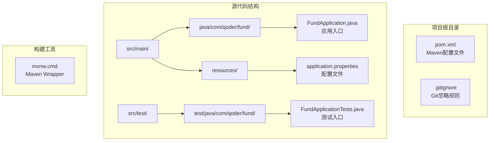
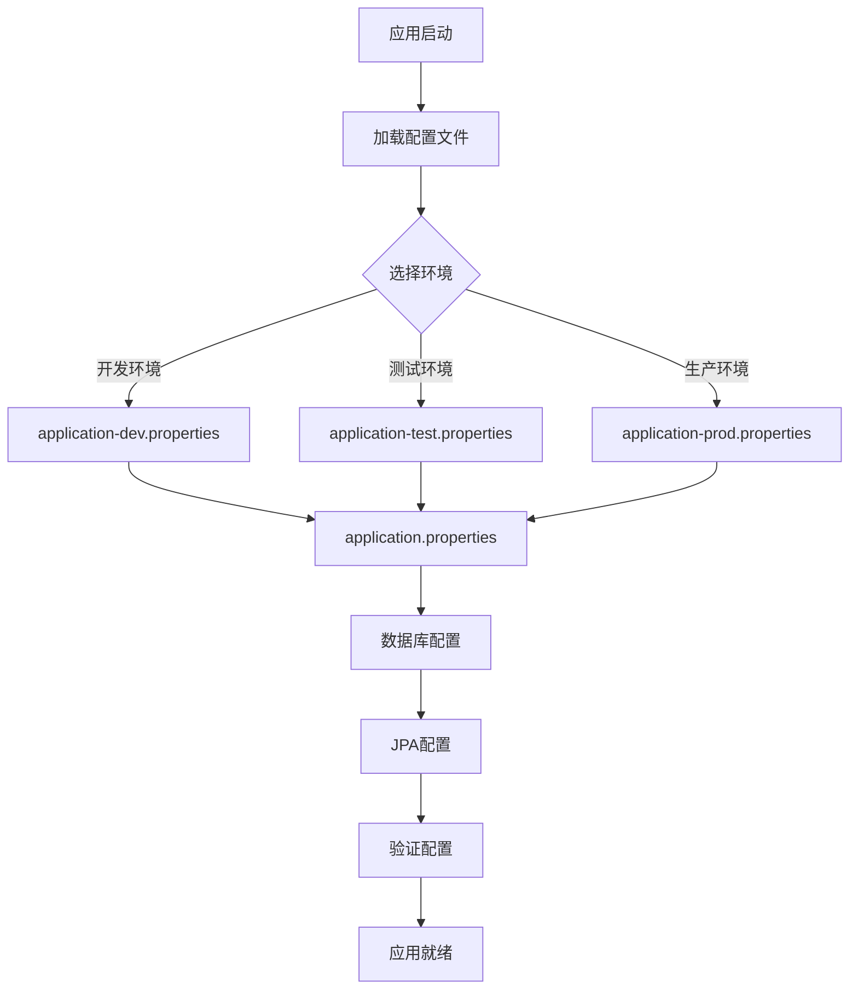
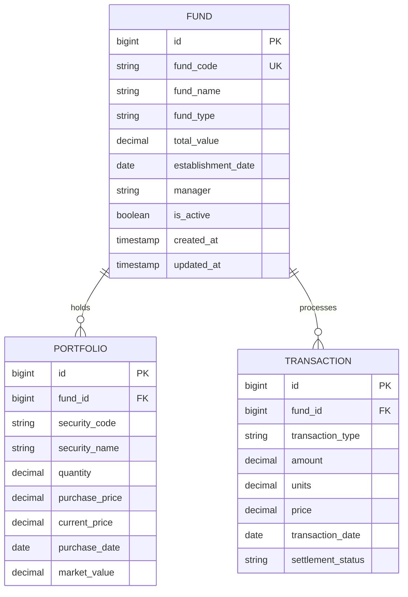
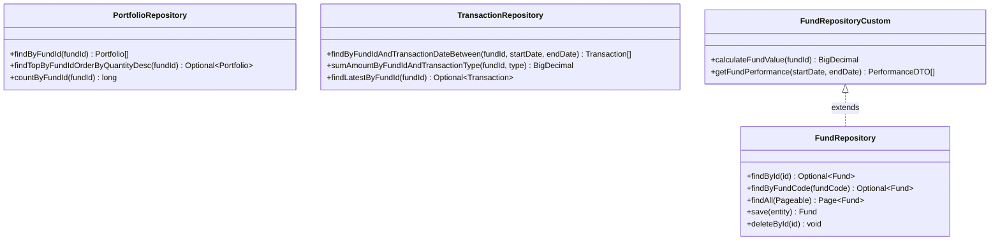
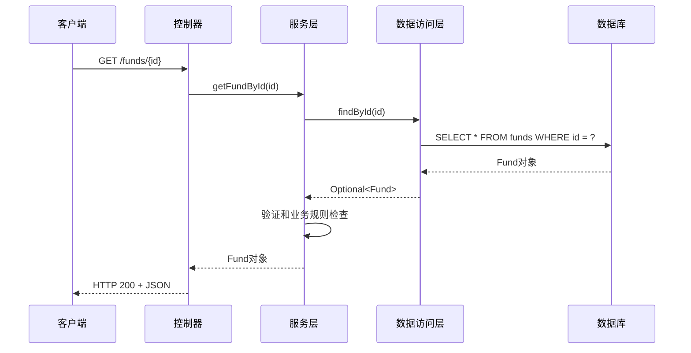
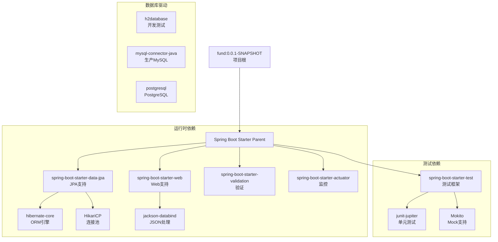
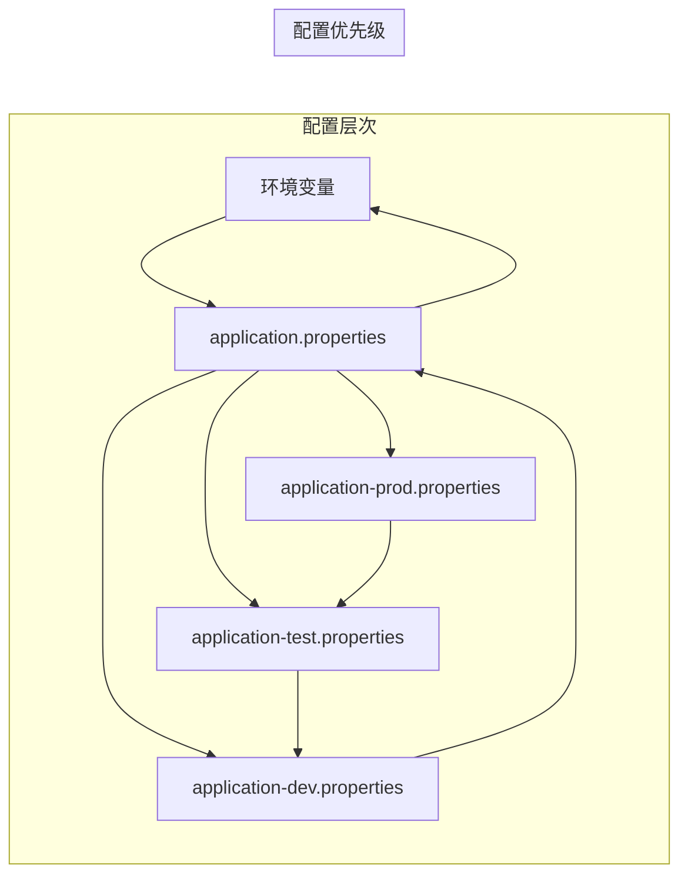
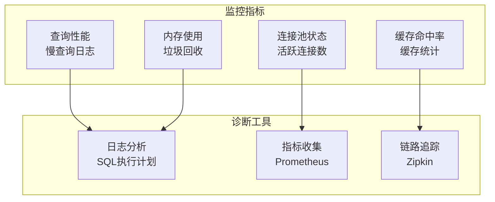
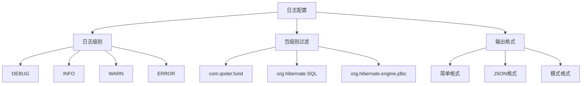

# 数据库集成

<cite>
**本文档引用的文件**
- [pom.xml](file://pom.xml)
- [application.properties](file://src/main/resources/application.properties)
- [FundApplication.java](file://src/main/java/com/qoder/fund/FundApplication.java)
- [FundApplicationTests.java](file://src/test/java/com/qoder/fund/FundApplicationTests.java)
</cite>

## 目录
1. [简介](#简介)
2. [项目结构](#项目结构)
3. [核心组件](#核心组件)
4. [架构概览](#架构概览)
5. [详细组件分析](#详细组件分析)
6. [依赖分析](#依赖分析)
7. [性能考虑](#性能考虑)
8. [故障排除指南](#故障排除指南)
9. [结论](#结论)

## 简介

本文档为基金管理系统的数据库集成提供了完整的实施指南。该系统基于Spring Boot框架构建，需要实现企业级的数据持久化解决方案。文档涵盖了从基础依赖配置到高级数据库特性配置的完整流程，包括多种数据库支持、实体模型设计、数据访问层实现以及最佳实践建议。

## 项目结构

当前项目采用标准的Spring Boot目录结构，但尚未包含数据库集成组件。项目的核心结构如下：



**图表来源**
- [pom.xml:1-55](file://pom.xml#L1-L55)
- [FundApplication.java:1-14](file://src/main/java/com/qoder/fund/FundApplication.java#L1-L14)
- [application.properties:1-2](file://src/main/resources/application.properties#L1-L2)

**章节来源**
- [pom.xml:1-55](file://pom.xml#L1-L55)
- [FundApplication.java:1-14](file://src/main/java/com/qoder/fund/FundApplication.java#L1-L14)
- [application.properties:1-2](file://src/main/resources/application.properties#L1-L2)

## 核心组件

### Maven依赖配置

当前项目的基础依赖非常精简，主要包含Spring Boot启动器和测试框架。要实现完整的数据库集成，需要添加以下核心依赖：

#### JPA/Hibernate支持
- spring-boot-starter-data-jpa：提供JPA和Hibernate集成
- spring-boot-starter-validation：Bean验证支持

#### 数据库驱动程序
- H2数据库：内存数据库，适合开发和测试
- MySQL Connector/J：生产环境MySQL支持
- PostgreSQL Driver：PostgreSQL支持

#### 连接池和监控
- HikariCP：高性能连接池
- Spring Boot Actuator：应用监控

### 配置文件结构

应用程序配置文件采用Spring Boot的属性文件格式，支持多环境配置：



**图表来源**
- [application.properties:1-2](file://src/main/resources/application.properties#L1-L2)

**章节来源**
- [pom.xml:32-43](file://pom.xml#L32-L43)
- [application.properties:1-2](file://src/main/resources/application.properties#L1-L2)

## 架构概览

基金管理系统的数据库架构采用分层设计模式，确保关注点分离和可维护性：

```mermaid
graph TB
subgraph "表现层"
CONTROLLER[Controller层<br/>REST API端点]
end
subgraph "业务逻辑层"
SERVICE[Service层<br/>业务逻辑处理]
TRANSACTION[事务管理<br/>@Transactional]
end
subgraph "数据访问层"
REPOSITORY[Repository接口<br/>数据访问抽象]
ENTITY[Entity模型<br/>JPA注解映射]
end
subgraph "基础设施层"
DATABASE[(数据库)<br/>MySQL/PostgreSQL/H2]
CONNECTION[HikariCP连接池<br/>性能优化]
end
CONTROLLER --> SERVICE
SERVICE --> TRANSACTION
SERVICE --> REPOSITORY
REPOSITORY --> ENTITY
ENTITY --> DATABASE
REPOSITORY --> CONNECTION
SERVICE --> CONNECTION
```

**图表来源**
- [FundApplication.java:6-11](file://src/main/java/com/qoder/fund/FundApplication.java#L6-L11)

## 详细组件分析

### 实体模型设计

#### 基金实体模型



#### 关系映射策略

1. **主键生成策略**
   - 使用IDENTITY策略自动生成主键
   - 支持序列化和自动递增
   - 确保跨数据库兼容性

2. **关联关系设计**
   - 一对多关系：基金与持仓、交易记录
   - 外键约束确保数据完整性
   - 懒加载优化查询性能

3. **时间戳管理**
   - 自动时间戳字段
   - 创建和更新时间分离
   - 支持审计跟踪

### Repository接口实现

#### 标准数据访问模式



**图表来源**
- [FundApplication.java:6-11](file://src/main/java/com/qoder/fund/FundApplication.java#L6-L11)

#### 查询方法命名规范

Spring Data JPA遵循严格的命名约定：
- findBy + 属性名 + 条件操作符
- By + 连接词（And/Or）
- 支持排序和分页参数

### Service层实现

#### 业务逻辑封装



**图表来源**
- [FundApplication.java:9-11](file://src/main/java/com/qoder/fund/FundApplication.java#L9-L11)

#### 事务管理策略

1. **声明式事务**
   - @Transactional注解管理事务边界
   - 异常回滚机制
   - 传播行为配置

2. **批量操作优化**
   - 批量插入和更新
   - 连接池配置
   - 语句批处理

### Controller端点设计

#### REST API规范

```mermaid
flowchart TD
API[REST API端点] --> FUND[Fund端点]
API --> PORTFOLIO[Portfolio端点]
API --> TRANSACTION[Transaction端点]
FUND --> CREATE[POST /funds]
FUND --> READ[GET /funds/{id}]
FUND --> UPDATE[PUT /funds/{id}]
FUND --> DELETE[DELETE /funds/{id}]
FUND --> LIST[GET /funds?page&size]
PORTFOLIO --> HOLDING[GET /funds/{id}/holdings]
PORTFOLIO --> ADD_HOLDING[POST /funds/{id}/holdings]
TRANSACTION --> TRADE[GET /funds/{id}/transactions]
TRANSACTION --> EXECUTE[POST /funds/{id}/transactions]
```

**图表来源**
- [FundApplication.java:6-11](file://src/main/java/com/qoder/fund/FundApplication.java#L6-L11)

## 依赖分析

### Maven依赖树



**图表来源**
- [pom.xml:32-43](file://pom.xml#L32-L43)

### 数据库配置策略

#### 多环境配置管理



**图表来源**
- [application.properties:1-2](file://src/main/resources/application.properties#L1-L2)

**章节来源**
- [pom.xml:29-31](file://pom.xml#L29-L31)
- [pom.xml:32-43](file://pom.xml#L32-L43)

## 性能考虑

### 查询优化策略

1. **索引设计**
   - 为常用查询字段建立索引
   - 复合索引优化复杂查询
   - 覆盖索引减少回表

2. **缓存策略**
   - 一级缓存：EntityManager级别
   - 二级缓存：跨EntityManager共享
   - 分布式缓存：Redis支持

3. **连接池优化**
   - HikariCP默认配置已优化
   - 连接超时和空闲检查
   - 最大连接数和最小空闲连接

### 监控和诊断



## 故障排除指南

### 常见问题诊断

#### 连接问题
1. **数据库连接失败**
   - 检查连接字符串格式
   - 验证网络连通性
   - 确认防火墙设置

2. **连接池耗尽**
   - 增加最大连接数
   - 优化查询性能
   - 检查未关闭的连接

#### 性能问题
1. **查询缓慢**
   - 分析执行计划
   - 添加必要索引
   - 优化WHERE条件

2. **内存溢出**
   - 检查大对象处理
   - 实施分页查询
   - 优化对象映射

### 日志配置



**图表来源**
- [FundApplicationTests.java:6-12](file://src/test/java/com/qoder/fund/FundApplicationTests.java#L6-L12)

**章节来源**
- [FundApplication.java:9-11](file://src/main/java/com/qoder/fund/FundApplication.java#L9-L11)
- [FundApplicationTests.java:1-14](file://src/test/java/com/qoder/fund/FundApplicationTests.java#L1-L14)

## 结论

本数据库集成文档为基金管理系统的数据持久化提供了完整的实施蓝图。通过采用分层架构设计、标准化的Spring Boot配置和最佳实践，系统能够支持多种数据库环境并具备良好的可扩展性和维护性。

关键成功因素包括：
- 清晰的架构分层和职责分离
- 标准化的配置管理和多环境支持
- 优化的查询策略和性能监控
- 完善的错误处理和故障排除机制

建议在实际部署前完成所有配置验证和性能测试，确保系统在生产环境中的稳定运行。