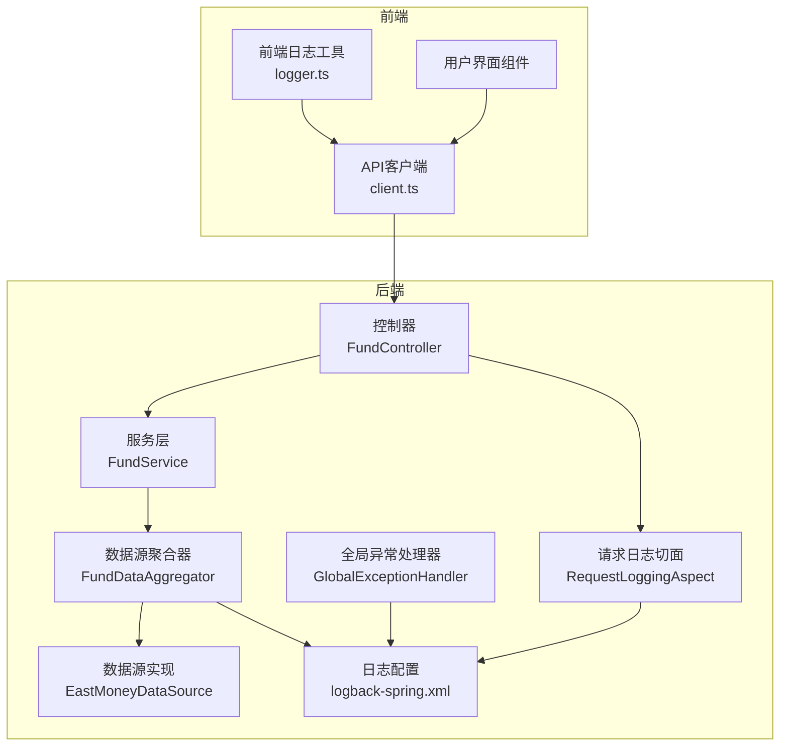
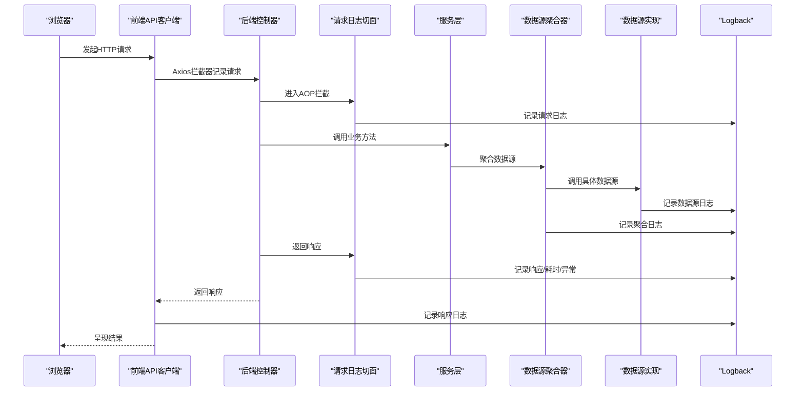
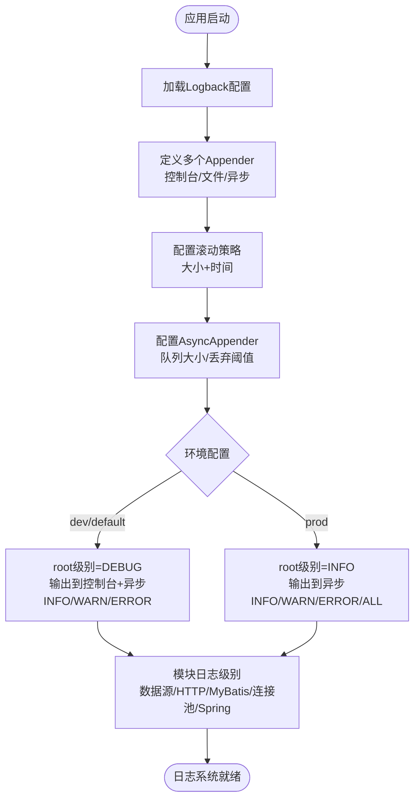
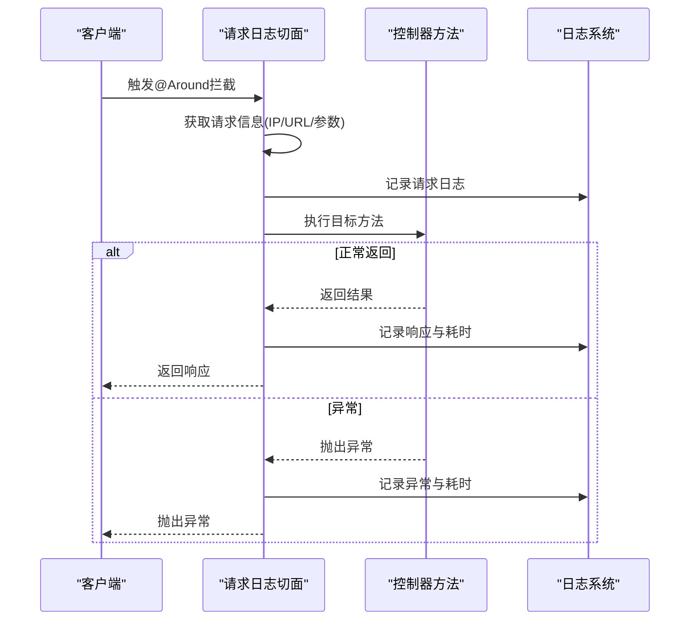
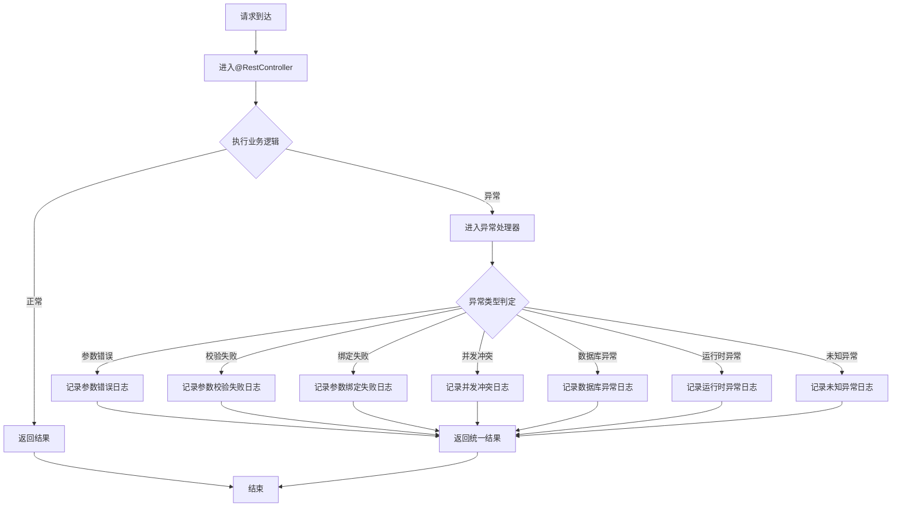
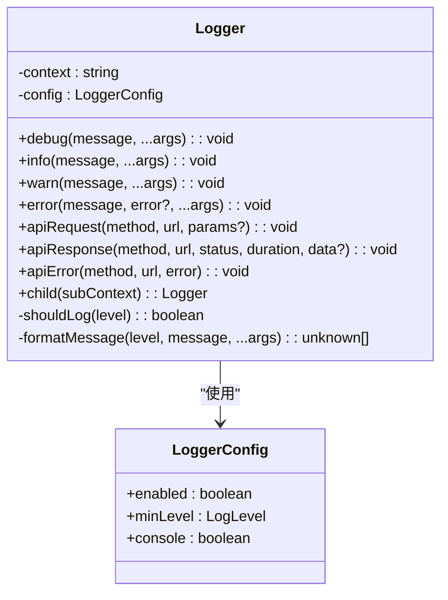
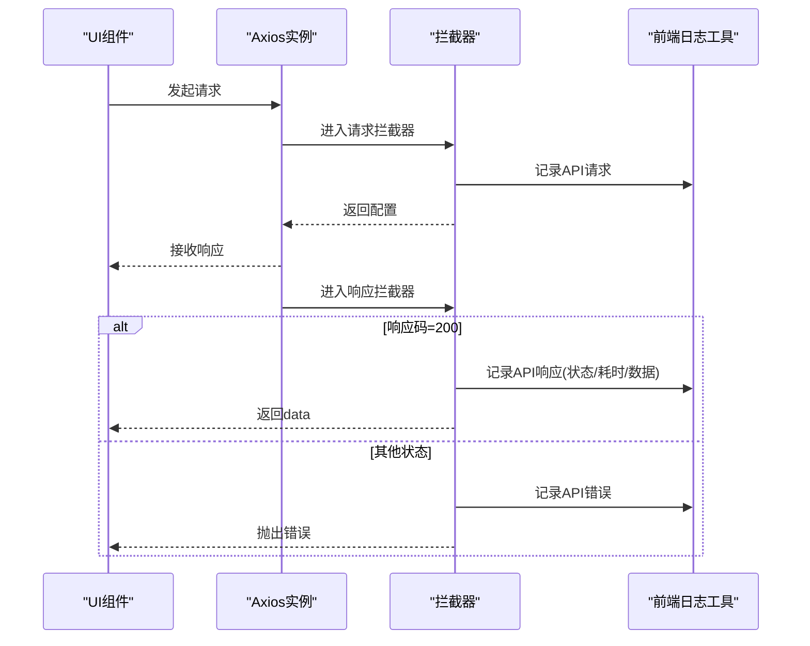
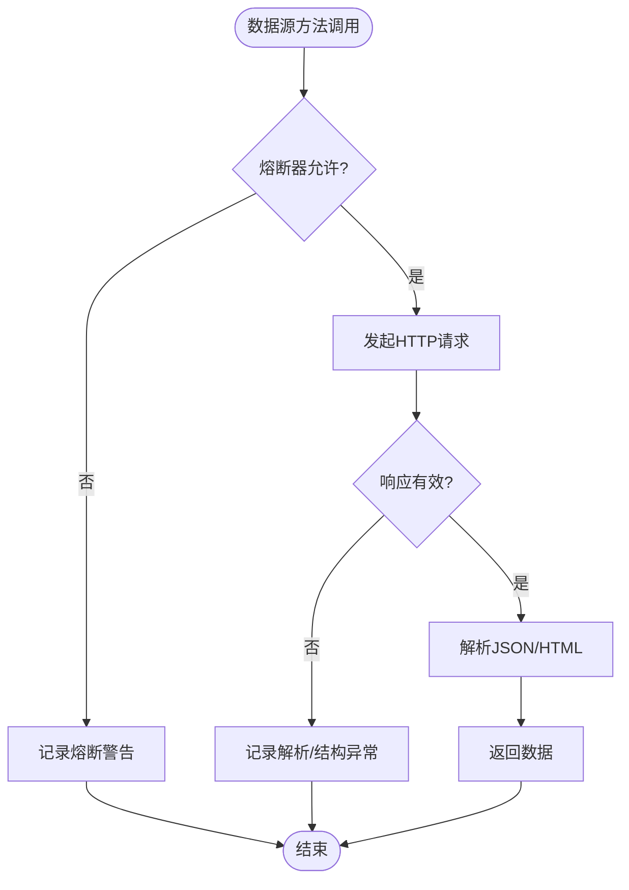
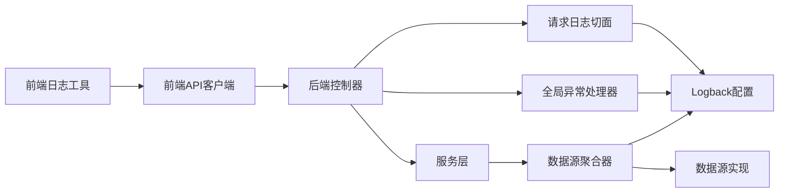

# 日志系统实现

<cite>
**本文档引用的文件**
- [logback-spring.xml](file://src/main/resources/logback-spring.xml)
- [RequestLoggingAspect.java](file://src/main/java/com/qoder/fund/aspect/RequestLoggingAspect.java)
- [GlobalExceptionHandler.java](file://src/main/java/com/qoder/fund/common/GlobalExceptionHandler.java)
- [logger.ts](file://fund-web/src/utils/logger.ts)
- [client.ts](file://fund-web/src/api/client.ts)
- [EastMoneyDataSource.java](file://src/main/java/com/qoder/fund/datasource/EastMoneyDataSource.java)
- [FundDataAggregator.java](file://src/main/java/com/qoder/fund/datasource/FundDataAggregator.java)
- [FundController.java](file://src/main/java/com/qoder/fund/controller/FundController.java)
- [FundService.java](file://src/main/java/com/qoder/fund/service/FundService.java)
</cite>

## 目录
1. [简介](#简介)
2. [项目结构](#项目结构)
3. [核心组件](#核心组件)
4. [架构总览](#架构总览)
5. [详细组件分析](#详细组件分析)
6. [依赖关系分析](#依赖关系分析)
7. [性能考虑](#性能考虑)
8. [故障排除指南](#故障排除指南)
9. [结论](#结论)

## 简介
本项目实现了多层次、多维度的日志系统，涵盖后端Spring Boot应用、数据源层、以及前端Web应用。后端采用Logback作为日志框架，结合异步Appender提升性能；前端使用自定义Logger工具类记录API交互与运行状态；同时通过AOP切面统一记录HTTP请求/响应信息，并通过全局异常处理器捕获未处理异常。

## 项目结构
日志系统分布在以下层次：
- 后端资源层：Logback配置文件定义日志输出策略
- 后端服务层：AOP切面统一记录请求日志，全局异常处理器记录异常
- 数据源层：各数据源组件记录网络请求、解析结果与降级逻辑
- 前端Web层：自定义Logger工具类记录用户交互与API调用

**图表来源**
- [client.ts](file://fund-web/src/api/client.ts)
- [logger.ts](file://fund-web/src/utils/logger.ts)
- [FundController.java](file://src/main/java/com/qoder/fund/controller/FundController.java)
- [RequestLoggingAspect.java](file://src/main/java/com/qoder/fund/aspect/RequestLoggingAspect.java)
- [GlobalExceptionHandler.java](file://src/main/java/com/qoder/fund/common/GlobalExceptionHandler.java)
- [FundService.java](file://src/main/java/com/qoder/fund/service/FundService.java)
- [FundDataAggregator.java](file://src/main/java/com/qoder/fund/datasource/FundDataAggregator.java)
- [EastMoneyDataSource.java](file://src/main/java/com/qoder/fund/datasource/EastMoneyDataSource.java)
- [logback-spring.xml](file://src/main/resources/logback-spring.xml)

**章节来源**
- [logback-spring.xml](file://src/main/resources/logback-spring.xml)
- [client.ts](file://fund-web/src/api/client.ts)
- [logger.ts](file://fund-web/src/utils/logger.ts)

## 核心组件
- Logback日志配置：定义控制台与文件输出、滚动策略、异步Appender及不同环境下的日志级别
- 请求日志切面：拦截所有@RestController方法，记录请求URL、参数、客户端IP、耗时与异常
- 全局异常处理器：集中捕获各类异常，记录请求路径与异常信息，返回统一结果
- 前端日志工具：提供可配置的日志级别、上下文、API请求/响应/错误记录
- 数据源日志：在数据源层记录HTTP请求、解析结果、降级策略与错误信息

**章节来源**
- [logback-spring.xml](file://src/main/resources/logback-spring.xml)
- [RequestLoggingAspect.java](file://src/main/java/com/qoder/fund/aspect/RequestLoggingAspect.java)
- [GlobalExceptionHandler.java](file://src/main/java/com/qoder/fund/common/GlobalExceptionHandler.java)
- [logger.ts](file://fund-web/src/utils/logger.ts)
- [EastMoneyDataSource.java](file://src/main/java/com/qoder/fund/datasource/EastMoneyDataSource.java)

## 架构总览
后端日志架构通过Logback配置实现多Appender输出与异步写入，结合AOP与异常处理器形成完整的请求生命周期日志链路。前端通过API拦截器与自定义Logger记录用户行为与网络交互，便于问题定位与性能分析。

**图表来源**
- [client.ts](file://fund-web/src/api/client.ts)
- [RequestLoggingAspect.java](file://src/main/java/com/qoder/fund/aspect/RequestLoggingAspect.java)
- [FundController.java](file://src/main/java/com/qoder/fund/controller/FundController.java)
- [FundService.java](file://src/main/java/com/qoder/fund/service/FundService.java)
- [FundDataAggregator.java](file://src/main/java/com/qoder/fund/datasource/FundDataAggregator.java)
- [EastMoneyDataSource.java](file://src/main/java/com/qoder/fund/datasource/EastMoneyDataSource.java)
- [logback-spring.xml](file://src/main/resources/logback-spring.xml)

## 详细组件分析

### 后端日志配置（Logback）
- 输出目标：控制台与多文件Appender（INFO/WARN/ERROR/ALL）
- 滚动策略：按大小与时间滚动，设置最大文件大小、保留天数与总容量上限
- 异步输出：INFO/WARN/ERROR/ALL分别使用AsyncAppender，队列大小与丢弃阈值优化吞吐
- 环境区分：开发环境打印DEBUG以上，生产环境INFO以上，同时输出到异步文件
- 特定模块日志：数据源、HTTP客户端、MyBatis、连接池与Spring框架

**图表来源**
- [logback-spring.xml](file://src/main/resources/logback-spring.xml)

**章节来源**
- [logback-spring.xml](file://src/main/resources/logback-spring.xml)

### 请求日志切面（AOP）
- 切入点：所有@RestController注解的类
- 记录内容：HTTP方法、完整URL、客户端IP、参数（截断）、执行耗时、成功/异常状态
- IP解析：支持X-Forwarded-For、X-Real-IP与远端地址，处理多级代理
- 敏感参数过滤：对参数字符串进行长度限制，防止日志过大

**图表来源**
- [RequestLoggingAspect.java](file://src/main/java/com/qoder/fund/aspect/RequestLoggingAspect.java)

**章节来源**
- [RequestLoggingAspect.java](file://src/main/java/com/qoder/fund/aspect/RequestLoggingAspect.java)

### 全局异常处理器
- 统一捕获：参数校验失败、绑定异常、并发冲突、数据库访问异常、运行时异常与未知异常
- 记录格式：包含请求路径（方法+URI+查询参数）、异常类型与消息
- 返回规范：封装统一结果对象，包含状态码与提示信息

**图表来源**
- [GlobalExceptionHandler.java](file://src/main/java/com/qoder/fund/common/GlobalExceptionHandler.java)

**章节来源**
- [GlobalExceptionHandler.java](file://src/main/java/com/qoder/fund/common/GlobalExceptionHandler.java)

### 前端日志工具（Logger）
- 配置项：启用开关、最小日志级别、是否输出到控制台
- 环境策略：开发环境默认启用DEBUG级别，生产环境默认仅记录WARN及以上
- 方法能力：debug/info/warn/error，支持格式化前缀与堆栈输出
- API日志：提供apiRequest/apiResponse/apiError便捷方法
- 上下文扩展：支持父子Logger，便于模块化追踪

**图表来源**
- [logger.ts](file://fund-web/src/utils/logger.ts)

**章节来源**
- [logger.ts](file://fund-web/src/utils/logger.ts)

### 前端API拦截器与日志
- 请求拦截：记录请求方法、URL与参数，计算耗时
- 响应拦截：根据响应码判断业务状态，记录响应日志与错误提示
- 错误处理：区分网络错误、超时与服务端错误，统一提示用户

**图表来源**
- [client.ts](file://fund-web/src/api/client.ts)
- [logger.ts](file://fund-web/src/utils/logger.ts)

**章节来源**
- [client.ts](file://fund-web/src/api/client.ts)
- [logger.ts](file://fund-web/src/utils/logger.ts)

### 数据源层日志
- 熔断保护：当熔断器开启时记录警告日志并跳过请求
- HTTP请求：记录GET/Referer请求与异常，避免泄露敏感信息
- 解析与降级：记录解析错误、API返回结构异常与降级策略
- 数据库回退：记录从数据库读取最新净值与异常回退路径

**图表来源**
- [EastMoneyDataSource.java](file://src/main/java/com/qoder/fund/datasource/EastMoneyDataSource.java)
- [FundDataAggregator.java](file://src/main/java/com/qoder/fund/datasource/FundDataAggregator.java)

**章节来源**
- [EastMoneyDataSource.java](file://src/main/java/com/qoder/fund/datasource/EastMoneyDataSource.java)
- [FundDataAggregator.java](file://src/main/java/com/qoder/fund/datasource/FundDataAggregator.java)

## 依赖关系分析
- 前端API客户端依赖前端日志工具，统一记录请求/响应/错误
- 后端控制器依赖AOP切面与全局异常处理器，确保请求生命周期日志与异常处理一致
- 服务层依赖数据源聚合器，数据源聚合器再依赖具体数据源实现
- 日志系统通过Logback配置文件统一管理输出目标与级别

**图表来源**
- [client.ts](file://fund-web/src/api/client.ts)
- [logger.ts](file://fund-web/src/utils/logger.ts)
- [RequestLoggingAspect.java](file://src/main/java/com/qoder/fund/aspect/RequestLoggingAspect.java)
- [GlobalExceptionHandler.java](file://src/main/java/com/qoder/fund/common/GlobalExceptionHandler.java)
- [FundService.java](file://src/main/java/com/qoder/fund/service/FundService.java)
- [FundDataAggregator.java](file://src/main/java/com/qoder/fund/datasource/FundDataAggregator.java)
- [EastMoneyDataSource.java](file://src/main/java/com/qoder/fund/datasource/EastMoneyDataSource.java)
- [logback-spring.xml](file://src/main/resources/logback-spring.xml)

**章节来源**
- [client.ts](file://fund-web/src/api/client.ts)
- [logger.ts](file://fund-web/src/utils/logger.ts)
- [RequestLoggingAspect.java](file://src/main/java/com/qoder/fund/aspect/RequestLoggingAspect.java)
- [GlobalExceptionHandler.java](file://src/main/java/com/qoder/fund/common/GlobalExceptionHandler.java)
- [FundService.java](file://src/main/java/com/qoder/fund/service/FundService.java)
- [FundDataAggregator.java](file://src/main/java/com/qoder/fund/datasource/FundDataAggregator.java)
- [EastMoneyDataSource.java](file://src/main/java/com/qoder/fund/datasource/EastMoneyDataSource.java)
- [logback-spring.xml](file://src/main/resources/logback-spring.xml)

## 性能考虑
- 异步日志：INFO/WARN/ERROR/ALL使用AsyncAppender，减少I/O阻塞
- 滚动策略：按大小与时间滚动，限制文件数量与总容量，避免磁盘占用过高
- 参数截断：前端与后端均对日志参数进行截断，防止大对象日志影响性能
- 熔断保护：数据源层在熔断状态下快速失败并记录日志，避免雪崩效应
- 缓存与降级：数据源聚合器在主源失败时快速降级到备用源或兜底方案

## 故障排除指南
- 请求无日志：确认AOP切面是否生效，检查@RestController注解与包扫描路径
- 异常未被捕获：检查全局异常处理器是否注册，确认异常类型分支覆盖
- 日志级别过高：调整Logback配置中的root级别与模块级别，生产环境建议INFO以上
- 前端日志不显示：检查前端日志工具的最小级别与环境变量，生产环境默认仅记录警告及以上
- 数据源异常：查看数据源日志中HTTP请求与解析错误，确认API变更或限流策略

**章节来源**
- [RequestLoggingAspect.java](file://src/main/java/com/qoder/fund/aspect/RequestLoggingAspect.java)
- [GlobalExceptionHandler.java](file://src/main/java/com/qoder/fund/common/GlobalExceptionHandler.java)
- [logback-spring.xml](file://src/main/resources/logback-spring.xml)
- [logger.ts](file://fund-web/src/utils/logger.ts)
- [EastMoneyDataSource.java](file://src/main/java/com/qoder/fund/datasource/EastMoneyDataSource.java)

## 结论
本项目的日志系统通过后端Logback配置、AOP切面与全局异常处理器实现了全链路请求日志与异常处理，前端通过API拦截器与自定义Logger记录用户交互与网络状态。数据源层在复杂降级与熔断场景下提供了充分的可观测性。整体设计兼顾性能与可维护性，适合在生产环境中稳定运行。