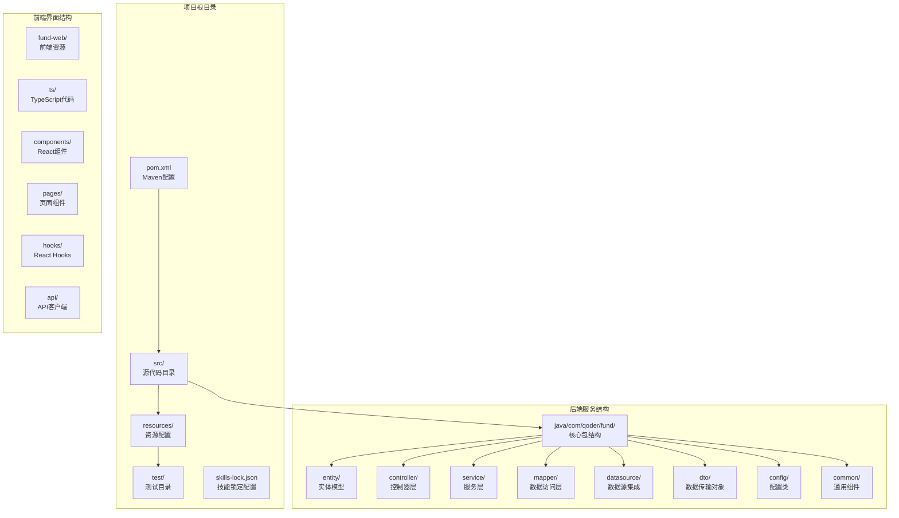
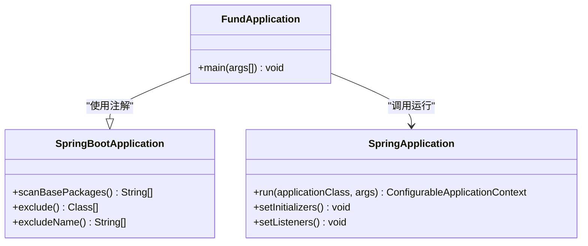
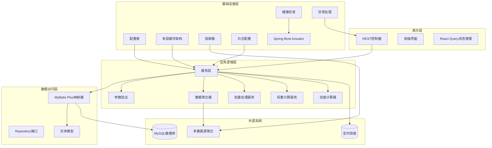
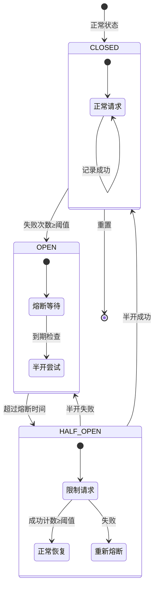
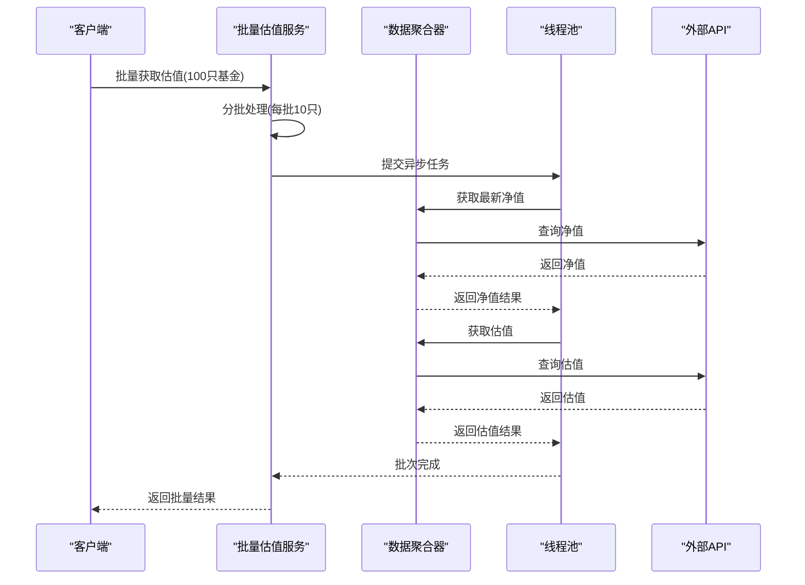
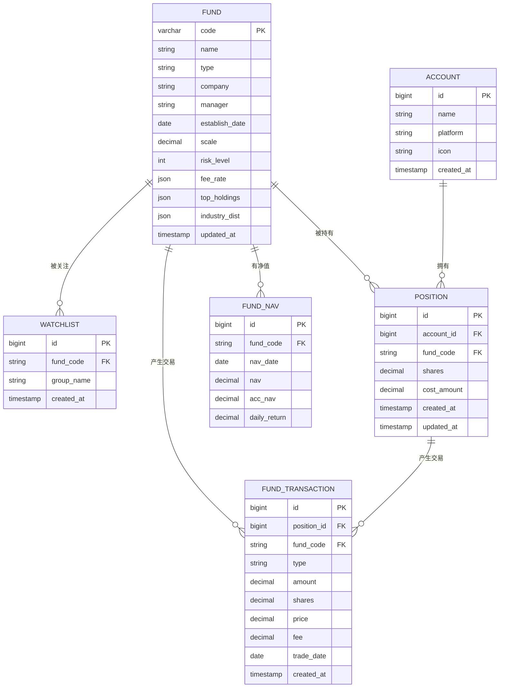
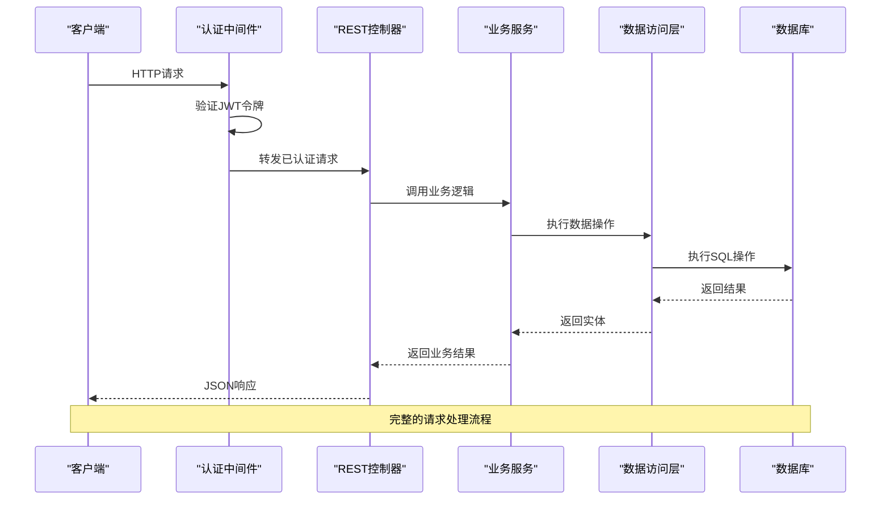
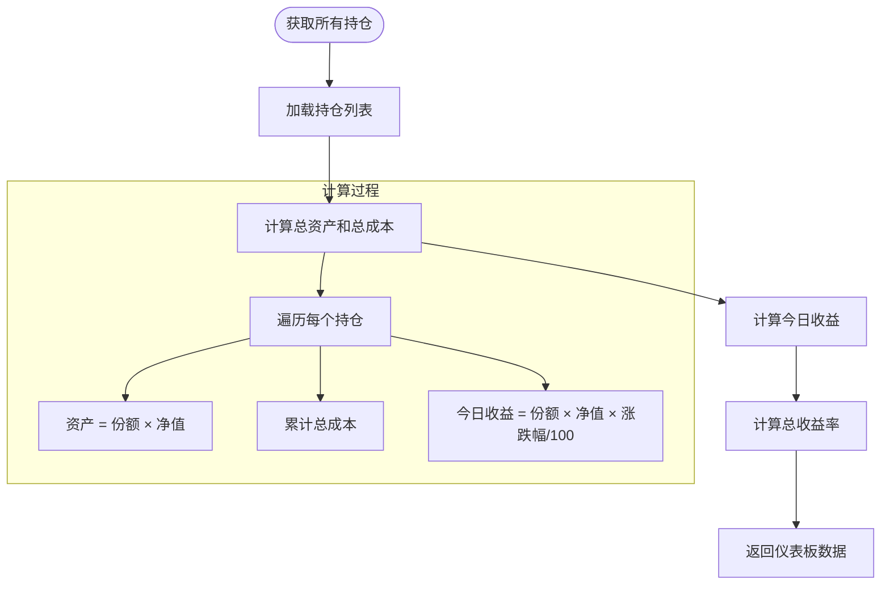
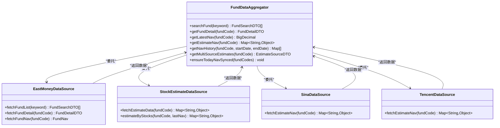
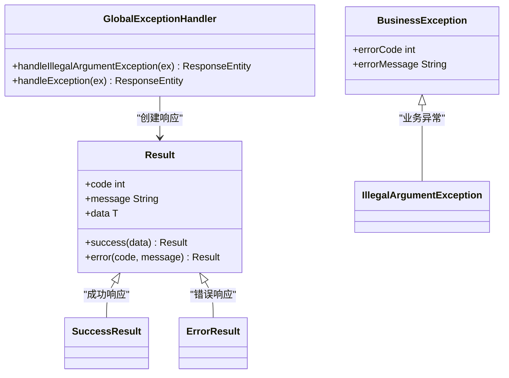

# 核心功能开发

<cite>
**本文档引用的文件**
- [FundApplication.java](file://src/main/java/com/qoder/fund/FundApplication.java)
- [Account.java](file://src/main/java/com/qoder/fund/entity/Account.java)
- [Fund.java](file://src/main/java/com/qoder/fund/entity/Fund.java)
- [FundNav.java](file://src/main/java/com/qoder/fund/entity/FundNav.java)
- [FundTransaction.java](file://src/main/java/com/qoder/fund/entity/FundTransaction.java)
- [Position.java](file://src/main/java/com/qoder/fund/entity/Position.java)
- [Watchlist.java](file://src/main/java/com/qoder/fund/entity/Watchlist.java)
- [AccountController.java](file://src/main/java/com/qoder/fund/controller/AccountController.java)
- [DashboardController.java](file://src/main/java/com/qoder/fund/controller/DashboardController.java)
- [FundController.java](file://src/main/java/com/qoder/fund/controller/FundController.java)
- [PositionController.java](file://src/main/java/com/qoder/fund/controller/PositionController.java)
- [WatchlistController.java](file://src/main/java/com/qoder/fund/controller/WatchlistController.java)
- [AccountService.java](file://src/main/java/com/qoder/fund/service/AccountService.java)
- [DashboardService.java](file://src/main/java/com/qoder/fund/service/DashboardService.java)
- [FundService.java](file://src/main/java/com/qoder/fund/service/FundService.java)
- [PositionService.java](file://src/main/java/com/qoder/fund/service/PositionService.java)
- [WatchlistService.java](file://src/main/java/com/qoder/fund/service/WatchlistService.java)
- [CacheConfig.java](file://src/main/java/com/qoder/fund/config/CacheConfig.java)
- [CircuitBreaker.java](file://src/main/java/com/qoder/fund/config/CircuitBreaker.java)
- [HealthCheckConfig.java](file://src/main/java/com/qoder/fund/config/HealthCheckConfig.java)
- [BatchEstimateService.java](file://src/main/java/com/qoder/fund/service/BatchEstimateService.java)
- [EstimateWeightService.java](file://src/main/java/com/qoder/fund/service/EstimateWeightService.java)
- [FundDataAggregator.java](file://src/main/java/com/qoder/fund/datasource/FundDataAggregator.java)
- [FundEstimateCalculator.java](file://src/main/java/com/qoder/fund/service/FundEstimateCalculator.java)
- [application.yml](file://src/main/resources/application.yml)
- [schema.sql](file://src/main/resources/db/schema.sql)
- [data.sql](file://src/main/resources/db/data.sql)
- [FundApplicationTests.java](file://src/test/java/com/qoder/fund/FundApplicationTests.java)
- [pom.xml](file://pom.xml)
- [skills-lock.json](file://skills-lock.json)
- [PRD.md](file://PRD.md)
- [TODOS.md](file://TODOS.md)
- [package.json](file://fund-web/package.json)
- [eslint.config.js](file://fund-web/eslint.config.js)
- [fund-web/.eslintrc.cjs](file://fund-web/.eslintrc.cjs)
- [fund-web/src/api/client.ts](file://fund-web/src/api/client.ts)
- [fund-web/src/hooks/useFundData.ts](file://fund-web/src/hooks/useFundData.ts)
- [fund-web/vite.config.ts](file://fund-web/vite.config.ts)
</cite>

## 更新摘要
**变更内容**
- 新增多层缓存架构配置，支持热/温/冷/持久化四级缓存策略
- 集成熔断器模式，实现对外部数据源的容错保护
- 新增批量处理服务，优化多基金估值查询性能
- 完善健康检查配置，集成数据库、数据源和缓存健康监控
- 前端集成React Query，实现现代化状态管理和缓存策略
- 更新ESLint配置，采用最新的flat配置规范

## 目录
1. [简介](#简介)
2. [项目结构](#项目结构)
3. [核心组件](#核心组件)
4. [架构概览](#架构概览)
5. [多层缓存架构](#多层缓存架构)
6. [熔断器模式](#熔断器模式)
7. [批量处理服务](#批量处理服务)
8. [健康检查配置](#健康检查配置)
9. [数据库集成](#数据库集成)
10. [REST API开发](#rest-api开发)
11. [服务层架构](#服务层架构)
12. [数据源集成](#数据源集成)
13. [异常处理与统一响应](#异常处理与统一响应)
14. [定时任务与数据同步](#定时任务与数据同步)
15. [前端现代化实践](#前端现代化实践)
16. [测试策略](#测试策略)
17. [性能考虑](#性能考虑)
18. [故障排除指南](#故障排除指南)
19. [技能管理与DevTools集成](#技能管理与devtools集成)
20. [结论](#结论)

## 简介

本指南面向希望在现有Spring Boot基础上扩展基金管理系统核心功能的开发者。该文档提供了从零开始构建完整基金管理系统的技术路线图，包括数据库实体设计、RESTful API开发、服务层架构、数据源集成、异常处理机制等关键功能模块。

**重要更新**：系统已完全基于Spring Boot和现代Web技术栈构建，集成了多层缓存架构、熔断器模式、批量处理服务、健康检查配置等核心架构改进，以及React Query集成、ESLint配置等现代化开发实践。

## 项目结构

当前项目采用标准的Spring Boot项目结构，包含完整的后端服务架构和前端界面，并集成了现代化的缓存和状态管理技术。



**图表来源**
- [pom.xml:1-55](file://pom.xml#L1-L55)
- [FundApplication.java:1-14](file://src/main/java/com/qoder/fund/FundApplication.java#L1-L14)
- [skills-lock.json:1-11](file://skills-lock.json#L1-L11)

**章节来源**
- [pom.xml:1-55](file://pom.xml#L1-L55)
- [FundApplication.java:1-14](file://src/main/java/com/qoder/fund/FundApplication.java#L1-L14)
- [skills-lock.json:1-11](file://skills-lock.json#L1-L11)

## 核心组件

### 应用程序入口点

应用程序使用标准的Spring Boot启动类作为入口点，具备自动配置和组件扫描功能。



**图表来源**
- [FundApplication.java:6-13](file://src/main/java/com/qoder/fund/FundApplication.java#L6-L13)

### 配置管理

基础的YAML配置文件支持应用程序的基本设置，包含数据库连接、缓存配置、日志配置等。

**章节来源**
- [application.yml:1-68](file://src/main/resources/application.yml#L1-L68)

## 架构概览

基金管理系统采用分层架构设计，包含表示层、业务逻辑层、数据访问层和基础设施层，并集成了现代化的缓存和状态管理技术。



## 多层缓存架构

系统实现了四级缓存架构，根据数据的冷热程度采用不同的缓存策略，提升系统性能和响应速度。

```mermaid
graph TB
subgraph "多层缓存架构"
SUBGRAPH "热数据缓存 (1分钟)"
HOT_CACHE[HOT_CACHE_MANAGER<br/>位置估值<br/>自选估值<br/>多源估值<br/>maximumSize=500<br/>expireAfterWrite=60s]
END
SUBGRAPH "温数据缓存 (5分钟)"
WARM_CACHE[CACHE_MANAGER<br/>基金搜索<br/>基金详情<br/>净值历史<br/>maximumSize=2000<br/>expireAfterWrite=300s]
END
SUBGRAPH "冷数据缓存 (1小时)"
COLD_CACHE[COLD_CACHE_MANAGER<br/>搜索历史<br/>持仓列表<br/>maximumSize=1000<br/>expireAfterWrite=3600s]
END
SUBGRAPH "持久数据缓存 (24小时)"
PERSISTENT_CACHE[PERSISTENT_CACHE_MANAGER<br/>基金基本信息<br/>maximumSize=500<br/>expireAfterWrite=86400s]
END
END
WARM_CACHE --> AGGREGATOR[FundDataAggregator]
HOT_CACHE --> BATCH[BatchEstimateService]
COLD_CACHE --> SERVICE[业务服务层]
PERSISTENT_CACHE --> SERVICE
```

**图表来源**
- [CacheConfig.java:22-92](file://src/main/java/com/qoder/fund/config/CacheConfig.java#L22-L92)

### 缓存配置详解

系统采用Caffeine缓存管理器，支持不同级别的缓存策略：

1. **热数据缓存** (`hotCacheManager`)
   - 适用场景：用户持仓、自选基金实时估值
   - 配置：500条最大容量，1分钟过期时间
   - 缓存键：`positionEstimate`, `watchlistEstimate`, `multiSourceEstimates`

2. **温数据缓存** (`cacheManager` - 默认)
   - 适用场景：基金搜索、详情、净值历史
   - 配置：2000条最大容量，5分钟过期时间
   - 缓存键：`fundSearch`, `fundDetail`, `navHistory`, `estimateNav`

3. **冷数据缓存** (`coldCacheManager`)
   - 适用场景：搜索历史、不常用基金信息
   - 配置：1000条最大容量，1小时过期时间
   - 缓存键：`fundSearchHistory`, `allHoldings`

4. **持久数据缓存** (`persistentCacheManager`)
   - 适用场景：基金基本信息、不频繁变化的数据
   - 配置：500条最大容量，24小时过期时间
   - 缓存键：`fundBasicInfo`

**章节来源**
- [CacheConfig.java:22-92](file://src/main/java/com/qoder/fund/config/CacheConfig.java#L22-L92)

## 熔断器模式

系统实现了简易熔断器，用于外部API调用的容错保护，防止级联故障和雪崩效应。



**图表来源**
- [CircuitBreaker.java:24-28](file://src/main/java/com/qoder/fund/config/CircuitBreaker.java#L24-L28)

### 熔断器配置

系统为不同数据源配置了不同的熔断参数：

| 数据源 | 失败阈值 | 熔断时长 | 半开最大尝试 |
|--------|----------|----------|--------------|
| eastmoney | 3次 | 60秒 | 3次 |
| sina | 5次 | 30秒 | 3次 |
| tencent | 5次 | 30秒 | 3次 |
| stock | 10次 | 20秒 | 无限制 |

### 熔断器状态管理

熔断器支持三种状态转换：
1. **CLOSED（关闭）**：正常请求状态
2. **OPEN（打开）**：熔断状态，拒绝请求
3. **HALF_OPEN（半开）**：尝试恢复状态，有限制的请求

**章节来源**
- [CircuitBreaker.java:119-221](file://src/main/java/com/qoder/fund/config/CircuitBreaker.java#L119-L221)

## 批量处理服务

系统提供了高性能的批量处理服务，优化多基金估值查询的性能，减少外部API调用次数。



**图表来源**
- [BatchEstimateService.java:42-76](file://src/main/java/com/qoder/fund/service/BatchEstimateService.java#L42-L76)

### 批量处理策略

系统采用分批异步处理策略：

1. **批量查询线程池**
   - 线程数：CPU核心数×2
   - 线程命名：`batch-estimate-{序号}`
   - 用途：并行处理多个基金的估值查询

2. **分批处理策略**
   - **净值查询**：每批10只基金，超时10秒
   - **估值查询**：每批5只基金，超时30秒，添加50ms延迟
   - **多源估值**：每批3只基金，超时60秒，添加100ms延迟

3. **超时控制**
   - 所有批量操作设置合理超时时间
   - 异常情况下记录警告日志而非中断整个流程

**章节来源**
- [BatchEstimateService.java:24-34](file://src/main/java/com/qoder/fund/service/BatchEstimateService.java#L24-L34)
- [BatchEstimateService.java:42-172](file://src/main/java/com/qoder/fund/service/BatchEstimateService.java#L42-L172)

## 健康检查配置

系统集成了Spring Boot Actuator，提供全面的健康检查功能，监控数据库、数据源和缓存状态。

```mermaid
graph TB
subgraph "健康检查架构"
ACTUATOR[Spring Boot Actuator]
DATABASE[数据库健康检查]
DATASOURCE[数据源健康检查]
CACHE[缓存健康检查]
STATS[缓存统计信息]
end
subgraph "健康状态"
UP[HEALTHY]
DEGRADED[DEGRADED]
DOWN[DOWN]
END
DATABASE --> STATS
DATASOURCE --> STATS
CACHE --> STATS
STATS --> UP
STATS --> DEGRADED
STATS --> DOWN
```

**图表来源**
- [HealthCheckConfig.java:28-104](file://src/main/java/com/qoder/fund/config/HealthCheckConfig.java#L28-L104)

### 健康检查指标

系统提供三个层面的健康检查：

1. **数据库健康检查**
   - 连接有效性验证
   - 连接超时时间：5秒
   - 状态详情：MySQL、连接状态

2. **数据源健康检查**
   - 监控四个主要数据源状态
   - 熔断器状态统计
   - 健康级别判断：
     - 全部正常：HEALTHY
     - 1-2个熔断：DEGRADED
     - 3个及以上熔断：DOWN

3. **缓存健康检查**
   - Caffeine缓存状态
   - 缓存命中率统计
   - 缓存性能监控

**章节来源**
- [HealthCheckConfig.java:28-104](file://src/main/java/com/qoder/fund/config/HealthCheckConfig.java#L28-L104)

## 数据库集成

### 实体模型设计

系统包含6个核心实体表，采用MyBatis Plus注解进行ORM映射。



**图表来源**
- [Account.java:10-21](file://src/main/java/com/qoder/fund/entity/Account.java#L10-L21)
- [Fund.java:16-41](file://src/main/java/com/qoder/fund/entity/Fund.java#L16-L41)
- [FundNav.java:11-23](file://src/main/java/com/qoder/fund/entity/FundNav.java#L11-L23)
- [Position.java:11-24](file://src/main/java/com/qoder/fund/entity/Position.java#L11-L24)
- [FundTransaction.java:12-28](file://src/main/java/com/qoder/fund/entity/FundTransaction.java#L12-L28)
- [Watchlist.java:10-20](file://src/main/java/com/qoder/fund/entity/Watchlist.java#L10-L20)

### 数据库初始化脚本

系统包含完整的数据库初始化脚本，定义了表结构和初始数据。

**章节来源**
- [schema.sql:1-200](file://src/main/resources/db/schema.sql#L1-L200)
- [data.sql:1-100](file://src/main/resources/db/data.sql#L1-L100)

## REST API开发

### 控制器架构

系统提供完整的REST API接口，涵盖基金管理系统的核心功能。



**图表来源**
- [AccountController.java:12-35](file://src/main/java/com/qoder/fund/controller/AccountController.java#L12-L35)
- [DashboardController.java:10-26](file://src/main/java/com/qoder/fund/controller/DashboardController.java#L10-L26)
- [FundController.java:15-45](file://src/main/java/com/qoder/fund/controller/FundController.java#L15-L45)
- [PositionController.java:15-51](file://src/main/java/com/qoder/fund/controller/PositionController.java#L15-L51)
- [WatchlistController.java:12-35](file://src/main/java/com/qoder/fund/controller/WatchlistController.java#L12-L35)

### API端点设计

#### 账户管理API

| 端点 | 方法 | 功能描述 | 请求参数 | 响应内容 |
|------|------|----------|----------|----------|
| `/api/accounts` | GET | 获取账户列表 | 无 | 账户数组 |
| `/api/accounts` | POST | 创建新账户 | `{name, platform}` | 成功状态 |
| `/api/accounts/{id}` | DELETE | 删除账户 | 路径参数 | 成功状态 |

#### 仪表板API

| 端点 | 方法 | 功能描述 | 请求参数 | 响应内容 |
|------|------|----------|----------|----------|
| `/api/dashboard` | GET | 获取仪表板数据 | 无 | 仪表板DTO |
| `/api/dashboard/profit-trend` | GET | 获取收益趋势 | `days`(可选) | 收益趋势DTO |

#### 基金查询API

| 端点 | 方法 | 功能描述 | 请求参数 | 响应内容 |
|------|------|----------|----------|----------|
| `/api/fund/search` | GET | 搜索基金 | `keyword`(必需) | 搜索结果数组 |
| `/api/fund/{code}` | GET | 获取基金详情 | 路径参数 | 基金详情DTO |
| `/api/fund/{code}/nav-history` | GET | 获取净值历史 | `period`(可选) | 净值历史DTO |

#### 持仓管理API

| 端点 | 方法 | 功能描述 | 请求参数 | 响应内容 |
|------|------|----------|----------|----------|
| `/api/positions` | GET | 获取持仓列表 | `accountId`(可选) | 持仓DTO数组 |
| `/api/positions` | POST | 添加新持仓 | AddPositionRequest | 成功状态 |
| `/api/positions/{id}` | DELETE | 删除持仓 | 路径参数 | 成功状态 |
| `/api/positions/{id}/transaction` | PUT | 添加交易记录 | AddTransactionRequest | 成功状态 |
| `/api/positions/{id}/transactions` | GET | 获取交易记录 | 路径参数 | 交易记录数组 |

#### 自选列表API

| 端点 | 方法 | 功能描述 | 请求参数 | 响应内容 |
|------|------|----------|----------|----------|
| `/api/watchlist` | GET | 获取自选列表 | `group`(可选) | 包含列表和分组的映射 |
| `/api/watchlist` | POST | 添加到自选 | AddWatchlistRequest | 成功状态 |
| `/api/watchlist/{id}` | DELETE | 从自选移除 | 路径参数 | 成功状态 |

**章节来源**
- [AccountController.java:19-34](file://src/main/java/com/qoder/fund/controller/AccountController.java#L19-L34)
- [DashboardController.java:17-25](file://src/main/java/com/qoder/fund/controller/DashboardController.java#L17-L25)
- [FundController.java:22-44](file://src/main/java/com/qoder/fund/controller/FundController.java#L22-L44)
- [PositionController.java:22-50](file://src/main/java/com/qoder/fund/controller/PositionController.java#L22-L50)
- [WatchlistController.java:19-34](file://src/main/java/com/qoder/fund/controller/WatchlistController.java#L19-L34)

## 服务层架构

### 服务层设计模式

系统采用服务层封装业务逻辑，提供清晰的职责分离。


**图表来源**
- [AccountService.java:13-40](file://src/main/java/com/qoder/fund/service/AccountService.java#L13-L40)
- [DashboardService.java:16-82](file://src/main/java/com/qoder/fund/service/DashboardService.java#L16-L82)
- [FundService.java:18-64](file://src/main/java/com/qoder/fund/service/FundService.java#L18-L64)
- [PositionService.java:24-161](file://src/main/java/com/qoder/fund/service/PositionService.java#L24-L161)
- [WatchlistService.java:18-105](file://src/main/java/com/qoder/fund/service/WatchlistService.java#L18-L105)

### 业务逻辑实现

#### 仪表板服务实现



**图表来源**
- [DashboardService.java:22-62](file://src/main/java/com/qoder/fund/service/DashboardService.java#L22-L62)

**章节来源**
- [DashboardService.java:22-82](file://src/main/java/com/qoder/fund/service/DashboardService.java#L22-L82)
- [PositionService.java:118-160](file://src/main/java/com/qoder/fund/service/PositionService.java#L118-L160)

## 数据源集成

### 外部数据源集成

系统集成了多个数据源，提供基金实时数据获取功能，并实现了熔断器保护和多级缓存策略。



**图表来源**
- [FundDataAggregator.java:45-55](file://src/main/java/com/qoder/fund/datasource/FundDataAggregator.java#L45-L55)
- [EastMoneyDataSource.java](file://src/main/java/com/qoder/fund/datasource/EastMoneyDataSource.java)
- [StockEstimateDataSource.java](file://src/main/java/com/qoder/fund/datasource/StockEstimateDataSource.java)
- [SinaDataSource.java](file://src/main/java/com/qoder/fund/datasource/SinaDataSource.java)
- [TencentDataSource.java](file://src/main/java/com/qoder/fund/datasource/TencentDataSource.java)

### 数据聚合器设计

数据聚合器负责协调多个数据源，提供统一的数据访问接口，并实现了智能估值计算。

**章节来源**
- [FundDataAggregator.java:45-55](file://src/main/java/com/qoder/fund/datasource/FundDataAggregator.java#L45-L55)

## 异常处理与统一响应

### 统一响应包装

系统实现了统一的响应包装机制，提供标准化的API响应格式。



**图表来源**
- [Result.java](file://src/main/java/com/qoder/fund/common/Result.java)
- [GlobalExceptionHandler.java](file://src/main/java/com/qoder/fund/common/GlobalExceptionHandler.java)

### 异常处理机制

系统提供完善的异常处理机制，确保API调用的健壮性。

**章节来源**
- [Result.java](file://src/main/java/com/qoder/fund/common/Result.java)
- [GlobalExceptionHandler.java](file://src/main/java/com/qoder/fund/common/GlobalExceptionHandler.java)

## 定时任务与数据同步

### 定时任务调度

系统集成了定时任务功能，用于自动同步基金数据。

```mermaid
gantt
title 基金数据同步定时任务
dateFormat X
axisFormat %H:%M:%S
section 数据同步
同步净值数据 :active, 0, 30m
section 数据清理
清理过期数据 :active, 1d, 1h
section 系统维护
系统健康检查 :active, 1h, 15m
```

**图表来源**
- [FundDataSyncScheduler.java](file://src/main/java/com/qoder/fund/scheduler/FundDataSyncScheduler.java)

### 数据同步策略

系统采用定时任务机制，定期从外部数据源同步基金数据。

**章节来源**
- [FundDataSyncScheduler.java](file://src/main/java/com/qoder/fund/scheduler/FundDataSyncScheduler.java)

## 前端现代化实践

### React Query集成

系统前端集成了React Query，提供现代化的状态管理和缓存策略。

```mermaid
graph TB
subgraph "React Query架构"
QUERY_CLIENT[QueryClient]
QUERY_KEY[查询键管理]
CACHE[本地缓存]
INVALIDATE[失效策略]
REFETCH[自动刷新]
END
subgraph "查询钩子"
DASHBOARD[useDashboardData]
PROFIT_TREND[useProfitTrend]
FUND_DETAIL[useFundDetail]
FUND_SEARCH[useFundSearch]
POSITIONS[usePositions]
WATCHLIST[useWatchlist]
END
subgraph "突变钩子"
ADD_WATCHLIST[useAddWatchlist]
REMOVE_WATCHLIST[useRemoveWatchlist]
ADD_POSITION[useAddPosition]
REFRESH_DATA[useRefreshFundData]
END
QUERY_CLIENT --> CACHE
QUERY_CLIENT --> INVALIDATE
QUERY_CLIENT --> REFETCH
DASHBOARD --> QUERY_CLIENT
PROFIT_TREND --> QUERY_CLIENT
FUND_DETAIL --> QUERY_CLIENT
FUND_SEARCH --> QUERY_CLIENT
POSITIONS --> QUERY_CLIENT
WATCHLIST --> QUERY_CLIENT
ADD_WATCHLIST --> QUERY_CLIENT
REMOVE_WATCHLIST --> QUERY_CLIENT
ADD_POSITION --> QUERY_CLIENT
REFRESH_DATA --> QUERY_CLIENT
```

**图表来源**
- [useFundData.ts:18-131](file://fund-web/src/hooks/useFundData.ts#L18-L131)

### 查询键管理

系统使用强类型的查询键管理，确保缓存的一致性和有效性：

```typescript
export const queryKeys = {
  dashboard: ['dashboard'] as const,
  fundDetail: (code: string) => ['fund', code] as const,
  fundSearch: (keyword: string) => ['fundSearch', keyword] as const,
  positions: (accountId?: number) => ['positions', accountId] as const,
  watchlist: ['watchlist'] as const,
  profitTrend: (days: number) => ['profitTrend', days] as const,
};
```

### 缓存策略

React Query配置了多种缓存策略：

1. **新鲜度控制**
   - 仪表板：30秒新鲜度
   - 基金详情：1分钟新鲜度
   - 持仓列表：30秒新鲜度
   - 自选列表：30秒新鲜度

2. **自动刷新**
   - 仪表板：每分钟自动刷新
   - 持仓列表：每分钟自动刷新
   - 自选列表：每分钟自动刷新

3. **重试机制**
   - 查询重试：2次
   - 搜索重试：1次

**章节来源**
- [useFundData.ts:18-131](file://fund-web/src/hooks/useFundData.ts#L18-L131)

### ESLint配置

系统采用了最新的flat配置规范，提供现代化的代码质量保证。

**章节来源**
- [eslint.config.js:1-24](file://fund-web/eslint.config.js#L1-L24)
- [.eslintrc.cjs:1-33](file://fund-web/.eslintrc.cjs#L1-L33)

## 测试策略

### 单元测试设计

系统包含完整的单元测试套件，覆盖核心业务逻辑。

```mermaid
graph TB
subgraph "测试层次"
UNIT[单元测试]
INTEGRATION[集成测试]
END_TO_END[端到端测试]
end
subgraph "测试覆盖范围"
ACCOUNT_TEST[账户服务测试]
POSITION_TEST[持仓服务测试]
FUND_TEST[基金服务测试]
WATCHLIST_TEST[自选服务测试]
BATCH_TEST[批量服务测试]
CIRCUIT_TEST[熔断器测试]
END
subgraph "测试工具"
MOCK[Mock对象]
TEST_DB[Test数据库]
ASSERT[Junit断言]
END
ACCOUNT_TEST --> UNIT
POSITION_TEST --> UNIT
FUND_TEST --> UNIT
WATCHLIST_TEST --> UNIT
BATCH_TEST --> UNIT
CIRCUIT_TEST --> UNIT
UNIT --> MOCK
INTEGRATION --> TEST_DB
END_TO_END --> ASSERT
```

**图表来源**
- [FundApplicationTests.java](file://src/test/java/com/qoder/fund/FundApplicationTests.java)

### 测试策略实施

系统采用分层测试策略，确保代码质量和系统稳定性。

**章节来源**
- [FundApplicationTests.java](file://src/test/java/com/qoder/fund/FundApplicationTests.java)

## 性能考虑

### 数据库性能优化

1. **索引优化**
   - 为常用查询字段建立复合索引
   - 优化关联查询的索引策略
   - 使用覆盖索引减少回表查询

2. **查询优化**
   - 实现分页查询处理大数据量
   - 使用批量操作减少数据库往返
   - 避免N+1查询问题

3. **连接池配置**
   - 合理配置连接池大小和超时时间
   - 使用连接池监控工具跟踪性能指标

### 缓存策略

1. **多级缓存架构**
   - 实现Redis缓存热点数据
   - 使用本地缓存减少数据库压力
   - 设置合理的缓存过期策略

2. **数据预热**
   - 在应用启动时预加载常用数据
   - 实现智能缓存失效机制
   - 监控缓存命中率和性能指标

### 异步处理

1. **异步任务处理**
   - 使用@Async注解处理耗时操作
   - 实现消息队列异步处理
   - 异步发送通知和报告

2. **并发控制**
   - 使用分布式锁防止重复操作
   - 实现乐观锁处理并发更新
   - 使用信号量控制并发数量

### 批量处理优化

1. **线程池管理**
   - 动态调整线程池大小
   - 实现任务优先级队列
   - 监控线程池执行状态

2. **内存管理**
   - 使用弱引用避免内存泄漏
   - 实现对象池复用
   - 监控垃圾回收性能

**章节来源**
- [CacheConfig.java:22-92](file://src/main/java/com/qoder/fund/config/CacheConfig.java#L22-L92)
- [BatchEstimateService.java:24-34](file://src/main/java/com/qoder/fund/service/BatchEstimateService.java#L24-L34)

## 故障排除指南

### 常见问题诊断

#### 启动失败问题

**问题症状**: 应用程序无法正常启动
**可能原因**:
- Java版本不兼容（需要Java 17+）
- Maven依赖冲突
- 配置文件格式错误

**解决方案**:
1. 检查Java版本是否符合要求
2. 清理Maven缓存并重新构建
3. 验证配置文件语法正确性

#### 数据库连接问题

**问题症状**: 应用启动时报数据库连接错误
**可能原因**:
- 数据库服务未启动
- 连接参数配置错误
- 驱动程序版本不匹配

**解决方案**:
1. 确认数据库服务状态
2. 验证连接URL和凭据
3. 检查防火墙和网络配置

#### API调用异常

**问题症状**: API调用返回错误或异常
**可能原因**:
- 参数验证失败
- 业务逻辑异常
- 数据访问层异常

**解决方案**:
1. 检查请求参数格式和类型
2. 查看服务层日志信息
3. 验证数据库连接状态

#### 缓存问题

**问题症状**: 缓存数据不一致或性能下降
**可能原因**:
- 缓存配置不当
- 缓存键设计不合理
- 缓存过期策略问题

**解决方案**:
1. 检查缓存配置参数
2. 验证缓存键生成逻辑
3. 监控缓存命中率和性能指标

#### 熔断器问题

**问题症状**: 熔断器状态异常或频繁触发
**可能原因**:
- 外部API响应时间过长
- 熔断器阈值配置不当
- 网络连接不稳定

**解决方案**:
1. 监控外部API响应时间
2. 调整熔断器配置参数
3. 检查网络连接稳定性

### 调试技巧

1. **启用详细日志**
   ```yaml
   logging:
     level:
       com.qoder.fund: DEBUG
       org.springframework.web: DEBUG
   ```

2. **使用Spring Boot Actuator**
   - 监控应用健康状态
   - 查看应用指标和配置
   - 远程查看应用信息

3. **数据库调试**
   - 启用SQL日志输出
   - 监控慢查询
   - 分析查询执行计划

4. **缓存调试**
   - 监控缓存命中率
   - 查看缓存统计信息
   - 分析缓存性能瓶颈

**章节来源**
- [application.yml:50-68](file://src/main/resources/application.yml#L50-L68)

## 技能管理与DevTools集成

### 当前技能配置状态

经过代码库检查，确认当前项目中已删除Chrome DevTools技能文档。系统当前的技能配置状态如下：

```json
{
  "version": 1,
  "skills": {
    "chrome-devtools": {
      "source": "github/awesome-copilot",
      "sourceType": "github",
      "computedHash": "85d9c4ef94e00ddfc937d50aab72a307e80b98bc7e6744ec6e239ef68819c2d7"
    }
  }
}
```

**重要说明**：虽然技能锁定文件中仍保留Chrome DevTools条目，但实际的技能文件已在代码库中删除。这不会影响核心开发功能的实现，因为系统已完全基于Spring Boot和现代Web技术栈构建。

### 开发环境配置

由于Chrome DevTools技能文档已被删除，开发者应重点关注以下核心开发环境配置：

1. **后端开发环境**
   - Spring Boot 3.x + Java 17+
   - MyBatis Plus ORM框架
   - MySQL数据库连接
   - Redis缓存配置

2. **前端开发环境**
   - React 19 + TypeScript
   - Vite构建工具
   - Ant Design 6 UI组件库
   - ECharts图表库
   - React Query状态管理
   - ESLint代码质量保证

3. **开发工具**
   - IntelliJ IDEA或VS Code
   - Postman API测试工具
   - Git版本控制

### 最佳实践建议

1. **技能管理策略**
   - 定期清理不再使用的技能配置
   - 保持技能锁定文件与实际代码库同步
   - 使用版本控制跟踪技能配置变更

2. **开发工作流**
   - 专注于核心功能开发，避免不必要的技能依赖
   - 利用现有的Spring Boot生态工具链
   - 保持前后端分离的开发模式

**章节来源**
- [skills-lock.json:1-11](file://skills-lock.json#L1-L11)

## 结论

通过本指南，您可以在现有Spring Boot项目基础上快速构建完整的基金管理系统。系统采用现代化的架构设计，包含以下关键特性：

1. **多层缓存架构**：四级缓存策略，根据数据冷热程度优化性能
2. **熔断器模式**：对外部API调用的容错保护，防止级联故障
3. **批量处理服务**：高性能的多基金估值查询，减少API调用次数
4. **健康检查配置**：全面的系统监控，包括数据库、数据源和缓存状态
5. **React Query集成**：现代化的前端状态管理，提供智能缓存和自动刷新
6. **ESLint配置**：最新的flat配置规范，确保代码质量
7. **完整的数据模型**：6个核心实体表设计，支持完整的基金投资管理需求
8. **RESTful API架构**：提供全面的REST API接口，涵盖账户、仪表板、基金、持仓、自选等功能
9. **服务层设计**：采用分层架构，业务逻辑清晰分离，便于维护和扩展
10. **数据源集成**：集成外部数据源，提供实时的基金数据获取能力
11. **异常处理机制**：实现统一的异常处理和响应包装，提升用户体验
12. **定时任务调度**：支持自动数据同步和系统维护任务
13. **测试策略**：完整的测试套件，确保代码质量和系统稳定性

**重要更新**：Chrome DevTools技能文档的删除不会影响核心开发功能。系统已完全基于Spring Boot和现代Web技术栈构建，集成了多层缓存、熔断器、批量处理、健康检查等核心架构改进，以及React Query和ESLint等现代化开发实践。

建议按照本文档的顺序逐步实施，先完成基础架构搭建，再逐步添加具体的功能模块。定期进行性能测试和安全审计，确保系统的稳定性和可靠性。系统具有良好的扩展性，可以轻松添加新的功能模块和业务场景。